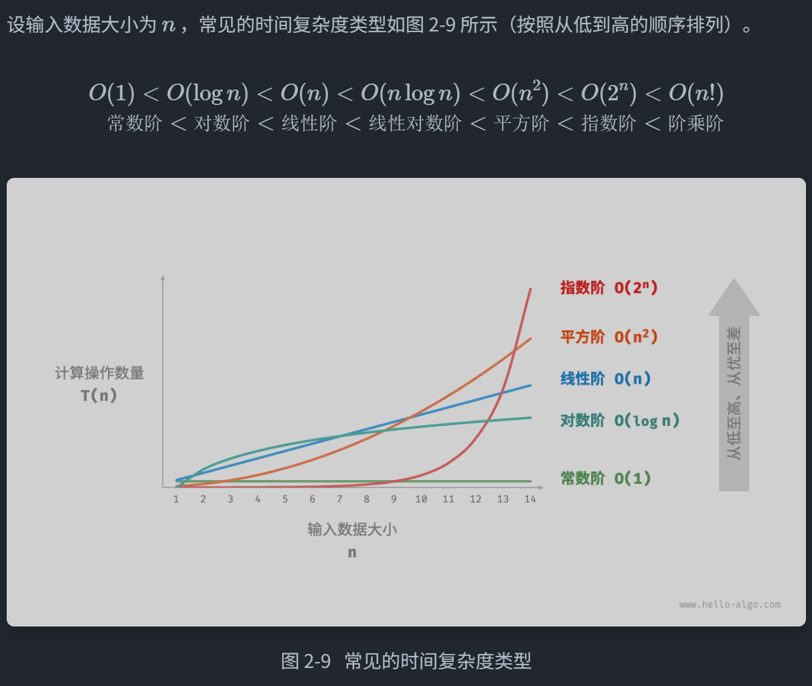

# 算法设计与分析

## 一、 时间复杂度计算

### 1. 迭代与递归

#### 1.1 迭代

##### 1.1.1 for循环

##### 1.1.2 while循环

##### 1.1.3 嵌套循环

#### 1.2 递归

递归每次调用自身，系统都会给新函数分配内存，因此递归更消耗内存，且调用函数会降低时间效率

函数的上下文数据存储在“栈帧空间”，函数返回后释放

##### 1.2.1 调用栈

函数的上下文数据存储在“栈帧空间”，函数返回后释放，递归可能会导致栈溢出

##### 1.2.2 尾递归（python、GO、JAVA等语言不支持，C/C++支持）

###### 定义：函数在返回时才进行递归调用，该函数会被编译器优化，空间效率与迭代相当

###### 原理：

- 普通函数会反复创建新栈帧
- 尾递归则是创建一个栈帧，每次替换掉参数（return来的），也可以说在反复复用栈帧

##### 1.2.3 递归树

#### 1.3 通过栈将递归转化为迭代

递归的操作类似于栈，故可用栈将递归转化为迭代

递归：（求一个数之和）

```c++
int sum(int n){
    if(n==1)
        return 1;
    return n+sum(n-1);
}

//尾递归
int sum(int n,int acc){
    if(n=0)
        return acc;
    return sum(n-1,acc+n);
}
```

转化为迭代

```c++
int Loop(int n){
    stack<int> stack;
    //stack,map等都不是关键字
    //res保存最终结果
    int res=0;
    //入栈
    for(int i=n;i>0;i--){
        stack.push(i);
    }
    //出栈
    while(!stack.empty()){
        res+=stack.top;
        stack.pop();
    }
    return res;
}
```

### 2. 复杂度



## 二、 C++存储空间

### 1. C++内存分区

1. 代码区：

   存储机器指令——编译后的代码

   只读

2. 静态区

   - 已初始化静态区

     存储已经初始化的全局变量、静态变量，由操作系统分配和回收

   - 未初始化静态区

     存储未初始化的全局变量、静态变量，由操作系统分配和回收，程序启动时自动初始化0

3. 常量区

   存储常量，只读，const修饰的全局常量也在这里

4. 栈区

   存储局部变量、函数参数、返回地址……

   由编译器分配释放，后进先出，空间小速度快，作用域结束后立即释放

   内存地址连续

5. 堆区

   动态分配的内存（例如malloc/new分配的）

   由程序员手动分配释放

   内存地址不连续

## 三、 数组与链表

### 1. 数组

线性数据结构，连续分布在内存中

#### 1.1 初始化

##### 1.1.1 栈初始化

```c++
int arr[5];
int nums[5]={1,2,3,4,5};
```

##### 1.1.2 堆初始化

```c++
int* arr1 = new int[5];
int* nums1 = new int[5]{1,2,3,4,5}
//释放
delete[] arr;
```

#### 1.2 插入元素

```c++
/* 在数组的索引 index 处插入元素 num */
void insert(int *nums, int size, int num, int index) {
   for(int i=size-1;i>index;i--){
       nums[i]=nums[i-1];
   }
    nums[index]=num;
}
```

#### 1.3 删除元素

```c++
/* 删除索引 index 处的元素 */
void remove(int *nums, int size, int index) {
   for(int i=index;i<size-1;i++){
       nums[i]=num[i+1];
   }
}
```

#### 1.4 扩容数组

扩容数组，则需重新建立一个更大的数组，然后把原数组元素依次复制到新数组

```c++
/* 扩展数组长度 */
int *extend(int *nums, int size, int enlarge) {
    // 初始化一个扩展长度后的数组
    int *res = new int[size + enlarge];
    // 将原数组中的所有元素复制到新数组
    for (int i = 0; i < size; i++) {
        res[i] = nums[i];
    }
    // 释放内存
    delete[] nums;
    // 返回扩展后的新数组
    return res;
}
```

### 2. 链表

保存当前元素以及下一个元素的地址，内存地址无需连续

组成单位：node（节点）

首个节点：head、尾节点：tail

tail指向nullptr

#### 2.1 构造链表

```c++
struct ListNode{
    int val;
    ListNode *next;
    //构造函数
    ListNode(int x):val(x),next(nullptr){};
    ListNode():val(0),next(nullptr){}
};
```

#### 2.2 初始化链表

```c++
ListNode* p1=new ListNode(1);
ListNode* p2=new ListNode(2);
p1->next=p2;
```

#### 2.3 插入节点

```c++
void insert(int n,ListNode *p0){
    ListNode* insert=new ListNode(n);
    insert->next=n0->next;
    n0->next=insert;
}
```

#### 2.4 删除节点

```c++
void remove(ListNode *n0){
    if(n0->next==nullptr){
        return;
    }
    ListNode *n1=n0->next;
    n0->next=n1->next;
    delete n1;
}
```

#### 2.5 访问节点

```c++
/* 访问链表中索引为 index 的节点 */
ListNode *access(ListNode *head, int index) {
   for(int i=0;i<index;i++){
       if(head==nullptr)
	  		return nullptr;
       head=head->next;
   }
   return head;
}
```

#### 2.6 查找节点

```c++
/* 在链表中查找值为 target 的首个节点 */
int find(ListNode *head, int target) {
    //找到
    int i=0;
    while(head->next!=nullptr){
        if(head->val==target){
            return i;
        }
        head=head->next;
        i++;
    }
    //找不到
    return -1;
}
```

#### 2.7 双向链表

```c++
struct ListNode{
    int val;
    ListNode *next;
    ListNode *prev;
    ListNode(int x):val(x),next(nullptr),prev(nullptr){}
}
```

### 3. 列表

使用动态数组实现列表——vector

#### 3.1 初始化列表

```c++
vector<int> nums;
vector<int> nums1 = {1,2,3,4,5};
//访问
int num=nums[0];
//修改
nums[0]=1
```

#### 3.2 插入和删除

```c++
//清空列表
nums.clear();
//在尾部插入元素
nums.push_back(1);
//在中间插入元素
nums.insert(nums.begin()+3,6);//在索引3处插入6

/*
	nums.begin()返回首元素的迭代器，类似于指针
    如果你要访问对应的数据应该用 *nums.begin() 此时返回的是对应值
    *nums.begin()这一步叫做解引用迭代器
    迭代器+n就是第几个元素
*/

//删除元素
nums.erase(nums.begin()+3);
```

#### 3.3 遍历列表

通过求列表元素和举例

- 直接遍历——通过for（声明 ：对象）

  ```c++
  count = 0;
  for(int num:nums){
      count+=num;
  }
  ```

- 索引遍历

  ```c++
  count = 0;
  for(int i=0;i<nums.size();i++){
      count += nums[i];
  }
  ```

#### 3.4 拼接列表

```c++
vector<int> nums1 = {1,2,3};
vector<int> nums2 = {4,5,6};
nums1.insert(nums1.end(),nums1.begin(),nums1.end());
```

#### 3.5 排序列表

```c++
sort(nums.begin(),nums.end());
```

#### 3.6 列表结构体实现

```c++
class MyList{
    //初始容量，数量记录，扩容机制
    private:
    	int *arr;//指向数组的指针
    	int size = 10;//初始容量
    	int nums = 0;//数量记录
     	int extend = 2;//扩容倍数
    
    public:
    	//构造方法
    	MyList(){
            arr = new int[size];
        }
    
    	//释放列表
    	~MyList(){
            delete[] arr;
        }
    
    	//获取列表长度
    	int size(){
            return nums;
        }
    
    	//获取列表容量
    	int capacity(){
            return size;
        }
    
    	//访问元素
    	int get(int index){
            if(index>=size()||index<0){
                throw out_of_range("索引越界")；
            }
            return arr[index];
        }
    	
    	// 更新元素
 	    void set(int index, int num) {
 	       if (index < 0 || index >= size())
 	           throw out_of_range("索引越界");
	        arr[index] = num;
	    }
    
    	//在尾部添加元素
    	void push_back(int num){
            // 元素数量超出容量时，触发扩容机制
  	      if (size() == capacity())
 	           extendCapacity();
  	      arr[size()] = num;
 	       // 更新元素数量
 	       nums++;
        }
    
    	//在中间插入元素
		void insert(int index,int num){
			if (index < 0 || index >= size())
				throw out_of_range("索引越界");
			// 元素数量超出容量时，触发扩容机制
			if (size() == capacity())
				extendCapacity();
			// 将索引 index 以及之后的元素都向后移动一位
			for (int j = size() - 1; j >= index; j--) {
				arr[j + 1] = arr[j];
			}
			arr[index] = num;
			// 更新元素数量
			nums;
		}
    	
}
```

### 4. 总结

1. 数组初始化后长度不可变；链表长度灵活，但内存占用较多
2. 列表可以调整长度，也有数组的相关功能
3. 列表扩容要申请一个新的内存移过去

## 四、 栈和队列

### 1. 栈

先入后出

#### 1.1常见操作

- push()     入栈
- pop()       出栈（无返回值）
- peek()      访问栈顶元素

```c++
//初始化
stack<int> stack;

//入栈
stack.push(1);
stack.push(2);

//访问栈顶元素
int num = stack.top();

//出栈
stack.pop();

//获取长度
int size=stack.size();

//判断空
bool empty = stack.empty();
```

#### 1.2 栈的实现

##### 1.2.1 链表实现栈

```c++
class LinkListStack{
    private:
    	ListNode *stackTop;//栈顶
    	int stkSize;//栈的长度
    
    public:
    	//构造函数
    	LinkListStack(){
            stackTop = nullptr;
            stkSize = 0;
        }
    
    	//删除链表
    	~LinkListStack(){
            // 遍历链表删除节点，释放内存
             freeMemoryLinkedList(stackTop);
        }
    
    	/*
    		void freeMemoryLinkedList(Node* head) {
				Node* tmp;
				while (head != nullptr) {
					tmp = head;
					head = head->next;
					delete tmp; // C++ 用 delete，C 用 free(tmp)
				}
			}
    	*/
    	
    	/* 获取栈的长度 */
    	int size() {
        	return stkSize;
    	}

    	/* 判断栈是否为空 */
    	bool isEmpty() {
        	return size() == 0;
    	}

	    /* 入栈 */
	    void push(int num) {
	        ListNode *node = new ListNode(num);
	        node->next = stackTop;
	        stackTop = node;
	        stkSize++;
	    }

	    /* 出栈 */
	    int pop() {
	        int num = top();
	        ListNode *tmp = stackTop;
	        stackTop = stackTop->next;
	        // 释放内存
	        delete tmp;
	        stkSize--;
	        return num;
	    }

    	/* 访问栈顶元素 */
    	int top() {
	        if (isEmpty())
	            throw out_of_range("栈为空");
	        return stackTop->val;
	    }

	    /* 将 List 转化为 Array 并返回 */
	    vector<int> toVector() {
	        ListNode *node = stackTop;
	        vector<int> res(size());
	        for (int i = res.size() - 1; i >= 0; i--) {
				res[i] = node->val;
				node = node->next;
	        }
	        return res;
	    }
}
```

##### 1.2.2 数组实现栈

```c++
/* 基于数组实现的栈 */
class ArrayStack {
  private:
    vector<int> stack;

  public:
    /* 获取栈的长度 */
    int size() {
        return stack.size();
    }

    /* 判断栈是否为空 */
    bool isEmpty() {
        return stack.size() == 0;
    }

    /* 入栈 */
    void push(int num) {
        stack.push_back(num);
    }

    /* 出栈 */
    int pop() {
        int num = top();
        stack.pop_back();
        return num;
    }

    /* 访问栈顶元素 */
    int top() {
        if (isEmpty())
            throw out_of_range("栈为空");
        return stack.back();
    }

    /* 返回 Vector */
    vector<int> toVector() {
        return stack;
    }
};
```

### 2. 队列

先入先出

#### 1.1常见操作

- push()     入队
- pop()       出队（无返回值）
- peek()      访问队首元素

```c++
//初始化
queue<int> queue;

//入队
queue.push(1);
queue.push(2);

//访问队首元素
int top = queue.front();

//出队
queue.pop();

//队列长度
int size = queue.size();

//队列空
bool empty = =queue.empty;
```

### 3.双向队列

允许在头部和尾部执行元素的添加或删除操作

#### 常用操作

- 将元素添加到队首	push_front()
- 将元素添加至队尾        push_back()
- 删除队首                       pop_front()
- 删除队尾                       pop_back()
- 访问队首                       front()
- 访问队尾                       back()

```c++
//初始化
deque<int> deque;

//入队
deque.push_back(2);   // 添加至队尾
deque.push_back(5);
deque.push_back(4);
deque.push_front(3);  // 添加至队首
deque.push_front(1);

//访问元素
int front = deque.front(); // 队首元素
int back = deque.back();   // 队尾元素

//出队
deque.pop_front();  // 队首元素出队
deque.pop_back();   // 队尾元素出队

//获得队列长度
int size = deque.size();

//队列空
bool empty = deque.empty();
```

## 五、 哈希表

通过建立key与value之间的映射，实现查询，O(1)。

### 1. 常用操作

```c++
//初始化
unordered_map<int,string> map;

//在哈希表中添加
map[12345] = "john";
map[66666] = "jee";

//查询
string name = map[66666];

//删除
map.erase(66666);
```

**哈希表遍历**

```c++
//遍历哈希表
    //遍历键值对
    for (auto kv: map) {
        cout << kv.first << "->" << kv.second << endl;
    }

    //使用迭代器遍历键值对
    for (auto iter = map.begin();iter != map.end();iter++) {
        cout<< iter->first << "->" << iter->second << endl;
    }
```

### 2. 哈希表的实现

当用一个数组实现hash表时：

数组中的每一个位置称为一个bucket（桶），存储一个key-value对

查询就是找到key对应的桶输出value

那么，如何找到对应的桶：

1. 设置一个hash函数，当输入一个key时，通过hash函数就能得到一个hash值( hash(key) )

2. 将hash值做如下操作（capacity是 桶的数量/数组长度）：

   ​	index = hash(key) % capacity

3. 通过index找到对应的桶，获得value

### 3. hash冲突与扩容

hash冲突：多个输入对应相同输出，解决方式即为扩容（hash冲突无法避免）

扩容：申请新的hash表，将表的所有元素迁移过去

负载因子：衡量hash冲突的严重程度，是hash表扩容的触发条件

​			**hash元素数量/桶数量**

### 4. hash表结构改良

改良后hash可以在出现hash冲突时正常工作

#### 4.1 链式地址


将存放的单个元素改为存放一个链表，节点就是key-value对，发生冲突的kv放在同一个链表中。

##### hash表操作方法：

- 查询：输入key，找到对应桶，从头结点遍历链表找到对应kv对
- 添加：将key通过hash访问头节点，加入链表
- 删除：key通过hash函数遍历链表并删除

##### 链式hash的局限性

- 空间占用大
- 查询效率低：依旧需要遍历

#### 4.2 开放寻址

通过多次探测处理hash冲突

不能直接删除元素，会导致空桶

采用懒删除来移除元素，用一个常量TOMBSTONE标记空桶，但TOMBSTONE可能导致hash表性能退化，为了防止出现退化，可以将搜索到的目标与TOMBSTONE交换位置，优化查询效率。

##### 4.2.1 线性探测

采用固定步长进行探测

- 插入元素：通过hash函数找到桶索引之后，如果桶中有元素，从冲突位置向后以固定步长遍历，一直到找到空桶并插入
- 查找元素：在发生hash冲突后以固定步长向后遍历，一直到找到对应的元素，返回value；如果遇到空桶，返回None，说明元素不在hash表中

缺点：容易聚集，当数组中连续被占用的位置越长，连续位置发生hash冲突的可能性越大，导致效率劣化

##### 4.2.2 平方探测

跳过探测数的平方（1，4，9），用于缓解聚集，数据分布更均匀

##### 4.2.3 多次哈希

使用多个hash函数探测，直到找到空位

查找时候尝试所有hash函数后返回None

#### 4.3 hash算法

设计目标：

- 确定性
- 效率高
- 均匀分布

##### **hash算法设计**

- 加法hash：对输入的每个字符的 ASCII 码进行相加
- 乘法hash：利用乘法的不相关性，每轮乘以一个常数，将各个字符的 ASCII 码累积到哈希值中
- 异或hash：将输入数据的每个元素通过异或操作累积到一个哈希值中
- 旋转hash：将每个字符的 ASCII 码累积到一个哈希值中，每次累积之前都会对哈希值进行旋转操作

## 六、 树

### 1. 二叉树

结构体：

```c++
struct TreeNode{
    int val;
    TreeNode *left;
    TreeNode *right;
    TreeNode(int x) : val(x) , left(nullptr) , right(nullptr){}
};
```

 初始化

```c++
TreeNode* n1=new TreeNode(1);
```

### 2. 常见的二叉树

#### 2.1 完美二叉树

所有层的所有节点均被填满

#### 2.2 完全二叉树

从左到右必须连续填充

#### 2.3 完满二叉树

所有节点均有两个子节点

#### 2.4 平衡二叉树

左右子树高度不超过1

### 3. 二叉树遍历

#### 3.1 层序遍历

从顶部到底部遍历二叉树并在每一层从左到右访问节点(广度优先，BFS)

通过队列来实现

```c++
/* 层序遍历 */
vector<int> levelOrder(TreeNode *root) {
    // 初始化队列，加入根节点
    queue<TreeNode *> queue;
    queue.push(root);
    // 初始化一个列表，用于保存遍历序列
    vector<int> vec;
    while (!queue.empty()) {
        TreeNode *node = queue.front();
        queue.pop();              // 队列出队
        vec.push_back(node->val); // 保存节点值
        if (node->left != nullptr)
            queue.push(node->left); // 左子节点入队
        if (node->right != nullptr)
            queue.push(node->right); // 右子节点入队
    }
    return vec;
}
```

#### 3.2 前、中、后序遍历

```c++
/* 前序遍历 */
void preOrder(TreeNode *root) {
    if (root == nullptr)
        return;
    // 访问优先级：根节点 -> 左子树 -> 右子树
    vec.push_back(root->val);
    preOrder(root->left);
    preOrder(root->right);
}

/* 中序遍历 */
void inOrder(TreeNode *root) {
    if (root == nullptr)
        return;
    // 访问优先级：左子树 -> 根节点 -> 右子树
    inOrder(root->left);
    vec.push_back(root->val);
    inOrder(root->right);
}

/* 后序遍历 */
void postOrder(TreeNode *root) {
    if (root == nullptr)
        return;
    // 访问优先级：左子树 -> 右子树 -> 根节点
    postOrder(root->left);
    postOrder(root->right);
    vec.push_back(root->val);
}
```

### 4. 二叉搜索树

1. 对于根节点，左子树中所有节点的值 < 根节点的值 < 右子树中所有节点的值
2. 任意节点的左、右子树也是二叉搜索树，即同样满足条件1

#### 4.1 查找节点

```c++
/* 查找节点 */
TreeNode *search(int num) {
    TreeNode *cur = root;
    // 循环查找，越过叶节点后跳出
    while (cur != nullptr) {
        // 目标节点在 cur 的右子树中
        if (cur->val < num)
            cur = cur->right;
        // 目标节点在 cur 的左子树中
        else if (cur->val > num)
            cur = cur->left;
        // 找到目标节点，跳出循环
        else
            break;
    }
    // 返回目标节点
    return cur;
}
```

#### 4.2 插入节点

```c++
/* 插入节点 */
void insert(int num) {
    // 若树为空，则初始化根节点
    if (root == nullptr) {
        root = new TreeNode(num);
        return;
    }
    TreeNode *cur = root, *pre = nullptr;
    // 循环查找，越过叶节点后跳出
    while (cur != nullptr) {
        // 找到重复节点，直接返回
        if (cur->val == num)
            return;
        pre = cur;
        // 插入位置在 cur 的右子树中
        if (cur->val < num)
            cur = cur->right;
        // 插入位置在 cur 的左子树中
        else
            cur = cur->left;
    }
    // 插入节点
    TreeNode *node = new TreeNode(num);
    if (pre->val < num)
        pre->right = node;
    else
        pre->left = node;
}
```

#### 4.3 删除节点

```c++
/* 删除节点 */
void remove(int num , TreeNode* root) {
    if(root == nullptr)
        return;
    TreeNode *cur = root , *pre = nullptr;
    while (cur != nullptr) {
        // 找到待删除节点，跳出循环
        if (cur->val == num)
            break;
        pre = cur;
        // 待删除节点在 cur 的右子树中
        if (cur->val < num)
            cur = cur->right;
        // 待删除节点在 cur 的左子树中
        else
            cur = cur->left;
    }
    // 若无待删除节点，则直接返回
    if (cur == nullptr)
        return;
    // 子节点数量 = 0 or 1
    if (cur->left == nullptr || cur->right == nullptr) {
        // 当子节点数量 = 0 / 1 时， child = nullptr / 该子节点
        TreeNode *child = cur->left != nullptr ? cur->left : cur->right;
        // 删除节点 cur
        if (cur != root) {
            if (pre->left == cur)
                pre->left = child;
            else
                pre->right = child;
        } else {
            // 若删除节点为根节点，则重新指定根节点
            root = child;
        }
        // 释放内存
        delete cur;
    }
    // 子节点数量 = 2
    else {
        // 获取中序遍历中 cur 的下一个节点
        TreeNode *tmp = cur->right;
        while (tmp->left != nullptr) {
            tmp = tmp->left;
        }
        int tmpVal = tmp->val;
        // 递归删除节点 tmp
        remove(tmp->val);
        // 用 tmp 覆盖 cur
        cur->val = tmpVal;
    }
}
```

### 5. AVL树

满足二叉搜索树，也满足平衡二叉树——平衡二叉搜索树

#### 5.1 节点高度

```c++
struct TreeNode{
    int val{};
    int height{};
    TreeNode *left{};
    TreeNode *right{};
    TreeNode() = default;//默认构造函数
    explicit TreeNode(int x) : val(x){}//这是一个带参数的构造函数，用于初始化节点值。
//explicit 关键字防止隐式类型转换，避免像 TreeNode node = 5; 这样的代码（防止出现隐式从 int 到 TreeNode 的转换）。
}
```

“节点高度”是指从该节点到它的最远叶节点的距离，即所经过的“边”的数量。需要特别注意的是，叶节点的高度为 0 ，而空节点的高度为 −1 。

```c++
/* 获取节点高度 */
int height(TreeNode *node) {
    // 空节点高度为 -1 ，叶节点高度为 0
    return node == nullptr ? -1 : node->height;
}

/* 更新节点高度 */
void updateHeight(TreeNode *node) {
    // 节点高度等于最高子树高度 + 1
    node->height = max(height(node->left), height(node->right)) + 1;
}
```

节点的平衡因子（balance factor）定义为节点左子树的高度减去右子树的高度，同时规定空节点的平衡因子为 0 。我们同样将获取节点平衡因子的功能封装成函数

```c++
/* 获取平衡因子 */
int balanceFactor(TreeNode *node) {
    // 空节点平衡因子为 0
    if (node == nullptr)
        return 0;
    // 节点平衡因子 = 左子树高度 - 右子树高度
    return height(node->left) - height(node->right);
}
```

#### 5.2 AVL树旋转

| 失衡节点的平衡因子 | 子节点的平衡因子 | 应采用的旋转方法 |
| :----------------- | :--------------- | :--------------- |
| >1 （左偏树）      | ≥0               | 右旋             |
| >1 （左偏树）      | <0               | 先左旋后右旋     |
| <−1 （右偏树）     | ≤0               | 左旋             |
| <−1 （右偏树）     | >0               | 先右旋后左旋     |

## 六、 堆

堆（heap）是一种满足特定条件的完全二叉树，分为两种类型：

- 小顶堆（min heap）：任意节点的值 ≤ 其子节点的值。
- 大顶堆（max heap）：任意节点的值 ≥ 其子节点的值。

堆作为完全二叉树的一个特例，具有以下特性：

- 最底层节点靠左填充，其他层的节点都被填满。
- 我们将二叉树的根节点称为“堆顶”，将底层最靠右的节点称为“堆底”。
- 对于大顶堆（小顶堆），堆顶元素（根节点）的值是最大（最小）的。

### 1. 堆操作

```c++
push();
pop();
top()://访问堆顶元素
size();//获取元素数量
isEmpty()://空？

//初始化
// 初始化小顶堆
priority_queue<int, vector<int>, greater<int>> minHeap;
// 初始化大顶堆
priority_queue<int, vector<int>, less<int>> maxHeap;
/* 输入列表并建堆 */
vector<int> input{1, 3, 2, 5, 4};
priority_queue<int, vector<int>, greater<int>> minHeap(input.begin(), input.end());
```

### 2. 元素入堆

给定元素 val ，我们首先将其添加到堆底。添加之后，由于 val 可能大于堆中其他元素，堆的成立条件可能已被破坏，**因此需要修复从插入节点到根节点的路径上的各个节点**，这个操作被称为堆化（heapify）。

```c++
/* 元素入堆 */
void push(int val) {
    // 添加节点
    maxHeap.push_back(val);
    // 从底至顶堆化
    siftUp(size() - 1);
}

/* 从节点 i 开始，从底至顶堆化 */
void siftUp(int i) {
    while (true) {
        // 获取节点 i 的父节点
        int p = parent(i);
        // 当“越过根节点”或“节点无须修复”时，结束堆化
        if (p < 0 || maxHeap[i] <= maxHeap[p])
            break;
        // 交换两节点
        swap(maxHeap[i], maxHeap[p]);
        // 循环向上堆化
        i = p;
    }
}
```

### 3. 出堆

1. 交换堆顶元素与堆底元素（交换根节点与最右叶节点）。
2. 交换完成后，将堆底从列表中删除（注意，由于已经交换，因此实际上删除的是原来的堆顶元素）。
3. 从根节点开始，**从顶至底执行堆化**

```c++
/* 元素出堆 */
void pop() {
    // 判空处理
    if (isEmpty()) {
        throw out_of_range("堆为空");
    }
    // 交换根节点与最右叶节点（交换首元素与尾元素）
    swap(maxHeap[0], maxHeap[size() - 1]);
    // 删除节点
    maxHeap.pop_back();
    // 从顶至底堆化
    siftDown(0);
}

/* 从节点 i 开始，从顶至底堆化 */
void siftDown(int i) {
    while (true) {
        // 判断节点 i, l, r 中值最大的节点，记为 ma
        int l = left(i), r = right(i), ma = i;
        if (l < size() && maxHeap[l] > maxHeap[ma])
            ma = l;
        if (r < size() && maxHeap[r] > maxHeap[ma])
            ma = r;
        // 若节点 i 最大或索引 l, r 越界，则无须继续堆化，跳出
        if (ma == i)
            break;
        swap(maxHeap[i], maxHeap[ma]);
        // 循环向下堆化
        i = ma;
    }
}
```

### 4. 建堆

使用一个列表的所有元素来构建一个堆

建堆方法：

1. 将列表所有元素原封不动地添加到堆中，此时堆的性质尚未得到满足。
2. 倒序遍历堆（层序遍历的倒序），依次对每个非叶节点执行“从顶至底堆化”

**每当堆化一个节点后，以该节点为根节点的子树就形成一个合法的子堆**

**由于叶节点没有子节点，因此它们天然就是合法的子堆，无须堆化**

### 5. Top-k问题

给定一个长度为 n 的无序数组 `nums` ，请返回数组中最大的 k 个元素。

1. 初始化一个小顶堆，其堆顶元素最小。
2. 先将数组的前 k 个元素依次入堆。
3. 从第 k+1 个元素开始，若当前元素大于堆顶元素，则将堆顶元素出堆，并将当前元素入堆。
4. 遍历完成后，堆中保存的就是最大的 k 个元素。

## 七、 图

图 G 抽象地表示为一组顶点 V 和一组边 E 的集合

将顶点看作节点，将边看作连接各个节点的引用（指针），我们就可以将图看作一种从链表拓展而来的数据结构

### 7.1 常见图

分为无向图和有向图在无向图中

- 在有向图中，边具有方向性，即 A→B 和 A←B 两个方向的边是相互独立的，例如微博或抖音上的“关注”与“被关注”关系
- 在无向图中，边表示两顶点之间的“双向”连接关系，例如微信或 QQ 中的“好友关系”

根据所有顶点是否连通，可分为连通图和非连通图

- 对于连通图，从某个顶点出发，可以到达其余任意顶点
- 对于非连通图，从某个顶点出发，至少有一个顶点无法到达

常用术语：

- 邻接（adjacency）：当两顶点之间存在边相连时，称这两顶点“邻接”
- 路径（path）：从顶点 A 到顶点 B 经过的边构成的序列被称为从 A 到 B 的“路径”
- 度（degree）：一个顶点拥有的边数。对于有向图，入度（in-degree）表示有多少条边指向该顶点，出度（out-degree）表示有多少条边从该顶点指出。

### 7.2 图的表示

#### 7.2.1 邻接矩阵

设图的顶点数量为 n ，邻接矩阵（adjacency matrix）使用一个 n×n 大小的矩阵来表示图，每一行（列）代表一个顶点，矩阵元素代表边，用 1 或 0 表示两个顶点之间是否存在边

#### 7.2.2 邻接表

邻接表（adjacency list）使用 n 个链表来表示图，链表节点表示顶点。第 i 个链表对应顶点 i ，其中存储了该顶点的所有邻接顶点（与该顶点相连的顶点）

### 7.3 图的遍历

#### 7.3.1 广度优先BFS

优先访问最近的顶点，一层层向外扩张

##### 算法实现

通过队列实现

1. 将遍历起始顶点 `startVet` 加入队列，并开启循环
2. 在循环的每轮迭代中，弹出队首顶点并记录访问，然后将该顶点的所有邻接顶点加入到队列尾部
3. 循环步骤 `2` ，直到所有顶点被访问完毕后结束
4. 为了防止重复遍历顶点，我们需要借助一个哈希集合 `visited` 来记录哪些节点已被访问
5. 哈希集合可以看作一个只存储 `key` 而不存储 `value` 的哈希表，它可以在 O(1) 时间复杂度下进行 `key` 的增删查改操作。根据 `key` 的唯一性，哈希集合通常用于数据去重等场景

```c++
/* 广度优先遍历 */
// 使用邻接表来表示图，以便获取指定顶点的所有邻接顶点
vector<Vertex *> graphBFS(GraphAdjList &graph, Vertex *startVet) {
    // 顶点遍历序列
    vector<Vertex *> res;
    // 哈希集合，用于记录已被访问过的顶点
    unordered_set<Vertex *> visited = {startVet};
    // 队列用于实现 BFS
    queue<Vertex *> que;
    que.push(startVet);
    // 以顶点 vet 为起点，循环直至访问完所有顶点
    while (!que.empty()) {
        Vertex *vet = que.front();
        que.pop();          // 队首顶点出队
        res.push_back(vet); // 记录访问顶点
        // 遍历该顶点的所有邻接顶点
        for (auto adjVet : graph.adjList[vet]) {
            if (visited.count(adjVet))
                continue;            // 跳过已被访问的顶点
            que.push(adjVet);        // 只入队未访问的顶点
            visited.emplace(adjVet); // 标记该顶点已被访问
        }
    }
    // 返回顶点遍历序列
    return res;
}
```

#### 7.3.1 深度优先DFS

**深度优先遍历是一种优先走到底、无路可走再回头的遍历方式**

```c++
/* 深度优先遍历辅助函数 */
void dfs(GraphAdjList &graph, unordered_set<Vertex *> &visited, vector<Vertex *> &res, Vertex *vet) {
    res.push_back(vet);   // 记录访问顶点
    visited.emplace(vet); // 标记该顶点已被访问
    // 遍历该顶点的所有邻接顶点
    for (Vertex *adjVet : graph.adjList[vet]) {
        if (visited.count(adjVet))
            continue; // 跳过已被访问的顶点
        // 递归访问邻接顶点
        dfs(graph, visited, res, adjVet);
    }
}

/* 深度优先遍历 */
// 使用邻接表来表示图，以便获取指定顶点的所有邻接顶点
vector<Vertex *> graphDFS(GraphAdjList &graph, Vertex *startVet) {
    // 顶点遍历序列
    vector<Vertex *> res;
    // 哈希集合，用于记录已被访问过的顶点
    unordered_set<Vertex *> visited;
    dfs(graph, visited, res, startVet);
    return res;
}
```

## 八、 查找

### 1. 二分查找

利用数据的有序性，每轮缩小一半搜索范围，直至找到目标元素或搜索区间为空为止

```c++
/* 二分查找（双闭区间） */
int binarySearch(vector<int> &nums, int target) {
    // 初始化双闭区间 [0, n-1] ，即 i, j 分别指向数组首元素、尾元素
    int i = 0, j = nums.size() - 1;
    // 循环，当搜索区间为空时跳出（当 i > j 时为空）
    while (i <= j) {
        int m = i + (j - i) / 2; // 计算中点索引 m
        if (nums[m] < target)    // 此情况说明 target 在区间 [m+1, j] 中
            i = m + 1;
        else if (nums[m] > target) // 此情况说明 target 在区间 [i, m-1] 中
            j = m - 1;
        else // 找到目标元素，返回其索引
            return m;
    }
    // 未找到目标元素，返回 -1
    return -1;
}
```

## 九、 排序

### 1. 选择排序

开启一个循环，每轮从未排序区间选择最小的元素，将其放到已排序区间的末尾

```c++
/* 选择排序 */
void selectionSort(vector<int> &nums) {
    int n = nums.size();
    // 外循环：未排序区间为 [i, n-1]
    for (int i = 0; i < n - 1; i++) {
        // 内循环：找到未排序区间内的最小元素
        int k = i;
        for (int j = i + 1; j < n; j++) {
            if (nums[j] < nums[k])
                k = j; // 记录最小元素的索引
        }
        // 将该最小元素与未排序区间的首个元素交换
        swap(nums[i], nums[k]);
    }
}
```

### 2. 冒泡排序

从数组最左端开始向右遍历，依次比较相邻元素大小，如果“左元素 > 右元素”就交换二者。遍历完成后，最大的元素会被移动到数组的最右端

### 3. 插入排序

我们在未排序区间选择一个基准元素，将该元素与其左侧已排序区间的元素逐一比较大小，并将该元素插入到正确的位置

### 4. 快速排序

选择数组中的某个元素作为“基准数”，将所有小于基准数的元素移到其左侧，而大于基准数的元素移到其右侧

1. 选取数组最左端元素作为基准数，初始化两个指针 `i` 和 `j` 分别指向数组的两端。
2. 设置一个循环，在每轮中使用 `i`（`j`）分别寻找第一个比基准数大（小）的元素，然后交换这两个元素。
3. 循环执行步骤 `2.` ，直到 `i` 和 `j` 相遇时停止，最后将基准数交换至两个子数组的分界线。

### 5. 归并排序

1. **划分阶段**：通过递归不断地将数组从中点处分开，将长数组的排序问题转换为短数组的排序问题。
2. **合并阶段**：当子数组长度为 1 时终止划分，开始合并，持续地将左右两个较短的有序数组合并为一个较长的有序数组，直至结束。

### 6. 堆排序

1. 输入数组并建立大顶堆。完成后，最大元素位于堆顶。
2. 将堆顶元素（第一个元素）与堆底元素（最后一个元素）交换。完成交换后，堆的长度减 1 ，已排序元素数量加 1 。
3. 从堆顶元素开始，从顶到底执行堆化操作（sift down）。完成堆化后，堆的性质得到修复。
4. 循环执行第 `2.` 步和第 `3.` 步。循环 n−1 轮后，即可完成数组排序。

### 7. 桶排序

设置一些具有大小顺序的桶，每个桶对应一个数据范围，将数据平均分配到各个桶中；然后，在每个桶内部分别执行排序；最终按照桶的顺序将所有数据合并

### 8. 计数排序

1. 遍历数组，找出其中的最大数字，记为 m ，然后创建一个长度为 m+1 的辅助数组 `counter` 
2. **借助 `counter` 统计 `nums` 中各数字的出现次数**，其中 `counter[num]` 对应数字 `num` 的出现次数。统计方法很简单，只需遍历 `nums`（设当前数字为 `num`），每轮将 `counter[num]` 增加 1 即可
3. **由于 `counter` 的各个索引天然有序，因此相当于所有数字已经排序好了**。接下来，我们遍历 `counter` ，根据各数字出现次数从小到大的顺序填入 `nums` 即可

## 十、 分治

分（划分）和治（合并）两个阶段，通常基于递归实现

### 1. 二分查找

```c++
/* 二分查找：问题 f(i, j) */
int dfs(vector<int> &nums, int target, int i, int j) {
    if (i > j){
        return -1;
    }
    int m = (i + j) / 2;
    if(nums[m] < target){
        return dfs(nums , target , m+1 , j);
    }else if(nums[m] > target){
        return dfs(nums , target , i , m-1);
    }else{
        return m;
    }
}

/* 二分查找 */
int binarySearch(vector<int> &nums, int target) {
    int n = nums.size();
    // 求解问题 f(0, n-1)
    return dfs(nums, target, 0, n - 1);
}
```

