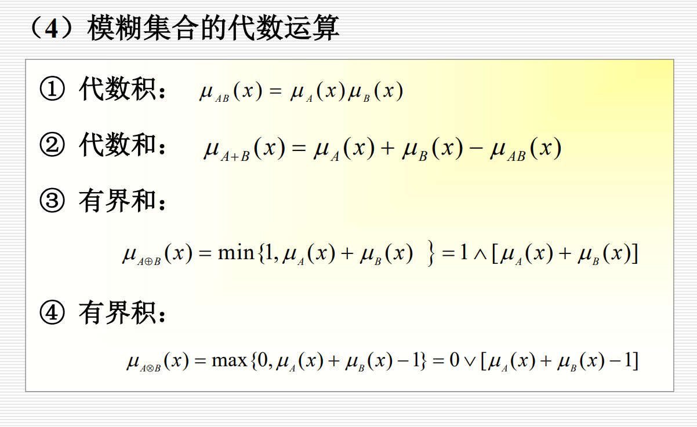

# 考点

## 重点内容目录

- [人工智能的主要研究与应用领域（重点）](#人工智能的主要研究与应用领域重点)
- [主要知识表示方法（重点）](#主要知识表示方法重点)
- [推理方向（重点）](#推理方向重点)
- [归结演绎推理（重点难点）](#归结演绎推理重点难点)
- [可信度方法 (C-F模型)（重点）](#可信度方法-c-f模型重点)
- [结论合成（重点公式）](#结论合成重点公式)
- [证据理论核心概念（重点！！）](#证据理论核心概念重点)
- [可信度方法（重点！！）](#可信度方法重点)
- [不确定性推理（重点！！）](#43不确定性推理重点)
- [模糊集合运算，代数运算（重点！！）](#443-模糊集合运算代数运算重点)
- [A*算法（重点）](#a算法重点)
- [KDD的一般过程（重点流程）](#kdd的一般过程重点流程)
- [BP神经网络（重点）](#bp神经网络重点)
- [多智能体系统的协商（重点）](#96-多智能体系统的协商重点)

---

## 1

智能的特征： 感知能力、记忆与思维能力、学习和自适应能力、行为能力

人工智能的定义与目标

- 定义： 研究、开发用于模拟、延伸和扩展人的智能的理论、方法、技术及应用系统。
- 目标： 制造智能机器（强AI）或实现智能行为（弱AI）。

人工智能的主要研究与应用领域（重点）{#人工智能的主要研究与应用领域重点}

- 机器感知： 机器视觉、机器听觉（语音识别）。
- 机器思维： 知识表示、推理、规划、机器学习。
- 机器学习： 机械学习、类比学习、归纳学习、连接学习等。
- 机器行为： 智能机器人、自动程序设计。
- 具体应用： 专家系统、自然语言理解、智能CAI、智能CAD、智能操作系统等。

人工智能的研究途径与方法

- 符号主义 (Symbolism)： 基于物理符号系统假设，认为智能的核心是知识表示与推理。
- 连接主义 (Connectionism)： 模拟人脑神经元结构，通过神经网络学习。
- 行为主义 (Actionism)： 强调"感知-行动"的闭环，通过与环境交互产生智能（如反应式Agent）。

## 2

知识与知识表示的概念

- 知识： 对客观世界的认识与经验，是信息关联形成的信息结构。
- 知识表示： 将知识用计算机可处理的形式化模式描述出来。

知识的特性

- 相对正确性
- 不确定性
-  可表示性与可利用性

主要知识表示方法（重点）{#主要知识表示方法重点}

一阶谓词逻辑

- 优点： 自然性，精确性， 严密性，容易实现
- 缺点： 效率低，难以表示不确定性和不完全知识，组合爆炸

产生式表示法（规则表示法）

- 形式： `IF THEN (可信度)`
- 优点：自然性、模块性、有效性、清晰性
- 缺点：效率不高、不能表达结构性知识
- 应用： 专家系统的核心表示方法。

框架表示法

- 结构： 由"框架名"、"槽(Slot)"、"侧面(Facet)"和"值(Value)"构成。支持继承。
- 优点： 结构化强，善于表示结构性知识（如对象、场景）。
- 例子： 教师框架、教室框架、地震消息框架。

语义网络

- 结构： 用"节点"表示实体或概念，用"有向弧"表示它们之间的关系。
- 优点： 直观、可视化，便于表示事物间的语义联系。

知识图谱 (Knowledge Graph)

- 本质： 大规模的语义网络，以"实体-关系-实体"三元组为基础。
- 典型应用： 语义搜索、知识问答（如Siri）、大数据分析、社交网络、数字商业。
- 关键技术： 实体识别、关系抽取、知识融合、知识推理。

命题：非真即假的陈述句

谓词公式的性质

谓词公式的解释：谓词公式在个体域上的解释是个体域中的实体对谓词演算表达式的每个常量、变量、谓词和函数符号的指派。对于每一个解释,谓词公式都可求出一个真值(T或F)。

谓词公式的永真性、可满足性、不可满足性：

- 永真性：如果谓词公式P对个体域D上的任何一个解释都取得真值T,则称P在D上是永真的。如果P在每个非空个体域上均永真,则称P永真。
- 可满足性：对于谓词公式P,如果至少存在一个解释使得P在此解释下的真值为T,则称P是可满足的。
- 不可满足性：如果谓词公式P对个体域D上的任何一个解释都取得假值F,则称P在D上是永假的。如果P在每个非空个体域上均永假,则称P永假。

谓词公式的等价性：设P与Q是两个谓词公式,D是它们共同的个体域,若对D上的任何一个解释,P与Q都有相同的真值,则称公式P和Q在D上是等价的。常见等价关系包括：

- 否定之否定：﹁(﹁P)等价于P
- 蕴含式转化：P→Q等价于﹁P∨Q
- 德·摩根定律：﹁(P∨Q)等价于﹁P∧﹁Q
- 分配律：P∧(Q∨R)等价于(P∧Q)∨(P∧R)
- 逆否律：P→Q等价于﹁Q→﹁P

量词转换律：

- 量词否定：
  - ﹁(∃x)P(x)等价于(∀x)[﹁P(x)]
  - ﹁(∀x)P(x)等价于(∃x)[﹁P(x)]
- 量词分配：
  - (∀x)[P(x)∧Q(x)]等价于(∀x)P(x)∧(∀x)Q(x)
  - (∃x)[P(x)∨Q(x)]等价于(∃x)P(x)∨(∃x)Q(x)

谓词公式的永真蕴含：对于谓词公式P与Q,如果P→Q永真,则称公式P永真蕴含Q,且称Q为P的逻辑结论,称P为Q的前提,记为P⇒Q。常用推理规则包括：

- 假言推理：P,P→Q⇒Q
- 拒取式推理：P→Q,﹁Q⇒﹁P
- 假言三段论

谓词逻辑的其他推理规则：

- P规则：在推理的任何步骤上都可引入前提
- T规则：在推理过程中,如果前面步骤中有一个或多个公式永真蕴含公式S,则可把S引入推理过程中
- CP规则：如果能从任意引入的命题R和前提集合中推出S来,则可从前提集合推出R→S来
- 反证法：Q为P的逻辑结论,当且仅当(P∧﹁Q)是不可满足的

置换与合一

置换：置换是形如{t1/x1,t2/x2,...,tn/xn}的有限集合,其中ti是项,xi是变量。作用是将表达式中的变量xi替换为项ti。例如：置换{z/x,w/y}作用于P[x,f(y),B]得到P[z,f(w),B]。

合一：寻找项对变量的置换,以使两表达式一致。如果存在一个置换s,使得E₁s=E₂s=...=Eₙs,则称表达式集{Ei}是可合一的。使集合{Ei}成为单一形式的置换s称为合一者。例如：表达式集{P[x,f(y),B],P[x,f(B),B]}的合一者为{A/x,B/y}。

## 3

推理：已知事实+知识通过某种策略得出结论

推理分类

- 按方式： 演绎推理（一般→个别）、归纳推理（个别→一般）、默认推理（缺省推理）。
- 按单调性： 单调推理 vs 非单调推理。
- 按启发性： 启发式推理 vs 非启发式推理。

推理方向（重点）{#推理方向重点}

- 正向推理 (事实驱动)： 从事实出发，匹配规则，推出新事实，直至目标。目的性不强，但易实现。
- 逆向推理 (目标驱动)： 从假设目标出发，反向寻找支持证据。目的性强，利于解释，但初始目标选择有盲目性。
- 混合/双向推理： 结合两者优点。

- 冲突消解策略： 当多条规则同时被激活时，如何选择执行哪一条（如按新鲜性、匹配度、条件个数等排序）。

3.2 自然演绎推理

- 核心： 使用经典逻辑推理规则（如假言推理 P, P→Q ⇒ Q；拒取式 P→Q, ¬Q ⇒ ¬P）进行推导。
- 注意： 避免逻辑错误（否定前件、肯定后件）。

归结演绎推理（重点难点）{#归结演绎推理重点难点}

归结反演：应用归结原理证明定理的过程称为归结反演。

步骤：

1. 将已知前提表示为谓词公式F
2. 将待证明的结论表示为谓词公式Q,并否定得到﹁Q
3. 把谓词公式集{F,﹁Q}化为子句集S
4. 应用归结原理对子句集S中的子句进行归结,并把每次归结得到的归结式都并入到S中。如此反复进行,若出现了空子句,则停止归结,此时就证明了Q为真

核心思想：反证法。Q为P₁,P₂,...,Pₙ的逻辑结论,当且仅当(P₁∧P₂∧...∧Pₙ∧﹁Q)是不可满足的。

谓词公式化为子句集的方法：

基本概念：

- 原子：不能再分解的命题
- 文字：原子谓词公式及其否定
- 子句：任何文字的析取式
- 空子句NIL：不包含任何文字的子句,是永假的,不可满足的
- 子句集：由子句构成的集合

九个步骤：

1. 消去蕴含和等价符号
2. 减少否定符号﹁的辖域
3. 对变量标准化
4. 消去存在量词(使用Skolem函数)
5. 化为前束形
6. 把母式化为合取范式
7. 消去全称量词
8. 消去合取符号∧
9. 更换变量名称

定理：谓词公式不可满足的充要条件是其子句集不可满足。

鲁宾逊归结原理：

基本思想：检查子句集S中是否包含空子句,若包含,则S不可满足。若不包含,在S中选择合适的子句进行归结,一旦归结出空子句,就说明S是不可满足的。

命题逻辑中的归结原理：设C₁与C₂是子句集中的任意两个子句,如果C₁中的文字L₁与C₂中的文字L₂互补,那么从C₁和C₂中分别消去L₁和L₂,并将二个子句中余下的部分析取,构成一个新子句C₁₂。归结式C₁₂是其亲本子句C₁与C₂的逻辑结论。

谓词逻辑中的归结原理：设C₁和C₂是两个没有相同变元的子句,L₁和L₂分别是C₁和C₂中的文字,若σ是{L₁,﹁L₂}的最一般合一,则称C₁₂为C₁和C₂的二元归结式。对于一阶谓词逻辑,即若子句集是不可满足的,则必存在一个从该子句集到空子句的归结演绎。

## 4

可信度方法 (C-F模型)（重点）{#可信度方法-c-f模型重点}

知识表示

- `IF E THEN H (CF(H, E))`
- CF(H, E)： 可信度因子，取值 [-1, 1]。正值表示支持，负值表示反对。

证据表示

- CF(E)： 表示证据E当前的可信度。

不确定性传递

- `CF(H) = max{0, CF(E)} × CF(H, E)`

结论合成（重点公式）{#结论合成重点公式}

- 当 CF1 和 CF2 同号：
  - `CF1,2 = CF1 + CF2 - CF1 × CF2`
- 当 CF1 和 CF2 异号：
  - `CF1,2 = (CF1 + CF2) / (1 - min{|CF1|, |CF2|})`

证据理论 (D-S理论)

核心概念（重点！！）{#证据理论核心概念重点}

- 概率分配函数 M： 对样本空间D的所有子集A分配信任度 M(A)，且所有 M(A) 之和为1。
- 信任函数 Bel(A)： 对A为真的总的信任程度（A的所有子集的信任度之和）。
- 似然函数 Pl(A)： 对A非假的总的信任程度（与A相交的子集的信任度之和）。
  - `Pl(A) = 1 - Bel(¬A)`

- 证据组合： 通过正交和运算合并来自不同源的证据。

可信度方法（重点！！）{#可信度方法重点}

知识不确定性的表示：产生式规则表示为IF E THEN H (CF(H,E))，CF(H,E)是可信度因子,反映前提条件与结论的联系强度,取值范围为[-1,1]。

- CF(H,E)>0：证据的出现支持H为真
- CF(H,E)<0：证据的出现支持H为假
- CF(H,E)=0：证据的出现与H无关

证据不确定性的表示：CF(E)表示证据E当前的可信度,取值范围为[-1,1]。

- CF(E)=1：肯定为真
- CF(E)=-1：肯定为假
- 0<CF(E)<1：以某种程度为真
- -1<CF(E)<0：以某种程度为假
- CF(E)=0：未获得任何相关信息

组合证据不确定性的算法：

- 合取E=E₁AND E₂AND...AND Eₙ时：CF(E)=min{CF(E₁),CF(E₂),...,CF(Eₙ)}
- 析取E=E₁OR E₂OR...OR Eₙ时：CF(E)=max{CF(E₁),CF(E₂),...,CF(Eₙ)}

不确定性的传递算法：C-F模型中的不确定性推理为CF(H)=max{0,CF(E)}×CF(H,E)。

- 当CF(E)≤0时,则CF(H)=0
- 当CF(E)=1时,则CF(H)=CF(H,E)

结论不确定性的合成算法：

- 当CF₁和CF₂同号时：CF₁,₂=CF₁+CF₂-CF₁×CF₂
- 当CF₁和CF₂异号时：CF₁,₂=(CF₁+CF₂)/(1-min{|CF₁|,|CF₂|})

4.3不确定性推理！！！（重点！！）{#43不确定性推理重点}

不确定性推理的基本问题包括：

1. 不确定性的表示与量度
   - 知识不确定性的表示
   - 证据不确定性的表示
   - 不确定性的量度
2. 不确定性匹配算法及阈值的选择
3. 组合证据不确定性的算法
4. 不确定性的传递算法
5. 结论不确定性的合成

4.4.3 模糊集合运算，代数运算（重点！！）{#443-模糊集合运算代数运算重点}

模糊集合的交并补运算：

- 交运算：(A∩B)(x)=min{A(x),B(x)}
- 并运算：(A∪B)(x)=max{A(x),B(x)}
- 补运算：Aᶜ(x)=1-A(x)

模糊集合的代数运算：

- 代数积：(A·B)(x)=A(x)×B(x)
- 代数和：(A+B)(x)=A(x)+B(x)-A(x)×B(x)
- 有界和：(A⊕B)(x)=min{1,A(x)+B(x)}
- 有界积：(A⊗B)(x)=max{0,A(x)+B(x)-1}

4.4.4 模糊关系合成，模糊推理，模糊决策

模糊关系合成：从X到Y的模糊关系R,用模糊矩阵表示。合成运算S=R∘Q,计算方法为S(x,z)=max min{R(x,y),Q(y,z)}。

模糊推理：对于IF A THEN B类型的模糊规则,已知输入为A,则输出为B。若现在已知输入为A',则输出B'用合成规则求取：B'=A'∘R。模糊关系R为R(x,y)=min{A(x),B(y)}。

模糊决策：

- 最大隶属度法：选取隶属度最大的元素作为决策结果
- 加权平均判决法：U*=Σμ(ui)×ui/Σμ(ui)
- 中位数法：选取使累积隶属度达到0.5的元素作为决策结果

## 5

搜索的概念与状态空间表示

- 状态空间： (S, O, S0, G)，其中S是状态集，O是操作算子集，S0是初始状态，G是目标状态集。
- 解： 从S0到G的一条路径（操作算子序列）。

盲目搜索策略（无启发信息）

宽度优先搜索 (BFS)

- 策略： 逐层扩展，先生成的节点先扩展。
- 特点： 完备（若有解必能找到），但空间和时间开销大（指数级）。

深度优先搜索 (DFS)

- 策略： 沿一条路径深入到底，再回溯。
- 特点： 空间开销小，但不完备（可能陷入死循环），不一定找到最优解。
- 改进： 深度限制搜索、迭代加深搜索。

回溯

启发式搜索策略（利用启发信息）

- 启发信息： 关于具体问题领域的特性信息，用于引导搜索方向。

估价函数 f(n)

- `f(n) = g(n) + h(n)`
  - g(n)： 从初始节点到节点n的实际代价。
  - h(n)： 从节点n到目标节点的估计代价（启发函数）。

A算法

- 使用上述 f(n) 的最好优先搜索。

A*算法（重点）{#a算法重点}

- 定义： 如果启发函数 h(n) 满足 `h(n) ≤ h*(n)`（h(n) 是真实最小代价），则称该A算法为A*算法。
- 特性： 可采纳性（若存在解，一定能找到最优解）。

## 7

专家系统的概念：费根鲍姆定义为"专家系统是一种智能的计算机程序,它运用知识和推理来解决只有专家才能解决的复杂问题。"专家系统是一类包含知识和推理的智能计算机程序。

基本组成：

- 知识库：存储领域知识
- 推理机：控制推理过程
- 数据库：存储事实和中间结果
- 解释程序：解释推理过程
- 知识获取：获取和更新知识
- 调度程序：控制系统运行

特点：

- 具有专家水平的专业知识
- 能进行有效的推理
- 具有启发性
- 具有灵活性
- 具有透明性
- 具有交互性

专家系统与传统程序的比较：

- 编程思想：
  - 传统程序=数据结构+算法
  - 专家系统=知识+推理
- 知识表示：
  - 传统程序：知识隐含于程序中
  - 专家系统：知识单独组成知识库与推理机分离
- 处理对象：
  - 传统程序：数值计算和数据处理
  - 专家系统：符号处理
- 解释功能：
  - 传统程序：不具有解释功能
  - 专家系统：具有解释功能
- 输出：
  - 传统程序：产生正确的答案
  - 专家系统：通常产生正确的答案有时产生错误的答案

机器学习的基本概念和分类：定义是机器学习使计算机能模拟人的学习行为,自动地通过学习来获取知识和技能,不断改善性能,实现自我完善。

学习系统的基本结构：

- 环境
- 学习
- 知识库
- 执行与评价

按学习方法分类：

- 机械式学习
- 指导式学习
- 示例学习
- 类比学习
- 解释学习

按学习能力分类：

- 监督学习(有教师学习)：有标签的训练数据
- 强化学习(再励学习或增强学习)：通过奖励和惩罚学习
- 非监督学习(无教师学习)：无标签的训练数据

按推理方式分类：

- 基于演绎的学习(解释学习)
- 基于归纳的学习(示例学习、发现学习等)

按综合属性分类：

- 归纳学习
- 分析学习
- 连接学习
- 遗传式学习

主要学习方法：

- 机械式学习：又称记忆学习或死记式学习,通过直接记忆或者存储外部环境所提供的信息达到学习的目的,实质是用存储空间来换取处理时间
- 指导式学习：又称嘱咐式学习或教授式学习,由外部环境向系统提供一般性的指示或建议,系统把它们具体地转化为细节知识并送入知识库中
- 示例学习：通过从环境中取得若干与某概念有关的例子,经归纳得出一般性概念

KDD的一般过程（重点流程）{#kdd的一般过程重点流程}

1. 数据准备

- 数据选取（抽样）
- 数据预处理（去噪、填补缺失值、去重、类型转换）
- 数据变换（特征选择、降维）

2. 数据挖掘

- 确定任务（分类、聚类、关联规则等）
- 选择算法

3. 结果解释与评价

- 模式评估（冗余、无关？）
- 可视化（如决策树转为if-then规则）

7.6.3 知识发现的主要任务

- 分类： 构建模型预测类别标签（如决策树、神经网络）。
- 聚类： 将数据分组，组内相似，组间相异。
- 关联规则： 发现项集间的有趣关联（如购物篮分析）。
- 数据总结/概念描述： 对数据进行浓缩和概括。
- 偏差分析： 发现异常或意外模式。

7.6.4 知识发现的主要方法

- 统计方法、粗糙集、可视化、机器学习方法（符号学习、连接学习）。

## 8

BP神经网络（重点）{#bp神经网络重点}

结构

- 多层前馈网络（输入层、一个或多个隐含层、输出层）。

学习算法：误差反向传播（Back-Propagation）

- 正向传播： 计算网络输出。
- 反向传播： 计算输出误差，并将误差信号沿网络反向传播，调整各层连接权重。

实现要点

- 权值初始化、数据预处理（归一化）、隐层/隐单元数确定（无理论指导）。

Hopfield神经网络 (HNN)

- 特点： 单层全互连反馈网络，具有联想记忆能力。
- 联想记忆： 输入一个不完整或有噪声的模式，网络能输出与其最相似的存储模式。
- 应用： 模式识别（如例8.2：区分苹果和桔子）。

卷积网络中的关键技术：

局部连接：

- 全连接神经网络：每个神经元都与上一层所有神经元连接
- 局部连接神经网络：每个神经元只与上一层的局部区域连接
- 优点：减少参数数量,提取局部特征

权值共享：

- 同一特征映射图上的神经元共享相同的权值
- 优点：大大减少了参数数量
- 例子：100个权值可以替代大量全连接的参数

多卷积核：

- 使用多个不同的卷积核来提取不同的特征
- 每个卷积核可以提取一种特定的特征
- 优点：提取多种特征,提高表达能力

池化：

- 目的：对不同位置的特征进行聚合统计
- 常用方法：
  - 平均池化：计算区域内的平均值
  - 最大池化：计算区域内的最大值
- 作用：
  - 降低空间分辨率
  - 对输入微小变化具有不变性
  - 减少参数数量,防止过拟合

## 9

智能体 (Agent) 的概念与结构

- 定义： 能感知环境并通过执行器作用于环境的自主实体。
- 基本结构： 传感器 → Agent → 执行器。

体系结构分类

- 反应式Agent： 基于"条件-作用"规则，对环境变化做出快速、直接的反应。无内部状态。
- 慎思式Agent： 基于内部世界模型和目标，通过规划和逻辑推理来决定行动。有内部状态和知识库。
- 复合式/混合式Agent： 结合反应式和慎思式，通常包含感知、建模、规划、决策、通信等多个并行模块，能处理紧急情况和复杂任务。

9.3 Agent通信的方式

- 黑板系统： 通过共享的"黑板"进行间接通信。组件包括知识源（Agent）、黑板（公共工作区）、监控机制。
- 消息/对话系统：
  - 直接通信： Agent之间点对点发送消息。
  - 中介通信： 通过通信服务器（如FIPA标准）进行消息路由。

9.6 多智能体系统的协商（重点）{#96-多智能体系统的协商重点}

- 协商三要素： 协商协议、协商策略、协商处理。

协商协议

- 规定交互规则。
- 形式化表示： 巴科斯范式（最常用）、有限自动机、语义表示。
- 分类： 按对象数量（1对1, 1对多...）、按顺序（轮流出价、同时出价）、按议题（单属性、多属性）。

协商策略

- Agent选择行动的方针。
- 竞争型策略： 追求自身利益最大化（如合同网协议）。
- 协作型策略： 追求整体利益，寻求共赢。
- 其他： 单方让步、破坏、拖延策略。

