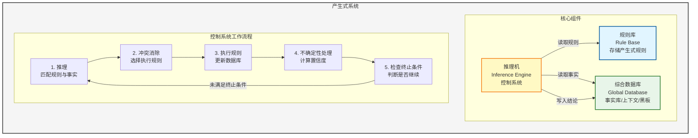

# 人工智能导论


## 一、基本概念

### 1.1 智能

> **智能的核心：** 思维
>
> **智能的基础：** 知识、感知、行为、进化

**总之，智能是知识和智力的总和**

#### 智能的特征

- 🎯 **感知能力** —— 前提
- 🧠 **记忆和思维能力** —— 根本因素
  - 思维：
    - 抽象思维（逻辑）
    - 形象思维：识别图像等
    - 灵感思维
- 📚 **学习和自适应能力**
- 🗣️ **行为能力**（表达）

### 1.2 人工智能

#### 研究内容

| 类别 | 内容 |
|||
| **知识表示** | 符号表示法：用各种包含具体含义的符号，以各种不同的方式和顺序组合起来表示知识的一类方法<br>连接机制表示法：把各种物理对象以不同的方式及顺序连接起来，并在其间互相传递及加工各种包含具体意义的信息，以此来表示相关的概念及知识 |
| **机器感知** | 机器视觉<br>机器听觉 |
| **机器学习** | 机器学习<br>机器学习方法 |
| **机器行为** | - |
| **机器思维** | 抽象思维（逻辑）、形象思维、灵感思维 |


---

## 二、知识表示与知识图谱

### 2.1 知识的特性

- ✅ **相对正确性：** 知识在一定的条件和环境下才是正确的
- ❓ **不确定性：**
  - 随机性
  - 模糊性
  - 不完全性
  - 经验
- 💡 **可表示性和可利用性**


### 2.2 知识的表示

> 将人类知识形式化或模型化


### 2.3 一阶谓词逻辑表示法

#### 命题
非真即假的语句

#### 谓词

**一般形式：** `P(x₁, x₂, ..., xₙ)`

- `x₁...xₙ` 称为**个体**
- 个体可以是常量、变量、函数或者谓词

#### 谓词连接词

| 连接词 | 符号 | 说明 | 示例 |
|--||||
| 非 | ¬ | 否定 | ¬P |
| 析取 | ∨ | 或（并） | P ∨ Q |
| 合取 | ∧ | 且（交） | P ∧ Q |
| 蕴含 | → | 如果...那么... | P → Q |
| 等价 | ↔ | 当且仅当 | P ↔ Q |

**蕴含示例：**
- "如果刘华跑得最快，那么他取得冠军"
- 形式化表示：`RUNS(Liuhua, faster) → WINS(Liuhua, champion)`

**等价示例：**
- `P ↔ Q` 的含义：P当且仅当Q
- `P ↔ Q` 等价于 `(P → Q) ∧ (Q → P)`


#### 谓词量词

| 量词 | 符号 | 含义 |
||||
| 全称量词 | ∀ | 对于所有 |
| 存在量词 | ∃ | 存在 |


#### 量词组合示例

以朋友关系 `F(x, y)` 为例：

| 公式 | 含义 |
|||
| `(∀x)(∃y) F(x, y)` | 对于个体域中的任何个体x都存在个体y，x与y是朋友<br>**含义：每个人都有朋友** |
| `(∃x)(∀y) F(x, y)` | 在个体域中存在个体x，与个体域中的任何个体y都是朋友<br>**含义：存在一个"全民好友"，是所有人的朋友** |
| `(∃x)(∃y) F(x, y)` | 在个体域中存在个体x与个体y，x与y是朋友<br>**含义：至少有一对朋友** |
| `(∀x)(∀y) F(x, y)` | 对于个体域中的任何两个个体x和y，x与y都是朋友<br>**含义：所有人彼此都是朋友** |


#### 量词否定

**存在量词的否定：**
```
¬(∃x)P(x) 等价于 (∀x)[¬P(x)]
```
解释：不存在x使得P(x)为真，也就是说对于任意x，P(x)为假，即非P(x)为真

**全称量词的否定：**
```
¬(∀x)P(x) 等价于 (∃x)[¬P(x)]
```
解释：并不是任意x都使得P(x)为真，存在x使得P(x)为假，即非P(x)为真


#### 谓词公式

1. 单个谓词是 **原子谓词公式**
2. 谓词公式加谓词量词和谓词连接词也是谓词公式


#### 谓词公式的性质

| 性质 | 说明 |
|||
| **解释** | 可求出真值（即 T or F） |
| **永真性** | 任何解释都为真，否则为永假的 |
| **可满足性** | 存在一个解释是的谓词公式为真，否则不可满足 |
| **等价性** | 两个谓词公式在一个个体域上对任一解释有相同的真值，则在该个体域上等价，若在任意个体与上有相同的真值，则这两个公式等价 |


#### 逻辑等价转换

**蕴含式转化：**
```
P → Q 等价于 ¬P ∨ Q
```

**德摩根定律：**
```
¬(P ∨ Q) 等价于 ¬P ∧ ¬Q
¬(P ∧ Q) 等价于 ¬P ∨ ¬Q
```

**其他等价式：**
```
P ∧ Q 等价于 Q ∧ P      （交换律）
P ∨ Q 等价于 Q ∨ P      （交换律）
(P ∧ Q) ∧ R 等价于 P ∧ (Q ∧ R)  （结合律）
(P ∨ Q) ∨ R 等价于 P ∨ (Q ∨ R)  （结合律）
```


#### 永真蕴含

> P→Q 永真，则 P 永真蕴含 Q，P 为 Q 的前提

**永真蕴含示例：**
- `P ∧ Q` 永真蕴含 `P`
- `P ∧ Q` 永真蕴含 `Q`
- `P` 永真蕴含 `P ∨ Q`
- `Q` 永真蕴含 `P ∨ Q`

#### 置换与合一

表达式 `P[x, f(v), B]` 的 4 个置换为：
- `s₁ = {z/x, w/y}`
- `s₂ = {A/y}`
- `s₃ = {q(z)/x, A/y}`
- `s₄ = {c/x, A/y}`

于是，我们可得到 `P[x, f(y), B]` 的 4 个置换的例：
- `P[x, f(y), B]s₁ = P[z, f(w), B]`
- `P[x, f(y), B]s₂ = P[x, f(A), B]`
- `P[x, f(y), B]s₃ = P[q(z), f(A), B]`
- `P[x, f(y), B]s₄ = P[c, f(A), B]`


#### 谓词逻辑的其他推理规则

> **定理⑩：** Q 为 P₁, P₂, …, Pₙ 的逻辑结论，当且仅当 `(P₁ ∧ P₂ ∧ ⋯ ∧ Pₙ) ∧ ¬Q` 是不可满足的。


#### 一阶谓词逻辑表示法的特点

**优点：**
1. ✅ 自然性
2. ✅ 精确性
3. ✅ 严密性
4. ✅ 容易实现

**局限性：**
1. ❌ 不能表示不确定的知识
2. ❌ 组合爆炸
3. ❌ 效率低


### 2.4 产生式表示法

#### 产生式

**规则知识的产生式：**
```
IF P THEN Q
```

**三元组：**
```
（对象，属性，值）
或者：（关系，对象1，对象2）
```

**不确定性表示：** 对于不确定的则在最后加上置信度（小数表示）


#### 产生式的形式描述与语义

**产生式语法结构（BNF形式）：**

```bnf
<产生式> ::= <前提> → <结论>
<前提> ::= <简单条件> | <复合条件>
<结论> ::= <事实> | <操作>
<复合条件> ::= <简单条件> AND <简单条件> [AND <简单条件>...]
              | <简单条件> OR <简单条件> [OR <简单条件>...]
<操作> ::= <操作名> [(<变元>, ...)]
```

> 符号说明：
> - `::=` 表示"定义为"
> - `|` 表示"或者是"
> - `[ ]` 表示"可缺省"


#### 产生式系统

##### 产生式系统的组成

产生式系统由以下三个核心部分组成：

| 组件 | 说明 |
|||
| **1. 规则库** | 用于描述相应领域内知识的产生式集合 |
| **2. 综合数据库** | （事实库、上下文、黑板等）一个用于存放问题求解过程中各种当前信息的数据结构 |
| **3. 推理机** | （控制系统）由一组程序组成，负责整个产生式系统的运行，实现对问题的求解 |


##### 控制系统的工作流程

控制系统执行以下几项工作：

| 步骤 | 工作内容 |
||-|
| **1. 推理** | 从规则库中选择与综合数据库中的已知事实进行匹配 |
| **2. 冲突消除** | 匹配成功的规则可能不止一条，进行冲突消除 |
| **3. 执行规则** | 执行某一规则时，如果其右部是一个或多个结论，则把这些结论加入到综合数据库中；如果其右部是一个或多个操作，则执行这些操作 |
| **4. 不确定性处理** | 对于不确定性知识，在执行每一条规则时还要按一定的算法计算结论的不确定性 |
| **5. 检查推理终止条件** | 检查综合数据库中是否包含了最终结论，决定是否停止系统的运行 |


##### 产生式表示法的优缺点

**优点：**
1. ✅ 自然性
2. ✅ 模块性
3. ✅ 有效性
4. ✅ 清晰性

**缺点：**
1. ❌ 效率不高
2. ❌ 不能表达结构性知识


##### 适合产生式表示的知识

1. 领域知识间关系不密切，不存在结构关系
2. 经验性及不确定性的知识，且相关领域中对这些知识没有严格、统一的理论
3. 领域问题的求解过程可被表示为一系列相对独立的操作，且每个操作可被表示为一条或多条产生式规则


##### 产生式系统的结构图




### 2.5 框架表示法

#### 框架的一般结构

```
<框架名>

槽名1: 侧面名₁₁    侧面值₁₁₁, …, 侧面值₁₁P₁
        |
        |           侧面名₁ₘ    侧面值₁ₘ₁, …, 侧面值₁ₘPₘ

槽名n: 侧面名ₙ₁    侧面值ₙ₁₁, …, 侧面值ₙ₁P₁
        |
        |           侧面名ₙₘ    侧面值ₙₘ₁, …, 侧面值ₙₘPₘ

约束: 约束条件₁
       |
       约束条件ₙ
```


#### 框架表示法的特点

| 特点 | 说明 |
|||
| **（1）结构性** | 便于表达结构性知识，能够将知识的内部结构关系及知识间的联系表示出来 |
| **（2）继承性** | 框架网络中，下层框架可以继承上层框架的槽值，也可以进行补充和修改 |
| **（3）自然性** | 框架表示法与人在观察事物时的思维活动是一致的 |


---

## 三、确定性推理方法

### 3.1 推理的基本概念

#### 3.1.1 推理的定义

> **推理：** 根据已知事实和知识，根据某种策略得出结论


#### 3.1.2 推理方式及其分类

##### 1. 演绎推理、归纳推理、默认推理

**（1）演绎推理（deductive reasoning）：一般 → 个别**

三段论式（三段论法）：
- **大前提：** 已知的一般性知识或假设
- **小前提：** 关于所研究的具体情况或个别事实的判断
- **结论：** 由大前提推出的适合于小前提所示情况的新判断

**示例：**
```
大前提：足球运动员的身体都是强壮的
小前提：高波是一名足球运动员
结论：  所以，高波的身体是强壮的
```


**（2）归纳推理：个别 → 一般**

- **完全归纳推理（必然性推理）：** 检查全部产品合格 → 该厂产品合格
- **不完全归纳推理（非必然性推理）：** 检查全部样品合格 → 该厂产品合格


**（3）默认推理（default reasoning，缺省推理）**

知识不完全的情况下假设某些条件已经具备所进行的推理。


##### 2. 确定性推理、不确定性推理

| 类型 | 说明 |
|||
| **（1）确定性推理** | 推理所用的知识与证据都是确定的，推出的结论也是确定的，其真值或者为真或者为假 |
| **（2）不确定性推理** | 推理所用的知识与证据不都是确定的，推出的结论也是不确定的 |


##### 3. 单调推理、非单调推理

| 类型 | 说明 |
|||
| **（1）单调推理** | 随着推理向前推进及新知识的加入，推出的结论越来越接近最终目标 |
| **（2）非单调推理** | 由于新知识的加入，不仅没有加强已推出的结论，反而要否定它，使推理退回到前面的某一步，重新开始 |

> 注：默认推理是非单调推理，基于经典逻辑的演绎推理是单调推理


##### 4. 启发式推理、非启发式推理

**启发式知识：** 与问题有关且能加快推理过程、提高搜索效率的知识。

**示例：** 目标是在脑膜炎、肺炎、流感中选择一个
- 产生式规则：r₁：脑膜炎；r₂：肺炎；r₃：流感
- 启发式知识："脑膜炎危险"、"目前正在盛行流感"


#### 3.1.3 推理的方向

##### 1. 正向推理（事实驱动推理）：已知事实 → 结论

**基本思想：**
1. 从初始已知事实出发，在知识库KB中找出当前可适用的知识，构成可适用知识集KS
2. 按某种冲突消解策略从KS中选出一条知识进行推理，并将推出的新事实加入到数据库DB中作为下一步推理的已知事实，再在KB中选取可适用知识构成KS
3. 重复（2），直到求得问题的解或KB中再无可适用的知识

**实现正向推理需要解决的问题：**
- 确定匹配（知识与已知事实）的方法
- 按什么策略搜索知识库
- 冲突消解策略

**特点：** 正向推理简单，易实现，但目的性不强，效率低。


##### 2. 逆向推理（目标驱动推理）：以某个假设目标作为出发点

**基本思想：**
- 选定一个假设目标
- 寻找支持该假设的证据，若所需的证据都能找到，则原假设成立；若无论如何都找不到所需要的证据，说明原假设不成立，为此需要另作新的假设

**主要优点：** 不必使用与目标无关的知识，目的性强，同时它还有利于向用户提供解释。

**主要缺点：** 起始目标的选择有盲目性。

**特点：** 目的性强，利于向用户提供解释，但选择初始目标时具有盲目性，比正向推理复杂。


##### 3. 混合推理

- 正向推理：盲目、效率低
- 逆向推理：若提出的假设目标不符合实际，会降低效率

**正反向混合推理：**
1. **先正向后逆向：** 先进行正向推理，帮助选择某个目标，即从已知事实演绎出部分结果，然后再用逆向推理证实该目标或提高其可信度
2. **先逆向后正向：** 先假设一个目标进行逆向推理，然后再利用逆向推理中得到的信息进行正向推理，以推出更多的结论


##### 4. 双向推理

正向推理与逆向推理同时进行，且在推理过程中的某一步骤上"碰头"的一种推理。


#### 3.1.4 冲突消解策略

**已知事实与知识的三种匹配情况：**
1. 恰好匹配成功（一对一）
2. 不能匹配成功
3. 多种匹配成功（一对多、多对一、多对多）

**多种冲突消解策略：**
1. 按就近原则排序
2. 按已知事实的新鲜性排序
3. 按匹配度排序
4. 按知识差异性排序
5. 按条件个数排序

**示例：**
```
r₁: IF A₁ AND A₂ THEN H₁
r₂: IF A₁ AND A₂ AND A₃ AND A₄ THEN H₂
```


### 3.2 自然演绎推理

> **自然演绎推理：** 从一组已知为真的事实出发，运用经典逻辑的推理规则推出结论的过程。

**推理规则：** 假言推理、拒取式推理

#### 常见错误

| 错误类型 | 说明 | 示例 |
|-|||
| **否定前件** | P→Q, ¬P → ¬Q（错误） | 如果下雨，则地上是湿的；没有下雨；所以，地上不湿。（错误） |
| **肯定后件** | P→Q, Q → P（错误） | 如果行星系统是以太阳为中心的，则金星会显示出位相变化；金星显示出位相变化；所以，行星系统是以太阳为中心。（错误） |


#### 例3.1

**已知事实：**
1. 凡是容易的课程小王(Wang)都喜欢
2. C班的课程都是容易的
3. ds是C班的一门课程

**求证：** 小王喜欢ds这门课程

**证明：**

**定义谓词：**
- `EASY(x)`：x是容易的
- `LIKE(x, y)`：x喜欢y
- `C(x)`：x是C班的一门课程

**已知事实和结论用谓词公式表示：**
```
(∀x)(EASY(x) → LIKE(Wang, x))
(∀x)(C(x) → EASY(x))
C(ds)
LIKE(Wang, ds)  （待证）
```


#### 优点

- 表达定理证明过程自然，易理解
- 拥有丰富的推理规则，推理过程灵活
- 便于嵌入领域启发式知识


### 3.3 谓词公式化为子句集的方法

#### 基本概念

| 概念 | 说明 |
|||
| **原子（atom）谓词公式** | 一个不能再分解的命题 |
| **文字（literal）** | 原子谓词公式及其否定<br>P：正文字，¬P：负文字 |
| **子句（clause）** | 任何文字的析取式。任何文字本身也都是子句 |
| **空子句（NIL）** | 不包含任何文字的子句 |
| **子句集** | 由子句构成的集合 |

> **空子句是永假的，不可满足的。**


#### 合取范式

设 `C₁, C₂, C₃, ..., Cₙ` 为 n 个子句
- **合取范式：** `C₁ ∧ C₂ ∧ C₃ ∧ ... ∧ Cₙ`
- **子句集：** `S = {C₁, C₂, C₃, ..., Cₙ}`

任何谓词公式 F 都可通过等价关系及推理规则化为相应的子句集 S。


#### 消解（Resolution）

当消解可使用时，消解过程被应用于母体子句对，以便产生一个导出子句。

**示例：** 如果存在某个公理 `¬P ∨ Q` 和另一公理 `¬Q ∨ R`，那么 `¬P ∨ R` 在逻辑上成立。这就是消解，而称 `¬P ∨ R` 为 `¬P ∨ Q` 和 `¬Q ∨ R` 的消解式（resolvent）。


#### 化简子句集

消解反演采用的是反证的思想，只要将推理公式的条件部分和结论的否定都化为子句并证明所形成的子句集是不可满足的，即可证明原公式成立。


#### 谓词公式化为子句集的九个步骤

**（1）消去蕴涵和等价符号**

**（2）减少否定符号¬的辖域**

每个否定符号¬最多只用到一个谓词符号上，并反复应用德·摩根定律：

| 原式 | 替换为 |
||--|
| `¬(A ∧ B)` | `¬A ∨ ¬B` |
| `¬(A ∨ B)` | `¬A ∧ ¬B` |
| `¬(∀x)A` | `(∃x){¬A}` |
| `¬(∃x)A` | `(∀x){¬A}` |
| `¬(¬A)` | `A` |

**（3）对变量标准化**

在任一量词辖域内，受该量词约束的变量为一哑元（虚构变量），它可以在该辖域内处处统一地被另一个没有出现过的任意变量所代替，而不改变公式的真值。

**示例：** 把 `(∀x){P(x) → (∃x)Q(x)}` 标准化而得到：`(∀x){P(x) → (∃y)Q(y)}`

**（4）消去存在量词**

**(a) 如果要消去的存在量词在某些全称量词的辖域内**

- **Skolem函数：** 在公式 `(∀y)[(∃x)P(x, y)]` 中，存在量词是在全称量词的辖域内，我们允许所存在的 x 可能依赖于 y 值。令这种依赖关系用函数 g(y) 定义，它把每个 y 值映射到存在的那个 x。
- Skolem函数所使用的函数符号必须是新的，即不允许是公式中已经出现过的函数符号。
- **示例：** `(∀y)P(g(y), y)`

**(b) 如果要消去的存在量词不在任何一个全称量词的辖域内**

- 使用不含变量的Skolem函数即常量
- **示例：** `(∃x)P(x)` 化为 `P(A)`，其中常量符号A用来表示我们知道的存在实体。A必须是个新的常量符号，它未曾在公式中其它地方使用过。

**（5）化为前束形**

到这一步，已不留下任何存在量词，而且每个全称量词都有自己的变量。把所有全称量词移到公式的左边，并使每个量词的辖域包括这个量词后面公式的整个部分。

**前束形公式由前缀和母式组成：**
- **前缀：** 由全称量词串组成
- **母式：** 由没有量词的公式组成
- **前束形 = （前缀）（母式）**

**（6）把母式化为合取范式**

任何母式都可写成由一些谓词公式和（或）谓词公式的否定的析取的有限集组成的合取。反复应用分配律，把任一母式化成合取范式。

**示例：** 把 `A ∨ {B ∧ C}` 化为 `{A ∨ B} ∧ {A ∨ C}`

**（7）消去全称量词**

到了这一步，所有余下的量词均被全称量词量化了。同时，全称量词的次序也不重要了。因此，我们可以消去前缀，即消去明显出现的全称量词。

**（8）消去合取符号∧**

用 `{(A ∨ B), (A ∨ C)}` 代替 `(A ∨ B) ∧ (A ∨ C)`，以消去明显的符号∧。反复代替的结果，最后得到一个有限集，其中每个公式是文字的析取。

**（9）更换变量名称**

可以更换变量符号的名称，使一个变量符号不出现在一个以上的子句中。


> **定理3.1：** 谓词公式不可满足的充要条件是其子句集不可满足。


### 3.4 鲁宾逊归结原理

> **鲁宾逊归结原理（消解原理）的基本思想：**
> 检查子句集 S 中是否包含空子句，若包含，则 S 不可满足。若不包含，在 S 中选择合适的子句进行归结，一旦归结出空子句，就说明 S 是不可满足的。

> **子句集中子句之间是合取关系，只要有一个子句不可满足，则子句集就不可满足。**


#### 1. 命题逻辑中的归结原理（基子句的归结）

**定义3.1（归结）：** 设 C₁ 与 C₂ 是子句集中的任意两个子句，如果 C₁ 中的文字 L₁ 与 C₂ 中的文字 L₂ 互补，那么从 C₁ 和 C₂ 中分别消去 L₁ 和 L₂，并将二个子句中余下的部分析取，构成一个新子句 C₁₂。

**定理3.2：** 归结式 C₁₂ 是其亲本子句 C₁ 与 C₂ 的逻辑结论。即如果 C₁ 与 C₂ 为真，则 C₁₂ 为真。

**推论1：** 设 C₁ 与 C₂ 是子句集 S 中的两个子句，C₁₂ 是它们的归结式，若用 C₁₂ 代替 C₁ 与 C₂ 后得到新子句集 S₁，则由 S₁ 不可满足性可推出原子句集 S 的不可满足性。

**推论2：** 设 C₁ 与 C₂ 是子句集 S 中的两个子句，C₁₂ 是它们的归结式，若 C₁₂ 加入原子句集 S，得到新子句集 S₁，则 S 与 S₁ 在不可满足的意义上是等价的。


#### 2. 谓词逻辑中的归结原理（含有变量的子句的归结）

对于谓词逻辑，归结式是其亲本子句的逻辑结论。

**对于一阶谓词逻辑：**
- 若子句集是不可满足的，则必存在一个从该子句集到空子句的归结演绎
- 若从子句集存在一个到空子句的演绎，则该子句集是不可满足的
- 如果没有归结出空子句，则既不能说 S 不可满足，也不能说 S 是可满足的


### 3.5 归结反演

> **应用归结原理证明定理的过程称为归结反演。**

#### 用归结反演证明的步骤

1. 将已知前提表示为谓词公式 F
2. 将待证明的结论表示为谓词公式 Q，并否定得到 ¬Q
3. 把谓词公式集 {F, ¬Q} 化为子句集 S
4. 应用归结原理对子句集 S 中的子句进行归结，并把每次归结得到的归结式都并入到 S 中。如此反复进行，若出现了空子句，则停止归结，此时就证明了 Q 为真


#### 例3.9

某公司招聘工作人员，A, B, C 三人应试，经面试后公司表示如下想法：
1. 三人中至少录取一人
2. 如果录取 A 而不录取 B，则一定录取 C
3. 如果录取 B，则一定录取 C

**求证：** 公司一定录取 C。


### 3.6 应用归结原理求解问题

#### 应用归结原理求解问题的步骤

1. 已知前提 F 用谓词公式表示，并化为子句集 S
2. 把待求解的问题 Q 用谓词公式表示，并否定 Q，再与 ANSWER 构成析取式（¬Q ∨ ANSWER）
3. 把上述公式化为子句集
4. 应用归结原理对子句集进行归结
5. 若得到归结式 ANSWER，则答案就在 ANSWER 中


#### 例3.11

**已知：**
- F₁：王（Wang）先生是小李（Li）的老师
- F₂：小李与小张（Zhang）是同班同学
- F₃：如果 x 与 y 是同班同学，则 x 的老师也是 y 的老师

**求：** 小张的老师是谁？

**解：**

**定义谓词：**
- `TEACHER(x, y)`：x 是 y 的老师
- `CLASSMATE(x, y)`：x 与 y 是同班同学

**把已知前提表示成谓词公式**

**把目标表示成谓词公式，并把它否定后与 ANSWER 析取**

**应用归结原理进行归结，得到 ANSWER(Wang)，即小张的老师是王先生**

---

## 四、不确定性推理方法

### 4.1 不确定性推理中的基本问题

> **不确定性推理：** 从不确定性的初始证据出发，通过运用不确定性的知识，最终推出具有一定程度的不确定性但却是合理或者近乎合理的结论的思维过程。

#### 现实世界中不确定性的来源

- 🎲 客观上存在的随机性
- 🌫️ 模糊性
- 📊 反映到知识以及由观察所得到的证据上来，形成不确定性的知识及不确定的证据


#### 不确定性推理中的基本问题

##### 1. 不确定性的表示与量度

**（1）知识不确定性的表示**
- 在专家系统中知识的不确定性一般是由领域专家给出的
- 通常是一个数值——知识的静态强度

**（2）证据不确定性的表示——证据的动态强度**
- 用户在求解问题时提供的初始证据
- 在推理中用前面推出的结论作为当前推理的证据

**（3）不确定性的量度**

要求：
- 能充分表达相应知识及证据不确定性的程度
- 度量范围的指定便于领域专家及用户对不确定性的估计
- 便于对不确定性的传递进行计算，而且对结论算出的不确定性量度不能超出量度规定的范围
- 度量的确定应当是直观的，同时应有相应的理论依据


##### 2. 不确定性匹配算法及阈值的选择

- **不确定性匹配算法：** 用来计算匹配双方相似程度的算法
- **阈值：** 用来指出相似的"限度"


##### 3. 组合证据不确定性的算法

- 最大最小方法
- Hamacher方法
- 概率方法
- 有界方法
- Einstein方法等


##### 4. 不确定性的传递算法

- （1）在每一步推理中，如何把证据及知识的不确定性传递给结论
- （2）在多步推理中，如何把初始证据的不确定性传递给最终结论


##### 5. 结论不确定性的合成


### 4.2 可信度方法

> **可信度方法：** 1975年肖特里菲（E. H. Shortliffe）等人在确定性理论（theory of confirmation）的基础上，结合概率论等提出的一种不确定性推理方法。

**优点：** 直观、简单，且效果好。

**可信度：** 根据经验对一个事物或现象为真的相信程度。可信度带有较大的主观性和经验性，其准确性难以把握。

**C-F模型：** 基于可信度表示的不确定性推理的基本方法。


#### 1. 知识不确定性的表示

**产生式规则表示：**
```
IF E THEN H (CF(H, E))
```

`CF(H, E)`：可信度因子（certainty factor），反映前提条件与结论的联系强度。

**示例：**
```
IF 头痛 AND 流涕 THEN 感冒 (0.7)
```

**CF(H, E)的取值范围：[-1, 1]**

| CF(H, E) 值 | 含义 |
|-||
| CF(H, E) > 0 | 证据的出现增加结论 H 为真的可信度，证据的出现越是支持 H 为真，就使 CF(H, E) 的值越大 |
| CF(H, E) < 0 | 证据的出现越是支持 H 为假，CF(H, E) 的值就越小 |
| CF(H, E) = 0 | 证据的出现与否与 H 无关 |


#### 2. 证据不确定性的表示

**证据 E 的可信度取值范围：[-1, 1]**

| 情况 | CF(E) 值 |
||-|
| 肯定为真 | CF(E) = 1 |
| 肯定为假 | CF(E) = -1 |
| 以某种程度为真 | 0 < CF(E) < 1 |
| 以某种程度为假 | -1 < CF(E) < 0 |
| 未获得任何相关的观察 | CF(E) = 0 |

**静态强度 CF(H, E)：** 知识的强度，即当 E 所对应的证据为真时对 H 的影响程度。

**动态强度 CF(E)：** 证据 E 当前的不确定性程度。


#### 3. 组合证据不确定性的算法

**（1）组合证据为合取**
```
E = E₁ AND E₂ AND ... AND Eₙ
```
则：
```
CF(E) = min{CF(E₁), CF(E₂), ..., CF(Eₙ)}
```

**（2）组合证据为析取**
```
E = E₁ OR E₂ OR ... OR Eₙ
```
则：
```
CF(E) = max{CF(E₁), CF(E₂), ..., CF(Eₙ)}
```


#### 4. 不确定性的传递算法

> **C-F模型中的不确定性推理：** 从不确定的初始证据出发，通过运用相关的不确定性知识，最终推出结论并求出结论的可信度值。

**结论 H 的可信度计算公式：**
```
CF(H) = CF(H, E) × max{0, CF(E)}
```


#### 5. 结论不确定性的合成算法

**（1）分别对每一条知识求出 CF(H)**

**（2）求出 CF₁(H) 与 CF₂(H) 对 H 的综合影响所形成的可信度 CF₁₂(H)：**

```
CF₁₂(H) =
    CF₁(H) + CF₂(H) - CF₁(H) × CF₂(H)              当 CF₁(H) ≥ 0 且 CF₂(H) ≥ 0
    CF₁(H) + CF₂(H) + CF₁(H) × CF₂(H)              当 CF₁(H) < 0 且 CF₂(H) < 0
    (CF₁(H) + CF₂(H)) / (1 - min{|CF₁(H)|, |CF₂(H)|})  当 CF₁(H) × CF₂(H) < 0
```


#### 例4.1

设有如下一组知识：
```
r₁: IF E₁ THEN H (0.8)
r₂: IF E₂ THEN H (0.6)
```

已知：`CF(E₁) = 0.5`, `CF(E₂) = 0.8`

求：`CF(H)`

**解：**

**第一步：对每一条规则求出 CF(H)**
- `CF₁(H) = 0.8 × max{0, 0.5} = 0.4`
- `CF₂(H) = 0.6 × max{0, 0.8} = 0.48`

**第二步：根据结论不确定性的合成算法得到：**
```
CF₁₂(H) = 0.4 + 0.48 - 0.4 × 0.48 = 0.688
```

**综合可信度：CF(H) = 0.688**


### 4.3 证据理论

> **证据理论（theory of evidence）：** 又称 D-S 理论，是德普斯特（A. P. Dempster）首先提出，沙佛（G. Shafer）进一步发展起来的一种处理不确定性的理论。


#### 4.3.1 概率分配函数

**样本空间 D：** 设 D 是变量 x 所有可能取值的集合，且 D 中的元素是互斥的，在任一时刻 x 都取且只能取 D 中的某一个元素为值。

**命题表示：** 在证据理论中，D 的任何一个子集 A 都对应于一个关于 x 的命题，称该命题为"x 的值是在 A 中"。

**示例：** 设 x：所看到的颜色，D = {红，黄，蓝}
- A = {红}："x 是红色"
- A = {红，蓝}："x 或者是红色，或者是蓝色"


**定义4.1（概率分配函数）：** 设函数 M：2ᴰ → [0, 1]，且满足：
```
(1) M(Φ) = 0
(2) Σ M(A) = 1  （对所有 A ⊆ D）
```

则 M 是 2ᴰ 上的基本概率分配函数，M(A) 是 A 的基本概率数。

**几点说明：**
- 设样本空间 D 中有 n 个元素，则 D 中子集的个数为 2ⁿ 个
- 概率分配函数：把 D 的任意一个子集 A 都映射为 [0, 1] 上的一个数 M(A)
- 当 A = {xᵢ} 时，M(A)：对相应命题 A 的精确信任度
- 概率分配函数与概率不同

**示例：** 设 D = {红，黄，蓝}
```
M({红}) = 0.3, M({黄}) = 0, M({蓝}) = 0.1
M({红，黄}) = 0.2, M({红，蓝}) = 0.2
M({黄，蓝}) = 0.1, M({红，黄，蓝}) = 0.1, M(Φ) = 0
但：M({红}) + M({黄}) + M({蓝}) = 0.4 ≠ 1
```


#### 4.3.2 信任函数

**定义4.2（信任函数）：** 命题的信任函数 Bel：2ᴰ → [0, 1] 定义为：
```
Bel(A) = Σ M(B)  （对所有 B ⊆ A）
```

Bel(A)：对命题 A 为真的总的信任程度。


#### 4.3.3 似然函数

**似然函数（plausibility function）：** 不可驳斥函数或上限函数。

**定义：** 似然函数 Pl：2ᴰ → [0, 1] 定义为：
```
Pl(A) = 1 - Bel(¬A) = Σ M(B)  （对所有 B ∩ A ≠ Φ）
```

**示例：** 设 D = {红，黄，蓝}
```
M({红}) = 0.3, M({黄}) = 0, M({红，黄}) = 0.2
Bel({红}) = M({红}) = 0.3
Pl({红}) = M({红}) + M({红，黄}) + M({红，蓝}) + M({红，黄，蓝})
```


#### 4.3.4 概率分配函数的正交和（证据的组合）

**定义4.4：** 设 M₁ 和 M₂ 是两个概率分配函数，则其正交和 M = M₁ ⊕ M₂ 为：
```
M(Φ) = 0
M(A) = (1/K) × Σ M₁(B) × M₂(C)  （对所有 B ∩ C = A）
```

其中：
```
K = Σ M₁(B) × M₂(C)  （对所有 B ∩ C ≠ Φ）
```

| 条件 | 结果 |
|||
| K ≠ 0 | 正交和 M 也是一个概率分配函数 |
| K = 0 | 不存在正交和 M，即没有可能存在概率函数，称 M₁ 与 M₂ 矛盾 |


#### 例4.2

设 D = {黑，白}，且设
```
M₁({黑}) = 0.3, M₁({白}) = 0.6, M₁({黑，白}) = 0.1
M₂({黑}) = 0.4, M₂({白}) = 0.4, M₂({黑，白}) = 0.2
```

则：`K = 0.3 × 0.4 + 0.3 × 0.2 + 0.6 × 0.4 + 0.6 × 0.2 + 0.1 × 0.4 + 0.1 × 0.2 + 0.1 × 0.2 = 0.52`

组合后得到的概率分配函数：
```
M({黑}) = (0.3 × 0.4 + 0.3 × 0.2 + 0.1 × 0.4) / 0.52 = 0.269
M({白}) = (0.6 × 0.4 + 0.6 × 0.2 + 0.1 × 0.4) / 0.52 = 0.577
M({黑，白}) = (0.1 × 0.2) / 0.52 = 0.038
```


#### 4.3.5 基于证据理论的不确定性推理

**步骤：**
1. 建立问题的样本空间 D
2. 由经验给出，或者由随机性规则和事实的信度度量算基本概率分配函数
3. 计算所关心的子集的信任函数值、似然函数值
4. 由信任函数值、似然函数值得出结论


#### 例4.3

设有规则：
- （1）如果流鼻涕则感冒但非过敏性鼻炎（0.9）或过敏性鼻炎但非感冒（0.1）
- （2）如果眼发炎则感冒但非过敏性鼻炎（0.8）或过敏性鼻炎但非感冒（0.05）

有事实：
- （1）小王流鼻涕（0.9）
- （2）小王发眼炎（0.4）

问：小王患的什么病？

**解：** 取样本空间：
- a：表示"感冒但非过敏性鼻炎"
- b：表示"过敏性鼻炎但非感冒"
- c：表示"同时得了两种病"

取基本概率分配函数，然后计算信任函数和似然函数，得出结论。


### 4.4 模糊推理方法

#### 4.4.1 模糊逻辑的提出与发展

**1965年：** 美国 L. A. Zadeh 发表了"fuzzy set"的论文，首先提出了模糊理论。

**发展历程：**

| 年份 | 事件 |
|||
| 1974年 | 英国 Mamdani 首次将模糊理论应用于热电厂的蒸汽机控制 |
| 1976年 | Mamdani 又将模糊理论应用于水泥旋转炉的控制 |
| 1983年 | 日本 Fuji Electric 公司实现了饮水处理装置的模糊控制 |
| 1987年 | 日本 Hitachi 公司研制出地铁的模糊控制系统 |
| 1987-1990年 | 在日本申报的模糊产品专利就达 319 种 |

**应用：** 模糊洗衣机、模糊吸尘器、模糊电冰箱和模糊摄像机等。


#### 4.4.2 模糊集合

##### 基本概念

| 概念 | 说明 |
|||
| **论域** | 所讨论的全体对象，用 U 等表示 |
| **元素** | 论域中的每个对象，常用 a, b, c, x, y, z 表示 |
| **集合** | 论域中具有某种相同属性的确定的、可以彼此区别的元素的全体，常用 A, B 等表示 |
| **元素 a 和集合 A 的关系** | a 属于 A 或 a 不属于 A，即只有两个真值"真"和"假" |

**模糊逻辑：** 给集合中每一个元素赋予一个介于 0 和 1 之间的实数，描述其属于一个集合的强度，该实数称为元素属于一个集合的隶属度。集合中所有元素的隶属度全体构成集合的隶属函数。

**例如，"成年人"集合：**
- 传统集合：18岁以上是成年人，18岁以下不是成年人
- 模糊集合：随着年龄增长，属于"成年人"的程度逐渐增加


##### 模糊集合的表示方法

**当论域中元素数目有限时，模糊集合 A 的数学描述为：**
```
A = {(x, μₐ(x)) | x ∈ U}
```

μₐ(x)：元素 x 属于模糊集 A 的隶属度，U 是元素的论域。

**（1）Zadeh表示法**
```
A = μₐ(x₁)/x₁ + μₐ(x₂)/x₂ + ... + μₐ(xₙ)/xₙ
```

**（2）序偶表示法**
```
A = {(x₁, μₐ(x₁)), (x₂, μₐ(x₂)), ..., (xₙ, μₐ(xₙ))}
```

**（3）向量表示法**
```
A = (μₐ(x₁), μₐ(x₂), ..., μₐ(xₙ))
```


##### 隶属函数

**常见的隶属函数：** 正态分布、三角分布、梯形分布等

**隶属函数确定方法：**
- 模糊统计法
- 专家经验法
- 二元对比排序法
- 基本概念扩充法


#### 4.4.3 模糊集合的运算

**（1）模糊集合的包含关系**
```
若 μₐ(x) ≤ μᵦ(x)，则 A ⊆ B
```

**（2）模糊集合的相等关系**
```
若 μₐ(x) = μᵦ(x)，则 A = B
```

**（3）模糊集合的交并补运算**

| 运算 | 公式 |
|||
| **① 交运算** | `μₐ∩ᵦ(x) = min{μₐ(x), μᵦ(x)}` |
| **② 并运算** | `μₐ∪ᵦ(x) = max{μₐ(x), μᵦ(x)}` |
| **③ 补运算** | `μ¬ₐ(x) = 1 - μₐ(x)` |

**（4）模糊集合的代数运算**

| 运算 | 公式 |
|||
| **① 代数积** | `μₐ·ᵦ(x) = μₐ(x) × μᵦ(x)` |
| **② 代数和** | `μₐ+ᵦ(x) = μₐ(x) + μᵦ(x) - μₐ(x) × μᵦ(x)` |
| **③ 有界和** | `μₐ⊕ᵦ(x) = min{1, μₐ(x) + μᵦ(x)}` |
| **④ 有界积** | `μₐ⊙ᵦ(x) = max{0, μₐ(x) + μᵦ(x) - 1}` |


#### 4.4.4 模糊关系与模糊关系的合成

##### 1. 模糊关系

| 关系类型 | 说明 |
|-||
| **普通关系** | 两个集合中的元素之间是否有关联 |
| **模糊关系** | 两个模糊集合中的元素之间关联程度的多少 |

**模糊关系矩阵 R：** 设 X = {x₁, x₂, ..., xₘ}，Y = {y₁, y₂, ..., yₙ}，则 X 到 Y 的模糊关系 R 可以用一个 m×n 的矩阵表示：
```
R = [rᵢⱼ]  其中 rᵢⱼ = μᵣ(xᵢ, yⱼ)
```

##### 2. 模糊关系的合成

设 R 是 X 到 Y 的模糊关系，S 是 Y 到 Z 的模糊关系，则 R 与 S 的合成 T = R ∘ S 是一个 X 到 Z 的模糊关系：
```
μₜ(x, z) = max{min{μᵣ(x, y), μₛ(y, z)}}  （对所有 y ∈ Y）
```


#### 4.4.5 模糊推理

##### 1. 模糊知识表示

人类思维判断的基本形式：
```
如果（条件）→ 则（结论）
```

**示例：** 如果压力较高且温度在慢慢上升，则阀门略开

**模糊规则：** 从条件论域到结论论域的模糊关系矩阵 R。通过条件模糊向量与模糊关系 R 的合成进行模糊推理，得到结论的模糊向量，然后采用"清晰化"方法将模糊结论转换为精确量。

##### 2. 对 IF A THEN B 类型的模糊规则的推理

若已知输入为 A，则输出为 B；若现在已知输入为 A'，则输出 B' 用合成规则求取：
```
B' = A' ∘ R
```

其中模糊关系 R：
```
R = A × B  （笛卡尔积）
```


#### 4.4.6 模糊决策

> **模糊决策（模糊判决、解模糊或清晰化）：** 由模糊推理得到的结论或者操作是一个模糊向量，转化为确定值的过程。

**1. 最大隶属度法**
选择隶属度最大的元素作为输出值。

**2. 加权平均判决法**
```
y₀ = (Σ μᵢ × yᵢ) / (Σ μᵢ)
```

**3. 中位数法**
选择使隶属函数曲线下面积相等的点作为输出值。


#### 4.4.7 模糊推理的应用

#### 例4.10

设有模糊控制规则："如果温度低，则将风门开大"。设温度和风门开度的论域为 {1, 2, 3, 4, 5}。

"温度低"和"风门大"的模糊量：
```
"温度低" = 1/1 + 0.6/2 + 0.3/3 + 0.0/4 + 0/5
"风门大" = 0/1 + 0.0/2 + 0.3/3 + 0.6/4 + 1/5
```

已知事实"温度较低"，可以表示为：
```
"温度较低" = 0.8/1 + 1/2 + 0.6/3 + 0.3/4 + 0/5
```

试用模糊推理确定风门开度。

**解：**

**（1）确定模糊关系 R**
通过笛卡尔积计算模糊关系矩阵 R。

**（2）模糊推理**
```
B' = A' ∘ R = (0.0, 0.0, 0.3, 0.6, 0.8)
```

**（3）模糊决策**
- 用最大隶属度法进行决策得风门开度为 **5**
- 用加权平均判决法和中位数法进行决策得风门开度为 **4**


