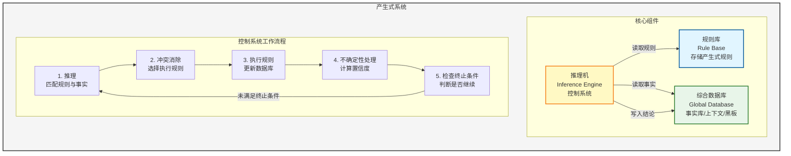
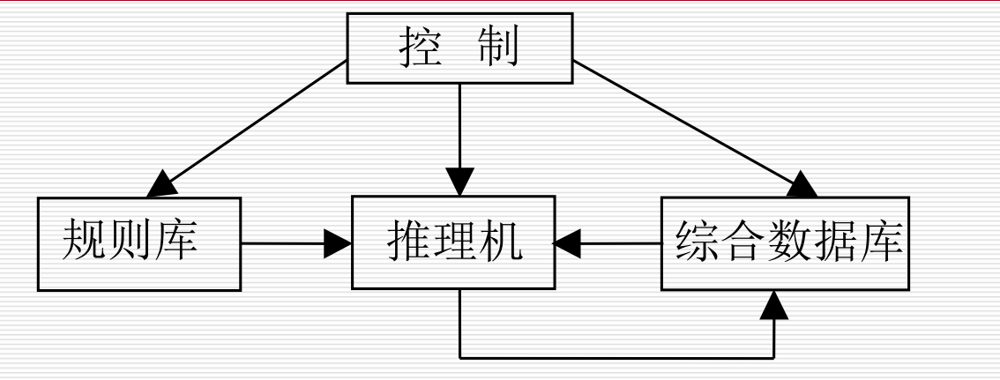

#  人工智能导论

##  一、基本概念

### 1.1 智能

智能的核心：思维

智能的基础：知识，感知、行为、进化

**总之，智能是知识和智力的总和**

智能的特征：

- 感知能力——前提
- 记忆和思维能力——根本因素
  - 思维：
    - 抽象思维（逻辑）
    - 形象思维：识别图像等
    - 灵感思维
- 学习和自适应能力
- 行为能力（表达）

### 1.2 人工智能

研究内容：

- 知识表示：
  - 符号表示法：用各种包含具体含义的符号，以各种不同的方式和顺序组合起来表示知识的一类方法
  - 连接机制表示法：把各种物理对象以不同的方式及顺序连接起来，并在其间互相传递及加工各种包含具体意义的信息，以此来表示相关的概念及知识
- 机器感知：
  - 机器视觉
  - 机器听觉
- 机器学习：
  - 机器学习
  - 机器学习方法
- 机器行为
- 机器思维：抽象思维（逻辑），形象思维，灵感思维

## 二、知识表示与知识图谱

### 2.1 知识的特性

- 相对正确性：知识在一定的条件和环境下才是正确的
- 不确定性：
  - 随机性
  - 模糊性
  - 不完全性
  - 经验
- 可表示性和可利用性

### 2.2 知识的表示

将人类知识形式化or模型化

### 2.3 一阶谓词逻辑表示法

**命题：**非真即假的语句

**谓词：**

​	一般形式：$P(x_1, x_2, ..., x_n)$
​	$x_1...x_n$称为个体
​	个体可以是常量，变量，函数或者谓词

**谓词连接词：**

- 非（¬）
- 析取（并，∨）
- 合取（交，∧）
- 蕴含（→）：表示"如果...那么..."的关系
  - 示例："如果刘华跑得最快，那么他取得冠军"
  - 形式化表示：RUNS(Liuhua, faster) → WINS(Liuhua, champion)
- 等价（↔）：表示"当且仅当"的关系（双条件）
  - P ↔ Q 的含义：P当且仅当Q
  - P ↔ Q 等价于 (P → Q) ∧ (Q → P)

**谓词量词：**

- 全称量词（∀）：表示"对于所有"
- 存在量词（∃）：表示"存在"

**量词组合示例**（以朋友关系 F(x,y) 为例）：
- $(∀x)(∃y) F(x, y)$：表示对于个体域中的任何个体x都存在个体y，x与y是朋友
  - 含义：每个人都有朋友
- $(∃x)(∀y) F(x, y)$：表示在个体域中存在个体x，与个体域中的任何个体y都是朋友
  - 含义：存在一个"全民好友"，是所有人的朋友
- $(∃x)(∃y) F(x, y)$：表示在个体域中存在个体x与个体y，x与y是朋友
  - 含义：至少有一对朋友
- $(∀x)(∀y) F(x, y)$：表示对于个体域中的任何两个个体x和y，x与y都是朋友
  - 含义：所有人彼此都是朋友

**量词否定：**
- **存在量词的否定**：
  - 公式：¬(∃x)P(x) 等价于 (∀x)[¬P(x)]
  - 解释：不存在x使得P(x)为真，也就是说对于任意x，P(x)为假，即非P(x)为真
- **全称量词的否定**：
  - 公式：¬(∀x)P(x) 等价于 (∃x)[¬P(x)]
  - 解释：并不是任意x都使得P(x)为真，存在x使得P(x)为假，即非P(x)为真

**谓词公式：**

1. 单个谓词是 **原子谓词公式**

2. 谓词公式加谓词量词和谓词连接词也是谓词公式

3. **性质**：

   1. 解释：可求出真值（即 T or F ）

   2. 永真性：

      任何解释都为真，否则为永假的

   3. 可满足性：

      存在一个解释是的谓词公式为真，否则不可满足

   4. 等价性：

      两个谓词公式在一个个体域上对任一解释有相同的真值，则在该个体域上等价，若在任意个体与上有相同的真值，则这两个公式等价。

   5. 蕴含式转化：$P → Q$ 等价于 $¬P ∨ Q$

   6. 德摩根定律：
      - $¬(P ∨ Q)$ 等价于 $¬P ∧ ¬Q$
      - $¬(P ∧ Q)$ 等价于 $¬P ∨ ¬Q$

   7. 其他等价式：
      - $P ∧ Q$ 等价于 $Q ∧ P$（交换律）
      - $P ∨ Q$ 等价于 $Q ∨ P$（交换律）
      - $(P ∧ Q) ∧ R$ 等价于 $P ∧ (Q ∧ R)$（结合律）
      - $(P ∨ Q) ∨ R$ 等价于 $P ∨ (Q ∨ R)$（结合律）

   8. 永真蕴含：

      P->Q永真，则P永真蕴含Q，P为Q的前提

   9. 置换与合一：
   表达式 P[x,f(v),B] 的 4 个置换为：
   - s1 = {z/x, w/y}
   - s2 = {A/y}
   - s3 = {q(z)/x, A/y}
   - s4 = {c/x, A/y}

   于是，我们可得到 P[x,f(y),B] 的 4 个置换的例：
   - P[x,f(y),B]s1 = P[z,f(w),B]
   - P[x,f(y),B]s2 = P[x,f(A),B]
   - P[x,f(y),B]s3 = P[q(z),f(A),B]
   - P[x,f(y),B]s4 = P[c,f(A),B]

   10. 永真蕴含示例：
       - $P ∧ Q$ 永真蕴含 $P$
       - $P ∧ Q$ 永真蕴含 $Q$
       - $P$ 永真蕴含 $P ∨ Q$
       - $Q$ 永真蕴含 $P ∨ Q$

   11. 谓词的一般形式：
       P(x₁, x₂, ..., xₙ)

   12. 逻辑等价转换：
       - **蕴含式转化**：P→Q 等价于 ¬P∨Q
       - **德摩根定律**：
         * ¬(P ∨ Q) 等价于 ¬P ∧ ¬Q
         * ¬(P ∧ Q) 等价于 ¬P ∨ ¬Q

   13. 谓词逻辑的其他推理规则：
       **定理⑩：** Q为P₁, P₂, …, Pₙ 的逻辑结论，当且仅当 (P₁ ∧ P₂ ∧ ⋯ ∧ Pₙ) ∧ ¬Q 是不可满足的。

   14. 一阶谓词逻辑表示法的特点：
       **优点：**
       ① 自然性
       ② 精确性
       ③ 严密性
       ④ 容易实现

       **局限性：**
       ① 不能表示不确定的知识
       ② 组合爆炸
       ③ 效率低

### 2.4 产生式表示法

#### 产生式：

- 规则知识的产生式：

  ​		**IF P THEN Q**

- 三元组

  ​		**（对象，属性，值）**或者：**（关系，对象1，对象2）**

- 对于不确定的则在最后加上置信度（小数表示）

#### 产生式的形式描述与语义

**产生式语法结构（BNF形式）：**

```
<产生式> ::= <前提> → <结论>
<前提> ::= <简单条件> | <复合条件>
<结论> ::= <事实> | <操作>
<复合条件> ::= <简单条件> AND <简单条件> [AND <简单条件>...]
              | <简单条件> OR <简单条件> [OR <简单条件>...]
<操作> ::= <操作名> [(<变元>, ...)]
```

符号“::=”表示“定义为”；符号“|”表示“或者是” ；符号“[ ]”表示“可缺省”。

#### 产生式系统

**产生式系统的组成：**

产生式系统由以下三个核心部分组成：

1. **规则库**
   - 用于描述相应领域内知识的产生式集合

2. **综合数据库**（事实库、上下文、黑板等）
   - 一个用于存放问题求解过程中各种当前信息的数据结构

3. **推理机**（控制系统）
   - 由一组程序组成，负责整个产生式系统的运行，实现对问题的求解

**控制系统的工作流程：**

控制系统执行以下几项工作：

1. **推理**
   - 从规则库中选择与综合数据库中的已知事实进行匹配

2. **冲突消除**
   - 匹配成功的规则可能不止一条，进行冲突消除

3. **执行规则**
   - 执行某一规则时，如果其右部是一个或多个结论，则把这些结论加入到综合数据库中；如果其右部是一个或多个操作，则执行这些操作

4. **不确定性处理**
   - 对于不确定性知识，在执行每一条规则时还要按一定的算法计算结论的不确定性

5. **检查推理终止条件**
   - 检查综合数据库中是否包含了最终结论，决定是否停止系统的运行

**产生式表示法的优缺点：**

**优点：**
- (1) 自然性
- (2) 模块性
- (3) 有效性
- (4) 清晰性

**缺点：**
- (1) 效率不高
- (2) 不能表达结构性知识

**适合产生式表示的知识：**
- (1) 领域知识间关系不密切，不存在结构关系
- (2) 经验性及不确定性的知识，且相关领域中对这些知识没有严格、统一的理论
- (3) 领域问题的求解过程可被表示为一系列相对独立的操作，且每个操作可被表示为一条或多条产生式规则

**产生式系统的结构图：**





### 2.5 框架表示法

框架的一般结构：

```
<框架名>

槽名1: 侧面名₁₁    侧面值₁₁₁, …, 侧面值₁₁P₁
        |
        |           侧面名₁ₘ    侧面值₁ₘ₁, …, 侧面值₁ₘPₘ

槽名n: 侧面名ₙ₁    侧面值ₙ₁₁, …, 侧面值ₙ₁P₁
        |
        |           侧面名ₙₘ    侧面值ₙₘ₁, …, 侧面值ₙₘPₘ

约束: 约束条件₁
       |
       约束条件ₙ
```

框架表示法的特点：

**（1）结构性**

便于表达结构性知识，能够将知识的内部结构关系及知识间的联系表示出来。

**（2）继承性**

框架网络中，下层框架可以继承上层框架的槽值，也可以进行补充和修改。

**（3）自然性**

框架表示法与人在观察事物时的思维活动是一致的。

## 三、确定性推理方法

### 1. 推理

#### 定义：根据已知事实和知识，根据某种策略得出结论

### 2.推理方式

#### 2.1 演绎推理、归纳推理、默认推理


#### 2.2 确定性推理、不确定性推理


#### 2.3 单调推理、非单调推理

