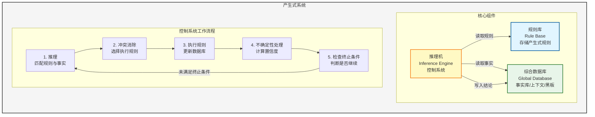

# 人工智能导论


## 一、基本概念

### 1.1 智能

> **智能的核心：** 思维
>
> **智能的基础：** 知识、感知、行为、进化

**总之，智能是知识和智力的总和**

#### 智能的特征

- 🎯 **感知能力** —— 前提
- 🧠 **记忆和思维能力** —— 根本因素
  - 思维：
    - 抽象思维（逻辑）
    - 形象思维：识别图像等
    - 灵感思维
- 📚 **学习和自适应能力**
- 🗣️ **行为能力**（表达）

### 1.2 人工智能

#### 研究内容

| 类别 | 内容 |
|||
| **知识表示** | 符号表示法：用各种包含具体含义的符号，以各种不同的方式和顺序组合起来表示知识的一类方法<br>连接机制表示法：把各种物理对象以不同的方式及顺序连接起来，并在其间互相传递及加工各种包含具体意义的信息，以此来表示相关的概念及知识 |
| **机器感知** | 机器视觉<br>机器听觉 |
| **机器学习** | 机器学习<br>机器学习方法 |
| **机器行为** | - |
| **机器思维** | 抽象思维（逻辑）、形象思维、灵感思维 |


---

## 二、知识表示与知识图谱

### 2.1 知识的特性

- ✅ **相对正确性：** 知识在一定的条件和环境下才是正确的
- ❓ **不确定性：**
  - 随机性
  - 模糊性
  - 不完全性
  - 经验
- 💡 **可表示性和可利用性**


### 2.2 知识的表示

> 将人类知识形式化或模型化


### 2.3 一阶谓词逻辑表示法

#### 命题
非真即假的语句

#### 谓词

**一般形式：** `P(x₁, x₂, ..., xₙ)`

- `x₁...xₙ` 称为**个体**
- 个体可以是常量、变量、函数或者谓词

#### 谓词连接词

| 连接词 | 符号 | 说明 | 示例 |
|--||||
| 非 | ¬ | 否定 | ¬P |
| 析取 | ∨ | 或（并） | P ∨ Q |
| 合取 | ∧ | 且（交） | P ∧ Q |
| 蕴含 | → | 如果...那么... | P → Q |
| 等价 | ↔ | 当且仅当 | P ↔ Q |

**蕴含示例：**
- "如果刘华跑得最快，那么他取得冠军"
- 形式化表示：`RUNS(Liuhua, faster) → WINS(Liuhua, champion)`

**等价示例：**
- `P ↔ Q` 的含义：P当且仅当Q
- `P ↔ Q` 等价于 `(P → Q) ∧ (Q → P)`


#### 谓词量词

| 量词 | 符号 | 含义 |
||||
| 全称量词 | ∀ | 对于所有 |
| 存在量词 | ∃ | 存在 |


#### 量词组合示例

以朋友关系 `F(x, y)` 为例：

| 公式 | 含义 |
|||
| `(∀x)(∃y) F(x, y)` | 对于个体域中的任何个体x都存在个体y，x与y是朋友<br>**含义：每个人都有朋友** |
| `(∃x)(∀y) F(x, y)` | 在个体域中存在个体x，与个体域中的任何个体y都是朋友<br>**含义：存在一个"全民好友"，是所有人的朋友** |
| `(∃x)(∃y) F(x, y)` | 在个体域中存在个体x与个体y，x与y是朋友<br>**含义：至少有一对朋友** |
| `(∀x)(∀y) F(x, y)` | 对于个体域中的任何两个个体x和y，x与y都是朋友<br>**含义：所有人彼此都是朋友** |


#### 量词否定

**存在量词的否定：**
```
¬(∃x)P(x) 等价于 (∀x)[¬P(x)]
```
解释：不存在x使得P(x)为真，也就是说对于任意x，P(x)为假，即非P(x)为真

**全称量词的否定：**
```
¬(∀x)P(x) 等价于 (∃x)[¬P(x)]
```
解释：并不是任意x都使得P(x)为真，存在x使得P(x)为假，即非P(x)为真


#### 谓词公式

1. 单个谓词是 **原子谓词公式**
2. 谓词公式加谓词量词和谓词连接词也是谓词公式


#### 谓词公式的性质

| 性质 | 说明 |
|||
| **解释** | 可求出真值（即 T or F） |
| **永真性** | 任何解释都为真，否则为永假的 |
| **可满足性** | 存在一个解释是的谓词公式为真，否则不可满足 |
| **等价性** | 两个谓词公式在一个个体域上对任一解释有相同的真值，则在该个体域上等价，若在任意个体与上有相同的真值，则这两个公式等价 |


#### 逻辑等价转换

**蕴含式转化：**
```
P → Q 等价于 ¬P ∨ Q
```

**德摩根定律：**
```
¬(P ∨ Q) 等价于 ¬P ∧ ¬Q
¬(P ∧ Q) 等价于 ¬P ∨ ¬Q
```

**其他等价式：**
```
P ∧ Q 等价于 Q ∧ P      （交换律）
P ∨ Q 等价于 Q ∨ P      （交换律）
(P ∧ Q) ∧ R 等价于 P ∧ (Q ∧ R)  （结合律）
(P ∨ Q) ∨ R 等价于 P ∨ (Q ∨ R)  （结合律）
```


#### 永真蕴含

> P→Q 永真，则 P 永真蕴含 Q，P 为 Q 的前提

**永真蕴含示例：**
- `P ∧ Q` 永真蕴含 `P`
- `P ∧ Q` 永真蕴含 `Q`
- `P` 永真蕴含 `P ∨ Q`
- `Q` 永真蕴含 `P ∨ Q`

#### 置换与合一

表达式 `P[x, f(v), B]` 的 4 个置换为：
- `s₁ = {z/x, w/y}`
- `s₂ = {A/y}`
- `s₃ = {q(z)/x, A/y}`
- `s₄ = {c/x, A/y}`

于是，我们可得到 `P[x, f(y), B]` 的 4 个置换的例：
- `P[x, f(y), B]s₁ = P[z, f(w), B]`
- `P[x, f(y), B]s₂ = P[x, f(A), B]`
- `P[x, f(y), B]s₃ = P[q(z), f(A), B]`
- `P[x, f(y), B]s₄ = P[c, f(A), B]`


#### 谓词逻辑的其他推理规则

> **定理⑩：** Q 为 P₁, P₂, …, Pₙ 的逻辑结论，当且仅当 `(P₁ ∧ P₂ ∧ ⋯ ∧ Pₙ) ∧ ¬Q` 是不可满足的。


#### 一阶谓词逻辑表示法的特点

**优点：**
1. ✅ 自然性
2. ✅ 精确性
3. ✅ 严密性
4. ✅ 容易实现

**局限性：**
1. ❌ 不能表示不确定的知识
2. ❌ 组合爆炸
3. ❌ 效率低


### 2.4 产生式表示法

#### 产生式

**规则知识的产生式：**
```
IF P THEN Q
```

**三元组：**
```
（对象，属性，值）
或者：（关系，对象1，对象2）
```

**不确定性表示：** 对于不确定的则在最后加上置信度（小数表示）


#### 产生式的形式描述与语义

**产生式语法结构（BNF形式）：**

```bnf
<产生式> ::= <前提> → <结论>
<前提> ::= <简单条件> | <复合条件>
<结论> ::= <事实> | <操作>
<复合条件> ::= <简单条件> AND <简单条件> [AND <简单条件>...]
              | <简单条件> OR <简单条件> [OR <简单条件>...]
<操作> ::= <操作名> [(<变元>, ...)]
```

> 符号说明：
> - `::=` 表示"定义为"
> - `|` 表示"或者是"
> - `[ ]` 表示"可缺省"


#### 产生式系统

##### 产生式系统的组成

产生式系统由以下三个核心部分组成：

| 组件 | 说明 |
|||
| **1. 规则库** | 用于描述相应领域内知识的产生式集合 |
| **2. 综合数据库** | （事实库、上下文、黑板等）一个用于存放问题求解过程中各种当前信息的数据结构 |
| **3. 推理机** | （控制系统）由一组程序组成，负责整个产生式系统的运行，实现对问题的求解 |


##### 控制系统的工作流程

控制系统执行以下几项工作：

| 步骤 | 工作内容 |
||-|
| **1. 推理** | 从规则库中选择与综合数据库中的已知事实进行匹配 |
| **2. 冲突消除** | 匹配成功的规则可能不止一条，进行冲突消除 |
| **3. 执行规则** | 执行某一规则时，如果其右部是一个或多个结论，则把这些结论加入到综合数据库中；如果其右部是一个或多个操作，则执行这些操作 |
| **4. 不确定性处理** | 对于不确定性知识，在执行每一条规则时还要按一定的算法计算结论的不确定性 |
| **5. 检查推理终止条件** | 检查综合数据库中是否包含了最终结论，决定是否停止系统的运行 |


##### 产生式表示法的优缺点

**优点：**
1. ✅ 自然性
2. ✅ 模块性
3. ✅ 有效性
4. ✅ 清晰性

**缺点：**
1. ❌ 效率不高
2. ❌ 不能表达结构性知识


##### 适合产生式表示的知识

1. 领域知识间关系不密切，不存在结构关系
2. 经验性及不确定性的知识，且相关领域中对这些知识没有严格、统一的理论
3. 领域问题的求解过程可被表示为一系列相对独立的操作，且每个操作可被表示为一条或多条产生式规则


##### 产生式系统的结构图




### 2.5 框架表示法

#### 框架的一般结构

```
<框架名>

槽名1: 侧面名₁₁    侧面值₁₁₁, …, 侧面值₁₁P₁
        |
        |           侧面名₁ₘ    侧面值₁ₘ₁, …, 侧面值₁ₘPₘ

槽名n: 侧面名ₙ₁    侧面值ₙ₁₁, …, 侧面值ₙ₁P₁
        |
        |           侧面名ₙₘ    侧面值ₙₘ₁, …, 侧面值ₙₘPₘ

约束: 约束条件₁
       |
       约束条件ₙ
```


#### 框架表示法的特点

| 特点 | 说明 |
|||
| **（1）结构性** | 便于表达结构性知识，能够将知识的内部结构关系及知识间的联系表示出来 |
| **（2）继承性** | 框架网络中，下层框架可以继承上层框架的槽值，也可以进行补充和修改 |
| **（3）自然性** | 框架表示法与人在观察事物时的思维活动是一致的 |


---

## 三、确定性推理方法

### 3.1 推理的基本概念

#### 3.1.1 推理的定义

> **推理：** 根据已知事实和知识，根据某种策略得出结论


#### 3.1.2 推理方式及其分类

##### 1. 演绎推理、归纳推理、默认推理

**（1）演绎推理（deductive reasoning）：一般 → 个别**

三段论式（三段论法）：
- **大前提：** 已知的一般性知识或假设
- **小前提：** 关于所研究的具体情况或个别事实的判断
- **结论：** 由大前提推出的适合于小前提所示情况的新判断

**示例：**
```
大前提：足球运动员的身体都是强壮的
小前提：高波是一名足球运动员
结论：  所以，高波的身体是强壮的
```


**（2）归纳推理：个别 → 一般**

- **完全归纳推理（必然性推理）：** 检查全部产品合格 → 该厂产品合格
- **不完全归纳推理（非必然性推理）：** 检查全部样品合格 → 该厂产品合格


**（3）默认推理（default reasoning，缺省推理）**

知识不完全的情况下假设某些条件已经具备所进行的推理。


##### 2. 确定性推理、不确定性推理

| 类型 | 说明 |
|||
| **（1）确定性推理** | 推理所用的知识与证据都是确定的，推出的结论也是确定的，其真值或者为真或者为假 |
| **（2）不确定性推理** | 推理所用的知识与证据不都是确定的，推出的结论也是不确定的 |


##### 3. 单调推理、非单调推理

| 类型 | 说明 |
|||
| **（1）单调推理** | 随着推理向前推进及新知识的加入，推出的结论越来越接近最终目标 |
| **（2）非单调推理** | 由于新知识的加入，不仅没有加强已推出的结论，反而要否定它，使推理退回到前面的某一步，重新开始 |

> 注：默认推理是非单调推理，基于经典逻辑的演绎推理是单调推理


##### 4. 启发式推理、非启发式推理

**启发式知识：** 与问题有关且能加快推理过程、提高搜索效率的知识。

**示例：** 目标是在脑膜炎、肺炎、流感中选择一个
- 产生式规则：r₁：脑膜炎；r₂：肺炎；r₃：流感
- 启发式知识："脑膜炎危险"、"目前正在盛行流感"


#### 3.1.3 推理的方向

##### 1. 正向推理（事实驱动推理）：已知事实 → 结论

**基本思想：**
1. 从初始已知事实出发，在知识库KB中找出当前可适用的知识，构成可适用知识集KS
2. 按某种冲突消解策略从KS中选出一条知识进行推理，并将推出的新事实加入到数据库DB中作为下一步推理的已知事实，再在KB中选取可适用知识构成KS
3. 重复（2），直到求得问题的解或KB中再无可适用的知识

**实现正向推理需要解决的问题：**
- 确定匹配（知识与已知事实）的方法
- 按什么策略搜索知识库
- 冲突消解策略

**特点：** 正向推理简单，易实现，但目的性不强，效率低。


##### 2. 逆向推理（目标驱动推理）：以某个假设目标作为出发点

**基本思想：**
- 选定一个假设目标
- 寻找支持该假设的证据，若所需的证据都能找到，则原假设成立；若无论如何都找不到所需要的证据，说明原假设不成立，为此需要另作新的假设

**主要优点：** 不必使用与目标无关的知识，目的性强，同时它还有利于向用户提供解释。

**主要缺点：** 起始目标的选择有盲目性。

**特点：** 目的性强，利于向用户提供解释，但选择初始目标时具有盲目性，比正向推理复杂。


##### 3. 混合推理

- 正向推理：盲目、效率低
- 逆向推理：若提出的假设目标不符合实际，会降低效率

**正反向混合推理：**
1. **先正向后逆向：** 先进行正向推理，帮助选择某个目标，即从已知事实演绎出部分结果，然后再用逆向推理证实该目标或提高其可信度
2. **先逆向后正向：** 先假设一个目标进行逆向推理，然后再利用逆向推理中得到的信息进行正向推理，以推出更多的结论


##### 4. 双向推理

正向推理与逆向推理同时进行，且在推理过程中的某一步骤上"碰头"的一种推理。


#### 3.1.4 冲突消解策略

**已知事实与知识的三种匹配情况：**
1. 恰好匹配成功（一对一）
2. 不能匹配成功
3. 多种匹配成功（一对多、多对一、多对多）

**多种冲突消解策略：**
1. 按就近原则排序
2. 按已知事实的新鲜性排序
3. 按匹配度排序
4. 按知识差异性排序
5. 按条件个数排序

**示例：**
```
r₁: IF A₁ AND A₂ THEN H₁
r₂: IF A₁ AND A₂ AND A₃ AND A₄ THEN H₂
```


### 3.2 自然演绎推理

> **自然演绎推理：** 从一组已知为真的事实出发，运用经典逻辑的推理规则推出结论的过程。

**推理规则：** 假言推理、拒取式推理

#### 常见错误

| 错误类型 | 说明 | 示例 |
|-|||
| **否定前件** | P→Q, ¬P → ¬Q（错误） | 如果下雨，则地上是湿的；没有下雨；所以，地上不湿。（错误） |
| **肯定后件** | P→Q, Q → P（错误） | 如果行星系统是以太阳为中心的，则金星会显示出位相变化；金星显示出位相变化；所以，行星系统是以太阳为中心。（错误） |


#### 例3.1

**已知事实：**
1. 凡是容易的课程小王(Wang)都喜欢
2. C班的课程都是容易的
3. ds是C班的一门课程

**求证：** 小王喜欢ds这门课程

**证明：**

**定义谓词：**
- `EASY(x)`：x是容易的
- `LIKE(x, y)`：x喜欢y
- `C(x)`：x是C班的一门课程

**已知事实和结论用谓词公式表示：**
```
(∀x)(EASY(x) → LIKE(Wang, x))
(∀x)(C(x) → EASY(x))
C(ds)
LIKE(Wang, ds)  （待证）
```


#### 优点

- 表达定理证明过程自然，易理解
- 拥有丰富的推理规则，推理过程灵活
- 便于嵌入领域启发式知识


### 3.3 谓词公式化为子句集的方法

#### 基本概念

| 概念 | 说明 |
|||
| **原子（atom）谓词公式** | 一个不能再分解的命题 |
| **文字（literal）** | 原子谓词公式及其否定<br>P：正文字，¬P：负文字 |
| **子句（clause）** | 任何文字的析取式。任何文字本身也都是子句 |
| **空子句（NIL）** | 不包含任何文字的子句 |
| **子句集** | 由子句构成的集合 |

> **空子句是永假的，不可满足的。**


#### 合取范式

设 `C₁, C₂, C₃, ..., Cₙ` 为 n 个子句
- **合取范式：** `C₁ ∧ C₂ ∧ C₃ ∧ ... ∧ Cₙ`
- **子句集：** `S = {C₁, C₂, C₃, ..., Cₙ}`

任何谓词公式 F 都可通过等价关系及推理规则化为相应的子句集 S。


#### 消解（Resolution）

当消解可使用时，消解过程被应用于母体子句对，以便产生一个导出子句。

**示例：** 如果存在某个公理 `¬P ∨ Q` 和另一公理 `¬Q ∨ R`，那么 `¬P ∨ R` 在逻辑上成立。这就是消解，而称 `¬P ∨ R` 为 `¬P ∨ Q` 和 `¬Q ∨ R` 的消解式（resolvent）。


#### 化简子句集

消解反演采用的是反证的思想，只要将推理公式的条件部分和结论的否定都化为子句并证明所形成的子句集是不可满足的，即可证明原公式成立。


#### 谓词公式化为子句集的九个步骤

**（1）消去蕴涵和等价符号**

**（2）减少否定符号¬的辖域**

每个否定符号¬最多只用到一个谓词符号上，并反复应用德·摩根定律：

| 原式 | 替换为 |
||--|
| `¬(A ∧ B)` | `¬A ∨ ¬B` |
| `¬(A ∨ B)` | `¬A ∧ ¬B` |
| `¬(∀x)A` | `(∃x){¬A}` |
| `¬(∃x)A` | `(∀x){¬A}` |
| `¬(¬A)` | `A` |

**（3）对变量标准化**

在任一量词辖域内，受该量词约束的变量为一哑元（虚构变量），它可以在该辖域内处处统一地被另一个没有出现过的任意变量所代替，而不改变公式的真值。

**示例：** 把 `(∀x){P(x) → (∃x)Q(x)}` 标准化而得到：`(∀x){P(x) → (∃y)Q(y)}`

**（4）消去存在量词**

**(a) 如果要消去的存在量词在某些全称量词的辖域内**

- **Skolem函数：** 在公式 `(∀y)[(∃x)P(x, y)]` 中，存在量词是在全称量词的辖域内，我们允许所存在的 x 可能依赖于 y 值。令这种依赖关系用函数 g(y) 定义，它把每个 y 值映射到存在的那个 x。
- Skolem函数所使用的函数符号必须是新的，即不允许是公式中已经出现过的函数符号。
- **示例：** `(∀y)P(g(y), y)`

**(b) 如果要消去的存在量词不在任何一个全称量词的辖域内**

- 使用不含变量的Skolem函数即常量
- **示例：** `(∃x)P(x)` 化为 `P(A)`，其中常量符号A用来表示我们知道的存在实体。A必须是个新的常量符号，它未曾在公式中其它地方使用过。

**（5）化为前束形**

到这一步，已不留下任何存在量词，而且每个全称量词都有自己的变量。把所有全称量词移到公式的左边，并使每个量词的辖域包括这个量词后面公式的整个部分。

**前束形公式由前缀和母式组成：**
- **前缀：** 由全称量词串组成
- **母式：** 由没有量词的公式组成
- **前束形 = （前缀）（母式）**

**（6）把母式化为合取范式**

任何母式都可写成由一些谓词公式和（或）谓词公式的否定的析取的有限集组成的合取。反复应用分配律，把任一母式化成合取范式。

**示例：** 把 `A ∨ {B ∧ C}` 化为 `{A ∨ B} ∧ {A ∨ C}`

**（7）消去全称量词**

到了这一步，所有余下的量词均被全称量词量化了。同时，全称量词的次序也不重要了。因此，我们可以消去前缀，即消去明显出现的全称量词。

**（8）消去合取符号∧**

用 `{(A ∨ B), (A ∨ C)}` 代替 `(A ∨ B) ∧ (A ∨ C)`，以消去明显的符号∧。反复代替的结果，最后得到一个有限集，其中每个公式是文字的析取。

**（9）更换变量名称**

可以更换变量符号的名称，使一个变量符号不出现在一个以上的子句中。


> **定理3.1：** 谓词公式不可满足的充要条件是其子句集不可满足。


### 3.4 鲁宾逊归结原理

> **鲁宾逊归结原理（消解原理）的基本思想：**
> 检查子句集 S 中是否包含空子句，若包含，则 S 不可满足。若不包含，在 S 中选择合适的子句进行归结，一旦归结出空子句，就说明 S 是不可满足的。

> **子句集中子句之间是合取关系，只要有一个子句不可满足，则子句集就不可满足。**


#### 1. 命题逻辑中的归结原理（基子句的归结）

**定义3.1（归结）：** 设 C₁ 与 C₂ 是子句集中的任意两个子句，如果 C₁ 中的文字 L₁ 与 C₂ 中的文字 L₂ 互补，那么从 C₁ 和 C₂ 中分别消去 L₁ 和 L₂，并将二个子句中余下的部分析取，构成一个新子句 C₁₂。

**定理3.2：** 归结式 C₁₂ 是其亲本子句 C₁ 与 C₂ 的逻辑结论。即如果 C₁ 与 C₂ 为真，则 C₁₂ 为真。

**推论1：** 设 C₁ 与 C₂ 是子句集 S 中的两个子句，C₁₂ 是它们的归结式，若用 C₁₂ 代替 C₁ 与 C₂ 后得到新子句集 S₁，则由 S₁ 不可满足性可推出原子句集 S 的不可满足性。

**推论2：** 设 C₁ 与 C₂ 是子句集 S 中的两个子句，C₁₂ 是它们的归结式，若 C₁₂ 加入原子句集 S，得到新子句集 S₁，则 S 与 S₁ 在不可满足的意义上是等价的。


#### 2. 谓词逻辑中的归结原理（含有变量的子句的归结）

对于谓词逻辑，归结式是其亲本子句的逻辑结论。

**对于一阶谓词逻辑：**
- 若子句集是不可满足的，则必存在一个从该子句集到空子句的归结演绎
- 若从子句集存在一个到空子句的演绎，则该子句集是不可满足的
- 如果没有归结出空子句，则既不能说 S 不可满足，也不能说 S 是可满足的


### 3.5 归结反演

> **应用归结原理证明定理的过程称为归结反演。**

#### 用归结反演证明的步骤

1. 将已知前提表示为谓词公式 F
2. 将待证明的结论表示为谓词公式 Q，并否定得到 ¬Q
3. 把谓词公式集 {F, ¬Q} 化为子句集 S
4. 应用归结原理对子句集 S 中的子句进行归结，并把每次归结得到的归结式都并入到 S 中。如此反复进行，若出现了空子句，则停止归结，此时就证明了 Q 为真


#### 例3.9

某公司招聘工作人员，A, B, C 三人应试，经面试后公司表示如下想法：
1. 三人中至少录取一人
2. 如果录取 A 而不录取 B，则一定录取 C
3. 如果录取 B，则一定录取 C

**求证：** 公司一定录取 C。


### 3.6 应用归结原理求解问题

#### 应用归结原理求解问题的步骤

1. 已知前提 F 用谓词公式表示，并化为子句集 S
2. 把待求解的问题 Q 用谓词公式表示，并否定 Q，再与 ANSWER 构成析取式（¬Q ∨ ANSWER）
3. 把上述公式化为子句集
4. 应用归结原理对子句集进行归结
5. 若得到归结式 ANSWER，则答案就在 ANSWER 中


#### 例3.11

**已知：**
- F₁：王（Wang）先生是小李（Li）的老师
- F₂：小李与小张（Zhang）是同班同学
- F₃：如果 x 与 y 是同班同学，则 x 的老师也是 y 的老师

**求：** 小张的老师是谁？

**解：**

**定义谓词：**
- `TEACHER(x, y)`：x 是 y 的老师
- `CLASSMATE(x, y)`：x 与 y 是同班同学

**把已知前提表示成谓词公式**

**把目标表示成谓词公式，并把它否定后与 ANSWER 析取**

**应用归结原理进行归结，得到 ANSWER(Wang)，即小张的老师是王先生**

---

## 四、不确定性推理方法

### 4.1 不确定性推理中的基本问题

> **不确定性推理：** 从不确定性的初始证据出发，通过运用不确定性的知识，最终推出具有一定程度的不确定性但却是合理或者近乎合理的结论的思维过程。

#### 现实世界中不确定性的来源

- 🎲 客观上存在的随机性
- 🌫️ 模糊性
- 📊 反映到知识以及由观察所得到的证据上来，形成不确定性的知识及不确定的证据


#### 不确定性推理中的基本问题

##### 1. 不确定性的表示与量度

**（1）知识不确定性的表示**
- 在专家系统中知识的不确定性一般是由领域专家给出的
- 通常是一个数值——知识的静态强度

**（2）证据不确定性的表示——证据的动态强度**
- 用户在求解问题时提供的初始证据
- 在推理中用前面推出的结论作为当前推理的证据

**（3）不确定性的量度**

要求：
- 能充分表达相应知识及证据不确定性的程度
- 度量范围的指定便于领域专家及用户对不确定性的估计
- 便于对不确定性的传递进行计算，而且对结论算出的不确定性量度不能超出量度规定的范围
- 度量的确定应当是直观的，同时应有相应的理论依据


##### 2. 不确定性匹配算法及阈值的选择

- **不确定性匹配算法：** 用来计算匹配双方相似程度的算法
- **阈值：** 用来指出相似的"限度"


##### 3. 组合证据不确定性的算法

- 最大最小方法
- Hamacher方法
- 概率方法
- 有界方法
- Einstein方法等


##### 4. 不确定性的传递算法

- （1）在每一步推理中，如何把证据及知识的不确定性传递给结论
- （2）在多步推理中，如何把初始证据的不确定性传递给最终结论


##### 5. 结论不确定性的合成


### 4.2 可信度方法

> **可信度方法：** 1975年肖特里菲（E. H. Shortliffe）等人在确定性理论（theory of confirmation）的基础上，结合概率论等提出的一种不确定性推理方法。

**优点：** 直观、简单，且效果好。

**可信度：** 根据经验对一个事物或现象为真的相信程度。可信度带有较大的主观性和经验性，其准确性难以把握。

**C-F模型：** 基于可信度表示的不确定性推理的基本方法。


#### 1. 知识不确定性的表示

**产生式规则表示：**
```
IF E THEN H (CF(H, E))
```

`CF(H, E)`：可信度因子（certainty factor），反映前提条件与结论的联系强度。

**示例：**
```
IF 头痛 AND 流涕 THEN 感冒 (0.7)
```

**CF(H, E)的取值范围：[-1, 1]**

| CF(H, E) 值 | 含义 |
|-||
| CF(H, E) > 0 | 证据的出现增加结论 H 为真的可信度，证据的出现越是支持 H 为真，就使 CF(H, E) 的值越大 |
| CF(H, E) < 0 | 证据的出现越是支持 H 为假，CF(H, E) 的值就越小 |
| CF(H, E) = 0 | 证据的出现与否与 H 无关 |


#### 2. 证据不确定性的表示

**证据 E 的可信度取值范围：[-1, 1]**

| 情况 | CF(E) 值 |
||-|
| 肯定为真 | CF(E) = 1 |
| 肯定为假 | CF(E) = -1 |
| 以某种程度为真 | 0 < CF(E) < 1 |
| 以某种程度为假 | -1 < CF(E) < 0 |
| 未获得任何相关的观察 | CF(E) = 0 |

**静态强度 CF(H, E)：** 知识的强度，即当 E 所对应的证据为真时对 H 的影响程度。

**动态强度 CF(E)：** 证据 E 当前的不确定性程度。


#### 3. 组合证据不确定性的算法

**（1）组合证据为合取**
```
E = E₁ AND E₂ AND ... AND Eₙ
```
则：
```
CF(E) = min{CF(E₁), CF(E₂), ..., CF(Eₙ)}
```

**（2）组合证据为析取**
```
E = E₁ OR E₂ OR ... OR Eₙ
```
则：
```
CF(E) = max{CF(E₁), CF(E₂), ..., CF(Eₙ)}
```


#### 4. 不确定性的传递算法

> **C-F模型中的不确定性推理：** 从不确定的初始证据出发，通过运用相关的不确定性知识，最终推出结论并求出结论的可信度值。

**结论 H 的可信度计算公式：**
```
CF(H) = CF(H, E) × max{0, CF(E)}
```


#### 5. 结论不确定性的合成算法

**（1）分别对每一条知识求出 CF(H)**

**（2）求出 CF₁(H) 与 CF₂(H) 对 H 的综合影响所形成的可信度 CF₁₂(H)：**

```
CF₁₂(H) =
    CF₁(H) + CF₂(H) - CF₁(H) × CF₂(H)              当 CF₁(H) ≥ 0 且 CF₂(H) ≥ 0
    CF₁(H) + CF₂(H) + CF₁(H) × CF₂(H)              当 CF₁(H) < 0 且 CF₂(H) < 0
    (CF₁(H) + CF₂(H)) / (1 - min{|CF₁(H)|, |CF₂(H)|})  当 CF₁(H) × CF₂(H) < 0
```


#### 例4.1

设有如下一组知识：
```
r₁: IF E₁ THEN H (0.8)
r₂: IF E₂ THEN H (0.6)
```

已知：`CF(E₁) = 0.5`, `CF(E₂) = 0.8`

求：`CF(H)`

**解：**

**第一步：对每一条规则求出 CF(H)**
- `CF₁(H) = 0.8 × max{0, 0.5} = 0.4`
- `CF₂(H) = 0.6 × max{0, 0.8} = 0.48`

**第二步：根据结论不确定性的合成算法得到：**
```
CF₁₂(H) = 0.4 + 0.48 - 0.4 × 0.48 = 0.688
```

**综合可信度：CF(H) = 0.688**


### 4.3 证据理论

> **证据理论（theory of evidence）：** 又称 D-S 理论，是德普斯特（A. P. Dempster）首先提出，沙佛（G. Shafer）进一步发展起来的一种处理不确定性的理论。


#### 4.3.1 概率分配函数

**样本空间 D：** 设 D 是变量 x 所有可能取值的集合，且 D 中的元素是互斥的，在任一时刻 x 都取且只能取 D 中的某一个元素为值。

**命题表示：** 在证据理论中，D 的任何一个子集 A 都对应于一个关于 x 的命题，称该命题为"x 的值是在 A 中"。

**示例：** 设 x：所看到的颜色，D = {红，黄，蓝}
- A = {红}："x 是红色"
- A = {红，蓝}："x 或者是红色，或者是蓝色"


**定义4.1（概率分配函数）：** 设函数 M：2ᴰ → [0, 1]，且满足：
```
(1) M(Φ) = 0
(2) Σ M(A) = 1  （对所有 A ⊆ D）
```

则 M 是 2ᴰ 上的基本概率分配函数，M(A) 是 A 的基本概率数。

**几点说明：**
- 设样本空间 D 中有 n 个元素，则 D 中子集的个数为 2ⁿ 个
- 概率分配函数：把 D 的任意一个子集 A 都映射为 [0, 1] 上的一个数 M(A)
- 当 A = {xᵢ} 时，M(A)：对相应命题 A 的精确信任度
- 概率分配函数与概率不同

**示例：** 设 D = {红，黄，蓝}
```
M({红}) = 0.3, M({黄}) = 0, M({蓝}) = 0.1
M({红，黄}) = 0.2, M({红，蓝}) = 0.2
M({黄，蓝}) = 0.1, M({红，黄，蓝}) = 0.1, M(Φ) = 0
但：M({红}) + M({黄}) + M({蓝}) = 0.4 ≠ 1
```


#### 4.3.2 信任函数

**定义4.2（信任函数）：** 命题的信任函数 Bel：2ᴰ → [0, 1] 定义为：
```
Bel(A) = Σ M(B)  （对所有 B ⊆ A）
```

Bel(A)：对命题 A 为真的总的信任程度。


#### 4.3.3 似然函数

**似然函数（plausibility function）：** 不可驳斥函数或上限函数。

**定义：** 似然函数 Pl：2ᴰ → [0, 1] 定义为：
```
Pl(A) = 1 - Bel(¬A) = Σ M(B)  （对所有 B ∩ A ≠ Φ）
```

**示例：** 设 D = {红，黄，蓝}
```
M({红}) = 0.3, M({黄}) = 0, M({红，黄}) = 0.2
Bel({红}) = M({红}) = 0.3
Pl({红}) = M({红}) + M({红，黄}) + M({红，蓝}) + M({红，黄，蓝})
```


#### 4.3.4 概率分配函数的正交和（证据的组合）

**定义4.4：** 设 M₁ 和 M₂ 是两个概率分配函数，则其正交和 M = M₁ ⊕ M₂ 为：
```
M(Φ) = 0
M(A) = (1/K) × Σ M₁(B) × M₂(C)  （对所有 B ∩ C = A）
```

其中：
```
K = Σ M₁(B) × M₂(C)  （对所有 B ∩ C ≠ Φ）
```

| 条件 | 结果 |
|||
| K ≠ 0 | 正交和 M 也是一个概率分配函数 |
| K = 0 | 不存在正交和 M，即没有可能存在概率函数，称 M₁ 与 M₂ 矛盾 |


#### 例4.2

设 D = {黑，白}，且设
```
M₁({黑}) = 0.3, M₁({白}) = 0.6, M₁({黑，白}) = 0.1
M₂({黑}) = 0.4, M₂({白}) = 0.4, M₂({黑，白}) = 0.2
```

则：`K = 0.3 × 0.4 + 0.3 × 0.2 + 0.6 × 0.4 + 0.6 × 0.2 + 0.1 × 0.4 + 0.1 × 0.2 + 0.1 × 0.2 = 0.52`

组合后得到的概率分配函数：
```
M({黑}) = (0.3 × 0.4 + 0.3 × 0.2 + 0.1 × 0.4) / 0.52 = 0.269
M({白}) = (0.6 × 0.4 + 0.6 × 0.2 + 0.1 × 0.4) / 0.52 = 0.577
M({黑，白}) = (0.1 × 0.2) / 0.52 = 0.038
```


#### 4.3.5 基于证据理论的不确定性推理

**步骤：**
1. 建立问题的样本空间 D
2. 由经验给出，或者由随机性规则和事实的信度度量算基本概率分配函数
3. 计算所关心的子集的信任函数值、似然函数值
4. 由信任函数值、似然函数值得出结论


#### 例4.3

设有规则：
- （1）如果流鼻涕则感冒但非过敏性鼻炎（0.9）或过敏性鼻炎但非感冒（0.1）
- （2）如果眼发炎则感冒但非过敏性鼻炎（0.8）或过敏性鼻炎但非感冒（0.05）

有事实：
- （1）小王流鼻涕（0.9）
- （2）小王发眼炎（0.4）

问：小王患的什么病？

**解：** 取样本空间：
- a：表示"感冒但非过敏性鼻炎"
- b：表示"过敏性鼻炎但非感冒"
- c：表示"同时得了两种病"

取基本概率分配函数，然后计算信任函数和似然函数，得出结论。


### 4.4 模糊推理方法

#### 4.4.1 模糊逻辑的提出与发展

**1965年：** 美国 L. A. Zadeh 发表了"fuzzy set"的论文，首先提出了模糊理论。

**发展历程：**

| 年份 | 事件 |
|||
| 1974年 | 英国 Mamdani 首次将模糊理论应用于热电厂的蒸汽机控制 |
| 1976年 | Mamdani 又将模糊理论应用于水泥旋转炉的控制 |
| 1983年 | 日本 Fuji Electric 公司实现了饮水处理装置的模糊控制 |
| 1987年 | 日本 Hitachi 公司研制出地铁的模糊控制系统 |
| 1987-1990年 | 在日本申报的模糊产品专利就达 319 种 |

**应用：** 模糊洗衣机、模糊吸尘器、模糊电冰箱和模糊摄像机等。


#### 4.4.2 模糊集合

##### 基本概念

| 概念 | 说明 |
|||
| **论域** | 所讨论的全体对象，用 U 等表示 |
| **元素** | 论域中的每个对象，常用 a, b, c, x, y, z 表示 |
| **集合** | 论域中具有某种相同属性的确定的、可以彼此区别的元素的全体，常用 A, B 等表示 |
| **元素 a 和集合 A 的关系** | a 属于 A 或 a 不属于 A，即只有两个真值"真"和"假" |

**模糊逻辑：** 给集合中每一个元素赋予一个介于 0 和 1 之间的实数，描述其属于一个集合的强度，该实数称为元素属于一个集合的隶属度。集合中所有元素的隶属度全体构成集合的隶属函数。

**例如，"成年人"集合：**
- 传统集合：18岁以上是成年人，18岁以下不是成年人
- 模糊集合：随着年龄增长，属于"成年人"的程度逐渐增加


##### 模糊集合的表示方法

**当论域中元素数目有限时，模糊集合 A 的数学描述为：**
```
A = {(x, μₐ(x)) | x ∈ U}
```

μₐ(x)：元素 x 属于模糊集 A 的隶属度，U 是元素的论域。

**（1）Zadeh表示法**
```
A = μₐ(x₁)/x₁ + μₐ(x₂)/x₂ + ... + μₐ(xₙ)/xₙ
```

**（2）序偶表示法**
```
A = {(x₁, μₐ(x₁)), (x₂, μₐ(x₂)), ..., (xₙ, μₐ(xₙ))}
```

**（3）向量表示法**
```
A = (μₐ(x₁), μₐ(x₂), ..., μₐ(xₙ))
```


##### 隶属函数

**常见的隶属函数：** 正态分布、三角分布、梯形分布等

**隶属函数确定方法：**
- 模糊统计法
- 专家经验法
- 二元对比排序法
- 基本概念扩充法


#### 4.4.3 模糊集合的运算

**（1）模糊集合的包含关系**
```
若 μₐ(x) ≤ μᵦ(x)，则 A ⊆ B
```

**（2）模糊集合的相等关系**
```
若 μₐ(x) = μᵦ(x)，则 A = B
```

**（3）模糊集合的交并补运算**

| 运算 | 公式 |
|||
| **① 交运算** | `μₐ∩ᵦ(x) = min{μₐ(x), μᵦ(x)}` |
| **② 并运算** | `μₐ∪ᵦ(x) = max{μₐ(x), μᵦ(x)}` |
| **③ 补运算** | `μ¬ₐ(x) = 1 - μₐ(x)` |

**（4）模糊集合的代数运算**

| 运算 | 公式 |
|||
| **① 代数积** | `μₐ·ᵦ(x) = μₐ(x) × μᵦ(x)` |
| **② 代数和** | `μₐ+ᵦ(x) = μₐ(x) + μᵦ(x) - μₐ(x) × μᵦ(x)` |
| **③ 有界和** | `μₐ⊕ᵦ(x) = min{1, μₐ(x) + μᵦ(x)}` |
| **④ 有界积** | `μₐ⊙ᵦ(x) = max{0, μₐ(x) + μᵦ(x) - 1}` |


#### 4.4.4 模糊关系与模糊关系的合成

##### 1. 模糊关系

| 关系类型 | 说明 |
|-||
| **普通关系** | 两个集合中的元素之间是否有关联 |
| **模糊关系** | 两个模糊集合中的元素之间关联程度的多少 |

**模糊关系矩阵 R：** 设 X = {x₁, x₂, ..., xₘ}，Y = {y₁, y₂, ..., yₙ}，则 X 到 Y 的模糊关系 R 可以用一个 m×n 的矩阵表示：
```
R = [rᵢⱼ]  其中 rᵢⱼ = μᵣ(xᵢ, yⱼ)
```

##### 2. 模糊关系的合成

设 R 是 X 到 Y 的模糊关系，S 是 Y 到 Z 的模糊关系，则 R 与 S 的合成 T = R ∘ S 是一个 X 到 Z 的模糊关系：
```
μₜ(x, z) = max{min{μᵣ(x, y), μₛ(y, z)}}  （对所有 y ∈ Y）
```


#### 4.4.5 模糊推理

##### 1. 模糊知识表示

人类思维判断的基本形式：
```
如果（条件）→ 则（结论）
```

**示例：** 如果压力较高且温度在慢慢上升，则阀门略开

**模糊规则：** 从条件论域到结论论域的模糊关系矩阵 R。通过条件模糊向量与模糊关系 R 的合成进行模糊推理，得到结论的模糊向量，然后采用"清晰化"方法将模糊结论转换为精确量。

##### 2. 对 IF A THEN B 类型的模糊规则的推理

若已知输入为 A，则输出为 B；若现在已知输入为 A'，则输出 B' 用合成规则求取：
```
B' = A' ∘ R
```

其中模糊关系 R：
```
R = A × B  （笛卡尔积）
```


#### 4.4.6 模糊决策

> **模糊决策（模糊判决、解模糊或清晰化）：** 由模糊推理得到的结论或者操作是一个模糊向量，转化为确定值的过程。

**1. 最大隶属度法**
选择隶属度最大的元素作为输出值。

**2. 加权平均判决法**
```
y₀ = (Σ μᵢ × yᵢ) / (Σ μᵢ)
```

**3. 中位数法**
选择使隶属函数曲线下面积相等的点作为输出值。


#### 4.4.7 模糊推理的应用

#### 例4.10

设有模糊控制规则："如果温度低，则将风门开大"。设温度和风门开度的论域为 {1, 2, 3, 4, 5}。

"温度低"和"风门大"的模糊量：
```
"温度低" = 1/1 + 0.6/2 + 0.3/3 + 0.0/4 + 0/5
"风门大" = 0/1 + 0.0/2 + 0.3/3 + 0.6/4 + 1/5
```

已知事实"温度较低"，可以表示为：
```
"温度较低" = 0.8/1 + 1/2 + 0.6/3 + 0.3/4 + 0/5
```

试用模糊推理确定风门开度。

**解：**

**（1）确定模糊关系 R**
通过笛卡尔积计算模糊关系矩阵 R。

**（2）模糊推理**
```
B' = A' ∘ R = (0.0, 0.0, 0.3, 0.6, 0.8)
```

**（3）模糊决策**
- 用最大隶属度法进行决策得风门开度为 **5**
- 用加权平均判决法和中位数法进行决策得风门开度为 **4**

## 五、搜索求解策略

### 5.1 搜索的概念

#### 5.1.1 搜索的基本问题与主要过程

> **搜索：** 一种求解问题的一般方法，适用于缺乏直接求解方法的问题。

**问题求解的两个方面：**
1. **问题的表示**
2. **求解方法的选择**

**问题求解的基本方法：**
- 搜索法
- 归约法
- 归结法
- 推理法
- 产生式

**搜索中需要解决的基本问题：**
1. 是否一定能找到一个解
2. 找到的解是否是最佳解
3. 时间与空间复杂性如何
4. 是否终止运行或是否会陷入一个死循环

**搜索的主要过程：**
1. 从初始或目的状态出发，并将它作为当前状态
2. 扫描操作算子集，将适用当前状态的一些操作算子作用于当前状态而得到新的状态，并建立指向其父节点的指针
3. 检查所生成的新状态是否满足结束状态，如果满足，则得到问题的一个解，并可沿着有关指针从结束状态反向到达开始状态，给出一解答路径；否则，将新状态作为当前状态，返回第（2）步再进行搜索

#### 5.1.2 搜索策略

##### 1. 搜索方向

| 搜索方向 | 说明 |
|||
| **（1）数据驱动（正向搜索）** | 从初始状态出发的正向搜索，从问题给出的条件出发 |
| **（2）目的驱动（逆向搜索）** | 从目的状态出发的逆向搜索，看哪些操作算子能产生该目的以及应用这些操作算子产生目的时需要哪些条件 |
| **（3）双向搜索** | 从开始状态出发作正向搜索，同时又从目的状态出发作逆向搜索，直到两条路径在中间的某处汇合为止 |

##### 2. 盲目搜索与启发式搜索

| 类型 | 说明 |
|||
| **（1）盲目搜索** | 在不具有对特定问题的任何有关信息的条件下，按固定的步骤（依次或随机调用操作算子）进行的搜索 |
| **（2）启发式搜索** | 考虑特定问题领域可应用的知识，动态地确定调用操作算子的步骤，优先选择较适合的操作算子，尽量减少不必要的搜索，以求尽快地到达结束状态 |

---

### 5.2 状态空间的搜索策略

#### 5.2.1 状态空间表示法

**状态：** 表示系统状态、事实等叙述型知识的一组变量或数组

**操作：** 表示引起状态变化的过程型知识的一组关系或函数

**状态空间：** 利用状态变量和操作符号，表示系统或问题的有关知识的符号体系，状态空间是一个四元组：

```
(S, O, S₀, G)
```

其中：
- **S**：状态集合
- **O**：操作算子的集合
- **S₀**：包含问题的初始状态，是S的非空子集
- **G**：若干具体状态或满足某些性质的路径信息描述

**求解路径：** 从初始节点S₀到目标节点G的路径

**状态空间解：** 一个有限的操作算子序列

**例5.1 八数码问题的状态空间**

- **状态集**：所有摆法S
- **操作算子**：
  - 将空格向上移 Up
  - 将空格向左移 Left
  - 将空格向下移 Down
  - 将空格向右移 Right

#### 5.2.2 状态空间的图描述

**状态空间的有向图描述：**
- **节点（状态）**：表示问题的一种状态
- **边（操作算子）**：表示状态之间的转换

**例5.3 旅行商问题（TSP）**

旅行商问题或邮递员路径问题：寻找访问所有城市并返回起点的最短路径。

---

### 5.3 盲目的图搜索策略

#### 5.3.1 回溯策略

**带回溯策略的搜索：**
- 从初始状态出发，不停地、试探性地寻找路径，直到它到达目的或"不可解结点"，即"死胡同"为止
- 若它遇到不可解结点就回溯到路径中最近的父结点上，查看该结点是否还有其他的子结点未被扩展。若有，则沿这些子结点继续搜索；如果找到目标，就成功退出搜索，返回解题路径

**回溯搜索的算法（三张表）：**

| 表 | 说明 |
|||
| **（1）PS（path states）表** | 保存当前搜索路径上的状态。如果找到了目的，PS就是解路径上的状态有序集 |
| **（2）NPS（new path states）表** | 新的路径状态表。它包含了等待搜索的状态，其后裔状态还未被搜索到，即未被生成扩展 |
| **（3）NSS（no solvable states）表** | 不可解状态集，列出了找不到解路径的状态。如果在搜索中扩展出的状态是它的元素，则可立即将之排除，不必沿该状态继续搜索 |

**图搜索算法的回溯思想：**
1. 用未处理状态表（NPS）使算法能返回（回溯）到其中任一状态
2. 用一张"死胡同"状态表（NSS）来避免算法重新搜索无解的路径
3. 在PS表中记录当前搜索路径的状态，当满足目的时可以将它作为结果返回
4. 为避免陷入死循环必须对新生成的子状态进行检查，看它是否在该三张表中

#### 5.3.2 宽度优先搜索策略

**宽度优先搜索（Breadth-first Search，广度优先搜索）：** 以接近起始节点的程度（深度）为依据，进行逐层扩展的节点搜索方法。

**特点：**
1. 每次选择深度最浅的节点首先扩展，搜索是逐层进行的
2. 一种高价搜索，但若有解存在，则必能找到它

**OPEN表（NPS表）：** 已经生成出来但其子状态未被搜索的状态，特点：先进先出（FIFO）

**CLOSED表（PS表和NSS表的合并）：** 记录了已被生成扩展过的状态

**例5.4 积木问题**

通过搬动积木块，希望从初始状态达到一个目的状态，即三块积木堆叠在一起。

**操作算子为** `MOVE(X, Y)`：把积木X搬到Y（积木或桌面）上面

**操作算子可运用的先决条件：**
1. 被搬动积木X的顶部必须为空
2. 如果Y是积木，则积木Y的顶部也必须为空
3. 同一状态下，运用操作算子的次数不得多于一次

#### 5.3.3 深度优先搜索策略

**深度优先搜索（Depth-first Search）：** 首先扩展最新产生的节点，深度相等的节点按其生成顺序依次进行扩展。

**特点：**
- 扩展最深的节点的结果使得搜索沿着状态空间某条单一的路径从起始节点向下进行下去
- 仅当搜索到达一个没有后裔的状态时，才考虑另一条替代的路径

**算法特点：**
- 防止搜索过程沿着无益的路径扩展下去，往往给出一个节点扩展的最大深度——深度界限
- 与宽度优先搜索算法最根本的不同：将扩展的后继节点放在OPEN表的前端
- 深度优先搜索算法的OPEN表：后进先出（LIFO）

**注意事项：**
- 为了保证找到解，应选择合适的深度限制值，或采取不断加大深度限制值的办法，反复搜索，直到找到解
- 深度优先搜索并不能保证第一次搜索到的某个状态时的路径是到这个状态的最短路径
- 对任何状态而言，以后的搜索有可能找到另一条通向它的路径。如果路径的长度对解题很关键的话，当算法多次搜索到同一个状态时，它应该保留最短路径

**例5.5 卒子穿阵问题**

要求一卒子从顶部通过阵列到达底部。卒子行进中不可进入到代表敌兵驻守的区域（标注1），并不准后退。假定深度限制值为5。

---

### 5.4 启发式图搜索策略

#### 5.4.1 启发式策略

**启发式信息：** 用来简化搜索过程的有关具体问题领域的特性的信息叫做启发信息。

**启发式图搜索策略（利用启发信息的搜索方法）的特点：**
- 重排OPEN表，选择最有希望的节点加以扩展
- 种类：A、A*算法等

**运用启发式策略的两种基本情况：**
1. 一个问题由于存在问题陈述和数据获取的模糊性，可能会使它没有一个确定的解
2. 虽然一个问题可能有确定解，但是其状态空间特别大，搜索中生成扩展的状态数会随着搜索的深度呈指数级增长

**例5.6 一字棋**

在九宫棋盘上，从空棋盘开始，双方轮流在棋盘上摆各自的棋子✎或◎（每次一枚），谁先取得三子一线（一行、一列或一条对角线）的结果就取胜。

- ✎和◎能够在棋盘中摆成的各种不同的棋局就是问题空间中的不同状态
- 9个位置上摆放{空，✎，◎}有3⁹种棋局
- 可能的走法：9! = 362880

**启发式策略的运用：** 通过评估每个状态的"赢的几率"，优先扩展更有希望的状态，从而大幅缩减状态空间。

#### 5.4.2 启发信息和估价函数

**启发式搜索：** 利用启发信息的搜索过程。

**求解问题中能利用的大多是非完备的启发信息：**
1. 求解问题系统不可能知道与实际问题有关的全部信息，因而无法知道该问题的全部状态空间，也不可能用一套算法来求解所有的问题
2. 有些问题在理论上虽然存在着求解算法，但是在工程实践中，这些算法不是效率太低，就是根本无法实现

**状态空间的复杂度：**
- 一字棋：9! = 362880
- 西洋跳棋：10⁷⁸
- 国际象棋：10¹²⁰
- 围棋：10⁷⁶¹

假设每步可以搜索一个棋局，用极限并行速度（10⁻¹⁰⁴年/步）来处理，搜索一遍国际象棋的全部棋局也得10¹⁶年即1亿亿年才可以算完！

**按运用的方法分类：**
1. **陈述性启发信息**：用于更准确、更精炼地描述状态
2. **过程性启发信息**：用于构造操作算子
3. **控制性启发信息**：表示控制策略的知识

**按作用分类：**
1. 用于扩展节点的选择，即用于决定应先扩展哪一个节点，以免盲目扩展
2. 用于生成节点的选择，即用于决定要生成哪些后继节点，以免盲目生成过多无用的节点
3. 用于删除节点的选择，即用于决定删除哪些无用节点，以免造成进一步的时空浪费

**估价函数（evaluation function）：** 估算节点"希望"程度的量度。

**估价函数值f(n)：** 从初始节点经过n节点到达目标节点的路径的最小代价估计值，其一般形式是：

```
f(n) = g(n) + h(n)
```

其中：
- **g(n)**：从初始节点S₀到节点n的实际代价
- **h(n)**：从节点n到目标节点Sg的最优路径的估计代价，称为启发函数

**h(n)的影响：**
- h(n)比重大：降低搜索工作量，但可能导致找不到最优解
- h(n)比重小：一般导致工作量加大，极限情况下变为盲目搜索，但可能可以找到最优解

**例5.7 八数码问题的启发函数：**

| 启发函数 | 说明 | 示例 |
||||
| **启发函数1** | 取一棋局与目标棋局相比，其位置不符的数码数目 | h(S₀) = 5 |
| **启发函数2** | 各数码移到目标位置所需移动的距离的总和 | h(S₀) = 6 |
| **启发函数3** | 对每一对逆转数码乘以一个倍数，例如3倍 | h(S₀) = 3 |
| **启发函数4** | 将位置不符数码数目的总和与3倍数码逆转数目相加 | h(S₀) = 8 |

**初始棋局：**
```
3 1 2
4 6 7
5 8
```

**目标棋局：**
```
3 2 1
4 8 5
6 7
```

#### 5.4.3 A搜索算法

**A搜索算法：** 使用了估价函数f的最佳优先搜索。

**核心思想：** 如何寻找并设计启发函数h(n)，然后以f(n)的大小来排列OPEN表中待扩展状态的次序，每次选择f(n)值最小者进行扩展。

**算法要素：**
- **OPEN表**：保留所有已生成而未扩展的状态
- **CLOSED表**：记录已扩展过的状态
- **g(n)**：状态n的实际代价，例如搜索的深度
- **h(n)**：对状态n与目标"接近程度"的某种启发式估计

**A算法流程：**
1. 开始：把S₀送入OPEN表，计算f(S₀)
2. 把OPEN表的第一节点n从表中移出，放入CLOSED表
3. 检查OPEN表是否为空，如果为空则失败
4. 检查节点n是否为目标节点，如果是则成功
5. 检查节点n是否可扩展，如果不可扩展则返回步骤2
6. 扩展节点n，计算每个子节点的估价值，并为每个子节点配置向父节点的指针，把这些子节点都送入OPEN表
7. 对OPEN表中的全部节点按估价值从小到大排序
8. 返回步骤2

**例5.8 利用A搜索算法求解八数码问题**

**问题：** 问最少移动多少次就可达到目标状态？

**估价函数定义：**
```
f(n) = g(n) + h(n)
```

- **g(n)**：节点n的深度，如g(S₀)=0
- **h(n)**：节点n与目标棋局不相同的位数（包括空格），简称"不在位数"，如h(S₀)=5

**初始状态S₀：**
```
3 8 2
4 6 1
5 7
```

**目标状态：**
```
3 2 1
4 8 5
6 7
```

**操作算子集：** ↑, ↓, →, ←

**A搜索树的节点估值：**
- S (0+5=5)
- A (1+3=4)
- B (1+6=7)
- C (1+6=7)
- D (2+4=6)
- E (2+5=7)
- F (2+4=6)
- G (3+5=8)
- H (3+3=6)
- I (4+2=6)
- K (5+0=5)
- J (5+3=8)

**问题：** A搜索算法能不能保证找到最优解（路径最短的解）？

答案：不一定，A搜索算法不能保证找到最优解，除非满足特定条件。

#### 5.4.4 A*搜索算法及其特性分析

**定义：** 定义h*(n)为状态n到目的状态的最优路径的代价，当A搜索算法的启发函数h(n)小于等于h*(n)时，则被称为A*搜索算法。

**A*算法的核心性质：** 如果某一问题有解，那么利用A*搜索算法对该问题进行搜索则一定能搜索到解，并且一定能搜索到最优的解而结束。

**上例中的八数码A搜索树也是A*搜索树，所得的解路（S，B，E，I，K，L）为最优解路，其步数为状态L（5）上所标注的5。**

##### 1. 可采纳性

**可采纳性：** 当一个搜索算法在最短路径存在时能保证找到它，就称该算法是可采纳的。

**A*搜索算法是可采纳的。**

**特殊情况：** 当h(n)=0时，A*搜索算法退化为宽度优先搜索算法。

##### 2. 单调性

**问题：** A*搜索算法并不要求g(n)=g*(n)，则可能会沿着一条非最佳路径搜索到某一中间状态。

**单调性的定义：** 如果对启发函数h(n)加上单调性的限制，就可以总从祖先状态沿着最佳路径到达任一状态。

**单调性的条件：** 如果某一启发函数h(n)满足：
1. 对所有状态nᵢ和nⱼ，其中nⱼ是nᵢ的后裔，满足h(nᵢ) - h(nⱼ) ≤ cost(nᵢ, nⱼ)，其中cost(nᵢ, nⱼ)是从nᵢ到nⱼ的实际代价
2. 目的状态的启发函数值为0

则称h(n)是单调的。

**单调性的好处：** A*搜索算法中采用单调性启发函数，可以减少比较代价和调整路径的工作量，从而减少搜索代价。

**直观理解：** 单调性意味着当向目标移动时，启发函数h(n)的值不会突然大幅下降，下降的幅度不超过实际移动的代价。

##### 3. 信息性

**信息性的定义：** 在两个A*启发策略的h₁和h₂中，如果对搜索空间中的任一状态n都有h₁(n) ≤ h₂(n)，就称策略h₂比h₁具有更多的信息性。

**信息性的影响：**
- 如果某一搜索策略的h(n)越大，则A*算法搜索的信息性越多，所搜索的状态越少
- 但更多的信息性需要更多的计算时间，可能抵消减少搜索空间所带来的益处

**常见单调启发函数：**
1. **不在位数（Misplaced Tiles）**：满足单调性 ✓
2. **曼哈顿距离（Manhattan Distance）**：在某些情况下满足，某些情况下不满足
3. **欧几里得距离（Euclidean Distance）**：通常满足单调性 ✓

**关键点总结：**
- 单调性是A*算法的一个优化条件，不是必要条件
- 即使不满足单调性，A*算法仍然可以找到最优解，只是效率可能稍低

---

### 5.5 章节总结

#### 5.5.1 核心概念对比

| 算法类型 | 启发函数 | 最优解保证 | 效率 | 特点 |
||||
| **宽度优先搜索** | h(n)=0 | ✓ | 低 | 逐层扩展，保证找到最短路径 |
| **深度优先搜索** | 无 | ✗ | 中 | 沿一条路径深入，可能陷入死循环 |
| **A搜索算法** | 任意启发函数 | ✗ | 中 | 使用估价函数，但不保证最优解 |
| **A*搜索算法** | 可采纳启发函数 | ✓ | 高 | 结合实际代价和启发估计，保证最优解 |

#### 5.5.2 估价函数

```
f(n) = g(n) + h(n)
```

- **g(n)**：实际代价（已付出的代价）
- **h(n)**：估计代价（未来的代价）
- **f(n)**：总估计代价

#### 5.5.3 A*算法的关键条件

**可采纳性：**
```
h(n) ≤ h*(n)
```
即启发函数永远不会高估到达目标的真实代价。

**单调性：**
```
h(nᵢ) - h(nⱼ) ≤ cost(nᵢ, nⱼ)
```
其中nⱼ是nᵢ的后继节点。

#### 5.5.4 实际应用

1. **路径规划**：游戏AI、机器人导航
2. **8数码问题**：经典的状态空间搜索问题
3. **旅行商问题（TSP）**：寻找最短路径
4. **网络路由**：数据包传输路径选择
5. **游戏AI**：如国际象棋、围棋中的搜索

#### 5.5.5 算法选择策略

**选择宽度优先搜索：**
- 问题规模较小
- 需要保证找到最短路径
- 启发信息难以获得

**选择深度优先搜索：**
- 问题规模较大
- 解的深度较浅
- 内存资源有限

**选择A*算法：**
- 有可用的启发信息
- 需要保证找到最优解
- 问题规模适中

**选择A搜索算法：**
- 有启发信息但不确定是否可采纳
- 不需要保证最优解
- 追求更快的搜索速度

---

## 六、专家系统与机器学习

### 6.1 专家系统的产生和发展

#### 6.1.1 专家系统的三个发展阶段

##### 第一阶段：初创期（20世纪60年代中期－20世纪70年代初）

**代表系统：**
- **DENDRAL系统**（1968年，斯坦福大学费根鲍姆等人）：推断化学分子结构的专家系统
- **MYCSYMA系统**（1971年，麻省理工学院）：用于数学运算的数学专家系统

**特点：**
- 高度的专业化

其中：
- `yᵢ`：第i个神经元的输出
- `uⱼ`：第j个输入信号
- `wᵢⱼ`：连接权值（突触强度）
- `θᵢ`：第i个神经元的阈值
- `f(·)`：激励函数（传输函数）

**人工神经元模型图：**

```
输入u₁ → w₁₁ ─┐
输入u₂ → wᵢ₂ ─┤ 加权求和 → f(·) → 输出yᵢ
  ...  → wᵢₙ ─┘
```

**一般模型：**
```
vᵢ = Σⱼ wᵢⱼ yⱼ + Σₖ bᵢₖ uₖ - θᵢ
yᵢ = f(vᵢ)
```

**矩阵形式：**
```
V = AY + BU - Θ
```

其中：
- `A = {aᵢⱼ}`：N×N矩阵
- `B = {bᵢₖ}`：N×M矩阵
- `V = [v₁, v₂, ..., vₙ]ᵀ`
- `Y = [y₁, y₂, ..., yₙ]ᵀ`
- `U = [u₁, u₂, ..., uₘ]ᵀ
- `Θ = [θ₁, θ₂, ..., θₙ]ᵀ

**线性环节的传递函数H(s)：**
```
H(s) = 1
     1 + Ts
```

**非线性激励函数：**

**（1）硬极限函数（阶跃函数）**
```
y = hardlim(x) = { 1, x ≥ 0; 0, x < 0 }
```

**（2）对称硬极限函数**
```
y = hardlims(x) = { 1, x ≥ 0; -1, x < 0 }
```

**（3）对数S形函数（S型函数）**
```
y = logsig(x) = 1 / (1 + e^(-αx))
```

**（4）双曲正切S形函数**
```
y = tansig(x) = (e^(αx) - e^(-αx)) / (e^(αx) + e^(-αx))
```

**（5）ReLU函数**
```
y = max(0, x)
```

**工作过程：**
1. 从各输入端接收输入信号uⱼ（j = 1, 2, ..., n）
2. 根据连接权值求出所有输入的加权和
3. 用非线性激励函数进行转换，得到输出

#### 7.1.3 神经网络的结构与工作方式

**决定人工神经网络性能的三大要素：**
1. 神经元的特性
2. 神经元之间相互连接的形式——拓扑结构
3. 为适应环境而改善性能的学习规则

**神经网络的结构：**

**（1）前馈型（前向型）**

```
输入层 → 隐藏层 → 输出层
```

**特点：**
- 信息单向传播
- 无反馈连接
- 适合模式识别、函数逼近

**（2）反馈型（Hopfield神经网络）**

```
输入层 ←→ 隐藏层 ←→ 输出层
```

**特点：**
- 存在反馈连接
- 具有动态特性
- 适合联想记忆、优化问题

**神经网络的工作方式：**

**（1）同步（并行）方式：**
- 任一时刻神经网络中所有神经元同时调整状态

**（2）异步（串行）方式：**
- 任一时刻只有一个神经元调整状态，而其它神经元的状态保持不变

#### 7.1.4 神经网络的学习

**神经网络方法：**
- 神经网络方法是一种知识表示方法和推理方法
- 神经网络知识表示是一种隐式的表示方法

**Hebb学习规则：**

1944年赫布（Hebb）提出了改变神经元连接强度的Hebb学习规则。

**Hebb学习规则：**
> 当某一突触两端的神经元同时处于兴奋状态，那么该连接的权值应该增强。

**通俗理解：**
- "一起激发的神经元连接在一起"
- 类似交朋友：经常一起出现的人关系会变好

---

### 7.2 BP神经网络及其学习算法

#### 7.2.1 BP神经网络的结构

**BP网络结构：**

```
输入层（p个节点） → 隐藏层（m个节点） → 输出层（n个节点）
```

**输入输出变换关系：**

**输入向量：**
```
X = [x₁, x₂, ..., xₚ₋₁]ᵀ
```

**输出向量：**
```
Y = [y₁, y₂, ..., yₘ]ᵀ
```

**第k-1层到第k层的变换：**
```
uₖᵢ = Σⱼ wₖᵢⱼ yₖ₋₁ⱼ - θₖᵢ
yₖᵢ = f(uₖᵢ) = 1 / (1 + e^(-uₖᵢ))
```

其中：
- `k = 2, 3, ..., m`
- `i = 1, 2, ..., pₖ`
- `j = 1, 2, ..., pₖ₋₁

**工作过程：**

**第一阶段或网络训练阶段：**
- N组输入输出样本：`xⁱ = [xⁱ₁, xⁱ₂, ..., xⁱₚ₋₁]ᵀ`，`dⁱ = [dⁱ₁, dⁱ₂, ..., dⁱₚₘ]ᵀ`，i = 1, 2, ..., N
- 对网络的连接权进行学习和调整
- 使该网络实现给定样本的输入输出映射关系

**第二阶段或称工作阶段：**
- 把实验数据或实际数据输入到网络
- 网络在误差范围内预测计算出结果

#### 7.2.2 BP学习算法

**两个问题：**

**（1）是否存在一个BP神经网络能够逼近给定的样本或者函数**

**BP定理：**
> 给定任意ε > 0，对于任意的连续函数，存在一个三层前向神经网络，它可以在任意平方误差精度ε内逼近连续函数。

**（2）如何调整BP神经网络的连接权，使网络的输入与输出与给定的样本相同**

1986年，鲁梅尔哈特（D.Rumelhart）等提出BP学习算法。

**目标函数：**
```
J = ½ Σⱼ (dⱼ - yⱼ)²
```

**约束条件：**
```
k = 2, 3, ..., m
i = 1, 2, ..., pₖ
j = 1, 2, ..., pₖ₋₁
```

**连接权值的修正量：**
```
Δwₖᵢⱼ = -ε ∂J/∂wₖᵢⱼ
```

**基本思想：**

**（1）对输出层的神经元**
```
δₘᵢ = (dᵢ - yᵢ) f'(uₘᵢ)
```

**（2）对隐单元层**
```
δₖᵢ = f'(uₖᵢ) Σₗ wₖ₊₁,ₗᵢ δₖ₊₁,ₗ
```

**BP学习算法：**

**输出层连接权调整公式：**
```
Δwₖᵢⱼ = ε yₖ₋₁ⱼ δₖᵢ
```

**隐层连接权调整公式：**
```
Δwₖᵢⱼ = ε yₖ₋₁ⱼ δₖᵢ
```

**当f(x) = 1 / (1 + e^(-x))时：**

**输出层：**
```
δₘᵢ = (dᵢ - yᵢ) yₘᵢ (1 - yₘᵢ)
```

**隐层：**
```
δₖᵢ = yₖᵢ (1 - yₖᵢ) Σₗ wₖ₊₁,ₗᵢ δₖ₊₁,ₗ
```

**学习过程：**
1. **正向传播**：输入信息由输入层传至隐层，最终在输出层输出
2. **反向传播**：修改各层神经元的权值，使误差信号最小

#### 7.2.3 BP算法的实现

**BP算法的设计：**

**（1）隐层数及隐层神经元数的确定：**
- 目前尚无理论指导
- 通常通过实验确定

**（2）初始权值的设置：**
- 一般以一个均值为0的随机分布设置网络的初始权值

**（3）训练数据预处理：**
- 线性的特征比例变换
- 将所有的特征变换到[0, 1]或者[-1, 1]区间内
- 使得在每个训练集上，每个特征的均值为0，并且具有相同的方差

**（4）后处理过程：**
- 当应用神经网络进行分类操作时
- 通常将输出值编码成所谓的名义变量
- 具体的值对应类别标号

**BP算法的计算机实现流程：**

**（1）初始化：**
- 对所有连接权和阈值赋以随机任意小值

**（2）从N组输入输出样本中取一组样本：**
```
x = [x₁, x₂, ..., xₚ₋₁]ᵀ
d = [d₁, d₂, ..., dₚₘ]ᵀ
```
- 把输入信息x输入到BP网络中

**（3）正向传播：**
- 计算各层节点的输出

**（4）计算网络的实际输出与期望输出的误差：**
```
eᵢ = dᵢ - yᵢ, i = 1, 2, ..., m
```

**（5）反向传播：**
- 从输出层方向计算到第一个隐层
- 按连接权值修正公式向减小误差方向调整网络的各个连接权值

**（6）让t+1→t，取出另一组样本重复（2）-（5）**
- 直到N组输入输出样本的误差达到要求时为止

**BP算法的特点分析：**

**1. 特点**
- BP网络：多层前向网络（输入层、隐层、输出层）
- 连接权值：通过Delta学习算法进行修正
- 神经元传输函数：S形函数
- 学习算法：正向传播、反向传播
- 层与层的连接是单向的，信息的传播是双向的

**2. BP网络的主要优缺点**

**优点：**
- 很好的逼近特性
- 具有较强的泛化能力
- 具有较好的容错性

**缺点：**
- 收敛速度慢
- 局部极值
- 难以确定隐层和隐层结点的数目

---

### 7.3 BP神经网络在模式识别中的应用

**模式识别：**
- 研究用计算机模拟生物、人的感知
- 对模式信息，如图像、文字、语音等，进行识别和分类

**传统人工智能的局限：**
- 传统人工智能的研究部分地显示了人脑的归纳、推理等智能
- 但是，对于人类底层的智能，如视觉、听觉、触觉等方面
- 现代计算机系统的信息处理能力还不如一个幼儿园的孩子

**神经网络模型的优势：**
- 模拟了人脑神经系统的特点
- 处理单元的广泛连接
- 并行分布式信息储存、处理
- 自适应学习能力等

**神经网络模式识别方法的特点：**
- 较强的容错能力
- 自适应学习能力
- 并行信息处理能力

**例8.2：数字识别**

**任务：** 设计一个三层BP网络对数字0至9进行分类

**表示方法：**
- 每个数字用9×7的网格表示
- 灰色像素代表0，黑色像素代表1
- 将每个网格表示为0、1的长位串
- 位映射由左上角开始向下直到网格的整个一列，然后重复其他列

**网络结构：**
- 选择BP网络结构为63-6-9
- 9×7个输入结点，对应上述网格的映射
- 9个输出结点对应10种分类

**训练参数：**
- 学习步长：0.3
- 训练1000个周期
- 输出结点的值大于0.9，则取为1
- 输出结点的值小于0.1，则取为0

**测试结果：**
- 除了8以外，所有被测的数字都能够被正确地识别
- 对于数字8，神经网络的第6个结点的输出值为1，第8个结点的输出值为0.49
- 表明第8个样本是模糊的，可能是数字6，也可能是数字8，但也不完全确信是两者之一

**容错能力测试：**
- 当训练成功后，对测试数据进行测试
- 测试数据都有一个或者多个位丢失
- 网络仍然能够正确识别

---

### 7.4 Hopfield神经网络及其改进

#### 7.4.1 离散型Hopfield神经网络

**1. 离散Hopfield神经网络模型**

**网络结构：**

```
x₁ → w₁₂ → x₂
  ↘ w₁ₙ ↗
    xₙ
```

**输入输出关系：**
```
xᵢ(k+1) = f(Σⱼ wᵢⱼ xⱼ(k) - θᵢ)
```

其中：
- `wᵢᵢ = 0`
- `f(s) = { 1, s ≥ 0; -1, s < 0 }` 或 `f(s) = { 1, s ≥ 0; 0, s < 0 }`

**矩阵形式：**
```
x(k+1) = f(Wx(k) - θ)
```

其中：
- `x = [x₁, x₂, ..., xₙ]ᵀ`
- `θ = [θ₁, θ₂, ..., θₙ]ᵀ`
- `W = {wᵢⱼ}`为n×n矩阵
- `f(s) = [f(s₁), f(s₂), ..., f(sₙ)]ᵀ`

**工作方式：**

**异步（串行）方式：**
```
xᵢ(k+1) = f(Σⱼ wᵢⱼ xⱼ(k) - θᵢ), i ≠ j
xⱼ(k+1) = xⱼ(k)
```

**同步（并行）方式：**
```
xᵢ(k+1) = f(Σⱼ wᵢⱼ xⱼ(k) - θᵢ), ∀i
```

**工作过程：**

**初态：**
```
x(0) = [x₁(0), x₂(0), ..., xₙ(0)]ᵀ
```

**稳态：**
```
x(∞) = lim(k→∞) x(k)
```

**联想记忆过程：**
```
记忆样本的部分信息（初态） → 联想 → 记忆样本（稳态）
```

**2. 网络的稳定性**

**稳定性定义：**
- 若从某一时刻开始，网络中所有神经元的状态不再改变
- 即 `x(k+1) = x(k)`
- 则称该网络是稳定的，为网络的稳定点或吸引子

**Hopfield神经网络：**
- 是高维非线性系统
- 可能有许多稳定状态
- 从任何初始状态开始运动，总可以到某个稳定状态
- 这些稳定状态可以通过改变网络参数得到

**稳定性定理：**

1983年，科恩（Cohen）、葛劳斯伯格（S. Grossberg）证明。

**稳定性定理（Hopfield）：**

**并行稳定性：**
- W为非负定对称阵

**串行稳定性：**
- W为对称阵

#### 7.4.2 连续型Hopfield神经网络及其VLSI实现

**1. 连续Hopfield神经网络模型**

**电路模型：**

```
输入uᵢ → Cᵢ → f(·) → 输出vᵢ
         ↑
         Rᵢ
         ↑
    Σⱼ wᵢⱼ vⱼ + Iᵢ
```

**动态方程：**
```
Cᵢ (duᵢ/dt) = Σⱼ wᵢⱼ vⱼ - uᵢ/Rᵢ + Iᵢ
vᵢ = f(uᵢ)
f(uᵢ) = (1/2)(1 + tanh(uᵢ/u₀))
```

其中：
- `wᵢⱼ = 1/Rᵢⱼ`
- `1/R'ᵢ = 1/Rᵢ + Σⱼ 1/Rᵢⱼ`

**2. 网络的稳定性**

**计算能量函数：**
```
E = -½ Σᵢ Σⱼ wᵢⱼ vᵢ vⱼ + Σᵢ (1/R'ᵢ) ∫₀^vᵢ f⁻¹(v) dv - Σᵢ Iᵢ vᵢ
```

**定理：**
- 对于连续型Hopfield神经网络
- 若f(·)为单调递增的连续函数，Cᵢ > 0，wᵢⱼ = wⱼᵢ
- 则dE/dt ≤ 0
- 当且仅当dvᵢ/dt = 0（i = 1, 2, ..., n）时，dE/dt = 0

#### 7.4.3 随机神经网络

**Hopfield神经网络的局限性：**
- 神经元状态为1是根据其输入是否大于阈值确定的，是确定性的

**随机神经网络的特点：**
- 神经元状态为1是随机的，服从一定的概率分布
- 例如，服从玻尔兹曼（Boltzmann）、高斯（Gaussian）、柯西（Cauchy）分布等
- 从而构成玻尔兹曼机、高斯机、柯西机等随机机

**1. Boltzmann机**

1985年，加拿大多伦多大学教授欣顿（Hinton）等人提出。

**Boltzmann机：**
- 是离散Hopfield神经网络的一种变型
- 通过对离散Hopfield神经网络加以扰动
- 使其以概率的形式表达
- 网络的模型方程不变，只是输出值类似于Boltzmann分布以概率分布取值
- Boltzmann机是按Boltzmann概率分布动作的神经网络

**离散Hopfield神经网络的输出：**
```
vᵢ(t+1) = sgn(Σⱼ≠ᵢ wᵢⱼ vⱼ(t) - θᵢ)
```

**Boltzmann机的内部状态：**
```
uᵢ = Σⱼ≠ᵢ wᵢⱼ vⱼ - θᵢ
```

**神经元输出值为0和1时的概率：**
```
pᵢ(1) = 1 / (1 + exp(-uᵢ/T))
pᵢ(0) = 1 - pᵢ(1)
```

**Boltzmann的能量函数：**
```
E = -½ Σᵢ Σⱼ≠ᵢ wᵢⱼ vᵢ vⱼ - Σᵢ θᵢ vᵢ
```

**神经元状态转换时网络能量的变化：**
```
ΔEᵢ = Σⱼ wᵢⱼ vⱼ + θᵢ
```

**神经元i改变为状态"1"的概率：**
```
pᵢ(1) = 1 / (1 + exp(-ΔEᵢ/T))
```

**2. 高斯机**

**动态方程：**
```
Cᵢ (duᵢ/dt) = Σⱼ wᵢⱼ vⱼ - uᵢ/Rᵢ + Iᵢ + η
```

其中：
- η：均值为0的高斯随机变量（白噪声），其方差为σ² = cT

**3. 柯西机**

**动态方程：**
```
Cᵢ (duᵢ/dt) = Σⱼ wᵢⱼ vⱼ - uᵢ/Rᵢ + Iᵢ + η
```

其中：
- η：柯西随机变量（有色噪声）

---

### 7.5 Hopfield神经网络的应用

#### 7.5.1 Hopfield神经网络在联想记忆中的应用

**如何实现HNN的联想记忆功能？**

> 网络能够通过联想来输出和输入模式最为相似的样本模式。

**例8.2：水果识别**

**任务：** 用Hopfield神经网络识别苹果和桔子

**传感器输出：**
```
[外形，质地，重量]ᵀ
```

**标准样本：**
```
标准桔子：x⁽¹⁾ = [1, 0, 1]ᵀ
标准苹果：x⁽²⁾ = [0, 1, 0]ᵀ
```

**实现步骤：**

**（1）设计DHNN结构**

3神经元的DHNN结构图：
```
x₁ → w₁₂ → x₂ → w₂₃ → x₃
  ↘ w₁₃ ↗
```

其中：
- θ₁ = θ₂ = θ₃ = 0

**（2）设计连接权矩阵**

**Hebb学习规则：**
```
wᵢⱼ = { Σₗ xᵢ⁽ˡ⁾ xⱼ⁽ˡ⁾, i ≠ j; 0, i = j }
```

**计算连接权：**

```
w₁₂ = Σₗ x₁⁽ˡ⁾ x₂⁽ˡ⁾ = x₁⁽¹⁾ x₂⁽¹⁾ + x₁⁽²⁾ x₂⁽²⁾
      = (1)(0) + (0)(1) - (1)(1) - (0)(0) = -2
w₁₂ = w₂₁ = -2

w₂₃ = Σₗ x₂⁽ˡ⁾ x₃⁽ˡ⁾ = x₂⁽¹⁾ x₃⁽¹⁾ + x₂⁽²⁾ x₃⁽²⁾
      = (0)(1) + (1)(0) - (1)(1) - (0)(0) = -2
w₂₃ = w₃₂ = -2

w₁₃ = Σₗ x₁⁽ˡ⁾ x₃⁽ˡ⁾ = x₁⁽¹⁾ x₃⁽¹⁾ + x₁⁽²⁾ x₃⁽²⁾
      = (1)(1) + (0)(0) - (1)(1) - (0)(0) = 0
w₁₃ = w₃₁ = 0
```

**连接权矩阵：**
```
W = [ 0  -2   2
     -2  0  -2
      2 -2   0 ]
```

**（3）测试**

**输入：** [1, 1, 1]ᵀ

**输出：** [1, 0, 1]ᵀ（标准桔子）

**测试过程：**

**初始状态：**
```
x(0) = [1, 1, 1]ᵀ
```

**调整次序：** 2 → 1 → 3

**k = 0:**
```
x₁(0) = 1, x₂(0) = 1, x₃(0) = 1
```

**k = 1（更新x₂）：**
```
x₂(1) = f(Σⱼ w₂ⱼ xⱼ(0))
      = f(w₂₁ x₁(0) + w₂₃ x₃(0))
      = f((-2)(1) + (-2)(1))
      = f(-4) = 0
x₁(1) = 1, x₃(1) = 1
```

**k = 2（更新x₁）：**
```
x₁(2) = f(Σⱼ w₁ⱼ xⱼ(1))
      = f(w₁₂ x₂(1) + w₁₃ x₃(1))
      = f((-2)(0) + (2)(1))
      = f(2) = 1
x₂(2) = 0, x₃(2) = 1
```

**k = 3（更新x₃）：**
```
x₃(3) = f(Σⱼ w₃ⱼ xⱼ(2))
      = f(w₃₁ x₁(2) + w₃₂ x₂(2))
      = f((2)(1) + (-2)(0))
      = f(2) = 1
x₁(3) = 1, x₂(3) = 0
```

**最终输出：**
```
x = [1, 0, 1]ᵀ（标准桔子）
```

#### 7.5.2 Hopfield神经网络优化方法

**连续Hopfield神经网络求解约束优化问题的基本思路：**

```
最优化问题 → 连续Hopfield神经网络
    目标函数 → 能量函数
    可行解 → 状态
    最优解 → 稳定状态
```

**1985年，霍普菲尔德和塔克（D.W. Tank）应用连续Hopfield神经网络求解旅行商问题（TSP）获得成功。**

**用神经网络方法求解优化问题的一般步骤：**

**（1）将优化问题的每一个可行解用换位矩阵表示**

**（2）将换位矩阵与由n个神经元构成的神经网络相对应：**
- 每一个可行解的换位矩阵的各元素与相应的神经元稳态输出相对应

**（3）构造能量函数：**
- 使其最小值对应于优化问题的最优解
- 并满足约束条件

**（4）用罚函数法构造目标函数：**
- 与Hopfield神经网络的计算能量函数表达式相等
- 确定各连接权和偏置参数

**（5）给定网络初始状态和网络参数等：**
- 使网络按动态方程运行，直到稳定状态
- 并将它解释为优化问题的解

**应用举例：Hopfield神经网络优化方法求解TSP**

**旅行商问题（TSP）：**
- 有n个城市，城市间的距离或旅行成本已知
- 求合理的路线使每个城市都访问一次
- 且总路径（或者总成本）为最短

**5个城市的TSP：**

```
    C₁    C₂    C₃    C₄    C₅
C₁   0   100    50   100    50
C₂  100    0    75   100   125
C₃   50    75     0   125   125
C₄  100   100   125     0    75
C₅   50   125   125    75     0
```

**神经元数目：** 25

**TSP的描述：**

**目标函数：**
```
min Σⱼ Σₖ Σᵢ dⱼₖ vⱼᵢ vₖ,ᵢ₊₁
```

**约束条件：**
```
Σᵢ vᵢₓ = 1, ∀x（每次只能访问一个城市）
Σₓ vᵢₓ = 1, ∀i（每个城市只能访问一次）
```

**用罚函数法，写出优化问题的目标函数：**

```
J = A Σᵢ Σₓ Σᵧ≠ₓ vᵢₓ vᵢᵧ 
   + B Σₓ Σᵢ Σⱼ≠ᵢ vᵢₓ vⱼₓ
   + C (Σᵢ Σₓ vᵢₓ - n)²
   + D Σⱼ Σₖ Σᵢ dⱼₖ vⱼᵢ vₖ,ᵢ₊₁
```

其中：
- 列约束
- 行约束
- 全局约束
- 目标约束

**Hopfield神经网络能量函数：**

```
E = -½ Σᵢ Σⱼ wᵢⱼ vᵢ vⱼ + Σᵢ (1/R'ᵢ) ∫₀^vᵢ f⁻¹(v) dv - Σᵢ Iᵢ vᵢ
```

**令E与目标函数J相等，确定神经网络的连接权值和偏置电流：**

```
wᵢₓ,ⱼᵧ = -A δₓᵧ(1 - δᵢⱼ) - B δᵢⱼ(1 - δₓᵧ) - C
         - D dₓᵧ (δⱼ,ᵢ₊₁ + δⱼ,ᵢ₋₁)

Iᵢₓ = Cn
```

**神经网络的动态方程：**

```
Cᵢ (duᵢₓ/dt) = Σⱼ Σᵧ wᵢₓ,ⱼᵧ vⱼᵧ - uᵢₓ/R'ᵢ + Iᵢₓ
vᵢₓ = f(uᵢₓ) = (1/2)(1 + tanh(uᵢₓ/u₀))
```

**选择合适的A、B、C、D和网络的初始状态，按网络动态方程演化直到收敛。**

**神经网络优化计算目前存在的问题：**

**（1）解的不稳定性**

**（2）参数难以确定**

**（3）能量函数存在大量局部极小值，难以保证最优解**

---

### 7.6 卷积神经网络与深度学习

#### 7.6.1 卷积神经网络的结构

**卷积神经网络（CNN）的发展历程：**

**1962年：**
- Hubel和Wiesel通过对猫视觉皮层细胞的研究
- 提出了感受野（receptive field）的概念
- 视觉皮层的神经元就是局部接受信息的
- 只受某些特定区域刺激的响应，而不是对全局图像进行感知

**1984年：**
- 日本学者Fukushima基于感受野概念提出神经认知机（neocognitron）
- 被认为是最早的"卷积神经网络"（或说CNN的雏形）
- CNN可看作是神经认知机的推广形式

**卷积神经网络的结构：**

**概念示范：**
- 输入图像通过与m个可训练的滤波器和可加偏置进行卷积
- 在C1层产生m个特征映射图
- 然后特征映射图中每组的n个像素再求和，加权值，加偏置
- 通过Sigmoid函数得到m个S2层的特征映射图
- 这些映射图再进过滤波得到C3层
- 这个层级结构再和S2一样产生S4
- 最终，这些像素值被光栅化，并连接成一个向量输入到传统神经网络，得到输出

**CNN的特点：**
- CNN是一个多层的神经网络
- 每层由多个二维平面组成
- 每个平面由多个独立神经元组成
- C层为特征提取层（卷积层）
- S层是特征映射层（下采样层）
- CNN中的每一个C层都紧跟着一个S层

**特征提取层（卷积层）——C层（Convolution layer）：**
- 大部分的特征提取都依赖于卷积运算
- 利用卷积算子对图像进行滤波，可以得到显著的边缘特征

#### 7.6.2 卷积神经网络的卷积运算

**卷积运算：**
- 卷积运算通过滑动窗口在输入图像上移动
- 对每个位置计算卷积核与对应区域的乘积和
- 生成特征映射图

**卷积运算的特点：**
- 局部连接
- 权值共享
- 多卷积核

#### 7.6.3 卷积神经网络中的关键技术

**1. 局部连接**

**对比：**
- （a）全连接神经网络：每个神经元与上一层的所有神经元连接
- （b）局部连接神经网络：每个神经元只与上一层的局部区域连接

**优势：**
- 减少参数数量
- 降低计算复杂度
- 捕捉局部特征

**2. 权值共享**

**特点：**
- 同一卷积核在图像的不同位置共享相同的权值
- 大幅减少参数数量

**示例：**
- 100个权值可以覆盖整个图像
- 而不是为每个位置单独设置权值

**3. 多卷积核**

**作用：**
- 使用多个不同的卷积核
- 提取多种不同的特征
- 增强网络的表达能力

**4. 池化**

**问题：**
- 通过卷积获得了特征之后
- 如果直接利用这些特征训练分类器，计算量是非常大的

**解决方案：**
- 对不同位置的特征进行聚合统计，称为池化（pooling）

**池化常用方法：**
- 平均池化
- 最大池化

**池化的作用：**
- 卷积神经网络在池化层丢失大量的信息
- 从而降低了空间分辨率
- 导致了对于输入微小的变化，其输出几乎是不变的

#### 7.6.4 卷积神经网络的应用

**LeNet-5：**
- 一种典型的用来识别数字的卷积网络
- 美国大多数银行当年用它识别支票上面的手写数字
- 达到了商业化的程度
- 说明该算法具有很高的准确性

**LeNet-5的结构：**
- LeNet-5是一个数字手写系统
- 不包含输入层，共有7层
- 每层都包含可训练参数（连接权重）
- 输入图像为32×32大小

#### 7.6.5 胶囊网络

**背景：**
- 针对卷积神经网络训练数据需求大、环境适应能力弱、可解释性差、数据分享难等不足
- 2017年10月，Geoffrey E. Hinton教授等在神经信息处理系统大会上发表论文
- 提出了新型神经网络结构——胶囊网络（Capsule Networks）

**胶囊的概念：**
- 胶囊是一个包含多个神经元的载体
- 每个神经元表示了图像中出现的特定实体的各种属性
- 胶囊不是传统神经网络中的一个神经元，而是一组神经元

**胶囊网络的核心思想：**
- 胶囊里封装的检测特征的相关信息是以向量的形式存在的
- 胶囊的输入是一个向量
- 是用一组神经元来表示多个特征

**胶囊网络的结构：**

**输入层：**
- 数字图片经过标准的卷积层
- 有256个通道
- 每个通道均用9×9的卷积核
- 将输入层图片中的像素亮度转化成局部特征输出
- 作为Conv1层的输入

**PrimaryCaps层：**
- 卷积的胶囊层，包含32个胶囊
- PrimaryCaps才是胶囊真正开始的地方

**DigitCaps层：**
- 胶囊网络的全连接层
- 要识别的是10类数字（0~9）
- 因此该层的胶囊个数共有10个
- 每个胶囊表示的向量中元素的个数为16
- 代表着不同状态下的同一个数字

**胶囊网络的优势：**
- 使用胶囊神经网络需要的训练数据量，远小于卷积神经网络
- 它采用动态路由协议算法
- 仅使用三层网络便可表现出很出色的性能
- 能够与深度卷积神经网络相当
- 胶囊网络解决了卷积神经网络存在的信息丢失、视角变化等问题
- 由于胶囊网络具有分别处理不同属性的能力
- 相比于CNN可以提高对图像变换的鲁棒性，在图像分割中也会有出色的表现
- 胶囊网络相对于卷积网络的工作机理更接近人脑的工作方式

---

### 7.7 生成对抗网络及其应用

#### 7.7.1 生成对抗网络的基本原理

**深度学习的模型分类：**

**判别式模型：**
- 将一个高维的感官输入映射为一个类别标签
- 目前深度学习取得的成果主要集中在判别式模型

**生成式模型：**
- 生成网络把随机点变成与数据集相似的图片
- 是一个极具挑战的机器学习问题

**生成式模型的挑战：**
- 首先，对真实世界进行建模需要大量先验知识
- 建模的好坏直接影响生成式模型的性能
- 其次，真实世界的数据往往非常复杂
- 拟合模型所需计算量往往非常庞大，甚至难以承受

**生成对抗网络（GAN）：**
- Goodfellow等人于2014年提出
- 一种新型生成式模型
- 使用对抗训练机制对两个神经网络进行训练

**GAN的基本结构：**

```
高斯噪声 → 生成模型G → 生成分布p_g(x)
真实数据 → 真实数据分布p_data(x)
```

#### 7.7.2 生成对抗网络的结构与训练

**类比：金庸《射雕英雄传》**

老顽童周伯通被困桃花岛创造的"左右互搏"之术。

**类比：假币制作与识别**

**GAN的两个相互交替的训练阶段：**

**（1）固定生成网络，训练判别网络**

**（2）固定判别网络，训练生成网络**

**训练过程：**
- 两个网络相互对抗的过程
- 就是各自网络参数不断调整的过程
- 即学习过程

**GAN的优势：**
- 极大地提高图像生成质量
- 进一步推动了计算机视觉领域的发展

**GAN训练中的问题：**

GAN在训练中容易出现一些问题，训练过程具有强烈的不稳定性，实验结果随机，具体表现：

**（1）训练过程难以收敛，经常出现震荡**

**（2）训练收敛，但是出现模式崩溃（model collapse）**

**（3）训练收敛，但是GAN还会生成一些没有意义或者现实中不可能出现的图片**

#### 7.7.3 生成对抗网络的应用

**应用领域：**

**1. 深度学习在博弈中的应用**

**2. 深度学习在医学影像识别中的应用**

**3. 生成对抗网络在图像处理中的应用**

**图像修复：**
- 修复损坏的图像
- 补全缺失的部分

**图像风格迁移：**
- 将一幅图像的风格应用到另一幅图像上
- 例如：将照片转换为名画风格

**图像翻译：**
- 地图生成航拍图像
- 轮廓图像生成照片
- 白天图像生成对应夜景
- 多模态图像翻译

**4. 生成对抗网络在语言处理中的应用**

**从文字描述生成图片：**
- "这朵花有着长长的粉色花瓣和朝上的橘黄色雄蕊"
- "这只小鸟有着小小的鸟喙、胫骨和双足，蓝色的冠部和覆羽，以及黑色的脸颊"

**计算机古诗作诗系统：**
- 2017年清华孙茂松团队的"九歌"诗歌写作系统
- 检验现有神经网络深度学习主流模型的能力

**5. 生成对抗网络在视频生成中的应用**

**AI换脸术：**
- 以GAN为代表的AI换脸术
- 南加州大学的Pinscreen团队的实时3D变脸技术
- 美国国防部AI侦测工具，以AI攻AI，反换脸精度99%

**新闻播报机器人：**
- 2018年11月7-9日，在乌镇第五届世界互联网大会上
- 新华社对外宣布：中国首个"人工智能主持人"正式上岗
- 2019.2.19新华社发布站立式合成主播邱浩——新小浩、屈萌——新小萌

**6. 生成对抗网络在艺术创作中的应用**

**Deep Dream的画作：**
- 机器人作画

---

### 7.8 章节总结

#### 7.8.1 神经网络的发展历程

| 阶段 | 时间 | 关键技术 | 代表人物 |
||||
| **早期模型** | 1943年 | M-P模型 | 麦克洛奇、皮兹 |
| | 1949年 | Hebb学习规则 | 赫布 |
| **前馈网络** | 1986年 | BP算法 | 鲁梅尔哈特 |
| **循环网络** | 1982年 | Hopfield网络 | Hopfield |
| **深度学习** | 2012年至今 | CNN、RNN、GAN | Hinton等 |

#### 7.8.2 神经网络的核心概念

| 概念 | 说明 |
||||
| **神经元** | 人工神经网络的基本处理单元 |
| **连接权** | 神经元之间连接的强度 |
| **激励函数** | 将输入转换为输出的非线性函数 |
| **学习规则** | 调整连接权的方法 |
| **网络结构** | 神经元之间的连接方式 |

#### 7.8.3 主要神经网络类型对比

| 网络类型 | 结构 | 学习方式 | 主要应用 |
||||
| **BP网络** | 前馈多层 | 反向传播 | 模式识别、函数逼近 |
| **Hopfield网络** | 反馈全连接 | Hebb学习 | 联想记忆、优化问题 |
| **CNN** | 卷积层+池化层 | 反向传播 | 图像识别、计算机视觉 |
| **GAN** | 生成器+判别器 | 对抗训练 | 图像生成、风格迁移 |

#### 7.8.4 BP算法的核心步骤

```
初始化 → 正向传播 → 计算误差 → 反向传播 → 更新权重 → 重复训练
```

#### 7.8.5 Hopfield网络的特点

| 特点 | 说明 |
||||
| **联想记忆** | 从部分信息恢复完整信息 |
| **能量最小化** | 自动寻找能量最低的稳定状态 |
| **全连接** | 所有神经元互相连接 |
| **对称连接** | 权值矩阵对称 |

#### 7.8.6 卷积神经网络的关键技术

| 技术 | 作用 |
||||
| **局部连接** | 减少参数，捕捉局部特征 |
| **权值共享** | 进一步减少参数 |
| **多卷积核** | 提取多种特征 |
| **池化** | 降维，减少计算量 |

#### 7.8.7 生成对抗网络的核心思想

```
生成器G：生成假数据
判别器D：区分真假数据
对抗训练：G和D相互竞争，共同进步
```

#### 7.8.8 实际应用

| 应用领域 | 使用的技术 |
||||
| **图像识别** | CNN |
| **手写数字识别** | LeNet-5 |
| **图像生成** | GAN |
| **风格迁移** | GAN |
| **图像修复** | GAN |
| **视频生成** | GAN |
| **文本生成** | GAN |

---

## 六、专家系统与机器学习

### 6.1 专家系统的产生和发展

#### 6.1.1 专家系统的三个发展阶段

##### 第一阶段：初创期（20世纪60年代中期－20世纪70年代初）

**代表系统：**
- **DENDRAL系统**（1968年，斯坦福大学费根鲍姆等人）：推断化学分子结构的专家系统
- **MYCSYMA系统**（1971年，麻省理工学院）：用于数学运算的数学专家系统

**特点：**
- 高度的专业化
- 专门问题求解能力强
- 结构、功能不完整
- 移植性差
- 缺乏解释功能

##### 第二阶段：成熟期（20世纪70年代中期－20世纪80年代初）

**代表系统：**
- **MYCIN系统**（斯坦福大学）：血液感染病诊断专家系统
- **PROSPECTOR系统**（斯坦福研究所）：探矿专家系统
- **CASNET系统**（拉特格尔大学）：用于青光眼诊断与治疗
- **AM系统**（1981年，斯坦福大学）：模拟人类进行概括、抽象和归纳推理，发现某些数论的概念和定理
- **HEARSAY系统**（卡内基－梅隆大学）：语音识别专家系统

**MYCIN专家系统规则示例：**
```
(defrule 52
    if (site culture is blood)
       (gram organism is neg)
       (morphology organism is rod)
       (burn patient is serious)
    then .4 (identity organism is pseudomonas))
```

**Rule 52含义：**
- 如果：
  1. 培养样本来自血液
  2. 微生物革兰氏染色呈阴性
  3. 微生物呈杆状
  4. 烧伤病人情况严重
- 那么有弱证据（0.4）表明微生物可能是铜绿假单胞菌（Pseudomonas）

**特点：**
1. 单学科专业型专家系统
2. 系统结构完整，功能较全面，移植性好
3. 具有推理解释功能，透明性好
4. 采用启发式推理、不精确推理
5. 用产生式规则、框架、语义网络表达知识
6. 用限定性英语进行人－机交互

##### 第三阶段：发展期（20世纪80年代至今）

**代表系统：**
- **专家系统XCON**（1980年DEC公司、卡内基－梅隆大学）：为VAX计算机系统制订硬件配置方案

**专家系统开发工具：**
- **骨架系统**：EMYCIN、KAS、EXPERT等
- **通用型知识表达语言**：OPS5等
- **专家系统开发环境**：AGE等

**我国研制开发的专家系统：**
- 施肥专家系统（中国科学院合肥智能机械研究所）
- 新构造找水专家系统（南京大学）
- 勘探专家系统及油气资源评价专家系统（吉林大学）
- 服装剪裁专家系统及花布图案设计专家系统（浙江大学）
- 关幼波肝病诊断专家系统（北京中医学院）

---

### 6.2 专家系统的概念

#### 6.2.1 专家系统的定义

**费根鲍姆（E.A. Feigenbaum）定义：**
> "专家系统是一种智能的计算机程序，它运用知识和推理来解决只有专家才能解决的复杂问题。"

**专家系统：** 一类包含知识和推理的智能计算机程序。

**专家系统的基本组成：**

```
专家系统
├── 知识库
├── 数据库
├── 规则库
├── 推理机
├── 解释程序
├── 调度程序
├── 知识获取
└── 专家系统用户
```

#### 6.2.2 专家系统的特点

**1. 具有专家水平的专业知识**

**2. 能进行有效的推理**

**3. 具有启发性**

**4. 具有灵活性**

**5. 具有透明性**

**6. 具有交互性**

**专家系统与传统程序的比较：**

| 比较方面 | 传统程序 | 专家系统 |
||||
| **（1）编程思想** | 数据结构 + 算法 | 知识 + 推理 |
| **（2）知识表示** | 关于问题求解的知识隐含于程序中 | 知识单独组成知识库，与推理机分离 |
| **（3）处理对象** | 数值计算和数据处理 | 符号处理 |
| **（4）解释功能** | 不具有解释功能 | 具有解释功能 |
| **（5）答案质量** | 产生正确的答案 | 通常产生正确的答案，有时产生错误的答案 |
| **（6）体系结构** | 不同的体系结构 | 不同的体系结构 |

#### 6.2.3 专家系统的类型

**按应用领域分类：**
- 医学专家系统
- 地质勘探专家系统
- 农业专家系统
- 工业专家系统
- 教育专家系统
- 军事专家系统
- 金融专家系统
- 法律专家系统

**按推理机制分类：**
- 基于规则的专家系统
- 基于框架的专家系统
- 基于语义网络的专家系统
- 基于模型的专家系统
- 基于案例的专家系统

**按知识表示方法分类：**
- 产生式系统
- 框架系统
- 语义网络系统
- 黑板系统

#### 6.2.4 专家系统的应用

**应用领域：**
1. **医学诊断**：疾病诊断、治疗方案选择
2. **地质勘探**：矿产资源勘探、石油勘探
3. **农业**：病虫害诊断、施肥指导、作物栽培
4. **工业**：设备故障诊断、生产调度、质量控制
5. **金融**：投资决策、风险评估、信用评估
6. **教育**：个性化教学、学习诊断、课程设计
7. **军事**：战略规划、战术决策、情报分析
8. **法律**：案件分析、法律咨询、判决辅助
9. **交通**：交通管理、路线规划、事故分析
10. **计算机科学**：软件工程、网络管理、系统配置

**应用特点：**
- 产生巨大的社会效益和经济效益
- 成为人工智能的重要分支
- 渗透到政治、经济、军事等重大决策部门

---

### 6.3 专家系统的工作原理

#### 6.3.1 专家系统的一般结构

```
专家系统的一般结构
├── 知识库
├── 数据库
├── 推理机
├── 解释程序
├── 知识获取
├── 人机界面
└── 用户
```

**各组成部分的功能：**

| 组件 | 功能 |
|||
| **知识库** | 存储领域专家提供的专门知识 |
| **数据库** | 存储问题求解过程中的初始数据和中间结果 |
| **推理机** | 根据知识库中的知识和数据库中的数据进行推理，得出结论 |
| **解释程序** | 向用户解释系统的推理过程和结论 |
| **知识获取** | 从专家处获取知识，并将其转化为计算机可表示的形式 |
| **人机界面** | 实现用户与系统的交互 |

#### 6.3.2 网络环境下的专家系统结构

**网络结构：**
```
Internet
├── 服务器
│   ├── 知识库
│   ├── 推理机
│   └── 人机界面
└── 客户端
    ├── Web Server
    └── Browser
```

**网络环境下的特点：**
- 知识库和推理机可以部署在服务器上
- 用户通过浏览器访问专家系统
- 便于知识的共享和更新
- 支持多用户并发访问

---

### 6.4 知识获取的主要过程与模式

#### 6.4.1 知识获取的过程

**知识获取的四个主要步骤：**

1. **抽取知识**
2. **知识的转换**
3. **知识的输入**
4. **知识的检测**

**知识获取的过程图：**

```
领域专家
    ↓ 提问
知识工程师
    ↓ 知识概念
形式化结构知识
    ↓
知识库
```

**具体过程：**
1. 领域专家提供数据、问题、解答
2. 知识工程师通过提问获取知识概念
3. 将知识形式化、结构化
4. 将结构化知识输入知识库

#### 6.4.2 知识获取的模式

**三种知识获取模式：**

##### 1. 非自动知识获取

**过程：**
```
领域专家 → 知识工程师 → 知识编辑器 → 知识库
```

**特点：**
- 需要知识工程师作为中介
- 知识工程师通过阅读、对话等方式获取知识
- 手工录入知识

##### 2. 自动知识获取

**过程：**
```
科技文献、领域专家 → 文字、图像识别 → 语音识别 → 归纳、理解、翻译 → 知识库
```

**特点：**
- 利用计算机技术自动获取知识
- 包括文字识别、图像识别、语音识别等
- 通过归纳、理解、翻译将知识存入知识库

##### 3. 半自动知识获取

**特点：**
- 结合自动和非自动两种方式
- 部分知识自动获取，部分知识手工录入
- 提高知识获取效率

---

### 6.5 机器学习

#### 6.5.1 机器学习的基本概念

**机器学习（Machine learning）：** 使计算机能模拟人的学习行为，自动地通过学习来获取知识和技能，不断改善性能，实现自我完善。

**机器学习主要研究以下三方面问题：**

1. **学习机理：** 人类获取知识、技能和抽象概念的天赋能力
2. **学习方法：** 机器学习方法的构造是在对生物学习机理进行简化的基础上，用计算的方法进行再现
3. **学习系统：** 能够在一定程度上实现机器学习的系统

**学习系统的基本结构：**

```
学习系统
├── 环境
├── 学习
├── 知识库
└── 执行与评价
```

**各组成部分的功能：**

| 组件 | 功能 |
|||
| **环境** | 提供学习信息的外部环境 |
| **学习** | 从环境中获取信息，改进知识库 |
| **知识库** | 存储学习到的知识 |
| **执行与评价** | 利用知识库中的知识执行任务，并评价执行效果 |

#### 6.5.2 机器学习的分类

##### 1. 按学习方法分类（温斯顿，1977）

- **机械式学习**
- **指导式学习**
- **示例学习**
- **类比学习**
- **解释学习**

##### 2. 按学习能力分类

**（1）监督学习（有教师学习）**
- 训练数据带有标签
- 通过比较预测结果与真实标签来调整模型
- 常见算法：决策树、支持向量机、神经网络等

**（2）强化学习（再励学习或增强学习）**
- 通过与环境交互，获得奖励或惩罚
- 学习如何最大化累积奖励
- 常见应用：游戏AI、机器人控制

**（3）非监督学习（无教师学习）**
- 训练数据没有标签
- 自动发现数据中的模式和结构
- 常见算法：聚类、降维、关联规则等

##### 3. 按推理方式分类

**（1）基于演绎的学习（解释学习）**
- 从一般性知识推导出具体知识
- 如：解释学习

**（2）基于归纳的学习**
- 从具体例子中归纳出一般性知识
- 如：示例学习、发现学习

##### 4. 按综合属性分类

- **归纳学习**
- **分析学习**
- **连接学习**
- **遗传式学习**

#### 6.5.3 机械式学习

**机械式学习（rote learning）** 又称记忆学习，或死记式学习：通过直接记忆或者存储外部环境所提供的信息达到学习的目的，并在以后通过对知识库的检索得到相应的知识直接用来求解问题。

**机械式学习实质：** 用存储空间来换取处理时间。

**典型例子：** 1959年，塞缪尔（A．L．Samuel）的跳棋程序CHECKERS。

**塞缪尔跳棋程序的工作原理：**
1. 在给定搜索深度下用估价函数对格局进行评分
2. 通过倒推计算求出上层节点的倒推值，决定当前的最佳走步
3. 下次遇到相同情况，直接利用倒推值决定最佳走步，不需重新计算

**博弈搜索树示例：**

```
        A
       /|\
      B C D
     /|\ ...
    6 2 4 ...
```

**机械学习的主要问题：**

1. **存储组织信息**
   - 要采用适当的存储方式
   - 使检索速度尽可能地快

2. **环境的稳定性与存储信息的适用性问题**
   - 机械学习系统必须保证所保存的信息适应于外界环境变化的需要

3. **存储与计算之间的权衡**
   - 对于机械学习来说很重要的一点是它不能降低系统的效率

#### 6.5.4 指导式学习

**指导式学习（learning by being told）** 又称嘱咐式学习或教授式学习：由外部环境向系统提供一般性的指示或建议，系统把它们具体地转化为细节知识并送入知识库中。在学习过程中要反复对形成的知识进行评价，使其不断完善。

**指导式学习的学习过程：**

1. **征询指导者的指示或建议**
2. **把征询意见转换为可执行的内部形式**
3. **加入知识库**
4. **评价**

**征询指导者的指示或建议的类型：**

| 类型 | 说明 |
|||
| **简单征询** | 指导者给出一般性的意见，系统将其具体化 |
| **复杂征询** | 系统不仅要求指导者给出一般性的建议，而且还要具体地鉴别知识库中可能存在的问题，并给出修改意见 |
| **被动征询** | 系统只是被动地等待指导者提供意见 |
| **主动征询** | 系统不只是被动地接受指示，而且还能主动地提出询问，把指导者的注意力集中在特定的问题上 |

**把征询意见转换为可执行的内部形式：**
- 学习系统应具有把用约定形式表示的征询意见转化为计算机内部可执行形式的能力
- 并且能在转化过程中进行语法检查及适当的语义分析

**加入知识库：**
- 在加入过程中要对知识进行一致性检查
- 以防止出现矛盾、冗余、环路等问题

**评价：**
- 对新知识进行经验测试
- 即执行一些标准例子
- 然后检查执行情况是否与已知情况一致

#### 6.5.5 示例学习

**示例学习（learning from examples，实例学习或从例子中学习）：** 通过从环境中取得若干与某概念有关的例子，经归纳得出一般性概念的一种学习方法。

**示例学习的特点：**
- 外部环境（教师）提供一组例子（正例和反例）
- 从这些特殊知识中归纳出适用于更大范围的一般性知识
- 它将覆盖所有的正例并排除所有反例

**示例学习的学习模型：**

```
示例空间
    ↓ 验证
搜索
    ↓ 解释
形成知识
    ↓
知识库
```

**学习过程：**
1. 从示例空间获取正例和反例
2. 通过验证确定哪些例子是有效的
3. 通过搜索找到能覆盖所有正例的模式
4. 通过解释将模式转化为知识
5. 将知识存入知识库

---

### 6.6 知识发现与数据挖掘

#### 6.6.1 知识发现与数据挖掘的概念

**知识发现的全称：** 从数据库中发现知识（KDD）。

**数据挖掘（DM）：** 从数据库中挖掘知识。

**知识发现和数据挖掘的目的：** 从数据集中抽取和精化一般规律或模式。

#### 6.6.2 知识发现的一般过程

**知识发现的三个主要阶段：**

1. **数据准备**
2. **数据挖掘**
3. **结果的解释评估**

##### 1. 数据准备

**（1）数据选取**
- 根据用户的需要从原始数据库中抽取的一组数据

**（2）数据预处理**
- 一般可能包括消除噪声、推导计算缺值数据、消除重复记录、完成数据类型转换等

**（3）数据变换**
- 从初始特征中找出真正有用的特征
- 以减少数据开采时要考虑的特征或变量个数

##### 2. 数据挖掘

**（1）确定挖掘的任务或目的是什么**
- 数据总结
- 分类
- 聚类
- 关联规则
- 序列模式等

**（2）使用什么样的挖掘算法**
- 同样的任务可以用不同的算法来实现
- 选择实现算法有两个考虑因素：
  1. 不同的数据的特点，因此需要用与之相关的算法来挖掘
  2. 用户或实际系统的要求，有的用户可能希望获取描述型的、容易理解的知识，而有的用户系统的目的是获取预测准确度尽可能高的预测型知识

##### 3. 结果解释和评价

- 数据挖掘阶段发现的知识模式中可能存在冗余或无关的模式
- 所以还要经过用户或机器的评价
- 若发现所得模式不满足用户要求，则需要退回到发现阶段之前
  - 如重新选取数据
  - 采用新的数据变换方法
  - 设定新的数据挖掘参数值
  - 甚至换一种挖掘算法
- 对发现的模式进行可视化
- 或者把结果转换为用户易懂的另一种表示
  - 如把分类决策树转换为"if-then…"规则

#### 6.6.3 知识发现的任务

| 任务 | 说明 |
|||
| **数据总结** | 对数据进行浓缩，给出它的紧凑描述 |
| **概念描述** | 从学习任务相关的数据中提取总体特征 |
| **分类** | 提出一个分类函数或分类模型（也常常称作分类器），该模型能把数据库中的数据项映射到给定类别中的一个 |
| **聚类** | 根据数据的不同特征，将其划分为不同的类。包括统计方法、机器学习方法、神经网络方法和面向数据库的聚类方法等 |
| **相关性分析** | 发现特征之间或数据之间的相互依赖关系 |
| **偏差分析** | 寻找观察结果与参照量之间的有意义的差别 |
| **建模** | 通过数据挖掘，构造出能描述一种活动、状态或现象的数学模型 |

#### 6.6.4 知识发现的主要方法

**1. 统计方法**
- 从事物的外在数量上的表现去推断事物可能的规律性
- 常见的有回归分析、判别分析、聚类分析以及探索分析等

**2. 粗糙集**
- 粗糙集是具有三值隶属函数的模糊集，即是、不是、也许
- 常与规则归纳、分类和聚类方法结合起来使用

**3. 可视化**
- 把数据、信息和知识转化为图形等，使抽象的数据信息形象化
- 信息可视化也是知识发现的一个有用的手段

**4. 机器学习方法**
- 包括符号学习和连接学习

#### 6.6.5 知识发现的对象

**1. 数据库**
- 当前研究比较多的是关系数据库的知识发现

**2. 数据仓库**
- 数据挖掘为数据仓库提供深层次数据分析的手段
- 数据仓库为数据挖掘提供经过良好预处理的数据源

**3. Web信息**
- Web知识发现主要分内容发现和结构发现
  - **内容发现**：从Web文档的内容中提取知识
  - **结构发现**：从Web文档的结构信息中推导知识

**4. 图像和视频数据**
- 图像和视频数据中也存在有用的信息
- 比如，地球资源卫星每天都要拍摄大量的图像或录像

---

### 6.7 专家系统的建立

#### 6.7.1 适合于专家系统求解的问题

**如何选择适合专家系统开发的问题——威特曼（Waterman）**

三个关键问题：
1. 什么情况下开发专家系统是可能的？
2. 什么情况下开发专家系统是合理的？
3. 什么情况下开发专家系统是合适的？

##### 1. 什么情况下开发专家系统是可能的？

**（1）主要依靠经验性知识，不需运用大量常识性知识就可解决的任务**

**（2）存在真正的领域专家**

**（3）有明确的开发目标，且任务不太难实现**

##### 2. 什么情况下开发专家系统是合理的？

**（1）具有较高的经济效益**

**（2）人类专家奇缺，但在许多地方又十分需要**

**（3）人类专家经验不断丢失**

**（4）危险场合需要专业知识**

##### 3. 什么情况下开发专家系统是合适的？

**（1）本质**
- 问题能通过符号操作和符号结构进行求解
- 且需使用启发式知识、经验规则才能得到答案

**（2）复杂性**

**（3）范围**
- 所选任务的大小可驾驭
- 任务有实用价值

#### 6.7.2 专家系统的设计原则与开发步骤

##### 1. 专家系统的设计原则

**（1）专门的任务**

**（2）专家合作**

**（3）原型设计**

**（4）用户参与**

**（5）辅助工具**

**（6）知识库与推理机分离**

##### 2. 专家系统的开发步骤

**开发步骤：**

1. **问题定义**
   - 明确问题的范围和目标
   - 确定系统的功能和性能要求

2. **知识获取**
   - 从领域专家处获取知识
   - 将知识形式化

3. **系统设计**
   - 设计知识库结构
   - 设计推理机制
   - 设计人机界面

4. **系统实现**
   - 编写程序
   - 建立知识库
   - 实现推理机

5. **系统测试**
   - 测试系统的正确性
   - 测试系统的性能
   - 测试系统的可靠性

6. **系统维护**
   - 更新知识库
   - 改进推理机制
   - 优化系统性能

#### 6.7.3 专家系统的评价

##### 1. 正确性

**（1）系统设计的正确性**
- 系统设计思想的正确性
- 系统设计方法的正确性
- 设计开发工具的正确性

**（2）系统测试的正确性**
- 测试目的、方法、条件的正确性
- 测试结果、数据、记录的正确性

**（3）系统运行的正确性**
- 推理结论、求解结果、咨询建议的正确性
- 推理解释及可信度估算的正确性
- 知识库知识的正确性

##### 2. 有用性

**（1）推理结论、求解结果、咨询建议的有用性**

**（2）系统的知识水平、可用范围、易扩展性、易更新性等**

**（3）问题的求解能力，可能场合和环境**

**（4）人机交互的友好性**

**（5）运行可靠性、易维护性、可移植性**

**（6）系统的经济性**

---

### 6.8 专家系统实例及其骨架系统

#### 6.8.1 骨架系统的概念

**骨架系统：** 从成功的专家系统中抽去原有的领域知识，保留其基本结构（推理机制、知识表示方法等），形成的可以用于开发类似领域专家系统的工具。

**骨架系统的优点：**
- 减少开发工作量
- 提高开发效率
- 保证系统质量

#### 6.8.2 MYCIN骨架系统

##### 1. MYCIN系统

**MYCIN系统**（斯坦福大学，1972年开始建造，1978年最终完成）

**特点：**
- 系统用INTER LISP语言编写
- 知识库有二百多条规则
- 可识别51种病菌
- 正确处理23种抗生素

**MYCIN系统的咨询过程：**
1. 确定病人是否存在需要治疗的细菌感染
2. 确定细菌类型
3. 确定用于治疗的菌素药物
4. 优选治疗处方

##### 2. EMYCIN骨架系统

**EMYCIN系统**：由MYCIN系统抽去原有的医学知识而形成的，适用于开发诊断型专家系统。

**EMYCIN系统的功能：**

| 功能 | 说明 |
|||
| **（1）解释程序** | 解释系统的推理过程和结论 |
| **（2）知识编辑程序及类英语的简化会话语言** | 方便知识工程师和专家输入知识 |
| **（3）知识库管理和维护手段** | 管理和维护知识库 |
| **（4）跟踪和调试功能** | 跟踪和调试专家系统 |

**EMYCIN系统的工作过程：**

**（1）专家系统建立过程**
- 知识工程师使用EMYCIN提供的工具
- 从领域专家处获取知识
- 将知识输入知识库
- 测试和调试系统

**（2）咨询过程**
- 用户通过人机界面输入问题
- 系统根据知识库中的知识进行推理
- 系统给出结论和建议
- 系统解释推理过程

#### 6.8.3 KAS骨架系统

##### 1. KAS系统

**KAS系统**：由PROSPECTOR系统抽去原有的地质勘探知识而形成的，适用于开发解释型专家系统。

**KAS系统的特点：**
- 采用产生式规则和语义网络相结合的知识表达方法
- 采用启发式正反向混合推理控制策略

**KAS系统的主要组件：**

| 组件 | 功能 |
|||
| **网络编辑程序** | 把用户输入的信息转化为相应的语义网络，并检测语法错误和一致性等 |
| **网络匹配程序** | 分析任意两个语义网络之间的关系，是否具有等价、包含、相交等关系，从而决定是否匹配，同时检测知识库中的知识是否存在矛盾、冗余等 |

##### 2. KAS系统应用

**PROSPECTOR系统的总体结构：**

```
PROSPECTOR系统
├── 执行程序
│   ├── 英语分析器
│   ├── 问答系统
│   ├── 解释系统
│   ├── 匹配器
│   ├── 传送器
│   ├── 推理网络分析器
│   └── 知识获取系统
├── 网络编译程序
└── 文件
    ├── 术语文件
    ├── 模型文件
    └── 用户模型文件
```

**应用领域：**
- 地质勘探
- 资源评估
- 矿产预测

---

### 6.9 专家系统开发环境

#### 6.9.1 专家系统开发环境的概念

**专家系统开发环境（专家系统开发工具包）：** 可为专家系统的开发提供多种方便的构件，例如知识获取的辅助工具、适用各种不同知识结构的知识表示模式、各种不同的不确定推理机制、知识库管理系统等。

**AGE（attempt to generalize）：** 一种典型的模块组合式开发工具。

**通过AGE构造专家系统的途径：**

**（1）用户使用AGE现有的各种组件作为构造材料，方便地组合设计所需系统**

**（2）用户通过AGE的工具界面，定义和设计各种所需的组成部件，以构成自己的专家系统**

#### 6.9.2 专家系统开发工具

##### 1. 符号处理语言（面向AI的语言或AI语言）

**PROLOG语言**
- R. Kowalski首先提出
- 1972年，A. Comerauer及其研究小组研制成功
- 基于演绎推理的逻辑型程序设计语言
- 适合于符号推理和知识处理

**LISP语言**
- 1960年，麦卡锡及其研究小组研制成功
- 表处理语言
- 许多早期专家系统（MYCIN、PROSPECTOR）是用LISP建立的
- 适合于符号处理和递归计算

##### 2. 面向对象的语言

**Python**
- 简洁易学
- 丰富的库支持
- 适合快速开发

**C语言**
- 高效
- 底层控制能力强
- 适合性能要求高的系统

**C++语言**
- 面向对象
- 高效
- 适合大型系统开发

---

### 6.10 章节总结

#### 6.10.1 专家系统的发展历程

| 阶段 | 时间 | 特点 | 代表系统 |
||||
| **初创期** | 20世纪60年代中期－70年代初 | 高度专业化，结构不完整 | DENDRAL、MYCSYMA |
| **成熟期** | 20世纪70年代中期－80年代初 | 结构完整，具有解释功能 | MYCIN、PROSPECTOR |
| **发展期** | 20世纪80年代至今 | 出现开发工具，应用广泛 | XCON、EMYCIN、KAS |

#### 6.10.2 专家系统的特点

| 特点 | 说明 |
|||
| **专家水平的专业知识** | 具有领域专家的知识水平 |
| **有效的推理能力** | 能进行复杂的推理 |
| **启发性** | 使用启发式知识 |
| **灵活性** | 知识易于修改和扩展 |
| **透明性** | 能解释推理过程 |
| **交互性** | 支持人机交互 |

#### 6.10.3 机器学习的分类

| 分类标准 | 类型 |
|||
| **按学习方法** | 机械式学习、指导式学习、示例学习、类比学习、解释学习 |
| **按学习能力** | 监督学习、强化学习、非监督学习 |
| **按推理方式** | 基于演绎的学习、基于归纳的学习 |
| **按综合属性** | 归纳学习、分析学习、连接学习、遗传式学习 |

#### 6.10.4 知识发现的过程

```
数据准备 → 数据挖掘 → 结果解释评估
```

**数据准备：**
- 数据选取
- 数据预处理
- 数据变换

**数据挖掘：**
- 确定挖掘任务
- 选择挖掘算法

**结果解释评估：**
- 评价知识模式
- 可视化结果
- 转换表示形式

#### 6.10.5 专家系统的开发

**开发原则：**
- 专门的任务
- 专家合作
- 原型设计
- 用户参与
- 辅助工具
- 知识库与推理机分离

**开发步骤：**
1. 问题定义
2. 知识获取
3. 系统设计
4. 系统实现
5. 系统测试
6. 系统维护

#### 6.10.6 骨架系统

| 骨架系统 | 基于系统 | 适用领域 |
||||
| **EMYCIN** | MYCIN | 诊断型专家系统 |
| **KAS** | PROSPECTOR | 解释型专家系统 |
| **EXPERT** | CASNET | 咨询型专家系统 |


echo >> /home/ljy-lianghua/.bashrc

echo >> /home/ljy-lianghua/.bashrc

echo 'eval "$(/home/linuxbrew/.linuxbrew/bin/brew shellenv)"' >> /home/ljy-lianghua/.bashrc
    

eval "$(/home/linuxbrew/.linuxbrew/bin/brew shellenv)"
