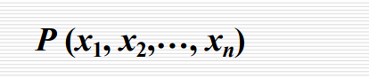
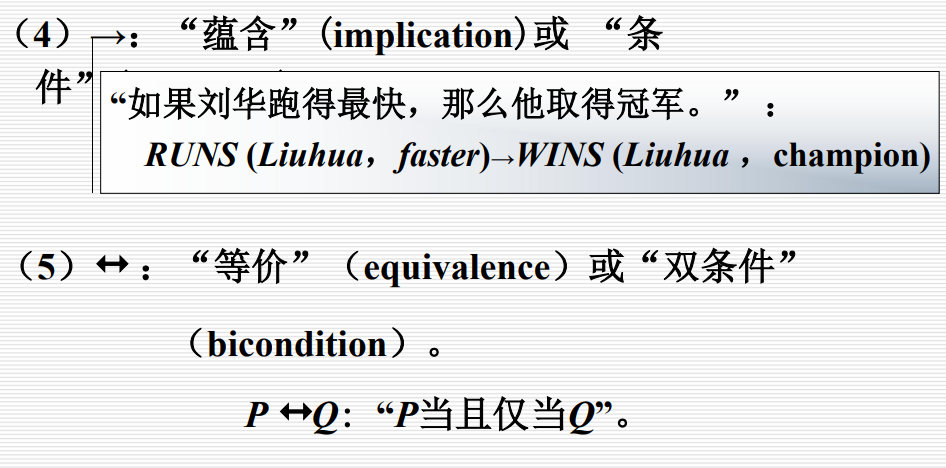

#  人工智能导论

##  一、基本概念

### 1.1 智能

智能的核心：思维

智能的基础：知识，感知、行为、进化

**总之，智能是知识和智力的总和**

智能的特征：

- 感知能力——前提
- 记忆和思维能力——根本因素
  - 思维：
    - 抽象思维（逻辑）
    - 形象思维：识别图像等
    - 灵感思维
- 学习和自适应能力
- 行为能力（表达）

### 1.2 人工智能

研究内容：

- 知识表示：
  - 符号表示法：用各种包含具体含义的符号，以各种不同的方式和顺序组合起来表示知识的一类方法
  - 连接机制表示法：把各种物理对象以不同的方式及顺序连接起来，并在其间互相传递及加工各种包含具体意义的信息，以此来表示相关的概念及知识
- 机器感知：
  - 机器视觉
  - 机器听觉
- 机器学习：
  - 机器学习
  - 机器学习方法
- 机器行为
- 机器思维：抽象思维（逻辑），形象思维，灵感思维

## 二、知识表示与知识图谱

### 2.1 知识的特性

- 相对正确性：知识在一定的条件和环境下才是正确的
- 不确定性：
  - 随机性
  - 模糊性
  - 不完全性
  - 经验
- 可表示性和可利用性

### 2.2 知识的表示

将人类知识形式化or模型化

### 2.3 一阶谓词逻辑表示法

命题：非真即假的语句

谓词：

​	一般形式：
​	x1…xn称为个体
​	个体可以是常量，变量，函数或者谓词

谓词连接词：

- 非
- 析取（并）
- 合取（交）
- 蕴含（➡）
- 等价（双向箭头）
- 

谓词量词：

- 全称量词
- 存在量词

谓词公式：
