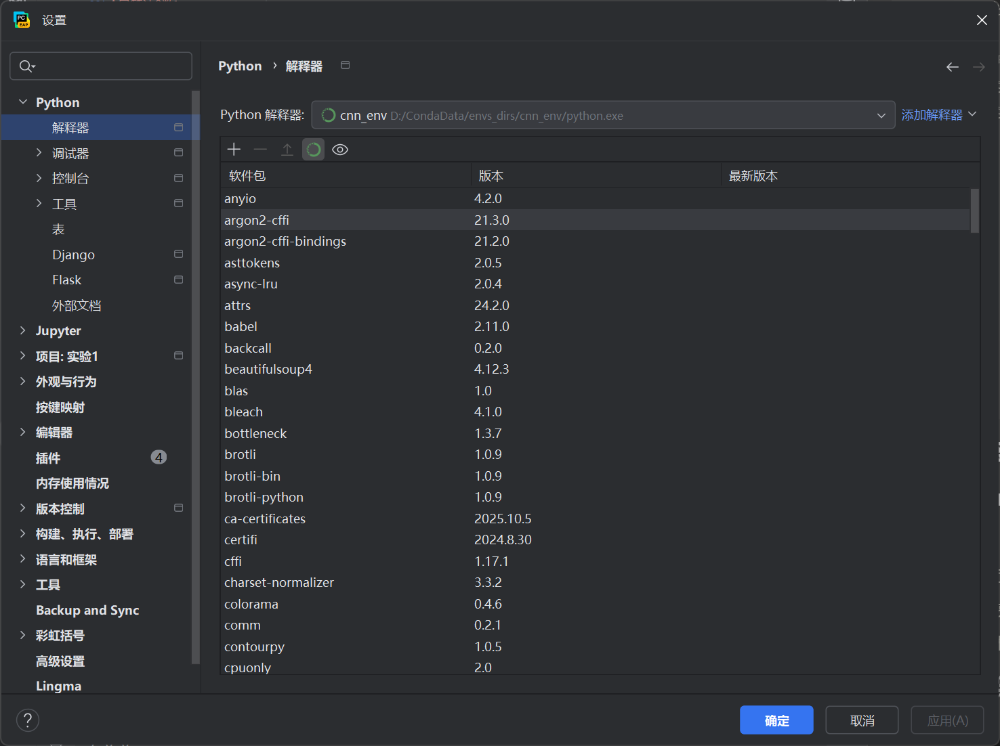
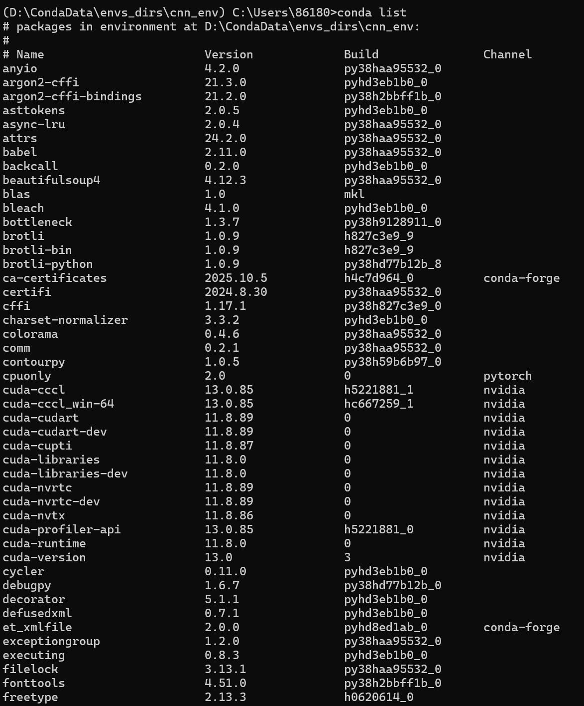
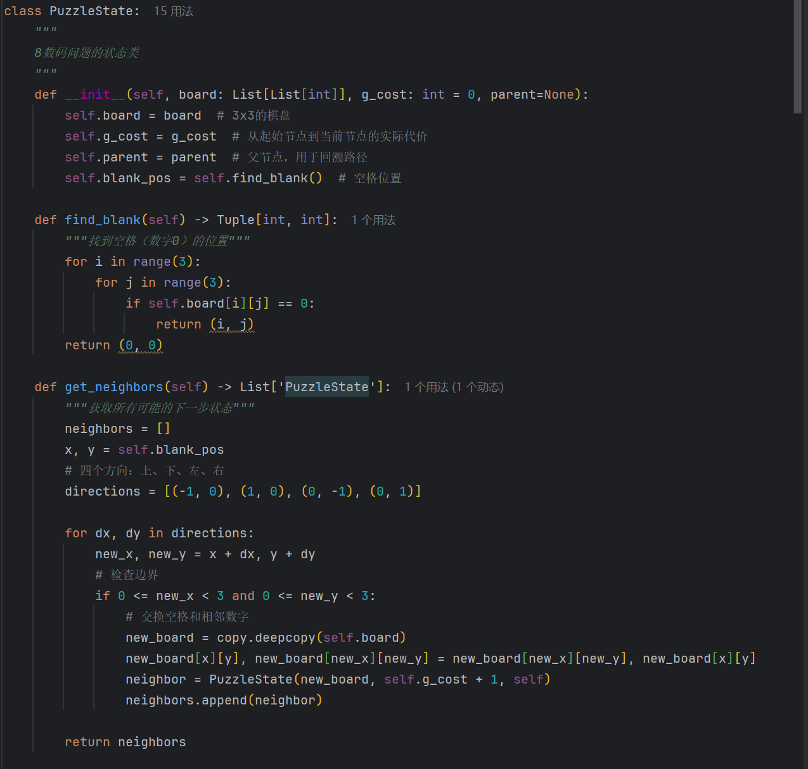
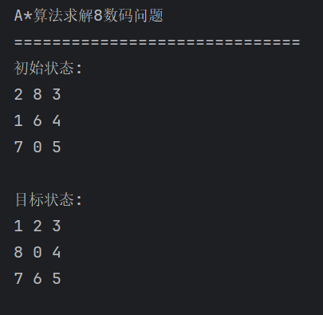
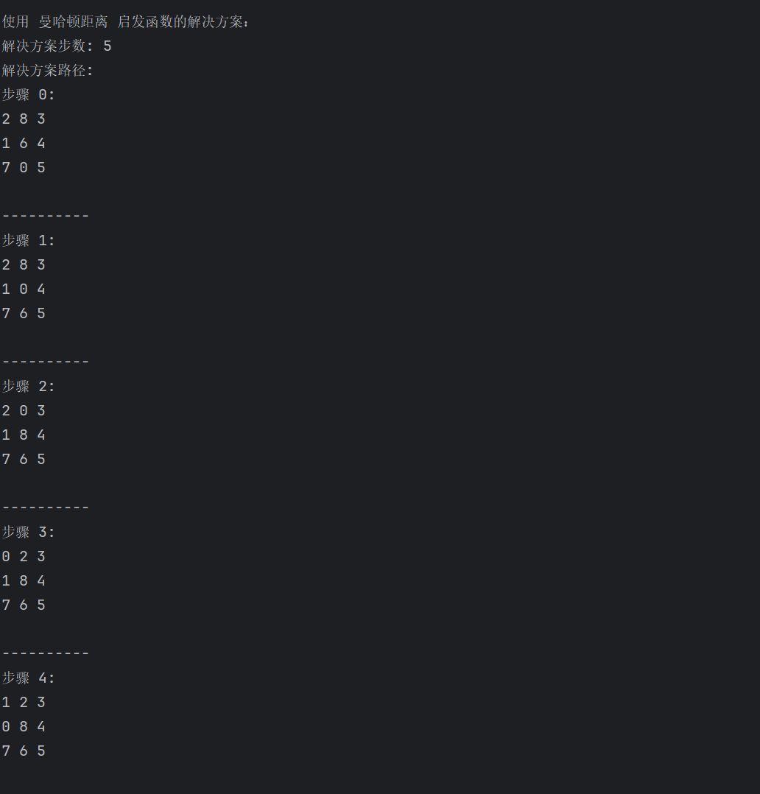
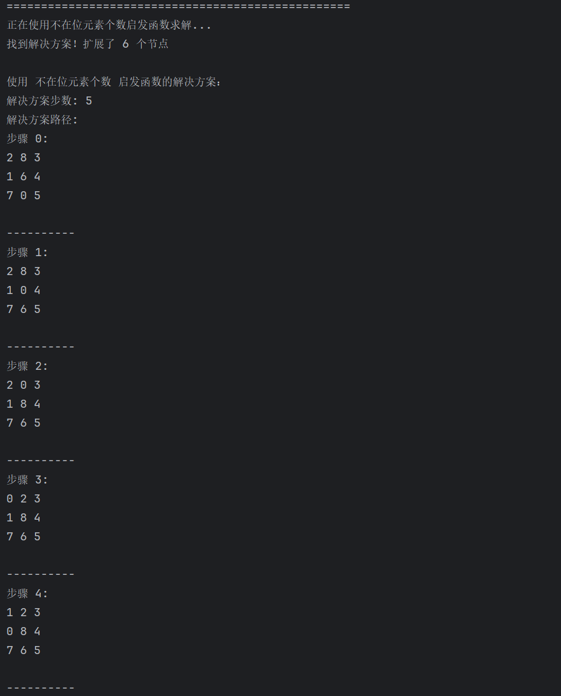
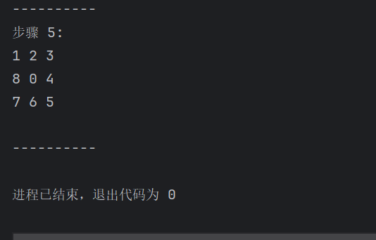

# A*算法求解8数码问题实验报告

## 一、代码功能说明

程序实现了使用A*算法求解8数码问题，主要功能包括：

1. **A*算法核心实现**：实现了完整的A*搜索算法，包括开放列表（open list）和关闭列表（closed list）的管理
2. **两种启发函数**：
   - 曼哈顿距离（Manhattan Distance）：计算每个数字到其目标位置的曼哈顿距离之和
   - 不在位元素个数（Misplaced Tiles）：统计当前状态中不在目标位置的数字个数
3. **状态空间搜索**：支持8数码问题的状态空间自动生成和搜索
4. **路径回溯**：找到解决方案后能够回溯并显示完整的解决路径
5. **性能统计**：显示搜索过程中扩展的节点数量和解决方案步数

## 二、设计思路

### 2.1 整体架构

程序主要包含三个核心类：

1. **PuzzleState类**：表示8数码问题的状态
   - 存储当前棋盘状态（3×3数组）
   - 记录从初始状态到当前状态的实际代价g(n)
   - 提供状态间的移动操作和启发函数计算

2. **AStarSolver类**：实现A*算法核心逻辑
   - 管理开放列表和关闭列表
   - 实现节点扩展和评估函数
   - 提供路径回溯功能

3. **主程序模块**：
   - 定义初始状态和目标状态
   - 调用A*算法求解
   - 输出解决方案

### 2.2 A*算法实现

A*算法的评估函数：f(n) = g(n) + h(n)

- g(n)：从初始节点到当前节点的实际代价（移动步数）
- h(n)：启发函数，从当前节点到目标节点的估计代价

算法流程：
1. 将初始节点放入开放列表
2. 当开放列表不为空时：
   - 取出f值最小的节点
   - 如果是目标状态，返回解决方案
   - 否则扩展该节点的所有邻居
   - 将未访问的邻居节点加入开放列表
3. 如果开放列表为空且未找到目标状态，则无解

### 2.3 启发函数设计

1. **曼哈顿距离**：
   ```
   h(n) = Σ |xi - x目标| + |yi - y目标|
   ```
   对于每个数字，计算其当前位置与目标位置的曼哈顿距离之和

2. **不在位元素个数**：
   ```
   h(n) = 当前状态中不在目标位置的数字个数
   ```

两种启发函数都满足h(n) ≤ h*(n)的条件，保证A*算法能找到最优解。

## 三、运行环境需求

- 操作系统：Windows 11
- Python环境：Anaconda，Python 3.11
- 开发环境：PyCharm 2025.3 EAP  21.0.8+9-b1163.69 amd64

### 3.3 Python标准库依赖

- `heapq`：优先队列实现
- `copy`：深拷贝操作
- `typing`：类型提示支持

## 四、运行步骤

### 4.1 代码运行

1. 在PyCharm中打开项目文件夹
2. 导航到`astar_8puzzle.py`文件
3. 右键选择"Run 'astar_8puzzle'"或按Ctrl+Shift+F10
4. 观察控制台输出

### 4.2 自定义测试

如需测试不同的8数码问题，可以修改`main()`函数中的`initial_board`和`goal_board`：

```python
# 示例：自定义初始状态
initial_board = [
    [1, 2, 3],
    [4, 0, 6],
    [7, 8, 5]
]

# 示例：自定义目标状态
goal_board = [
    [1, 2, 3],
    [4, 5, 6],
    [7, 8, 0]
]
```

## 五、运行预期效果

程序运行后将在控制台输出以下信息：

1. **问题描述**：
   - 初始状态的棋盘布局
   - 目标状态的棋盘布局

2. **求解过程**：
   - 使用曼哈顿距离启发函数的求解过程
   - 使用不在位元素个数启发函数的求解过程
   - 每种启发函数扩展的节点数量

3. **解决方案**：
   - 解决方案的总步数
   - 从初始状态到目标状态的完整路径
   - 每一步的棋盘状态变化

### 5.1 预期输出示例
```
A*算法求解8数码问题
==============================
初始状态:
2 8 3
1 6 4
7 0 5

目标状态:
1 2 3
8 0 4
7 6 5

正在使用曼哈顿距离启发函数求解...
找到解决方案！扩展了 5 个节点

使用 曼哈顿距离 启发函数的解决方案：
解决方案步数: 5
解决方案路径:
步骤 0:
2 8 3
1 6 4
7 0 5
----------
步骤 1:
2 8 3
1 0 4
7 6 5
----------
...
```

## 六、开发过程截图

### 6.1 PyCharm开发环境




### 6.2 代码实现过程



- PuzzleState类的实现
- AStarSolver类的核心算法
- 主程序和测试代码

## 七、实际运行效果截图

### 7.1 程序启动输出


- 控制台显示程序启动信息
- 初始状态和目标状态的棋盘展示

### 7.2 求解过程输出


- 两种启发函数的求解过程
- 扩展节点数量的统计信息

### 7.3 解决方案输出


- 完整的解决路径
- 每一步的棋盘状态变化
- 最终到达目标状态

## 八、实验总结

### 8.1 算法性能分析
通过实验验证了A*算法在解决8数码问题上的有效性：

1. **曼哈顿距离启发函数**：
   - 扩展节点数较少，搜索效率较高
   - 提供更准确的启发信息

2. **不在位元素个数启发函数**：
   - 实现简单，计算开销小
   - 扩展节点数相对较多，但仍能找到最优解

### 8.2 实验收获
1. 深入理解了A*算法的原理和实现
2. 掌握了启发函数的设计原则
3. 体验了状态空间搜索的完整过程
4. 提升了Python编程和算法实现能力
