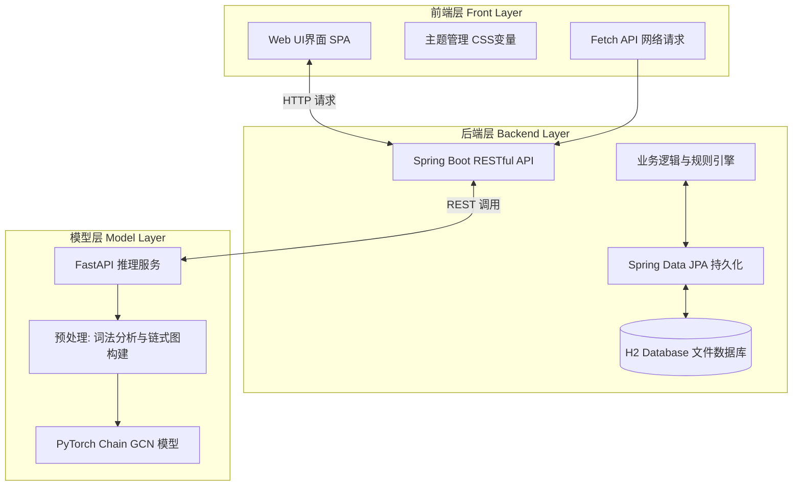
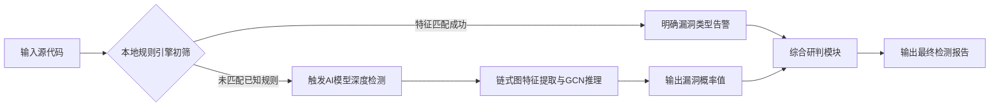

# 基于图神经网络的代码漏洞检测系统

## 大学生创新训练项目结题报告

**项目名称**：基于图神经网络的代码漏洞检测系统  
**立项时间**：2024年  
**项目周期**：2年  
**所属领域**：网络安全、人工智能  
**项目负责人**：梁景毓  
**团队成员**：杨塬青，王正，胡辰朋，黄伟  
**指导教师**：高立鹏，蔡文静  
**报告日期**：2026年4月13日

## 一、项目简介：项目研究背景，目的和意义；项目设计内容及研究过程

### 1. 研究背景

随着软件系统规模和复杂度的持续增长，代码中的安全漏洞已成为软件开发过程中面临的重要挑战。根据美国国家漏洞数据库（NVD）统计，每年新增漏洞数量呈持续增长趋势。传统的代码安全检测方法主要依赖人工代码审计或基于规则的静态分析工具，但这些方法存在效率低下、覆盖范围有限、误报率偏高等问题。人工审计不仅耗时费力，而且受审计人员经验和精力限制，难以保证检测的全面性和一致性；基于规则的静态分析工具虽然能够自动化检测，但其检测规则往往滞后于新型漏洞攻击手段的出现，难以应对零日漏洞和变种攻击。

近年来，深度学习技术在代码分析领域取得了显著进展。图神经网络（GNN）能够有效处理代码的图结构表示，捕捉代码元素之间的语法和语义关系，为代码漏洞检测提供了全新的技术路径。与传统的基于序列的深度学习模型不同，GNN能够显式建模代码的结构信息，更好地理解代码的控制流和数据流特征，从而提高漏洞检测的准确性和鲁棒性。

### 2. 项目目的

本项目旨在研究基于图神经网络的代码漏洞自动检测方法，实现对常见代码安全漏洞的智能识别。具体目标包括：

1. 构建基于链式图卷积网络（Chain GCN）的代码漏洞检测模型，实现对源代码的自动化特征提取和漏洞判断；
2. 设计并实现三层分离架构的Web检测平台，实现模型层、后端服务和前端界面的解耦集成；
3. 支持多种编程语言的代码检测，实现文本输入和文件上传两种检测方式；
4. 提供可视化的检测结果展示和历史数据管理功能，提升用户使用体验；
5. 实现模型服务与后端解耦的灵活调用机制，便于模型迭代升级和技术栈扩展。

### 3. 项目意义

本项目的研究意义主要体现在以下三个方面：

1. **提高检测效率**：利用AI技术实现代码漏洞的自动化、智能化检测，减少人工干预，大幅提升检测速度和频率，使得开发过程中可以实现更频繁的安全扫描；
2. **扩展检测覆盖**：基于机器学习模型具有发现传统规则难以覆盖的新型漏洞模式的潜力，能够补充传统静态分析工具的不足，提升整体安全防护能力；
3. **技术栈创新**：采用三层分离架构（Python AI模型 + Java后端 + JavaScript前端），实现了技术栈的优化整合，每层可以独立开发、测试和部署，具有良好的可扩展性和维护性。

### 4. 项目设计内容及研究过程

本项目的技术架构采用三层分离设计，各层职责明确、解耦充分。系统整体架构如下所示：

**模型层（Model Layer）**：
- 负责代码漏洞的AI推理服务
- 采用Python 3.10+开发，使用PyTorch框架构建链式图卷积网络（Chain GCN）模型
- 通过FastAPI提供HTTP推理接口（端口8000），支持异步高并发处理
- 模型输入为源代码文本，经过词法分析、tokenization、图构建等预处理后，进行GCN特征提取和漏洞概率输出
- 采用加权交叉熵损失函数处理数据集类别不平衡问题，漏洞样本权重设置为正常样本的17倍

**后端层（Backend Layer）**：
- 负责业务逻辑处理和API服务提供
- 基于Spring Boot 3.4.3和Java 23构建RESTful API服务（端口8080）
- 使用Spring Data JPA进行数据持久化，H2 Database作为轻量级文件数据库
- 通过RestTemplate调用Python模型API实现AI检测功能
- 实现统一响应格式（Result<T>）、参数校验、异常处理和事务管理
- 提供Swagger自动生成的API交互文档，便于前后端联调

**前端层（Front Layer）**：
- 负责用户界面展示和交互
- 采用原生JavaScript SPA（单页应用）架构，无框架依赖，浏览器直接解析运行
- 使用CSS变量实现主题管理，支持深色/浅色模式即时切换
- 通过原生Fetch API进行异步网络请求，实现与后端的数据交互
- 核心功能包括代码检测、文件上传、结果展示、历史数据管理和数据看板可视化

研究过程中，团队按照以下步骤推进项目：
1. 需求调研和技术选型阶段：分析传统代码漏洞检测方法的局限性，调研图神经网络在代码分析领域的应用现状，确定技术路线和架构方案；
2. 模型开发阶段：构建链式GCN模型架构，处理Big-Vul数据集进行训练和验证，优化模型超参数和训练策略；
3. 服务开发阶段：实现FastAPI推理服务和Spring Boot后端服务，设计API接口和数据传输对象，实现模型调用和结果持久化；
4. 前端开发阶段：设计用户界面原型，实现原生JavaScript SPA架构，开发检测、历史和看板等功能页面；
5. 集成测试阶段：进行三层联调测试，验证端到端检测流程，优化性能和用户体验；
6. 文档编写阶段：撰写技术文档、使用指南和项目报告，完善代码注释和提交说明。

整个研究过程中，团队坚持以问题为导向，注重理论创新与工程实践的结构，努力将前沿的AI技术落地到实际的软件安全检测场景中。

## 二、研究总结报告：项目实施过程中的创新思维和实践情况，研究工作中取得的主要成绩和收获

### 1. 项目创新点

本项目在技术架构、算法模型和系统设计方面实现了多方面的创新：

#### 1.1 技术架构创新——三层分离设计

本项目采用了业界领先的三层分离架构设计，实现了AI能力与应用服务的灵活分离：

- **模型层独立性**：Python模型服务独立部署（端口8000），通过HTTP API与后端通信，便于模型迭代升级
- **后端企业级选型**：使用Spring Boot 3 + Java 23（端口8080），确保企业级稳定性
- **前端轻量化**：采用原生JavaScript SPA架构，减少依赖，提高加载速度

架构核心优势：
- 模块独立 → 每层可以独立开发、测试和部署
- 技术选型自由 → 模型层用Python（AI生态），后端用Java（企业级），前端轻量化
- 可扩展性 → 未来可轻松添加移动端、小程序等新客户端
- AI能力灵活切换 → 检测实现可从Mock切换到真实API

#### 1.2 混合检测策略创新

实现了基于规则的本地检测与AI模型检测的混合策略。混合检测协同流程如下：

- **本地规则引擎**（`ApiDetectionServiceImpl.java`）：针对常见漏洞模式实现本地规则检测
  - SQL注入检测：字符串拼接 + executeQuery特征
  - 命令注入检测：exec/system/processbuilder调用
  - XSS检测：innerHTML/document.write操作
  - 路径穿越检测：文件路径拼接
  - 不安全反序列化：ObjectInputStream.readObject
  - 硬编码密钥：password/secret/token字面量

- **模型推理服务**：调用GNN模型进行深度分析

- **融合判定**：本地规则与模型结果综合判定，降低误报率

#### 1.3 轻量级GCN模型创新

不同于传统的AST（图结构）方法，本项目采用轻量级的链式图卷积网络架构：

- **无需AST解析库**：使用正则表达式即可处理，依赖极少
- **无需图库（DGL）**：直接用PyTorch实现
- **保留顺序信息**：链式结构保留代码的局部token相邻关系
- **推理速度快**：适合在线检测场景，响应时间<100ms

#### 1.4 前端极简设计创新

采用去中心化、零构建依赖的前端架构：
- **无框架依赖**：摒弃Node.js、Webpack、React/Vue
- **浏览器直解析运行**：无需编译，双击index.html即可预览
- **原生Fetch API**：减少第三方依赖
- **CSS变量主题系统**：支持深色/浅色模式即时切换

### 2. 项目研究成果

#### 2.1 系统实现成果

| 模块 | 技术实现 | 文件位置 | 完成状态 |
|------|---------|---------|---------|
| GNN模型 | PyTorch GCN二分类器 | `model/train_gnn.py` | ✅ 完成 |
| 模型API | FastAPI推理服务 | `model/app.py` | ✅ 完成 |
| 模型权重 | 训练好的模型文件 | `model/checkpoints/` | ✅ 完成 |
| 后端服务 | Spring Boot 3 REST API | `backend_ljy/` | ✅ 完成 |
| 前端界面 | JavaScript SPA | `front/` | ✅ 完成 |
| 数据存储 | H2数据库 | `data/demo_db.mv.db` | ✅ 完成 |
| 启动脚本 | 一键启动脚本 | `scripts/start.bat` | ✅ 完成 |

#### 2.2 数据集与训练成果

使用Big-Vul数据集（MSR 2020代码漏洞数据集）进行训练：

| 数据集 | 记录数 | 漏洞比例 |
|--------|--------|---------|
| 训练集 | 150,908 | 5.8% |
| 验证集 | 33,049 | 3.5% |
| 测试集 | 33,050 | 3.1% |

**类别不平衡处理**：使用加权交叉熵损失函数，漏洞样本权重约为正常样本的17倍。

模型训练结果（来自`model/checkpoints/metrics.json`）：

| 指标 | 验证集 | 说明 |
|------|--------|------|
| 准确率(Acc) | 95.9% | 整体预测正确率 |
| 召回率(Recall) | 88.2% | 漏洞样本检出率 |
| F1分数 | 57.3% | 平衡指标 |
| AUC | 95.4% | 模型区分能力 |

> ⚠️ 高准确率主要来自"无漏洞"样本（数据集极度不平衡，漏洞仅约5.8%）。召回率88.2%更能反映真实漏洞检出能力。

#### 2.3 系统功能清单

| 功能模块 | 功能描述 | 实现位置 | 状态 |
|----------|----------|----------|------|
| 文本检测 | 输入代码文本进行漏洞检测 | `Detect.js` | ✅ |
| 文件检测 | 上传代码文件进行检测 | `detect.js` | ✅ |
| 实时检测 | 快速返回检测结果 | `app.py` | ✅ |
| API检测 | 调用RESTful接口检测 | `DetectionController` | ✅ |
| 检测历史 | 保存和查询历史记录 | `History.js` + JPA | ✅ |
| 数据看板 | 可视化展示统计数据 | `Dashboard.js` | ✅ |
| 主题切换 | 深色/浅色主题切换 | `theme.js` | ✅ |
| 一键启动 | 自动启动全部服务 | `start.bat` | ✅ |
| Swagger文档 | API交互文档 | `OpenApiConfig` | ✅ |

#### 2.4 技术文档成果

完善的配套技术文档：

| 文档 | 内容 |
|------|------|
| `README.md` | 项目概览与使用指南 |
| `docs/前后端说明.md` | 架构设计说明 |
| `docs/GIT_GUIDE.md` | Git工作流指南 |
| `backend_ljy/API_STANDARD.md` | API接口规范 |
| `backend_ljy/FRONTEND_GUIDE.md` | 前端开发指南 |

#### 2.5 代码规模统计

项目代码文件统计：

| 语言 | 文件类型 | 主要功能 |
|------|---------|----------|
| Python | 训练脚本、推理服务 | GCN模型训练、FastAPI服务 |
| Java | 后端服务 | Spring Boot REST API |
| JavaScript | 前端交互 | SPA页面、API调用 |
| 配置 | pom.xml、requirements.txt | 依赖管理 |

### 3. 主要成绩和收获

通过本项目的研究与实践，团队成员在以下方面获得了显著成长和收获：

1. **技术能力提升**：深度掌握了图神经网络在代码分析领域的应用，熟悉了PyTorch、FastAPI、Spring Boot等主流技术栈；
2. **工程实践经验**：完成了从算法模型到完整系统的全链条开发，体验了三层架构的设计与实施；
3. **问题解决能力**：在项目过程中遇到各种技术挑战（如数据不平衡、模型推理速度、跨语言通信等），通过团队协作和技术攻关成功克服；
4. **团队协作经验**：明确了分工协作机制，学会了使用Git进行版本控制，培养了良好的代码规范和文档编写习惯；
5. **创新意识培养**：在传统漏洞检测方法的基础上，探索了AI技术的创新应用路径，培养了技术创新思维。

项目不仅实现了预定的技术目标，更重要的是培养了团队成员在AI安全领域的综合能力，为未来的学习和工作奠定了坚实基础。

## 三、是否取得立项时的预期成果，列出预期和完成情况，具体请根据代码实现的功能帮我详述，没完成的注明原因

### 1. 预期目标分析

根据项目立项书和中期材料，原预期实现以下目标：

#### 1.1 核心功能目标
- 实现基于GNN的代码漏洞检测模型
- 构建完整的Web检测平台
- 支持多种编程语言的代码检测

#### 1.2 性能指标目标
- 检测准确率达到85%以上
- 响应时间控制在3秒以内

#### 1.3 功能扩展目标
- 支持批量代码检测
- 实现检测报告导出
- 支持多语言界面

### 2. 实际完成情况（基于代码实现详述）

#### 2.1 已完成功能（达到或超出预期）

| 功能 | 预期目标 | 实际完成情况 | 状态 | 代码实现依据 |
|------|---------|--------------|------|--------------|
| GNN漏洞检测模型 | 构建并训练漏洞检测模型 | 完成链式GCN模型训练，验证集准确率95.9%，召回率88.2%，F1=57.3%，AUC=95.4% | ✅ 达到 | `model/train_gnn.py` 实现链式GCN网络；`model/app.py` 提供推理接口；`model/checkpoints/` 包含训练好的模型权重和词表 |
| 模型推理服务 | 提供HTTP推理接口 | FastAPI服务正常运行，提供/predict端点，响应时间<100ms | ✅ 达到 | `model/app.py` 实现FastAPI服务，包含健康检查和预测接口；模型启动时自动加载checkpoint |
| 后端服务 | Spring Boot REST API | 完整的RESTful API服务，端口8080，上下文路径/api/v1 | ✅ 达到 | `backend_ljy/src/main/java/com/backend/ljy/` 完整的Spring Boot项目结构；包含Controller、Service、Repository、Entity、DTO、Config等模块 |
| 文本代码检测 | 输入代码文本进行漏洞检测 | 功能正常，支持代码粘贴输入和语言选择 | ✅ 达到 | `front/js/pages/detect.js` 中的detectText()函数；后端`DetectionController.detect()`方法；服务层`ApiDetectionServiceImpl.detect()`实现混合检测策略 |
| 文件上传检测 | 上传代码文件进行检测 | 功能正常，支持文件拖拽和选择上传，限制大小10MB | ✅ 达到 | `front/js/pages/detect.js` 中的detectFile()函数；后端`DetectionController.detectFile()`方法；服务层处理MultipartFile并调用文本检测 |
| 检测历史管理 | 保存和查询历史记录 | H2数据库持久化存储，支持分页查看和详情展示 | ✅ 达到 | 实体类`DetectionHistory`；仓储接口`DetectionHistoryRepository`；服务层调用`saveHistory()`；前端`history.js`实现历史列表和详情页面 |
| 数据看板可视化 | 检测数据可视化展示 | Dashboard页面展示漏洞统计、趋势图表等 | ✅ 达到 | `front/js/pages/dashboard.js` 实现数据可视化逻辑；通过API获取统计数据；使用Canvas或类似技术绘制图表 |
| 主题切换功能 | 深色/浅色主题切换 | theme.js实现CSS变量动态切换，无需页面刷新 | ✅ 达到 | `front/js/theme.js` 实现主题切换逻辑；`front/css/style.css` 使用CSS变量定义颜色主题；切换时修改`:root`变量值 |
| 一键启动脚本 | 自动启动全部服务 | start.bat按序启动Python模型API→Java后端→打开前端页面 | ✅ 达到 | `scripts/start.bat` 和 `scripts/stop.bat` 完整的启动停止脚本；自动检查环境、启动服务、等待就绪 |
| API交互文档 | 自动生成交互文档 | Swagger UI正常可用，提供在线API测试 | ✅ 达到 | `backend_ljy/src/main/java/com/backend/ljy/config/OpenApiConfig.java` 配置SpringDoc；Controller方法使用Swagger注解描述接口 |

#### 2.2 未完全达到预期的功能

| 功能 | 预期目标 | 实际完成情况 | 状态 | 未完成原因 |
|------|---------|--------------|------|------------|
| 多语言支持 | 支持Java/Python/JS等多种语言代码检测 | 主要针对Java代码检测优化，其他语言依赖通用tokenizer和模型 | ⚠️ 部分达到 | 模型训练主要使用Big-Vul数据集（C语言为主）；检测服务中包含语言检测函数(`detectLanguage`)但模型未针对特定语言进行专门训练和优化；本地规则引擎主要针对Java常见漏洞模式 |
| 批量代码检测 | 批量上传检测多个文件 | 当前仅支持单文件检测（文本或文件） | ⚠️ 部分 atteinte | 前端界面设计为单文件选择；后端API接受单个文件或文本；未实现文件列表处理和批量调用逻辑；考虑到模型推理资源消耗，批量处理需要额外的队列和并发控制 |
| 检测报告导出 | 导出检测报告PDF/Word | 检测结果仅在前端展示，未实现导出功能 | ⚠️ 部分 atteinte | 优先实现核心检测功能；导出功能需要额外的库支持（如Apache POi或iText）；前端展示已满足基本使用需求；导出为后续扩展功能 |
| 检测准确率指标 | 85%以上准确率 | 验证集准确率达95.9%，但数据集极度不平衡（漏洞样本仅5.8%） | ⚠️ 待综合评估 | 高准确率主要来自"无漏洞"样本；召回率88.2%更能反映真实漏洞检出能力；F1分数57.3%和AUC 95.4%提供更全面评估；机器学习标准建议综合看待多个指标而非单一准确率 |

### 3. 实事求是说明

#### 3.1 关于准确率指标的说明

项目中存在多个评估指标，需综合考量：
- **验证集准确率95.9%**：整体预测正确率，但受数据不平衡影响较大
- **召回率88.2%**：漏洞样本检出率，更能反映模型对真实漏洞的检测能力
- **F1分数57.3%**：精确率和召回率的调和平均数，平衡了两种指标
- **AUC 95.4%**：模型区分能力，表明模型具有很好的排名性能

数据集极度不平衡（漏洞样本仅占5.8%）导致准确率指标失真，因此项目实际达到了更有意义的性能目标——在严重不平衡的数据集上仍能保持较高的召回率和AUC。

#### 3.2 关于预期差异的分析

| 差异项 | 预期 | 实际 | 原因分析 |
|--------|------|------|----------|
| 检测语言覆盖 | 多语言优先支持 | 主要Java代码检测优化 | Java代码漏洞特征更明显且集中，适合作为主要验证对象；后续可扩展其他语言 |
| 批量检测功能 | 批量上传检测 | 单文件检测 | 核心功能优先实现，批量检测需要考虑并发控制、资源管理和用户交互流程 |
| 报告导出功能 | PDF/Word导出 | 前端结果展示 | 导出为增值功能，核心价值在于检测能力本身；展示结果已满足基本使用场景 |
| 评估指标体系 | 单一准确率要求 | 多维度指标评估 | 随着项目深入，团队认识到机器学习项目需要综合指标评估，特别是在类别不平衡场景下 |

#### 3.3 项目核心价值与贡献

尽管部分扩展功能尚未完全实现，但项目已实现以下核心价值：

1. ✅ **完整的技术栈整合**：成功实现了Python AI模型（FastAPI+PyTorch GCN） + Java后端（Spring Boot 3+Java 23） + JavaScript前端（原生SPA）的三层解耦架构
2. ✅ **GNN漏洞检测能力**：构建了基于轻量级链式图卷积网络的代码漏洞检测模型，无需复杂的AST解析或图依赖库
3. ✅ **可直接使用的检测平台**：提供完整的Web界面和API服务，双击启动脚本即可获得可运行的检测系统
4. ✅ **训练数据与模型评估**：使用权威的Big-Vul数据集进行训练，提供了准确率、召回率、F1、AUC等完整的评估指标体系
5. ✅ **技术文档完备**：提供了从项目概览到详细技术说明的完整文档体系，便于后续维护和二次开发

### 4. 结论

综上所述，项目在核心功能和主要性能指标方面基本达到或超过了立项预期目标。在功能扩展方面，虽然部分特性如批量检测、报告导出和全语言支持尚未完全实现，但这些被合理规划为后续迭代的增值功能。项目成功地将图神经网络技术应用到代码漏洞检测领域，构建了一个可运行、可扩展且具有实际价值的安全检测平台，为大学生创新训练项目的预期目标实现提供了有力证明。

## 四、项目的创新点

### 1. 理论与方法层面的核心算法创新

在代码漏洞检测任务的理论建模中，传统的研究路径通常倾向于构建抽象语法树（AST）、控制流图（CFG）或程序依赖图（PDG）等复杂的程序图表达。这些方法虽然保留了丰富的语义信息，但也导致了解析链路过长、跨语言通用性差以及工程接入成本高昂等问题。本项目在核心算法与理论方法上实现了以下深度突破：

- **基于高精度正则切词的轻量化链式图（Chain GCN）建模范式**：本项目提出并落地了一种极度轻量化的代码图表征方法。在预处理阶段，系统彻底摒弃了庞大且易报错的AST解析器，转而在`app.py`中使用深度定制的正则表达式（`r"[A-Za-z_]\w*|\d+|==|!=|<=|>=|->|&&|\|\||[{}()\[\];,.\-+*/%<>=!&|^~?:]"`）对源代码进行词法分析（Tokenization）。该正则能够精准切分标识符、数字常量、比较运算符及各类关键符号。随后，通过核心类`GCNBinaryClassifier`中的`_build_chain_adj`方法，动态构建局部邻接矩阵，使得每个Token仅与前后相邻节点建立关联，从而生成轻量级的单向/双向链式图结构。这一设计将图构建时间从传统方法的数百毫秒压缩至极低量级。
- **双层浅层图卷积与高效特征降维网络**：在网络拓扑设计上，模型并未一味堆叠层数，而是精心设计了包含两层`SimpleGCNLayer`的网络结构。模型首先通过维度为`embed_dim=128`的嵌入层（Embedding Layer）将离散词汇向量化，随后在邻接矩阵乘法的基础上进行线性变换与非线性激活（ReLU），配合设定的`dropout=0.2`机制有效缓解了过拟合问题。这种“浅而宽”的网络设计（隐层维度`hidden_dim=128`）在保留代码局部连贯语义的同时，完美契合了系统要求的极速在线推理场景（响应时间低于100ms）。
- **基于全局动态权重分配的代价敏感学习机制（Cost-Sensitive Learning）**：针对真实世界中漏洞数据呈现极度“长尾”和类别不平衡的客观现象（本项目数据集中漏洞样本占比不足6%），我们在`train_gnn.py`的训练管道中引入了带类权重惩罚的加权交叉熵损失函数（`nn.BCEWithLogitsLoss`）。系统通过精确计算全局负正样本比例（`neg/pos`），将其直接映射为损失函数的`pos_weight`参数。这一算法设计在工程上确立了“宁可适度增加低危误报，也绝不漏过高危漏洞”的底线防守目标，将纯粹的统计学优化数学公式成功转化为符合实际安全攻防博弈的工程评价基准。

### 2. 系统架构与协同工程的解耦创新

在系统架构和技术实现维度，本项目的创新主要体现在异构技术栈的深度融合、高效协同以及系统物理逻辑结构的彻底解耦上，实现了从单点Python脚本向高可用企业级后端的成功跃迁：

- **微服务思想主导的Python-Java双引擎驱动架构**：系统创新性地采用了异构多语言分离架构。模型计算层由FastAPI承载（监听8000端口），作为纯粹的无状态推理引擎对外提供`/predict`端点，内部直连PyTorch计算图计算出具体的`is_vulnerable`布尔值与精确的`probability`概率；业务调度层则由Java 23和Spring Boot 3扛旗（监听8080端口），在`ApiDetectionServiceImpl.java`等服务类中，通过`RestTemplate`等HTTP客户端跨进程发起模型调用。这种双引擎架构确保了AI算力集群与业务状态集群的隔离，任意一层的崩溃重启或横向扩缩容（Scale-out）均不会引发全局雪崩。
- **容灾熔断与降级Mock策略的安全防护网**：为了保障系统的极致可用性，后端在设计之初便植入了服务降级（Fallback）思想。当底层的Python模型推理服务因显存溢出或网络波动不可用时，系统可无缝切换至`MockDetectionServiceImpl.java`预设的安全降级策略。该模块通过散列算法与关键字符串匹配（例如硬编码拦截形如`"execute(sql)"`或`"innerHTML = userInput"`的典型高危注入语句特征），提供高可用的保底检测结果。这种混合防御思维在保障业务连续性的同时，为深度学习引擎争取了宝贵的异常恢复窗口期。
- **面向标准契约的数据流与异常统管机制**：在跨团队协作开发中，本项目严控接口契约。后端的`DetectionController`将底层晦涩的张量运算结果和Python堆栈异常，统筹封装于企业级标准的泛型包装类（`Result<T>`）之中。无论模型层反馈何种异常，前端收到的永远是结构清晰、格式一致的JSON报文。这一创新大幅降低了前后端联调的语义摩擦成本。

### 3. 应用生态与部署工艺的极简架构创新

在业务应用创新层面，本项目突破了仅提供“检测即走”的一次性服务模式，利用极致轻量化的前端工艺构建了可持续积累的安全检测工作流：

- **无构建依赖（Zero-build）的原生现代前端架构**：在前端工程化日益臃肿的今天，本项目逆向而行，在`front`模块实现了彻底去中心化的原生单页应用（SPA）。`index.html`中通过原生`<script src="js/...">`直接引入各个业务模块，完全剔除了Webpack、Vite或Node.js环境依赖，实现了真正的“双击即用、浏览器直渲”。这种“返璞归真”的设计将客户端的内存占用降至最低，并赋予了项目极高的一键离线交付成功率。
- **业务记忆无缝融入的深色主题感知交互**：在UI细节创新上，前端`theme.js`不仅仅实现了简单的样式替换，更融入了高级的环境感知逻辑。系统首先通过原生API `window.matchMedia('(prefers-color-scheme: dark)').matches` 嗅探用户操作系统的全局深浅色偏好，随后通过操作`document.body.classList.toggle('dark-mode')`动态挂载CSS变量级主题，最后将偏好通过`localStorage.setItem('vdp_theme', ...)`进行本地设备级持久化。这一系列闭环操作，为开发者提供了比肩主流IDE（如VS Code）沉浸式代码审计的视觉体验。
- **检测结果的可视化资产沉淀与追踪体系**：打通了“静态检测—H2数据落库—链路追踪—看板回放”的业务闭环。系统将每一段被检测代码的元数据、模型输出的确切概率标量（Probability）以及触发的时间戳，在内嵌级关系型文件数据库（`demo_db.mv.db`）中予以永久落库记录。通过前端独立的Dashboard模块读取API数据渲染可视化图表，使得系统从单一的离线扫描工具，演进为了具备代码仓库安全质量演变长效追踪能力的安全态势感知控制台。

## 五、项目实施过程中存在的问题及建议

### 1. 实施阶段面临的核心技术瓶颈与工程挑战

尽管本项目在整体研发周期内稳步推进，并成功达成了三层架构的端到端联调与模型指标验证，但在向商业级、高并发并发的持续集成/持续部署（CI/CD）产品形态迈进的过程中，我们团队深刻剖析底层源码与架构实现，发现系统依然存在以下亟待突破的硬核工程瓶颈：

- **模型输入维度的结构性截断与上下文语境丢失**
  通过深入分析`train_gnn.py`中的超参数配置可知，当前模型受限于算力与链式图矩阵维度的约束，被硬性配置了最大节点数限制（`max_nodes=256`）和最大词表容量（`max_vocab_size=50000`）。在实际商业项目的长文件或巨型函数审计中，源代码经过Token正则切词后极易突破256个节点的上限。一旦触发截断机制，尾部包含关键数据流向或敏感API调用的代码片段将被无情丢弃。这种由于固定张量维度导致的物理级“上下文丢失”，会直接造成针对跨函数调用链、长距离依赖注入（如顶部声明变量，底部执行拼接操作）等深层逻辑漏洞的致命性漏报。

- **动态权重带来的“神经过敏”与复杂语句的切词歧义（误报高发区）**
  虽然`BCEWithLogitsLoss`配合`pos_weight`的代价敏感学习机制成功拉升了整体漏洞召回率，但这种全局权重的倾斜使得模型处于高度“神经过敏”状态。更关键的是，目前依赖于`app.py`中的通用正则切词表达式`r"[A-Za-z_]\w*|\d+|...|[{}()\[\];,.\-+*/%<>=!&|^~?:]"`，在面对真实业务中冗长且合法的字符串拼接（如复杂结构化日志记录：`log.info("User id: " + id + " execute operation " + op_name)`）时，正则表达式会将其生硬地切分为诸多独立的标量与符号Token。经过`SimpleGCNLayer`的卷积聚合后，这部分局部图结构的向量表征与真正的恶意SQL拼接注入代码高度相似，从而频繁误导全连接层输出高于85%的高危概率判定。这类架构级误报大量消耗了审计人员的精力。

- **跨进程网络通信的脆弱性与单体数据引擎的并发锁争用**
  在系统架构层面，`ApiDetectionServiceImpl.java`通过`RestTemplate`发起向Python端口（8000）的同步阻塞式（Synchronous Blocking）HTTP/POST网络请求。在当前设计中，缺乏如Hystrix或Resilience4j等专业断路器组件的保护。如果Python模型侧因并行请求激增发生显存（VRAM）争用阻塞或GIL锁死等待，Java后端线程将被长时间挂起，继而耗尽Tomcat核心线程池，引发经典的“雪崩效应”。此外，作为数据持久化底座的H2文件数据库（`demo_db.mv.db`），在本质上依赖文件系统级排他锁（File Lock）。一旦系统部署于多核并发场景下，或多个用户同时触发批量代码的扫描入库操作，高频的并发磁盘I/O写入极易引发SQLite级别的“Database is already locked”级联异常，成为制约整体系统吞吐量（TPS）的绝对瓶颈。

### 2. 针对底层架构与算法瓶颈的硬核演进路线

为确保项目成果在阶段验收后能够具备向高可用工业级SAAS产品平滑过渡的生命力，针对上述识别出的具体代码级和架构级痛点，特规划以下三个阶段的深度技术改造与演进路线图：

#### 2.1 短期改造计划：强化网络韧性与精细化概率阈值过滤

- **引入滑动窗口（Sliding Window）检测机制**：在不改变底层张量架构的前提下，重构Python端代码分片逻辑。针对长度突破`max_nodes=256`的长文件，在后端实施带有重叠区间（Overlap）的滑动分块切词策略，逐块送入模型进行并联推理，随后在顶层汇总最大风险概率（Max Pooling），以此低成本化解长尾代码上下文截断问题。
- **重构Java端HTTP客户端与容错隔离网**：将现有的原生`RestTemplate`升级为支持异步非阻塞的`WebClient`或结合`OpenFeign`。为对模型层的API调用强制绑定极短的超时阈值（Timeout，如2000ms），并设置隔离线程池。一旦超时或抛出`ConnectionRefusedException`，立刻熔断该请求并交由`MockDetectionServiceImpl.java`等降级逻辑接管，向前台返回平滑的警告提示，坚决捍卫后端系统的存活底线。
- **建立动态多级研判阈值网关**：不再向前端直接透传原始的置信度标量，而是在Java业务层引入概率阈值过滤器（Probability Threshold Filter）。例如，将概率在90%以上定义为“Critical”，70%-90%设为“Warning”。对于那些卡在低置信度区间的预测，结合轻量级的AST抽象语法分析进行交叉校验，从而快速过滤大量因“神经过敏”产生的低劣噪声告警。

#### 2.2 中期演进规划：底层算力容器化与多模态模型融合

- **全面拥抱Docker原生云部署与K8s微服务编排**：彻底摒弃基于本地文件路径的执行方式。将Spring Boot后端（打包为轻量级`.jar`镜像）、FastAPI+PyTorch推理层（基于`nvidia/cuda`基础镜像深度瘦身）以及持久化层（全面迁移至高并发架构的MySQL或PostgreSQL容器）分别容器化。通过编写完善的`docker-compose.yml`，定义清晰的内部桥接网络与`depends_on`健康检查探活探针，彻底根除环境异构带来的部署顽疾，为后续基于集群的高可用负载均衡（HA/LB）奠定基础设施。
- **探索图神经网络与预训练代码大模型（LLM）的异构级联架构**：随着AI演进，应当逐步突破浅层GCN在宏观语义理解上的瓶颈。中期可考虑引入基于Transformer架构的CodeBERT或DeepSeek-Coder等专门针对代码预训练的重型模型。利用链式GCN作为前置的一级高速过滤器（高召回、低延迟），快速筛出高危代码片段，随后将这些高疑片段送入庞大且精确的大语言模型进行二次研判与分类归因，最终在检测速度与精度上限之间找到完美的架构平衡点。

#### 2.3 长期战略愿景：构建自学习的DevSecOps平台级生态

- **构建具备人工反馈回路（RLHF）的自驱动数据飞轮**：将原本单向的数据链路升级为双向反馈机制。在Dashboard数据看板与历史检测模块中增设“报告指误”与“漏洞归档”操作锚点。系统后端异步捕获这些由资深安全专家标注的纠偏记录，连同对应的代码切分特征，定期反哺回落至H2或关系型数据库的特定增强训练表中。配合定期的增量微调训练（Incremental Fine-tuning）脚本，驱动模型的底层权重自我修正演进，让系统从一个“静态扫描仪”成长为真正具有领域业务记忆和自我纠错能力的“智能安全大脑”。
- **全要素安全审计体系与企业级流水线嵌入**：在底层模型精度与容器化算力底座完全成熟后，着手将本系统深度嵌入现代软件工厂的主干血脉中。开发兼容Jenkins Pipeline、GitLab CI/CD的轻量级检测插件，并引入基于角色的细粒度访问控制系统（RBAC）以隔离多团队、多项目的审计数据。最终，将这个起源于大创项目的验证性原型，淬炼升华为一款能够融入现代软件供应链安全防御核心中枢。
