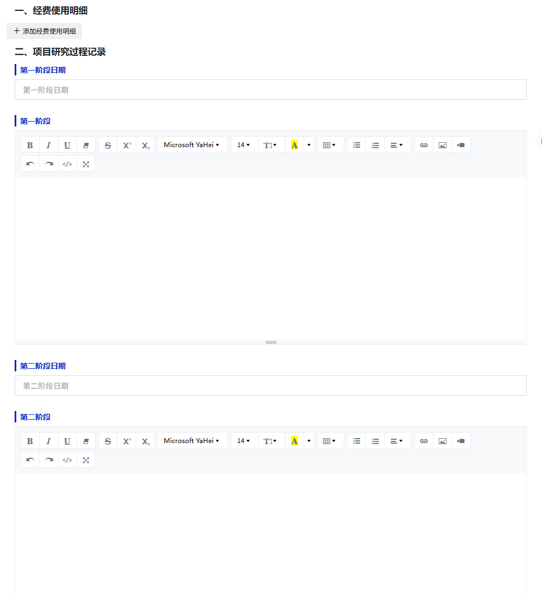
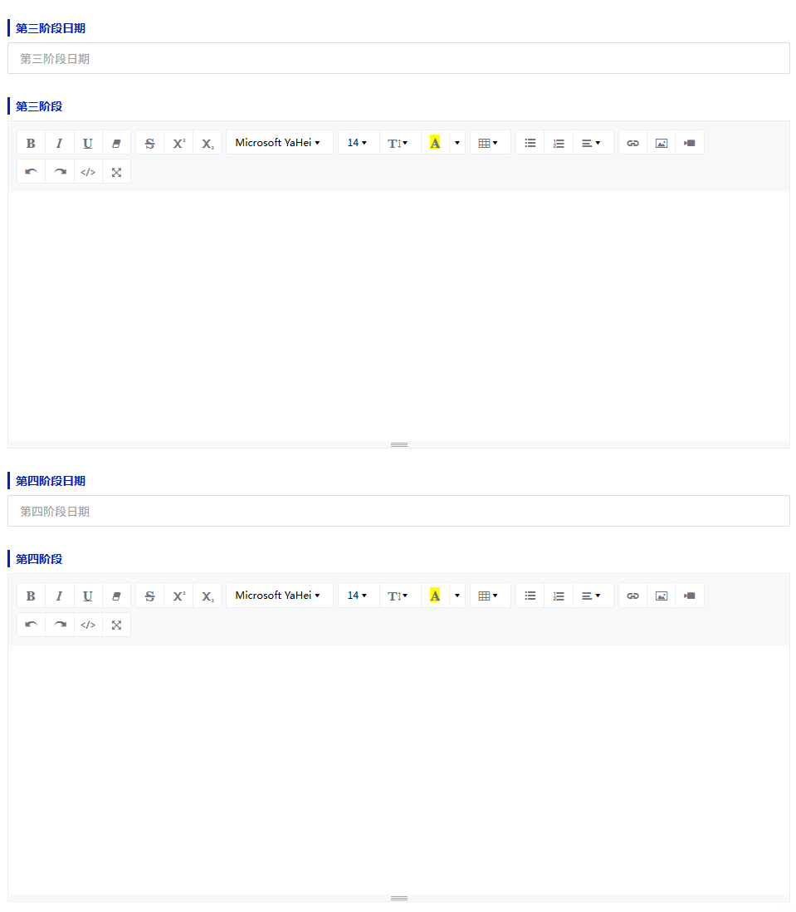
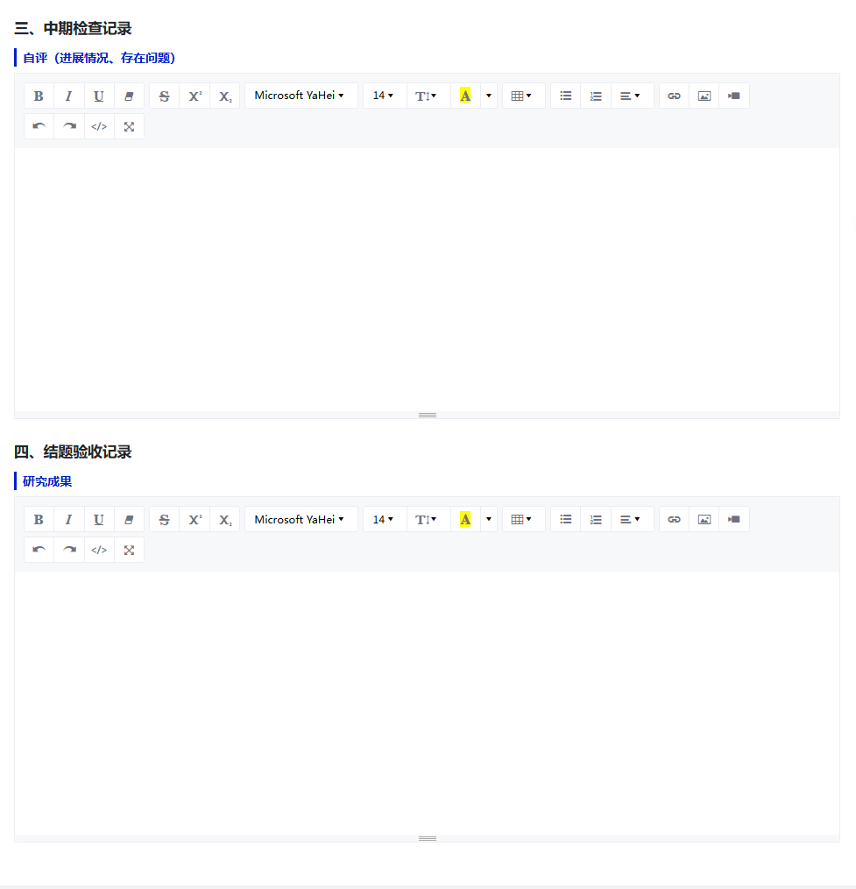
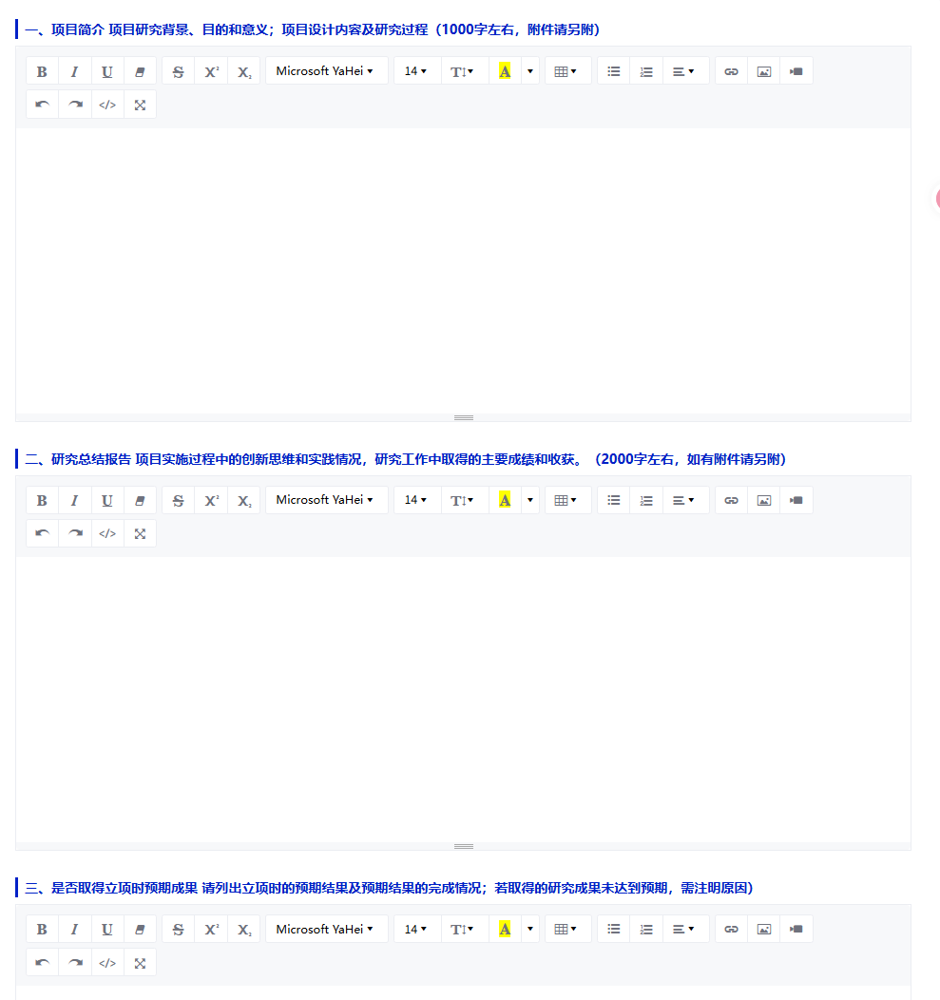
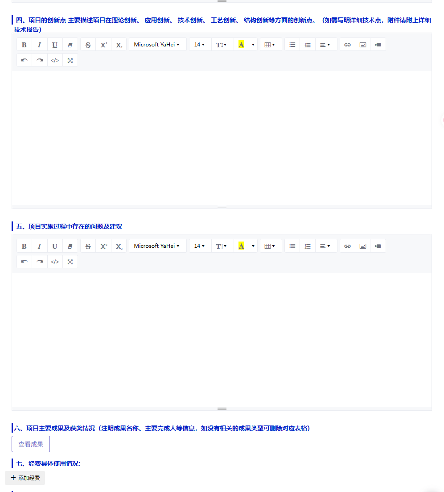
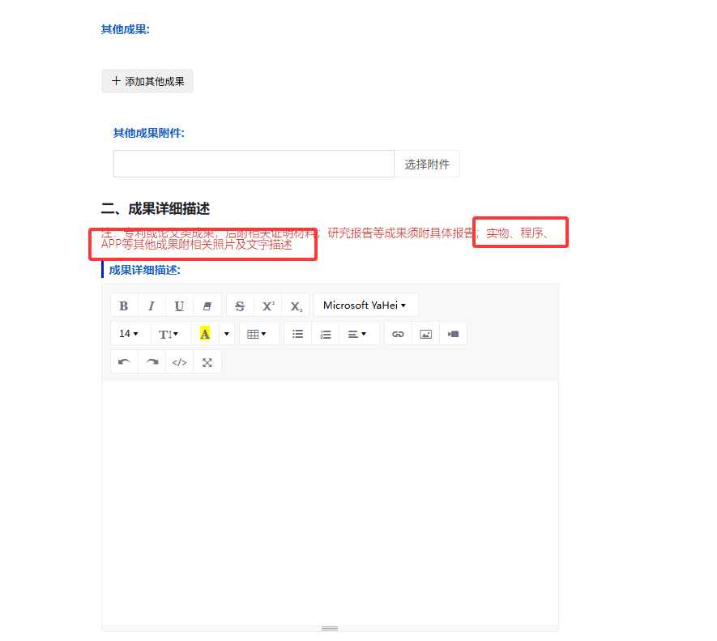

# 分工

## 过程记录册工作量比较小，可以跟着之前中期之后的内容写完就行，故分工如下

|      |                      |
| :--: | :------------------: |
|  A   | 过程记录册+成果描述  |
|  B   | 结题验收报告书一到三 |
|  C   | 结题验收报告书四、五 |
|  D   |    答辩pptzhi'zuo    |
|  E   |         答辩         |

1. 过程记录册

   

   

   

2. 结题验收报告书

   

   

3. 成果报告及描述

   

4. 答辩ppt

5. 答辩人
