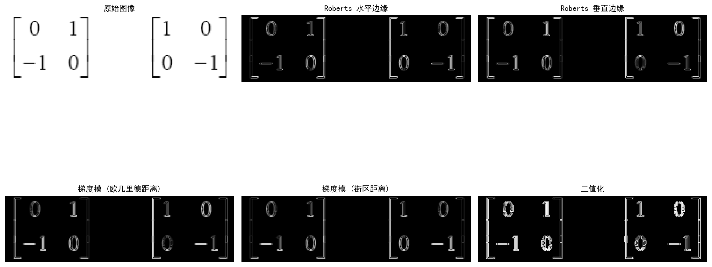
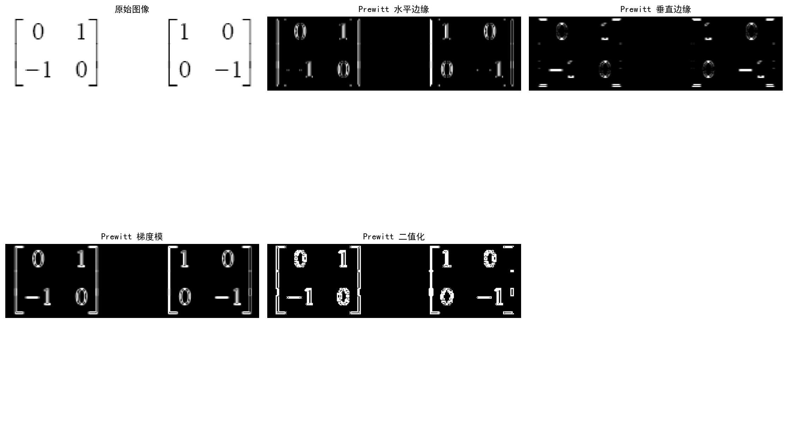
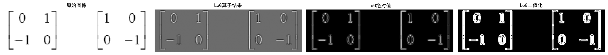
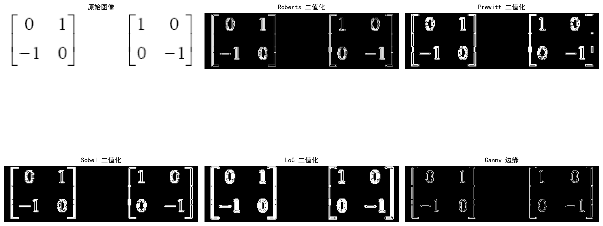
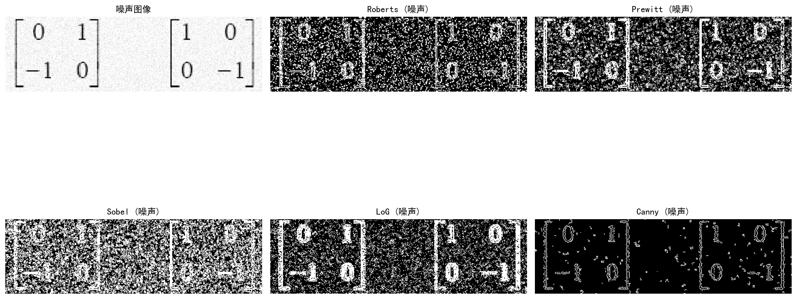

# 实验十 图像分割（选做）

## 一、实验目的
使用Python软件进行图像的分割。使学生通过实验体会一些主要的分割算子对图像处理的效果，以及各种因素对分割效果的影响。能够自行评价各主要算子在无噪声条件下和噪声条件下的分割性能。能够掌握分割条件(阈值等)的选择。

## 二、实验原理
图像分割中的边缘检测旨在提取图像中亮度变化剧烈的区域。常用的基于微分的边缘检测算子包括：
1. **Roberts 算子**：利用局部差分寻找边缘。水平算子为 `[0 1; -1 0]`，垂直算子为 `[1 0; 0 -1]`。该算子对具有陡峭的低噪声图像效果较好，但对噪声敏感。
2. **Prewitt 算子**：使用 `3x3` 模板在水平和垂直方向上进行一阶导数近似。水平算子为 `[[-1, 0, 1], [-1, 0, 1], [-1, 0, 1]]`，它在检测边缘的同时具有一定的平滑作用。
3. **Sobel 算子**：与 Prewitt 类似，但在距离中心更近的像素上分配了更大的权重（加权平均），因此比 Prewitt 具有更好的抗噪性能。
4. **LoG (Laplacian of Gaussian) 算子**：先对图像进行高斯平滑（消除噪声），再应用拉普拉斯算子（二阶导数）求边缘。可以通过寻找零交叉点来确定边缘位置。
5. **Canny 算子**：一种综合的边缘检测算法，包含高斯平滑、计算梯度幅值和方向、非极大值抑制以及双阈值边缘连接，具有良好的抗噪性和边缘连续性。

## 三、实验内容与步骤

1. **导入图像：** 使用 `skimage.data.camera()` 载入测试图像。
2. **Roberts 算子边缘检测：**
   - 定义水平和垂直 Roberts 模板并使用 `cv2.filter2D` 进行滤波。
   - 使用欧几里德距离 $G = \sqrt{G_x^2 + G_y^2}$ 和街区距离 $G = |G_x| + |G_y|$ 计算梯度模。
   - 设定阈值（例如 30）进行二值化处理。
3. **Prewitt 和 Sobel 算子边缘检测：**
   - 定义相应的 `3x3` 模板进行滤波，或使用 OpenCV 的内置函数 `cv2.Sobel` 进行计算，然后通过设定的阈值进行二值化。
4. **LoG 算子边缘检测：**
   - 先使用 `cv2.GaussianBlur` 对图像进行高斯滤波。
   - 使用 `cv2.Laplacian` 计算二阶导数并取绝对值后二值化。
5. **Canny 边缘检测：** 使用 `cv2.Canny` 直接获取边缘。
6. **对加噪图像重复实验：** 对原始图像添加均值为0、标准差为20的高斯噪声，然后重复上述算子的计算，观察在噪声条件下的分割性能。

**核心代码片段：**

```python
def apply_roberts(img):
    kernel_x = np.array([[0, 1], [-1, 0]], dtype=np.float32)
    kernel_y = np.array([[1, 0], [0, -1]], dtype=np.float32)
    
    rx = cv2.filter2D(img.astype(np.float32), -1, kernel_x)
    ry = cv2.filter2D(img.astype(np.float32), -1, kernel_y)
    
    grad_euclidean = np.sqrt(rx**2 + ry**2)
    grad_block = np.abs(rx) + np.abs(ry)
    
    # 二值化
    _, binary = cv2.threshold(grad_euclidean.astype(np.uint8), 30, 255, cv2.THRESH_BINARY)
    
    return rx, ry, grad_euclidean, grad_block, binary
```

## 四、实验结果图

### 1. Roberts 算子结果


### 2. Prewitt 算子结果


### 3. Sobel 算子结果


### 4. LoG 算子结果


### 5. 各算子无噪声下的综合比较


### 6. 各算子在加噪条件下的表现


## 五、思考题

**1. 比较各主要算子在无噪声条件下和噪声条件下的分割性能。**
- **无噪声条件下：** 
  - Roberts 算子检测到的边缘较细且定位准确，但在细节较多的地方容易断裂。
  - Prewitt 和 Sobel 算子检测出的边缘较宽，较为连续，效果较好。其中 Sobel 由于加权平均，边缘更加平滑。
  - LoG 和 Canny 算子检测出的边缘更连续且清晰，Canny 提供的是精细的单像素宽边缘。
- **噪声条件下：**
  - Roberts 算子由于只使用 `2x2` 邻域且无平滑操作，对噪声极其敏感，在加噪后提取出了大量的虚假边缘，几乎无法辨认真实边缘。
  - Prewitt 和 Sobel 具有一定的抗噪能力，效果优于 Roberts，但高噪声时依然存在较多孤立噪点。
  - LoG 算子和 Canny 算子内置了高斯滤波步骤，在噪声图像上表现出良好的鲁棒性，基本过滤了背景噪声，提取了比较清晰的主体轮廓。

**2. 分割条件(阈值)的选择对结果有何影响？**
- 阈值设定过高：会过滤掉大量的弱边缘，造成图像轮廓断裂或重要细节丢失。
- 阈值设定过低：会将原本不是边缘的噪声或轻微亮度变化识别为边缘，导致二值化图像中含有大量的噪点和虚假边界。
- 选取合适的阈值对于简单的一阶、二阶导数算子至关重要，而像 Canny 算子采用的双阈值方法（高低阈值结合）有效缓解了单一阈值难以兼顾去噪与连续性的矛盾。

## 六、实验总结
通过本次实验，我掌握了多种常见图像分割和边缘检测算子（Roberts, Prewitt, Sobel, LoG, Canny）的使用原理与 Python 实现方法。实验结果表明，梯度算子的模板大小和是否带有平滑机制对其抗噪能力有着决定性影响：简单的差分算子定位精度高但在噪声下失效，而经过高斯平滑的 LoG 和 Canny 算子则表现出了强大的鲁棒性。这为在实际工程应用中根据具体图像情况选取合适的边缘提取算法提供了重要的理论与实践参考。
