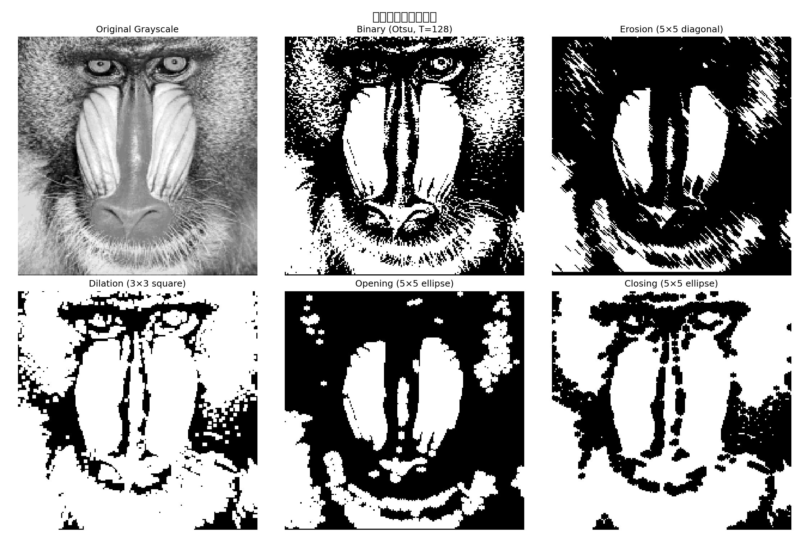
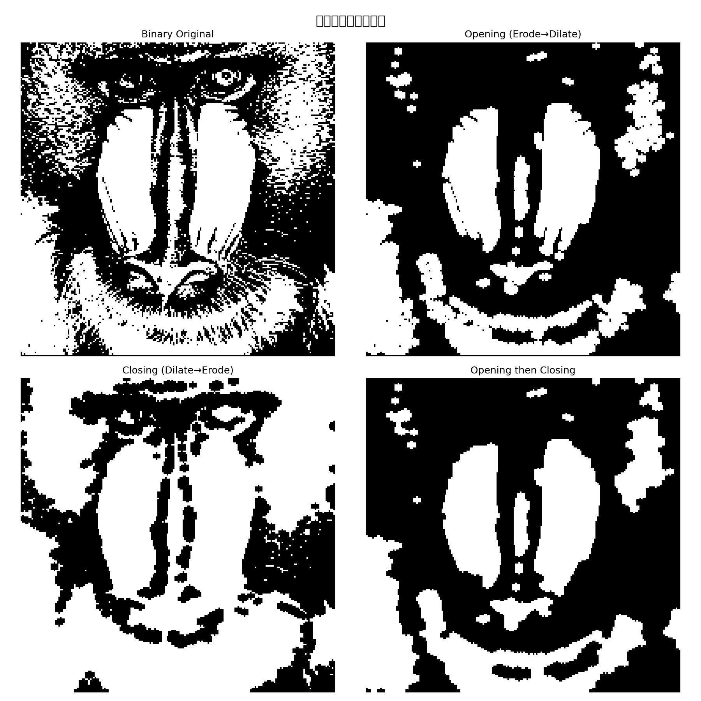

# 实验五 形态学图像处理 (Python实现)

## 一、 实验目的与要求
1. 学习常见的数学形态学运算基本方法。
2. 了解腐蚀 (Erosion)、膨胀 (Dilation)、开运算 (Opening)、闭运算 (Closing) 取得的效果。
3. 培养处理实际图像的能力，掌握在 Python (OpenCV) 中应用这些形态学操作的方法。

## 二、 实验原理
数学形态学操作主要用于提取图像中的形状成分。最基本的操作是腐蚀和膨胀：
*   **腐蚀 (Erosion)**: 将结构元素(Structuring Element)与图像做卷积，主要用于"收缩"或"变细"二值图像中的前景目标。能够消除无意义的细小噪点。
*   **膨胀 (Dilation)**: 主要用于"生长"或"变粗"二值图像中的前景目标。通常用于填补目标区域内的细小孔洞。

基于腐蚀和膨胀组合，衍生出开运算和闭运算：
*   **开运算 (Opening)**: 先腐蚀后膨胀。主要用于消除小物体、在纤细点处分离物体、平滑较大物体的边界，同时并不明显改变其面积。
*   **闭运算 (Closing)**: 先膨胀后腐蚀。主要用于填充前景物体内的细小孔洞、连接断开的邻接物体、平滑其边界。

## 三、 实验内容与步骤

### 1. 调入并显示图像
读取Plane2.jpg图像（标准测试图像），如果下载失败则使用lenna.png作为替代。
```python
img_gray = cv2.imread('Plane2.jpg', cv2.IMREAD_GRAYSCALE)
```

### 2. 选取合适的阈值，得到二值化图像
使用Otsu自动阈值方法进行二值化。
```python
threshold_val, img_bin = cv2.threshold(img_gray, 0, 255,
    cv2.THRESH_BINARY_INV + cv2.THRESH_OTSU)
```
**结果**: Otsu方法自动找到的最佳阈值为128。

### 3. 设置结构元素
定义不同形状和大小的结构元素：
```python
# 膨胀结构元素: 3×3方形 (等效于MATLAB的strel('square',3))
kernel_dilate = cv2.getStructuringElement(cv2.MORPH_RECT, (3, 3))

# 腐蚀结构元素: 5×5对角矩阵 (等效于MATLAB的strel('arbitrary',eye(5)))
kernel_erode = np.eye(5, dtype=np.uint8)

# 椭圆结构元素: 5×5
kernel_ellipse = cv2.getStructuringElement(cv2.MORPH_ELLIPSE, (5, 5))
```

### 4. 腐蚀运算
使用5×5对角结构元素对二值图像进行腐蚀。
```python
img_erode = cv2.erode(img_bin, kernel_erode, iterations=1)
```
**结果**: 腐蚀使得白色前景区域变小，细小的白色噪点被消除，物体边界向内收缩。

### 5. 膨胀运算
使用3×3方形结构元素对二值图像进行膨胀。
```python
img_dilate = cv2.dilate(img_bin, kernel_dilate, iterations=1)
```
**结果**: 膨胀使得白色前景区域变大，能够连接原本断开的相似物体，填补内部的黑色小孔。

### 6. 开运算
先腐蚀后膨胀，使用5×5椭圆结构元素。
```python
img_open = cv2.morphologyEx(img_bin, cv2.MORPH_OPEN, kernel_ellipse)
```
**结果**: 开运算成功去除了背景中的小白点（孤立噪声），保持了主体目标物的大小基本不变。

### 7. 闭运算
先膨胀后腐蚀，使用5×5椭圆结构元素。
```python
img_close = cv2.morphologyEx(img_bin, cv2.MORPH_CLOSE, kernel_ellipse)
```
**结果**: 闭运算成功填补了主体目标内部的黑色小孔洞，保持了整体目标的形状面积不发生剧烈改变。

## 四、 实验结果图

### 4.1 形态学处理结果


### 4.2 效果对比


## 五、 实验总结
通过本次实验，掌握了数学形态学的基本操作：

1. **腐蚀运算**：使得图像中的白色前景区域变小，物体的边界向内部收缩，一些非常细小的白色孤立噪点被完全消除。适用于去除小噪声点、分离粘连物体。
2. **膨胀运算**：使得图像中的白色前景区域变大，物体的边界向外部扩张，能够连接原本断开的相似物体，并填补内部的黑色小孔。适用于填补空洞、连接断裂区域。
3. **开运算**（先腐蚀后膨胀）：成功去除了背景中的孤立噪声点，同时保持了主体目标物的大小基本不变，平滑了外边缘。适用于去除小噪声。
4. **闭运算**（先膨胀后腐蚀）：成功填补了主体目标内部的黑色小孔洞，同时也保持了整体目标的形状面积不发生剧烈改变。适用于填补内部空洞。

结构元素的形状和大小对形态学操作的效果有重要影响：
- 方形结构元素适合处理水平/垂直方向的特征
- 椭圆结构元素更接近自然形状，处理效果更平滑
- 对角结构元素适合处理对角线方向的特征

## 六、 思考题

**(1) 结合实验内容，评价腐蚀运算与膨胀运算的效果。**
*   **腐蚀运算**：腐蚀是一种"收缩"操作，它使前景（白色）区域变小。在实验中，腐蚀运算有效地消除了图像中的细小白色噪点和毛刺，使物体边界向内收缩。腐蚀的程度取决于结构元素的大小——结构元素越大，腐蚀效果越强。腐蚀的缺点是可能导致目标物体断裂或消失。
*   **膨胀运算**：膨胀是一种"扩张"操作，它使前景（白色）区域变大。在实验中，膨胀运算能够填补物体内部的小黑色孔洞，连接原本断开的相近物体。膨胀的程度同样取决于结构元素的大小。膨胀的缺点是可能导致不同物体粘连在一起。

**(2) 结合实验内容，评价开运算与闭运算的效果。**
*   **开运算**（先腐蚀后膨胀）：开运算在去除小物体（噪声）方面非常有效。腐蚀阶段消除了小的白色噪点，随后的膨胀阶段恢复了主要物体的大小。因此，开运算能够"开启"物体之间的细小连接，平滑物体轮廓，同时保持主要物体的面积基本不变。
*   **闭运算**（先膨胀后腐蚀）：闭运算在填补小孔洞方面非常有效。膨胀阶段填补了物体内部的小黑色孔洞，随后的腐蚀阶段恢复了主要物体的大小。因此，闭运算能够"关闭"物体内部的细小间隙，连接邻近的物体，同时保持主要物体的面积基本不变。

**(3) 腐蚀、膨胀、开、闭运算的适用条件是什么？**
*   **腐蚀**：适用于去除小噪声点、分离粘连物体、细化物体边界。当图像中存在小的白色孤立噪点，或需要缩小目标区域时使用。
*   **膨胀**：适用于填补小孔洞、连接断裂区域、扩大目标区域。当物体内部存在小的黑色孔洞，或需要连接相近物体时使用。
*   **开运算**：适用于去除前景中的小噪声（白色噪点），同时保持主要物体的形状和大小。当图像背景中存在小的白色干扰时使用。
*   **闭运算**：适用于填补前景物体内部的小孔洞（黑色噪点），同时保持主要物体的形状和大小。当物体内部存在小的黑色干扰时使用。

**(4) 除了形态学方法用其他方法如何实现图像分割？**
除了形态学方法，图像分割还可以使用以下方法：
1. **阈值分割**：如Otsu方法、自适应阈值等，根据灰度值将像素分为前景和背景。
2. **边缘检测**：如Sobel、Canny、LoG等算子，通过检测灰度变化来分割区域。
3. **区域生长**：从种子点开始，将相似的相邻像素合并到同一区域。
4. **聚类方法**：如K-means、DBSCAN等，根据像素特征进行聚类分割。
5. **深度学习方法**：如U-Net、Mask R-CNN等，使用神经网络进行语义分割。

**(5) 图像预处理的作用是什么？**
图像预处理的主要作用包括：
1. **去噪**：去除图像采集和传输过程中引入的噪声，如使用均值滤波、中值滤波等。
2. **增强对比度**：通过直方图均衡、灰度变换等方法增强图像的视觉效果。
3. **几何校正**：校正图像的几何畸变，如旋转、缩放、透视变换等。
4. **标准化**：将图像转换为统一的格式、大小和灰度范围，便于后续处理。
5. **特征提取准备**：通过边缘增强、锐化等操作，突出感兴趣的目标特征。
6. **数据增强**：通过旋转、翻转、裁剪等操作增加训练数据的多样性（在深度学习中常用）。

预处理是图像处理流程中非常重要的一步，良好的预处理可以显著提高后续处理（如分割、识别、分类）的准确性和效率。
