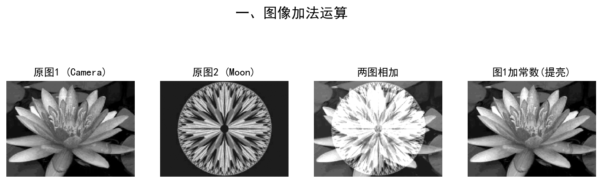
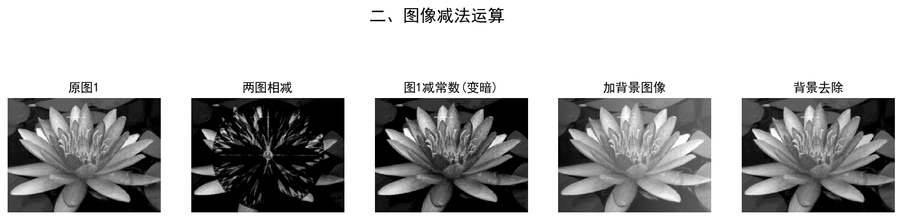
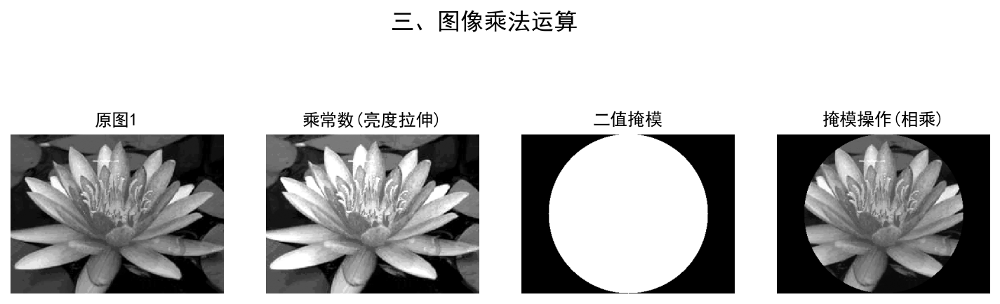
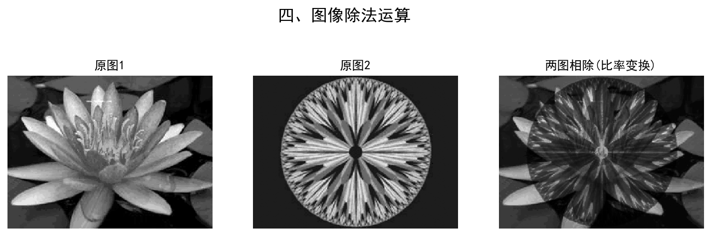
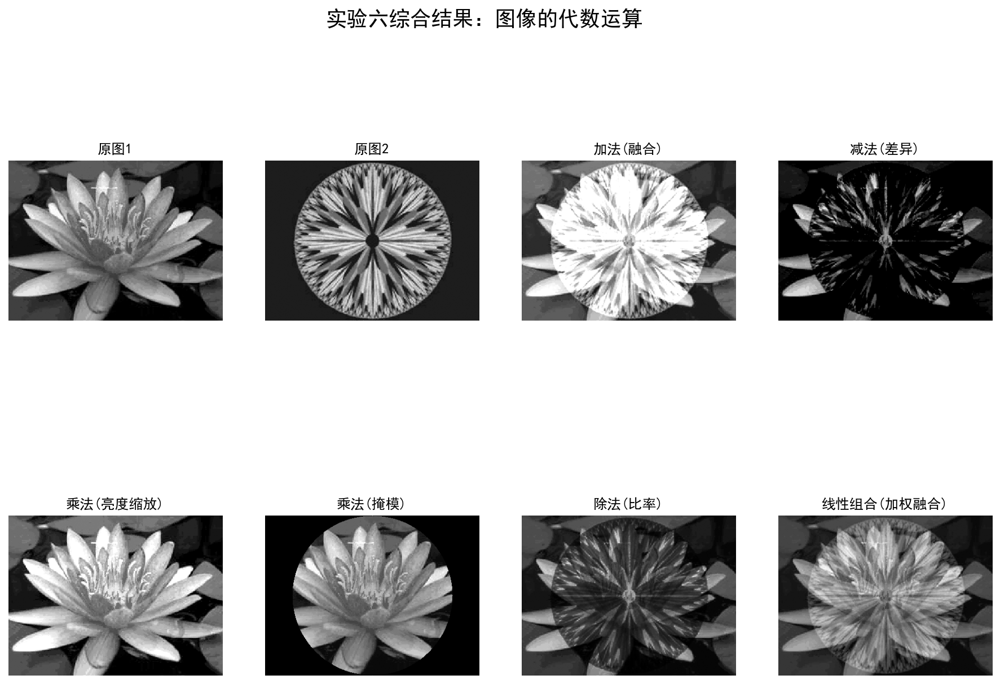

# 实验六 图像的代数运算（选做）

## 一、实验目的
1. 了解图像的算术运算在数字图像处理中的初步应用。
2. 体会图像算术运算处理的过程和处理前后图像的变化。

## 二、实验原理
图像的代数运算是指将两幅或多幅图像进行点对点的加、减、乘、除等数学运算。
1. **加法运算**：可以用于图像融合、通过图像叠加平均消除加性噪声、或者通过加常数来整体提高图像亮度。
2. **减法运算**：主要用于背景去除、运动检测（两帧相减）、或者通过减常数来降低图像整体亮度。
3. **乘法运算**：常用于图像亮度的按比例缩放，或通过掩模（Mask）操作提取图像中感兴趣的区域（ROI）。
4. **除法运算**：也称为比率变换，常用于校正光照不均匀或多光谱图像分析。
5. **线性组合**：对多幅图像按照一定权重进行叠加融合，可实现图像的平滑过渡。

## 三、实验内容与步骤

### 1. 图像加法运算
使用 OpenCV 的 `cv2.add` 函数实现了两幅图像（camera 和 moon）的相加，以及单幅图像加常数操作来增加亮度。
```python
# 1.1 两幅图像相加
add_img = cv2.add(img1, img2)
# 1.2 图像加常数 (增加亮度)
c_val = np.ones_like(img1) * 50
add_const = cv2.add(img1, c_val)
```

### 2. 图像减法运算
使用 `cv2.subtract` 函数实现了两幅图像的相减、图像减常数降低亮度操作。同时生成了一个梯度背景图像，通过减法实现了背景去除操作。
```python
# 2.1 两幅图像相减
sub_img = cv2.subtract(img1, img2)
# 2.3 背景去除
bg_removed = cv2.subtract(img_with_bg, bg)
```

### 3. 图像乘法运算
使用 `cv2.multiply` 实现图像与常数相乘（拉伸对比度），并创建二值圆形掩模，将原图与掩模相乘，提取出掩模内部的图像区域。
```python
# 3.1 图像乘常数
mul_const = cv2.multiply(img1, 1.5)
# 3.2 掩模操作
masked_img = cv2.multiply(img1_float, mask_float)
```

### 4. 图像除法运算
使用 `cv2.divide` 实现了比率变换，将 img1 除以 img2（加 1 避免除零错误），并将结果归一化后显示。
```python
div_img = cv2.divide(img1.astype(np.float32), img2.astype(np.float32) + 1.0)
div_img_norm = cv2.normalize(div_img, None, 0, 255, cv2.NORM_MINMAX, dtype=cv2.CV_8U)
```

### 5. 图像四则运算 - 线性组合
使用 `cv2.addWeighted` 对两幅图像进行加权融合。
```python
linear_comb = cv2.addWeighted(img1, 0.6, img2, 0.4, 0)
```

## 四、实验结果图

### 加法运算结果


### 减法运算结果


### 乘法运算结果


### 除法运算结果


### 综合运算结果


## 五、思考题

**1. 图像加法和减法在实际应用中有哪些典型场景？**
答：图像加法常用于图像的叠加融合，例如将多幅同一场景但带有随机噪声的图像叠加求平均，以有效降低或消除加性噪声；或者将水印/标识添加到目标图像中。图像减法则常用于减去已知的背景图以实现背景去除，以及在视频监控中通过两帧图像相减进行运动目标的检测。

**2. 在进行图像的代数运算时，需要注意哪些数据类型和溢出的问题？**
答：常见的图像像素数据类型为 uint8（0~255）。直接使用 NumPy 的加减法容易导致溢出并出现截断回绕现象（如 255+1=0）。使用 OpenCV 的函数（如 `cv2.add`, `cv2.subtract`）时，它们会自动进行饱和处理（即超过255截断为255，小于0截断为0）。若进行乘除等复杂运算，应先将数据类型转换为浮点型（如 float32），计算完毕后再缩放并转换回 uint8 显示。

## 六、实验总结
通过本次实验，我掌握了使用 Python 和 OpenCV 实现图像的代数运算方法。相比于 MATLAB 中的 `imadd`, `imsubtract` 等函数，Python 中的 OpenCV 库提供了对应的方法如 `cv2.add` 和 `cv2.subtract`，并自动处理溢出问题。了解了掩模操作可以通过乘法实现区域提取。此外，通过实际编码对比了加法、减法、乘法、除法以及线性组合的视觉效果，加深了对这些基础处理方法在消除噪声、提取背景、校正光照等实际应用中的理解。
