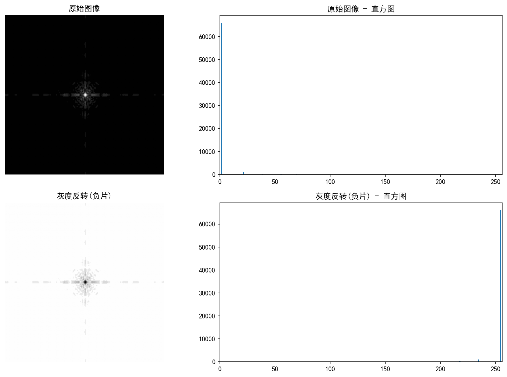
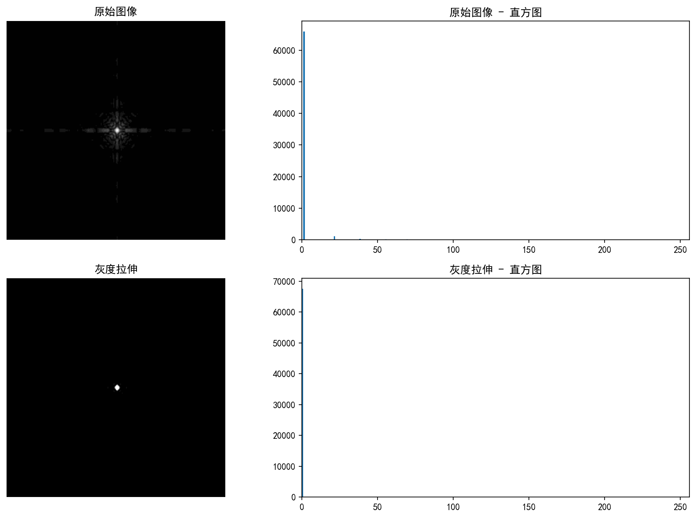
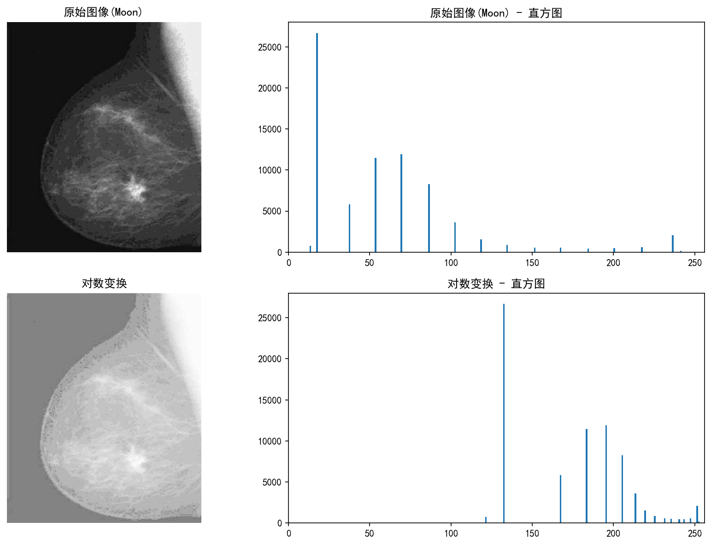
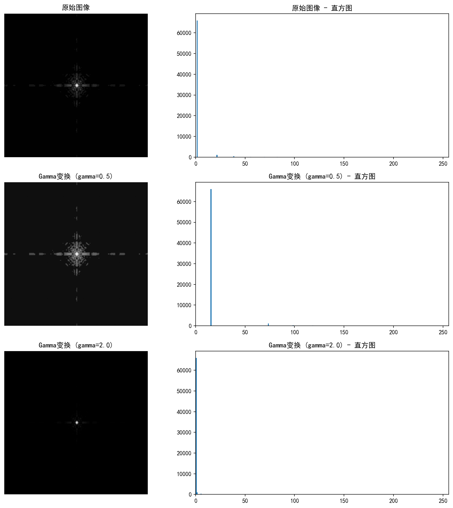
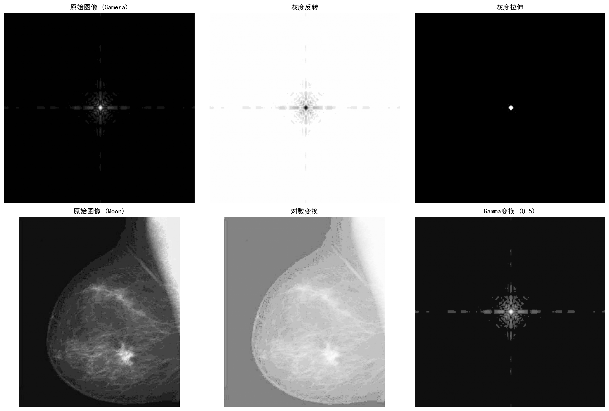

# 实验七 图像增强—灰度变换

## 一、实验目的
1. 了解图像增强的目的及意义，加深对图像增强的感性认识。
2. 学会对图像直方图的分析。
3. 掌握直接灰度变换的图像增强方法。

## 二、实验原理
图像增强处理是为了改善图像的视觉效果或使得图像更适合于人或机器分析。
空间域处理方法直接对图像的像素进行操作，其表达式为：$g(x,y) = T[f(x,y)]$
其中 $f(x,y)$ 为原图，$g(x,y)$ 为处理后的图像，$T$ 是对 $f$ 作用的操作。

灰度变换是最基本的空间域图像增强方法，通常表示为：$s = T(r)$
其中 $r$ 和 $s$ 分别表示变换前后的像素灰度值。常见的灰度变换包括：
1. **灰度反转（负片）**：$s = L - 1 - r$，将图像亮暗区域反转。
2. **灰度拉伸**：通过分段线性变换，将原本集中在窄范围的灰度值扩展到整个灰度动态范围，从而提高对比度。
3. **对数变换**：$s = c \log(1+r)$，用于扩展低灰度值，压缩高灰度值，常用于增强暗部细节。
4. **Gamma变换（幂次变换）**：$s = c r^\gamma$，当 $\gamma < 1$ 时拉伸低灰度，当 $\gamma > 1$ 时拉伸高灰度。

## 三、实验内容与步骤
本实验使用Python及OpenCV、numpy、matplotlib、skimage等库完成。

### 1. 图像数据读出及直方图显示
读取 `skimage.data.camera()` 和 `skimage.data.moon()`，并使用 matplotlib 显示图像及其直方图。
```python
img_camera = data.camera() # gray image uint8
img_moon = data.moon()     # gray image uint8

def show_img_hist(img, title, subplot_idx, fig):
    plt.subplot(*subplot_idx)
    plt.imshow(img, cmap='gray', vmin=0, vmax=255)
    plt.title(title)
    plt.axis('off')

    plt.subplot(subplot_idx[0], subplot_idx[1], subplot_idx[2] + 1)
    plt.hist(img.ravel(), bins=256, range=[0, 256])
    plt.title(f"{title} - 直方图")
    plt.xlim([0, 256])
```

### 2. 灰度反转
对 `camera` 图像进行灰度反转：
```python
img_negative = 255 - img_camera
```

### 3. 灰度拉伸
将 `camera` 图像的特定灰度范围 [0.3 * 255, 0.6 * 255] 拉伸至 [0, 255]：
```python
min_in = 0.3 * 255
max_in = 0.6 * 255
img_stretch = np.copy(img_camera).astype(float)
img_stretch[img_stretch < min_in] = min_in
img_stretch[img_stretch > max_in] = max_in
img_stretch = (img_stretch - min_in) / (max_in - min_in) * 255
img_stretch = img_stretch.astype(np.uint8)
```

### 4. 对数变换
对 `moon` 图像进行对数变换，以增强暗部细节：
```python
c = 255.0 / np.log(1 + 255)
img_log = c * np.log(1 + img_moon.astype(float))
img_log = np.uint8(img_log)
```

### 5. Gamma变换
对 `camera` 图像分别进行 $\gamma=0.5$ 和 $\gamma=2.0$ 的变换：
```python
gamma = 0.5
img_gamma_05 = np.power(img_camera.astype(float) / 255.0, gamma) * 255.0
img_gamma_05 = np.uint8(img_gamma_05)

gamma = 2.0
img_gamma_20 = np.power(img_camera.astype(float) / 255.0, gamma) * 255.0
img_gamma_20 = np.uint8(img_gamma_20)
```

## 四、实验结果图

1. **灰度反转实验结果**

**分析**：反转后的图像呈现底片效果，直方图的分布刚好与原图镜像对称，原图亮的地方变暗，暗的地方变亮。

2. **灰度拉伸实验结果**

**分析**：经过拉伸后，原本集中在中间灰度的像素被拉伸到了两端，提高了该区域的对比度，直方图分布向两端扩张，并在0和255处形成了峰值（被截断的像素）。

3. **对数变换实验结果**

**分析**：对数变换扩展了原图中较暗的部分，压缩了较亮的部分，因此 `moon` 图像中的暗部细节（如陨石坑）变得更加清晰，直方图整体向高灰度区域偏移。

4. **Gamma变换实验结果**

**分析**：
- $\gamma=0.5$ 时，图像整体变亮，暗部细节增强，直方图向右偏移。
- $\gamma=2.0$ 时，图像整体变暗，亮部细节增强，直方图向左偏移。

5. **综合对比**


## 五、思考题
**1. 分析不同灰度变换方法分别适用于什么场景？**
- **灰度反转**：适用于增强嵌入在暗色背景中的白色或灰色细节，特别是在面积较大的暗区中。
- **灰度拉伸**：适用于原始图像灰度范围较窄，整体对比度较低的情况，通过拉伸可以显著提高图像对比度。
- **对数变换**：适用于图像的灰度分布具有极大的动态范围时（例如傅里叶频谱），能够有效增强暗部细节。
- **Gamma变换**：用于屏幕显示的伽马校正；当图像整体偏暗时用 $\gamma<1$ 增强，整体过曝（偏亮）时用 $\gamma>1$ 增强。

## 六、实验总结
本次实验主要学习了基于空间域的图像增强方法——灰度变换。通过Python实现了灰度反转、灰度拉伸、对数变换以及Gamma变换。从直方图的变化可以直观地观察到每种变换对像素灰度分布的影响：
1. 直方图是分析图像对比度和亮度的重要工具。
2. 线性变换（反转、拉伸）改变了对比度及明暗映射。
3. 非线性变换（对数、Gamma）对不同灰度级的敏感度不同，能有针对性地增强暗部或亮部细节。
实验加深了对图像增强原理和实现的理解，达到了预期的教学目的。