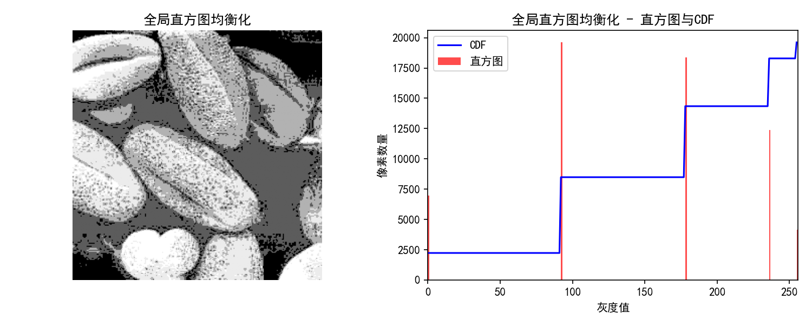
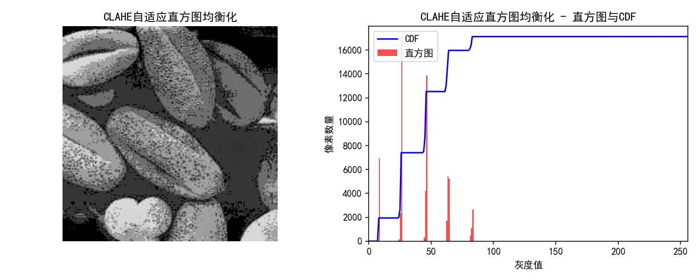
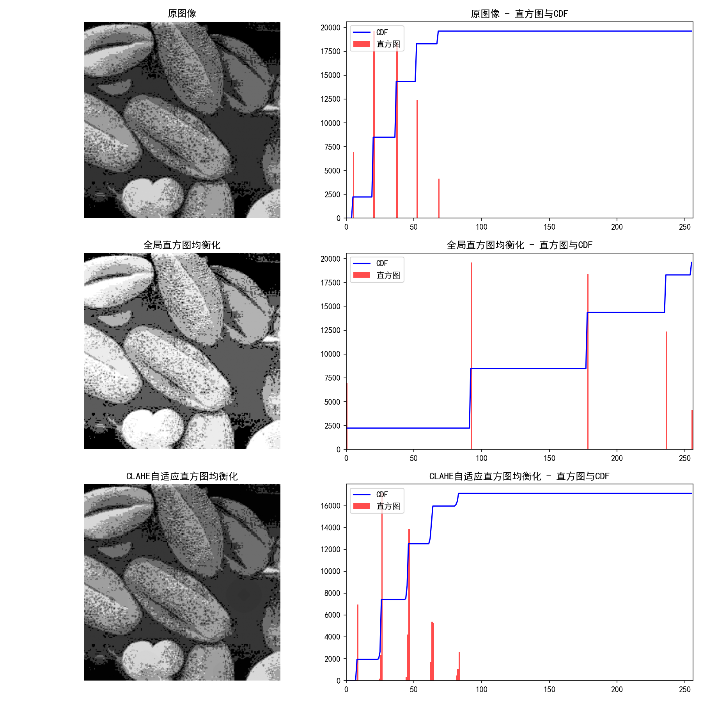

# 实验八 图像增强—直方图变换

## 一、实验目的
1. 掌握灰度直方图的概念及其计算方法。
2. 熟练掌握直方图均衡化和直方图规定化的计算过程。
3. 熟练掌握空域滤波中常用的平滑和锐化滤波器。
4. 掌握色彩直方图的概念和计算方法。
5. 利用 Python 程序进行图像增强（本次实验重点实现直方图的计算与直方图均衡化处理）。

## 二、实验原理
**1. 灰度直方图：**
灰度直方图是图像最基本的统计特征，它反映了图像中各个灰度级出现的频率或像素个数。它是一个一维离散函数，其横坐标表示灰度级（通常为 0-255），纵坐标表示具有该灰度级的像素个数或该像素个数占总像素数的比例。直方图能够直观地表现图像的整体对比度和亮度情况：若图像整体偏暗，直方图峰值偏向左侧；若整体偏亮，峰值偏向右侧；对比度低的图像直方图分布集中在较窄的区间内。

**2. 直方图均衡化（Histogram Equalization）：**
直方图均衡化的目的是将原图像的灰度直方图从比较集中的某个区间，通过一种非线性变换，映射为在整个灰度值动态变化范围内大致均匀分布的直方图。这样可以增强图像的全局对比度，使得图像的细节更加清晰。
其核心原理是利用累积分布函数（CDF）作为变换函数。设原始图像的像素总数为 $N$，第 $k$ 级灰度出现的频数为 $n_k$，则其概率密度函数为 $P(r_k) = \frac{n_k}{N}$。累积分布函数为 $S_k = \sum_{j=0}^{k} P(r_j)$。将其映射到新的灰度级（如 0-255）即可得到均衡化后的图像。

**3. 限制对比度自适应直方图均衡化（CLAHE）：**
普通的全局直方图均衡化会改变图像的整体亮度，并可能放大背景噪声。CLAHE 是一种局部自适应直方图均衡化方法，它将图像分成若干小块（如 8x8），分别进行直方图均衡化。为了避免局部噪声被过度放大，CLAHE 引入了对比度限制（Clip Limit）机制，将直方图中超过一定阈值的部分裁剪掉并均匀分配到其他灰度级中，从而在提升对比度的同时有效抑制噪声。

## 三、实验内容与步骤
**步骤1：** 导入必要的库 `cv2`，`numpy`，`matplotlib.pyplot`，以及 `skimage.data` 获取内置图像。设置 matplotlib 使其支持中文显示。
**步骤2：** 读入原图像（本次实验使用 `skimage.data.moon()`），由于其对比度较低，适合进行直方图均衡化处理。
**步骤3：** 计算原图像的直方图和累积分布函数（CDF），并利用 matplotlib 绘制显示。
**步骤4：** 使用 OpenCV 的 `cv2.equalizeHist()` 函数对原图像进行全局直方图均衡化处理，计算并显示处理后的图像、直方图和 CDF。
**步骤5：** 使用 `cv2.createCLAHE()` 实现限制对比度自适应直方图均衡化，并显示处理结果。
**步骤6：** 对比和保存所有实验结果图。

**核心代码片段：**
```python
# 计算直方图与CDF
hist, bins = np.histogram(image.flatten(), 256, range=[0, 256])
cdf = hist.cumsum()
cdf_normalized = cdf * float(hist.max()) / cdf.max()

# 1. 全局直方图均衡化
img_eq = cv2.equalizeHist(img)

# 2. CLAHE (限制对比度自适应直方图均衡化)
clahe = cv2.createCLAHE(clipLimit=2.0, tileGridSize=(8, 8))
img_clahe = clahe.apply(img)
```

## 四、实验结果图

**1. 原图像与直方图**

原图像（月球表面）的整体对比度偏低，直方图的像素分布主要集中在中间偏暗的区间，CDF 曲线在中间区域上升陡峭。

**2. 全局直方图均衡化**

经过全局直方图均衡化后，直方图的分布被拉伸，覆盖了 0-255 的整个灰度范围。CDF 曲线趋近于一条直线（理想状态下应为斜直线），图像的整体对比度显著增强。

**3. CLAHE 自适应直方图均衡化**

CLAHE 处理后的图像不仅对比度得到了提升，而且保留了更多的细节，避免了全局均衡化带来的过曝和噪声放大问题。

**4. 综合对比**


## 五、思考题
**1. 直方图均衡化对于所有类型的图像都能取得好的增强效果吗？**
答：不是。直方图均衡化本质上是全局处理，对于背景和前景对比度区分明显的图像，或者直方图本身已经很宽广且均匀的图像，直接进行全局均衡化可能会导致某些区域过度增强，产生"洗白"或噪声被过度放大的现象。例如，在包含大面积同色背景的图像中，背景噪声可能会被显著放大。此时使用局部或自适应的直方图均衡化（如 CLAHE）会取得更好的效果。

**2. CDF（累积分布函数）在直方图均衡化中的作用是什么？**
答：CDF 是直方图均衡化的核心映射函数。它具有单调递增的特性，这保证了图像转换后灰度值的相对大小关系不变（即原来亮的区域转换后依然比暗的区域亮）。同时，因为 CDF 将密集的像素灰度区间映射到更宽广的输出区间，从而实现了将集中分布的灰度拉伸，使转换后的直方图在整个灰度范围内均匀分布，达到增强对比度的目的。

## 六、实验总结
本次实验通过 Python 结合 OpenCV 和 NumPy 成功实现了图像的灰度直方图计算和直方图变换增强。通过绘制原始图像、全局均衡化图像和 CLAHE 增强图像的直方图与 CDF 曲线，直观地观察到了直方图均衡化的本质：即通过拉伸像素的灰度分布，使得各灰度级上的像素数量更加均匀，从而有效提升图像的全局对比度。同时，通过对比发现，CLAHE 算法通过局部处理和对比度限制，能够取得比全局均衡化更为自然细腻、噪声更低的增强效果，这为后续的图像预处理与分析奠定了良好的基础。
