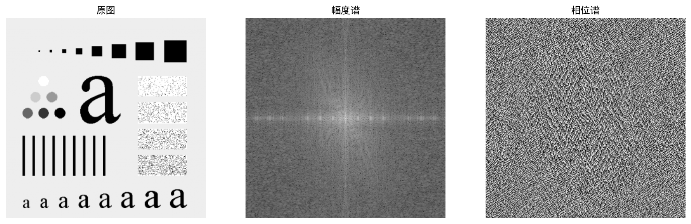
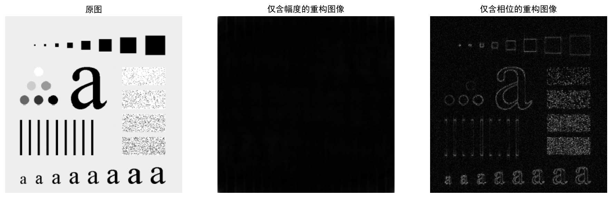

# 实验九 图像的傅立叶变换

## 一、实验目的
1. 了解图像变换的意义和手段。
2. 熟悉傅立叶变换的基本性质。
3. 熟练掌握FFT变换方法及应用。
4. 通过实验了解二维频谱的分布特点。
5. 评价人眼对图像幅频特性和相频特性的敏感度。

## 二、实验原理
图像变换是将图像从空间域变换到频域，以便于进行图像处理和分析。傅立叶变换（Fourier Transform）是数字图像处理中最常用的一种变换方法，它能够将图像的灰度分布转化为频率分布。

二维离散傅立叶变换（2D DFT）的公式可以将空间域的图像转换为频域表示，其结果是一个复数矩阵，包含了幅度谱（Magnitude Spectrum）和相位谱（Phase Spectrum）：
- **幅度谱**：反映了图像中各个频率分量的强度，代表了图像中像素亮度的变化剧烈程度，通常主要包含了图像的能量信息和大致的灰度分布。
- **相位谱**：反映了各个频率分量的位置信息，代表了图像中物体的结构、边缘和几何形状信息。

在频域中，低频分量集中在频谱中心（或经过频移操作后的中心），高频分量分布在四周。由于人眼对不同信息的敏感度不同，本实验通过仅保留幅度谱或相位谱进行傅立叶反变换，来评估这两种信息对视觉感知的贡献。

## 三、实验内容与步骤
1. **将图像内容读入内存**：使用OpenCV读取灰度图像内容。
2. **二维Fourier变换**：使用NumPy的`np.fft.fft2`函数对图像进行二维离散傅立叶变换，将图像从空间域转换到频域。
3. **幅度谱搬移并显示**：使用`np.fft.fftshift`将零频率（直流分量）移至频谱中心。提取幅度和相位，为了便于观察幅度谱，通常使用对数变换 `log(1 + magnitude)` 进行显示。
4. **仅使用幅度进行Fourier反变换**：保留傅立叶系数的幅度，将相位设为0（即 `Magnitude * exp(i * 0) = Magnitude`），通过`np.fft.ifftshift`逆平移后，使用`np.fft.ifft2`进行傅立叶反变换。
5. **仅使用相位进行Fourier反变换**：保留傅立叶系数的相位，将幅度设为1（即 `1 * exp(i * Phase)`），逆平移后进行傅立叶反变换。
6. **结果对比与分析**：对比原图、仅包含幅度的重构图像以及仅包含相位的重构图像，评价人眼对幅频特性和相频特性的敏感度差异。

## 四、实验结果图
通过代码运行生成的实验结果如下：

### 频谱分析
展示原图及其对应的幅度谱和相位谱：

### 图像重构对比
对比原图、仅包含幅度的重构图以及仅包含相位的重构图：

### 综合总结
全部结果的总结展示：

## 五、思考题
1. **傅里叶变换有哪些重要的性质?**
   傅立叶变换具有许多重要性质，包括：线性、平移性（空间域的平移导致频域的相移，反之亦然）、旋转性（空间域的旋转等价于频域相同角度的旋转）、尺度变换特性（空间域的扩展对应频域的压缩）、共轭对称性以及卷积定理（空间域的卷积等价于频域的乘积，这也是频域滤波的基础）。
2. **图像的二维频谱在显示和处理时应注意什么?**
   - 频谱中心化：默认情况下低频在原点（左上角），为便于观察，通常通过频移（如`fftshift`）将低频分量移至中心。
   - 动态范围：幅度谱的动态范围非常大，直接显示往往只能看到中心的一个亮点，因此通常采用对数变换（如`log(1+magnitude)`）来压缩动态范围以改善显示效果。
   - 复数处理：傅立叶变换结果是复数，必须分别处理并提取其幅度和相位，以便进行有意义的分析和重构。

## 六、实验总结
通过本次实验，我们深入了解了图像的二维傅立叶变换。从实验结果可以看出：
- **仅用幅度重构的图像**：虽然包含了原图的大部分能量，但丢失了图像的结构和边缘特征，导致图像变得模糊、难以辨认出原有物体。
- **仅用相位重构的图像**：虽然丢失了对比度和亮度分布信息，但清晰地保留了图像的边缘和轮廓结构，人眼仍然可以轻易辨认出图像中的主要内容。

这表明：**图像的相位信息比幅度信息对人眼的视觉感知更为重要**，相位保留了物体的几何结构，而人眼对这种结构信息（如边界、轮廓）比对具体的灰度（能量）分布更为敏感。