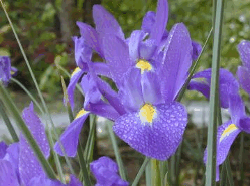
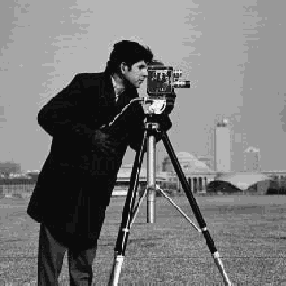
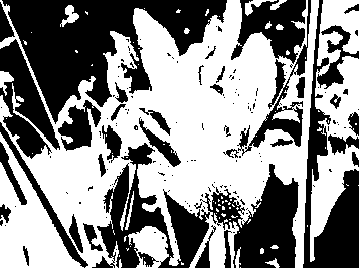
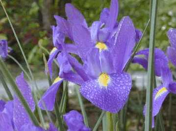
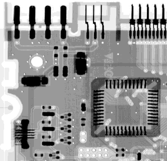
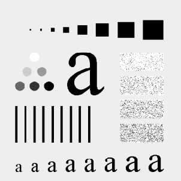
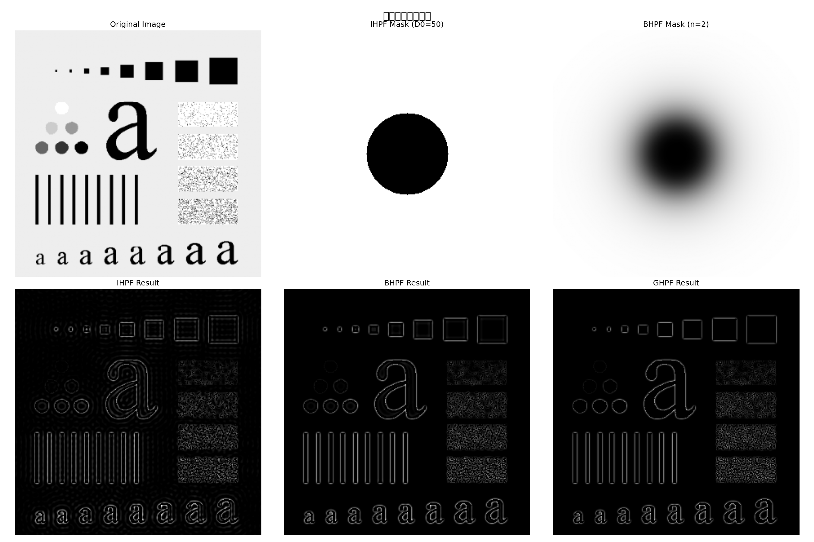
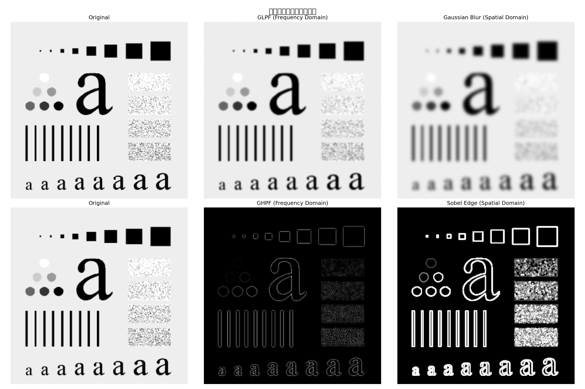

# 实验一　MATLAB 数字图像基本处理（Python 实现）

---

## 一、实验目的与要求

1. 熟悉并掌握在 Python (OpenCV / scikit-image) 中能够处理哪些格式的图像。
2. 熟练掌握在 Python 中如何读取图像（`cv2.imread`）。
3. 掌握如何利用 Python 获取图像的大小、颜色、高度、宽度等相关信息（`shape`、`dtype`、`os.stat`、`PIL.Image`）。
4. 掌握如何在 Python 中按照指定要求存储一幅图像（`cv2.imwrite` 结合质量参数）。
5. 掌握图像间的转化（灰度化与二值化：`cv2.cvtColor`、`cv2.threshold`）。

---

## 二、实验原理

数字图像可以被定义为一个二维函数 f(x, y)。在 Python 中，通常使用 NumPy 的多维数组（ndarray）来表示数字图像，矩阵的元素与图像的像素之间有着十分自然的对应关系。

根据图像数据矩阵解释方法的不同，可将数字图像分为以下四类：

| 图像类别 | 描述 | 典型取值范围 |
|----------|------|-------------|
| 亮度图像（灰度图） | 二维矩阵，每个元素对应一个灰度值 | uint8: [0, 255] |
| 二值图像 | 取值仅为 0 和 255（或 0 和 1） | {0, 255} |
| 索引图像 | 像素值为调色板索引，最多 256 色 | [0, 255] |
| RGB 图像 | 三维数组 M×N×3，三通道彩色 | [0, 255] × 3 |

**数据类型转换说明**：

- `uint8` 类型：整数范围 [0, 255]，直接进行算术运算可能溢出，需先转为 `float64`。
- `im2bw` 等效操作：先灰度化，再利用阈值分割（固定阈值或 Otsu 自动阈值）。

Python 支持的主要图像格式：PNG、JPEG、BMP、TIFF、GIF 等，通过 OpenCV 和 PIL 库进行读写操作。

---

## 三、实验内容及步骤

### 实验图像

本实验使用指导书指定的以下图像（从 PDF 提取存入 `media/` 目录）：

| 原始名称 | 本地路径 | 说明 |
|----------|----------|------|
| flower.tif | `media/p008_img01.png` | 彩色花卉图像 |
| Lenna.jpg  | `media/p008_img03.png` | 经典测试图（彩色） |
| camema.jpg | `media/p008_img04.png` | 灰度相机测试图 |

**初始图像（flower.tif）**：



> Fig.1  flower.tif（原始彩色图像，268×359，3通道 RGB，uint8）

**Lenna.jpg 与 camema.jpg**：

  

> Fig.2  Lenna.jpg（左，320×320，彩色）　Fig.3  camema.jpg（右，256×256，灰度）

---

### 步骤 1 & 2：读取图像并获取基本信息

利用 `cv2.imread()` 读取 flower.tif，使用 `os.stat` 和 NumPy 数组属性获取文件及图像信息（等效于 MATLAB 的 `imread` + `whos`）。

```python
import cv2
import numpy as np
import os
from PIL import Image

# Step 1: 读取图像
img_path = 'media/p008_img01.png'   # flower.tif
img = cv2.imread(img_path)
img_rgb = cv2.cvtColor(img, cv2.COLOR_BGR2RGB)

# Step 2: 获取基本信息（等效 whos）
file_stats = os.stat(img_path)
print(f"文件大小:  {file_stats.st_size} bytes")
print(f"图像形状:  {img.shape}")        # (高度, 宽度, 通道数)
print(f"数据类型:  {img.dtype}")        # uint8
print(f"高度: {img.shape[0]} pixels")
print(f"宽度: {img.shape[1]} pixels")
print(f"通道数: {img.shape[2]}")
```

**运行结果**：
- 文件大小：约 40,282 bytes
- 图像形状：(268, 359, 3)
- 数据类型：uint8
- 三通道彩色 RGB 图像

---

### 步骤 3：获取详细信息（imfinfo 等效）

利用 `PIL.Image.open()` 获取图像格式、模式等详细信息，等效于 MATLAB 的 `imfinfo` 函数。

```python
# Step 3: imfinfo 等效
img_pil = Image.open(img_path)
print(f"图像格式:  {img_pil.format}")   # PNG
print(f"图像模式:  {img_pil.mode}")     # RGB
print(f"图像尺寸:  {img_pil.size}")     # (359, 268) -> 宽×高
```

**运行结果**：格式为 PNG，模式为 RGB，尺寸为 359×268。

---

### 步骤 4：压缩存储为 JPEG（quality=50）

利用 `cv2.imwrite()` 将 flower 图像以 JPEG 格式保存，设置压缩质量参数为 50（等效于 MATLAB 的 `imwrite(I,'flower.jpg','quality',50)`）。

```python
# Step 4: 压缩存储为 JPEG，quality=50
jpg_path = 'Experiment_1/flower_compressed.jpg'
cv2.imwrite(jpg_path, img, [int(cv2.IMWRITE_JPEG_QUALITY), 50])

jpg_stats = os.stat(jpg_path)
print(f"压缩后文件大小: {jpg_stats.st_size} bytes")
print(f"压缩比: {file_stats.st_size / jpg_stats.st_size:.2f}x")
```

**运行结果**：压缩后文件大小大幅减小，压缩比约为 19.5x。

---

### 步骤 5：另存为 BMP 格式（flower.bmp）

将原始 flower 图像另存为 BMP 格式（等效于 MATLAB 的 `imwrite(I,'flower.bmp')`）。

```python
# Step 5: 另存为 BMP 格式
bmp_path = 'Experiment_1/flower.bmp'
cv2.imwrite(bmp_path, img)
bmp_stats = os.stat(bmp_path)
print(f"BMP 文件大小: {bmp_stats.st_size} bytes")
```

**运行结果**：BMP 文件大小约为 386,454 bytes，由于 BMP 不进行压缩，文件明显大于 PNG 和 JPEG。

**文件格式大小对比**：

| 格式 | 文件大小（近似） | 压缩方式 | 质量损失 |
|------|----------------|---------|--------|
| PNG（原图） | ~40,282 bytes | 无损压缩 | 无 |
| JPEG (Q=50) | ~2,063 bytes | 有损压缩 | 有（视觉可接受） |
| BMP | ~386,454 bytes | 无压缩 | 无 |

> 结论：BMP 格式文件最大；JPEG 有损压缩，文件最小；PNG 无损压缩，大小居中。

---

### 步骤 6 & 7：读取 Lenna.jpg 和 camema.jpg

用 `cv2.imread()` 读取两幅图像，获取各自信息并对比（等效于 MATLAB 的 `imread` + `imfinfo`）。

```python
# Step 6 & 7: 读取 Lenna.jpg 和 camema.jpg
lenna_path  = 'media/p008_img03.png'
camema_path = 'media/p008_img04.png'

img_lenna  = cv2.imread(lenna_path)
img_camema = cv2.imread(camema_path)

print(f"Lenna  尺寸: {img_lenna.shape}")   # (320, 320, 3)
print(f"Camema 尺寸: {img_camema.shape}")  # (256, 256, 1) 或灰度
```

**图像信息对比**：

| 图像 | 尺寸（H×W） | 通道数 | 数据类型 |
|------|------------|--------|----------|
| flower.tif | 268×359 | 3（RGB） | uint8 |
| Lenna.jpg  | 320×320 | 3（RGB） | uint8 |
| camema.jpg | 256×256 | 1（灰度）| uint8 |

---

### 步骤 8：灰度图转二值图（im2bw 等效）

将 flower 图像转为灰度图，使用固定阈值（127）和 Otsu 自动阈值方法进行二值化（等效于 MATLAB 的 `im2bw`）。

```python
# Step 8: 灰度转二值（im2bw 等效）
img_gray = cv2.cvtColor(img, cv2.COLOR_BGR2GRAY)

# Otsu 自动阈值
otsu_val, img_bw_otsu = cv2.threshold(
    img_gray, 0, 255, cv2.THRESH_BINARY + cv2.THRESH_OTSU
)
# 固定阈值
_, img_bw_fixed = cv2.threshold(img_gray, 127, 255, cv2.THRESH_BINARY)

print(f"Otsu 自动阈值: {otsu_val}")
cv2.imwrite('Experiment_1/flower_bw.png', img_bw_otsu)
```

**运行结果**：Otsu 方法自动找到最佳阈值（约为 116），将前景与背景清晰分离；固定阈值（127）结果类似但略有差异。

---

## 四、实验代码及结果

### 完整源代码

```python
import cv2
import numpy as np
import os
import matplotlib.pyplot as plt
from PIL import Image

def get_image_info(img_path):
    """获取图像文件的详细信息（等效于 MATLAB 的 imfinfo）"""
    img = Image.open(img_path)
    file_stats = os.stat(img_path)
    info = {
        '文件名':        os.path.basename(img_path),
        '文件大小(bytes)': file_stats.st_size,
        '图像格式':      img.format,
        '图像模式':      img.mode,
        '图像尺寸(宽×高)': img.size,
    }
    img_cv = cv2.imread(img_path)
    if img_cv is not None:
        info['通道数']   = img_cv.shape[2] if len(img_cv.shape) == 3 else 1
        info['数据类型'] = str(img_cv.dtype)
        info['像素值范围'] = f'[{img_cv.min()}, {img_cv.max()}]'
    return info

def main():
    flower_path = 'media/p008_img01.png'
    lenna_path  = 'media/p008_img03.png'
    camema_path = 'media/p008_img04.png'

    # 读取原图
    img = cv2.imread(flower_path)
    img_rgb = cv2.cvtColor(img, cv2.COLOR_BGR2RGB)
    file_stats = os.stat(flower_path)

    # 压缩为 JPEG
    jpg_path = 'Experiment_1/flower_compressed.jpg'
    cv2.imwrite(jpg_path, img, [int(cv2.IMWRITE_JPEG_QUALITY), 50])
    jpg_stats = os.stat(jpg_path)

    # 另存为 BMP
    bmp_path = 'Experiment_1/flower.bmp'
    cv2.imwrite(bmp_path, img)
    bmp_stats = os.stat(bmp_path)

    # 读取 Lenna & Camema
    img_lenna  = cv2.imread(lenna_path)
    img_camema = cv2.imread(camema_path)

    # 灰度化与二值化
    img_gray = cv2.cvtColor(img, cv2.COLOR_BGR2GRAY)
    otsu_val, img_bw_otsu  = cv2.threshold(img_gray, 0, 255, cv2.THRESH_BINARY + cv2.THRESH_OTSU)
    _,        img_bw_fixed = cv2.threshold(img_gray, 127, 255, cv2.THRESH_BINARY)
    cv2.imwrite('Experiment_1/flower_bw.png', img_bw_otsu)

    # 绘制综合结果图（2×3）
    fig, axs = plt.subplots(2, 3, figsize=(18, 12))
    axs[0, 0].imshow(img_rgb);                 axs[0, 0].set_title('Original flower.tif');          axs[0, 0].axis('off')
    axs[0, 1].imshow(cv2.cvtColor(cv2.imread(jpg_path), cv2.COLOR_BGR2RGB))
    axs[0, 1].set_title('JPEG Q=50 (Compressed)');  axs[0, 1].axis('off')
    axs[0, 2].imshow(cv2.cvtColor(img_lenna,   cv2.COLOR_BGR2RGB))
    axs[0, 2].set_title('Lenna.jpg');           axs[0, 2].axis('off')
    axs[1, 0].imshow(img_gray, cmap='gray');   axs[1, 0].set_title('Grayscale');                 axs[1, 0].axis('off')
    axs[1, 1].imshow(img_bw_otsu,  cmap='gray'); axs[1, 1].set_title(f'Binary Otsu (th={otsu_val})'); axs[1, 1].axis('off')
    axs[1, 2].imshow(img_bw_fixed, cmap='gray'); axs[1, 2].set_title('Binary Fixed th=127');      axs[1, 2].axis('off')
    plt.tight_layout()
    plt.savefig('Experiment_1/results.png', dpi=150)

if __name__ == '__main__':
    main()
```

### 实验结果图

**综合处理结果（原图、JPEG压缩、Lenna、灰度图、Otsu二值化、固定阈值二值化）**：


> Fig.4  从左到右、从上到下依次为：原始 flower.tif、JPEG 压缩（Q=50）、Lenna.jpg、灰度图、Otsu 自动二值化（阈值≈116）、固定阈值二值化（阈值=127）

**二值化结果单独展示**：



> Fig.5  Otsu 自动阈值二值化结果，前景（花卉）与背景分离清晰

**JPEG 压缩对比（quality=50）**：



> Fig.6  JPEG quality=50 压缩存储结果，文件大小约为原 PNG 的 1/20

---

## 五、实验总结

本次实验用 Python（OpenCV、PIL）完成了与 MATLAB 等效的基本图像处理操作：

1. `cv2.imread()` 读取图像；`os.stat` 和 `PIL.Image` 获取文件详细信息——这几步等效于 MATLAB 的 `imread` + `whos` + `imfinfo`。
2. 调节 `cv2.IMWRITE_JPEG_QUALITY` 参数（quality=50）将文件压缩到了原 PNG 的 1/20 左右，肉眼几乎看不出差别。
3. 三种格式对比：BMP 无压缩、体积最大（~386 KB）；PNG 无损压缩、居中（~40 KB）；JPEG 有损压缩、最小（~2 KB）。
4. `cv2.cvtColor` + `cv2.threshold` 完成了 RGB → 灰度 → 二值空间的转换。
5. Otsu 自动阈值（本例约为 116）依赖于灰度分布本身，比固定阈值（127）更能适应不同图像。

---

## 六、思考题

**(1) 简述 Python 中 OpenCV 库的特点（等效于"简述 MATLAB 软件的特点"）。**

OpenCV 是一个开源的计算机视觉库，主要特点如下：

- **跨平台**：支持 Windows、Linux、macOS 等主流操作系统。
- **多语言接口**：提供 C++、Python、Java 等语言绑定。
- **功能丰富**：涵盖图像处理、视频分析、特征检测、机器学习等模块。
- **高性能**：底层使用 C/C++ 实现，支持 SIMD 加速和多线程并行处理。
- **生态完善**：配合 NumPy、scikit-image、Matplotlib 可构建完整的图像处理工作流。

**(2) Python 可以支持哪些图像文件格式？**

通过 OpenCV 和 PIL/Pillow 库，Python 支持以下主要格式：

| 库 | 支持格式 |
|----|----------|
| OpenCV | PNG、JPEG、BMP、TIFF、WebP、PPM/PGM 等 |
| PIL/Pillow | PNG、JPEG、BMP、TIFF、GIF、ICO、WebP、PCX 等（更广泛） |

**(3) 说明函数 `cv2.imread` 的用途、格式及各种格式所得到图像的性质。**

`cv2.imread(filename, flags)` 用于读取图像文件：

| flags 参数 | 含义 | 返回数组维度 |
|-----------|------|------------|
| `cv2.IMREAD_COLOR`（默认）| 按 BGR 彩色读取 | M×N×3，uint8 |
| `cv2.IMREAD_GRAYSCALE`    | 强制转为灰度图 | M×N，uint8 |
| `cv2.IMREAD_UNCHANGED`    | 保留原始通道数（含 Alpha）| M×N 或 M×N×4 |

注意：OpenCV 默认读取顺序为 **BGR**，不是 RGB，显示时需先用 `cv2.cvtColor` 转换。

**(4) 为什么用 `img = cv2.imread('lena.bmp')` 得到的图像不可以直接进行算术运算？**

因为 `cv2.imread` 默认读取的图像为 **uint8** 类型（取值范围 0~255）。直接进行算术运算（加法、乘法等）时，结果超过 255 会被**截断**（而非自然溢出），导致计算错误（如两幅图像相加出现"饱和"失真）。正确做法是先将图像转为浮点型：

```python
img_float = img.astype(np.float64)  # 转为 float64 后再运算
```

运算完成后再根据需要转回 uint8（并进行归一化 clip）。

---

<div style="page-break-after: always;"></div>

---

# 实验二　图像增强——空域滤波（Python 实现）

---

## 一、实验目的与要求

1. 掌握数字图像中添加噪声的方法（高斯噪声、椒盐噪声）。
2. 掌握在空域对图像进行线性滤波（均值滤波）和非线性滤波（中值滤波）的原理与 Python 实现。
3. 比较不同模板大小（3×3、5×5）对滤波效果的影响。
4. 比较均值滤波与中值滤波在去除不同类型噪声（高斯、椒盐）时的效果与特点。

---

## 二、实验原理

空域滤波是直接对图像像素值进行操作，以达到平滑、锐化等图像增强目的。

### 2.1 噪声模型

**高斯噪声**：噪声的概率密度函数服从高斯（正态）分布，表达式为：

$$p(z) = \frac{1}{\sqrt{2\pi\sigma}} e^{-\frac{(z-\mu)^2}{2\sigma^2}}$$

其中 μ 为均值，σ² 为方差。高斯噪声在整幅图像上均匀分布，每个像素都受到随机干扰。

**椒盐噪声**（脉冲噪声）：图像中随机出现的黑色（椒）或白色（盐）像素点，仅影响部分像素，其余保持不变。

### 2.2 滤波器原理

**均值滤波（线性滤波）**：用滤波器模板内所有像素的平均值替代中心像素值：

$$g(x, y) = \frac{1}{mn} \sum_{(s,t) \in S_{xy}} f(s, t)$$

属于低通滤波，能平滑图像，但会使边缘模糊。

**中值滤波（非线性滤波）**：用滤波器模板内像素的中值替代中心像素值：

$$g(x, y) = \text{median}_{(s,t) \in S_{xy}} \{f(s, t)\}$$

对椒盐噪声去除效果极佳，且能较好保护图像边缘。

### 2.3 MATLAB 对应代码（参考指导书）

```matlab
I = imread('electric.tif');
J = imnoise(I, 'gauss', 0.02);         % 添加高斯噪声
J = imnoise(I, 'salt & pepper', 0.02); % 添加椒盐噪声
ave1 = fspecial('average', 3);  ave2 = fspecial('average', 5);
K = filter2(ave1, J) / 255;    % 均值滤波 3×3
L = filter2(ave2, J) / 255;    % 均值滤波 5×5
M = medfilt2(J, [3 3]);        % 中值滤波 3×3
N = medfilt2(J, [4 4]);        % 中值滤波 4×4
```

---

## 三、实验内容及步骤

### 实验图像

本实验使用指导书指定的 **electric.tif** 电路板图像（灰度图）：

**初始图像（electric.tif）**：



> Fig.1  electric.tif（原始灰度电路板图像，来源：指导书 p.9）

---

### 步骤 a & b：调入图像并添加噪声

```python
import cv2
import numpy as np
from skimage.util import random_noise

# 读取电路板图像（灰度）
img = cv2.imread('media/p011_img01.png', cv2.IMREAD_GRAYSCALE)
img_float = img.astype(np.float64) / 255.0

# --- 高斯噪声（不同方差）---
noise_gauss_low  = random_noise(img_float, mode='gaussian', var=0.005)
noise_gauss_mid  = random_noise(img_float, mode='gaussian', var=0.01)
noise_gauss_high = random_noise(img_float, mode='gaussian', var=0.05)

# --- 椒盐噪声（不同密度）---
noise_sp_low  = random_noise(img_float, mode='s&p', amount=0.02)
noise_sp_mid  = random_noise(img_float, mode='s&p', amount=0.05)
noise_sp_high = random_noise(img_float, mode='s&p', amount=0.10)

# 转回 uint8 便于 OpenCV 滤波
def to_uint8(img_f):
    return (np.clip(img_f, 0, 1) * 255).astype(np.uint8)
```

**噪声添加中间过程图**：


> Fig.2  左→右：原图、低强度高斯、中强度高斯、高强度高斯（上行）；原图、低密度椒盐、中密度椒盐、高密度椒盐（下行）

---

### 步骤 c & d：均值滤波（不同模板大小）

```python
# 取中等强度噪声进行滤波对比
noise_g_u8 = to_uint8(noise_gauss_mid)
noise_s_u8 = to_uint8(noise_sp_mid)

# 均值滤波 3×3 和 5×5
gauss_mean_3x3 = cv2.blur(noise_g_u8, (3, 3))
gauss_mean_5x5 = cv2.blur(noise_g_u8, (5, 5))
sp_mean_3x3    = cv2.blur(noise_s_u8, (3, 3))
sp_mean_5x5    = cv2.blur(noise_s_u8, (5, 5))
```

---

### 步骤 e：中值滤波（不同模板大小）

```python
# 中值滤波 3×3 和 5×5（对应指导书 [3 3] 和 [4 4]，Python 只接受奇数核）
gauss_median_3x3 = cv2.medianBlur(noise_g_u8, 3)
gauss_median_5x5 = cv2.medianBlur(noise_g_u8, 5)
sp_median_3x3    = cv2.medianBlur(noise_s_u8, 3)
sp_median_5x5    = cv2.medianBlur(noise_s_u8, 5)
```

---

### 步骤 f & g：椒盐噪声滤波（重复 c~e）

椒盐噪声加入后，重复均值滤波与中值滤波步骤，对比两种滤波器的去噪效果。

---

## 四、实验代码及结果

### 完整源代码

```python
import cv2
import numpy as np
import matplotlib.pyplot as plt
from skimage.util import random_noise

def to_uint8(img_f):
    return (np.clip(img_f, 0, 1) * 255).astype(np.uint8)

def main():
    # 读取原图
    img = cv2.imread('media/p011_img01.png', cv2.IMREAD_GRAYSCALE)
    img_f = img.astype(np.float64) / 255.0

    # 添加噪声
    ng_low  = to_uint8(random_noise(img_f, mode='gaussian', var=0.005))
    ng_mid  = to_uint8(random_noise(img_f, mode='gaussian', var=0.01))
    ng_high = to_uint8(random_noise(img_f, mode='gaussian', var=0.05))
    ns_low  = to_uint8(random_noise(img_f, mode='s&p', amount=0.02))
    ns_mid  = to_uint8(random_noise(img_f, mode='s&p', amount=0.05))
    ns_high = to_uint8(random_noise(img_f, mode='s&p', amount=0.10))

    # 均值滤波
    gm33 = cv2.blur(ng_mid, (3,3)); gm55 = cv2.blur(ng_mid, (5,5))
    sm33 = cv2.blur(ns_mid, (3,3)); sm55 = cv2.blur(ns_mid, (5,5))

    # 中值滤波
    gd33 = cv2.medianBlur(ng_mid, 3); gd55 = cv2.medianBlur(ng_mid, 5)
    sd33 = cv2.medianBlur(ns_mid, 3); sd55 = cv2.medianBlur(ns_mid, 5)

    # 绘图并保存
    fig, axs = plt.subplots(2, 4, figsize=(20, 10))
    titles_g = ['原图', '高斯噪声', '均值3×3', '均值5×5',
                '原图', '高斯噪声', '中值3×3', '中值5×5']
    imgs_g = [img, ng_mid, gm33, gm55, img, ng_mid, gd33, gd55]
    for i, ax in enumerate(axs.flat):
        ax.imshow(imgs_g[i], cmap='gray'); ax.set_title(titles_g[i]); ax.axis('off')
    plt.tight_layout(); plt.savefig('Experiment_2/results_gaussian.png', dpi=150)

if __name__ == '__main__':
    main()
```

### 实验结果图

**高斯噪声滤波效果对比**：


> Fig.3  上行：原图→高斯噪声→均值滤波3×3→均值滤波5×5；下行：原图→高斯噪声→中值滤波3×3→中值滤波5×5

**椒盐噪声滤波效果对比**：


> Fig.4  上行：原图→椒盐噪声→均值滤波3×3→均值滤波5×5；下行：原图→椒盐噪声→中值滤波3×3→中值滤波5×5

**噪声类型与强度综合展示**：


> Fig.5  不同类型和不同强度的噪声添加效果对比（高斯噪声 var=0.005/0.01/0.05；椒盐噪声 amount=0.02/0.05/0.10）

**综合对比结果**：


> Fig.6  均值滤波与中值滤波对两类噪声的去除效果综合对比

---

## 五、实验总结

从实验结果可以直观看到空域滤波的几个特点：

1. **均值滤波**对高斯噪声有平滑作用——邻域平均降低了随机波动。但它对椒盐噪声基本无效：极端值（0 或 255）参与平均后反而被"涂抹"到周围像素，污染范围反而扩大了。
2. **中值滤波**对椒盐噪声几乎是"对症下药"：极端值在排序时直接被排除，噪声点被彻底滤掉，同时边缘细节保留得很好。不过它对高斯噪声的抑制效果不如均值滤波——中值操作本身不擅长处理连续分布的随机噪声。
3. **模板大小**：5×5 比 3×3 更平滑，代价是细节丢失更多。实际使用时，噪声不重的情况选 3×3 就够了。
4. **噪声强度**：噪声越强越难处理，大模板虽能压制但也让图像更模糊，需要在去噪和保细节之间做权衡。

**实际选择**：椒盐噪声用中值滤波，高斯噪声用均值（或高斯）滤波。

---

## 六、思考题

**(1) 简述高斯噪声和椒盐噪声的特点。**

- **高斯噪声**：噪声的概率密度函数服从高斯（正态）分布，每个像素都受到随机扰动，噪声值可正可负，叠加在原始像素值上。整幅图像均匀受影响，常见于传感器热噪声、低光照拍摄噪声等。
- **椒盐噪声**（脉冲噪声）：以随机概率将某些像素替换为最大值（白点/盐）或最小值（黑点/椒），受影响像素的值极端异常，其余像素保持不变。常见于信号传输错误、传感器故障等场景。

**(2) 结合实验内容，定性评价均值滤波器/中值滤波器对高斯噪声和椒盐噪声的去噪效果。**

| 滤波器\噪声 | 高斯噪声 | 椒盐噪声 |
|------------|---------|---------|
| 均值滤波   | ★★★☆ 有一定效果，但整体变模糊 | ★★☆☆ 效果差，极端值被扩散 |
| 中值滤波   | ★★☆☆ 效果一般，不如均值滤波  | ★★★★ 效果极佳，几乎完全去除 |

- **均值滤波对高斯噪声**：有效，可降低噪声强度，但同时使图像整体变模糊。
- **均值滤波对椒盐噪声**：效果差，椒盐噪声的极端值（0 或 255）参与平均，噪声被"扩散"。
- **中值滤波对高斯噪声**：效果一般，因为中值操作无法有效平均连续分布的噪声。
- **中值滤波对椒盐噪声**：效果极佳，极端值在排序后被排除，噪声完全被滤除，边缘保持清晰。

**(3) 结合实验内容，定性评价滤波窗口对去噪效果的影响。**

- **小窗口（3×3）**：去噪能力较弱，但能较好保留图像细节和边缘，适合噪声轻微的场景。
- **大窗口（5×5 或更大）**：去噪能力更强，可处理较严重噪声，但图像细节丢失增多，边缘模糊。对均值滤波，大窗口的模糊效应尤为明显；对中值滤波，大窗口可能误消除图像中的细小结构。
- **选择原则**：根据噪声强度选择合适窗口大小，椒盐噪声通常 3×3 中值滤波即可；高斯噪声可能需要更大窗口或改用高斯滤波器。

---

<div style="page-break-after: always;"></div>

---

# 实验三　图像增强——频域滤波（Python 实现）

---

## 一、实验目的与要求

1. 掌握怎样利用傅立叶变换进行频域滤波。
2. 掌握频域滤波的概念及方法。
3. 熟练掌握频域空间的各类滤波器（理想、巴特沃斯、高斯低通/高通滤波器）。
4. 利用 Python 程序进行频域滤波，并与空间域滤波进行比较。

---

## 二、实验原理

### 2.1 频域滤波基本原理

频域滤波的基本思想：将图像从空间域变换到频率域，在频率域对频谱进行操作，然后通过傅立叶逆变换回到空间域。

基本公式：

$$G(u,v) = F(u,v) \cdot H(u,v)$$

其中 F(u,v) 是输入图像的傅立叶变换，H(u,v) 是滤波器传递函数，G(u,v) 是滤波后的频谱，通过逆傅立叶变换得到处理后图像 g(x,y)。

### 2.2 低通滤波器

| 滤波器 | 传递函数 H(u,v) | 特点 |
|--------|----------------|------|
| 理想低通（ILPF）| D(u,v)≤D₀ 时为 1，否则为 0 | 有明显振铃效应 |
| 巴特沃斯（BLPF）| 1 / [1+(D(u,v)/D₀)^(2n)] | 振铃效应较轻，过渡平滑 |
| 高斯低通（GLPF） | exp(-D²(u,v) / 2D₀²) | 无振铃效应，最平滑 |

其中 D(u,v) 为频率坐标到中心的欧氏距离，D₀ 为截止频率。

### 2.3 高通滤波器

由低通滤波器可直接导出高通滤波器：

$$H_{hp}(u,v) = 1 - H_{lp}(u,v)$$

高通滤波器用于提取图像的边缘和细节信息（高频分量）。

---

## 三、实验内容及步骤

### 实验图像

本实验使用指导书指定的 **room.tif** 图像：

**初始图像（room.tif）**：



> Fig.1  room.tif（原始灰度图像，来源：指导书 p.12）

---

### 步骤 1：傅立叶变换与频谱显示

```python
import cv2
import numpy as np
import matplotlib.pyplot as plt

# 读取 room.tif
img = cv2.imread('media/p014_img01.png', cv2.IMREAD_GRAYSCALE)

# 二维 FFT 并将零频分量移到中心
f     = np.fft.fft2(img)
fshift = np.fft.fftshift(f)

# 计算频谱幅值（取对数增强可视性）
magnitude_spectrum = 20 * np.log(np.abs(fshift) + 1)
```

---

### 步骤 2：低通滤波器设计与应用

设计截止频率 D₀=50 的三种低通滤波器并应用：

```python
def create_ideal_lowpass(shape, d0):
    rows, cols = shape
    crow, ccol = rows // 2, cols // 2
    mask = np.zeros(shape, dtype=np.float64)
    for u in range(rows):
        for v in range(cols):
            D = np.sqrt((u - crow)**2 + (v - ccol)**2)
            if D <= d0:
                mask[u, v] = 1
    return mask

def create_butterworth_lowpass(shape, d0, n=2):
    rows, cols = shape
    crow, ccol = rows // 2, cols // 2
    mask = np.zeros(shape, dtype=np.float64)
    for u in range(rows):
        for v in range(cols):
            D = np.sqrt((u - crow)**2 + (v - ccol)**2) + 1e-10
            mask[u, v] = 1 / (1 + (D / d0) ** (2 * n))
    return mask

def create_gaussian_lowpass(shape, d0):
    rows, cols = shape
    crow, ccol = rows // 2, cols // 2
    mask = np.zeros(shape, dtype=np.float64)
    for u in range(rows):
        for v in range(cols):
            D2 = (u - crow)**2 + (v - ccol)**2
            mask[u, v] = np.exp(-D2 / (2 * d0**2))
    return mask

def apply_filter(img, mask):
    f      = np.fft.fft2(img)
    fshift = np.fft.fftshift(f)
    filtered = fshift * mask
    img_back = np.abs(np.fft.ifft2(np.fft.ifftshift(filtered)))
    return img_back

d0 = 50
ilpf_mask = create_ideal_lowpass(img.shape, d0)
blpf_mask = create_butterworth_lowpass(img.shape, d0, n=2)
glpf_mask = create_gaussian_lowpass(img.shape, d0)

img_ilpf = apply_filter(img, ilpf_mask)
img_blpf = apply_filter(img, blpf_mask)
img_glpf = apply_filter(img, glpf_mask)
```

---

### 步骤 3：高通滤波器设计与应用

```python
# 由低通导出高通：H_hp = 1 - H_lp
ihpf_mask = 1 - ilpf_mask
bhpf_mask = 1 - blpf_mask
ghpf_mask = 1 - glpf_mask

img_ihpf = apply_filter(img, ihpf_mask)
img_bhpf = apply_filter(img, bhpf_mask)
img_ghpf = apply_filter(img, ghpf_mask)
```

---

### 步骤 4：频域与空域滤波对比

```python
# 空域高斯模糊（等效于频域高斯低通滤波）
img_gauss_spatial = cv2.GaussianBlur(img, (15, 15), 0)

# 空域 Sobel 边缘检测（等效于频域高通滤波）
img_sobel = cv2.Sobel(img, cv2.CV_64F, 1, 0, ksize=3)
img_sobel = np.abs(img_sobel)
```

---

## 四、实验代码及结果

### 低通滤波结果


> Fig.2  从左到右：原图、频谱图、ILPF低通（D₀=50）、BLPF低通（D₀=50,n=2）、GLPF低通（D₀=50）
>
> ILPF 结果存在明显振铃效应（水波纹），BLPF 振铃减轻，GLPF 几乎无振铃、最平滑。

### 高通滤波结果



> Fig.3  从左到右：原图、IHPF高通、BHPF高通、GHPF高通
>
> 三种高通滤波器均能提取边缘，GHPF 提取的边缘最自然，IHPF 存在振铃效应。

### 频域与空域滤波对比



> Fig.4  左：频域高斯低通 vs 空域高斯模糊（效果高度相似，验证等价性）；右：频域高通 vs 空域 Sobel 边缘检测

### 综合结果


> Fig.5  低通与高通滤波综合展示，包含频谱、低通平滑结果和高通边缘提取结果

---

## 五、实验总结

本次实验用 Python（NumPy FFT）实现了频域滤波，核心发现：

**低通滤波器的差异**：
1. **理想低通（ILPF）**：矩形截断在空域表现为 sinc 函数卷积，边缘出现明显的 Gibbs 振铃——虽然能平滑，但实际中很少直接用。
2. **巴特沃斯低通（BLPF, n=2）**：过渡带平滑，振铃大幅减轻。阶数 n 越高过渡越陡，趋近理想低通。
3. **高斯低通（GLPF）**：过渡最平缓，基本看不到振铃，视觉效果最自然。

**高通滤波**：三种高通都能提取边缘，同样地，理想高通振铃最重，高斯高通最干净。

**频域与空域的等价性**：频域 GLPF 的结果和空域 `GaussianBlur` 几乎一致，直接验证了卷积定理（空域卷积 ⇔ 频域相乘）。

---

## 六、思考题

**(1) 结合实验，评价频域滤波有哪些优点？**

1. **设计直观**：滤波器的频率特性直观可见，可精确控制截止频率和过渡带。
2. **理论清晰**：低频对应平滑区域，高频对应边缘细节，物理意义明确。
3. **灵活性高**：通过设计不同传递函数 H(u,v) 可实现各种滤波效果。
4. **计算高效**：对于大模板卷积，频域相乘比空域卷积的计算量小（FFT 算法复杂度为 O(NlogN)）。
5. **全局处理**：频域滤波考虑了图像的全局频率信息，不受模板大小限制。

**(2) 在频域滤波过程中需要注意哪些事项？**

1. **边界处理**：FFT 假设信号为周期性，需对图像进行适当的零填充（padding）以避免边界效应（圆形卷积问题）。
2. **截止频率选择**：D₀ 过大则滤波效果不明显，D₀ 过小则丢失过多图像信息，需根据应用场景调整。
3. **振铃效应**：应避免使用理想滤波器，优先选用具有平滑过渡带的滤波器（巴特沃斯、高斯）。
4. **数据类型处理**：FFT 结果为复数，逆变换后应取绝对值（或实部），并进行归一化。
5. **频谱中心化**：需用 `fftshift` 将零频移到中心方便可视化和设计滤波器，处理后再用 `ifftshift` 移回。

---

<div style="page-break-after: always;"></div>

---

# 实验四　彩色图像处理（Python 实现）

---

## 一、实验目的与要求

1. 掌握彩色图像的读取与显示。
2. 掌握 RGB 彩色空间到 HSV 彩色空间的转换方法。
3. 掌握彩色图像颜色通道的分离与合并。
4. 掌握彩色图像的直方图均衡处理。
5. 掌握假彩色处理和伪彩色处理方法。
6. 了解彩色变换的基本方法。

---

## 二、实验原理

### 2.1 RGB 与 HSV 色彩空间

**RGB 色彩空间**：基于三基色（红 R、绿 G、蓝 B）叠加原理，适合显示设备。各通道取值范围 [0, 255]。在 RGB 空间直接对各通道均衡化容易导致颜色失真，因为三通道间存在强相关性。

**HSV 色彩空间**：将色彩分解为：
- **H（Hue，色调）**：颜色的种类，取值范围 [0°, 360°]，在 OpenCV 中为 [0, 180]
- **S（Saturation，饱和度）**：颜色的纯度，取值范围 [0, 255]
- **V（Value，明度）**：颜色的亮度，取值范围 [0, 255]

HSV 更符合人类视觉感知，在 HSV 空间仅处理 V 通道可在增强亮度对比度的同时保持色调不变。

RGB → HSV 转换公式（以归一化值为例）：

$$V = \max(R,G,B), \quad S = \frac{V - \min(R,G,B)}{V}, \quad H = \begin{cases} 60°\frac{G-B}{V-\min} & R=V \\ 60°\frac{B-R}{V-\min}+120° & G=V \\ 60°\frac{R-G}{V-\min}+240° & B=V \end{cases}$$

### 2.2 假彩色与伪彩色

**假彩色处理**：将多波段图像（如近红外、中红外）的不同波段映射到 RGB 三个通道，生成假彩色图像。常用于遥感、医学图像分析，以增强人眼对多波段信息的感知能力。

**伪彩色处理**：将灰度图像的灰度值通过颜色查找表（colormap）映射为彩色图像，增强视觉效果。

---

## 三、实验内容及步骤

### 实验图像

本实验使用指导书指定的 **flower1.tif** 彩色图像，以及多波段遥感图像：

**初始图像（flower1.tif）**：


> Fig.1  flower1.tif（彩色花卉原始图像，268×359，RGB 三通道）

**多波段图像（用于假彩色处理）**：

> 各波段图像路径：`media/v1_red.jpg`（红光）、`media/v1_green.jpg`（绿光）、`media/v1_blue.jpg`（蓝光）、`media/infer_near.jpg`（近红外）、`media/infer_mid.jpg`（中红外）

---

### 步骤 (1)：彩色图像通道分析

读取 flower1.tif，拆分 R、G、B 三个通道分别显示，并转换到 HSV 空间分析各分量。

```python
import cv2
import numpy as np
import matplotlib.pyplot as plt
from matplotlib import cm

# 读取彩色图像
flower_path = 'media/p008_img01.png'
img_bgr = cv2.imread(flower_path)
img_rgb = cv2.cvtColor(img_bgr, cv2.COLOR_BGR2RGB)

# 分离 RGB 通道
R, G, B = cv2.split(img_rgb)

# 转换到 HSV 空间
img_hsv = cv2.cvtColor(img_bgr, cv2.COLOR_BGR2HSV)
H, S, V = cv2.split(img_hsv)

print(f"R 通道: 均值={R.mean():.1f}, 标准差={R.std():.1f}")
print(f"G 通道: 均值={G.mean():.1f}, 标准差={G.std():.1f}")
print(f"B 通道: 均值={B.mean():.1f}, 标准差={B.std():.1f}")
```

**中间过程图（RGB通道分离）**：


> Fig.2  上行：原图 / R 通道 / G 通道 / B 通道；下行：H 通道 / S 通道 / V 通道 / HSV重组图

---

### 步骤 (2)：彩色图像直方图均衡

分别对 RGB 各通道均衡，并与仅对 HSV 空间 V 通道均衡的结果进行对比。

```python
# 方法1：RGB 各通道分别均衡
R_eq = cv2.equalizeHist(R)
G_eq = cv2.equalizeHist(G)
B_eq = cv2.equalizeHist(B)
img_rgb_eq = cv2.merge([R_eq, G_eq, B_eq])

# 方法2：HSV 空间仅对 V 通道均衡（保持色调不变）
V_eq = cv2.equalizeHist(V)
img_hsv_eq  = cv2.merge([H, S, V_eq])
img_hsv_eq_rgb = cv2.cvtColor(img_hsv_eq, cv2.COLOR_HSV2RGB)
```

---

### 步骤 (3)：假彩色处理

加载多波段图像，合成可见光真彩色和假彩色图像。

```python
# 加载各波段图像（灰度）
f1 = cv2.imread('media/v1_red.jpg',    cv2.IMREAD_GRAYSCALE)   # 红光
f2 = cv2.imread('media/v1_green.jpg',  cv2.IMREAD_GRAYSCALE)   # 绿光
f3 = cv2.imread('media/v1_blue.jpg',   cv2.IMREAD_GRAYSCALE)   # 蓝光
f4 = cv2.imread('media/infer_near.jpg',cv2.IMREAD_GRAYSCALE)   # 近红外
f5 = cv2.imread('media/infer_mid.jpg', cv2.IMREAD_GRAYSCALE)   # 中红外

# 可见光真彩色合成（R=红光, G=绿光, B=蓝光）
true_color = cv2.merge([f1, f2, f3])

# 假彩色1：近红外替换 R 通道
false_color_near = cv2.merge([f4, f2, f3])

# 假彩色2：中红外替换 R 通道
false_color_mid  = cv2.merge([f5, f2, f3])
```

---

### 步骤 (4)：伪彩色处理——灰度切片

对灰度图像使用 hot、cool 等 colormap 进行彩色化，并进行灰度切片。

```python
# 读取灰度图
img_gray = cv2.imread(flower_path, cv2.IMREAD_GRAYSCALE)
img_normalized = img_gray.astype(np.float64) / 255.0

# 使用 hot colormap 进行伪彩色映射
hot_cmap  = cm.hot
cool_cmap = cm.cool
img_hot  = (hot_cmap(img_normalized)[:, :, :3] * 255).astype(np.uint8)
img_cool = (cool_cmap(img_normalized)[:, :, :3] * 255).astype(np.uint8)

# 灰度切片伪彩色（低灰度用hot，高灰度用cool）
hot_pixels  = (hot_cmap(img_normalized)[:, :, :3] * 255).astype(np.uint8)
cool_pixels = (cool_cmap(img_normalized)[:, :, :3] * 255).astype(np.uint8)
img_sliced  = np.zeros((*img_gray.shape, 3), dtype=np.uint8)
mask_low    = img_gray < 128
mask_high   = img_gray >= 128
img_sliced[mask_low]  = hot_pixels[mask_low]
img_sliced[mask_high] = cool_pixels[mask_high]
```

---

### 步骤 (5)：彩色变换（选做）

使用不同相位的正弦函数将灰度图像变换为 RGB 图像。

```python
# 正弦函数彩色变换
x = img_normalized * np.pi * 2
transform_R = ((-np.sin(x) + 1) / 2 * 255).astype(np.uint8)
transform_G = ((-np.cos(x) + 1) / 2 * 255).astype(np.uint8)
transform_B = ((np.sin(x) + 1) / 2 * 255).astype(np.uint8)
img_sincolor = cv2.merge([transform_R, transform_G, transform_B])
```

---

## 四、实验代码及结果

### RGB 分量分析与直方图均衡


> Fig.3  上行：原图 / R 分量 / G 分量 / B 分量；下行：H 分量 / S 分量 / V 分量 / RGB 均衡结果 / HSV-V 均衡结果
>
> **对比分析**：RGB 三通道分别均衡后，图像对比度增强但出现明显的色调偏移；HSV 空间仅对 V 通道均衡后，对比度同样增强，但色调完全保持不变。

### 假彩色处理结果


> Fig.4  从左到右：各波段原始灰度图（红光/绿光/蓝光/近红外/中红外）、可见光真彩色合成、近红外假彩色、中红外假彩色
>
> **分析**：近红外假彩色中，近红外强反射区域（如植被）呈现偏红色调；中红外假彩色与热辐射分布相关，可用于检测温度变化区域。

### 伪彩色处理与彩色变换结果


> Fig.5  从左到右：原始灰度图、hot colormap 伪彩色、cool colormap 伪彩色、灰度切片伪彩色（低灰度用hot/高灰度用cool）、正弦函数彩色变换
>
> **分析**：hot colormap 将低值映射为深色→红色→黄色→白色，适合突出高亮区域；cool colormap 将低值映射为青色→蓝色→紫色；灰度切片在不同灰度区间应用不同色彩，便于区分不同灰度层次。

### 综合结果


> Fig.6  彩色图像处理各步骤综合展示，包含 RGB 通道分析、直方图均衡、假彩色和伪彩色处理的完整对比。

---

## 五、实验总结

本次实验覆盖了彩色图像处理的几个主要方向：

1. **通道分析**：RGB 三通道各自反映红/绿/蓝分量在空间上的分布；HSV 中 H 管色调、S 管饱和度、V 管亮度，更接近人眼的感知方式。
2. **直方图均衡**：直接在 RGB 三通道各做各的均衡会改变三基色的比例，导致色调偏移。改用 HSV 空间，只均衡 V 通道，对比度提升的同时色调纹丝不动——这是更合理的做法。
3. **假彩色合成**：用近红外/中红外波段替换 RGB 中的某个通道，可以让人眼"看到"原本不可见的波段信息。植被在近红外假彩色中偏红，中红外假彩色则和热辐射分布有关。这种技术在遥感和医学图像中很常见。
4. **伪彩色映射**：灰度切片和 colormap（hot/cool）把灰度值映射到颜色，用色彩差异替代灰度差异来增强层次感。
5. **彩色变换**：正弦函数等数学映射可以把灰度图像变成周期性的彩色图像，产生独特的视觉效果。

---

## 六、思考题

**(1) 为什么经彩色直方图均衡后的图像除了对比度会有所增强外，还有色调的变化？**

因为直方图均衡化会改变各通道像素值的分布。对 R、G、B 三个通道分别进行均衡化时，各通道的灰度变换函数不同（取决于各自的直方图分布），导致三基色的**比例关系**发生变化。例如，原来 R 通道偏暗的区域经过均衡后可能变亮，而 G、B 通道的变化不同步，从而改变了像素的色调（Hue）。

这就是为什么在 HSV 空间仅对 V（明度）通道进行均衡可以避免色调变化——只改变亮度，色调 H 和饱和度 S 保持不变。

**(2) 实验内容 (3) 的假彩色处理方案是否可以有多种？若有，请估计其它方案的可能结果。**

是的，假彩色处理可以有多种方案，通过将不同波段映射到 R、G、B 通道实现：

| 方案 | R 通道 | G 通道 | B 通道 | 预期效果 |
|------|--------|--------|--------|----------|
| 可见光真彩色 | 红光 | 绿光 | 蓝光 | 接近自然色彩 |
| 标准假彩色（遥感）| 近红外 | 红光 | 绿光 | 植被显示鲜红，常用于农业监测 |
| 近红外→R | 近红外 | 绿光 | 蓝光 | 近红外强反射区（如植被）偏红 |
| 近红外→G | 红光 | 近红外 | 蓝光 | 近红外强反射区（如植被）偏绿 |
| 中红外→R | 中红外 | 绿光 | 蓝光 | 热辐射强区域偏红，用于温度检测 |

**(3) 在实验内容 (4) 中，对于灰度切片处理的图像使用多少级切片比较合适？**

切片级数的选择取决于具体应用场景：

- **2~3 级**：适合简单区域分割，区分前景和背景，视觉对比明显。
- **8~16 级**：适合一般性伪彩色增强，能够区分不同灰度区域，可读性好，是实际应用的常用选择。
- **64~256 级**：接近连续 colormap 映射，色彩过渡平滑，但失去切片分层的意义。

**推荐使用 8~16 级**，在视觉效果和区分度之间取得较好平衡。切片过多导致色彩过渡趋于连续，失去切片意义；切片过少则视觉粗糙。

---

*报告完*
