数     字      图     像     处      理


实验指导书


（内部学习资源，勿外传）


西北工业大学


软件学院


目   录

实验一   MATLAB数字图像基本处理   ................................................................ 1
实验二   图像增强—空域滤波    ........................................................................... 7

实验三   图像增强—频域滤波    ......................................................................... 10
实验四   彩色图像处理   ..................................................................................... 13
实验五   形态学图像处理   ................................................................................. 17
实验六   图像的代数运算（选做）     ................................................................. 20
实验七   图像增强—灰度变换（选做）      ......................................................... 28

实验八   图像增强—直方图变换（选做）       ..................................................... 30
实验九   图像的傅立叶变换（选做）      ............................................................. 33
实验十   图像分割（选做）    ............................................................................. 36
附录一：MATLAB简介   ...................................................................................... 39
附录二：实验的其它要求     ................................................................................. 43


实验一      MATLAB 数字图像基本处理


一、实验目的与要求

1．熟悉及掌握在MATLAB中能够处理哪些格式图像。

2．熟练掌握在MATLAB中如何读取图像。
3．掌握如何利用   MATLAB 来获取图像的大小、颜色、高度、宽度等等

相关信息。
4．掌握如何在MATLAB中按照指定要求存储一幅图像的方法。

5．图像间如何转化。
二、实验原理及知识点

1、数字图像的表示和类别

一幅图像可以被定义为一个二维函数f(x,y),其中x和y是空间(平面)
坐标，f  在任何坐标处(x,y)处的振幅称为图像在该点的亮度。灰度是用来

表示黑白图像亮度的一个术语，而彩色图像是由单个二维图像组合形成的。
例如，在RGB彩色系统中，一幅彩色图像是由三幅独立的分量图像(红、绿、

蓝)组成的。因此，许多为黑白图像处理开发的技术适用于彩色图像处理，
方法是分别处理三副独立的分量图像即可。

图像关于  x 和 y 坐标以及振幅连续。要将这样的一幅图像转化为数字
形式，就要求数字化坐标和振幅。将坐标值数字化成为取样；将振幅数字化

成为量化。采样和量化的过程如图1所示。因此，当f的x、y分量和振幅
都是有限且离散的量时，称该图像为数字图像。

作为MATLAB 基本数据类型的数值数组本身十分适于表达图像，矩阵的
元素和图像的像素之间有着十分自然的对应关系。


1


图1 图像的采样和量化
根据图像数据矩阵解释方法的不同，MATLAB把其处理为4类：

➢  亮度图像(Intensity images)

➢  二值图像(Binary images)
➢  索引图像(Indexed images)

➢  RGB图像(RGB images)
(1) 亮度图像
一幅亮度图像是一个数据矩阵，其归一化的取值表示亮度。若亮度图

像的像素都是    uint8 类或 uint16 类，则它们的整数值范围分别是[0，255]和
[0，65536]。若图像是double类，则像素取值就是浮点数。规定双精度型归

一化亮度图像的取值范围是[0，1]

(2) 二值图像
一幅二值图像是一个取值只有0和1的逻辑数组。而一幅取值只包含0
和1的uint8类数组，在MATLAB中并不认为是二值图像。使用logical函

数可以把数值数组转化为二值数组或逻辑数组。创建一个逻辑图像，其语法
为：

```
                              B=logical(A)
```
其中，B是由0和1构成的数值数组。

要测试一个数组是否为逻辑数组，可以使用函数:

```
                               islogical(c)
```
若C是逻辑数组，则该函数返回1；否则，返回0。
2

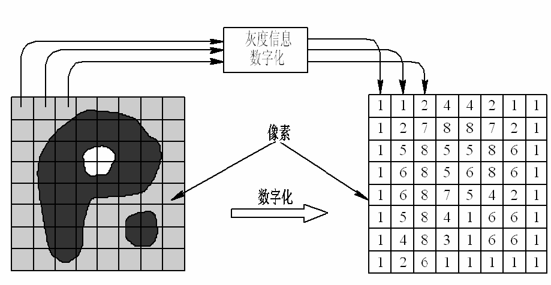


(3) 索引图像
索引颜色通常也称为映射颜色，在这种模式下，颜色都是预先定义的，

并且可供选用的一组颜色也很有限，索引颜色的图像最多只能显示256种颜
色。

一幅索引颜色图像在图像文件里定义，当打开该文件时，构成该图像
具体颜色的索引值就被读入程序里，然后根据索引值找到最终的颜色。

(4) RGB图像
一幅RGB图像就是彩色像素的一个M×N×3数组，其中每一个彩色相

似点都是在特定空间位置的彩色图像相对应的红、绿、蓝三个分量。按照惯
例，形成一幅RGB彩色图像的三个图像常称为红、绿或蓝分量图像。

令fR，fG和fB分别代表三种RGB分量图像。一幅RGB图像就利用
cat(级联)操作将这些分量图像组合成彩色图像：

```
                               rgb_image=cat(3,fR,fG,fB)
```
在操作中，图像按顺序放置。

2、数据类和图像类型间的转化
表1中列出了MATLAB和IPT为表示像素所支持的各种数据类。表中

的前8项称为数值数据类，第9项称为字符类，最后一项称为逻辑数据类。
工具箱中提供了执行必要缩放的函数(见表        2)。以在图像类和类型间进

行转化。
表1-1 MATLAB和IPT支持数据类型
名称                    描述

double   双精度浮点数，范围为         −10308−10308
uint8   无符号8比特整数，范围为[0     255]
```
                  uint16  无符号16比特整数，范围为[0     65536]
                  uint32  无符号32比特整数，范围为[0     4294967295]
```

```
                  int8    有符号8比特整数，范围为[-128    127]
                  int16   有符号16比特整数，范围为[-32768   32767]
                  int32   有符号   32 比特整数，范围为[-2147483648
                          2147483647]
```

single  单精度浮点数，范围为         −10308−10308
char    字符
logical  值为0或1

3

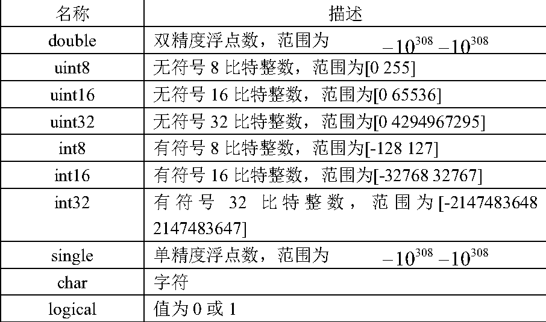


表1-2 格式转换函数
名称         将输入转化为        有效的输入图像数据类
im2uint8   uint8         logical,uint8,uint16和doulbe

im2uint16  uint16        logical,uint8,uint16和doulbe
```
              mat2gray   double,范围为[0 1] double
```
im2double  double        logical,uint8,uint16和doulbe
im2bw      logical       uint8,uint16和double


下面给出读取、压缩、显示一幅图像的程序(%后面的语句属于标
记语句，编程时可不用输入)
```
               I=imread(‘原图像名.tif’); % 读入原图像,tif格式
```
whos I           % 显示图像I的基本信息

imshow(I)       % 显示图像

% 这种格式知识用于jpg格式，压缩存储图像，q是0-100之间的整数
```
               imfinfo filename imwrite(I,'filename.jpg','quality',q);
               imwrite(I,'filename.bmp'); % 以位图（BMP）的格式存储图像
```


% 显示多幅图像，其中n为图形窗口的号数
```
               figure(n), imshow('filename');
               gg=im2bw('filename'); % 将图像转为二值图像
```
figure, imshow(gg)  % 显示二值图像


三、实验内容及步骤

1．利用imread( )函数读取一幅图像，假设其名为flower.tif，存入一个
数组中；

2．利用whos 命令提取该读入图像flower.tif的基本信息；
3．利用imshow()函数来显示这幅图像；

4．利用 imfinfo 函数来获取图像文件的压缩，颜色等等其他的详细信
息；

5．利用imwrite()函数来压缩这幅图象，将其保存为一幅压缩了像素的
jpg文件,设为flower.jpg；语法：imwrite(原图像，新图像，‘quality’,q), q取

0-100。

4

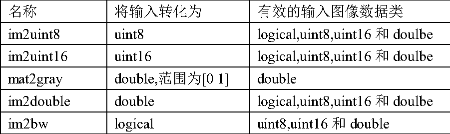


6．同样利用imwrite()函数将最初读入的tif图象另存为一幅bmp图像，
设为flower.bmp。

7．用imread()读入图像：Lenna.jpg 和camema.jpg；
8．用imfinfo()获取图像Lenna.jpg和camema.jpg 的大小；

9．用figure,imshow()分别将Lenna.jpg和camema.jpg 显示出来，观察
两幅图像的质量。

10．用 im2bw 将一幅灰度图像转化为二值图像，并且用       imshow 显示
出来观察图像的特征。

11．将每一步的函数执行语句拷贝下来，写入实验报告，并且将得到
第3、9、10步得到的图像效果拷贝下来。

四、考核要点

1、熟悉在MATLAB中如何读入图像、如何获取图像文件的相关信息、

如何显示图像及保存图像等，熟悉相关的处理函数。
2、明确不同的图像文件格式，由于其具体的图像存储方式不同，所以

文件的大小不同，因此当对同一幅图像来说，有相同的文件大小时，质量不
同。

五、实验仪器与软件

(1) PC计算机

(2) MatLab软件/语言包括图像处理工具箱(Image Processing Toolbox)
(3) 实验所需要的图片

六、实验报告要求

描述实验的基本步骤，用数据和图片给出各个步骤中取得的实验结果和

源代码，并进行必要的讨论，必须包括原始图像及其计算/处理后的图像。
七、思考题


(1) 简述MatLab软件的特点。
(2) MatLab软件可以支持哪些图像文件格式？

(3) 说明函数imread 的用途格式以及各种格式所得到图像的性质。
(4) 为什么用 I = imread(‘lena.bmp’) 命令得到的图像 I 不可以进行算
5


术运算？

八、实验图像


Fig.1 flower.tif         Fig.2 elephant.jpg


Fig.3 Lenna.jpg            Fig.4 camema.jpg


6


实验二     图像增强—空域滤波


一、   实验目的

进一步了解MatLab软件/语言，学会使用MatLab对图像作滤波处理，
使学生有机会掌握滤波算法，体会滤波效果。

了解几种不同滤波方式的使用和使用的场合，培养处理实际图像的能
力，并为课堂教学提供配套的实践机会。

二、实验要求

(1)学生应当完成对于给定图像+噪声，使用平均滤波器、中值滤波器对

不同强度的高斯噪声和椒盐噪声，进行滤波处理；能够正确地评价处理的结
果；能够从理论上作出合理的解释。

(2)利用MATLAB软件实现空域滤波的程序：
```
               I=imread('electric.tif');
               J = imnoise(I,'gauss',0.02); %添加高斯噪声
               J = imnoise(I,'salt & pepper',0.02); (注意空格) %添加椒盐噪声
```

```
               ave1=fspecial('average',3); %产生3×3的均值模版
               ave2=fspecial('average',5); %产生5×5的均值模版
               K = filter2(ave1,J)/255; %均值滤波3×3
               L = filter2(ave2,J)/255; %均值滤波5×5
               M = medfilt2(J,[3 3]); %中值滤波3×3模板
```

```
               N = medfilt2(J,[4 4]); %中值滤波4×4模板
               imshow(I);
               figure,imshow(J);
               figure,imshow(K);
               figure,imshow(L);
```

```
               figure,imshow(M);
               figure,imshow(N);
```
三、实验设备与软件

(1) IBM-PC计算机系统

(2) MatLab软件/语言包括图像处理工具箱(Image Processing Toolbox)
(3) 实验所需要的图片

7


四、实验内容与步骤

a) 调入并显示原始图像Sample2-1.jpg 。

b) 利用imnoise 命令在图像Sample2-1.jpg 上加入高斯(gaussian) 噪声
c)利用预定义函数fspecial 命令产生平均(average)滤波器


8
 −
−
−
1
1
1
−
9
−
1
1
−
−
−
1
1
1

d）分别采用3x3和5x5的模板，分别用平均滤波器以及中值滤波器，
对加入噪声的图像进行处理并观察不同噪声水平下，上述滤波器处理的结
果；
e）选择不同大小的模板，对加入某一固定噪声水平噪声的图像进行处
理，观察上述滤波器处理的结果。
f）利用  imnoise 命令在图像 Sample2-1.jpg 上加入椒盐噪声(salt &
pepper)
g）重复c)~ e）的步骤
h）输出全部结果并进行讨论。
五、思考题/问答题
(1) 简述高斯噪声和椒盐噪声的特点。
(2) 结合实验内容，定性评价平均滤波器/中值滤波器对高斯噪声和椒
盐噪声的去噪效果？
(3) 结合实验内容，定性评价滤波窗口对去噪效果的影响？
六、实验报告要求
描述实验的基本步骤，用数据和图片给出各个步骤中取得的实验结果，
并进行必要的讨论，必须包括原始图像及其计算/处理后的图像。
七、实验图像


electric.tif（原始图像）


9


实验三     图像增强—频域滤波


一、   实验目的

1．掌握怎样利用傅立叶变换进行频域滤波
2．掌握频域滤波的概念及方法

3．熟练掌握频域空间的各类滤波器
4．利用MATLAB程序进行频域滤波

二、   实验原理及知识点

频域滤波分为低通滤波和高通滤波两类，对应的滤波器分别为低通滤波
器和高通滤波器。频域低通过滤的基本思想：

```
                        G(u,v)=F(u,v)H(u,v)
```
F(u,v)是需要钝化图像的傅立叶变换形式，H(u,v)是选取的一个低通过
滤器变换函数，G(u,v)是通过H(u,v)减少F(u,v)的高频部分来得到的结果，

运用傅立叶逆变换得到钝化后的图像。
理想地通滤波器(ILPF)具有传递函数：


10
```
                            H ( u , v ) =
```
 1
0
i
i
f
f
D
D
(
(
u
u
,
,
v
v
)
)


D
D
0
0
其中，D   为指定的非负数，
0
D ( u , v ) 为(u,v)到滤波器的中心的距离。
```
             D ( u , v ) = D
```
0
的点的轨迹为一个圆。
n 阶巴特沃兹低通滤波器(BLPF)(在距离原点     D
0
处出现截至频率)的传
递函数为   H ( u , v ) =
```
                         1 + [ D ( u ,
```
1
v ) D
0
```
                                    ] 2 n
```
与理想地通滤波器不同的是，巴特
沃兹率通滤波器的传递函数并不是在
D
0 处突然不连续。
高斯低通滤波器(GLPF)的传递函数为
```
                 ( , )   2 ( , ) 2 2  H u v = e D u v
```

其中，   为标准差。
相应的高通滤波器也包括：理想高通滤波器、n阶巴特沃兹高通滤波器、
高斯高通滤波器。给定一个低通滤波器的传递函数H            (u,v)，通过使用如
lp


下的简单关系，可以获得相应高通滤波器的传递函数：H             =1−H  (u,v)
hp    lp
利用MATLAB实现频域滤波的程序
```
               f=imread('room.tif');
               F=fft2(f);   %对图像进行傅立叶变换
```

%对变换后图像进行队数变化，并对其坐标平移，使其中心化

```
               S=fftshift(log(1+abs(F)));
               S=gscale(S);   %将频谱图像标度在0-256的范围内
```
imshow(S)     %显示频谱图像
```
               h=fspecial('sobel'); %产生空间‘sobel’模版
```
freqz2(h)     %查看相应频域滤波器的图像

```
               PQ=paddedsize(size(f)); %产生滤波时所需大小的矩阵
               H=freqz2(h,PQ(1),PQ(2)); %产生频域中的‘sobel’滤波器
               H1=ifftshift(H); %重排数据序列，使得原点位于频率矩阵的左上角
               imshow(abs(H),[]) %以图形形式显示滤波器
               figure,imshow(abs(H1),[])
```

```
               gs=imfilter(double(f),h); %用模版h进行空域滤波
               gf=dftfilt(f,H1); %用滤波器对图像进行频域滤波
               figure,imshow(gs,[])
               figure,imshow(gf,[])
               figure,imshow(abs(gs),[])
```

```
               figure,imshow(abs(gf),[])
```

```
               f=imread('number.tif'); %读取图片
               PQ=paddedsize(size(f)); %产生滤波时所需大小的矩阵
               D0=0.05*PQ(1); %设定高斯高通滤波器的阈值
```

```
               H=hpfilter('gaussian',PQ(1),PQ(2),D0); %产生高斯高通滤波器
               g=dftfilt(f,H);       %对图像进行滤波
```
figure,imshow(f)      %显示原图像
```
               figure,imshow(g,[])   %显示滤波后图像
```

三、   实验步骤：

1．调入并显示所需的图片；
2．利用  MATLAB 提供的低通滤波器实现图像信号的滤波运算，并与

空间滤波进行比较。
3．利用MATLAB提供的高通滤波器对图像进行处理。

11


4．记录和整理实验报告。

四、实验仪器

1．计算机；
2．MATLAB程序；

3．移动式存储器（软盘、U盘等）。
4．记录用的笔、纸。

五、实验报告内容

1．叙述实验过程；

2．提交实验的原始图像和结果图像。
六、实验报告要求


描述实验的基本步骤，用数据和图片给出各个步骤中取得的实验结果，
并进行必要的讨论，必须包括原始图像及其计算/处理后的图像。

七、思考题

1．结合实验，评价频域滤波有哪些优点？
2．在频域滤波过程中需要注意哪些事项？

八、实验图片


room.tif                  number.tif


12


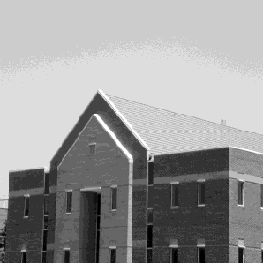


实验四      彩色图像处理


一、实验目的

􀂄  使用MatLab 软件对图像进行彩色处理。使学生通过实验熟悉使用
MatLab软件进行图像彩色处理的有关方法，并体会到图像彩色处理技术以及

对图像处理的效果。

二、实验要求

􀂄要求学生能够完成彩色图像的分析，能正确讨论彩色图像的亮度、色调
等性质；会对彩色图像进行直方图均衡，并能正确解释均衡处理后的结果；

能够对单色图像进行伪彩色处理、利用多波长图像进行假彩色合成、进行单
色图像的彩色变换。

三、实验内容与步骤

(1) 彩色图像的分析
􀂄  调入并显示彩色图像flower1.tif  ；
􀂄  拆分这幅图像，并分别显示其R，G，B分量；

􀂄  根据各个分量图像的情况讨论该彩色图像的亮度、色调等性质。
(2) 彩色图像的直方图均衡
􀂄  接内容(1)；
􀂄  显示这幅图像的R，G，B分量的直方图，分别进行直方图均衡处理，并

显示均衡后的直方图和直方图均衡处理后的各分量；
􀂄  将处理完毕的各个分量合成彩色图像并显示其结果；
􀂄  观察处理前后图像的彩色、亮度、色调等性质的变化。

(3) 假彩色处理
􀂄  调入并显示红色可见光的灰度图像vl_red.jpg、绿色可见光的灰度图像
vl_green.jpg和蓝色可见光的灰度图像vl_blue.jpg；以及近红外灰度图像

infer_near.jpg和中红外灰度图像infer_mid.jpg；
􀂄  以图像vl_red.jpg为R；图像vl_green.jpg为G；图像vl_blue.jpg为B，
将这三幅图像组合成可见光RGB彩色图像；

􀂄  分别以近红外图像infer_near.jpg和中红外图像infer_mid替换R分量，
形成假彩色图像；
􀂄  观察处理的结果，注意不同波长红外线图像组成图像的不同结果
13


(4) 伪彩色处理1：灰度切片处理
􀂄  调入并显示灰度图像head.jpg；
􀂄  利用MATLAB提供的函数对图像在8~256级的范围内进行切片处理，并使

用hot模式和cool模式进行彩色化；
􀂄  观察处理的结果。
(5) 彩色变换(选做)

􀂄  调入并显示灰度图像Lenna.jpg；
􀂄  使用不同相位的正弦函数作为变换函数，将灰度图像变换为RGB图像。
```
            其中红色分量R的变换函数为-sin(     )，绿色分量G的变换函数为-cos(    );，
```
蓝色分量B的变换函数为sin(    )；

􀂄  显示变换曲线及变换合成的彩色图像并观察彩色变换图像的色调与原
始图像灰度之间的关系；
􀂄  将RGB的变换公式至少互换一次(例如R与G互换)，显示变换曲线、变换

结果并观察处理的结果。
(6)打印全部结果并进行讨论。
利用MATLAB软件实现彩色图像处理的程序：

```
               rgb_image=imread('flower1.tif'); %读取图像flower1.tif
               fR=rgb_image(:,:,1); %获取图像的红色分量
               fG=rgb_image(:,:,2); %获取图像的绿色分量
               fB=rgb_image(:,:,3); %获取图像的蓝色分量
```

figure(1),imshow(fR) %分别显示图像
```
               figure(2),imshow(fG)
               figure(3),imshow(fB)
```

%实现rgb图像转化为NTSC彩色空间的图像

```
               yiq_image=rgb2ntsc(rgb_image);
               fY=yiq_image(:,:,1); %图像flower1.tif的亮度
               fI=yiq_image(:,:,2); %图像flower1.tif的色调
               fQ=yiq_image(:,:,3); %图像flower1.tif的饱和度
               figure(4),imshow(fY)
```

```
               figure(5),imshow(fI)
               figure(6),imshow(fQ)
```

```
               fR=histeq(fR,256); %对彩色图像的分量进行直方图均衡化
               fG=histeq(fG,256);
```

```
               fB=histeq(fB,256);
```
14


```
               RGB_image=cat(3,fR,fG,fB); %将直方图均衡化后的彩色图像合并
```
figure,imshow(RGB_image) %观察处理后的彩色图色度，亮度参照前面
```
               f1=imread('v1_red.jpg');
               f2=imread('v1_green.jpg');
```

```
               f3=imread('v1_blue.jpg');
               f4=imread('infer_near.jpg');
               ture_color=cat(3,f1,f2,f3);
```
figure,imshow(ture_color) %显示由红、绿、蓝三幅图合成的彩色图
```
               false_color=cat(3,f4,f2,f3); %用近红外图像代替R分量
```

figure,imshow(false_color) %显示由近红外、绿、蓝三幅图合成的假彩色图

```
               f=imread('head.jpg');
               cut_1=imadjust(f,[0.0925 0.5],[0.0925 0.5]);%提取灰度在16-128之间的像素
               cut_2=imadjust(f,[0.5 1],[0.5 1]); %提取灰度在128-256之间的像素
```

figure,imshow(cut_1),colormap(hot) %显示图像cut_1,并使用hot模型彩色化
figure,imshow(cut_2),colormap(cool) %显示图像cut_2,并使用cool模型彩色化
(选做)
```
               f=imread('Lenna.jpg');
               g=ice('image',f); %通过ice(交互彩色编辑)函数对图像进行变换
```

ice(交互彩色编辑)函数的参数参照书后面的注释。
四、实验仪器与软件

1．计算机；

2．MATLAB程序；
3．移动式存储器（软盘、U盘等）。

4．记录用的笔、纸。

五、实验报告要求

1．叙述实验过程；
2．提交实验的原始图像和结果图像。

六、思考题

1. 为什么经彩色直方图均衡后的图像除了对比度会有所增强外，还有

色调的变化？
2. 实验内容(3)的假彩色处理方案是否可以有多种？若有，请估计其它

15


方案的可能结果。
3. 在实验内容(4)中，对于灰度切片处理的图像head.gif     使用多少级

切片比较合适？

七、实验图片


16

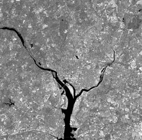


实验五      形态学图像处理


一、实验目的

学习常见的数学形态学运算基本方法，了解腐蚀、膨胀、开运算、闭

运算取得的效果，培养处理实际图像的能力，并为课堂教学提供配套的实践
机会。

二、实验要求

利用MatLab工具箱中关于数学形态学运算的函数，计算本指导书中指

定二值图像进行处理。
三、实验设备与软件


1. LC-PC计算机系统
2. MatLab软件/语言包括图像处理工具箱(Image  Processing Toolbox)

3. 实验所需要的图片
四、实验内容与步骤


1. 调入并显示图像Plane2.jpg；
2. 选取合适的阈值，得到二值化图像Plane2-2.jpg；

3. 设置结构元素；
4. 对得到的二值图像Plane2-2.jpg进行腐蚀运算；

5. 对得到的二值图像Plane2-2.jpg进行膨胀运算；
6. 对得到的二值图像Plane2-2.jpg进行开运算；

7. 对得到的二值图像Plane2-2.jpg进行闭运算；
8. 将两种处理方法的结果作比较；

五、思考题/问答题

1. 结合实验内容，评价腐蚀运算与膨胀运算的效果。

2. 结合实验内容，评价开运算与闭运算的效果。
17


3. 腐蚀、膨胀、开、闭运算的适用条件是什么？

4. 除了形态学方法用其他方法如何实现图像分割？

5. 图像预处理的作用是什么？

六、实验报告要求

描述实验的基本步骤，用数据和图片给出各个步骤中取得的实验结果，
并进行必要的讨论，必须包括原始图像及其计算/处理后的图像。

七、实验图像


Plane2.jpg

八、源代码

```
            I=imread('Plane2.jpg');
```

```
            level = graythresh(I); %得到合适的阈值
```

```
            bw = im2bw(I,level);   %二值化
```

```
            SE = strel('square',3); %设置膨胀结构元素
            BW1 = imdilate(bw,SE); %膨胀
```


```
            SE1 = strel('arbitrary',eye(5)); %设置腐蚀结构元素
            BW2 = imerode(bw,SE1);  %腐蚀
```

```
            BW3 = bwmorph(bw, 'open'); %开运算
            BW4 = bwmorph(bw, 'close'); %闭运算
```


18


```
            imshow(I);
            figure,imshow(bw);
            figure,imshow(BW1);
            figure,imshow(BW2);
```

```
            figure,imshow(BW3);
            figure,imshow(BW4);
```


19


实验六      图像的代数运算（选做）


一、   实验目的

1．了解图像的算术运算在数字图像处理中的初步应用。
2．体会图像算术运算处理的过程和处理前后图像的变化。

二、   实验原理

图像的代数运算是图像的标准算术操作的实现方法，是两幅输入图像
之间进行的点对点的加、减、乘、除运算后得到输出图像的过程。如果输入
图像为A(x,y)和B(x,y)，输出图像为C(x,y)，则图像的代数运算有如下四种形

式：
```
                   C(x,y) = A(x,y) + B(x,y) C(x,y) = A(x,y) - B(x,y)
                   C(x,y) = A(x,y) * B(x,y) C(x,y) = A(x,y) / B(x,y)
```
图像的代数运算在图像处理中有着广泛的应用，它除了可以实现自身

所需的算术操作，还能为许多复杂的图像处理提供准备。例如，图像减法就
可以用来检测同一场景或物体生产的两幅或多幅图像的误差。
使用MATLAB的基本算术符(+、-、*、/   等)可以执行图像的算术操作，
但是在此之前必须将图像转换为适合进行基本操作的双精度类型。为了更方

便地对图像进行操作，MATLAB图像处理工具箱包含了一个能够实现所有
非稀疏数值数据的算术操作的函数集合。下表列举了所有图像处理工具箱中
的图像代数运算函数。

表6-1 图像处理工具箱中的代数运算函数
函数名                 功能描述
Imabsdiff  两幅图像的绝对差值

Imadd      两幅图像的加法
Imcomplement 补足一幅图像
Imdivide   两幅图像的除法

Imlincomb  计算两幅图像的线性组合
Immultiply 两幅图像的乘法
imsubtract 两幅图像的减法


使用图像处理工具箱中的图像代数运算函数无需再进行数据类型间的
转换，这些函数能够接受uint8和uint16数据，并返回相同格式的图像结果。

20

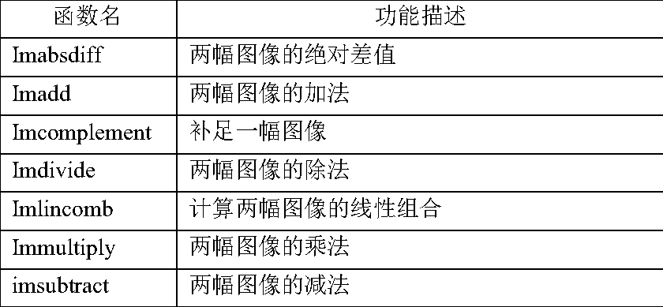


虽然在函数执行过程中元素是以双精度进行计算的，但是MATLAB工作平
台并不会将图像转换为双精度类型。
代数运算的结果很容易超出数据类型允许的范围。例如，uint8数据能
够存储的最大数值是255，各种代数运算尤其是乘法运算的结果很容易超过

这个数值，有时代数操作（主要是除法运算）也会产生不能用整数描述的分
数结果。图像的代数运算函数使用以下截取规则使运算结果符合数据范围的
要求：超出数据范围的整型数据将被截取为数据范围的极值，分数结果将被

四舍五入。例如，如果数据类型是uint8，那么大于255的结果（包括无穷大
inf）将被设置为255。
注意：无论进行哪一种代数运算都要保证两幅输入图像的大小相等，

且类型相同。
三、   实验步骤


1．图像的加法运算

图像相加一般用于对同一场景的多幅图像求平均效果，以便有效地降
低具有叠加性质的随机噪声。直接采集的图像品质一般都较好，不需要进行
加法运算处理，但是对于那些经过长距离模拟通讯方式传送的图像（如卫星

图像），这种处理是必不可少的。
在MATLAB中，如果要进行两幅图像的加法，或者给一幅图像加上一
个常数，可以调用imadd函数来实现。imadd函数将某一幅输入图像的每一个

像素值与另一幅图像相应的像素值相加，返回相应的像素值之和作为输出图
像。imadd函数的调用格式如下：
```
                Z = imadd（X，Y）
```

其中，X和Y表示需要相加的两幅图像，返回值Z表示得到的加法操作结果。
图像加法在图像处理中应用非常广泛。例如，以下代码使用加法操作将图2.1
中的(a)、(b)两幅图像叠加在一起：

```
                I = imread(‘rice.tif’)；
                J = imread(‘cameraman.tif’)；
                K = imadd(I,J)；
```
imshow(K)；

叠加结果如图2.2所示。


21


图2.1 待叠加的两幅图像


图2.2 叠加后的图像效果
给图像的每一个像素加上一个常数可以使图像的亮度增加。例如，以

下代码将增加图3(a)所示的RGB图像的亮度，加亮后的结果如图3(b)所示。
```
                RGB = imread(‘flower.tif’)；
                RGB2 = imadd(RGB,50)；
```

subplot(1,2,1)；imshow(RGB)；
subplot(1,2,2)；imshow(RGB2)；


加50                        减50


22


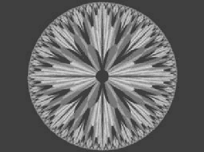

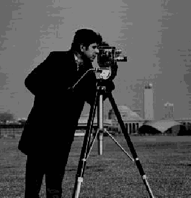
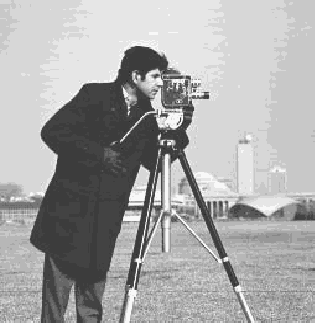


原图


加50                          减50
图2.3 亮度增加与变暗
两幅图像的像素值相加时产生的结果很可能超过图像数据类型所支持
的最大值，尤其对于uint8类型的图像，溢出情况最为常见。当数据值发生溢

出时，imadd函数将数据截取为数据类型所支持的最大值，这种截取效果称
之为饱和。为了避免出现饱和现象，在进行加法计算前最好将图像转换为一
种数据范围较宽的数据类型。例如，在加法操作前将uint8图像转换为uint16

类型。
2．图像的减法运算

图像减法也称为差分方法，是一种常用于检测图像变化及运动物体的

图像处理方法。图像减法可以作为许多图像处理工作的准备步骤。例如，可
以使用图像减法来检测一系列相同场景图像的差异。图像减法与阈值化处理
的综合使用往往是建立机器视觉系统最有效的方法之一。在利用图像减法处

理图像时往往需要考虑背景的更新机制，尽量补偿由于天气、光照等因素对
图像显示效果造成的影响。
在MATLAB中，使用imsubtract函数可以将一幅图像从另一幅图像中减

去，或者从一幅图像中减去一个常数。imsubtract函数将一幅输入图像的像
素值从另一幅输入图像相应的像素值中减去，再将这个结果作为输出图像相
应的像素值。imsubtract函数的调用格式如下：

23


```
                Z = imsubtract(X,Y)；
```
其中，Z是X-Y操作的结果。以下代码首先根据原始图像（如图2.4(a)所示）
生成其背景亮度图像，然后再从原始图像中将背景亮度图像减去，从而生成

图2.4(b)所示的图像：
```
                rice = imread(‘rice.tif’)；
                background = (rice, strel(‘disk’,15))；
```

```
                rice2 = imsubtract(rice, background)；
```
subplot(1,2,1)；imshow(rice)；
subplot(1,2,2)；imshow(rice2)；


图2.4 原始图像、减去背景图像
如果希望从图像数据I的每一个像素减去一个常数，可以将上述调用格
式中的Y替换为一个指定的常数值，例如：

```
                Z = imsubtract(I,50)；
```
减法操作有时会导致某些像素值变为一个负数，对于uint8或uint16类型
的数据，如果发生这种情况，那么imsubtract函数自动将这些负数截取为0。
为了避免差值产生负值，同时避免像素值运算结果之间产生差异，可以调用

函数imabsdiff。imabsdiff将计算两幅图像相应像素差值的绝对值，因而返回
结果不会产生负数。该函数的调用格式与imsubtract函数类似。

3. 图像的乘法运算

两幅图像进行乘法运算可以实现掩模操作，即屏蔽掉图像的某些部分。
一幅图像乘以一个常数通常被称为缩放，这是一种常见的图像处理操作。如

果使用的缩放因子大于1，那么将增强图像的亮度，如果因子小于1则会使图
像变暗。缩放通常将产生比简单添加像素偏移量自然得多的明暗效果，这是
因为这种操作能够更好地维持图像的相关对比度。此外，由于时域的卷积或

24

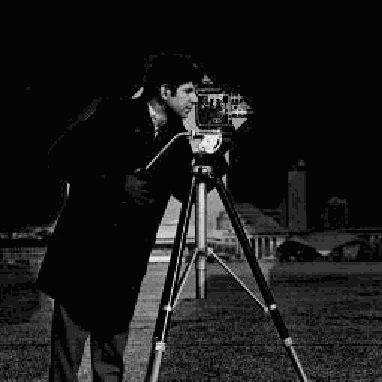
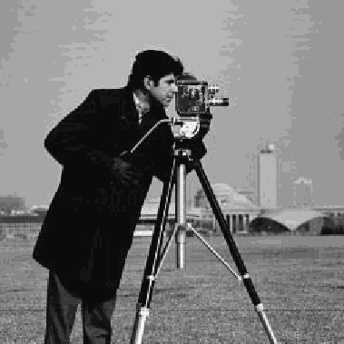


相关运算与频域的乘积运算对应，因此乘法运算有时也被作为一种技巧来实
现卷积或相关处理。
在MATLAB中，使用immultiply函数实现两幅图像的乘法。immultiply

函数将两幅图像相应的像素值进行元素对元素的乘法操作（MATLAB点
乘），并将乘法的运算结果作为输出图形相应的像素值。immulitply函数的
调用格式如下：

```
                Z = immulitply(X,Y)
```
其中，Z=X*Y。例如，以下代码将使用给定的缩放因子对图2.5(a)所示的图
像进行缩放，从而得到如图2.5(b)所示的较为明亮的图像：
```
                I = imread(‘moon.tif’)；
```

```
                J = immultiply(I,1.2)；
```
subplot(1,2,1)；imshow(I)；
subplot(1,2,2)；imshow(J)；


图2.5 原图和乘以因子1.5 的图像
uint8图像的乘法操作一般都会发生溢出现象。Immultiply函数将溢出的

数据截取为数据类型的最大值。为了避免产生溢出现象，可以在执行乘法操
作之前将uint8图像转换为一种数据范围较大的图像类型，例如uint16。

4．图像的除法运算

除法运算可用于校正成像设备的非线性影响，这在特殊形态的图像（如
断层扫描等医学图像）处理中常常用到。图像除法也可以用来检测两幅图像
间的区别，但是除法操作给出的是相应像素值的变化比率，而不是每个像素

的绝对差异，因而图像除法也称为比率变换。
在MATLAB中使用imdivide函数进行两幅图像的除法。imdivide函数对
两幅输入图像的所有相应像素执行元素对元素的除法操作（点除），并将得

到的结果作为输出图像的相应像素值。imdivide函数的调用格式如下：
```
                Z = imdivide(X,Y)
```
其中，Z=X/Y。例如，以下代码将图4所示的两幅图像进行除法运算，

25

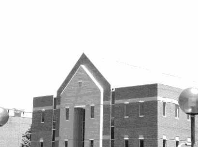
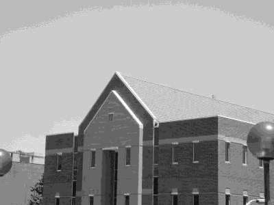


请将这个结果和减法操作的结果相比较，对比它们之间的不同之处：
```
                Rice = imread(‘rice.tif’)；
                I = double(rice)；
```

```
                J= I * 0.43 + 90；
                Rice2 = uint8(J)；
                Ip = imdivide(rice, rice2)；
```

```
                Imshow(Ip, [])；
```
除法操作的结果如图2.6所示。


图2.6 原图和减背景后的图像相除的图像效果
5．图像的四则代数运算

可以综合使用多种图像代数运算函数来完成一系列的操作。例如，使
用以下语句计算两幅图像的平均值：
```
                I = imread(‘rice.tif’)；
```

```
                I2 = imread(‘cameraman.tif’)；
                K = imdivide(imadd(I,I2),2)；
```
建议最好不要用这种方式进行图像操作，这是因为，对于uint8或uint16

数据，每一个算术函数在将其输出结果传递给下一项操作之前都要进行数据
截取，这个截取过程将会大大减少输出图像的信息量。执行图像四则运算操
作较好的一个办法就是使用函数imlincomb。函数imlincomb按照双精度执行

所有代数运算操作，而且仅对最好的输出结果进行截取，该函数的调用格式
如下：
```
                Z = imlincomb(A,X,B,Y,C)；
```
其中，Z=A*X+B*Y+C。MATLAB会自动根据输入参数的个数判断需要进行

的运算。例如，以下语句将计算Z=A*X+C：
```
                Z = imlincomb(A,X,C)
```
26

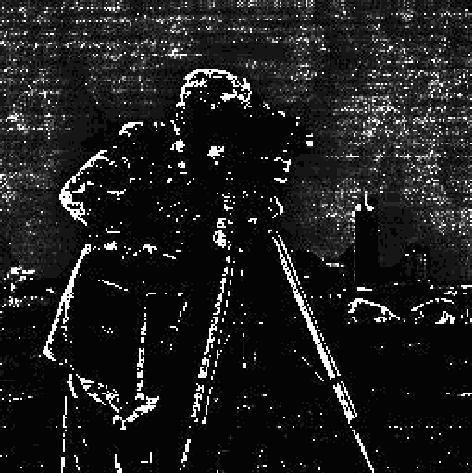


而以下语句将计算Z=A*X+B*Y：
```
                Z = imlincomb(A,X,B,Y,)
```

四、   实验报告要求

1 描述实验的基本步骤，用数据和图片给出各个步骤中取得的实验结
果并进行必要的讨论。
2 必须包括原始图像及其计算处理后的图像以及相应的解释。

五、    思考题

由图像算术运算的运算结果，思考图像减法运算在什么场合上发挥优
势？


27


实验七      图像增强—灰度变换（选做）


一、实验目的：

1、了解图像增强的目的及意义，加深对图像增强的感性认识，巩固所
学理论知识。

2、学会对图像直方图的分析。
3、掌握直接灰度变换的图像增强方法。

二、实验原理及知识点

术语‘空间域’指的是图像平面本身，在空间与内处理图像的方法是
直接对图像的像素进行处理。空间域处理方法分为两种：灰度级变换、空间
滤波。空间域技术直接对像素进行操作其表达式为

```
                            g(x,y)=T[f(x,y)]
```
其中f(x,y)为输入图像，g(x,y)为输出图像，T是对图像f进行处理的
操作符，定义在点(x,y)的指定领域内。

定义点(x,y)的空间邻近区域的主要方法是，使用中心位于(x,y)的正
方形或长方形区域，。此区域的中心从原点(如左上角)开始逐像素点移动，
在移动的同时，该区域会包含不同的领域。T应用于每个位置(x,y)，以便在
该位置得到输出图像g。在计算(x,y)处的g值时，只使用该领域的像素。

灰度变换T的最简单形式是使用领域大小为1×1，此时,(x,y)处的g值
仅由f在该点处的亮度决定，T也变为一个亮度或灰度级变化函数。当处理单
设(灰度)图像时，这两个术语可以互换。由于亮度变换函数仅取决于亮度的

值，而与(x,y)无关，所以亮度函数通常可写做如下所示的简单形式：
```
                                   s=T(r)
```
其中，r表示图像f中相应点(x,y)的亮度，s表示图像g中相应点(x,y)

的亮度。

三、实验内容：
1、图像数据读出
2、计算并分析图像直方图

3、利用直接灰度变换法对图像进行灰度变换
下面给出灰度变化的MATLAB程序
28


```
                   f=imread('medicine_pic.jpg');
                   g=imhist(f,256); %显示其直方图
                   g1=imadjust(f,[0 1],[1 0]); %灰度转换，实现明暗转换(负片图像)
                   figure,imshow(g1)
```


%将0.5到0.75的灰度级扩展到范围[0 1]
```
                   g2=imadjust(f,[0.5 0.75],[0 1]);
                   figure,imshow(g2)
                   g=imread('point.jpg');
```

```
                   h=log(1+double(g)); %对输入图像对数映射变换
                   h=mat2gray(h);   %将矩阵h转换为灰度图片
                   h=im2uint8(h);   %将灰度图转换为8位图
                   figure,imshow(h)
```

四、实验仪器

PC一台  ，MATLAB软件
五、实验图片


Fig.1 point.jpg             Fig.2 medicine_pic.jpg


29

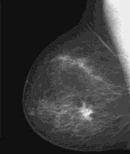
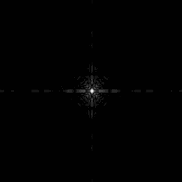


实验八      图像增强—直方图变换（选做）


一、    实验目的

1．掌握灰度直方图的概念及其计算方法；
2．熟练掌握直力图均衡化和直方图规定化的计算过程；

3．熟练掌握空域滤波中常用的平滑和锐化滤波器；
4．掌握色彩直方图的概念和计算方法
5．利用MATLAB程序进行图像增强。

二、    实验原理

图像增强是指按特定的需要突出一幅图像中的某些信息，同时，消弱
或去除某些不需要的信息的处理方法。其主要目的是处理后的图像对某些特

定的应用比原来的图像更加有效。图像增强技术主要有直方图修改处理、图
像平滑化处理、图像尖锐化处理和彩色处理技术等。本实验以直方图均衡化
增强图像对比度的方法为主要内容，其他方法同学们可以在课后自行联系。

直方图是多种空间城处理技术的基础。直方图操作能有效地用于图像
增强。除了提供有用的图像统计资料外，直方图固有的信息在其他图像处理
应用中也是非常有用的，如图像压缩与分割。直方图在软件中易于计算，也
适用于商用硬件设备，因此，它们成为了实时图像处理的一个流行工具。

直方图是图像的最基本的统计特征，它反映的是图像的灰度值的分布
情况。直方图均衡化的目的是使图像在整个灰度值动态变化范围内的分布均
匀化，改善图像的亮度分布状态，增强图像的视觉效果。灰度直方图是图像

预处理中涉及最广泛的基本概念之一。
图像的直方图事实上就是图像的亮度分布的概率密度函数，是一幅图
像的所有象素集合的最基本的统计规律。直方图反映了图像的明暗分布规

律，可以通过图像变换进行直方图调整，获得较好的视觉效果。
直方图均衡化是通过灰度变换将一幅图像转换为另一幅具有均衡直方
图，即在每个灰度级上都具有相同的象素点数的过程。

下面给出直方图均衡化增强图像对比度的MATLAB程序：
```
               I=imread(‘pollen.jpg); % 读入原图像
               J=histeq(I);  %对原图像进行直方图均衡化处理
```

30


```
               imshow(I);    %显示原图像
               title(‘原图像’); %给原图像加标题名
```
%对原图像进行屏幕控制；显示直方图均衡化后的图像
```
               figure；imshow(J);
```

%给直方图均衡化后的图像加标题名
```
               title(‘直方图均衡化后的图像’) ;
```
%对直方图均衡化后图像进行屏幕控制；作一幅子图，并排两幅图的第1幅
```
               figure; subplot(1,2,1) ;
               imhist(I,64);    %将原图像直方图显示为64级灰度
```

```
               title(‘原图像直方图’) ; %给原图像直方图加标题名
               subplot(1,2,2);  %作第2幅子图
               imhist(J,64) ;   %将均衡化后图像的直方图显示为64级灰度
               title(‘均衡变换后的直方图’) ; %给均衡化后图像直方图加标题名
```
处理后的图像直方图分布更均匀了，图像在每个灰度级上都有像素点。

从处理前后的图像可以看出，许多在原始图像中看不清楚的细节在直方图均
衡化处理后所得到的图像中都变得十分清晰。

三、    实验步骤

1打开计算机，启动MATLAB程序；程序组中“work”文件夹中应有待
处理的图像文件；
2调入“实验一”中获取的数字图像，并进行计算机均衡化处理；

3显示原图像的直方图和经过均衡化处理过的图像直方图。
4记录和整理实验报告

四、    实验仪器

1．计算机；                   2．MATLAB程序；
3．移动式存储器（软盘、U盘等）；        4．记录用的笔、纸。

五、    实验报告内容

1．叙述实验过程；
2．提交实验的原始图像和结果图像。

六、    思考题

1．直方图是什么概念？它反映了图像的什么信息？
2．直方图均衡化是什么意思？它的主要用途是什么？


31


七、    实验图片


Fig.1 pollen.jpg


32

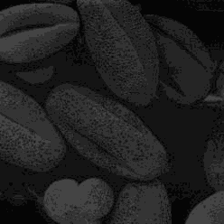


实验九     图像的傅立叶变换（选做）


一、    实验目的

1了解图像变换的意义和手段；

2熟悉傅立叶变换的基本性质；
3熟练掌握FFT变换方法及应用；

4通过实验了解二维频谱的分布特点；
5通过本实验掌握利用MATLAB编程实现数字图像的傅立叶变换。

6评价人眼对图像幅频特性和相频特性的敏感度。

二、    实验原理

1 应用傅立叶变换进行图像处理
傅里叶变换是线性系统分析的一个有力工具，它能够定量地分析诸如数

字化系统、采样点、电子放大器、卷积滤波器、噪音和显示点等的作用。通
过实验培养这项技能，将有助于解决大多数图像处理问题。对任何想在工作

中有效应用数字图像处理技术的人来说，把时间用在学习和掌握博里叶变换
上是很有必要的。

2 傅立叶（Fourier）变换的定义
对于二维信号，二维Fourier变换定义为：

 
```
                          F(u,v)=   f(x,y)e−j2(ux+uy)dxdy
```
−−
逆变换：


33
```
                          f ( x , y ) F ( u , v ) e j2 (u x u y )d u d v  =
```
−

−

+
二维离散傅立叶变换为：
1 N−1N−1   −j2(m i +n k )
```
                         F(m,n)=    f(i,k)e N N
```
N
```
                                  i=0 k=0
```


逆变换：

1 N−1N−1   j2(m i +n k )
```
                          f(i,k)= F(m,n)e   N N
```
N
```
                                 m=0n=0
```
图像的傅立叶变换与一维信号的傅立叶变换变换一样，有快速算法，具
体参见参考书目，有关傅立叶变换的快速算法的程序不难找到。实际上，现
在有实现傅立叶变换的芯片，可以实时实现傅立叶变换。
3利用MATLAB软件实现数字图像傅立叶变换的程序：

```
               I=imread(‘原图像名.gif’); %读入原图像文件
```

```
               imshow(I);        %显示原图像
               fftI=fft2(I);     %二维离散傅立叶变换
```

```
               sfftI=fftshift(fftI); %直流分量移到频谱中心
               RR=real(sfftI);   %取傅立叶变换的实部
```

```
               II=imag(sfftI);   %取傅立叶变换的虚部
               A=sqrt(RR.^2+II.^2); %计算频谱幅值
               A=（A-min(min(A))）/(max(max(A))-min(min(A)))*225 %归一化
```

```
               figure;           %设定窗口
```

```
               imshow(A);        %显示原图像的频谱
```
三、    实验步骤


1．将图像内容读入内存；
2．用Fourier变换算法，对图像作二维Fourier变换；

3．将其幅度谱进行搬移，在图像中心显示；

4．用Fourier系数的幅度进行Fourier反变换；

5．用Fourier系数的相位进行Fourier反变换；

6．比较4、5的结果，评价人眼对图像幅频特性和相频特性的敏感度。
7．记录和整理实验报告。

四、    实验仪器

1．计算机；

34


2 ．MATLAB程序；
3．移动式存储器（软盘、U盘等）。

4．记录用的笔、纸。

五、    实验报告内容

1．叙述实验过程；
2．提交实验的原始图像和结果图像。

六、    思考题

1．傅里叶变换有哪些重要的性质?

2．图像的二维频谱在显示和处理时应注意什么?
七、实验图片


number.tif


35


实验十      图像分割（选做）


一、实验目的

􀂄  使用MatLab 软件进行图像的分割。使学生通过实验体会一些主要的分

割算子对图像处理的效果，以及各种因素对分割效果的影响。

二、实验要求

􀂄  要求学生能够自行评价各主要算子在无噪声条件下和噪声条件下
的分割性能。能够掌握分割条件(阈值等)的选择。完成规定图像的处理并要

求正确评价处理结果，能够从理论上作出合理的解释。
三、实验内容与步骤


(1)使用Roberts 算子的图像分割实验
􀂄 调入并显示图像    room.tif 中图像；使用 Roberts 算子对图像进行

边缘检测处理；    Roberts 算子为一对模板：


```
               􀂄 相应的矩阵为：rh    = [0 1；-1 0]； rv = [1 0；0 -1]；这里的
```
rh 为水平 Roberts 算子，rv 为垂直 Roberts 算子。分别显示处理后的水

平边界和垂直边界检测结果；用“欧几里德距离”和“街区距离”方式计算
梯度的模，并显示检测结果；对于检测结果进行二值化处理，并显示处理结

果；
提示：先做检测结果的直方图，参考直方图中灰度的分布尝试确定阈

值；应反复调节阈值的大小，直至二值化的效果最为满意为止。分别显示处
理后的水平边界和垂直边界检测结果；将处理结果转化为“白底黑线条”的

方式；给图像加上零均值的高斯噪声；对于噪声图像重复步骤b~f。
(2)使用Prewitt 算子的图像分割实验

􀂄 使用Prewitt 算子进行内容(1)中的全部步骤。
36

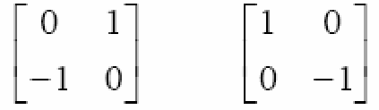


(3)使用Sobel 算子的图像分割实验
使用Sobel 算子进行内容(1)中的全部步骤。

(4)使用LoG (拉普拉斯-高斯)算子的图像分割实验
使用LoG (拉普拉斯-高斯)算子进行内容(1)中的全部步骤。提示1：

处理后可以直接显示处理结果，无须另外计算梯度的模。提示2：注意调节
噪声的强度以及LoG    (拉普拉斯-高斯)算子的参数，观察处理结果。

(5) 打印全部结果并进行讨论。
下面是使用sobel监测器对图像进行分割的MATLAB程序

```
               f=imread('room.tif');
               [gv,t1]=edge(f,'sobel','vertical');%使用edge函数对图像f提取垂直的边缘
               imshow(gv)
               [gb,t2]=edge(f,'sobel','horizontal');%使用edge函数对图像f提取垂直的边缘
```

```
               figure,imshow(gb)
               w45=[-2 -1 0;-1 0 1;0 1 2];%指定模版使用imfilter计算45度方向的边缘
               g45=imfilter(double(f),w45,'replicate');
               T=0.3*max(abs(g45(:))); %设定阈值
               g45=g45>=T;   %进行阈值处理
```

```
               figure,imshow(g45);
```
在函数中使用'prewitt'和'roberts'的过程，类似于使用sobel边缘检
测器的过程。

四、实验设备及软件

1．计算机；

2．MATLAB程序；
3．移动式存储器（软盘、U盘等）。

4．记录用的笔、纸。

五、实验报告要求

1．叙述实验过程；
2．提交实验的原始图像和结果图像。

六、思考题/问答题

1. 评价一下Roberts 算子、Prewitt 算子、Sobel 算子对于噪声条件
下边界检测的性能。
37


2. 为什么LoG梯度检测算子的处理结果不需要象Prewitt      等算子那样
进行幅度组合？
3. 实验中所使用的四种算子所得到的边界有什么异同？

七、实验图片


room.tif


38

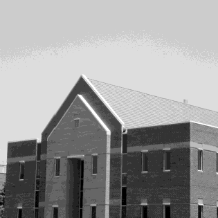


附录一：MATLAB      简介


1．Matlab软件Image   Processing Toolbox


MatLab的原文是Matrix  Laboratory，它包括若干个工具箱如
Communication control wavelet toolbox、Image processing toolbox等等，其中

图像处理工具箱的函数可以完成Geometric    operation、neighborhood and block
operations、linear filtering、transform image analysis、enhancement binary、image

operation等操作。
MATLAB6.5函数imread 和imwrite 所支持的一些常用的图像/图形格式

格式名称            描述               可识别扩展符
TIFF      加标示的图像文件格式       .tiff , .tif

JPEG      联合图像专家组          .jpg , .jpeg
GIF       图像交换格式           .gif

BMP       Windows位图        .bmp
PNG       可移植网络图形          .png

XWD       X Window 转储      .xwd


2．Matlab软件Image   processing commands的使用


A．Read image file from disk 使用MatLab命令读入图像
Matlab 可以支持BMPF、JPEG、BMP等图像文件格式
MatLab Command ： imread
键入

```
            > I = imread(’lena.bmp’)； % 将图像文件Lena.bmp的数据读入矩阵(array)I
```
中
B．Image Display 使用MatLab 命令显示图像

MatLab Command ： figure生成图像窗口
键入
39

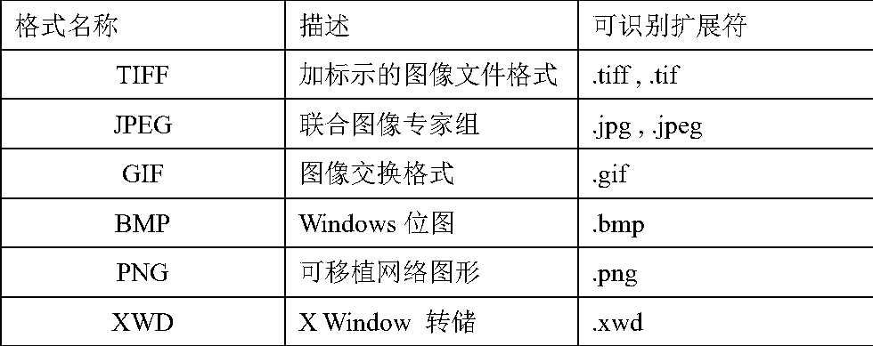


> figure(1)； 生成一个图像窗口1
MatLab Command ： imshow
键入
```
            ➢  imshow(I,[])；
```


上图为显示结果。

C．MatLab命令的连续执行
D．本实验中需要了解/使用的函数

本实验中需要学生了解并学会使用下列命令或函数

clear 清除所有变量。执行本命令将会清除内存中的全部变量。

title(' ') 在当前的图像窗口中加上标题，例如title('原始图像')；  % 在当
前显示的图像上加上标题

imread（） 读入一个图像文件，在使用图像进行运算时，图像的像素必须

```
                     使用双精度浮点制式，而I      = imread (‘lena.bmp’) 只能得到8
```
比特的数字图像，可以显示但不能满足运算的要求，因此在读

```
                     入文件时，采用这样的格式[Im,    map] = imread ('girl.bmp')； 这
```
个命令将文件    girl.bmp 中的图像作为索引图像读入矩阵    Im

之中，索引图像包括一个图像数据矩阵Im和一个调色板矩阵
map ，然后使用  MatLab 提供了数制转换的函数，将其转换

成双精度浮点制式的灰度函数，I      = ind2gray(Im, map)； 这时
的图像  I ，便成为双精度浮点制式的灰度图像。这样，就可

以适用于各种运算的要求。

```
            Imcrop（） 图像剪裁。  使用格式为i   = imcrop ( I, [Xmin, Ymin, dX, dY] )；
```

这里i为剪裁后的图像,I    为被剪裁的原始图像。Xmin    为检测
的水平起始点,即X方向的最小值,Ymin为检测的垂直起始点,
40

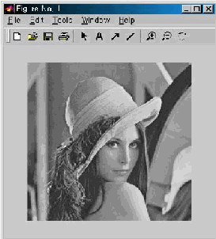


即Y方向的最小值(请注意图像坐标与普通平面直角坐标的区
别)。dX 为水平方向的剪裁宽度，即剪裁下来的图像在水平方

向所具有的像素数量；dY     为垂直方向的剪裁高度，即剪裁下
来的图像在垂直方向所具有的像素数量。例如          i = imcrop (I,

```
                     [180, 200, 200, 200])的操作会将输入的原始图像I 从坐标(180,
```
200)处起，剪切下200 × 200 的一块子图像i。


MatLab 中图像的运算：在   MatLab 中，图像就是一个矩阵，用一个符号代
替运算时当作一个变量即可，因此运算的书写十分简洁，故
MatLab有草稿纸式的算法语言之称。下面是一些运算实例：


I_a = I + 0。5；%为原始图像I 加上一个常数0。5，并将结
果赋予变量I_a；以此类推可以书写出减法I_s      = I - 0。5； 乘

```
                     法(数乘)I_m = I * 2； 除法I_d = I / 3；
```
E．其它可能用到命令有

imresize（） 调节图像大小
imcontour（） 画出图像的轮廓

```
            imadjust(f,[low_in high_in],[low_out high_out]) 对灰度图进行亮度变化
```
imtist（）  计算图像的直方图

histeq（）  直方图均衡
rgb2gray（） 将RGB图像转换成灰度图像

```
            g=ice('porperty name','property value');
```


函数ice的有效输入
属性名称                     属性值
'image' 一幅RGB或单色输入图像f，它由指定的映射交互的变化

'space' 将被修改得分量的彩色空间。可能的值是'rgb','cmy','hsi'
若值为'on'，则 g 是被映射的输入图像。若值为'off',则  g 是
'wait'
被映射的输入图像句柄
使用鼠标操作控制点

鼠标动作                     结果

41

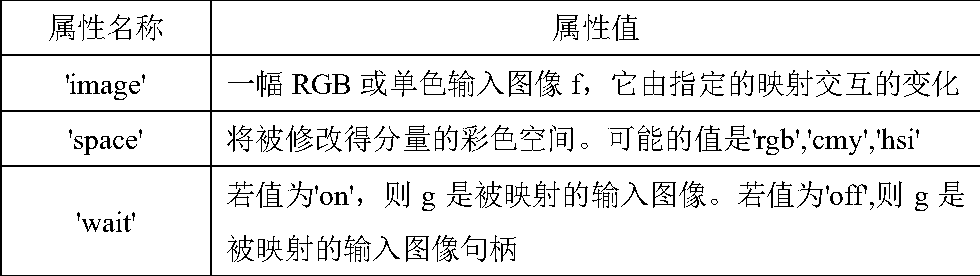


左按钮           按下并拖动左按钮来移动控制点
左按钮+shift键    假如一个控制点。拖动可改变控制点的位置

左按钮+control键  删除控制点


函数ice的图型用户界面中的按钮和复选框的功能
GUI函数     功能

若选中，则进行三次样条(平滑曲线)插值，若不选，
Smooth
则分段的进行线形插值
若选中，则在三次样条插值中强制开始和结束曲线滚
Clamp ends
滑降为零。分段的进行线形插值不受影响
显示手映射函数影响的图像分量的概率密度函数(直
Show PDF
方图)
Show CDF   显示累计分布函数而不是PDF
Map image  若选中，则启用图像映射；否则不启用

Map bars  若选中，则启用伪彩色和全彩色映射；否则不启用
初始化当前显示的映射函数并取消对所有曲线参数
Reset
选定
Reset all 初始化所有映射函数

显示变化曲线上选取的控制点的坐标，input       指水平
Input/output
轴，output指垂直轴
Component  为交互式操作选择映射函数


42

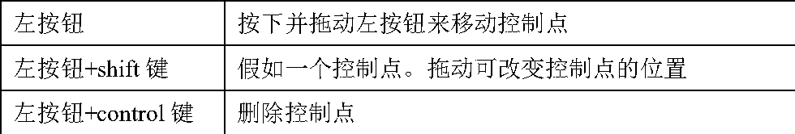
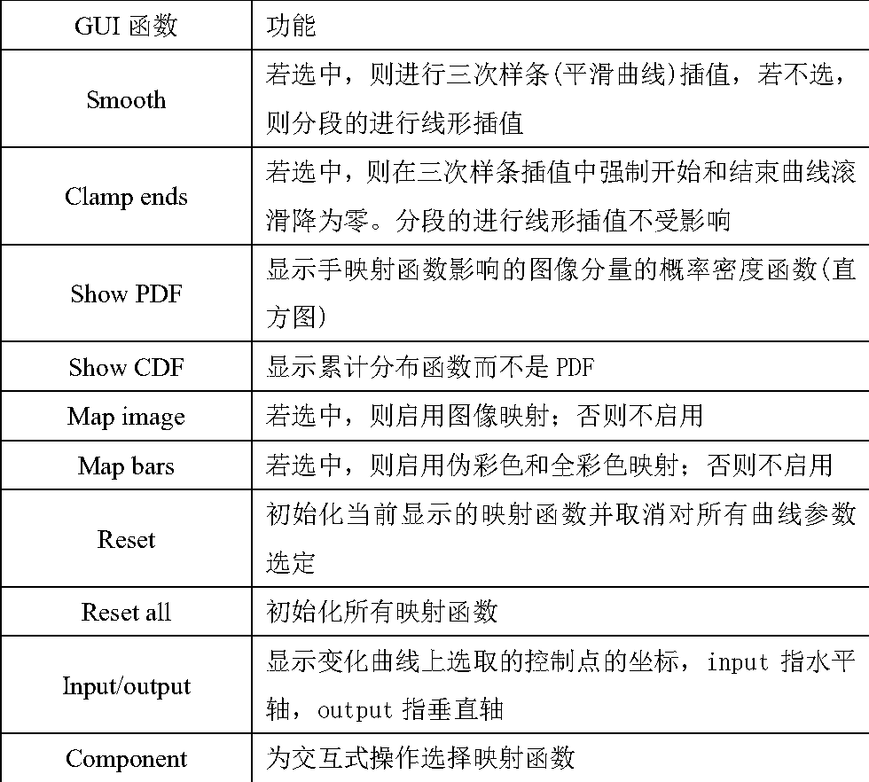


附录二：实验的其它要求


1. 主要教材及教学参考书

教材和教学参考书按照名称、作者、译者、出版社、出版时间的顺序书写。
参考书名称         作者      译者       出版社      出版时间

《数字图像处理
（美）冈萨雷
（MATLAB版）》            阮秋琦    电子工业出版社      2015
斯等
（第三版）
2. 实验安全事项

实验前认真阅读安全操作规程,不得擅自触及总电源开关。实验期间学
生不准使用与实验无关的电气设备。实验过程中若遇计算机故障时,交由指

导老师负责,不允许学生私自开箱维修。在实验过程中,连接实验设备的220V
电源时,要保持手部干燥,并注意操作安全。不允许使用金属物件碰触             220V

电源线及电源插座的带电部位。

3. 实验报告要求

实验报告的书写是一项重要的基本技能训练。它不仅是对每次实验的总
结,更重要的是它可以初步地培养和训练学生的逻辑归纳能力、综合分析能

力和文字表达能力,是科学论文写作的基础。因此,参加实验的每位学生,均应
及时认真地书写实验报告。要求内容实事求是,分析全面具体,文字简练通顺,

誊写清楚整洁。
实验报告的主要内容应包括如下几个方面:

（1）实验目的：指定的基本要求
（2）实验内容：实验中实际要完成的具体内容

（3）实验步骤：将实验过程中的关键步骤记录下来,并对各步骤适当地
进行截图和说明。

（4）实验结果：实验现象的描述,实验数据的处理等。
（5）分析和总结：对实验结果、实验中遇到的问题、实验的关键点等

进行整理、解释、分析和总结。
43

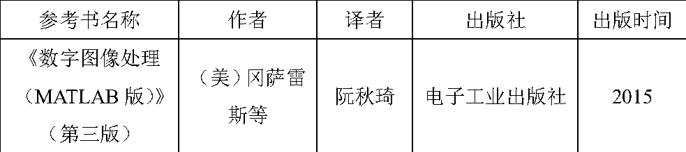
