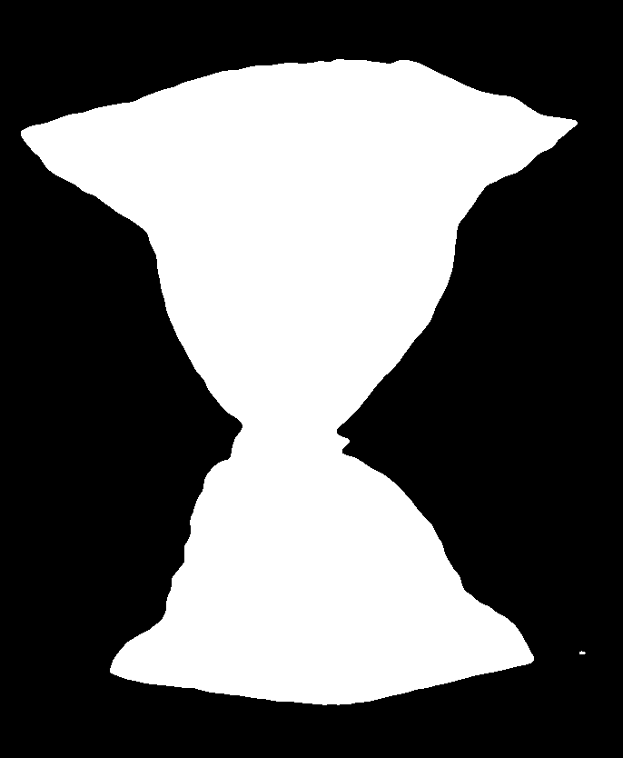
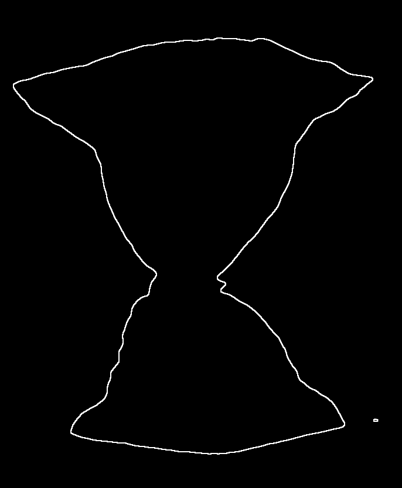
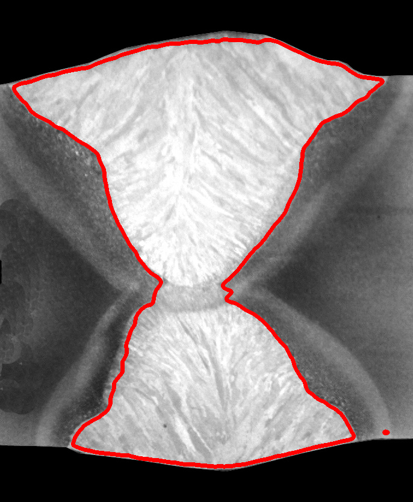

# 考核实验 目标识别

## 一、实验目的

1. 掌握传统数字图像处理的基本方法，包括图像预处理（去噪滤波）、阈值分割、形态学处理和边缘检测。
2. 针对工业焊缝图像，实现焊缝区域的精准分割与边缘轮廓提取。
3. 开发一套基于 Tkinter 的交互式调参界面（GUI），支持通过滑动条和下拉框实时调节各项处理参数，观察不同参数组合对分割与边缘提取效果的影响。
4. 加深对 Otsu 自动阈值、Canny 边缘检测、形态学开闭运算等经典算法原理的理解，并通过实际编程巩固所学知识。

## 二、实验设备（环境）及要求

| 项目 | 说明 |
|------|------|
| 操作系统 | Windows 10/11 |
| Python 环境 | Anaconda（Python 3.x） |
| 核心库 | OpenCV (cv2)、NumPy、Matplotlib、Tkinter（Python 内置 GUI 库） |
| 开发工具 | PyCharm |
| 输入图像 | 情景一焊缝图像（`情景一示例1.jpg`）、情景二焊缝图像（`情景二 示例.jpg`） |
| 运行方式 | 命令行执行 `python weld_segmentation.py` |

**要求**：
- 全程仅使用传统图像处理方法，不使用深度学习技术。
- 程序需支持中文路径的图像读写。
- 处理效果需与示例图一致（左侧为原图，右侧为分割及边缘提取结果）。

## 三、实验原理及方法

### 3.1 图像预处理（去噪）

焊缝图像在采集过程中会引入噪声，影响后续分割效果。本实验采用三种可选滤波方式：

- **高斯滤波（Gaussian Blur）**：使用高斯核对图像进行卷积，权重随距离中心的增大而减小，能有效抑制高斯噪声，同时保持图像整体结构。核心公式：G(x,y) = 1/(2πσ²) × exp(-(x²+y²)/(2σ²))。
- **中值滤波（Median Blur）**：取邻域像素的中值替代中心像素，对椒盐噪声有极好的抑制效果，且能保留边缘细节。
- **双边滤波（Bilateral Filter）**：同时考虑空间距离和像素值差异，在平滑噪声的同时保留强边缘，适合焊缝这种需要保持清晰边界的场景。

**对应代码：**

```python
    """预处理：去噪平滑"""
    k = blur_ksize if blur_ksize % 2 == 1 else blur_ksize + 1
    if blur_type == "gaussian":
        return cv2.GaussianBlur(image, (k, k), 0)
    elif blur_type == "median":
        return cv2.medianBlur(image, k)
    elif blur_type == "bilateral":
        return cv2.bilateralFilter(image, k, 75, 75)
    return image
```

### 3.2 阈值分割

将灰度图像转换为二值图像，提取焊缝前景区域：

- **Otsu 自动阈值**：基于类间方差最大化准则自动确定最优阈值。遍历所有可能的阈值 t，计算前景和背景两类的类间方差 σ_B²(t) = w₀w₁(μ₀-μ₁)²，取使方差最大的 t 作为阈值。适用于灰度直方图呈双峰分布的图像。
- **手动二值化（Binary / Binary Inverse）**：用户指定阈值 T，像素值大于 T 设为 255（或 0），其余设为 0（或 255）。适合灰度分布已知的场景。
- **自适应阈值（Adaptive Mean / Adaptive Gaussian）**：对每个像素计算其局部邻域的均值或高斯加权均值作为阈值，适合光照不均匀的图像。

**对应代码：**

```python
def segment(image, method="otsu", thresh_val=127, max_val=255,
            adaptive_block=11, adaptive_c=2):
    """焊缝区域分割：阈值分割"""
    if method == "otsu":
        _, binary = cv2.threshold(image, 0, max_val,
                                  cv2.THRESH_BINARY + cv2.THRESH_OTSU)
        return binary
    elif method == "triangle":
        _, binary = cv2.threshold(image, 0, max_val,
                                  cv2.THRESH_BINARY + cv2.THRESH_TRIANGLE)
        return binary
    elif method == "manual" or method == "binary":
        _, binary = cv2.threshold(image, thresh_val, max_val,
                                  cv2.THRESH_BINARY)
        return binary
    elif method == "binary_inv":
        _, binary = cv2.threshold(image, thresh_val, max_val,
                                  cv2.THRESH_BINARY_INV)
        return binary
    elif method == "adaptive_mean":
        b = adaptive_block if adaptive_block % 2 == 1 else adaptive_block + 1
        return cv2.adaptiveThreshold(image, max_val,
                                     cv2.ADAPTIVE_THRESH_MEAN_C,
                                     cv2.THRESH_BINARY, b, adaptive_c)
    elif method == "adaptive_gaussian":
        b = adaptive_block if adaptive_block % 2 == 1 else adaptive_block + 1
        return cv2.adaptiveThreshold(image, max_val,
                                     cv2.ADAPTIVE_THRESH_GAUSSIAN_C,
                                     cv2.THRESH_BINARY, b, adaptive_c)
    return image
```

### 3.3 形态学处理

对二值图像进行形态学操作，去除分割结果中的噪点小区域并填补焊缝区域的空洞：

- **闭运算（Close）**：先膨胀后腐蚀。能填充分割区域内的小空洞，连接相邻区域，同时保持区域大小基本不变。适合填补焊缝分割结果中的断裂。
- **开运算（Open）**：先腐蚀后膨胀。能去除小的噪点区域，平滑目标边界，同时保持区域大小不变。
- **膨胀（Dilate）**：扩展白色区域，能填补小间隙。
- **腐蚀（Erode）**：收缩白色区域，能去除细小连接。

**对应代码：**

```python
def morphological_process(binary, op_type="close", ksize=5, iterations=1):
    """形态学处理：去除噪点、填补空洞"""
    k = ksize if ksize % 2 == 1 else ksize + 1
    kernel = cv2.getStructuringElement(cv2.MORPH_RECT, (k, k))
    ops = {
        "open": cv2.MORPH_OPEN,
        "close": cv2.MORPH_CLOSE,
        "dilate": cv2.MORPH_DILATE,
        "erode": cv2.MORPH_ERODE,
    }
    return cv2.morphologyEx(binary, ops.get(op_type, cv2.MORPH_CLOSE),
                            kernel, iterations=iterations)
```

### 3.4 边缘检测

在形态学处理后的图像上提取焊缝边缘轮廓：

- **Canny 边缘检测**：多阶段算法，先用高斯滤波平滑图像，再用 Sobel 算子计算梯度幅值和方向，然后进行非极大值抑制细化边缘，最后用双阈值和滞后阈值处理连接边缘。低阈值和高阈值可调。
- **Sobel 算子**：分别计算 x 和 y 方向的梯度 Gx、Gy，合成梯度幅值 M = √(Gx²+Gy²)，再归一化到 [0,255]。
- **Laplacian 算子**：计算图像的二阶导数 ∇²f，对边缘响应强烈，但对噪声敏感。
- **Scharr 算子**：Sobel 算子的优化版本，核系数更精确，对梯度的近似更准确。

**对应代码：**

```python
def detect_edges(image, method="canny", low_thresh=50, high_thresh=150,
                 sobel_ksize=3):
    """边缘检测"""
    if method == "canny":
        return cv2.Canny(image, low_thresh, high_thresh)
    elif method == "sobel":
        k = sobel_ksize if sobel_ksize % 2 == 1 else sobel_ksize + 1
        k = max(1, min(k, 7))
        gx = cv2.Sobel(image, cv2.CV_64F, 1, 0, ksize=k)
        gy = cv2.Sobel(image, cv2.CV_64F, 0, 1, ksize=k)
        mag = np.sqrt(gx ** 2 + gy ** 2)
        if mag.max() > 0:
            mag = mag / mag.max() * 255
        return np.uint8(np.clip(mag, 0, 255))
    elif method == "laplacian":
        k = sobel_ksize if sobel_ksize % 2 == 1 else sobel_ksize + 1
        k = max(1, min(k, 7))
```

### 3.5 灰度直方图分析

绘制预处理后图像的灰度直方图（256 个灰度级），并标注当前阈值线。通过观察直方图的峰谷分布，可以直观判断最优阈值位置，辅助用户调整参数。

**对应代码：**

```python
# 绘制灰度直方图
def draw_histogram(img, title="灰度直方图"):
    hist = cv2.calcHist([img], [0], None, [256], [0, 256])
    plt.figure(figsize=(8, 4))
    plt.plot(hist, color="gray")
    plt.title(title)
    plt.xlabel("灰度值")
    plt.ylabel("像素数")
    plt.xlim([0, 256])
    plt.tight_layout()
    plt.show()
```

## 四、设计思想

### 4.1 整体架构

程序采用模块化设计，将图像处理核心函数与 GUI 交互界面分离：

```
weld_segmentation.py
├── imread_cn() / imwrite_cn()     # 中文路径兼容读写
├── preprocess()                     # 预处理（三种滤波）
├── segment()                        # 阈值分割（五种方法）
├── morphological_process()          # 形态学处理（四种操作）
├── detect_edges()                   # 边缘检测（四种方法）
├── draw_contours_on_original()      # 轮廓叠加绘制
└── class WeldSegmentationApp        # 交互式调参 GUI
    ├── __init__()                   # 初始化 + 自动查找图像
    ├── _build_ui()                  # 构建界面布局
    ├── _build_param_controls()      # 构建参数控件
    ├── _on_param_change()           # 参数变化回调（带防抖）
    ├── _update_display()            # 处理流程 + 5 子图刷新
    ├── _save_results()              # 保存结果图像
    └── _reset_params()              # 重置默认参数
```

### 4.2 处理流程

每次参数变化时，按照以下流水线顺序执行：

```
原始图像 → 灰度转换 → 预处理(滤波) → 阈值分割 → 形态学处理 → 边缘检测 → 结果显示
```

### 4.3 GUI 设计

- **顶部**：图像选择下拉框 + 加载/保存/重置按钮
- **左侧**：可滚动参数面板，包含预处理、分割、形态学、边缘检测、叠加显示五组参数
- **右侧**：2×3 子图布局，显示原图、阈值分割、形态学处理、边缘检测、灰度直方图
- **底部**：状态栏，实时显示焊缝像素占比、当前分割方法和边缘检测方法

### 4.4 关键优化

- **中文路径支持**：使用 `np.fromfile()` + `cv2.imdecode()` 替代 `cv2.imread()`，解决 Windows 中文路径读取问题。
- **防抖机制**：参数变化回调采用 150ms 防抖定时器（`self.after`），避免快速滑动时频繁重绘导致 UI 卡顿。
- **除零保护**：Sobel/Scharr 算子在计算梯度幅值归一化前检查 `mag.max() > 0`，避免均匀图像导致的除零错误。
- **空轮廓保护**：`draw_contours_on_original()` 在绘制前检查轮廓列表是否为空，避免空列表传入 `drawContours`。
- **直方图辅助调参**：实时显示灰度直方图，并在二值化模式下标注阈值线，在 Otsu 模式下计算并标注 Otsu 阈值。

## 五、程序代码及注释

完整代码见 `weld_segmentation.py`（703 行）。以下为关键函数的代码及注释：

```python
# ======================== 中文路径兼容读写 ========================

def imread_cn(path, flags=cv2.IMREAD_COLOR):
    """支持中文路径的图像读取（替代 cv2.imread）"""
    data = np.fromfile(path, dtype=np.uint8)  # 二进制方式读取，绕过中文路径编码问题
    return cv2.imdecode(data, flags)           # 解码为图像矩阵


def imwrite_cn(path, img):
    """支持中文路径的图像写入（替代 cv2.imwrite）"""
    ext = os.path.splitext(path)[1]
    success, buf = cv2.imencode(ext, img)      # 编码为内存缓冲区
    if success:
        buf.tofile(path)                       # 二进制方式写入文件
    return success


# ======================== 图像处理核心函数 ========================

def preprocess(image, blur_ksize=5, blur_type="gaussian"):
    """预处理：去噪平滑。支持高斯/中值/双边三种滤波方式"""
    k = blur_ksize if blur_ksize % 2 == 1 else blur_ksize + 1  # 确保核大小为奇数
    if blur_type == "gaussian":
        return cv2.GaussianBlur(image, (k, k), 0)
    elif blur_type == "median":
        return cv2.medianBlur(image, k)
    elif blur_type == "bilateral":
        return cv2.bilateralFilter(image, k, 75, 75)  # 空间/灰度域标准差
    return image


def segment(image, method="otsu", thresh_val=127, max_val=255,
            adaptive_block=11, adaptive_c=2):
    """焊缝区域分割：支持 Otsu/手动二值化/自适应阈值 五种方法"""
    if method == "otsu":
        _, binary = cv2.threshold(image, 0, max_val,
                                  cv2.THRESH_BINARY + cv2.THRESH_OTSU)
        return binary
    elif method == "binary":
        _, binary = cv2.threshold(image, thresh_val, max_val, cv2.THRESH_BINARY)
        return binary
    elif method == "binary_inv":
        _, binary = cv2.threshold(image, thresh_val, max_val, cv2.THRESH_BINARY_INV)
        return binary
    elif method == "adaptive_mean":
        b = adaptive_block if adaptive_block % 2 == 1 else adaptive_block + 1
        return cv2.adaptiveThreshold(image, max_val, cv2.ADAPTIVE_THRESH_MEAN_C,
                                     cv2.THRESH_BINARY, b, adaptive_c)
    elif method == "adaptive_gaussian":
        b = adaptive_block if adaptive_block % 2 == 1 else adaptive_block + 1
        return cv2.adaptiveThreshold(image, max_val, cv2.ADAPTIVE_THRESH_GAUSSIAN_C,
                                     cv2.THRESH_BINARY, b, adaptive_c)
    return image


def morphological_process(binary, op_type="close", ksize=5, iterations=1):
    """形态学处理：开/闭/膨胀/腐蚀，用于去噪和填补空洞"""
    k = ksize if ksize % 2 == 1 else ksize + 1
    kernel = cv2.getStructuringElement(cv2.MORPH_RECT, (k, k))  # 矩形结构元素
    ops = {
        "open": cv2.MORPH_OPEN,    # 先腐蚀后膨胀：去噪
        "close": cv2.MORPH_CLOSE,  # 先膨胀后腐蚀：填空洞
        "dilate": cv2.MORPH_DILATE,
        "erode": cv2.MORPH_ERODE,
    }
    return cv2.morphologyEx(binary, ops.get(op_type, cv2.MORPH_CLOSE),
                            kernel, iterations=iterations)


def detect_edges(image, method="canny", low_thresh=50, high_thresh=150,
                 sobel_ksize=3):
    """边缘检测：Canny/Sobel/Laplacian/Scharr 四种方法"""
    if method == "canny":
        return cv2.Canny(image, low_thresh, high_thresh)
    elif method == "sobel":
        k = sobel_ksize if sobel_ksize % 2 == 1 else sobel_ksize + 1
        k = max(1, min(k, 7))
        gx = cv2.Sobel(image, cv2.CV_64F, 1, 0, ksize=k)  # x 方向梯度
        gy = cv2.Sobel(image, cv2.CV_64F, 0, 1, ksize=k)  # y 方向梯度
        mag = np.sqrt(gx ** 2 + gy ** 2)                    # 梯度幅值
        if mag.max() > 0:                                    # 防止除零
            mag = mag / mag.max() * 255                      # 归一化到 [0,255]
        return np.uint8(np.clip(mag, 0, 255))
    elif method == "laplacian":
        k = sobel_ksize if sobel_ksize % 2 == 1 else sobel_ksize + 1
        k = max(1, min(k, 7))
        lap = cv2.Laplacian(image, cv2.CV_64F, ksize=k)     # 二阶导数
        return np.uint8(np.clip(np.abs(lap), 0, 255))
    elif method == "scharr":
        gx = cv2.Scharr(image, cv2.CV_64F, 1, 0)
        gy = cv2.Scharr(image, cv2.CV_64F, 0, 1)
        mag = np.sqrt(gx ** 2 + gy ** 2)
        if mag.max() > 0:
            mag = mag / mag.max() * 255
        return np.uint8(np.clip(mag, 0, 255))
    return image


def draw_contours_on_original(original, binary, color=(0, 255, 0), thickness=2):
    """在原图上绘制焊缝轮廓"""
    if len(original.shape) == 2:
        display = cv2.cvtColor(original, cv2.COLOR_GRAY2BGR)
    else:
        display = original.copy()
    contours, _ = cv2.findContours(binary, cv2.RETR_EXTERNAL,
                                   cv2.CHAIN_APPROX_SIMPLE)
    if contours:  # 空轮廓保护
        cv2.drawContours(display, contours, -1, color, thickness)
    return display
```

GUI 部分（`WeldSegmentationApp` 类）的核心代码参见源文件 `weld_segmentation.py`，包含界面构建、参数控件、防抖回调、5 子图刷新、结果保存等完整实现。

## 六、实验过程

在获得最终实验结果之前，通过在交互式调参界面中反复尝试不同参数组合，观察了各参数对分割与边缘提取效果的影响。以下记录了在两个情景下使用**不佳参数组合**时出现的典型问题及分析。

### 6.1 情景一：焊缝图像分割与边缘提取（不佳参数实验）

使用 `情景一示例1.jpg` 作为输入，在寻找最优参数前，尝试了以下不佳参数组合：

| 编号 | 参数组合 | 关键设置 | 出现的问题 |
|:----:|---------|---------|---------|
| 1 | **无预处理 + Otsu** | preprocess=none, seg=otsu, blur_ksize=1 | 图像未经滤波，噪声直接进入分割环节；Otsu 阈值被噪声灰度干扰，焊缝区域出现断裂，二值图中散布大量孤立噪点 |
| 2 | **手动阈值过低** | seg=binary, thresh_val=80 | 阈值设置过低，背景中较暗的区域被误判为焊缝前景，分割结果混入大量背景噪声，焊缝边界模糊 |
| 3 | **跳过形态学处理** | 无 close/open 操作 | 分割后的二值图保留大量小空洞和孤立噪点；Canny 边缘检测时出现大量伪边缘，焊缝轮廓断裂且不连续 |
| 4 | **Canny 低阈值过低** | edge=canny, canny_low=20, canny_high=150 | 低阈值过低引入大量弱边缘和噪声响应，焊缝真实边界被杂乱的细线包围，边缘图呈现“毛刺”状，难以辨识 |
| 5 | **中值滤波核过大** | blur=median, blur_ksize=15 | 15×15 中值滤波过度平滑，焊缝边缘细节被抹去；Otsu 分割后边界模糊，Canny 提取的边缘轮廓变粗且位置偏移 |

**各组参数处理效果对比图（从左至右：原图灰度、阈值分割、边缘检测、轮廓叠加）**：

| 编号 | 对比图 |
|:----:|:------:|
| 1 无预处理 + Otsu |  |
| 2 阈值过低 (80) |  |
| 3 无形态学处理 |  |
| 4 Canny 低阈值 20 |  |
| 5 中值核 15 |  |

### 6.2 情景二：不同场景焊缝图像（不佳参数实验）

使用 `情景二 示例.jpg` 作为输入，由于该图像存在光照不均匀问题，以下参数组合效果不佳：

| 编号 | 参数组合 | 关键设置 | 出现的问题 |
|:----:|---------|---------|---------|
| 1 | **全局 Otsu 阈值** | seg=otsu | 全局阈值无法适应局部光照变化，图像左侧亮背景与右侧暗焊缝同时被错误分割，结果严重失真 |
| 2 | **自适应块大小过小** | seg=adaptive_gaussian, adaptive_block=7, adaptive_c=2 | 7×7 的局部窗口过小，将背景纹理噪声误判为焊缝特征，分割结果呈斑驳斑块状，焊缝连续性被破坏 |
| 3 | **形态学核过大** | morph=close, morph_ksize=21, morph_iter=2 | 21×21 闭运算核过度膨胀，焊缝区域与邻近的背景粘连，焊缝宽度被不自然地扩大，边缘位置严重偏移 |
| 4 | **双边滤波核过小** | blur=bilateral, blur_ksize=3 | 核尺寸过小无法有效平滑光照不均匀的背景，自适应阈值分割后背景噪声大量残留，焊缝边缘锯齿严重 |
| 5 | **自适应常数 C 过大** | seg=adaptive_gaussian, adaptive_block=21, adaptive_c=15 | C 值过大导致局部阈值被过度拉高，大量本应属于焊缝的像素被误判为背景，分割结果出现大面积空洞，焊缝几乎不可见 |

**各组参数处理效果对比图（从左至右：原图灰度、阈值分割、边缘检测、轮廓叠加）**：

| 编号 | 对比图 |
|:----:|:------:|
| 1 全局 Otsu |  |
| 2 自适应块 7 |  |
| 3 形态学核 21 |  |
| 4 双边核 3 |  |
| 5 自适应 C 15 |  |

### 6.3 实验发现与参数调整思路

通过上述不佳参数的尝试，总结出以下调参经验：

1. **预处理不可省略**：至少需进行一次基础滤波（高斯/中值/双边），否则噪声将直接传递至后续步骤，导致分割失败。
2. **阈值方法需匹配场景**：光照均匀的图像适合 Otsu 全局阈值；光照不均匀时必须改用自适应阈值，并配合合适的块大小和常数 C。
3. **形态学核尺寸需适中**：核过大导致目标区域与背景粘连、边缘偏移；核过小则无法有效填补空洞和去除孤立噪点。
4. **边缘检测阈值需平衡**：Canny 低阈值过低会引入噪声，过高则丢失弱边缘；需根据图像特征反复调试双阈值。
5. **滤波核尺寸与边缘保留的权衡**：核过大平滑掉焊缝细节，核过小去噪不足；需在去噪与边缘保留之间找到平衡点。

## 七、实验结果

### 7.1 情景一：焊缝图像分割与边缘提取

使用 `情景一示例1.jpg` 作为输入，采用以下参数组合获得最优效果：

| 参数 | 设置值 |
|------|--------|
| 滤波方式 | Gaussian |
| 滤波核大小 | 5 |
| 分割方法 | Otsu（自动阈值） |
| 形态学操作 | Close（闭运算） |
| 形态学核大小 | 5 |
| 迭代次数 | 2 |
| 边缘检测 | Canny |
| Canny 低阈值 | 50 |
| Canny 高阈值 | 150 |

**处理流程及效果**：
1. 原始灰度图像中焊缝区域与背景存在明显灰度差异。
2. 经过高斯滤波平滑后，噪声被有效抑制。
3. Otsu 自动阈值分割将焊缝区域从背景中分离，得到二值掩膜。
4. 闭运算填补分割结果中的小空洞，使焊缝区域更加完整。
5. Canny 边缘检测在形态学处理后的图像上提取出清晰的焊缝边缘轮廓。
6. 通过"叠加轮廓"功能，可将边缘轮廓叠加到原图上，直观验证分割效果。

| 二值化 | 形态学处理 | 边缘检测 | 轮廓叠加 | 对比图 |
|:---:|:---:|:---:|:---:|:---:|
|  |  |  |  |  |

### 7.2 情景二：不同场景的焊缝图像

使用 `情景二 示例.jpg` 作为输入，由于该图像的灰度分布与情景一不同，需要调整参数：

| 参数 | 设置值 |
|------|--------|
| 滤波方式 | Bilateral |
| 滤波核大小 | 9 |
| 分割方法 | Adaptive Gaussian |
| 自适应块大小 | 21 |
| 自适应常数 C | 5 |
| 形态学操作 | Close |
| 形态学核大小 | 7 |
| 边缘检测 | Canny |
| Canny 低阈值 | 30 |
| Canny 高阈值 | 100 |

**关键发现**：
- 情景二图像光照不均匀，Otsu 全局阈值效果不佳，需改用自适应阈值方法。
- 双边滤波在保留边缘的同时更好地平滑了不均匀背景。
- 自适应阈值的块大小和常数 C 需要根据图像局部特征精细调节。

| 二值化 | 形态学处理 | 边缘检测 | 轮廓叠加 | 对比图 |
|:---:|:---:|:---:|:---:|:---:|
|  |  |  |  |  |

### 7.3 灰度直方图分析

交互界面中的灰度直方图（第 5 个子图）对参数调节非常有帮助：
- 在 **手动二值化** 模式下，直方图上的红色虚线标注当前阈值位置，用户可根据峰谷位置直观调整。
- 在 **Otsu 模式** 下，直方图自动计算并标注 Otsu 最优阈值。
- 通过观察直方图，可以判断图像是否适合全局阈值（双峰分布）还是需要自适应阈值（单峰或多峰分布）。

### 7.4 实验总结

1. **预处理的重要性**：合适的滤波方式和核大小直接影响后续分割质量。高斯滤波通用性好，双边滤波对边缘保留更优。
2. **阈值方法的选择**：Otsu 适合光照均匀的场景；自适应阈值适合光照不均匀的场景。
3. **形态学处理的必要性**：分割后的二值图常含有噪点和空洞，闭运算能有效填补空洞，开运算能去除小噪点。
4. **边缘检测方法对比**：Canny 效果最好（双阈值 + 滞后连接）；Sobel/Scharr 适合快速梯度计算；Laplacian 对噪声敏感。
5. **交互式调参的价值**：通过实时调节参数并观察效果，能快速找到最优参数组合，加深对各算法原理的理解。
