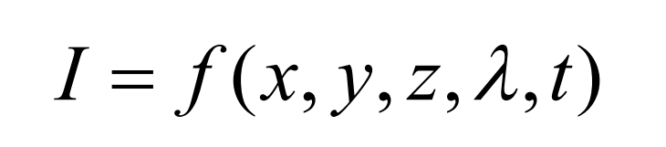
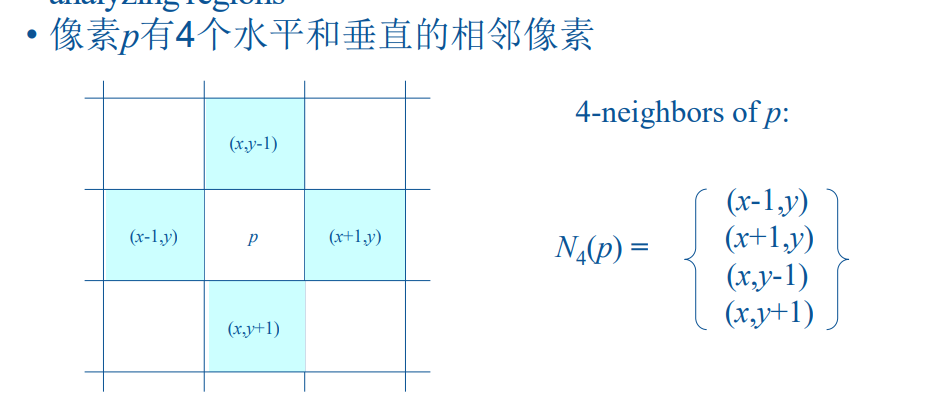
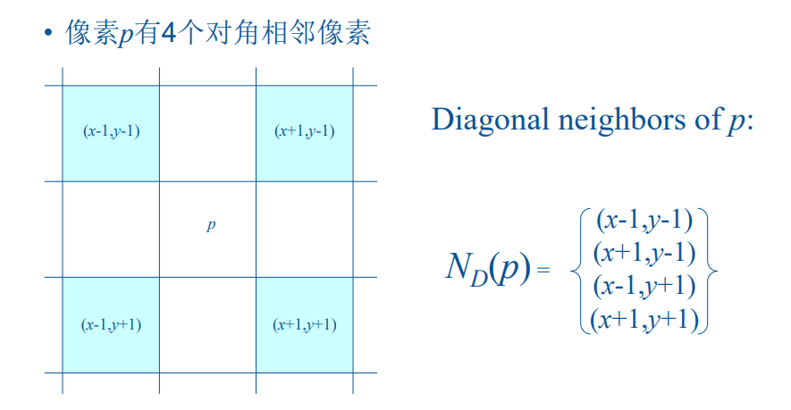
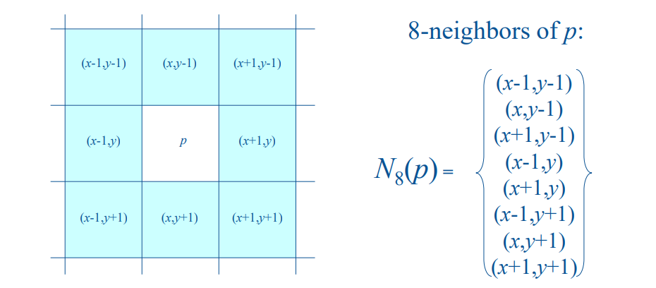
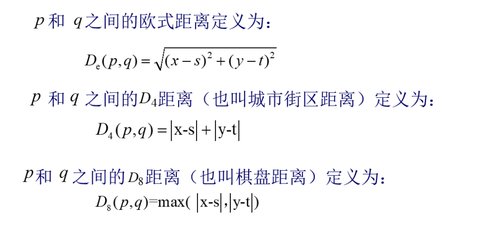

# 数字图像处理

## 第1章 绪论

### 什么是图像？什么是数字图像？

#### 图像：

任一幅图像，根据它的光强度(亮度、密度或灰度)的空间 分布，均可以用下面的函数形式来表达

可简化为f(x,y)，它由两个分量来表征

- 入射到被观察场景的光源照射总量，入射分量i(x,y)
- 场景中物体所反射的光照总量，反射分量r(x,y)
- 两个函数乘积形成f(x,y)，即f(x,y)=i(x,y)r(x,y)

#### 数字图像

数字图像可以理解为一幅连续图像经过数字化过程（取样和量化）后的产物具体而言：  

- **定义**：数字图像是一个多维的数值数组（如灰度图像）或向量数组（如彩色图像）  
- **构成**：图像中的每一个分量被称为“像素”（pixel），每个像素都与一个像素值相关联（即数组中的一个数值）  
- **分类**：按照色彩等属性，数字图像通常包括二值图像、灰度图像、索引图像和RGB图像等类型  

### 掌握数字图像处理的基本步骤

- **图像获取 (Image Acquisition)**：这是处理过程的第一步，用于获取原始图像数据  
- **预处理 (Pre-processing)**：对获取的图像进行初步处理，例如增强、去噪等，以改善图像质量，为后续处理打下基础  
- **图像分割 (Image Segmentation)**：这是图像处理的关键环节（如第十章所述），其本质是检测图像中感兴趣的特征，如点、线、边缘或区域
- **图像处理与分析 (Processing and Analysis)**：
  - **空间域处理**：包括各类空间滤波（如平滑滤波器进行低频增强，锐化滤波器突出高频）  
  - **频域处理**：涉及高通、低通滤波器等转换过程  
  - **形态学处理**：利用腐蚀、膨胀、开运算与闭运算等基础操作对图像形态进行分析  
  - **图像复原**：针对图像退化现象，利用逆滤波、最小均值滤波等方法进行图像复原  
- **彩色图像处理（扩展）**：将上述灰度图像的处理逻辑扩展至彩色图像（如RGB通道或HSI模型）  
- **结果表达与描述**：涉及形状数、边界描绘等概念，用于对处理后的目标进行量化描述

## 第2章 数字图像基础

> 📌 **名词解释重点**：空间分辨率、灰度分辨率是高频考点。

### **人类视觉感知**

- **杆状体**
  - 分布视网膜表面，对微弱光敏感，负责暗视觉。
  - 杆状体用来给出视野内总体图像，没有彩色感觉
- **锥状体**
  - 位于视网膜中间，对强光敏感，负责白昼视觉和彩色感知
  - 对颜色高度敏感，人可以 充分地分辨图像细节

### 图像的分类

#### 位图：

位图是通过许多像素点表示一幅图像，每个像素具有颜色属性和位置属性

#### 按照位图对图像进行分类

- 二值图像
- 灰度图像
- 索引图像
- 彩色图像

### 分辨率概念

- **空间分辨率**：是图像中可辨别的最小细节的度量。采样率必须大于等于图像最小周期的两倍
- **灰度分辨率**：灰度级中可分辨的最小变化

### 像素间关系

#### 相邻像素

**8临近：**

#### 基本性质

- 邻接性
  -  对于具有值V的像素p和q，如果q在集合N4(p) 中，q∈N4(p)，则称这两个像素是4邻接的
- 连通性
  - 连通的必要条件
    1. 像素位置是否相邻
    2. 像素的灰度值是否满足特定的相似性准则
  - 连通
    1. 令S代表一幅图像中像素的子集。如果在S中全部像素之间存在一个通路，则可以说两个像素p和q在S中是连通的
    2. 如果S仅有一个连通分量，集合S叫做连通集
- 区域
  - 令R是图像中的像素子集。如果R是连通集，则称R为一个区域
- 边缘
  - 是由具有超过预先设定的导数值的像素形成

#### 距离度量

### 图像基本运算

#### 1. 点运算 (Point Operation)

点运算是指对图像中的每一个像素点进行逐点计算，属于灰度到灰度的映射过程。

- **数学定义**：$g(x,y) = T[f(x,y)]$，其中 $T$ 为灰度变换函数。
- **特点**：
  - 仅涉及单个像素，与相邻像素无运算关系。
  - **不改变**图像内像素之间的空间位置关系。
- **主要类型**：
  - **线性灰度变换**：$s = ar + b$，通过调整参数 $a$ 和 $b$ 改变对比度或亮度。
  - **分段线性灰度变换**：用于突出感兴趣的灰度范围，抑制不感兴趣区域。
  - **非线性灰度变换**：如对数变换、幂次变换，通过函数特性有选择地压缩或扩展灰度级。

#### 2. 代数运算 (Algebra Operation)

代数运算是指两幅或多幅输入图像之间对应像素点进行的数学运算。

- **加运算**：主要用于求多幅图像的平均值以去除随机噪声，或生成叠加效果。
- **减运算**：常用于差影法（Change Detection），检测图像变化或消除背景干扰。
- **乘运算**：用于改变图像灰度级或实现图像的局部提取。
- **除运算**：常用于遥感图像处理及对比度校正。

#### 3. 逻辑运算 (Logical Operation)

逻辑运算是对图像像素的二进制位进行“与”、“或”、“非”、“异或”等操作。

- **应用场景**：常用于图像理解与分析中的模板提取。
- **常见用途**：
  - **与/或运算**：用于提取特定的感兴趣区域（ROI）。
  - **异或运算**：用于比较两幅图像的差异，获取差异区域。

#### 4. 几何运算 (Geometric Operation)

几何运算是指改变图像像素之间的空间位置关系，通过空间变换实现。

- **数学定义**：将输入图像坐标 $(u, v)$ 映射到输出图像坐标 $(x, y)$。
- **主要变换类型**：
  - **位置变换**：平移、镜像、旋转等。
  - **形状变换**：图像的缩放（放大或缩小）。
  - **复合变换**：上述基础变换的各种组合。
- **核心处理**：由于变换后坐标通常不是整数，且可能产生空洞点，因此需要结合**插值算法**（如近邻插值、双线性插值等）来重采样，以保证图像的连续性和清晰度。

## 第3章 灰度变换与空间滤波

> ⚠️ **大题预警**：本章必出大题。

### 3.1 灰度变换函数

灰度变换是**点运算**（Point Operation），核心特点：输出图像中每个像素的灰度值**仅由输入图像对应位置像素的灰度值决定**，与像素位置和邻域无关。

基本公式：

$g(x, y) = T[f(x, y)]$

其中 $r = f(x,y)$为输入灰度，$s = g(x,y)$为输出灰度，$T$为变换函数。

#### 1. 灰度线性变换

表达式：

$s = a \cdot r + b$

- **作用**：拉伸或压缩灰度动态范围。
- **适用**：图像太暗（曝光不足）或太亮（曝光过度），细节模糊时扩展范围提升对比度。

#### 2. 图像反转变换（Negative Transformation）

表达式：

$s = L - 1 - r$

（$L$为灰度级数，通常 256）。

- **作用**：黑变白、白变黑（类似底片效果）。
- **适用**：增强暗区中的白色/灰色细节（如医学X光片）。

#### 3. 对数变换（Logarithmic Transformation）

表达式：

$s = c \cdot \log(r + 1)$

（加1避免 $\log(0)$未定义，$c$用于归一化）。

- **作用**：扩张低灰度范围（暗部细节），压缩高灰度范围（亮部）。
- **适用**：压缩高动态范围图像（如傅里叶频谱），使暗部细节可见。

#### 4. 幂律（伽马）变换（Power-Law / Gamma Transformation）

表达式：

$s = c \cdot r^\gamma$

- $\gamma < 1$
  提亮暗部，扩张低灰度（图像变亮）。
- $\gamma > 1$
  压暗亮部，扩张高灰度（图像变暗）。
- $\gamma = 1$
  无变化。
- **适用**：显示设备校正（CRT γ≈2.2）、医疗/遥感图像增强。

#### 5. 分段线性变换（Piecewise-Linear Transformation）

- **对比度拉伸**：通过分段直线扩展感兴趣灰度范围。
  - 斜率 >1：对比度增加。
  - 斜率 <1：对比度减小。
- **阈值处理**：$r < T$时 $s=0$（黑），$r \geq T$时 $s = L-1$（白）
  用于二值化。

### 3.2 直方图处理（**大题：二选一**）

- 概念：灰度级直方图是图像的一种统计表达，反映了不同灰度级出现的统计概率。
- 重点掌握 **直方图均衡化**（使直方图分布均匀）和 **直方图规定化/匹配**（使直方图变成期望的形状）。
- **要求**：必须学会课件或书本上的计算例题。

灰度级直方图是图像的一种**统计表达**，它反映了图像中不同灰度级出现的**统计概率**。

**定义**：

$h(k) = n_k$

其中 $n_k$ 表示灰度级 $k$ 出现的像素个数。

**归一化后概率**：

$Pr(k) = \frac{n_k}{n}$

（$n$ 为图像总像素数）。

直方图直观反映图像的灰度分布：

- **暗图像**：直方图集中在左侧（低灰度区）。
- **亮图像**：直方图集中在右侧（高灰度区）。
- **低对比度图像**：直方图窄而集中。
- **高对比度图像**：直方图宽且分布均匀。

**主要方法**（大题重点）：

- **直方图均衡化**（Histogram Equalization）：使直方图**分布均匀**，自动增强对比度。
- **直方图规定化/匹配**（Histogram Matching/Specification）：使直方图变成**期望的特定形状**。

#### 3.2.1 直方图均衡化

**核心思想**：通过变换函数将原直方图拉伸成近似均匀分布，从而充分利用全部灰度级，增强图像对比度。

**变换函数**（离散形式）：

$s_k = T(r_k) = (L-1) \sum_{j=0}^{k} Pr(r_j)$

其中 $L$ 为灰度级数（通常 256），$s_k$ 为均衡化后的灰度值。

**优点**：

- 全局自动增强，无需人工设置参数。
- 特别适合对比度较低、细节集中在窄灰度范围的图像。

**注意事项**（考试易考）：

- 均衡化后直方图接近均匀，但由于离散灰度级限制，不一定完全均匀。
- 对噪声敏感，有时会过度增强噪声。
- 常用于医学图像、遥感图像等对比度差的场景。

**计算例题要求**：

- 必须熟练手算：给定小图像的灰度直方图 → 计算概率 → 累计分布函数（CDF）→ 映射得到新灰度值 → 绘制均衡化后直方图。
- 建议练习课件和教材中的典型8×8或16级灰度小图像例题。

#### 3.2.2 直方图规定化（匹配）

**定义**：将输入图像的灰度分布变换成一个**指定的期望灰度分布** $p_z(z)$。

**实现步骤**（重点掌握）：

1. 对输入图像进行**直方图均衡化**，得到 $r_j \leftrightarrow s_j$ 对应关系。
2. 对期望规定直方图 $p_z(z)$ 也进行**均衡化**，得到 $z_k \leftrightarrow v_k$ 对应关系。
3. 建立 $s_j$ 与 $v_k$ 的匹配（选择最接近的点对 $v_k \approx s_j$）。
4. 得到最终映射：$z = G^{-1}(s) = G^{-1}(T(r))$。

**优点**：

- 可控性强，能将图像直方图匹配到特定目标形状（例如匹配另一幅图像的直方图）。
- 比单纯均衡化更灵活。

**与均衡化的区别**：

- 均衡化：目标是**均匀分布**（自动）。
- 规定化：目标是**指定分布**（人为控制）。

**考试大题提示**：

- 很可能出**计算题**（二选一）：给定原图像直方图、期望直方图，要求计算映射表并得到处理后结果。
- 需熟练掌握概率计算、累计和、逆映射等步骤。
- 结合图像例子理解效果：均衡化使细节更清晰，规定化可实现特定增强效果（如匹配标准图像的对比度）。

### 3.3 空间滤波机理与效果（重要）

- **平滑滤波器**：了解包含哪些滤波器，其作用是增强低频信息，能够画出平滑操作后的效果图。
- **锐化滤波器**：理解平滑与锐化的差值关系，锐化的本质是突出高频信息。
- **卷积与计算**：给定一个滤波器（模板），在不考虑边界（或指定边界规则）的情况下，能够手算中心像素的卷积/相关值（例如计算均值）。
- **算子识别**：能够识别常见的滤波器是一阶还是二阶，是平滑还是锐化滤波器。
  - **一阶算子**：Roberts（交叉梯度，对角线）、Prewitt、Sobel（中心权值为2，具有平滑效果，能有效抑制噪声）。
  - **二阶算子**：拉普拉斯算子（突出细节，对噪声敏感，产生双边缘）。

### 3.4 统计排序（非线性）滤波器（填空/简答）

- **中值滤波器**：对脉冲噪声（椒盐噪声）非常有效，在相同尺寸下比均值滤波器引起的模糊少。
- **最大值滤波器**：用于发现图像中最亮点，有效过滤“胡椒”（黑）噪声。
- **最小值滤波器**：用于发现图像中最暗点，有效过滤“盐”（白）噪声。
- **中点滤波器**：结合顺序统计和求平均，对高斯和均匀随机分布这类噪声有最好效果。

- *【不考内容】*：3.7、3.8 节不考

