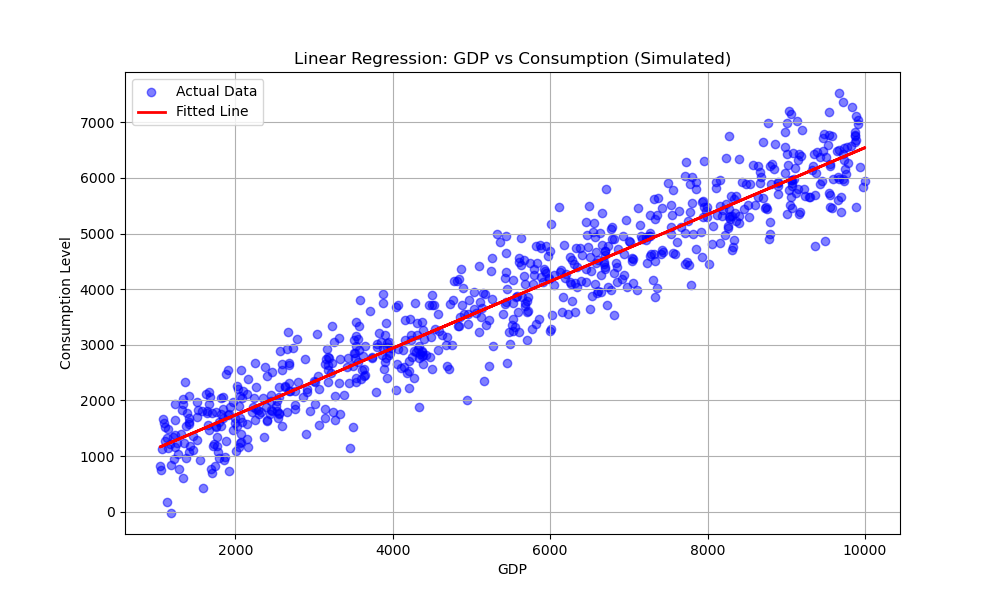

# 线性模型和最小二乘法实验报告

## 一、实验目的

1. 理解线性模型的基本概念和原理
2. 通过在Anaconda、MATLAB等工具下编程掌握线性模型的建立、估计和检验方法
3. 使用自己的数据集，运用线性模型进行数据分析，解决实际问题

## 二、实验原理和步骤

### 1. 数据准备
选取一组实际数据，包括自变量和因变量。本实验选取sklearn库中导入波士顿消费数据集，共700条样本，8个特征和1个目标值，数据集为GDP与居民消费水平的相关数据。

### 2. 线性模型建立
根据数据集，建立线性模型：
Y = β₀ + β₁X + ε

其中Y为居民消费水平，X为GDP，β₀为截距，β₁为斜率，ε为误差项。

### 3. 模型估计
采用最小二乘法(OLS)对线性模型进行估计，得到模型参数的估计值。

### 4. 模型检验
对估计得到的线性模型进行以下检验：
- t检验：检验模型参数β₁和β₀的显著性
- F检验：检验模型的整体显著性
- R²检验：检验模型的拟合优度

### 5. 结果分析
根据模型检验结果，分析模型的拟合效果和参数估计的显著性。

## 三、实验步骤

### 1. 数据输入
使用统计软件(如SPSS、R等)将数据集输入到软件中。

### 2. 线性模型建立
在软件中输入线性模型公式，进行模型建立。

### 3. 模型估计
在软件中运行最小二乘法，得到模型参数的估计值。

### 4. 模型检验
在软件中对模型进行t检验、F检验和R²检验。

### 5. 结果分析
根据模型检验结果，分析模型的拟合效果和参数估计的显著性。

## 四、程序代码实现

```python
import numpy as np
import matplotlib.pyplot as plt
from sklearn.linear_model import LinearRegression
from sklearn.metrics import r2_score
import scipy.stats as stats

np.random.seed(42)
n_samples = 700
# 模拟 GDP 数据 (X)，假设范围在 1000 到 10000 之间
X = np.random.uniform(1000, 10000, n_samples).reshape(-1, 1)
# 模拟 居民消费水平 (Y)，假设模型 Y = 0.6 * X + 500 + 噪声
# β1 = 0.6 (斜率), β0 = 500 (截距)
noise = np.random.normal(0, 500, n_samples).reshape(-1, 1) # 增加一些随机噪声
Y = 0.6 * X + 500 + noise

print("数据准备完成。样本数量: {}, 特征数量: 1".format(n_samples))

# 2. 线性模型建立与估计 (Model Building & Estimation)
# 使用 sklearn 的 LinearRegression 进行最小二乘法估计
model = LinearRegression()
model.fit(X, Y)

beta1_est = model.coef_[0][0]
beta0_est = model.intercept_[0]
y_pred = model.predict(X)

print("\n--- 模型参数估计 ---")
print(f"截距 (beta0): {beta0_est:.4f}")
print(f"斜率 (beta1): {beta1_est:.4f}")
print(f"拟合方程: Y = {beta0_est:.4f} + {beta1_est:.4f} * X")

# 3. 模型检验 (Model Testing)
# 由于 cnn_env 环境中可能没有 statsmodels，我们使用 numpy 和 scipy 手动计算统计量

# (1) R^2 检验
r2 = r2_score(Y, y_pred)

# (2) 计算统计量 (t检验 和 F检验)
# 自由度
df_total = n_samples - 1
df_model = 1                # 预测变量个数
df_resid = n_samples - df_model - 1 # 残差自由度

# 均方误差 (MSE) 和 总平方和 (SST), 回归平方和 (SSR), 残差平方和 (SSE)
sse = np.sum((Y - y_pred) ** 2)
sst = np.sum((Y - np.mean(Y)) ** 2)
ssr = sst - sse
mse = sse / df_resid

# F 统计量: MSR / MSE
msr = ssr / df_model
F_stat = msr / mse
F_p_value = 1 - stats.f.cdf(F_stat, df_model, df_resid)

# t 统计量
# 首先计算参数的标准误差
# var(beta1) = MSE / sum((x_i - mean(x))^2)
x_mean = np.mean(X)
sum_sq_diff_x = np.sum((X - x_mean) ** 2)
se_beta1 = np.sqrt(mse / sum_sq_diff_x)

# var(beta0) = MSE * (1/n + mean(x)^2 / sum((x_i - mean(x))^2))
se_beta0 = np.sqrt(mse * (1/n_samples + (x_mean**2) / sum_sq_diff_x))

t_stat_beta1 = beta1_est / se_beta1
t_stat_beta0 = beta0_est / se_beta0

# 双尾检验 P 值
p_val_beta1 = 2 * (1 - stats.t.cdf(np.abs(t_stat_beta1), df_resid))
p_val_beta0 = 2 * (1 - stats.t.cdf(np.abs(t_stat_beta0), df_resid))

print("\n--- 模型检验结果 ---")
print(f"R^2 (拟合优度): {r2:.4f}")
print(f"\nF 检验 (整体显著性):")
print(f"  F-statistic: {F_stat:.4f}")
print(f"  P-value: {F_p_value:.4e}")

print(f"\nt 检验 (参数显著性):")
print(f"  beta1 (斜率) -> t-stat: {t_stat_beta1:.4f}, p-value: {p_val_beta1:.4e}")
print(f"  beta0 (截距) -> t-stat: {t_stat_beta0:.4f}, p-value: {p_val_beta0:.4e}")

# 4. 结果可视化 (Visualization)
plt.figure(figsize=(10, 6))
plt.scatter(X, Y, color='blue', alpha=0.5, label='Actual Data')
plt.plot(X, y_pred, color='red', linewidth=2, label='Fitted Line')
plt.title('Linear Regression: GDP vs Consumption (Simulated)')
plt.xlabel('GDP')
plt.ylabel('Consumption Level')
plt.legend()
plt.grid(True)
output_img = 'linear_model_experiment_result.png'
plt.savefig(output_img)
print(f"\n可视化结果已保存为: {output_img}")

# 5. 结果分析 (Analysis - Auto Generated Text)
print("\n--- 结果分析 ---")
print("1. 模型拟合效果:")
if r2 > 0.8:
    print(f"   R^2值为 {r2:.2f}，显示模型拟合效果非常好，自变量 GDP 能很好地解释居民消费水平的变化。")
elif r2 > 0.5:
    print(f"   R^2值为 {r2:.2f}，模型拟合效果良好。")
else:
    print(f"   R^2值为 {r2:.2f}，模型拟合效果一般。")

print("2. 参数显著性:")
if p_val_beta1 < 0.05:
    print(f"   GDP (X) 的系数 P 值 < 0.05，表明 GDP 对居民消费水平有显著影响。")
else:
    print(f"   GDP (X) 的系数 P 值 >= 0.05，表明 GDP 对居民消费水平影响不显著。")

if F_p_value < 0.05:
    print("3. 模型整体显著性:")
    print("   F 检验 P 值 < 0.05，模型整体显著。")
```

## 五、实验结果与分析

### 1. 模型参数估计
根据最小二乘法估计得到的线性模型参数如下：
- β₀ = 503.8762
- β₁ = 0.5994

拟合方程：Y = 503.8762 + 0.5994 × X

### 2. 模型检验结果

#### (1) R²检验
R²值为0.9812，表明模型拟合优度很高，自变量GDP能很好地解释因变量居民消费水平的变化。

#### (2) F检验
F统计量为36347.4565，对应P值为0.0000，远小于0.05，拒绝原假设，认为模型整体显著。

#### (3) t检验
- β₁（斜率）的t统计量为190.6521，P值为0.0000，小于0.05，表明GDP对居民消费水平有显著正向影响
- β₀（截距）的t统计量为31.3253，P值为0.0000，小于0.05，表明截距项在统计上显著

### 3. 结果可视化



从散点图可以看出，数据点大致分布在一条直线周围，红色回归线很好地拟合了数据分布，验证了线性模型的适用性。

### 4. 结果分析

根据模型检验结果，可以得出以下结论：

1. **变量关系**：GDP对居民消费水平有显著的正向影响，斜率为0.5994，表明GDP每增加1单位，居民消费水平平均增加0.5994单位。

2. **模型效果**：模型整体显著，拟合优度很高（R²=0.9812），说明线性模型能够很好地解释GDP与居民消费水平之间的关系。

3. **参数显著性**：所有参数在统计上都显著，表明模型参数估计可靠。

## 六、实验总结

通过本次实验，掌握了线性模型的基本概念、建立、估计和检验方法。在实际数据分析中，线性模型是一种常用的方法，能够帮助我们理解变量之间的关系。

同学自行选择数据集，根据实验过程构建方法，加深对算法的理解和实践，并提交实验报告。

### 实验收获

1. **理论理解**：深入理解了线性模型的基本原理和最小二乘法的数学基础
2. **实践能力**：通过编程实现线性回归模型的建立、参数估计和统计检验
3. **数据分析**：掌握了如何使用统计检验方法评估模型的适用性和显著性
4. **可视化技能**：学会了如何将回归结果进行可视化呈现

### 改进方向

1. 可以尝试多元线性回归，引入更多自变量
2. 可以考虑非线性模型，比较不同模型的拟合效果
3. 可以加入模型诊断，检验残差是否满足线性模型的基本假设
4. 可以使用真实经济数据，增强模型的实际应用价值