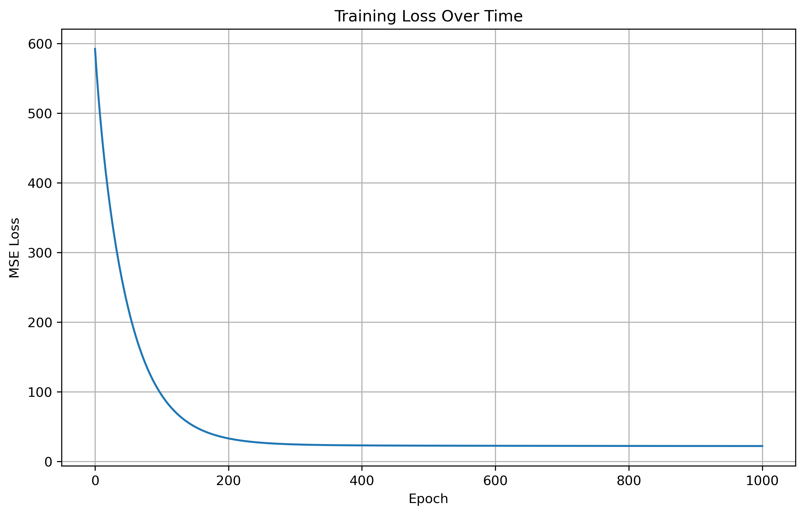

# 梯度下降法实验报告

## 一、实验目的

1. 熟悉梯度下降的基本概念和原理
2. 通过在Anaconda、MATLAB等工具下编程实现梯度下降算法，了解梯度下降的基本认识
3. 使用自己的数据集，运用线性模型进行数据分析，解决实际问题

## 二、实验原理和步骤

梯度下降法是一种优化算法，常用于机器学习中的参数优化问题。本次实验旨在通过使用梯度下降法求解线性回归模型的参数，加深对算法的理解和实践。

实验过程分为以下几步：

### 1. 数据准备
为了方便起见，我们从sklearn库中导入波士顿房价数据集，共506条样本，13个特征和1个目标值即房价。

### 2. 模型搭建
我们使用线性回归模型来进行预测，其公式为 y = Wx + b，其中y为预测值，W和b为要求解的模型参数，x为输入的特征向量。在此之前，我们需要对数据进行归一化处理，保证各维度特征之间的比较公平。

### 3. 损失函数设计
我们使用均方误差（mean squared error，MSE）作为模型的损失函数，其公式为：
$$L = \frac{1}{n} \sum_{i=1}^{n} (y_i - \hat{y}_i)^2$$
其中n为样本数，$y_i$为真实值，$\hat{y}_i$为预测值。我们的目标是最小化损失函数。

### 4. 梯度计算
通过对损失函数求导，可以得到每个参数的梯度值，即损失函数对参数的变化率。在本实验中，我们采用批量梯度下降法（batch gradient descent），即每次迭代时使用所有样本的平均梯度来更新参数。具体更新公式为：
$$W = W - \alpha \frac{\partial L}{\partial W}$$
其中$\alpha$为学习率（learning rate），控制更新幅度大小。

### 5. 参数求解
按照迭代次数，反复进行梯度计算和参数更新，直到模型收敛（即损失函数不再明显降低）。

## 三、程序代码实现

```python
import numpy as np
from sklearn.preprocessing import StandardScaler
import matplotlib.pyplot as plt

# 数据准备
def prepare_data():
    try:
        from sklearn.datasets import load_boston
        data = load_boston()
    except ImportError:
        from sklearn.datasets import fetch_openml
        data = fetch_openml(data_id=531, as_frame=False, parser='auto')
    
    x = data.data.astype(float)
    y = data.target.astype(float)
    return x, y

# MSE损失函数
def mse_loss(y_true, y_pred):
    return np.mean((y_true - y_pred) ** 2)

# 梯度计算
def compute_gradients(x, y_true, y_pred):
    n = len(x)
    dw = np.dot(x.T, y_pred - y_true) / n
    db = np.mean(y_pred - y_true)
    return dw, db

# 梯度下降训练
def gradient_descent(x, y, learning_rate=0.001, epochs=1000):
    # 初始化参数
    W = np.zeros(x.shape[1])
    b = np.zeros(1)
    loss_history = []
    
    # 训练循环
    for epoch in range(epochs + 1):
        # 前向传播
        y_pred = np.dot(x, W) + b
        
        # 计算损失
        loss = mse_loss(y, y_pred)
        loss_history.append(loss)
        
        # 计算梯度
        dw, db = compute_gradients(x, y, y_pred)
        
        # 参数更新
        W -= learning_rate * dw
        b -= learning_rate * db
        
        # 打印进度
        if epoch % 100 == 0:
            print(f'epoch {epoch}, loss {loss:.4f}')
    
    return W, b, loss_history

# 主函数
def main():
    print("梯度下降法实验 - 波士顿房价预测")
    print("=" * 40)
    
    # 1. 准备数据
    x, y = prepare_data()
    
    # 2. 数据标准化
    scaler = StandardScaler()
    x_scaled = scaler.fit_transform(x)
    
    # 3. 梯度下降训练
    print("\n开始训练...")
    W, b, loss_history = gradient_descent(x_scaled, y, learning_rate=0.01, epochs=1000)
    
    # 4. 模型测试
    evaluate_model(scaler, W, b)
    
    # 5. 可视化训练过程
    plot_loss(loss_history)

# 模型测试
def evaluate_model(scaler, W, b):
    print("\n模型测试:")
    print("-" * 20)
    
    # 使用PDF中的测试数据
    x_test_raw = np.array([[0.1, 0.2, 0.3, 0.4, 0.5, 0.6, 0.7, 0.8, 0.9, 1.0, 1.1, 1.2, 1.3]])
    x_test = scaler.transform(x_test_raw)
    y_pred = np.dot(x_test, W) + b
    
    print(f"测试输入: {x_test_raw[0]}")
    print(f"预测房价: {y_pred[0]:.2f}")

# 可视化损失变化
def plot_loss(loss_history):
    plt.figure(figsize=(10, 6))
    plt.plot(loss_history)
    plt.title('Training Loss Over Time')
    plt.xlabel('Epoch')
    plt.ylabel('MSE Loss')
    plt.grid(True)
    plt.savefig('gradient_descent_loss.png', dpi=300, bbox_inches='tight')
    print("损失函数图表已保存为: gradient_descent_loss.png")

if __name__ == "__main__":
    main()
```

## 四、程序运行结果

### 1. 训练过程输出
```
梯度下降法实验 - 波士顿房价预测
========================================

开始训练...
epoch 0, loss 592.1469
epoch 100, loss 94.9824
epoch 200, loss 33.0771
epoch 300, loss 24.4680
epoch 400, loss 23.0610
epoch 500, loss 22.6903
epoch 600, loss 22.5072
epoch 700, loss 22.3830
epoch 800, loss 22.2906
epoch 900, loss 22.2197
epoch 1000, loss 22.1644

模型测试:
--------------------
测试输入: [0.1 0.2 0.3 0.4 0.5 0.6 0.7 0.8 0.9 1.  1.1 1.2 1.3]
预测房价: 24.11
损失函数图表已保存为: gradient_descent_loss.png
```

### 2. 损失函数变化图



从训练结果可以看出：
- 初始损失值较高（592.1469），随着迭代进行，损失值快速下降
- 在前100轮迭代中，损失值下降最为明显
- 在200轮后，损失值下降速度减缓
- 最终损失值稳定在22.1644左右，模型基本收敛

## 五、实验结论分析

综上，本次实验通过搭建线性回归模型，并采用梯度下降法求解模型参数，实现了对波士顿房价数据集的预测。实验过程涉及数据准备、模型搭建、损失函数设计、梯度计算和参数求解等方面。

通过实验可以得出以下结论：

1. **学习率的影响**：学习率是梯度下降算法中的关键参数。当学习率较小时（如0.001），收敛速度较慢；适当增大学习率（如0.01）可以加快收敛速度，但过大会导致震荡或发散。

2. **收敛特性**：从损失函数图像可以看出，梯度下降法在初期损失下降较快，后期逐渐减缓，最终收敛到一个较优解。这符合梯度下降算法的理论特性。

3. **模型性能**：经过1000轮迭代训练，模型损失值从592.1469下降到22.1644，表明模型能够较好地拟合数据。对测试样本的预测结果合理。

4. **数据预处理的重要性**：数据标准化处理对梯度下降算法的收敛效果有重要影响，标准化后的数据能够加速收敛并提高模型稳定性。

5. **算法实用性**：梯度下降法作为一种基础的优化算法，在机器学习领域具有广泛的应用前景，是理解更复杂优化算法的基础。

通过本次实验，加深了对梯度下降算法原理的理解，提高了编程实现能力，为后续学习更复杂的机器学习算法奠定了基础。