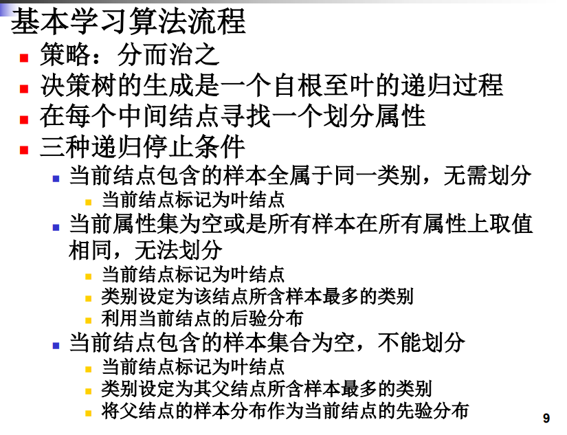
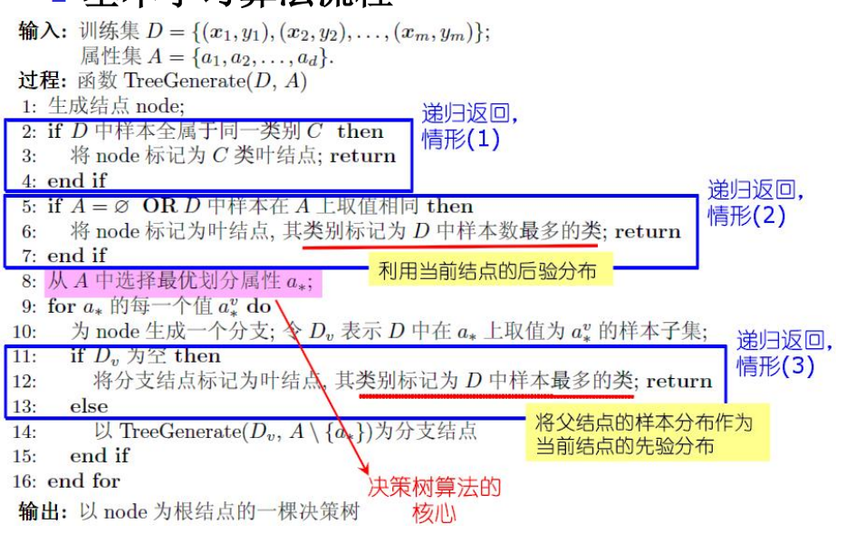
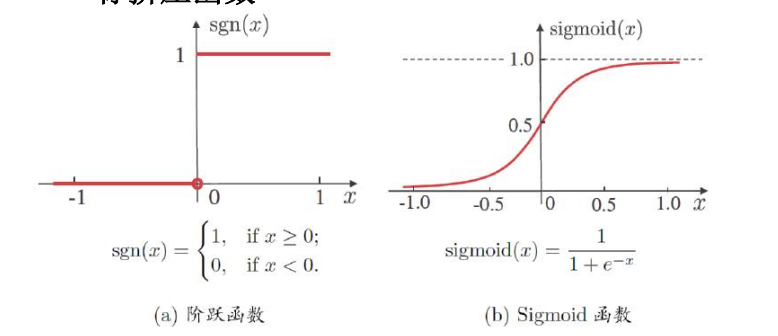
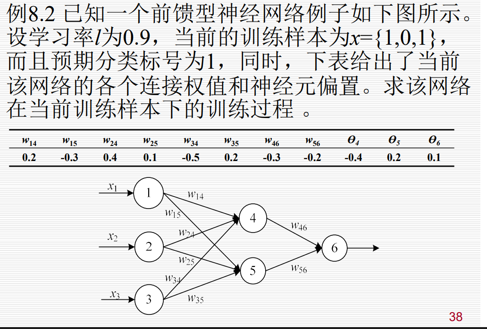
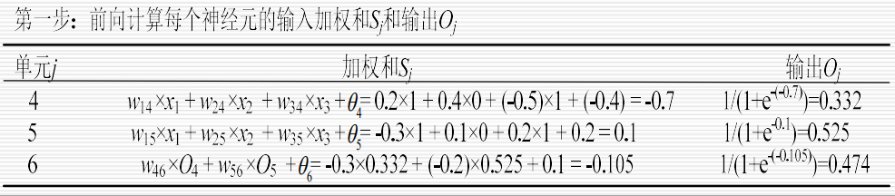
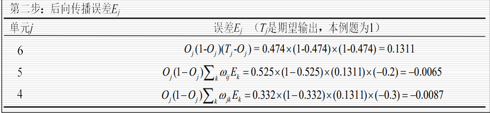
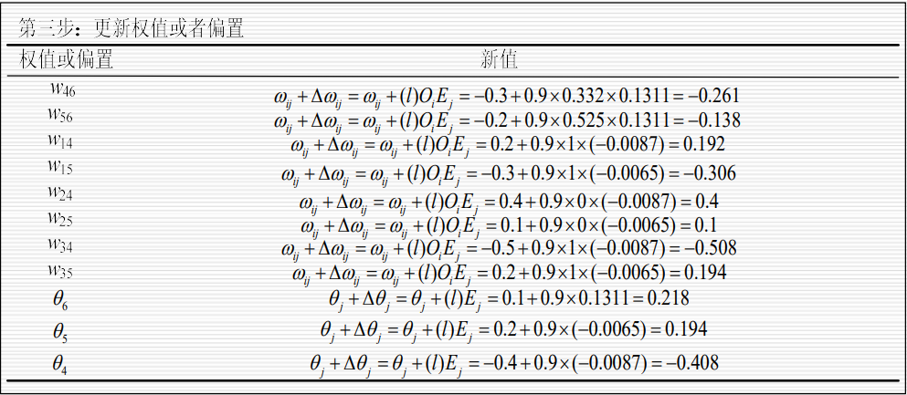
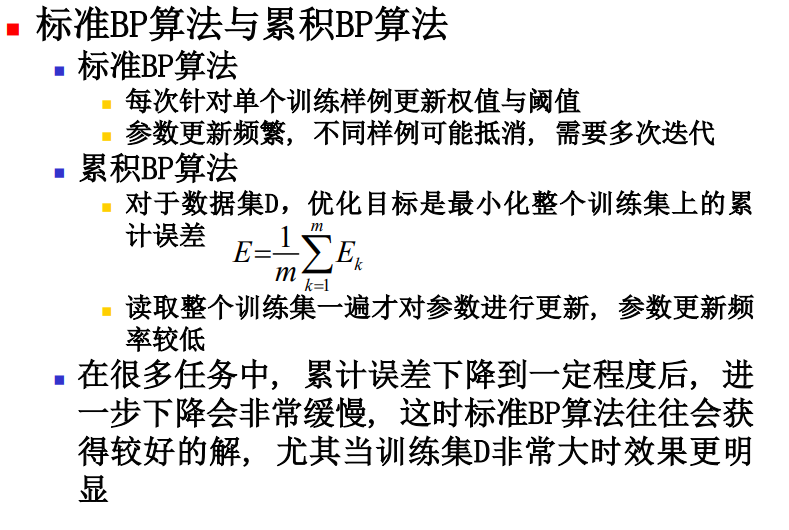
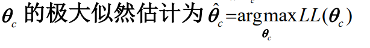
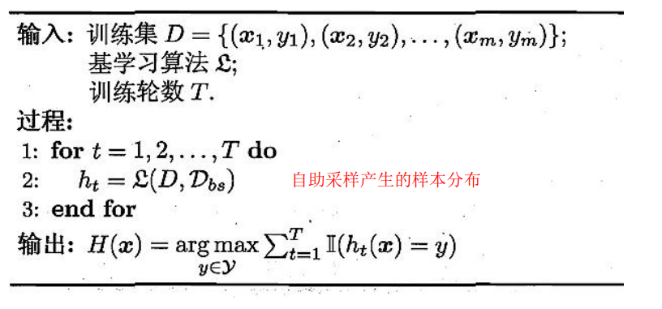

# 机器学习复习内容分类整理

## 1. 绪论

### 基本概念

#### 分类、回归的概念区别

分类：预测离散值，输出的是离散的，预设的类别

回归：预测连续值，输出的是连续的数值

两者都属于监督学习，部分算法可以通用，在部分条件下两者也可以互相转换

#### 监督学习、非监督学习

监督学习：训练数据有标记信息

特点：

- 有标注数据
- 目标明确：预测离散类别和连续值
- 性能易于评估（无明确对错）

非监督学习：训练数据没有标记信息，只有输入特征，需要模型自行发现数据中的结构、模式或者规律

特点：

- 无标注数据
- 目标是探索数据内部结构
- 性能评估主观（有明确对错）

#### 回归问题、分类问题

回归问题：预测连续的数值，与实际的值会有一定的误差

分类问题：预测一个离散的标签（人为定义的组别），有明确的结果的正确性判断

#### 概率与频率的关系

频率：实验得到的测量值

概率：理论上的确定值

通过大数定律转换：实验次数趋于无穷的时候，频率会趋近于概率

#### 独立同分布

定义：同分布+独立，即样本的统计特性是一致的（来自同一个概率分布），并且每次随机试验的结果互不影响

### 基本问题
#### 机器学习的基本过程、三要素

基本过程：

1. 明确任务于数据采集
2. 数据预处理
3. 模型选择与训练
4. 模型评估于调优
5. 模型部署与监控

三要素：

- 模型：学习算法所要学习的假设空间

  就是你认为输入 $x$ 到输出 $y$ 之间存在什么样的数学关系，模型定义了所有可能的解决方案集合

- 策略：从假设空间中选择“最优”模型的准则

- 算法：具体的计算方法，即如何求解最优模型，优化求解方法

**所以机器学习就是：通过算法在策略的指导下，在特定的模型空间内搜索出最符合数据规律的那个函数**

## 2. 模型评估与选择

### 基本概念
#### 训练集、验证集、测试集

训练集：用于训练模型的数据，主要用途是学习模型参数、调整权重，参与模型训练。

验证集：用于模型选择的数据，主要用途是比较不同模型、调优超参数、防止过拟合，不参与模型训练。

测试集：用于最终评估的数据，主要用途是评估模型泛化能力、提供客观性能报告，不参与模型训练。

训练集最多，验证集和测试集较少

**关键原则**

1. 独立性：三个集合必须完全独立，不能有数据重叠
2. 随机性：随机打乱数据后划分，确保分布均匀
3. 代表性：每个集合都要反映真实数据分布
4. 测试集纯洁性：测试集绝对不能参与任何训练或调优

#### 欠拟合、过拟合

**过拟合无法避免**

**欠拟合**：模型过于简单，对样本性质的学习程度差

- 特征：
  - 训练集和测试集误差都很高
- 原因：
  - 模型复杂度过低
  - 训练时间短
  - 正则化过强
  - 特征数量不足

**过拟合**：模型太复杂，过度拟合训练数据的噪声和细节，导致在训练集上表现很好，但在测试集上表现很差

表现：

- 训练集误差很低（甚至接近0）
- 测试集误差很高
- 训练集和测试集误差差距很大

原因：

- 模型复杂度过高（参数太多）
- 训练数据太少
- 训练时间过长
- 数据噪声太大

解决方法：

- 减少模型复杂度（如减少神经网络层数、减少决策树深度）
- 增加训练数据量
- 使用正则化（L1/L2正则化）
- 早停法
- Dropout（神经网络）
- 交叉验证

#### 泛化

**定义**：指模型在训练集上学到的知识和规律，能够很好地应用到**未见过的测试数据**上的能力。简单来说，就是举一反三的能力

**影响泛化能力的因素**

| 因素       | 对泛化的影响                       |
| ---------- | ---------------------------------- |
| 模型复杂度 | 过低→欠拟合，过高→过拟合           |
| 训练数据量 | 数据越多，泛化通常越好             |
| 数据质量   | 噪声少、分布均匀的数据更有利于泛化 |
| 特征工程   | 好的特征能提升泛化能力             |
| 正则化     | 适当的正则化能改善泛化             |

**泛化误差的组成**：

泛化误差 = **偏差** + **方差** + **噪声**

- **偏差**：模型假设与真实情况的差距（欠拟合时高）
- **方差**：模型对训练数据变化的敏感度（过拟合时高）
- **噪声**：数据本身的不可消除误差

**目标**：最小化偏差和方差，使泛化误差最小。

#### 类别不平衡问题

**定义**：分类任务中不同类别的训练样本数目差异大

### 基本问题

#### 过拟合的解决办法

1. 通用的模型评估与选择策略

   在模型训练过程中，通过合理的实验评估方法来选择泛化误差最小的模型，是缓解过拟合的基础：

   1. **留出法（Hold-out）**：将数据集划分为两个互斥的集合，一个用于训练，一个用于测试。通过测试集上的性能来估计泛化能力，从而选择合适的模型复杂度。
   2. **交叉验证法（Cross Validation）**：将数据集划分为 $k$ 个大小相似的互斥子集，轮流使用其中 $k-1$ 个子集作为训练集，余下的作为测试集，最终取均值。
   3. **自助法（Bootstraping）**：基于有放回采样产生不同的训练集和测试集，在数据集较小、难以有效划分训练/测试集时很有用。

2. 针对特定算法的改进

   不同的机器学习模型有其专属的抗过拟合手段：

   1. 决策树：剪枝处理（Pruning）

      剪枝是决策树对付过拟合的主要手段，通过主动去掉一些分支来降低过拟合风险 5555：

      - **预剪枝（Pre-pruning）**：在决策树生成过程中，对每个结点在划分前进行估计，若当前结点的划分不能带来泛化性能提升，则停止划分。
      - **后剪枝（Post-pruning）**：先生成一棵完整的决策树，然后自底向上地对非叶结点进行考察，若将该子树替换为叶结点能带来泛化性能提升，则进行剪枝。

   2. 神经网络：正则化与早停

      - **早停（Early Stopping）**：在训练过程中利用验证集监控误差。若训练集误差降低但验证集误差升高，则停止训练 
      - **正则化（Regularization）**：在误差目标函数中增加一项描述网络复杂度的部分（如连接权与阈值的平方和），使网络偏好比较小的权值，从而让输出更光滑
      - **Dropout**：在每轮训练时随机选择一些隐结点，令其权重不被更新，以此防止模型过拟合。

   3. 支持向量机（SVM）：软间隔

      **软间隔（Soft Margin）**：允许支持向量机在一些样本上出错。通过引入松弛变量 $\xi_i$，在最大化间隔的同时，让不满足约束的样本尽可能少

3. 集成学习方法

   通过结合多个学习器，可以显著降低过拟合的风险：

   - **Bagging 与 随机森林**：Bagging 主要关注降低方差，通过自助采样法产生差异化的基学习器并进行结合。随机森林在 Bagging 基础上引入了属性扰动，进一步增强了泛化性能
   - **Boosting**：虽然 Boosting 主要关注降低偏差，但通过构建强集成模型，也能在一定程度上提升泛化能力

#### 类别不平衡问题的解决思路

**解决思路：**

- 假设二分类

  若预测值 $y$ 表达了正例的可能性，则决策规则为：若 $\frac{y}{1-y} > 1$，则判定为正例

  在类别不平衡时（正例数 $m^{+}$ 远小于反例数 $m^{-}$），观测几率变为 $m^{+}/m^{-}$

- 再缩放

  通过调整分类器的预测值来补偿样本比例的失衡

  将预测值进行调整，使其满足 $\frac{y'}{1-y'} = \frac{y}{1-y} \times \frac{m^{-}}{m^{+}}$

  当训练集正反例数目不同时，原本 $\frac{y}{1-y} > 1$ 的判定准则应修正为：若 $\frac{y}{1-y} > \frac{m^{+}}{m^{-}}$，则判定为正例

- 欠采样

  去除训练集中的一些多数类样本，使得正、反例数目接近，然后再进行学习 

- 过采样

  增加少数类样本来实现平衡

- 阈值移动

  直接基于原始的（不平衡的）训练集进行学习。在完成学习后，在实际执行分类决策的过程中，将上述“再缩放”的公式嵌入到决策规则中

## 3. 线性模型

### 基本概念

#### 回归分析法, 回归方程

**回归分析法：**通过历史数据，寻找自变量（特征）与因变量（目标）之间的函数关系，建立预测模型，**是通过属性的线性组合来进行预测的函数**

**回归方程：**回归方程是回归分析的数学表达形式，根据属性维度的不同，主要分为以下两种：

给定由 $d$ 个属性描述的示例 $x = (x_1; ...; x_d)$，其回归方程为：$$f(x) = w_1x_1 + w_2x_2 + ... + w_dx_d + b$$

向量形式表示为：$$f(x) = w^T x + b$$

其中 $w$ 和 $b$ 是通过学习确定的参数 。

### 基本问题

#### 线性模型的衍生和广义线性模型

**线性模型的衍生：**主要是为了处理输出标记在非线性尺度上变化的情况

若有$$y = w^T x + b$$，令 $\ln y' = w^T x + b$，则为对数线性回归，实际上是用 $e^{w^T x + b}$ 逼近真实标记 $y$

**广义线性模型：**引入一个单调可微函数 $g(\cdot)$，模型表示为：

$$y = g^{-1}(w^T x + b)$$或者$$g(y) = w^T x + b$$，通过选取不同的联系函数 $g$，就可以得到不同的线性回归模型

#### LDA(线性判别分析)的思想

- 给定训练样例集，设法将训练样例投影到一条直线上n 
- 使得同类样例投影点尽可能接近、异类样例投影点尽可能远离n 
- 将新样本投影到这条直线上，根据投影点位置来确定新样本的类别

### 基本算法

#### 一元线性回归的基本形式和参数求解

**基本形式：**一元线性回归针对的是一维属性的数据集 $D = \{(x_i, y_i)\}_{i=1}^m$。其目标是学得一个线性模型以尽可能准确地预测实值输出标记。

​	**数学表达**：$f(x_i) = wx_i + b$。

​	**目标**：使得预测值 $f(x_i) \approx y_i$（真实标记）。

**参数求解**：最小二乘法

为了确定回归方程中的参数 $w$ 和 $b$，需要一种性能度量来评估模型的优劣，资料中采用的是**均方误差（Mean Squared Error）**最小化策略。

**求解步骤**：

为了求出最优的 $w$ 和 $b$，我们需要定义一个衡量“好坏”的标准，即**损失函数（Loss Function）**。最常用的标准是**均方误差（Mean Squared Error, MSE）**：

$$L(w, b) = \sum_{i=1}^{m} (f(x_i) - y_i)^2 = \sum_{i=1}^{m} (wx_i + b - y_i)^2$$

这里的目标是寻找 $w^*$ 和 $b^*$，使得 $L(w, b)$ 达到最小：$$(w^*, b^*) = \arg \min_{(w, b)} \sum_{i=1}^{m} (wx_i + b - y_i)^2$$

- 目标函数：令均方误差最小化，即：$$(w^*, b^*) = \arg \min_{(w, b)} \sum_{i=1}^m (f(x_i) - y_i)^2 = \arg \min_{(w, b)} \sum_{i=1}^m (y_i - wx_i - b)^2$$

  这种基于均方误差最小化来进行参数估计的方法称为**最小二乘法（Least Squares Method）** 7777。其几何意义是找到一条直线，使所有样本到直线的欧氏距离之和最小。

- 求导过程：令 $E_{(w, b)} = \sum_{i=1}^m (y_i - wx_i - b)^2$。分别对 $w$ 和 $b$ 求偏导数：

  ​	$\frac{\partial E_{(w, b)}}{\partial w} = 2 \left( w \sum_{i=1}^m x_i^2 - \sum_{i=1}^m (y_i - b)x_i \right)$

  ​	$\frac{\partial E_{(w, b)}}{\partial b} = 2 \left( mb - \sum_{i=1}^m (y_i - wx_i) \right)$

- 置零解方程：令上述导数均为 0，即可得到 $w$ 和 $b$ 的闭式解。

**最终求解公式**：

- 参数 $w$：$$w = \frac{\sum_{i=1}^m y_i(x_i - \bar{x})}{\sum_{i=1}^m x_i^2 - \frac{1}{m}(\sum_{i=1}^m x_i)^2}$$
- 参数 $b$：$$b = \frac{1}{m} \sum_{i=1}^m (y_i - wx_i)$$
- 其中 $\bar{x} = \frac{1}{m} \sum_{i=1}^m x_i$ 为 $x$ 的均值

#### 多元线性回归的基本形式和参数求解

**基本形式：**

假设每个样本有 $d$ 个特征，由 $x_1, x_2, \dots, x_d$ 表示。多元线性回归试图学得以下函数：$$f(\mathbf{x}_i) = w_1 x_{i1} + w_2 x_{i2} + \dots + w_d x_{id} + b$$

矩阵向量化表达：

为了便于计算，我们通常将权重 $w$ 和偏置 $b$ 合并为一个向量 $\hat{\mathbf{w}} = (w_1, w_2, \dots, w_d; b)$，同时给每个样本增加一个取值为 1 的固定特征。此时模型可简化为：$$f(\hat{\mathbf{x}}_i) = \hat{\mathbf{x}}_i^\top \hat{\mathbf{w}}$$

**参数求解：**

我们的目标是找到最优的 $\hat{\mathbf{w}}$，使得预测值与真实值之间的**均方误差（MSE）**最小。定义损失函数 $E_{\hat{\mathbf{w}}}$：$$E_{\hat{\mathbf{w}}} = (\mathbf{y} - \mathbf{X}\hat{\mathbf{w}})^\top (\mathbf{y} - \mathbf{X}\hat{\mathbf{w}})$$

解析解推导：

对 $\hat{\mathbf{w}}$ 求导并令导数为 0：$$\frac{\partial E_{\hat{\mathbf{w}}}}{\partial \hat{\mathbf{w}}} = 2 \mathbf{X}^\top (\mathbf{X}\hat{\mathbf{w}} - \mathbf{y}) = 0$$

解得：$$\hat{\mathbf{w}}^* = (\mathbf{X}^\top \mathbf{X})^{-1} \mathbf{X}^\top \mathbf{y}$$

#### 最小二乘法

**核心思想与目标**：最小二乘法的基本逻辑是**令均方误差（Mean Squared Error）最小化**。

- **性能度量**：在线性回归中，我们利用均方误差来评估模型预测输出与真实标记之间的差异。
- 数学目标：寻找参数（如 $w$ 和 $b$），使得所有样本的预测值与真实值之差的平方和达到最小：$$(w^*, b^*) = \arg \min_{(w, b)} \sum_{i=1}^m (f(x_i) - y_i)^2$$

**几何意义**：从几何角度来看，最小二乘法试图**找到一条直线（或超平面），使所有样本点到该直线在 $y$ 轴方向上的欧氏距离之和最小**。

**参数求解过程（导数法）**：为了找到使误差函数 $E_{(w, b)}$ 最小的参数值，通常采用多元微积分中的求导方法：

1. **建立误差函数**：写出平方误差之和的表达式。
2. **求偏导数**：分别对每个待求参数（如 $w$ 和 $b$）求偏导 5555。
3. **令导数为零**：将偏导数置为 0，得到一个线性方程组 6666。
4. **解方程组**：解出参数的闭式（解析）解。

## 4. 决策树

### 基本概念

#### 熵

决策树算法中度量样本集合“纯度”（Purity）最常用的一种指标 

假定当前样本集合 $D$ 中第 $k$ 类样本所占的比例为 $p_k$（$k = 1, 2, ..., |Y|$），则 $D$ 的信息熵定义为：$$Ent(D) = -\sum_{k=1}^{|Y|} p_k \log_2 p_k$$

其中，若 $p = 0$，则约定 $p \log_2 p = 0$

#### 连续分布的最大熵是什么

对于连续型随机变量 $X$，其概率密度函数为 $f(x)$，其熵（称为微分熵）定义为：$$H(X) = -\int_{∞} p(x) \ln p(x) \ dx$$ ,微分熵可以为负数（与离散熵不同）

在给定约束条件下，找到熵最大的概率分布。这个分布被称为最大熵分布，它是最“不确定”、最“随机”的分布。

#### 信息增益的缺陷

- 如果属性划分每个分支结点仅包含一个样本,这些分支结点的纯度最大,其信息增益然远大于其他候选属性
- 这样的决策树不具有泛化能力,无法对新样本进行有效预测
- 信息增益对可取值数目较多的属性有偏好

### 基本问题
#### 决策树的基本结构

一棵决策树通常由以下四部分组成：

- 根结点 (Root Node)：树的最顶层结点，包含训练样本的全集 。
- 内部结点 (Internal Node)：对应于某个属性上的“测试”（或称为判定问题） 。
- 分支 (Branch)：对应于每个测试的一种可能结果，即该属性的一个特定取值 。
- 叶结点 (Leaf Node)：树的底层结点，对应于最终的预测结果 。

一棵决策树对应于一个规则集，每个从根结点到叶结点的分支路径对应于一条规则

#### 信息增益的形式

**信息增益（Information Gain）**是以信息熵为基础，用于衡量使用某个属性对样本集进行划分后，样本集纯度提升大小的指标 

​	假定离散属性 $a$ 有 $V$ 个可能的取值 $\{a^1, a^2, ..., a^V\}$ 。若使用属性 $a$ 来对样本集 $D$ 进行划分，会产生 $V$ 个分支结点，其中第 $v$ 个分支结点包含 $D$ 中所有在属性 $a$ 上取值为 $a^v$ 的样本，记为 $D^v$ 。

属性 $a$ 对样本集 $D$ 进行划分所获得的信息增益计算公式为：$$Gain(D, a) = Ent(D) - \sum_{v=1}^V \frac{|D^v|}{|D|} Ent(D^v)$$

- **$\sum_{v=1}^V \frac{|D^v|}{|D|} Ent(D^v)$**：划分后各分支结点信息熵的加权和。
- **权重 $\frac{|D^v|}{|D|}$**：考虑到不同分支结点所包含的样本数不同，给分支结点赋予权重，样本数越多的分支结点影响力越大

#### 剪枝处理的基本策略

1. 预剪枝（Pre-pruning）

   预剪枝是在决策树生成过程中，对每个结点在划分前先进行估计 。

   1. 操作方法：若当前结点的划分不能带来决策树泛化性能的提升，则停止划分并将当前结点标记为叶结点 。
   2. 优点：
      - 使得决策树的很多分支都没有展开，显著降低了过拟合的风险 。
      - 显著减少了决策树的训练时间开销和测试时间开销 。
   3. 缺点：
      - 虽然当前划分不能提升泛化性能，但其基础上的后续划分却可能导致性能显著提高 。
      - 预剪枝基于“贪心”本质禁止这些分支展开，给决策树带来了欠拟合的风险 。

2. 后剪枝（Post-pruning）

   后剪枝是先从训练集生成一棵完整的决策树，然后自底向上地对非叶结点进行考察 。

   1. 操作方法：若将该结点对应的子树替换为叶结点能带来决策树泛化性能的提升，则将该子树替换为叶结点 。
   2. 优点：
      - 后剪枝决策树通常比预剪枝决策树保留了更多的分支 。
      - 一般情形下，后剪枝决策树的欠拟合风险很小，其泛化性能往往优于预剪枝决策树 。
   3. 缺点：
      - 后剪枝过程是在生成完全决策树之后进行的，并且要自底向上地对树中所有非叶结点进行逐一考察，因此其训练时间开销比未剪枝决策树和预剪枝决策树都要大得多 。

#### 决策模型的基本流程

同描述决策树的算法流程

### 基本算法

#### 描述决策树的算法流程

## 5. 神经网络

### 基本问题

#### 神经网络的激活函数

是神经元模型的核心组成部分，用于对神经元接收到的总输入进行处理以产生输出。

- 理想激活函数：阶跃函数 (Step Function)

  - 形式：将输入值映射为 0 或 1。0 表示神经元抑制，1 表示神经元激活。
  - 缺陷：具有不连续、不光滑等性质，在数学处理上较为困难 。

- 常用激活函数：Sigmoid 函数

  由于阶跃函数性质不好，实际应用中常采用 Sigmoid 函数：

  - 定义与特点：它是一种典型的“挤压函数”（Squashing Function），能将较大范围的输入值挤压到 $(0, 1)$ 的输出范围内 。
  - 数学性质：它是连续的、单调可微的，且任意阶可导。这些优良的数学性质使得它非常适合用于通过梯度下降法进行参数优化的算法（如 BP 算法） 。

#### BP神经网络的学习过程

1. 初始化阶段 (Initialization)

   在模型开始训练前，我们需要给网络中的所有权重 $w$ 和偏置 $b$ 赋予随机的初始值（通常是接近 0 的随机数）。

2. 第一阶段：信号正向传播 (Forward Propagation)

   数据从输入层进入，逐层经过隐藏层，最后到达输出层。

   1. **计算过程**：每个神经元将前一层的输出与权重相乘并求和，加上偏置，最后通过**激活函数**（如 ReLU 或 Sigmoid）得到当前神经元的输出。
   2. 数学表达：对于每一层，计算如下：$$z = \sum w_i x_i + b$$	$$a = \sigma(z)$$
   3. **结果**：最终输出层产生一个预测值 $\hat{y}$。

3. 第二阶段：误差反向传播 (Backpropagation)

   这是 BP 算法的灵魂。当预测值 $\hat{y}$ 与真实值 $y$ 存在差距时，我们需要通过**损失函数（Loss Function）** 计算误差 $E$（如均方误差 MSE）。

   1. **目标**：计算误差 $E$ 对每个权重 $w$ 和偏置 $b$ 的偏导数（即梯度 $\nabla$）。
   2. 链式法则 (Chain Rule)：由于误差是经过多层复合函数产生的，我们利用微积分中的链式法则，从输出层开始，一层一层地向后计算梯度。

   $$\frac{\partial E}{\partial w} = \frac{\partial E}{\partial a} \cdot \frac{\partial a}{\partial z} \cdot \frac{\partial z}{\partial w}$$

4. 第三阶段：参数更新 (Weight Update)

   得到梯度后，我们沿着梯度的反方向（下降最快的方向）更新参数。

   更新公式：$$w_{new} = w_{old} - \eta \cdot \frac{\partial E}{\partial w}$$其中 $\eta$ 是学习率（Learning Rate），它决定了我们每一步走的步长。

5. 停止条件：

   - 误差达标：训练集的均方误差降低到预先设定的阈值。
   - 迭代上限：达到了预设的训练轮数（Epochs）。
   - 过拟合预防：在验证集上的性能不再提升（即“早停”策略）

### 基本算法
#### 两层神经网络怎么解决异或问题

假设我们有一个 2-2-1 的神经网络，激活函数使用阶跃函数 $f(z) = 1 \text{ if } z > 0 \text{ else } 0$。

隐藏层参数设置：

- **神经元 $h_1$ (模拟 OR)**：设置权重 $w=[1, 1]$，偏置 $b=-0.5$。
  - 计算：$z_1 = 1 \cdot x_1 + 1 \cdot x_2 - 0.5$
- **神经元 $h_2$ (模拟 AND)**：设置权重 $w=[1, 1]$，偏置 $b=-1.5$。
  - 计算：$z_2 = 1 \cdot x_1 + 1 \cdot x_2 - 1.5$

输出层参数设置：

- **神经元 $y$**：设置权重 $w=[1, -2]$，偏置 $b=-0.5$。
  - 计算：$z_y = 1 \cdot h_1 - 2 \cdot h_2 - 0.5$

#### 反向传播算法

## 6. 支持向量机

### 基本问题
#### 支持向量机的基本原理

基于训练集在样本空间中找到一个**划分超平面**，将不同类别的样本分开，并使这个超平面具有最强的鲁棒性

核心思想：最大化间隔 (Maximum Margin)

- 超平面的选择：在样本空间中，能将训练样本分开的超平面可能有很多个 。SVM 的目标是找到位于正中间、对训练样本局部扰动容忍性最好的那一个 。
- 间隔 (Margin)：距离超平面最近的几个样本点被称为支持向量 (Support Vectors) 。两个异类支持向量到超平面的距离之和被称为“间隔” 。
- 目标：SVM 试图找到具有最大间隔的划分超平面 

基本数学模型：

- 超平面方程：表示为 $w^T x + b = 0$，其中 $w$ 为法向量，决定超平面的方向；$b$ 为位移项，决定超平面与原点的距离 7。
- 优化目标：为了最大化间隔，SVM 将问题转化为一个凸二次规划问题：$$\min_{w, b} \frac{1}{2} \|w\|^2$$，且满足对所有训练样本的分类约束（即所有样本点都在间隔边界之外）

### 基本算法

#### 支持向量机的目标函数推导步骤

1. 建立超平面方程

   在样本空间中，划分超平面的线性方程表示为 ：

   $$w^T x + b = 0$$

   ​	**$w$**：法向量，决定了超平面的方向。

   ​	**$b$**：位移项，决定了超平面与原点之间的距离。

2. 计算样本点到超平面的距离

   任意样本点 $x$ 到超平面的几何距离 $r$ 定义为 ：

   $$r = \frac{|w^T x + b|}{\|w\|}$$

3. 设置分类约束与支持向量

   假设超平面能将训练样本正确分类，对于训练集中的任意样本 $(x_i, y_i)$，通过缩放变换，使其满足以下约束 ：

   若 $y_i = +1$，则 $w^T x_i + b \geq +1$

   若 $y_i = -1$，则 $w^T x_i + b \leq -1$

   等号成立的样本点被称为支持向量。

4. 推导间隔（Margin）公式

   两个异类支持向量到超平面的距离之和被称为"间隔" $\gamma$。根据上述定义，间隔可以表示为 ：

   $$\gamma = \frac{2}{\|w\|}$$

5. 构建初始优化目标：最大化间隔

   SVM 的核心目标是找到具有最大间隔的划分超平面，即 ：$$\max_{w, b} \frac{2}{\|w\|}$$，$$\text{s.t. } y_i(w^T x_i + b) \geq 1, \quad i = 1, 2, \dots, m$$

6. 转化为基本型目标函数（最小化问题）

   为了数学计算的方便（如求导和处理凸二次规划），将最大化 $\frac{2}{\|w\|}$ 等价转化为最小化 $\frac{1}{2}\|w\|^2$。由此得到 支持向量机基本型：$$\min_{w, b} \frac{1}{2}\|w\|^2$$，$$\text{s.t. } y_i(w^T x_i + b) \geq 1, \quad i = 1, 2, \dots, m$$

## 7. 贝叶斯分类器

### 基本概念
#### 先验概率，后验概率

先验概率：指在没有任何观测数据（特征信息）之前，根据以往经验或历史统计得到的概率

后验概率：指在观测到特定属性（特征）信息后，样本属于某一类别的条件概率

#### 朴素贝叶斯

**特征条件独立假设**：假设所有特征在已知类别的条件下是彼此独立的。即：$$P(\mathbf{x}|c) = P(x_1, x_2, \dots, x_n|c) = P(x_1|c) \cdot P(x_2|c) \dots P(x_n|c)$$

在属性条件独立性假设下，后验概率 $P(c|x)$ 的计算公式可以改写为：$$P(c|x) = \frac{P(c)P(x|c)}{P(x)} = \frac{P(c)}{P(x)} \prod_{i=1}^{d} P(x_i|c)$$

其中：**$d$**：属性的个数，**$x_i$**：样本 $x$ 在第 $i$ 个属性上的取值 。

由于对于所有的类别 $c$，证据因子 $P(x)$ 都是相同的，因此朴素贝叶斯分类器的判定准则（即最终的分类结果）为$$h_{nb}(x) = \arg \max_{c \in Y} P(c) \prod_{i=1}^{d} P(x_i|c)$$

即：选择能使**先验概率 $P(c)$** 与 **各属性类条件概率 $P(x_i|c)$ 连乘积** 最大的那个类别

### 基本问题

#### 最大似然估计

是一种根据数据采样来估计概率分布参数的经典统计学方法，在已知试验结果的情况下，寻找最有可能导致这一结果出现的参数值

### 基本算法

#### 求解极大似然函数估计的一般步骤

1. 第一步：写出似然函数

   独立立同分布（i.i.d.）假设：通常假设训练集中的样本是独立同分布的

   似然函数形式：数据集 $D = \{x_1, x_2, \dots, x_m\}$ 的似然函数 $P(D|\theta)$ 是每个样本出现概率的连乘积：$$L(\theta) = P(D|\theta) = \prod_{i=1}^{m} P(x_i|\theta)$$

2. 第二步：取对数（构造对数似然函数）

   由于连乘运算在数学处理（如求导）上比较困难，且容易导致数值下溢，通常会对似然函数取自然对数，将其转化为对数似然函数：公式：$$LL(\theta) = \ln L(\theta) = \sum_{i=1}^{m} \ln P(x_i|\theta)$$

3. 第三步：求解极大值点

## 8. 集成学习

### 基本问题
#### 集成学习主要解决的问题

1. 提升泛化性能（核心目标）
   - 超越个体限制
   - 提升弱学习器
2. 解决偏差与方差的矛盾
   - 降低方差（Bagging 与随机森林）
   - 降低偏差（Boosting）
3. 增强稳定性能与稳健性
   - 减少偶然性
   - 提高样本利用率
4. 解决复杂的非线性边界
   - 边界逼近

### 基本算法

#### Bagging算法过程

并行式集成学习方法最著名的代表。其基本思想是通过对训练样本进行采样产生若干子集，再从每个子集中训练出具有较大差异的基学习器

1. 输入准备

   1. **训练集**：$D = \{(x_1, y_1), (x_2, y_2), \dots, (x_m, y_m)\}$ 
   2. **基学习算法**：$L$ 
   3. **训练轮数**：$T$ 

2. 算法流程 (TreeGenerate)

   算法通过迭代 $T$ 轮来产生 $T$ 个基学习器：

   1. **循环迭代**（$t=1, 2, \dots, T$）：

      1. **自助采样**：利用**自助采样法（Bootstrap sampling）**从初始数据集中产生一个包含 $m$ 个样本的采样集 $D_{bs}$ 

         采样机制：随机取出一个样本放入采样集，再将其放回初始数据集。重复 $m$ 次后，约有 63.2% 的原始样本出现在采样集中，而约 36.8% 的样本从未出现 

      2. **训练基学习器**：基于当前的采样集 $D_{bs}$，使用基学习算法 $L$ 训练出一个基学习器 $h_t$ 

   2. 输出结果：通过对这 $T$ 个基学习器进行结合，得到最终的集成学习器 $H(x)$

3. 预测输出结合策略

   在完成训练后，Bagging 通常采用以下策略对预测结果进行结合：

   1. 分类任务**：使用**简单投票法**，即预测为得票最多的标记。若票数相同，则随机选择一个或根据投票置信度确定 
   2. 回归任务：使用简单平均法，即取所有基学习器预测值的算术平均

## 9. 聚类

### 基本问题
#### 多分类学习的思路

将多分类拆解为二分类，或者直接进行多分类建模

有些二分类学习方法直接推广到多分类

通常基于一些基本策略，利用二分类学习器解决多分类问题

#### 拆解法的类型

拆解策略（将多分类转化为二分类）

1. 一对一 (One-vs-One, OvO)
   - 将 $N$ 个类别两两配对，产生 $\frac{N(N-1)}{2}$ 个二分类器
   - 在预测时，将新样本输入所有分类器，每个分类器都会投出一票，最终得票最多的类别即为预测结果
   - 优点：每个分类器只处理两个类别的样本，训练集较小，训练速度快
   - 缺点：当类别 $N$ 很大时，需要训练的分类器数量呈平方级增长（如 100 类需要 4950 个分类器），预测阶段的计算开销较大
2. 一对多 (One-vs-Rest / One-vs-All, OvR)
   - 每次将一个类别作为正例，将其余所有类别看作负例，共训练 $N$ 个分类器
   - 预测时，如果只有一个分类器预测为正，则属于该类；如果有多个分类器预测为正，通常选择置信度（如概率值）最大的那个
   - 优点：分类器数量少（仅 $N$ 个），预测速度快
   - 缺点：每个分类器的训练集包含全部数据，且容易出现类别不平衡问题（正例远少于负例）
3. 多对多
   - 做法：每次将若干个类作为正类，若干个其他类作为负类。常用的技术是纠错输出码 (ECOC)。
   - 原理：为每个类别分配一个唯一的二进制编码（码字）。训练时，每个分类器负责学习编码中的一位。
   - 纠错能力：预测时，通过比较各分类器的输出与各类的编码。即使个别分类器预测错误，只要编码距离足够远，仍能通过计算“海明距离”或“欧氏距离”纠正回来。