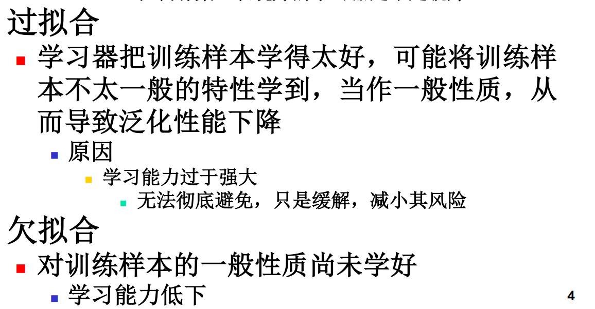

# 机器学习

## 10.1 机器学习复习-基本概念

### 分类、回归的概念区别

**分类：**预测数据属于哪一个离散的类别，是定性的，输出的是 **离散的，预设的类别**

**回归：**预测连续数据的数值，是定量的，输出的是 **连续的数值**，回归的目的是建立 **变量与输出数值之间的映射关系**

**对比：**

| **维度**     | **分类 (Classification)**                                  | **回归 (Regression)**                                    |
| ------------ | ---------------------------------------------------------- | -------------------------------------------------------- |
| **输出变量** | 离散的标签（如：是/否，猫/狗/鸟）                          | 连续的数值（如：15.5, 1000, 3.14）                       |
| **预测目的** | 寻找**决策边界**来区分不同类别                             | 寻找**最佳拟合线**来预测具体数值                         |
| **评价指标** | 准确率 (Accuracy)、精确率 (Precision)、F1分数、混淆矩阵    | 均方误差 (MSE)、平均绝对误差 (MAE)、$R^2$ 分数           |
| **常见算法** | 逻辑回归 (Logistic Regression)、支持向量机 (SVM)、随机森林 | 线性回归 (Linear Regression)、岭回归、SVR (支持向量回归) |

**相同点：**两者都属于监督学习，部分算法可以通用，在部分条件下两者也可以互相转换

---

### 训练集、验证集、测试集

**一、核心概念**

训练集：用于训练模型的数据，主要用途是学习模型参数、调整权重，参与模型训练。

验证集：用于模型选择的数据，主要用途是比较不同模型、调优超参数、防止过拟合，不参与模型训练。

测试集：用于最终评估的数据，主要用途是评估模型泛化能力、提供客观性能报告，不参与模型训练。

**二、数据划分比例**

数据充足时（>10万样本）：
 - 训练集：70%
 - 验证集：15%
 - 测试集：15%

数据适中时（1万-10万样本）：
 - 训练集：60%
 - 验证集：20%
 - 测试集：20%

数据稀缺时（<1万样本）：
 - 使用交叉验证
 - 保留10%-20%作为测试集

**三、使用流程**

1. 原始数据
2. 随机划分（训练集/验证集/测试集）
3. 循环训练阶段（使用训练集）：尝试不同模型、尝试不同超参数、每次训练后用验证集评估、选择验证集表现最好的模型
4. 最终测试阶段（使用测试集）：用测试集评估选出的最优模型、得到最终性能报告、测试集只能使用一次

**四、关键原则**

1. 独立性：三个集合必须完全独立，不能有数据重叠
2. 随机性：随机打乱数据后划分，确保分布均匀
3. 代表性：每个集合都要反映真实数据分布
4. 测试集纯洁性：测试集绝对不能参与任何训练或调优

**五、常见错误**

❌ 只用训练集和测试集 → 缺少验证集，无法调参

❌ 根据测试集调整模型 → 导致测试集泄露，评估结果不客观

❌ 数据分布不一致 → 训练集和测试集分布差异大，评估不可靠

❌ 多次使用测试集 → 测试集变成了验证集，失去评估意义

**六、比喻理解**

训练集 = 课本和作业
 - 反复练习，学习知识
 - 调整学习方法

验证集 = 模拟考试
 - 检验学习效果
 - 找出薄弱环节
 - 调整复习策略

测试集 = 期末考试
 - 只有一次机会
 - 不能根据结果改试卷
 - 反映真实水平

**七、进阶方法**

交叉验证：
 - 将数据分成K份
 - 每次用K-1份训练，1份验证
 - 重复K次，取平均
 - 适合小数据集

优点：
 - 充分利用数据
 - 评估更稳定
 - 减少随机性影响

**八、评估指标**

分类任务：
 - 训练集/验证集/测试集：准确率、精确率、召回率、F1分数

回归任务：
 - 训练集/验证集/测试集：均方误差(MSE)、均方根误差(RMSE)、R²

关键观察：
 - 训练集表现好，验证集表现差 → 过拟合
 - 训练集和验证集都表现差 → 欠拟合
 - 训练集和验证集表现接近且都好 → 模型良好

**九、核心要点总结**

✅ 训练集：用来学习，多次使用

✅ 验证集：用来选择，多次使用

✅ 测试集：用来评估，仅用一次

✅ 顺序：训练 → 验证（选模型）→ 测试（评性能）

✅ 原则：测试集必须保持"不可见"，直到最后一步

---

### 监督学习、非监督学习

**监督学习**

定义：训练数据包含输入特征和对应的标签（答案），模型通过学习输入-输出映射关系来预测新数据的标签。

特点：
- 有标注数据（有老师教）
- 目标明确：预测离散类别（分类）或连续值（回归）
- 性能易于评估（准确率、均方误差等）

典型算法：
- 线性回归、逻辑回归
- 支持向量机（SVM）
- 决策树、随机森林
- 神经网络

应用场景：
- 图像识别（猫/狗分类）
- 垃圾邮件检测
- 房价预测
- 手写数字识别

**非监督学习**

定义：训练数据只有输入特征，没有标签。模型需要自动发现数据中的结构、模式或规律。

特点：
- 无标注数据（无老师教）
- 目标是探索数据内在结构
- 性能评估较主观（聚类质量、数据压缩效果等）

典型算法：
- K-means 聚类
- 层次聚类
- 主成分分析（PCA）
- 自编码器

应用场景：
- 客户分群
- 异常检测
- 数据降维
- 推荐系统

**核心区别**

| 维度 | 监督学习 | 非监督学习 |
|------|---------|-----------|
| 数据标签 | 有标签 | 无标签 |
| 学习目标 | 预测输出 | 发现模式 |
| 反馈机制 | 明确对错 | 无明确反馈 |
| 应用复杂度 | 目标明确 | 探索性强 |

---

### 回归问题、分类问题

---

### 欠拟合、过拟合



**欠拟合**

定义：模型太简单，无法捕捉数据中的基本规律，在训练集和测试集上都表现很差。

表现：
- 训练集误差很高
- 测试集误差也很高
- 模型能力不足，学不到数据的基本模式

原因：
- 模型复杂度过低（如用线性模型拟合非线性数据）
- 特征数量不足
- 训练时间不够
- 正则化过强

解决方法：
- 增加模型复杂度（如从线性模型改为多项式模型）
- 增加特征数量或特征工程
- 减少正则化强度
- 延长训练时间

比喻：学生太懒，连课本知识都没掌握，考试自然不及格。

**过拟合**

定义：模型太复杂，过度拟合训练数据的噪声和细节，导致在训练集上表现很好，但在测试集上表现很差。

表现：
- 训练集误差很低（甚至接近0）
- 测试集误差很高
- 训练集和测试集误差差距很大

原因：
- 模型复杂度过高（参数太多）
- 训练数据太少
- 训练时间过长
- 数据噪声太大

解决方法：
- 减少模型复杂度（如减少神经网络层数、减少决策树深度）
- 增加训练数据量
- 使用正则化（L1/L2正则化）
- 早停法
- Dropout（神经网络）
- 交叉验证

比喻：学生死记硬背，把课本背得滚瓜烂熟，但遇到新题目就不会了。

**对比总结**

| 维度 | 欠拟合 | 过拟合 |
|------|--------|--------|
| 模型复杂度 | 太低 | 太高 |
| 训练集表现 | 差 | 很好 |
| 测试集表现 | 差 | 差 |
| 泛化能力 | 差 | 差 |
| 误差差距 | 小 | 大 |
| 解决方向 | 增加复杂度 | 减少复杂度 |

**判断方法**

**训练集误差 vs 验证集误差**：

| 训练集误差 | 验证集误差 | 结论 |
|-----------|-----------|------|
| 高 | 高 | 欠拟合 |
| 低 | 高 | 过拟合 |
| 低 | 低 | 模型良好（两者接近且都低） |
| 高 | 低 | 数据有问题（检查数据划分） |

**偏差-方差权衡**

**欠拟合** = 高偏差、低方差
- 模型对数据的假设太强，无法拟合真实分布

**过拟合** = 低偏差、高方差
- 模型对训练数据太敏感，对噪声过度反应

**目标**：找到偏差和方差的最佳平衡点，使总误差最小。

---

### 泛化

**定义**

泛化是指模型在训练集上学到的知识和规律，能够很好地应用到**未见过的测试数据**上的能力。简单来说，就是举一反三的能力。

**核心思想**

- **训练集**：模型学习的"课本"
- **测试集**：模型面临的"新题目"
- **泛化能力**：模型是否能用学到的知识解决新问题

**为什么泛化很重要**

1. **实际应用需求**：模型最终要处理真实世界的新数据
2. **避免死记硬背**：不能只记住训练数据，要学到规律
3. **评估模型价值**：泛化能力是衡量模型好坏的核心标准

**影响泛化能力的因素**

| 因素 | 对泛化的影响 |
|------|-------------|
| 模型复杂度 | 过低→欠拟合，过高→过拟合 |
| 训练数据量 | 数据越多，泛化通常越好 |
| 数据质量 | 噪声少、分布均匀的数据更有利于泛化 |
| 特征工程 | 好的特征能提升泛化能力 |
| 正则化 | 适当的正则化能改善泛化 |

**泛化与过/欠拟合的关系**

```
泛化能力

    ↑
    │          ┌─────┐
    │         ╱       ╲
    │        ╱   最优   ╲
    │       ╱   泛化点   ╲
    │      ╱             ╲
    │     ╱               ╲
    │    ╱                 ╲
    │   ╱                   ╲
    │  ╱                     ╲
    │ ╱                       ╲
    │╱                         ╲
    └──────────────────────────────→ 模型复杂度
     欠拟合区        过拟合区
```

- **欠拟合**：模型太简单，泛化能力差（学不到规律）
- **过拟合**：模型太复杂，泛化能力差（记住了噪声）
- **最优泛化**：在偏差和方差之间找到平衡

**如何提升泛化能力**

1. **增加训练数据**：更多样化的数据让模型学到更普遍的规律
2. **使用验证集**：监控泛化能力，及时调整模型
3. **正则化**：L1/L2正则化防止过拟合
4. **交叉验证**：更可靠地评估泛化性能
5. **特征选择**：去除冗余特征，保留关键信息
6. **集成学习**：Bagging、Boosting等方法提升泛化
7. **早停法**：在验证集性能开始下降时停止训练

**泛化误差的组成**

泛化误差 = **偏差** + **方差** + **噪声**

- **偏差**：模型假设与真实情况的差距（欠拟合时高）
- **方差**：模型对训练数据变化的敏感度（过拟合时高）
- **噪声**：数据本身的不可消除误差

**目标**：最小化偏差和方差，使泛化误差最小。

**举例说明**

**好的泛化**：
- 训练：识别100张猫的照片
- 测试：能识别从未见过的猫的照片 ✓

**差的泛化**：
- 训练：识别100张猫的照片
- 测试：只能识别那100张训练过的猫，新猫识别不了 ✗

**比喻理解**

- **泛化能力强的学生**：掌握了数学原理，能解各种新题型
- **泛化能力弱的学生**：只会做练习册上的题，换个数字就不会了

泛化是机器学习的终极目标，我们训练模型不是为了记住训练数据，而是为了学会处理新数据的能力。

---

### 概率与频率的关系

**频率学派观点**

频率学派认为概率是事件在大量重复独立试验中出现的相对频率的极限值。当试验次数趋于无穷大时，频率收敛于概率。

**贝叶斯学派观点**

贝叶斯学派认为概率是对事件发生可能性的主观信念或不确定性度量，可以通过先验信息和观测数据来更新。

**关系**

- 频率学派：概率 = 长期频率，适用于可重复试验
- 贝叶斯学派：概率 = 信念程度，适用于一次性事件
- 在大样本情况下，两者往往给出相似的结论

**在机器学习中的应用**

- 频率学派：极大似然估计、置信区间、假设检验
- 贝叶斯学派：贝叶斯估计、后验概率、先验分布

---

### 独立同分布

**定义**

独立同分布是概率论和统计学中的一个重要概念，包含两个核心要素：

1. **独立性**：样本之间相互独立，一个样本的取值不影响其他样本的取值
2. **同分布**：所有样本来自同一个概率分布

**数学表示**

设样本集 D = {x₁, x₂, ..., xₘ}，如果满足：
- P(xᵢ | x₁, x₂, ..., xᵢ₋₁, xᵢ₊₁, ..., xₘ) = P(xᵢ) （独立性）
- P(x₁) = P(x₂) = ... = P(xₘ) （同分布）

则称样本集 D 满足独立同分布假设。

**在机器学习中的重要性**

1. **训练假设**：大多数机器学习算法都假设训练样本是独立同分布的
2. **泛化能力**：独立同分布假设是模型泛化能力的基础
3. **理论推导**：许多学习算法的理论证明都依赖于独立同分布假设

**违反独立同分布的后果**

- 过拟合风险增加
- 泛化性能下降
- 理论保证失效

**常见违反情况**

- 时间序列数据（样本间存在时间依赖）
- 空间数据（样本间存在空间相关性）
- 社交网络数据（样本间存在社交关系）

---

### 先验概率，后验概率

**先验概率 P(c)**

定义：在观察到任何数据之前，对事件或类别发生可能性的预先估计。

特点：
- 基于先验知识、经验或假设
- 不依赖于当前观测数据
- 反映了我们对事件的基本信念

例子：
- 在西瓜分类中，好瓜和坏瓜的先验概率可能是 P(好瓜) = 0.6，P(坏瓜) = 0.4
- 在疾病诊断中，某种疾病的先验概率可能是基于该疾病在人群中的发病率

**后验概率 P(c|x)**

定义：在观察到数据 x 之后，对事件或类别发生可能性的更新估计。

特点：
- 基于观测数据和先验概率
- 通过贝叶斯定理计算得到
- 反映了数据对信念的更新

**贝叶斯定理**

P(c|x) = P(x|c) × P(c) / P(x)

其中：
- P(c|x)：后验概率
- P(x|c)：似然概率（类条件概率）
- P(c)：先验概率
- P(x)：证据因子（归一化常数）

**在机器学习中的应用**

1. **贝叶斯分类器**：基于后验概率进行分类决策
2. **参数估计**：通过贝叶斯估计更新对参数的信念
3. **不确定性量化**：用概率表示预测的不确定性

**先验概率的选择**

- 均匀先验：对所有类别赋予相同的先验概率
- 经验先验：基于领域知识或历史数据设定
- 共轭先验：数学上便于计算的形式

---

### 朴素贝叶斯

**基本思想**

朴素贝叶斯分类器是基于贝叶斯定理和特征条件独立假设的分类方法。

**核心假设：属性条件独立性**

假设所有属性在给定类别下相互独立，即：
P(x|c) = P(x₁|c) × P(x₂|c) × ... × P(x_d|c)

其中 x = (x₁, x₂, ..., x_d) 是包含 d 个属性的样本。

**分类决策规则**

h_nb(x) = arg max P(c) × ∏ P(xᵢ|c)
          c∈Y

即选择使后验概率最大的类别作为预测结果。

**概率估计**

1. **先验概率 P(c)**

P(c) = |D_c| / |D|

其中 D_c 是训练集中类别为 c 的样本集合，D 是整个训练集。

2. **条件概率 P(xᵢ|c)**

**离散属性**：
P(xᵢ = aᵢⱼ|c) = |D_c,xᵢ=aᵢⱼ| / |D_c|

其中 D_c,xᵢ=aᵢⱼ 是类别为 c 且第 i 个属性取值为 aᵢⱼ 的样本集合。

**连续属性**：
假设服从高斯分布 N(μ, σ²)
P(xᵢ|c) = (1/√(2π)σ) × exp(-(xᵢ-μ)²/(2σ²))

**拉普拉斯修正**

为避免零概率问题，对概率估计进行平滑：

P(c) = (|D_c| + 1) / (|D| + N)
P(xᵢ = aᵢⱼ|c) = (|D_c,xᵢ=aᵢⱼ| + 1) / (|D_c| + Nᵢ)

其中 N 是类别数，Nᵢ 是第 i 个属性的可能取值数。

**优点**

1. 理论基础扎实，基于概率论
2. 对缺失数据不敏感
3. 算法简单，易于实现
4. 在文本分类等任务中表现良好
5. 训练和预测速度快

**缺点**

1. 属性独立性假设在实际中往往不成立
2. 对输入数据的形式敏感
3. 需要知道先验概率

**应用场景**

- 文本分类（垃圾邮件检测、新闻分类）
- 情感分析
- 医疗诊断
- 推荐系统

**半朴素贝叶斯**

为缓解朴素贝叶斯的独立性假设过强的问题，半朴素贝叶斯允许属性间存在一定的依赖关系：

- 独依赖估计（ODE）：每个属性依赖于一个其他属性
- 树增强朴素贝叶斯（TAN）：用最大生成树表示属性依赖
- 平均独依赖估计（AODE）：集成多个ODE模型

---

### 熵

**信息熵**

信息熵是度量随机变量不确定性的指标，由香农提出。

**定义**

对于离散随机变量 X，其概率分布为 P(X = xₖ) = pₖ，则信息熵定义为：

H(X) = -∑ pₖ log₂ pₖ

**性质**

1. 非负性：H(X) ≥ 0
2. 上界：H(X) ≤ log₂|X|，当且仅当均匀分布时取等号
3. 对称性：熵的值与概率分布的排列顺序无关
4. 确定性：当某个事件概率为1时，熵为0

**直观理解**

- 熵越大，不确定性越大
- 熵越小，确定性越大
- 熵为0时，完全确定
- 熵最大时，完全不确定（均匀分布）

**条件熵**

H(Y|X) = -∑ p(x)∑ p(y|x) log₂ p(y|x)

表示在已知随机变量 X 的情况下，随机变量 Y 的不确定性。

**互信息**

I(X;Y) = H(Y) - H(Y|X)

表示两个随机变量之间的相互依赖程度。

**在机器学习中的应用**

1. **决策树**：信息增益 = 熵减
2. **特征选择**：选择信息增益大的特征
3. **聚类评估**：衡量聚类的纯度
4. **模型评估**：评估预测的不确定性

### 连续分布的最大熵是什么

**最大熵原理**

在满足已知约束条件下，选择熵最大的概率分布作为最佳估计。这体现了"在已知信息之外不做任何假设"的原则。

**连续分布的最大熵**

对于连续随机变量，在不同约束条件下，最大熵分布不同：

**1. 无约束（仅归一化约束）**

约束：∫ p(x) dx = 1

最大熵分布：均匀分布

p(x) = 1/(b-a), x ∈ [a,b]

熵：H = ln(b-a)

**2. 给定均值约束**

约束：∫ p(x) dx = 1, ∫ x p(x) dx = μ

最大熵分布：指数分布

p(x) = λe^(-λx), x ≥ 0

其中 λ = 1/μ

**3. 给定均值和方差约束**

约束：∫ p(x) dx = 1, ∫ x p(x) dx = μ, ∫ (x-μ)² p(x) dx = σ²

最大熵分布：高斯分布（正态分布）

p(x) = (1/√(2π)σ) × exp(-(x-μ)²/(2σ²))

熵：H = ln(√(2πe)σ)

**4. 给定均值和正值约束**

约束：∫ p(x) dx = 1, ∫ x p(x) dx = μ, x > 0

最大熵分布：指数分布

**意义**

- 高斯分布是自然界中最常见的分布之一
- 最大熵原理为选择概率分布提供了理论依据
- 在机器学习中，正态分布常作为先验假设

---

### 回归分析法, 回归方程

**回归分析**

回归分析是研究变量之间数量关系的一种统计方法，用于预测连续值的输出。

**基本概念**

- **自变量（解释变量）**：用于预测的输入变量
- **因变量（被解释变量）**：需要预测的输出变量
- **回归方程**：描述自变量和因变量之间关系的数学表达式

**回归方程的一般形式**

y = f(x) + ε

其中：
- y：因变量
- x：自变量（可以是向量）
- f(x)：回归函数
- ε：误差项（随机噪声）

**线性回归方程**

**一元线性回归**

y = w x + b

其中：
- w：斜率（回归系数）
- b：截距

**多元线性回归**

y = w₁x₁ + w₂x₂ + ... + w_dx_d + b = wᵀx + b

其中：
- w = (w₁, w₂, ..., w_d)ᵀ：权重向量
- x = (x₁, x₂, ..., x_d)ᵀ：特征向量
- b：偏置项

**参数求解**

**最小二乘法**

目标是使预测值与真实值的误差平方和最小：

min ∑(yᵢ - ŷᵢ)²

其中 ŷᵢ = f(xᵢ) 是预测值。

**一元线性回归的参数估计**

w = ∑(xᵢ - x̄)(yᵢ - ȳ) / ∑(xᵢ - x̄)²
b = ȳ - w x̄

**多元线性回归的参数估计**

ŵ = (XᵀX)⁻¹ Xᵀ y

其中 X 是设计矩阵，y 是目标向量。

**回归方程的评估指标**

1. **均方误差（MSE）**

   MSE = (1/m)∑(yᵢ - ŷᵢ)²

2. **均方根误差（RMSE）**

   RMSE = √MSE

3. **平均绝对误差（MAE）**

   MAE = (1/m)∑|yᵢ - ŷᵢ|

4. **决定系数（R²）**

   R² = 1 - ∑(yᵢ - ŷᵢ)² / ∑(yᵢ - ȳ)²

**回归分析的应用**

1. **预测**：根据自变量预测因变量的值
2. **解释**：分析自变量对因变量的影响程度
3. **控制**：通过控制自变量来影响因变量
4. **检验**：检验变量之间的关系是否显著

**回归分析的假设**

1. **线性假设**：自变量和因变量之间呈线性关系
2. **独立性假设**：误差项相互独立
3. **同方差性假设**：误差项的方差恒定
4. **正态性假设**：误差项服从正态分布

### 类别不平衡问题

**定义**

类别不平衡问题是指在分类任务中，不同类别的训练样本数目差别很大的情况。例如：正例100个，反例10000个。

**影响**

1. **模型偏向**：模型倾向于预测多数类，忽略少数类

2. **评估困难**：准确率等指标可能具有误导性

3. **泛化能力下降**：模型在少数类上的性能较差

**解决思路**

**1. 再缩放（阈值移动）**

基于训练集观测几率调整决策阈值：

若训练集中正例数 m⁺，反例数 m⁻，则观测几率为 m⁺/m⁻

决策规则：

若 y/(1-y) > m⁺/m⁻，则预测为正例

等价于：

若 y > m⁺/(m⁺ + m⁻)，则预测为正例

**2. 欠采样**

**方法**：去除一些反例，使正反例数目接近

**优点**：

- 训练时间开销小

- 减少计算量

**缺点**：

- 可能丢失重要信息

- 可能导致模型欠拟合

**常用方法**：

- 随机欠采样
- EasyEnsemble（集成多个欠采样子集）
- BalanceCascade（级联欠采样）

**3. 过采样**

**方法**：增加一些正例，使正反例数目接近

**优点**：

- 保留所有样本信息
- 不丢失反例信息

**缺点**：

- 训练时间开销大
- 简单重复采样可能导致过拟合

**常用方法**：

- 随机过采样
- SMOTE（合成少数类过采样技术）：通过插值生成新的正例
- ADASYN（自适应合成采样）

**4. 阈值移动**

**方法**：基于原始训练集进行学习，在决策过程中嵌入阈值调整

**优点**：

- 不改变训练数据分布
- 实现简单

**缺点**：

- 需要准确估计真实几率
- 训练集可能不是无偏采样

**5. 代价敏感学习**

**方法**：为不同类别的错误赋予不同的代价

**代价矩阵**：

- 将正例误分为反例的代价：cost₀₁
- 将反例误分为正例的代价：cost₁₀

**决策规则**：

若 P(y=1|x) × cost₀₁ > P(y=0|x) × cost₁₀，则预测为正例

**6. 集成方法**

**方法**：使用集成学习技术处理不平衡问题

**常用方法**：

- Balanced Random Forest
- EasyEnsemble
- RUSBoost（随机欠采样 + Boosting）

**评估指标**

对于类别不平衡问题，不能仅使用准确率，应使用：

1. **精确率（Precision）**：TP / (TP + FP)
2. **召回率（Recall）**：TP / (TP + FN)
3. **F1分数**：2 × Precision × Recall / (Precision + Recall)
4. **AUC-ROC**：ROC曲线下面积
5. **混淆矩阵**：详细展示各类别的预测情况

**选择策略**

- 数据量大：考虑欠采样
- 数据量小：考虑过采样
- 关注少数类：使用召回率、F1分数评估
- 关注整体性能：使用AUC-ROC评估

### 信息增益的缺陷

**信息增益的定义**

信息增益（Information Gain）用于衡量使用某个属性进行划分后，数据集纯度的提升程度：

Gain(D, a) = Ent(D) - Σ |Dᵥ|/|D| × Ent(Dᵥ)

其中：
- Ent(D)：数据集D的信息熵
- Dᵥ：属性a取值为v的子集

**主要缺陷**

**1. 偏向于可取值数目较多的属性**

**问题**：
- 如果某个属性的可取值数目很多，将该属性用于划分可能产生很多分支
- 每个分支可能只包含少量样本，甚至每个分支只包含一个样本
- 这样的分支纯度极高，信息增益很大
- 但这样的决策树泛化能力差，无法对新样本进行有效预测

**例子**：
- 假设有一个"编号"属性，每个样本的编号都不同
- 用"编号"划分，每个分支只包含一个样本，信息熵为0
- 信息增益达到最大值，但这样的划分毫无意义

**2. 过拟合风险**

**问题**：
- 信息增益倾向于选择能产生最多分支的属性
- 这会导致决策树分支过多，模型过于复杂
- 训练集上表现很好，但测试集上泛化能力差

**3. 计算效率问题**

**问题**：
- 对于可取值很多的属性，计算信息增益需要遍历所有可能的取值
- 计算开销较大

**解决方案**

**1. 增益率（Gain Ratio）**

**定义**：
Gain_ratio(D, a) = Gain(D, a) / IV(a)

其中 IV(a) 是属性a的固有值：
IV(a) = -Σ |Dᵥ|/|D| × log₂(|Dᵥ|/|D|)

**特点**：
- 增益率考虑了属性的可取值数目
- 对可取值数目较少的属性有所偏好
- C4.5算法使用增益率

**2. 基尼指数（Gini Index）**

**定义**：
Gini(D) = 1 - Σ pₖ²

其中 pₖ 是第k类样本的比例。

**特点**：
- CART算法使用基尼指数
- 对可取值数目较多的属性没有明显偏好
- 计算效率较高

**3. 正则化**

**方法**：
- 在信息增益的基础上添加惩罚项
- 惩罚项与属性的可取值数目相关
- 平衡信息增益和模型复杂度

**4. 剪枝**

**方法**：
- 使用信息增益生成完整的决策树
- 通过预剪枝或后剪枝去除不必要的分支
- 降低过拟合风险

**总结**

信息增益虽然直观易懂，但对可取值数目较多的属性存在偏好。在实际应用中，需要根据具体问题选择合适的划分准则，并结合剪枝等技术来提高模型的泛化能力。

---

## 10.2 机器学习复习-基本问题

### 机器学习的基本过程、三要素

**基本过程**

机器学习的基本过程可以概括为以下几个步骤：

**1. 数据收集与预处理**

- 收集训练数据
- 数据清洗（处理缺失值、异常值）
- 特征工程（特征选择、特征变换）
- 数据归一化/标准化

**2. 模型选择**

- 选择合适的学习算法
- 确定模型的结构和参数
- 定义假设空间

**3. 模型训练**

- 使用训练数据训练模型
- 通过学习算法优化模型参数
- 最小化损失函数

**4. 模型评估**

- 使用验证集评估模型性能
- 计算评估指标（准确率、精确率、召回率等）
- 分析模型的泛化能力

**5. 模型优化**

- 调整超参数
- 使用正则化防止过拟合
- 采用集成学习等方法提升性能

**6. 模型部署**

- 在实际环境中应用模型
- 监控模型性能
- 定期更新模型

**三要素**

机器学习的三要素是指：模型、策略、算法。

**1. 模型**

**定义**：
模型是所要学习的条件概率分布或决策函数。

**类型**：
- **概率模型**：学习条件概率分布 P(y|x)
  - 如：朴素贝叶斯、高斯混合模型、隐马尔可夫模型
- **非概率模型**：学习决策函数 y = f(x)
  - 如：决策树、支持向量机、神经网络

**表示**：
模型的表示方法决定了假设空间的大小和结构。

**2. 策略**

**定义**：
策略是按照什么样的准则学习或选择最优的模型。

**核心**：损失函数和风险最小化。

**损失函数**：
度量模型一次预测的好坏。

常用损失函数：
- **0-1损失函数**：L(y, f(x)) = 1, y ≠ f(x); 0, y = f(x)
- **平方损失函数**：L(y, f(x)) = (y - f(x))²
- **绝对损失函数**：L(y, f(x)) = |y - f(x)|
- **对数损失函数**：L(y, f(x)) = -log P(y|x)

**风险函数**：
度量模型平均预测的好坏。

- **经验风险**：R_emp(f) = (1/m)∑ L(yᵢ, f(xᵢ))
- **期望风险**：R_exp(f) = E_P[L(Y, f(X))]

**风险最小化**：
- **经验风险最小化（ERM）**：min R_emp(f)
- **结构风险最小化（SRM）**：min R_emp(f) + λJ(f)
  其中 J(f) 表示模型的复杂度，λ 是正则化系数。

**3. 算法**

**定义**：
算法是学习模型的具体计算方法。

**目标**：
找到使损失函数最小化的模型参数。

**常用算法**：
- **梯度下降法**：沿梯度方向迭代更新参数
- **牛顿法**：利用二阶导数信息加速收敛
- **坐标下降法**：每次更新一个参数
- **期望最大化（EM）算法**：处理隐变量的迭代算法
- **随机梯度下降（SGD）**：每次使用一个样本更新参数

**三要素的关系**

```
数据 → 模型（假设空间） → 策略（损失函数/风险最小化） → 算法（优化方法） → 最终模型
```

**总结**

- **模型**：定义了学习的内容和形式
- **策略**：定义了学习的目标和准则
- **算法**：定义了学习的具体实现方法

三要素相互配合，共同完成机器学习任务。在实际应用中，需要根据具体问题选择合适的模型、策略和算法。

### 最大似然估计

**基本思想**

最大似然估计是一种参数估计方法，其核心思想是：在已知样本观测值的情况下，找到使这些样本出现概率最大的参数值。

**数学定义**

给定数据集 D = {x₁, x₂, ..., xₘ}，假设样本独立同分布，概率密度函数为 p(x;θ)，其中 θ 是待估计的参数。

**似然函数**

L(θ) = P(D|θ) = ∏ p(xᵢ;θ)

表示在参数 θ 下，观测到数据集 D 的概率。

**对数似然函数**

为避免数值下溢和便于计算，通常取对数：

ℓ(θ) = log L(θ) = ∑ log p(xᵢ;θ)

**最大似然估计**

θ̂ = argmax L(θ) = argmax ℓ(θ)
      θ          θ

即找到使似然函数最大的参数值。

**求解步骤**

**1. 构建似然函数**

根据概率分布形式，写出似然函数。

**2. 取对数**

将似然函数转换为对数似然函数。

**3. 求导**

对参数 θ 求导，令导数为0。

**4. 解方程**

求解方程组，得到参数估计值。

**例子：高斯分布的参数估计**

假设样本服从高斯分布 N(μ, σ²)，估计 μ 和 σ²。

**似然函数**：
L(μ, σ²) = ∏ (1/√(2π)σ) × exp(-(xᵢ-μ)²/(2σ²))

**对数似然函数**：
ℓ(μ, σ²) = -m/2 × log(2π) - m × log σ - ∑ (xᵢ-μ)²/(2σ²)

**求导并令为0**：
∂ℓ/∂μ = (1/σ²)∑ (xᵢ-μ) = 0
∂ℓ/∂σ² = -m/(2σ²) + ∑ (xᵢ-μ)²/(2σ⁴) = 0

**解得**：
μ̂ = (1/m)∑ xᵢ
σ̂² = (1/m)∑ (xᵢ-μ̂)²

**优点**

1. 理论基础扎实，有良好的统计性质
2. 渐近无偏、渐近有效
3. 计算相对简单
4. 广泛应用于各种概率模型

**缺点**

1. 需要知道数据的概率分布形式
2. 对异常值敏感
3. 可能陷入局部最优
4. 小样本情况下估计可能不准确

**在机器学习中的应用**

1. **参数估计**：估计概率模型的参数
2. **分类问题**：逻辑回归的参数估计
3. **聚类问题**：高斯混合模型的参数估计
4. **隐变量模型**：通过EM算法进行最大似然估计

**与贝叶斯估计的区别**

- **最大似然估计**：将参数视为固定值，寻找最优参数
- **贝叶斯估计**：将参数视为随机变量，有先验分布，计算后验分布

**注意事项**

1. 确保似然函数是凸函数，否则可能存在多个局部最优解
2. 对于复杂模型，可能需要使用数值优化方法
3. 注意数值稳定性问题

### 最小二乘法

**基本思想**

最小二乘法是一种数学优化技术，它通过最小化误差的平方和来寻找数据的最佳函数匹配。

**数学定义**

给定数据集 D = {(x₁, y₁), (x₂, y₂), ..., (xₘ, yₘ)}，目标是找到函数 f(x) 使得：

min ∑ (yᵢ - f(xᵢ))²

即最小化预测值与真实值之间的误差平方和。

**线性回归中的最小二乘法**

**一元线性回归**

模型：y = w x + b

目标函数：
J(w, b) = ∑ (yᵢ - (w xᵢ + b))²

**求解**：

对 w 和 b 分别求偏导，令偏导为0：

∂J/∂w = -2∑ xᵢ(yᵢ - w xᵢ - b) = 0
∂J/∂b = -2∑ (yᵢ - w xᵢ - b) = 0

解得：
w = ∑(xᵢ - x̄)(yᵢ - ȳ) / ∑(xᵢ - x̄)²
b = ȳ - w x̄

其中 x̄ = (1/m)∑ xᵢ，ȳ = (1/m)∑ yᵢ

**多元线性回归**

模型：y = w₁x₁ + w₂x₂ + ... + w_dx_d + b = wᵀx + b

矩阵形式：Y = Xw + b

其中：
- Y = (y₁, y₂, ..., yₘ)ᵀ
- X 是 m×(d+1) 的设计矩阵
- w = (w₁, w₂, ..., w_d, b)ᵀ

目标函数：
J(w) = (Y - Xw)ᵀ(Y - Xw)

**求解**：

求导并令为0：
∂J/∂w = -2Xᵀ(Y - Xw) = 0

解得：
ŵ = (XᵀX)⁻¹ Xᵀ Y

**几何解释**

最小二乘法在几何上寻找的是数据点到回归直线的垂直距离的平方和最小。

**特点**

1. **最优性**：在误差服从正态分布的假设下，最小二乘估计是最大似然估计
2. **计算简单**：有解析解
3. **直观**：误差平方和易于理解

**优点**

1. 计算简单，有解析解
2. 理论基础扎实
3. 在误差服从正态分布时是最优估计
4. 广泛应用于回归分析

**缺点**

1. 对异常值敏感
2. 假设误差是同方差的
3. 可能出现多重共线性问题
4. XᵀX 可能不可逆

**改进方法**

**1. 加权最小二乘法**

目标函数：
J(w) = ∑ wᵢ(yᵢ - f(xᵢ))²

其中 wᵢ 是权重，用于处理异方差性。

**2. 岭回归**

目标函数：
J(w) = ∑ (yᵢ - f(xᵢ))² + λ∑ wⱼ²

通过添加L2正则化项解决多重共线性问题。

**3. Lasso回归**

目标函数：
J(w) = ∑ (yᵢ - f(xᵢ))² + λ∑ |wⱼ|

通过添加L1正则化项实现特征选择。

**在机器学习中的应用**

1. **线性回归**：预测连续值
2. **多项式回归**：拟合非线性关系
3. **局部加权回归**：处理非线性问题
4. **正则化**：防止过拟合

**与最大似然估计的关系**

在误差项服从正态分布 N(0, σ²) 的假设下，最小二乘法等价于最大似然估计。

**注意事项**

1. 确保数据满足线性假设
2. 检查多重共线性问题
3. 处理异常值
4. 验证模型的假设条件

### 过拟合的解决办法

**过拟合的定义**

过拟合是指模型在训练集上表现很好，但在测试集上表现很差的现象。模型过于复杂，过度拟合了训练数据中的噪声和细节。

**过拟合的特征**

1. 训练误差很低（甚至接近0）
2. 测试误差很高
3. 训练误差和测试误差差距很大

**解决办法**

**1. 增加训练数据量**

**原理**：
- 更多数据能让模型学到更普遍的规律
- 减少噪声对模型的影响

**方法**：
- 收集更多训练样本
- 数据增强（图像翻转、旋转、裁剪等）
- 合成数据

**2. 正则化**

**L1正则化（Lasso）**：
目标函数：J(w) + λ∑ |wⱼ|
效果：产生稀疏解，实现特征选择

**L2正则化（岭回归）**：
目标函数：J(w) + λ∑ wⱼ²
效果：权重衰减，防止权重过大

**Elastic Net**：
目标函数：J(w) + λ₁∑ |wⱼ| + λ₂∑ wⱼ²
效果：结合L1和L2的优点

**3. 特征选择**

**方法**：
- 过滤法：根据统计指标选择特征
- 包裹法：根据模型性能选择特征
- 嵌入法：在模型训练过程中选择特征

**目的**：
- 去除冗余特征
- 保留关键信息
- 降低模型复杂度

**4. 降维**

**方法**：
- PCA（主成分分析）
- LDA（线性判别分析）
- t-SNE
- 自编码器

**目的**：
- 减少特征数量
- 保留主要信息
- 降低过拟合风险

**5. 早停法**

**原理**：
- 在训练过程中监控验证集误差
- 当验证集误差开始上升时停止训练

**实现**：
- 训练集用于更新参数
- 验证集用于监控性能
- 保存验证集误差最小的模型

**6. Dropout（神经网络专用）**

**原理**：
- 训练时随机丢弃一部分神经元
- 测试时使用所有神经元

**效果**：
- 防止神经元过度依赖特定特征
- 提高模型泛化能力

**7. 集成学习**

**方法**：
- Bagging：并行训练多个模型，平均预测结果
- Boosting：串行训练多个模型，加权组合预测结果
- 随机森林：Bagging + 随机特征选择

**效果**：
- 降低方差
- 提高泛化能力

**8. 交叉验证**

**方法**：
- k折交叉验证
- 留一法
- 分层交叉验证

**目的**：
- 更准确地评估模型性能
- 选择最优模型和参数

**9. 简化模型结构**

**方法**：
- 减少神经网络层数
- 减少神经元数量
- 降低决策树深度
- 减少多项式回归的阶数

**目的**：
- 降低模型复杂度
- 减少过拟合风险

**10. 数据预处理**

**方法**：
- 归一化/标准化
- 处理异常值
- 去除噪声
- 特征缩放

**目的**：
- 提高训练稳定性
- 减少异常值影响

**11. 使用验证集**

**方法**：
- 将数据分为训练集、验证集、测试集
- 训练集用于训练模型
- 验证集用于选择模型和调整参数
- 测试集用于最终评估

**目的**：
- 避免测试集泄露
- 客观评估模型性能

**12. 贝叶斯方法**

**原理**：
- 将参数视为随机变量
- 使用先验分布约束参数

**效果**：
- 防止参数过大
- 提高模型泛化能力

**选择策略**

根据具体情况选择合适的解决方法：

1. **数据量小**：正则化、降维、简化模型
2. **数据量大**：增加数据、早停法
3. **神经网络**：Dropout、正则化、早停法
4. **决策树**：剪枝、限制深度
5. **集成学习**：Bagging、Boosting

**总结**

过拟合是机器学习中的常见问题，需要根据具体情况采用多种方法综合解决。核心思想是：在保证模型拟合能力的同时，控制模型复杂度，提高泛化能力。

### 决策树的基本结构

**基本概念**

决策树是一种基于树结构进行决策的机器学习算法，它通过对特征进行一系列判断来对样本进行分类或回归。

**树的结构组成**

**1. 根结点**

- 定义：树的起始点，包含所有训练样本
- 作用：选择最重要的特征进行第一次划分
- 特点：没有父结点

**2. 内部结点**

- 定义：树中间的结点
- 作用：对某个属性进行测试，决定样本的走向
- 特点：有一个父结点，多个子结点

**3. 叶结点**

- 定义：树的末端结点
- 作用：给出最终的分类结果或预测值
- 特点：没有子结点

**4. 分支**

- 定义：连接两个结点的边
- 作用：代表属性的某个取值或测试结果
- 特点：每个分支对应一个属性值

**基本结构示例**

```
                    根结点
                    /   \
              分支A     分支B
               /           \
          内部结点         叶结点
          /     \
       分支C   分支D
        /         \
      叶结点     叶结点
```

**从根结点到叶结点的路径**

- 每条路径对应一个判定测试序列
- 每条路径对应一条分类规则
- 例如：IF 属性1 = 值A AND 属性2 = 值B THEN 类别 = C

**决策树的类型**

**1. 分类树**

- 输出：离散的类别标签
- 叶结点：包含一个类别或类别分布
- 算法：ID3、C4.5、CART

**2. 回归树**

- 输出：连续的数值
- 叶结点：包含一个数值（通常是该节点样本的均值）
- 算法：CART回归树

**决策树的学习过程**

**基本策略**：分而治之

**算法流程**：

1. 输入：训练集 D，属性集 A
2. 如果所有样本属于同一类别，则返回叶结点
3. 如果属性集为空或所有样本在所有属性上取值相同，则返回叶结点（标记为最多类别）
4. 从属性集中选择最优划分属性
5. 根据该属性的取值将样本集划分为多个子集
6. 对每个子集递归调用算法，构建子树
7. 返回决策树

**划分属性选择**

如何选择最优划分属性是决策树算法的核心：

**1. 信息增益（ID3）**
- 基于信息熵
- 选择使信息增益最大的属性
- 偏向于可取值数目较多的属性

**2. 增益率（C4.5）**
- 信息增益的改进
- 考虑属性的可取值数目
- 对可取值数目较少的属性有偏好

**3. 基尼指数（CART）**
- 基于基尼不纯度
- 选择使基尼指数最小的属性
- 适用于分类和回归

**决策树的优点**

1. **直观易懂**：树结构清晰，易于理解和解释
2. **无需特征缩放**：不需要对特征进行归一化或标准化
3. **能处理非线性关系**：通过多层划分可以处理复杂的决策边界
4. **能处理混合数据类型**：可以同时处理数值型和类别型特征
5. **特征重要性**：可以评估特征的重要性

**决策树的缺点**

1. **容易过拟合**：容易生成过于复杂的树
2. **不稳定**：数据的小变化可能导致树结构的巨大变化
3. **偏向于取值较多的特征**：信息增益等准则的缺陷
4. **贪心算法**：每次只选择当前最优，可能不是全局最优

**决策树的优化**

**1. 剪枝**
- 预剪枝：提前停止树的生长
- 后剪枝：先生成完整树，再剪枝

**2. 随机森林**
- 集成多个决策树
- 提高泛化能力

**3. 限制树的大小**
- 限制树的深度
- 限制叶结点的最小样本数
- 限制内部结点的最小样本数

**应用场景**

1. 分类问题（垃圾邮件检测、疾病诊断）
2. 回归问题（房价预测）
3. 特征选择
4. 规则提取
5. 数据探索

### 线性模型的衍生和广义线性模型

**线性模型的基本形式**

线性模型通过属性的线性组合进行预测：

f(x) = w₁x₁ + w₂x₂ + ... + w_dx_d + b = wᵀx + b

**线性模型的衍生**

**1. 对数线性回归**

当输出值在指数尺度上变化时使用。

**形式**：
ln y = wᵀx + b

等价于：
y = exp(wᵀx + b)

**应用**：
- 预测呈指数增长的数据
- 金融领域的增长预测

**2. 广义线性模型**

广义线性模型是线性模型的推广，通过连接函数将线性预测与输出联系起来。

**基本形式**：
y = g⁻¹(wᵀx + b)

其中：
- wᵀx + b：线性预测器
- g()：连接函数
- g⁻¹()：连接函数的逆函数

**常见的广义线性模型**

**1. 逻辑回归（Logistic Regression）**

**连接函数**：对数几率函数（Logit函数）

**模型**：
P(y=1|x) = 1 / (1 + exp(-(wᵀx + b)))

**对数几率**：
ln(P(y=1|x) / P(y=0|x)) = wᵀx + b

**应用**：
- 二分类问题
- 概率预测

**2. 泊松回归**

**连接函数**：对数函数

**模型**：
ln(λ) = wᵀx + b

其中 λ 是泊松分布的参数。

**应用**：
- 计数数据建模
- 稀有事件预测

**3. Probit回归**

**连接函数**：Probit函数（标准正态分布的累积分布函数）

**模型**：
P(y=1|x) = Φ(wᵀx + b)

其中 Φ() 是标准正态分布的CDF。

**应用**：
- 二分类问题
- 生物统计学

**广义线性模型的组成**

**1. 随机分量**

指定响应变量 y 的概率分布：
- 正态分布 → 线性回归
- 伯努利分布 → 逻辑回归
- 泊松分布 → 泊松回归
- 二项分布 → 逻辑回归

**2. 系统分量**

指定线性预测器：
η = wᵀx + b

**3. 连接函数**

将线性预测器与分布的均值联系起来：
g(μ) = η

其中 μ 是分布的均值。

**常见连接函数**

1. **恒等连接**：g(μ) = μ
   - 用于正态分布（线性回归）

2. **对数连接**：g(μ) = ln(μ)
   - 用于泊松分布（泊松回归）

3. **Logit连接**：g(μ) = ln(μ/(1-μ))
   - 用于伯努利分布（逻辑回归）

4. **Probit连接**：g(μ) = Φ⁻¹(μ)
   - 用于二项分布（Probit回归）

**广义线性模型的优点**

1. **统一框架**：将多种回归模型统一在一个框架下
2. **灵活性**：可以通过选择不同的分布和连接函数适应不同问题
3. **理论完备**：有坚实的统计学理论基础
4. **可解释性**：参数有明确的统计意义

**参数估计**

广义线性模型的参数通常通过**最大似然估计**求解：

**似然函数**：
L(w, b) = ∏ P(yᵢ | xᵢ; w, b)

**对数似然函数**：
ℓ(w, b) = ∑ log P(yᵢ | xᵢ; w, b)

**优化**：
通过迭代算法（如牛顿法、梯度下降法）最大化对数似然函数。

**模型选择**

选择合适的广义线性模型需要考虑：

1. **响应变量的类型**
   - 连续值 → 正态分布
   - 二元分类 → 伯努利分布
   - 计数数据 → 泊松分布

2. **连接函数的选择**
   - 根据问题的性质选择合适的连接函数

3. **模型评估**
   - 使用AIC、BIC等准则进行模型比较

**应用场景**

1. **分类问题**：逻辑回归、Probit回归
2. **回归问题**：线性回归、对数线性回归
3. **计数数据**：泊松回归
4. **生存分析**：Cox回归（属于广义线性模型的扩展）

**注意事项**

1. 确保选择的分布与数据特征匹配
2. 检查模型的假设条件
3. 处理异常值和离群点
4. 考虑特征之间的交互作用

### LDA(线性判别分析)的思想

**基本概念**

线性判别分析（Linear Discriminant Analysis，LDA）是一种经典的监督降维和分类方法，由Fisher于1936年提出，也称为Fisher判别分析。

**核心思想**

LDA的核心思想是：**将训练样本投影到一条直线上，使得同类样本的投影点尽可能接近，异类样本的投影点尽可能远离**。

**数学表述**

给定训练集 D = {(x₁, y₁), (x₂, y₂), ..., (xₘ, yₘ)}，其中 yᵢ ∈ {0, 1}

**投影**

将样本 x 投影到方向 w 上：
z = wᵀx

**目标**

最大化投影后的类间距离，最小化类内距离。

**关键概念**

**1. 类内散度矩阵**

S_w = Σ₀ + Σ₁

其中：
- Σ₀ = Σ_{x∈D₀}(x - μ₀)(x - μ₀)ᵀ：第0类的协方差矩阵
- Σ₁ = Σ_{x∈D₁}(x - μ₁)(x - μ₁)ᵀ：第1类的协方差矩阵
- μ₀, μ₁：各类的均值向量

**2. 类间散度矩阵**

S_b = (μ₀ - μ₁)(μ₀ - μ₁)ᵀ

**3. 投影后的类内散度**

wᵀS_w w

**4. 投影后的类间散度**

wᵀS_b w

**目标函数**

最大化广义瑞利商：

J(w) = (wᵀS_b w) / (wᵀS_w w)

**求解**

**优化问题**：

max wᵀS_b w
s.t. wᵀS_w w = 1

使用拉格朗日乘子法：

L(w, λ) = wᵀS_b w - λ(wᵀS_w w - 1)

对 w 求导并令为0：

S_b w = λ S_w w

这是一个广义特征值问题。

**解**

w ∝ S_w⁻¹(μ₀ - μ₁)

即最优投影方向 w 与 S_w⁻¹(μ₀ - μ₁) 成正比。

**分类决策**

对于新样本 x：

1. 计算投影：z = wᵀx
2. 计算各类中心在投影上的位置：
   - z₀ = wᵀμ₀
   - z₁ = wᵀμ₁
3. 比较 z 与各类中心的距离
4. 将 x 分配到距离最近的类别

**多分类LDA**

对于 N 个类别的情况：

**1. 类内散度矩阵**

S_w = Σ_{i=1}^{N} S_{wi}

其中 S_{wi} = Σ_{x∈D_i}(x - μ_i)(x - μ_i)ᵀ

**2. 类间散度矩阵**

S_b = Σ_{i=1}^{N} m_i(μ_i - μ)(μ_i - μ)ᵀ

其中：
- m_i：第 i 类的样本数
- μ_i：第 i 类的均值向量
- μ：所有样本的均值向量

**3. 目标函数**

最大化迹：

max tr(WᵀS_b W)
s.t. WᵀS_w W = I

**解**

W 的列是 (S_w⁻¹S_b) 的前 N-1 个最大特征值对应的特征向量。

**LDA的特点**

**优点**：

1. **有监督降维**：利用类别信息，降维效果更好
2. **可解释性强**：投影方向有明确的统计意义
3. **计算效率高**：有解析解
4. **适合小样本**：在样本数较少时表现良好

**缺点**：

1. **线性假设**：假设数据是线性可分的
2. **对异常值敏感**：协方差矩阵对异常值敏感
3. **类别不平衡问题**：各类样本数差异大时效果下降
4. **假设各类协方差相同**：这个假设在实际中不一定成立

**LDA与PCA的区别**

| 维度 | LDA | PCA |
|------|-----|-----|
| 类型 | 有监督 | 无监督 |
| 目标 | 最大化类间距离，最小化类内距离 | 最大化方差 |
| 输出维度 | 最多 N-1 维 | 最多 d 维 |
| 适用场景 | 分类任务 | 降维、数据压缩 |

**应用场景**

1. **人脸识别**：特征提取和降维
2. **模式识别**：分类和降维
3. **生物信息学**：基因数据分析
4. **金融风控**：客户分类

**注意事项**

1. 确保各类协方差矩阵相近
2. 处理异常值
3. 特征标准化
4. 检查多重共线性问题

### 多分类学习的思路

**基本概念**

多分类学习是指分类任务中的类别数目超过2的情况。许多学习算法（如逻辑回归、SVM）本质上是二分类算法，需要通过一定策略来解决多分类问题。

**基本策略：拆解法**

将多分类任务拆解为若干个二分类任务，然后对多个二分类器的预测结果进行集成，得到最终的多分类结果。

**核心问题**

1. 如何对多分类任务进行拆分？
2. 如何对多个分类器进行集成？

**常见的拆分策略**

**1. 一对一**

**思想**：N个类别两两配对，产生 N(N-1)/2 个二分类任务。

**方法**：
- 对类别 C_i 和 C_j 训练一个分类器
- 将 C_i 类样本作为正例，C_j 类样本作为反例
- 共训练 N(N-1)/2 个分类器

**预测**：
- 新样本同时提交给所有分类器
- 统计每个类别被预测为正例的次数
- 选择被预测次数最多的类别作为最终结果

**优点**：
- 每个分类器只使用两个类的样本，训练时间短
- 对单个分类器的准确率要求不高

**缺点**：
- 分类器数量多（O(N²)）
- 存储开销大
- 测试时间长

**适用场景**：
- 类别数较少
- 训练数据充足

**2. 一对其余**

**思想**：每次将一个类的样本作为正例，其他所有类的样本作为反例，训练 N 个分类器。

**方法**：
- 对类别 C_i，训练一个分类器
- C_i 类样本作为正例，其他类样本作为反例
- 共训练 N 个分类器

**预测**：
- 新样本提交给所有分类器
- 若只有一个分类器预测为正类，则对应类别为最终结果
- 若有多个分类器预测为正类，选择置信度最大的类别

**优点**：
- 分类器数量少（N个）
- 存储开销小
- 测试时间短

**缺点**：
- 每个分类器使用全部训练样本，训练时间长
- 正负样本不平衡
- 可能存在多个分类器同时预测为正类的情况

**适用场景**：
- 类别数较多
- 训练数据有限

**3. 多对多**

**思想**：每次将若干类作为正类，若干其他类作为反类。

**方法**：
- 设计特殊的正反类构造方式
- 常用：纠错输出码（ECOC）

**纠错输出码（ECOC）**：

**编码**：
- 对 N 个类别进行 M 次划分
- 每次划分将一部分类划为正类，一部分划为反类
- 共产生 M 个训练集，训练 M 个分类器

**解码**：
- M 个分类器分别预测，预测标记组成一个编码
- 将预测编码与每个类别的编码比较
- 返回距离最小的类别作为预测结果

**优点**：
- 纠错能力强
- 可以处理分类器错误
- 灵活性高

**缺点**：
- 编码设计复杂
- 计算开销大

**适用场景**：
- 需要高精度
- 可以容忍较高的计算成本

**其他方法**

**1. 直接多分类**

一些算法可以直接处理多分类问题，无需拆分：

- **决策树**：天然支持多分类
- **K近邻（KNN）**：天然支持多分类
- **朴素贝叶斯**：天然支持多分类
- **神经网络**：通过输出层设计支持多分类

**2. 层次分类**

**思想**：将类别组织成层次结构，逐层分类。

**方法**：
- 构建类别层次树
- 先进行粗粒度分类
- 再进行细粒度分类

**优点**：
- 减少分类器数量
- 提高分类效率

**缺点**：
- 需要构建类别层次
- 上层错误会传播到下层

**性能比较**

| 策略 | 分类器数量 | 训练时间 | 测试时间 | 存储开销 | 适用场景 |
|------|-----------|---------|---------|---------|---------|
| 一对一 | O(N²) | 短 | 长 | 大 | 类别少 |
| 一对其余 | N | 长 | 短 | 小 | 类别多 |
| 多对多 | M | 中 | 中 | 中 | 高精度 |

**选择建议**

1. **类别数较少（<10）**：使用一对一
2. **类别数较多（>10）**：使用一对其余
3. **需要高精度**：使用多对多（ECOC）
4. **算法本身支持多分类**：直接使用

**注意事项**

1. 处理类别不平衡问题
2. 选择合适的集成策略
3. 考虑计算资源和时间限制
4. 验证模型的泛化能力

### 拆解法的类型

**基本概念**

拆解法是将多分类任务拆解为若干个二分类任务的方法。根据拆分策略的不同，主要有三种类型。

**1. 一对一**

**英文名称**：One-vs-One, OvO

**思想**：
将 N 个类别两两配对，产生 N(N-1)/2 个二分类任务。

**具体方法**：
- 对于类别 C_i 和 C_j，训练一个分类器
- 将 C_i 类样本作为正例，C_j 类样本作为反例
- 共训练 N(N-1)/2 个分类器

**预测过程**：
- 新样本同时提交给所有分类器
- 统计每个类别被预测为正例的次数
- 选择被预测次数最多的类别作为最终结果

**特点**：
- 分类器数量：O(N²)
- 每个分类器只用两个类的样本训练

**优点**：
- 训练时间短（每个分类器样本少）
- 对单个分类器准确率要求不高

**缺点**：
- 分类器数量多
- 存储开销大
- 测试时间长

**适用场景**：
- 类别数较少（N < 10）
- 训练数据充足

**2. 一对其余**

**英文名称**：One-vs-Rest, OvR

**思想**：
每次将一个类的样本作为正例，其他所有类的样本作为反例，训练 N 个分类器。

**具体方法**：
- 对于类别 C_i，训练一个分类器
- C_i 类样本作为正例，所有其他类样本作为反例
- 共训练 N 个分类器

**预测过程**：
- 新样本提交给所有分类器
- 若只有一个分类器预测为正类，则对应类别为最终结果
- 若有多个分类器预测为正类，选择置信度最大的类别

**特点**：
- 分类器数量：N
- 每个分类器使用全部训练样本

**优点**：
- 分类器数量少
- 存储开销小
- 测试时间短

**缺点**：
- 训练时间长（每个分类器样本多）
- 正负样本不平衡
- 可能存在多个分类器同时预测为正类

**适用场景**：
- 类别数较多（N ≥ 10）
- 训练数据有限

**3. 多对多**

**英文名称**：Many-vs-Many, MvM

**思想**：
每次将若干类作为正类，若干其他类作为反类。OvO和OvR是MvM的特例。

**具体方法**：
- 设计特殊的正反类构造方式
- 常用：纠错输出码（ECOC）

**纠错输出码（ECOC）**：

**编码过程**：
- 对 N 个类别进行 M 次划分
- 每次划分将一部分类划为正类，一部分划为反类
- 共产生 M 个训练集，训练 M 个分类器

**解码过程**：
- M 个分类器分别预测，预测标记组成一个编码
- 将预测编码与每个类别的编码比较
- 返回距离最小的类别作为预测结果

**特点**：
- 分类器数量：M（可自定义）
- 正反类构造需要特殊设计

**优点**：
- 纠错能力强
- 可以处理分类器错误
- 灵活性高

**缺点**：
- 编码设计复杂
- 计算开销大

**适用场景**：
- 需要高精度
- 可以容忍较高的计算成本

**三种方法的对比**

| 特性 | 一对一 | 一对其余 | 多对多 |
|------|--------|----------|--------|
| 分类器数量 | O(N²) | N | M |
| 训练时间 | 短 | 长 | 中 |
| 测试时间 | 长 | 短 | 中 |
| 存储开销 | 大 | 小 | 中 |
| 样本不平衡 | 无 | 有 | 可能有 |
| 纠错能力 | 弱 | 弱 | 强 |

**选择建议**

1. **类别数较少（<10）**：使用一对一
2. **类别数较多（>10）**：使用一对其余
3. **需要高精度**：使用多对多（ECOC）
4. **算法本身支持多分类**：直接使用（如决策树、朴素贝叶斯）

### 类别不平衡问题的解决思路

**定义**

类别不平衡问题是指在分类任务中，不同类别的训练样本数目差别很大的情况。例如：正例100个，反例10000个，比例为1:100。

**影响**

1. **模型偏向**：模型倾向于预测多数类，忽略少数类
2. **评估困难**：准确率等指标可能具有误导性
3. **泛化能力下降**：模型在少数类上的性能较差

**解决思路**

**1. 再缩放（阈值移动）**

**原理**：
基于训练集观测几率调整决策阈值。

**方法**：
- 训练集中正例数 m⁺，反例数 m⁻
- 观测几率为 m⁺/m⁻
- 决策规则：若 y/(1-y) > m⁺/m⁻，则预测为正例
- 等价于：若 y > m⁺/(m⁺ + m⁻)，则预测为正例

**优点**：
- 简单，不改变训练数据
- 实现容易

**缺点**：
- 需要准确估计真实几率
- 训练集可能不是无偏采样

**2. 欠采样**

**方法**：
去除一些反例，使正反例数目接近。

**优点**：
- 训练时间开销小
- 减少计算量

**缺点**：
- 可能丢失重要信息
- 可能导致模型欠拟合

**常用方法**：
- 随机欠采样
- EasyEnsemble（集成多个欠采样子集）
- BalanceCascade（级联欠采样）

**3. 过采样**

**方法**：
增加一些正例，使正反例数目接近。

**优点**：
- 保留所有样本信息
- 不丢失反例信息

**缺点**：
- 训练时间开销大
- 简单重复采样可能导致过拟合

**常用方法**：
- 随机过采样
- SMOTE（合成少数类过采样技术）：通过插值生成新的正例
- ADASYN（自适应合成采样）

**4. 阈值移动**

**方法**：
基于原始训练集进行学习，在决策过程中嵌入阈值调整。

**优点**：
- 不改变训练数据分布
- 实现简单

**缺点**：
- 需要准确估计真实几率
- 训练集可能不是无偏采样

**5. 代价敏感学习**

**方法**：
为不同类别的错误赋予不同的代价。

**代价矩阵**：
- 将正例误分为反例的代价：cost₀₁
- 将反例误分为正例的代价：cost₁₀

**决策规则**：
若 P(y=1|x) × cost₀₁ > P(y=0|x) × cost₁₀，则预测为正例

**6. 集成方法**

**方法**：
使用集成学习技术处理不平衡问题。

**常用方法**：
- Balanced Random Forest
- EasyEnsemble
- RUSBoost（随机欠采样 + Boosting）

**评估指标**

对于类别不平衡问题，不能仅使用准确率，应使用：

1. **精确率（Precision）**：TP / (TP + FP)
2. **召回率（Recall）**：TP / (TP + FN)
3. **F1分数**：2 × Precision × Recall / (Precision + Recall)
4. **AUC-ROC**：ROC曲线下面积
5. **混淆矩阵**：详细展示各类别的预测情况

**选择策略**

- 数据量大：考虑欠采样
- 数据量小：考虑过采样
- 关注少数类：使用召回率、F1分数评估
- 关注整体性能：使用AUC-ROC评估

**总结**

类别不平衡问题是机器学习中的常见问题，需要根据具体情况选择合适的解决方法。核心思想是：通过调整数据分布、决策阈值或学习算法，使模型能够更好地识别少数类，同时保持整体性能。

### 决策模型的基本流程

**基本概念**

决策模型的学习过程是一个递归的"分而治之"过程，通过一系列判断规则对样本进行分类或回归。

**基本流程**

**步骤1：输入准备**

**输入**：
- 训练集 D = {(x₁, y₁), (x₂, y₂), ..., (xₘ, yₘ)}
- 属性集 A = {a₁, a₂, ..., a_d}

其中：
- xᵢ：第i个样本的特征向量
- yᵢ：第i个样本的标签（分类任务）或值（回归任务）
- A：可用于划分的属性集合

**步骤2：递归构建决策树**

**基本算法流程**：

```
函数 TreeGenerate(D, A)
    1. 生成结点 node
    2. if D 中所有样本属于同一类别 C then
    3.     将 node 标记为叶结点，类别标记为 C
    4.     return node
    5. end if
    6. if A 为空 OR D 中所有样本在所有属性上取值相同 then
    7.     将 node 标记为叶结点，类别标记为 D 中样本最多的类
    8.     return node
    9. end if
    10. 从 A 中选择最优划分属性 a*
    11. for a* 的每一个取值 a*_v do
    12.     为 node 生成一个分支
    13.     令 D_v 为 D 中在属性 a* 上取值为 a*_v 的样本子集
    14.     if D_v 为空 then
    15.         将分支结点标记为叶结点，类别标记为 D 中样本最多的类
    16.     else
    17.         以 TreeGenerate(D_v, A \ {a*}) 为分支结点
    18.     end if
    19. end for
    20. return node
```

**步骤3：三种递归停止条件**

**条件1：纯度达到最大**
- D 中所有样本属于同一类别
- 将当前结点标记为叶结点
- 类别即为该类别

**条件2：无法继续划分**
- A 为空（没有可用于划分的属性）
- D 中所有样本在所有属性上取值相同
- 将当前结点标记为叶结点
- 类别标记为 D 中样本最多的类

**条件3：样本集为空**
- D_v 为空（某个分支没有样本）
- 将分支结点标记为叶结点
- 类别标记为父结点中样本最多的类

**步骤4：划分属性选择**

**核心问题**：
如何从属性集 A 中选择最优划分属性 a*

**常用准则**：

**1. 信息增益（ID3）**
Gain(D, a) = Ent(D) - Σ |D_v|/|D| × Ent(D_v)

选择使信息增益最大的属性。

**2. 增益率（C4.5）**
Gain_ratio(D, a) = Gain(D, a) / IV(a)

选择使增益率最大的属性。

**3. 基尼指数（CART）**
Gini_index(D, a) = Σ |D_v|/|D| × Gini(D_v)

选择使基尼指数最小的属性。

**步骤5：生成分支**

**方法**：
- 对选中的最优属性 a* 的每一个取值 a*_v
- 生成一个分支
- 将 D 中在该属性上取值为 a*_v 的样本分配到该分支
- 递归调用算法构建子树

**步骤6：输出决策树**

**输出**：
- 一个树形结构的决策模型
- 从根结点到每个叶结点的路径对应一条决策规则

**预测过程**

1. 从根结点开始
2. 根据当前结点的划分属性和样本的属性值，选择对应的分支
3. 重复步骤2，直到到达叶结点
4. 叶结点的类别标记即为预测结果

**关键特点**

**1. 分而治之**
- 将复杂问题分解为简单的子问题
- 递归地处理每个子问题

**2. 贪心策略**
- 每次只选择当前最优的划分属性
- 不保证全局最优

**3. 自顶向下**
- 从根结点开始，逐步向下构建
- 每一层细化决策规则

**4. 递归终止**
- 满足停止条件时停止递归
- 生成叶结点

**决策树到规则的转换**

**规则提取**：
- 从根结点到叶结点的每条路径对应一条规则
- 规则形式：IF 条件1 AND 条件2 AND ... THEN 类别

**例子**：
路径：根结点(纹理=清晰) → 内部结点(根蒂=蜷缩) → 叶结点(好瓜)

对应规则：
IF 纹理=清晰 AND 根蒂=蜷缩 THEN 好瓜

**优化和改进**

**1. 剪枝**
- 预剪枝：提前停止树的生长
- 后剪枝：生成完整树后剪枝

**2. 特征选择**
- 在划分属性选择时考虑特征重要性
- 去除冗余特征

**3. 处理连续值**
- 使用二分法将连续值离散化
- 寻找最优划分点

**4. 处理缺失值**
- 样本赋权，权重划分
- 将样本分配到所有分支

**5. 多变量决策树**
- 使用属性的线性组合进行划分
- 可以实现斜划分边界

**总结**

决策模型的基本流程是：输入准备 → 递归构建 → 停止判断 → 属性选择 → 分支生成 → 输出模型。这个过程体现了"分而治之"的思想，通过一系列简单的判断规则解决复杂的分类或回归问题。

### 信息增益的形式

**基本概念**

信息增益（Information Gain）是决策树中用于选择最优划分属性的指标，它度量了使用某个属性进行划分后，数据集纯度的提升程度。

**信息熵**

信息熵是度量随机变量不确定性的指标。

**定义**：
Ent(D) = -Σ pₖ log₂ pₖ

其中：
- D：数据集
- pₖ：第k类样本在D中的比例
- |Y|：类别数

**性质**：
- 纯度最高时，熵为0
- 纯度最低时（各类等概率），熵最大

**条件熵**

给定属性a，数据集D的条件熵为：

Ent(D|a) = Σ (|D_v|/|D|) × Ent(D_v)

其中：
- D_v：属性a取值为v的子集
- |D_v|：子集D_v的样本数
- |D|：数据集D的样本数

**信息增益的定义**

**定义**：
Gain(D, a) = Ent(D) - Ent(D|a)

**展开形式**：
Gain(D, a) = Ent(D) - Σ (|D_v|/|D|) × Ent(D_v)

**含义**：
- 信息增益表示使用属性a划分后，数据集熵的减少量
- 信息增益越大，说明使用该属性划分后，数据集纯度提升越大

**计算步骤**

**步骤1：计算数据集D的信息熵**

Ent(D) = -Σ pₖ log₂ pₖ

**步骤2：对属性a的每个取值v**

- 找出属性a取值为v的样本子集 D_v
- 计算 D_v 的信息熵 Ent(D_v)

**步骤3：计算条件熵**

Ent(D|a) = Σ (|D_v|/|D|) × Ent(D_v)

**步骤4：计算信息增益**

Gain(D, a) = Ent(D) - Ent(D|a)

**例子**

假设数据集D有17个样本，其中8个好瓜，9个坏瓜。

**步骤1：计算Ent(D)**

p(好瓜) = 8/17
p(坏瓜) = 9/17

Ent(D) = -(8/17)log₂(8/17) - (9/17)log₂(9/17) ≈ 0.998

**步骤2：假设属性"色泽"有3个取值**

- 青绿：6个样本（3个好瓜，3个坏瓜）
- 乌黑：6个样本（4个好瓜，2个坏瓜）
- 浅白：5个样本（1个好瓜，4个坏瓜）

**步骤3：计算各子集的熵**

Ent(D_青绿) = -(3/6)log₂(3/6) - (3/6)log₂(3/6) = 1.000
Ent(D_乌黑) = -(4/6)log₂(4/6) - (2/6)log₂(2/6) = 0.918
Ent(D_浅白) = -(1/5)log₂(1/5) - (4/5)log₂(4/5) = 0.722

**步骤4：计算条件熵**

Ent(D|色泽) = (6/17)×1.000 + (6/17)×0.918 + (5/17)×0.722
          ≈ 0.353 + 0.324 + 0.212
          ≈ 0.889

**步骤5：计算信息增益**

Gain(D, 色泽) = Ent(D) - Ent(D|色泽)
                ≈ 0.998 - 0.889
                ≈ 0.109

**信息增益的特性**

**1. 非负性**
Gain(D, a) ≥ 0

**2. 有界性**
Gain(D, a) ≤ Ent(D)

**3. 最大值**
当属性a的每个取值都只包含一类样本时，信息增益达到最大值Ent(D)。

**信息增益的缺陷**

**偏向于可取值数目较多的属性**：

**问题**：
- 如果某个属性的可取值数目很多，将该属性用于划分可能产生很多分支
- 每个分支可能只包含少量样本，甚至每个分支只包含一个样本
- 这样的分支纯度极高，信息增益很大
- 但这样的决策树泛化能力差，无法对新样本进行有效预测

**例子**：
假设有一个"编号"属性，每个样本的编号都不同。
- 用"编号"划分，每个分支只包含一个样本，信息熵为0
- 信息增益达到最大值，但这样的划分毫无意义

**改进方法**

**1. 增益率（Gain Ratio）**

Gain_ratio(D, a) = Gain(D, a) / IV(a)

其中 IV(a) 是固有值：
IV(a) = -Σ (|D_v|/|D|) × log₂(|D_v|/|D|)

**2. 基尼指数（Gini Index）**

Gini_index(D, a) = Σ (|D_v|/|D|) × Gini(D_v)

**3. 正则化**

在信息增益的基础上添加惩罚项，惩罚项与属性的可取值数目相关。

**应用**

**ID3算法**：
- 使用信息增益作为划分属性选择标准
- 适用于离散属性

**C4.5算法**：
- 使用增益率作为划分属性选择标准
- 可以处理连续属性和缺失值

**CART算法**：
- 使用基尼指数作为划分属性选择标准
- 可以用于分类和回归

**总结**

信息增益是决策树中最重要的概念之一，它直观地度量了属性对分类的贡献。但由于它偏向于可取值数目较多的属性，在实际应用中，通常使用增益率或基尼指数作为改进。

### 剪枝处理的基本策略

**基本概念**

剪枝处理是决策树对付过拟合的主要手段。通过去掉一些分支来降低过拟合的风险，提高模型的泛化能力。

**过拟合的根源**

- 划分选择的各种准则虽然对决策树的尺寸有较大影响，但对泛化性能的影响有限
- 剪枝方法和程度对决策树泛化性能的影响更为显著
- 在数据带噪声时，剪枝甚至可能将泛化性能提升25%

**剪枝的基本策略**

**1. 预剪枝**

**思想**：
在决策树生成过程中，提前终止某些分支的生长。

**方法**：
- 对结点在划分前先进行估计
- 若当前结点的划分不能带来泛化性能提升，则停止划分
- 将当前结点标记为叶结点

**判断方法**：
使用验证集评估泛化性能：
- 训练集：用于训练模型
- 验证集：用于评估泛化性能
- 若在验证集上性能不提升，则停止划分

**优点**：
- 很多分支都没有展开，降低了过拟合的风险
- 减少了训练时间开销和测试时间开销

**缺点**：
- 有些分支的当前划分虽不能提升泛化性能，但在其基础上的后续划分却可能显著提高性能
- 预剪枝基于贪心本质禁止这些分支展开，给预剪枝决策树带来了欠拟合的风险

**2. 后剪枝**

**思想**：
先生成一棵完整的决策树，然后自底向上对非叶结点进行考察。

**方法**：
- 先生成完整的决策树
- 自底向上对每个非叶结点进行考察
- 若将该结点的子树替换为叶结点能带来泛化性能提升，则替换

**判断方法**：
- 考察非叶结点
- 若将其替换为叶结点，验证集性能提升，则替换
- 否则保留该子树

**优点**：
- 保留了更多的分支，欠拟合风险很小
- 泛化性能往往优于预剪枝决策树

**缺点**：
- 训练开销大（需要生成完整决策树）
- 在生成完全决策树之后进行，自底向上对所有非叶结点进行考察

**预剪枝 vs 后剪枝**

**时间开销**：
- 预剪枝：训练时间开销降低，测试时间开销降低
- 后剪枝：训练时间开销增加，测试时间开销降低

**过/欠拟合风险**：
- 预剪枝：过拟合风险降低，欠拟合风险增加
- 后剪枝：过拟合风险降低，欠拟合风险基本不变

**泛化性能**：
- 后剪枝通常优于预剪枝

**剪枝的具体方法**

**1. 简化误差剪枝**

**方法**：
- 用验证集评估每个子树的性能
- 如果将子树替换为叶结点后性能不下降，则替换

**2. 悲伤误差剪枝**

**方法**：
- 计算子树的误差
- 计算叶结点的误差
- 如果两者的差异不显著，则剪枝

**3. 误差降低剪枝**

**方法**：
- 自底向上考察每个非叶结点
- 如果删除该结点后误差增加不超过阈值，则剪枝

**4. 最小描述长度（MDL）剪枝**

**方法**：
- 使用最小描述长度准则
- 平衡树的复杂度和拟合精度

**5. 代价复杂度剪枝**

**方法**：
- 定义一个代价函数
- 代价 = 分类错误率 + α × 树的复杂度
- 选择使代价最小的树

**剪枝的评估方法**

**1. 留出法**

- 将数据集分为训练集和验证集
- 用训练集训练决策树
- 用验证集评估剪枝效果

**2. 交叉验证**

- 使用k折交叉验证
- 更准确地评估泛化性能

**3. 包外估计**

- 对于Bagging等方法，可以使用包外样本评估
- 不需要额外的验证集

**剪枝的参数**

**1. 树的最大深度**

- 限制决策树的最大深度
- 深度越大，模型越复杂

**2. 叶结点的最小样本数**

- 限制叶结点的最小样本数
- 样本数太少容易过拟合

**3. 内部结点的最小样本数**

- 限制内部结点的最小样本数
- 样本数太少不适合继续划分

**4. 最大叶子节点数**

- 限制决策树的最大叶子节点数
- 叶子节点数越多，模型越复杂

**剪枝的效果**

**1. 降低过拟合**
- 去除不必要的分支
- 提高泛化能力

**2. 简化模型**
- 减少树的复杂度
- 提高可解释性

**3. 提高预测速度**
- 减少决策路径的长度
- 降低计算开销

**实践建议**

1. **优先使用后剪枝**：泛化性能更好
2. **使用验证集**：客观评估泛化性能
3. **限制树的复杂度**：设置合理的剪枝参数
4. **交叉验证**：选择最优的剪枝策略
5. **结合其他方法**：与正则化、集成学习等方法结合使用

**总结**

剪枝处理是决策树中防止过拟合的重要手段。预剪枝和后剪枝各有优缺点，通常后剪枝的泛化性能更好。在实际应用中，需要根据具体情况选择合适的剪枝策略和参数。

### 支持向量机的3基本原理

**基本概念**

支持向量机（Support Vector Machine，SVM）是一种强大的监督学习算法，主要用于分类和回归任务。SVM的核心思想是找到一个最优的超平面，使不同类别的样本尽可能分开，并且间隔最大化。

**三大基本原理**

**1. 间隔最大化**

**思想**：寻找一个能够正确划分训练数据并且几何间隔最大的分离超平面。

**超平面方程**：
wᵀx + b = 0

其中：
- w：法向量，决定超平面的方向
- b：位移项，决定超平面与原点的距离

**分类决策**：
y = sign(wᵀx + b)

**几何间隔**

样本点 (x, y) 到超平面的距离：

r = |wᵀx + b| / ||w||

**函数间隔**：
γ̂ = y(wᵀx + b)

**间隔**

两个异类支持向量到超平面的距离之和：

γ = 2 / ||w||

**优化目标**

最大化间隔等价于最小化 ||w||：

min (1/2)||w||²
s.t. yᵢ(wᵀxᵢ + b) ≥ 1, i = 1, 2, ..., m

**支持向量**

距离超平面最近的样本点，即满足 yᵢ(wᵀxᵢ + b) = 1 的样本点。

**特点**：
- 支持向量决定了超平面的位置和方向
- 最终模型只依赖于支持向量
- 具有稀疏性

**2. 核技巧**

**思想**：通过非线性映射将样本从原始空间映射到高维特征空间，使样本在高维空间中线性可分。

**映射函数**
φ(x)：将 x 从原始空间映射到高维特征空间

**映射后的超平面**：
wᵀφ(x) + b = 0

**对偶问题**

原始问题的对偶问题只涉及样本的内积：

max Σᵢₖ αᵢαₖ yᵢyₖ φ(xᵢ)ᵀφ(xₖ) - Σᵢ αᵢ
s.t. Σᵢ αᵢyᵢ = 0, 0 ≤ αᵢ ≤ C

**核函数**

定义：κ(x, x') = φ(x)ᵀφ(x')

**作用**：避免显式计算映射函数 φ(x) 和高维内积，直接在原始空间计算核函数值。

**常见核函数**

1. **线性核**：κ(x, x') = xᵀx'
2. **多项式核**：κ(x, x') = (xᵀx' + c)ᵈ
3. **高斯核（RBF）**：κ(x, x') = exp(-γ||x - x'||²)
4. **Sigmoid核**：κ(x, x') = tanh(αxᵀx' + c)

**Mercer定理**

一个对称函数 κ(x, x') 是核函数的充要条件是：对于任意有限样本集，其对应的核矩阵是半正定的。

**核函数的选择**

- 线性核：数据线性可分
- 高斯核：通用性强，适合大多数情况
- 多项式核：需要指定阶数，计算复杂

**3. 软间隔**

**思想**：允许某些样本不满足约束条件，即允许一些样本被错误分类，以获得更好的泛化能力。

**硬间隔**

要求所有样本都满足约束：
yᵢ(wᵀxᵢ + b) ≥ 1

**问题**：
- 对噪声和异常值敏感
- 容易过拟合
- 实际数据往往不是完全线性可分的

**软间隔**

引入松弛变量 ξᵢ ≥ 0：

yᵢ(wᵀxᵢ + b) ≥ 1 - ξᵢ

**优化目标**

min (1/2)||w||² + C Σᵢ ξᵢ
s.t. yᵢ(wᵀxᵢ + b) ≥ 1 - ξᵢ, ξᵢ ≥ 0

其中：
- C：正则化常数，控制间隔最大化和分类错误之间的权衡
- ξᵢ：松弛变量，表示样本 i 不满足约束的程度

**损失函数**

SVM使用hinge损失：

ℓ(y, f(x)) = max(0, 1 - y·f(x))

**C的作用**

- C 大：强调分类正确性，可能过拟合
- C 小：强调间隔最大化，可能欠拟合

**对偶问题**

引入拉格朗日乘子，得到对偶问题：

max Σᵢ αᵢ - (1/2) ΣᵢΣⱼ αᵢαⱼ yᵢyⱼ κ(xᵢ, xⱼ)
s.t. Σᵢ αᵢyᵢ = 0, 0 ≤ αᵢ ≤ C

**KKT条件**

最优解必须满足：
- αᵢ = 0：样本被正确分类
- 0 < αᵢ < C：样本是支持向量
- αᵢ = C：样本可能被错误分类

**三大原理的关系**

1. **间隔最大化**：SVM的核心目标
2. **核技巧**：解决非线性可分问题
3. **软间隔**：提高鲁棒性和泛化能力

**SVM的特点**

**优点**：
1. 理论基础坚实（凸优化问题）
2. 解具有稀疏性（只依赖支持向量）
3. 通过核技巧可以处理非线性问题
4. 对高维数据效果好
5. 泛化能力强

**缺点**：
1. 对大规模数据训练效率低
2. 对噪声和缺失数据敏感
3. 核函数和参数选择困难
4. 难以处理多分类问题（需要扩展）

**应用场景**

1. 文本分类
2. 图像识别
3. 生物信息学
4. 手写数字识别
5. 异常检测

**参数调优**

1. **C值**：控制正则化强度
2. **核函数及其参数**：如高斯核的γ
3. 使用交叉验证选择最优参数

### 集成学习主要解决的问题

**基本概念**

集成学习通过构建并结合多个学习器来完成学习任务。其核心思想是：多个弱学习器组合成一个强学习器，从而获得比单个学习器更好的泛化性能。

**集成学习的结构**

1. **个体学习器**：由基学习算法从训练数据产生
2. **结合策略**：将多个个体学习器的预测结果结合起来

**集成学习主要解决的问题**

**1. 单个学习器的局限性**

**问题表现**：
- 假设空间很大，单个学习器可能误选假设
- 学习算法可能陷入局部最优
- 真实假设可能不在当前假设空间中

**集成学习的解决方案**：
- 从统计角度：多个学习器减少误选风险
- 从计算角度：多次运行减少陷入局部最优的风险
- 从表示角度：扩大假设空间

**2. 弱学习器性能不足**

**问题表现**：
- 某些学习算法（如决策树桩）性能较弱
- 单个弱学习器难以达到理想的准确率

**集成学习的解决方案**：
- 通过集成多个弱学习器构建强学习器
- Boosting算法（如AdaBoost）专门针对弱学习器设计
- 理论保证：只要弱学习器略好于随机猜测，就能构建强学习器

**3. 过拟合问题**

**问题表现**：
- 单个复杂模型容易过拟合训练数据
- 模型泛化能力差

**集成学习的解决方案**：
- Bagging通过自助采样减少过拟合
- 随机森林通过随机属性选择进一步降低过拟合
- 多个模型的平均或投票降低方差

**4. 方差和偏差的权衡**

**问题表现**：
- 高偏差：模型欠拟合
- 高方差：模型过拟合
- 难以同时降低偏差和方差

**集成学习的解决方案**：
- Boosting：主要降低偏差
- Bagging：主要降低方差
- 通过合适的集成策略实现偏差-方差的最佳平衡

**5. 数据噪声和异常值**

**问题表现**：
- 训练数据中存在噪声和异常值
- 单个学习器对噪声敏感

**集成学习的解决方案**：
- 多个学习器的平均或投票可以平滑噪声影响
- 某些集成方法（如随机森林）对异常值有较好的鲁棒性

**6. 计算效率和并行化**

**问题表现**：
- 复杂模型训练时间长
- 大数据集上训练困难

**集成学习的解决方案**：
- Bagging等并行方法可以利用多核CPU或分布式计算
- 每个个体学习器可以独立训练
- 训练时间与单个学习器同阶

**7. 模型多样性不足**

**问题表现**：
- 单个学习器只能从特定角度学习数据
- 可能遗漏数据中的某些模式

**集成学习的解决方案**：
- 通过不同的训练数据采样增加多样性
- 通过不同的特征子集增加多样性
- 通过不同的算法参数增加多样性

**集成学习的关键**

**准确性**：个体学习器要有一定的准确性，不能太差

**多样性**：个体学习器之间要有差异，不能完全相同

**集成学习的两大流派**

**1. 个体学习器之间存在强依赖关系（序列化方法）**

代表：Boosting（AdaBoost、Gradient Boosting）

特点：
- 个体学习器串行生成
- 后一个学习器关注前一个学习器的错误
- 主要降低偏差

**2. 个体学习器之间不存在强依赖关系（并行化方法）**

代表：Bagging、随机森林

特点：
- 个体学习器可以并行生成
- 通过数据采样或特征采样增加多样性
- 主要降低方差

**集成学习的结合策略**

**1. 平均法**

- 简单平均：H(x) = (1/T) Σ hᵢ(x)
- 加权平均：H(x) = Σ wᵢhᵢ(x)

适用于回归任务

**2. 投票法**

- 绝对多数投票：超过半数才预测为该类
- 相对多数投票：得票最多的类
- 加权投票：考虑每个学习器的权重

适用于分类任务

**3. 学习法**

使用另一个学习器来结合个体学习器

代表：Stacking

**集成学习的优势**

1. **泛化性能强**：通常优于单个学习器
2. **鲁棒性好**：对噪声和异常值不敏感
3. **可并行化**：某些方法可以并行训练
4. **灵活性高**：可以结合不同类型的算法
5. **理论保证**：有坚实的理论基础

**集成学习的劣势**

1. **计算开销大**：需要训练多个模型
2. **存储开销大**：需要存储多个模型
3. **可解释性差**：黑箱模型，难以解释
4. **训练时间长**：特别是序列化方法

**应用场景**

1. 数据挖掘竞赛（Kaggle等）
2. 金融风控
3. 医疗诊断
4. 图像识别
5. 自然语言处理

**注意事项**

1. 确保个体学习器有足够的准确性
2. 增强个体学习器的多样性
3. 避免过拟合（特别是序列化方法）
4. 合理选择集成策略
5. 考虑计算资源和时间限制

### 神经网络的激活函数

**基本概念**

激活函数（Activation Function）是神经网络中神经元的重要组成部分，它决定了神经元的输出。激活函数引入了非线性因素，使得神经网络能够学习和逼近复杂的非线性函数。

**激活函数的作用**

1. **引入非线性**：使神经网络能够拟合非线性关系
2. **决定神经元输出**：将神经元的输入转换为输出
3. **控制信息流动**：决定哪些神经元应该被激活

**理想激活函数的特性**

1. **非线性**：能够处理非线性问题
2. **可微**：便于梯度下降等优化算法
3. **单调性**：保证梯度方向的一致性
4. **输出范围**：合理的输出范围有助于训练

**常见激活函数**

**1. Sigmoid函数**

**公式**：
f(x) = 1 / (1 + e⁻ˣ)

**特点**：
- 输出范围：(0, 1)
- 单调递增
- 可微
- S形曲线

**导数**：
f'(x) = f(x)(1 - f(x))

**优点**：
- 输出在(0,1)之间，适合表示概率
- 平滑，可微
- 历史上使用广泛

**缺点**：
- 梯度消失问题：导数最大为0.25，深层网络中梯度会逐渐消失
- 输出不以0为中心：可能导致训练收敛变慢
- 计算成本高：涉及指数运算

**应用**：
- 二分类问题的输出层
- 历史上在隐藏层中使用（现在较少）

**2. Tanh函数（双曲正切函数）**

**公式**：
f(x) = (eˣ - e⁻ˣ) / (eˣ + e⁻ˣ)

**特点**：
- 输出范围：(-1, 1)
- 单调递增
- 可微
- S形曲线

**导数**：
f'(x) = 1 - f(x)²

**优点**：
- 输出以0为中心，训练收敛更快
- 解决了Sigmoid输出不以0为中心的问题

**缺点**：
- 仍然存在梯度消失问题
- 计算成本高

**应用**：
- RNN（循环神经网络）中常用
- 需要输出在(-1, 1)之间的场景

**3. ReLU函数（线性整流单元）**

**公式**：
f(x) = max(0, x)

**特点**：
- 输出范围：[0, +∞)
- 非线性
- 不可微（在x=0处）
- 计算简单

**导数**：
f'(x) = 1 (x > 0)
f'(x) = 0 (x < 0)
f'(x) = undefined (x = 0)

**优点**：
- 解决了梯度消失问题
- 计算速度快（只需要判断是否大于0）
- 收敛速度快
- 稀疏激活（约50%的神经元输出为0）

**缺点**：
- Dead ReLU问题：某些神经元可能永远不会被激活
- 输出不以0为中心

**应用**：
- 隐藏层最常用的激活函数
- 深度学习的主流选择

**4. Leaky ReLU**

**公式**：
f(x) = x (x > 0)
f(x) = αx (x ≤ 0)

其中α是一个很小的正数，通常取0.01

**特点**：
- 解决了Dead ReLU问题
- 在x<0时仍有小的梯度

**优点**：
- 解决了Dead ReLU问题
- 保持了ReLU的优点

**缺点**：
- 需要选择α的值

**应用**：
- 隐藏层
- 当遇到Dead ReLU问题时使用

**5. Parametric ReLU (PReLU)**

**公式**：
f(x) = x (x > 0)
f(x) = αx (x ≤ 0)

其中α是可学习的参数

**特点**：
- α通过学习得到，不需要手动设置
- 更灵活

**应用**：
- 隐藏层
- 需要自适应激活函数的场景

**6. ELU (Exponential Linear Unit)**

**公式**：
f(x) = x (x > 0)
f(x) = α(eˣ - 1) (x ≤ 0)

其中α是一个超参数

**特点**：
- 输出接近0，有助于训练
- 在x<0时输出为负值

**优点**：
- 输出均值接近0
- 缓解梯度消失问题

**缺点**：
- 计算成本较高（涉及指数运算）

**应用**：
- 隐藏层
- 需要输出以0为中心的场景

**7. Softmax函数**

**公式**：
f(xᵢ) = eˣᵢ / Σⱼ eˣⱼ

**特点**：
- 输出范围：(0, 1)
- 输出和为1
- 用于多分类

**应用**：
- 多分类问题的输出层
- 输出类别概率

**8. Swish函数**

**公式**：
f(x) = x · sigmoid(x)

**特点**：
- 自门控激活函数
- 平滑、非单调

**优点**：
- 性能通常优于ReLU
- 计算成本适中

**应用**：
- 隐藏层
- 深度学习

**激活函数的选择**

**1. 隐藏层**

- 首选：ReLU
- 替代：Leaky ReLU、ELU、Swish
- 避免：Sigmoid、Tanh（可能导致梯度消失）

**2. 输出层**

- 二分类：Sigmoid
- 多分类：Softmax
- 回归：线性激活函数（无激活函数）
- 回归（输出为正）：ReLU

**梯度消失问题**

**定义**：在反向传播过程中，梯度逐层衰减，导致浅层参数几乎不更新。

**原因**：
- Sigmoid、Tanh的导数最大值小于1
- 多层相乘后梯度趋近于0

**解决方案**：
- 使用ReLU及其变体
- 使用批归一化（Batch Normalization）
- 使用残差连接（ResNet）

**Dead ReLU问题**

**定义**：某些神经元的输出始终为0，永远不被激活。

**原因**：
- 参数初始化不当
- 学习率过大
- 输入分布偏移

**解决方案**：
- 使用Leaky ReLU、PReLU、ELU
- 调整学习率
- 改进参数初始化方法

**激活函数的发展趋势**

1. **从Sigmoid到ReLU**：解决梯度消失问题
2. **从ReLU到变体**：解决Dead ReLU问题
3. **自适应激活函数**：学习激活函数的参数
4. **门控激活函数**：如Swish

**实践建议**

1. 首选ReLU作为隐藏层的激活函数
2. 使用批归一化可以加速收敛
3. 根据任务选择合适的输出层激活函数
4. 关注梯度消失和Dead ReLU问题
5. 尝试不同的激活函数以获得最佳性能

### BP神经网络的学习过程

---

## 10.3 机器学习复习-基本算法

### 一元线性回归的基本形式和参数求解

**基本形式**

一元线性回归是最简单的回归模型，用于描述一个自变量和一个因变量之间的线性关系。

**模型表达式**

y = w x + b

其中：
- y：因变量（目标变量）
- x：自变量（特征变量）
- w：斜率（回归系数）
- b：截距（偏置项）

**几何意义**

在二维平面上，一元线性回归对应一条直线，w 是直线的斜率，b 是直线在 y 轴上的截距。

**参数求解**

**目标函数**

使用最小二乘法，目标是使预测值与真实值的误差平方和最小：

J(w, b) = ∑ᵢ₌₁ᵐ (yᵢ - (w xᵢ + b))²

其中：
- m：样本数量
- (xᵢ, yᵢ)：第 i 个样本
- ŷᵢ = w xᵢ + b：预测值

**求解方法**

**方法1：求导法**

对 w 和 b 分别求偏导，令偏导为0：

**对 w 求偏导**：
∂J/∂w = -2∑ᵢ₌₁ᵐ xᵢ(yᵢ - w xᵢ - b) = 0

**对 b 求偏导**：
∂J/∂b = -2∑ᵢ₌₁ᵐ (yᵢ - w xᵢ - b) = 0

**展开方程组**：

从 ∂J/∂b = 0 得：
∑ yᵢ - w∑ xᵢ - m b = 0
b = ȳ - w x̄

其中：
x̄ = (1/m)∑ xᵢ（x 的均值）
ȳ = (1/m)∑ yᵢ（y 的均值）

从 ∂J/∂w = 0 得：
∑ xᵢyᵢ - w∑ xᵢ² - b∑ xᵢ = 0

将 b = ȳ - w x̄ 代入：
∑ xᵢyᵢ - w∑ xᵢ² - (ȳ - w x̄)∑ xᵢ = 0

整理得：
w∑ xᵢ² - w x̄∑ xᵢ = ∑ xᵢyᵢ - ȳ∑ xᵢ

w(∑ xᵢ² - x̄∑ xᵢ) = ∑ xᵢyᵢ - ȳ∑ xᵢ

**最终解**：

w = [∑(xᵢ - x̄)(yᵢ - ȳ)] / [∑(xᵢ - x̄)²]

b = ȳ - w x̄

**方法2：矩阵形式**

令：
X = [x₁, x₂, ..., xₘ]ᵀ
Y = [y₁, y₂, ..., yₘ]ᵀ

设计矩阵（添加全1列）：
X' = [1, x₁; 1, x₂; ...; 1, xₘ]

参数向量：
θ = [b, w]ᵀ

正规方程：
θ̂ = (X'ᵀX')⁻¹ X'ᵀY

**计算步骤总结**

1. 计算均值：x̄ = (1/m)∑ xᵢ，ȳ = (1/m)∑ yᵢ
2. 计算斜率：w = ∑(xᵢ - x̄)(yᵢ - ȳ) / ∑(xᵢ - x̄)²
3. 计算截距：b = ȳ - w x̄

**性质**

1. **回归直线必过点 (x̄, ȳ)**
   - 因为 b = ȳ - w x̄，所以 ȳ = w x̄ + b

2. **残差和为0**
   - ∑(yᵢ - ŷᵢ) = 0

3. **残差与自变量不相关**
   - ∑(yᵢ - ŷᵢ)xᵢ = 0

**评估指标**

1. **均方误差（MSE）**
   MSE = (1/m)∑(yᵢ - ŷᵢ)²

2. **决定系数（R²）**
   R² = 1 - ∑(yᵢ - ŷᵢ)² / ∑(yᵢ - ȳ)²
   - R² ∈ [0, 1]，越接近1拟合越好

**应用场景**

1. 预测趋势
2. 分析变量间的关系
3. 异常检测
4. 基线模型

**注意事项**

1. 确保变量间存在线性关系
2. 检查异常值的影响
3. 验证模型的假设条件（误差独立同分布、方差齐性）

### 多元线性回归的基本形式和参数求解

**基本形式**

多元线性回归用于描述多个自变量和一个因变量之间的线性关系。

**模型表达式**

y = w₁x₁ + w₂x₂ + ... + w_dx_d + b = wᵀx + b

其中：
- y：因变量（标量）
- x = (x₁, x₂, ..., x_d)ᵀ：自变量向量（d维）
- w = (w₁, w₂, ..., w_d)ᵀ：权重向量（d维）
- b：截距（标量）

**矩阵形式**

对于 m 个样本：

Y = XW + b

其中：
- Y = (y₁, y₂, ..., yₘ)ᵀ ∈ ℝᵐ：目标向量
- X = [x₁, x₂, ..., xₘ]ᵀ ∈ ℝᵐˣᵈ：设计矩阵
- W = (w₁, w₂, ..., w_d)ᵀ ∈ ℝᵈ：权重向量
- b = (b, b, ..., b)ᵀ ∈ ℝᵐ：偏置向量

**简化形式**

将偏置项 b 合并到权重向量中：

令 x' = (1, x₁, x₂, ..., x_d)ᵀ ∈ ℝᵈ⁺¹
令 w' = (b, w₁, w₂, ..., w_d)ᵀ ∈ ℝᵈ⁺¹

则模型可写为：
y = w'ᵀx'

设计矩阵变为：
X' = [1, X] ∈ ℝᵐˣ(ᵈ⁺¹)

**参数求解**

**目标函数**

最小二乘法：最小化误差平方和

J(w') = (Y - X'w')ᵀ(Y - X'w')

展开：
J(w') = YᵀY - 2w'ᵀX'ᵀY + w'ᵀX'ᵀX'w'

**求解**

对 w' 求导，令导数为0：

∂J/∂w' = -2X'ᵀY + 2X'ᵀX'w' = 0

整理得：
X'ᵀX'w' = X'ᵀY

**正规方程**

w'̂ = (X'ᵀX')⁻¹ X'ᵀY

**求解条件**

1. **X'ᵀX' 可逆**
   - 当样本数 m > 特征数 d+1 时，通常可逆
   - 特征之间不能完全线性相关（无多重共线性）

2. **X'ᵀX' 不可逆**
   - 当存在多重共线性时
   - 解决方法：
     * 删除冗余特征
     * 使用正则化（岭回归）
     * 使用伪逆：w'̂ = (X'ᵀX')⁺ X'ᵀY

**几何解释**

多元线性回归在 d+1 维空间中对应一个超平面，权重向量 w' 决定了超平面的方向和位置。

**求解步骤总结**

1. 构建设计矩阵 X'（添加全1列）
2. 计算 X'ᵀX' 和 X'ᵀY
3. 求解正规方程：w'̂ = (X'ᵀX')⁻¹ X'ᵀY
4. 得到参数：b = w'̂₀，w = (w'̂₁, w'̂₂, ..., w'̂_d)ᵀ

**性质**

1. **最小二乘估计是无偏估计**
   - E[w'̂] = w'

2. **误差项假设**
   - 误差项 ε 服从正态分布 N(0, σ²)
   - 误差项相互独立
   - 误差项方差齐性

**评估指标**

1. **均方误差（MSE）**
   MSE = (1/m)∑(yᵢ - ŷᵢ)²

2. **决定系数（R²）**
   R² = 1 - ∑(yᵢ - ŷᵢ)² / ∑(yᵢ - ȳ)²

3. **调整后的决定系数（Adjusted R²）**
   R²_adj = 1 - [(1-R²)(m-1)/(m-d-1)]
   - 考虑了特征数量的影响

**与一元线性回归的关系**

一元线性回归是多元线性回归在 d=1 时的特例。

**计算复杂度**

- 计算 X'ᵀX'：O(m d²)
- 矩阵求逆：O(d³)
- 总复杂度：O(m d² + d³)

当 m 很大时，可以考虑使用梯度下降法等迭代算法。

**应用场景**

1. 预测多个变量对目标的影响
2. 特征重要性分析
3. 多变量关系建模
4. 经济学、社会科学等领域

**注意事项**

1. **多重共线性**：特征间高度相关会导致参数估计不稳定
2. **异常值**：对异常值敏感，需要预处理
3. **特征缩放**：建议对特征进行标准化
4. **模型假设**：需要验证线性关系、独立性、同方差性等假设

### 求解极大似然函数估计的一般步骤

**基本概念**

极大似然估计是一种参数估计方法，通过最大化似然函数来找到最有可能产生观测数据的参数值。

**一般步骤**

**步骤1：构建似然函数**

**目的**：
根据概率分布形式，写出似然函数。

**方法**：
- 假设样本独立同分布
- 根据概率密度函数或概率质量函数写出似然函数

**公式**：
L(θ) = P(D|θ) = ∏ P(xᵢ|θ)

其中：
- θ：待估计的参数
- D = {x₁, x₂, ..., xₘ}：观测数据集
- P(xᵢ|θ)：样本xᵢ在参数θ下的概率

**步骤2：取对数**

**目的**：
将连乘转换为求和，避免数值下溢，便于计算和求导。

**方法**：
对似然函数取自然对数。

**公式**：
ℓ(θ) = log L(θ) = ∑ log P(xᵢ|θ)

**优点**：
- 将连乘转换为求和
- 避免数值下溢
- 便于求导

**步骤3：求导**

**目的**：
找到使对数似然函数最大的参数值。

**方法**：
对参数θ求偏导，令偏导数为0。

**公式**：
∂ℓ(θ)/∂θ = 0

**注意事项**：
- 对于多个参数，需要对每个参数分别求偏导
- 得到方程组或方程

**步骤4：解方程**

**目的**：
求出参数估计值。

**方法**：
- 解析解：直接求解方程组
- 数值解：使用迭代算法（如梯度下降、牛顿法）

**公式**：
θ̂ = argmax ℓ(θ)

**步骤5：验证**

**目的**：
确保求得的解是最大值而非最小值。

**方法**：
- 检查二阶导数（海森矩阵）
- 验证海森矩阵是负定的

**条件**：
∂²ℓ(θ)/∂θ² < 0

**例子：高斯分布参数估计**

**假设**：
样本服从高斯分布 N(μ, σ²)

**步骤1：构建似然函数**
L(μ, σ²) = ∏ (1/√(2π)σ) × exp(-(xᵢ-μ)²/(2σ²))

**步骤2：取对数**
ℓ(μ, σ²) = -m/2 × log(2π) - m × log σ - ∑ (xᵢ-μ)²/(2σ²)

**步骤3：求导**
∂ℓ/∂μ = (1/σ²)∑ (xᵢ-μ) = 0
∂ℓ/∂σ² = -m/(2σ²) + ∑ (xᵢ-μ)²/(2σ⁴) = 0

**步骤4：解方程**
μ̂ = (1/m)∑ xᵢ
σ̂² = (1/m)∑ (xᵢ-μ̂)²

**步骤5：验证**
∂²ℓ/∂μ² = -m/σ² < 0 ✓
∂²ℓ/∂(σ²)² = m/(2σ⁴) - ∑ (xᵢ-μ)²/σ⁶ < 0 ✓

**特殊情况处理**

**1. 无解析解**

**方法**：
- 使用梯度下降法
- 使用牛顿法
- 使用共轭梯度法

**2. 约束优化**

**方法**：
- 使用拉格朗日乘子法
- 使用惩罚函数法
- 使用内点法

**3. 多峰问题**

**方法**：
- 使用多个初始值
- 使用全局优化算法
- 使用贝叶斯方法

**注意事项**

1. **确保似然函数是凸函数**：否则可能存在多个局部最优解
2. **数值稳定性**：注意数值下溢和上溢问题
3. **初始值选择**：对于非凸问题，初始值很重要
4. **收敛性**：确保算法能够收敛到最优解

**在机器学习中的应用**

1. **逻辑回归**：通过极大似然估计参数
2. **高斯混合模型**：通过EM算法进行极大似然估计
3. **神经网络**：通过极大似然估计网络参数
4. **隐马尔可夫模型**：通过EM算法进行极大似然估计

**总结**

极大似然估计的一般步骤是：构建似然函数 → 取对数 → 求导 → 解方程 → 验证。这是一个系统化的参数估计方法，在机器学习中有广泛应用。

### 描述决策树的算法流程

**基本概念**

决策树算法是一种基于树结构的递归分类算法，通过一系列的判断规则对样本进行分类。

**算法流程**

**输入**：
- 训练集 D = {(x₁, y₁), (x₂, y₂), ..., (xₘ, yₘ)}
- 属性集 A = {a₁, a₂, ..., a_d}

**输出**：
- 决策树 Tree

**详细流程**

**步骤1：生成结点**

创建一个结点node，作为当前处理的结点。

**步骤2：检查终止条件**

**终止条件1：纯度达到最大**
- 检查D中所有样本是否属于同一类别C
- 如果是，将node标记为叶结点，类别标记为C
- 返回node

**终止条件2：无法继续划分**
- 检查A是否为空
- 检查D中所有样本在所有属性上取值是否相同
- 如果满足任一条件，将node标记为叶结点
- 类别标记为D中样本最多的类
- 返回node

**步骤3：选择最优划分属性**

从属性集A中选择最优划分属性a*。

**选择准则**：
- 信息增益：Gain(D, a) = Ent(D) - Σ |D_v|/|D| × Ent(D_v)
- 增益率：Gain_ratio(D, a) = Gain(D, a) / IV(a)
- 基尼指数：Gini_index(D, a) = Σ |D_v|/|D| × Gini(D_v)

**步骤4：生成分支**

对于最优属性a*的每一个取值a*_v：
- 为node生成一个分支
- 令D_v为D中在属性a*上取值为a*_v的样本子集

**步骤5：递归构建子树**

对于每个分支：

**情况1：D_v为空**
- 将分支结点标记为叶结点
- 类别标记为D中样本最多的类

**情况2：D_v不为空**
- 递归调用TreeGenerate(D_v, A \ {a*})
- 将返回的子树作为分支结点

**步骤6：返回决策树**

返回构建好的决策树Tree。

**算法伪代码**

```
函数 TreeGenerate(D, A)
    输入：
        D：训练集
        A：属性集
    输出：
        决策树
    
    1. 生成结点node
    2. if D中所有样本属于同一类别C then
    3.     将node标记为叶结点，类别标记为C
    4.     return node
    5. end if
    6. if A为空 OR D中所有样本在所有属性上取值相同 then
    7.     将node标记为叶结点，类别标记为D中样本最多的类
    8.     return node
    9. end if
    10. 从A中选择最优划分属性a*
    11. for a*的每一个取值a*_v do
    12.     为node生成一个分支
    13.     令D_v为D中在属性a*上取值为a*_v的样本子集
    14.     if D_v为空 then
    15.         将分支结点标记为叶结点，类别标记为D中样本最多的类
    16.     else
    17.         以TreeGenerate(D_v, A \ {a*})为分支结点
    18.     end if
    19. end for
    20. return node
```

**关键特点**

**1. 递归**
- 算法通过递归调用自身来构建子树
- 每次递归处理一个子集

**2. 贪心**
- 每次只选择当前最优的划分属性
- 不保证全局最优

**3. 自顶向下**
- 从根结点开始，逐步向下构建
- 每一层细化决策规则

**4. 分而治之**
- 将复杂问题分解为简单的子问题
- 递归地处理每个子问题

**预测过程**

**输入**：
- 待预测样本x
- 训练好的决策树Tree

**输出**：
- 预测类别

**步骤**：
1. 从根结点开始
2. 根据当前结点的划分属性和x的属性值，选择对应的分支
3. 重复步骤2，直到到达叶结点
4. 叶结点的类别标记即为预测结果

**算法的时间复杂度**

**最坏情况**：O(m × d²)
- m：样本数量
- d：属性数量

**最好情况**：O(m × log₂m)
- 当决策树平衡时

**空间复杂度**

O(m × d)
- 需要存储所有样本和属性

**不同算法的区别**

**ID3算法**：
- 使用信息增益作为划分准则
- 只能处理离散属性
- 容易过拟合

**C4.5算法**：
- 使用增益率作为划分准则
- 可以处理连续属性和缺失值
- 剪枝处理

**CART算法**：
- 使用基尼指数作为划分准则
- 可以用于分类和回归
- 生成二叉树

**算法的优缺点**

**优点**：
1. 直观易懂，易于解释
2. 不需要特征缩放
3. 能处理非线性关系
4. 能处理混合数据类型

**缺点**：
1. 容易过拟合
2. 不稳定
3. 偏向于取值较多的特征
4. 贪心算法，可能不是全局最优

**总结**

决策树算法的核心流程是：生成结点 → 检查终止条件 → 选择最优划分属性 → 生成分支 → 递归构建子树 → 返回决策树。这个流程体现了"分而治之"的思想，通过递归的方式构建决策树。

### 支持向量机的目标函数推导步骤

**基本概念**

支持向量机（SVM）的目标是找到一个最优的超平面，使得不同类别的样本尽可能分开，并且间隔最大化。

**推导步骤**

**步骤1：定义超平面**

**超平面方程**：
wᵀx + b = 0

其中：
- w：法向量，决定超平面的方向
- b：位移项，决定超平面与原点的距离

**分类决策**：
y = sign(wᵀx + b)

**步骤2：定义间隔**

**几何间隔**：
样本点(x, y)到超平面的距离：
r = |wᵀx + b| / ||w||

**函数间隔**：
γ̂ = y(wᵀx + b)

**约束条件**：
对于正确分类的样本，需要满足：
yᵢ(wᵀxᵢ + b) ≥ 1

**间隔**：
两个异类支持向量到超平面的距离之和：
γ = 2 / ||w||

**步骤3：建立优化目标**

**目标**：
最大化间隔 γ = 2 / ||w||

等价于：
最小化 ||w||

**优化问题（原始问题）**：
min (1/2)||w||²
s.t. yᵢ(wᵀxᵢ + b) ≥ 1, i = 1, 2, ..., m

这是一个凸二次规划问题。

**步骤4：引入拉格朗日乘子**

**拉格朗日函数**：
L(w, b, α) = (1/2)||w||² - Σ αᵢ[yᵢ(wᵀxᵢ + b) - 1]

其中：
- α = (α₁, α₂, ..., αₘ)ᵀ：拉格朗日乘子
- αᵢ ≥ 0

**步骤5：求偏导并令为0**

**对w求偏导**：
∂L/∂w = w - Σ αᵢyᵢxᵢ = 0
⇒ w = Σ αᵢyᵢxᵢ

**对b求偏导**：
∂L/∂b = - Σ αᵢyᵢ = 0
⇒ Σ αᵢyᵢ = 0

**步骤6：代入拉格朗日函数**

将w和b的表达式代入拉格朗日函数：

L(w, b, α) = (1/2)||w||² - Σ αᵢ[yᵢ(wᵀxᵢ + b) - 1]
           = (1/2)(Σ αᵢyᵢxᵢ)ᵀ(Σ αⱼyⱼxⱼ) - Σ αᵢyᵢ(Σ αⱼyⱼxⱼ)ᵀxᵢ - Σ αᵢyᵢb + Σ αᵢ
           = (1/2) ΣᵢΣⱼ αᵢαⱼyᵢyⱼxᵀxⱼ - ΣᵢΣⱼ αᵢαⱼyᵢyⱼxᵀxᵢ - Σᵢαᵢyᵢb + Σᵢαᵢ
           = - (1/2) ΣᵢΣⱼ αᵢαⱼyᵢyⱼxᵀxⱼ + Σᵢαᵢ

**步骤7：得到对偶问题**

**对偶问题**：
max Σᵢαᵢ - (1/2) ΣᵢΣⱼ αᵢαⱼyᵢyⱼxᵀxⱼ
s.t. Σᵢαᵢyᵢ = 0
     αᵢ ≥ 0, i = 1, 2, ..., m

**步骤8：引入软间隔**

**问题**：
实际数据可能不是完全线性可分的，需要允许一些样本被错误分类。

**引入松弛变量**：
ξᵢ ≥ 0

**修改约束**：
yᵢ(wᵀxᵢ + b) ≥ 1 - ξᵢ

**修改目标函数**：
min (1/2)||w||² + C Σᵢξᵢ
s.t. yᵢ(wᵀxᵢ + b) ≥ 1 - ξᵢ, ξᵢ ≥ 0

其中C是正则化常数，控制间隔最大化和分类错误的权衡。

**步骤9：软间隔的对偶问题**

**拉格朗日函数**：
L(w, b, α, ξ, μ) = (1/2)||w||² + C Σᵢξᵢ - Σ αᵢ[yᵢ(wᵀxᵢ + b) - 1 + ξᵢ] - Σ μᵢξᵢ

**求偏导并令为0**：
∂L/∂w = w - Σ αᵢyᵢxᵢ = 0
∂L/∂b = - Σ αᵢyᵢ = 0
∂L/∂ξᵢ = C - αᵢ - μᵢ = 0

**解得**：
w = Σ αᵢyᵢxᵢ
Σ αᵢyᵢ = 0
αᵢ = C - μᵢ

**对偶问题**：
max Σᵢαᵢ - (1/2) ΣᵢΣⱼ αᵢαⱼyᵢyⱼxᵀxⱼ
s.t. Σᵢαᵢyᵢ = 0
     0 ≤ αᵢ ≤ C, i = 1, 2, ..., m

**步骤10：引入核函数**

**问题**：
对于非线性可分问题，需要将样本映射到高维特征空间。

**映射函数**：
φ(x)：将x从原始空间映射到高维特征空间

**映射后的超平面**：
wᵀφ(x) + b = 0

**对偶问题**：
max Σᵢαᵢ - (1/2) ΣᵢΣⱼ αᵢαⱼyᵢyⱼφ(xᵢ)ᵀφ(xⱼ)
s.t. Σᵢαᵢyᵢ = 0
     0 ≤ αᵢ ≤ C, i = 1, 2, ..., m

**核函数**：
κ(x, x') = φ(x)ᵀφ(x')

**核SVM的对偶问题**：
max Σᵢαᵢ - (1/2) ΣᵢΣⱼ αᵢαⱼyᵢyⱼκ(xᵢ, xⱼ)
s.t. Σᵢαᵢyᵢ = 0
     0 ≤ αᵢ ≤ C, i = 1, 2, ..., m

**步骤11：求解对偶问题**

**求解方法**：
- SMO（序列最小优化）算法
- 二次规划求解器

**求解结果**：
得到最优的α值

**步骤12：计算模型参数**

**计算w**：
w = Σ αᵢyᵢφ(xᵢ)

**计算b**：
对于任意支持向量（0 < αᵢ < C）：
b = yᵢ - wᵀφ(xᵢ)

**步骤13：预测模型**

**决策函数**：
f(x) = sign(Σ αᵢyᵢκ(xᵢ, x) + b)

**总结**

SVM目标函数的推导步骤是：定义超平面 → 定义间隔 → 建立优化目标 → 引入拉格朗日乘子 → 求偏导 → 得到对偶问题 → 引入软间隔 → 引入核函数 → 求解对偶问题 → 计算模型参数 → 预测模型。这个过程体现了从原始问题到对偶问题的转换，以及如何通过核技巧处理非线性问题。

### 两层神经网络怎么解决异或问题

**异或问题**

**定义**：
异或（XOR）是一个经典的非线性可分问题，其真值表如下：

| x₁ | x₂ | y |
|-----|-----|---|
| 0   | 0   | 0 |
| 0   | 1   | 1 |
| 1   | 0   | 1 |
| 1   | 1   | 0 |

**特点**：
- 输入：(x₁, x₂) ∈ {0, 1}²
- 输出：y ∈ {0, 1}
- 线性不可分：无法用一条直线将两类样本分开

**单层感知机的局限性**

**单层感知机**：
- 只有一个输出层
- 只能解决线性可分问题
- 无法解决异或问题

**原因**：
- 单层感知机的决策边界是一条直线
- 异或问题在二维空间中需要非线性边界

**两层感知机的解决方案**

**网络结构**：

```
输入层（2个神经元）
    ↓
隐藏层（2个神经元）
    ↓
输出层（1个神经元）
```

**网络参数**：
- 输入层到隐藏层的连接权：vᵢⱼ
- 隐藏层阈值：γⱼ
- 隐藏层到输出层的连接权：wⱼ
- 输出层阈值：θ

**前向传播**：

**隐藏层输入**：
α₁ = v₁₁x₁ + v₂₁x₂ - γ₁
α₂ = v₁₂x₁ + v₂₂x₂ - γ₂

**隐藏层输出**：
b₁ = f(α₁)
b₂ = f(α₂)

其中f是激活函数（如阶跃函数）

**输出层输入**：
β = w₁b₁ + w₂b₂ - θ

**输出层输出**：
ŷ = f(β)

**参数设置**：

**方法1：使用阶跃激活函数**

**目标**：
构造隐藏层，使得隐藏层的输出表示线性可分的特征。

**设置**：
- 隐藏层第一个神经元：实现AND逻辑
  - v₁₁ = 1, v₂₁ = 1, γ₁ = 0.5
  - b₁ = 1 当 x₁=1 AND x₂=1，否则为0

- 隐藏层第二个神经元：实现OR逻辑
  - v₁₂ = 1, v₂₂ = 1, γ₂ = -0.5
  - b₂ = 1 当 x₁=1 OR x₂=1，否则为0

- 输出层：实现NOT逻辑
  - w₁ = 1, w₂ = 1, θ = 0.5
  - ŷ = 1 当 b₁ + b₂ = 1，否则为0

**验证**：
- (0, 0)：b₁=0, b₂=0, ŷ=0 ✓
- (0, 1)：b₁=0, b₂=1, ŷ=1 ✓
- (1, 0)：b₁=0, b₂=1, ŷ=1 ✓
- (1, 1)：b₁=1, b₂=1, ŷ=0 ✓

**方法2：使用Sigmoid激活函数**

**激活函数**：
f(z) = 1 / (1 + e⁻ᶻ)

**参数设置**：
- v₁₁ = 1, v₂₁ = 1, γ₁ = 0.5
- v₁₂ = 1, v₂₂ = 1, γ₂ = -0.5
- w₁ = 1, w₂ = 1, θ = 0.5

**工作原理**：
- 隐藏层将输入空间映射到新的特征空间
- 在新的特征空间中，异或问题变为线性可分
- 输出层在新特征空间中进行线性分类

**几何解释**

**原始空间**：
- 异或问题在原始二维空间中是非线性可分的
- 需要非线性边界（如对角线）

**隐藏层的作用**：
- 隐藏层将原始空间映射到新的特征空间
- 在新的特征空间中，异或问题变为线性可分
- 隐藏层实现了特征变换

**可视化**：

```
原始空间                隐藏层空间
  (1,1)                    (1,1,1)
    ●                         ●
    |                         |
(0,1)●---------●(1,0)    (0,1)●---------●(1,0)
    |                         |
  (0,0)                    (0,0,0)
    ●                         ●

非线性可分                线性可分
```

**通用性**

**万能逼近定理**：
- 只要隐藏层包含足够多的神经元
- 多层前馈神经网络可以以任意精度逼近任意连续函数
- 两层神经网络就可以解决异或问题

**扩展到更复杂问题**：
- 通过增加隐藏层数量和神经元数量
- 可以解决更复杂的非线性分类问题
- 这是深度学习的基础

**学习过程**

**训练算法**：
- 使用反向传播算法（BP算法）
- 通过梯度下降优化网络参数
- 最小化预测误差

**学习目标**：
找到合适的网络参数，使得：
- 对于输入(0,0)，输出接近0
- 对于输入(0,1)，输出接近1
- 对于输入(1,0)，输出接近1
- 对于输入(1,1)，输出接近0

**总结**

两层神经网络解决异或问题的方法是：增加一个隐藏层，通过隐藏层的非线性变换，将原始空间中的非线性可分问题映射到新的特征空间中，使其变为线性可分。这体现了神经网络强大的表示能力，也是深度学习的基础。

### 反向传播算法

**基本概念**

反向传播算法（Back Propagation，BP）是训练多层前馈神经网络的最常用算法。它通过计算误差对参数的梯度，使用梯度下降法更新网络参数。

**算法的核心思想**

**误差反向传播**：
- 前向传播：输入信号从输入层经过隐藏层，最终到达输出层
- 误差反向传播：将误差从输出层向输入层反向传播
- 参数更新：根据误差对连接权和阈值进行调整

**算法流程**

**步骤1：前向传播**

**输入**：
- 输入层：x = (x₁, x₂, ..., x_d)ᵀ
- 网络参数：v, w, γ, θ

**隐藏层**：
- 第j个神经元的输入：αⱼ = Σᵢ vᵢⱼxᵢ
- 第j个神经元的输出：bⱼ = f(αⱼ - γⱼ)

**输出层**：
- 第k个神经元的输入：βₖ = Σⱼ wⱼₖbⱼ
- 第k个神经元的输出：ŷₖ = f(βₖ - θₖ)

**步骤2：计算误差**

对于训练样本(x, y)，均方误差：
E = (1/2) Σₖ (ŷₖ - yₖ)²

**步骤3：反向传播误差**

**输出层误差**：
gₖ = ŷₖ(1 - ŷₖ)(yₖ - ŷₖ)

**隐藏层误差**：
eⱼ = bⱼ(1 - bⱼ) Σₖ wⱼₖgₖ

**步骤4：更新参数**

**学习率**：η ∈ (0, 1)

**输出层连接权更新**：
Δwⱼₖ = η·gₖ·bⱼ
wⱼₖ ← wⱼₖ + Δwⱼₖ

**输出层阈值更新**：
Δθₖ = -η·gₖ
θₖ ← θₖ + Δθₖ

**隐藏层连接权更新**：
Δvᵢⱼ = η·eⱼ·xᵢ
vᵢⱼ ← vᵢⱼ + Δvᵢⱼ

**隐藏层阈值更新**：
Δγⱼ = -η·eⱼ
γⱼ ← γⱼ + Δγⱼ

**步骤5：重复迭代**

重复步骤1-4，直到满足停止条件。

**停止条件**：

1. 误差达到预设阈值
2. 达到最大迭代次数
3. 验证集误差开始上升（早停）

**标准BP vs 累积BP**

**标准BP**：
- 每次针对单个训练样本更新参数
- 参数更新频繁
- 可能需要多次迭代

**累积BP**：
- 对整个训练集计算累计误差
- 读取整个训练集一遍才更新参数
- 参数更新频率较低

**算法伪代码**

```
函数 BP(D, η, max_iter)
    输入：
        D：训练集
        η：学习率
        max_iter：最大迭代次数
    输出：
        网络参数
    
    1. 初始化网络参数v, w, γ, θ
    2. for iter = 1 to max_iter do
    3.     for 每个训练样本(x, y) in D do
    4.         // 前向传播
    5.         for j = 1 to q do
    6.             αⱼ = Σᵢ vᵢⱼxᵢ
    7.             bⱼ = f(αⱼ - γⱼ)
    8.         end for
    9.         for k = 1 to l do
    10.            βₖ = Σⱼ wⱼₖbⱼ
    11.            ŷₖ = f(βₖ - θₖ)
    12.        end for
    13.        
    14.        // 计算误差
    15.        E = (1/2) Σₖ (ŷₖ - yₖ)²
    16.        
    17.        // 反向传播
    18.        for k = 1 to l do
    19.            gₖ = ŷₖ(1 - ŷₖ)(yₖ - ŷₖ)
    20.        end for
    21.        for j = 1 to q do
    22.            eⱼ = bⱼ(1 - bⱼ) Σₖ wⱼₖgₖ
    23.        end for
    24.        
    25.        // 更新参数
    26.        for k = 1 to l do
    27.            for j = 1 to q do
    28.                wⱼₖ ← wⱼₖ + η·gₖ·bⱼ
    29.            end for
    30.            θₖ ← θₖ - η·gₖ
    31.        end for
    32.        for j = 1 to q do
    33.            for i = 1 to d do
    34.                vᵢⱼ ← vᵢⱼ + η·eⱼ·xᵢ
    35.            end for
    36.            γⱼ ← γⱼ - η·eⱼ
    37.        end for
    38.     end for
    39. end for
    40. return v, w, γ, θ
```

**梯度计算的关键**

**链式法则**：
BP算法的核心是使用链式法则计算梯度。

**输出层梯度**：
∂E/∂wⱼₖ = ∂E/∂ŷₖ · ∂ŷₖ/∂βₖ · ∂βₖ/∂wⱼₖ
           = gₖ · f'(βₖ - θₖ) · bⱼ
           = gₖ · ŷₖ(1 - ŷₖ) · bⱼ

**隐藏层梯度**：
∂E/∂vᵢⱼ = ∂E/∂bⱼ · ∂bⱼ/∂αⱼ · ∂αⱼ/∂vᵢⱼ
           = eⱼ · f'(αⱼ - γⱼ) · xᵢ
           = eⱼ · bⱼ(1 - bⱼ) · xᵢ

**激活函数的导数**

**Sigmoid函数**：
f(z) = 1 / (1 + e⁻ᶻ)
f'(z) = f(z)(1 - f(z))

**Tanh函数**：
f(z) = (eᶻ - e⁻ᶻ) / (eᶻ + e⁻ᶻ)
f'(z) = 1 - f(z)²

**ReLU函数**：
f(z) = max(0, z)
f'(z) = 1 (z > 0), 0 (z ≤ 0)

**缓解过拟合**

**1. 早停法**：
- 将数据分为训练集和验证集
- 训练集计算梯度、更新参数
- 验证集估计误差
- 当验证集误差开始上升时停止训练

**2. 正则化**：
在误差函数中增加正则化项：
E = (1/m) Σₖ Eₖ + λ(1/2)(||w||² + ||v||²)

**3. Dropout**：
- 训练时随机丢弃一些神经元
- 防止神经元过度依赖特定特征

**学习率的选择**

**学习率过小**：
- 收敛速度慢
- 训练时间长

**学习率过大**：
- 可能导致震荡
- 可能无法收敛

**学习率调整策略**：
- 固定学习率
- 学习率衰减
- 自适应学习率（如Adam）

**优缺点**

**优点**：
1. 理论基础扎实
2. 通用性强，适用于多种任务
3. 可以训练深层网络
4. 实现相对简单

**缺点**：
1. 容易陷入局部极小
2. 梯度消失问题（深层网络）
3. 训练速度慢
4. 对初始参数敏感

**改进方法**

**1. 动量法**：
- 引入动量项加速收敛
- 抑制震荡

**2. 自适应学习率**：
- AdaGrad
- RMSprop
- Adam

**3. 批归一化**：
- 加速收敛
- 缓解梯度消失

**4. 残差连接**：
- 解决深层网络训练困难
- 缓解梯度消失

**总结**

BP算法的核心流程是：前向传播 → 计算误差 → 反向传播误差 → 更新参数 → 重复迭代。BP算法通过链式法则计算梯度，使用梯度下降法更新网络参数，是训练多层前馈神经网络的基础。

### Bagging算法过程

**基本概念**

Bagging（Bootstrap Aggregating，自助聚合）是一种并行式集成学习方法，通过自助采样法生成多个不同的训练集，训练多个个体学习器，最后结合这些学习器的预测结果。

**算法思想**

**核心思想**：
通过自助采样法，从原始数据集中生成多个不同的训练子集，每个子集训练一个学习器，最后通过投票或平均法结合这些学习器的预测结果。

**算法流程**

**输入**：
- 原始数据集 D = {(x₁, y₁), (x₂, y₂), ..., (xₘ, yₘ)}
- 基学习算法
- 学习器数量 T

**输出**：
- 集成学习器 H(x)

**详细过程**

**步骤1：自助采样**

**自助采样法**：
- 每次从D中随机抽取一个样本
- 将该样本放入采样集D'
- 将该样本放回原始数据集D
- 重复m次，得到包含m个样本的采样集D'

**特点**：
- D'中的样本数与D相同
- D'中可能有重复样本
- D中约有36.8%的样本不会出现在D'中

**重复执行**：
- 重复上述过程T次
- 得到T个不同的训练集 D₁, D₂, ..., D_T

**步骤2：训练个体学习器**

**方法**：
- 对于每个训练集 Dᵢ
- 使用基学习算法训练一个学习器 hᵢ

**特点**：
- T个学习器可以并行训练
- 每个学习器使用不同的训练数据

**基学习算法**：
- 决策树
- 神经网络
- 支持向量机
- 其他学习算法

**步骤3：预测**

**分类任务**：
- 对于新样本x
- 每个学习器hᵢ给出预测结果 hᵢ(x)
- 使用投票法结合预测结果
- 选择得票最多的类别作为最终预测

**回归任务**：
- 对于新样本x
- 每个学习器hᵢ给出预测结果 hᵢ(x)
- 使用平均法结合预测结果
- 计算所有预测结果的平均值作为最终预测

**步骤4：输出集成结果**

**分类任务**：
H(x) = argmaxₖ Σᵢ I(hᵢ(x) = cₖ)

**回归任务**：
H(x) = (1/T) Σᵢ hᵢ(x)

**算法伪代码**

```
函数 Bagging(D, base_learner, T)
    输入：
        D：原始数据集
        base_learner：基学习算法
        T：学习器数量
    输出：
        集成学习器H
    
    1. for t = 1 to T do
    2.     // 自助采样
    3.     D' = ∅
    4.     for i = 1 to m do
    5.         从D中随机抽取一个样本(xᵢ, yᵢ)
    6.         将(xᵢ, yᵢ)加入D'
    7.     end for
    8.     
    9.     // 训练学习器
    10.     hₜ = base_learner.train(D')
    11. end for
    12. 
    13.     // 定义集成函数
    14.     function H(x):
    15.         if 是分类任务 then
    16.             return 投票法({h₁(x), h₂(x), ..., h_T(x)})
    17.         else
    18.             return 平均法({h₁(x), h₂(x), ..., h_T(x)})
    19.         end if
    20.     end function
    21. 
    22. return H
```

**自助采样的特点**

**1. 有放回采样**
- 每次采样后，样本被放回
- 同一样本可能被多次采样

**2. 样本分布变化**
- D'的样本分布与D不同
- 每次采样得到的D'都不同

**3. 包外样本**
- 约36.8%的样本不会出现在D'中
- 这些样本可以作为验证集

**Bagging的优点**

**1. 降低方差**
- 多个学习器的平均或投票可以降低方差
- 对不稳定的基学习器（如决策树、神经网络）效果明显

**2. 并行化**
- T个学习器可以并行训练
- 充分利用多核CPU或分布式计算

**3. 计算效率高**
- 训练时间与单个学习器同阶
- 计算开销主要是采样和投票

**4. 包外估计**
- 可以使用包外样本评估泛化性能
- 不需要额外的验证集

**Bagging的缺点**

**1. 计算开销大**
- 需要训练T个学习器
- 存储开销大

**2. 对稳定学习器效果不明显**
- 对线性学习器、SVM等稳定学习器效果不明显
- 主要对不稳定的基学习器有效

**Bagging vs 随机森林**

**Bagging**：
- 只使用自助采样
- 所有属性都可用于划分

**随机森林**：
- 在Bagging的基础上
- 每个决策树在训练时，只考虑随机选择的属性子集
- 进一步增加多样性

**应用场景**

**1. 决策树集成**：
- 随机森林
- 非常成功

**2. 神经网络集成**：
- 多个神经网络集成
- 提高泛化能力

**3. 不稳定学习器**：
- 对决策树、神经网络等不稳定的基学习器效果明显

**4. 大数据集**：
- 可以并行训练
- 充分利用计算资源

**参数选择**

**1. 学习器数量T**：
- 通常选择较大的T（如100-500）
- T越大，集成效果越好，但计算开销越大

**2. 基学习算法**：
- 通常选择决策树
- 也可以使用其他学习算法

**3. 采样比例**：
- 通常采样m个样本（与原数据集相同）
- 也可以采样更多或更少的样本

**总结**

Bagging算法的核心过程是：自助采样 → 训练个体学习器 → 预测 → 结合预测结果。Bagging通过自助采样生成多个不同的训练集，训练多个学习器，最后通过投票或平均法结合预测结果，从而降低方差，提高泛化能力。