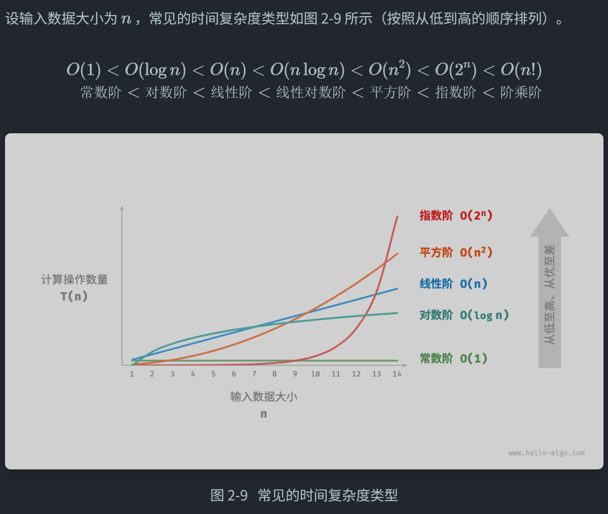

# 算法设计与分析

## 一、 时间复杂度计算

### 1. 迭代与递归

#### 1.1 迭代

##### 1.1.1 for循环

##### 1.1.2 while循环

##### 1.1.3 嵌套循环

#### 1.2 递归

递归每次调用自身，系统都会给新函数分配内存，因此递归更消耗内存，且调用函数会降低时间效率

函数的上下文数据存储在“栈帧空间”，函数返回后释放

##### 1.2.1 调用栈

函数的上下文数据存储在“栈帧空间”，函数返回后释放，递归可能会导致栈溢出

##### 1.2.2 尾递归（python、GO、JAVA等语言不支持，C/C++支持）

###### 定义：函数在返回时才进行递归调用，该函数会被编译器优化，空间效率与迭代相当

###### 原理：

- 普通函数会反复创建新栈帧
- 尾递归则是创建一个栈帧，每次替换掉参数（return来的），也可以说在反复复用栈帧

##### 1.2.3 递归树

#### 1.3 通过栈将递归转化为迭代

递归的操作类似于栈，故可用栈将递归转化为迭代

递归：（求一个数之和）

```c++
int sum(int n){
    if(n==1)
        return 1;
    return n+sum(n-1);
}

//尾递归
int sum(int n,int acc){
    if(n=0)
        return acc;
    return sum(n-1,acc+n);
}
```

转化为迭代

```c++
int Loop(int n){
    stack<int> stack;
    //stack,map等都不是关键字
    //res保存最终结果
    int res=0;
    //入栈
    for(int i=n;i>0;i--){
        stack.push(i);
    }
    //出栈
    while(!stack.empty()){
        res+=stack.top;
        stack.pop();
    }
    return res;
}
```

### 2. 复杂度



## 二、 C++存储空间

### 1. C++内存分区

1. 代码区：

   存储机器指令——编译后的代码

   只读

2. 静态区

   - 已初始化静态区

     存储已经初始化的全局变量、静态变量，由操作系统分配和回收

   - 未初始化静态区

     存储未初始化的全局变量、静态变量，由操作系统分配和回收，程序启动时自动初始化0

3. 常量区

   存储常量，只读，const修饰的全局常量也在这里

4. 栈区

   存储局部变量、函数参数、返回地址……

   由编译器分配释放，后进先出，空间小速度快，作用域结束后立即释放

   内存地址连续

5. 堆区

   动态分配的内存（例如malloc/new分配的）

   由程序员手动分配释放

   内存地址不连续

## 三、 数组与链表

### 1. 数组

线性数据结构，连续分布在内存中

#### 1.1 初始化

##### 1.1.1 栈初始化

```c++
int arr[5];
int nums[5]={1,2,3,4,5};
```

##### 1.1.2 堆初始化

```c++
int* arr1 = new int[5];
int* nums1 = new int[5]{1,2,3,4,5}
//释放
delete[] arr;
```

#### 1.2 插入元素

```c++
/* 在数组的索引 index 处插入元素 num */
void insert(int *nums, int size, int num, int index) {
   for(int i=size-1;i>index;i--){
       nums[i]=nums[i-1];
   }
    nums[index]=num;
}
```

#### 1.3 删除元素

```c++
/* 删除索引 index 处的元素 */
void remove(int *nums, int size, int index) {
   for(int i=index;i<size-1;i++){
       nums[i]=num[i+1];
   }
}
```

#### 1.4 扩容数组

扩容数组，则需重新建立一个更大的数组，然后把原数组元素依次复制到新数组

```c++
/* 扩展数组长度 */
int *extend(int *nums, int size, int enlarge) {
    // 初始化一个扩展长度后的数组
    int *res = new int[size + enlarge];
    // 将原数组中的所有元素复制到新数组
    for (int i = 0; i < size; i++) {
        res[i] = nums[i];
    }
    // 释放内存
    delete[] nums;
    // 返回扩展后的新数组
    return res;
}
```

### 2. 链表

保存当前元素以及下一个元素的地址，内存地址无需连续

组成单位：node（节点）

首个节点：head、尾节点：tail

tail指向nullptr

#### 2.1 构造链表

```c++
struct ListNode{
    int val;
    ListNode *next;
    //构造函数
    ListNode(int x):val(x),next(nullptr){};
    ListNode():val(0),next(nullptr){}
};
```

#### 2.2 初始化链表

```c++
ListNode* p1=new ListNode(1);
ListNode* p2=new ListNode(2);
p1->next=p2;
```

#### 2.3 插入节点

```c++
void insert(int n,ListNode *p0){
    ListNode* insert=new ListNode(n);
    insert->next=n0->next;
    n0->next=insert;
}
```

#### 2.4 删除节点

```c++
void remove(ListNode *n0){
    if(n0->next==nullptr){
        return;
    }
    ListNode *n1=n0->next;
    n0->next=n1->next;
    delete n1;
}
```

#### 2.5 访问节点

```c++
/* 访问链表中索引为 index 的节点 */
ListNode *access(ListNode *head, int index) {
   for(int i=0;i<index;i++){
       if(head==nullptr)
	  		return nullptr;
       head=head->next;
   }
   return head;
}
```

#### 2.6 查找节点

```c++
/* 在链表中查找值为 target 的首个节点 */
int find(ListNode *head, int target) {
    //找到
    int i=0;
    while(head->next!=nullptr){
        if(head->val==target){
            return i;
        }
        head=head->next;
        i++;
    }
    //找不到
    return -1;
}
```

#### 2.7 双向链表

```c++
struct ListNode{
    int val;
    ListNode *next;
    ListNode *prev;
    ListNode(int x):val(x),next(nullptr),prev(nullptr){}
}
```

### 3. 列表

使用动态数组实现列表——vector

#### 3.1 初始化列表

```c++
vector<int> nums;
vector<int> nums1 = {1,2,3,4,5};
//访问
int num=nums[0];
//修改
nums[0]=1
```

#### 3.2 插入和删除

```c++
//清空列表
nums.clear();
//在尾部插入元素
nums.push_back(1);
//在中间插入元素
nums.insert(nums.begin()+3,6);//在索引3处插入6

/*
	nums.begin()返回首元素的迭代器，类似于指针
    如果你要访问对应的数据应该用 *nums.begin() 此时返回的是对应值
    *nums.begin()这一步叫做解引用迭代器
    迭代器+n就是第几个元素
*/

//删除元素
nums.erase(nums.begin()+3);
```

#### 3.3 遍历列表

通过求列表元素和举例

- 直接遍历——通过for（声明 ：对象）

  ```c++
  count = 0;
  for(int num:nums){
      count+=num;
  }
  ```

- 索引遍历

  ```c++
  count = 0;
  for(int i=0;i<nums.size();i++){
      count += nums[i];
  }
  ```

#### 3.4 拼接列表

```c++
vector<int> nums1 = {1,2,3};
vector<int> nums2 = {4,5,6};
nums1.insert(nums1.end(),nums1.begin(),nums1.end());
```

#### 3.5 排序列表

```c++
sort(nums.begin(),nums.end());
```

#### 3.6 列表结构体实现

```c++
class MyList{
    //初始容量，数量记录，扩容机制
    private:
    	int *arr;//指向数组的指针
    	int size = 10;//初始容量
    	int nums = 0;//数量记录
     	int extend = 2;//扩容倍数
    
    public:
    	//构造方法
    	MyList(){
            arr = new int[size];
        }
    
    	//释放列表
    	~MyList(){
            delete[] arr;
        }
    
    	//获取列表长度
    	int size(){
            return nums;
        }
    
    	//获取列表容量
    	int capacity(){
            return size;
        }
    
    	//访问元素
    	int get(int index){
            if(index>=size()||index<0){
                throw out_of_range("索引越界")；
            }
            return arr[index];
        }
    	
    	// 更新元素
 	    void set(int index, int num) {
 	       if (index < 0 || index >= size())
 	           throw out_of_range("索引越界");
	        arr[index] = num;
	    }
    
    	//在尾部添加元素
    	void push_back(int num){
            // 元素数量超出容量时，触发扩容机制
  	      if (size() == capacity())
 	           extendCapacity();
  	      arr[size()] = num;
 	       // 更新元素数量
 	       nums++;
        }
    
    	//在中间插入元素
		void insert(int index,int num){
			if (index < 0 || index >= size())
				throw out_of_range("索引越界");
			// 元素数量超出容量时，触发扩容机制
			if (size() == capacity())
				extendCapacity();
			// 将索引 index 以及之后的元素都向后移动一位
			for (int j = size() - 1; j >= index; j--) {
				arr[j + 1] = arr[j];
			}
			arr[index] = num;
			// 更新元素数量
			nums;
		}
    	
}
```

### 4. 总结

1. 数组初始化后长度不可变；链表长度灵活，但内存占用较多
2. 列表可以调整长度，也有数组的相关功能
3. 列表扩容要申请一个新的内存移过去

## 四、 栈和队列

### 1. 栈

先入后出

#### 1.1常见操作

- push()     入栈
- pop()       出栈（无返回值）
- peek()      访问栈顶元素

```c++
//初始化
stack<int> stack;

//入栈
stack.push(1);
stack.push(2);

//访问栈顶元素
int num = stack.top();

//出栈
stack.pop();

//获取长度
int size=stack.size();

//判断空
bool empty = stack.empty();
```

#### 1.2 栈的实现

##### 1.2.1 链表实现栈

```c++
class LinkListStack{
    private:
    	ListNode *stackTop;//栈顶
    	int stkSize;//栈的长度
    
    public:
    	//构造函数
    	LinkListStack(){
            stackTop = nullptr;
            stkSize = 0;
        }
    
    	//删除链表
    	~LinkListStack(){
            // 遍历链表删除节点，释放内存
             freeMemoryLinkedList(stackTop);
        }
    
    	/*
    		void freeMemoryLinkedList(Node* head) {
				Node* tmp;
				while (head != nullptr) {
					tmp = head;
					head = head->next;
					delete tmp; // C++ 用 delete，C 用 free(tmp)
				}
			}
    	*/
    	
    	/* 获取栈的长度 */
    	int size() {
        	return stkSize;
    	}

    	/* 判断栈是否为空 */
    	bool isEmpty() {
        	return size() == 0;
    	}

	    /* 入栈 */
	    void push(int num) {
	        ListNode *node = new ListNode(num);
	        node->next = stackTop;
	        stackTop = node;
	        stkSize++;
	    }

	    /* 出栈 */
	    int pop() {
	        int num = top();
	        ListNode *tmp = stackTop;
	        stackTop = stackTop->next;
	        // 释放内存
	        delete tmp;
	        stkSize--;
	        return num;
	    }

    	/* 访问栈顶元素 */
    	int top() {
	        if (isEmpty())
	            throw out_of_range("栈为空");
	        return stackTop->val;
	    }

	    /* 将 List 转化为 Array 并返回 */
	    vector<int> toVector() {
	        ListNode *node = stackTop;
	        vector<int> res(size());
	        for (int i = res.size() - 1; i >= 0; i--) {
				res[i] = node->val;
				node = node->next;
	        }
	        return res;
	    }
}
```

##### 1.2.2 数组实现栈

```c++
/* 基于数组实现的栈 */
class ArrayStack {
  private:
    vector<int> stack;

  public:
    /* 获取栈的长度 */
    int size() {
        return stack.size();
    }

    /* 判断栈是否为空 */
    bool isEmpty() {
        return stack.size() == 0;
    }

    /* 入栈 */
    void push(int num) {
        stack.push_back(num);
    }

    /* 出栈 */
    int pop() {
        int num = top();
        stack.pop_back();
        return num;
    }

    /* 访问栈顶元素 */
    int top() {
        if (isEmpty())
            throw out_of_range("栈为空");
        return stack.back();
    }

    /* 返回 Vector */
    vector<int> toVector() {
        return stack;
    }
};
```

### 2. 队列

先入先出

#### 1.1常见操作

- push()     入队
- pop()       出队（无返回值）
- peek()      访问队首元素

```c++
//初始化
queue<int> queue;

//入队
queue.push(1);
queue.push(2);

//访问队首元素
int top = queue.peek();

//出队
queue.pop();

//队列长度
int size = queue.size();

//队列空
bool empty = =queue.empty;
```

### 3.双向队列

允许在头部和尾部执行元素的添加或删除操作

#### 常用操作

- 将元素添加到队首	push_front()
- 将元素添加至队尾        push_back()
- 删除队首                       pop_front()
- 删除队尾                       pop_back()
- 访问队首                       front()
- 访问队尾                       back()

```c++
//初始化
deque<int> deque;

//入队
deque.push_back(2);   // 添加至队尾
deque.push_back(5);
deque.push_back(4);
deque.push_front(3);  // 添加至队首
deque.push_front(1);

//访问元素
int front = deque.front(); // 队首元素
int back = deque.back();   // 队尾元素

//出队
deque.pop_front();  // 队首元素出队
deque.pop_back();   // 队尾元素出队

//获得队列长度
int size = deque.size();

//队列空
bool empty = deque.empty();
```

## 五、 哈希表

### 1. 
