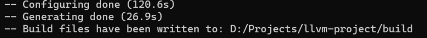
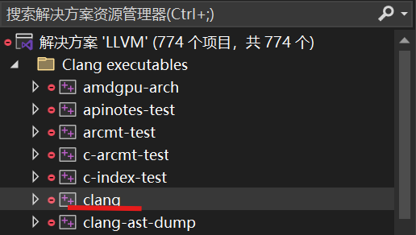
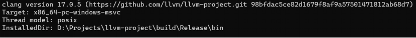
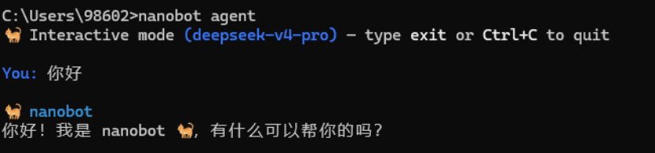
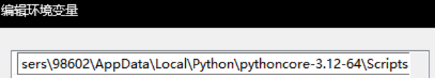
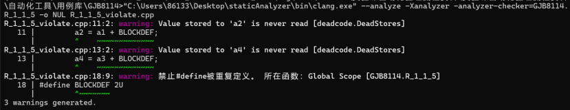

# 编译原理实验指导手册

## Clang静态检测项的开发与自动测试

# 阶段一：Clang静态检测项开发

## 相关概念

### 1. 静态检测

静态检测，是指在不运行程序的情况下，对源代码进行分析，发现其中可能存在的缺陷、风险或不符合规范的写法。它通常会检查代码的语法结构、变量使用、类型转换、控制流、数据流、函数调用、宏和头文件等内容，帮助开发人员在编译或运行之前尽早发现问题。

静态检测项，则根据某一具体检测规则设计而成，在扫描代码时，该检测项只会捕获违反该规则的缺陷。在本次实验中，我们使用的规则集是MISRA C2012，使用LLVM/Clang技术栈实现检测项的开发。

### 2. LLVM/Clang

LLVM是一个庞大的模块化编译器基础设施框架，而Clang是LLVM项目中的核心子项目，主要作为 C/C++/Objective-C 语言的编译器前端。

Clang不仅可以作为编译器使用（将.c或.cpp文件编译为可执行程序），更是一个高度模块化的库。它将编译过程拆解为词法分析、语法分析、语义分析等多个独立步骤，并开放了丰富的接口。这允许开发者在编译的中间阶段介入，获取程序的抽象语法树（AST）等信息，因此我们可以基于Clang编写检测项，在编译过程中自动执行静态检测。

# 基础环境搭建

## 1. 准备工具

构建工具cmake 3.28.0

编译工具Visual Studio 17 2022

## 2. 克隆llvm源码

```bash
git clone --branch llvmorg-17.0.5 --depth 1 https://github.com/llvm/llvm-project.git
```

注意放置在全英文路径下

## 3. cmake构建

（1） llvm-project目录下新建build文件夹

（2） cmd进入build目录，运行

```bash
cmake -DLLVM_ENABLE_PROJECTS=clang -G "Visual Studio 17 2022" -A x64 -Thost=x64 ..\llvm
```

若构建成功，最底部的输出是：


## 4. 编译Clang

（1） 在build文件夹里找到生成的LLVM.sln，用visual studio打开

（2） 在顶部选择生成方式为Release x64


（3） 点击右下角的“解决方案资源管理器”



（4） 找到Clang executables下的clang，右键clang点击“生成”

编译中内存和cpu占用高容易崩溃，建议关闭其他软件。由于是初次编译，耗时较长，耐心等待。期间关注左下角“错误列表”是否报告错误，不用管任何警告。



（5） 编译成功显示：

```text
========== 生成: xxx 成功，0 失败，0 最新，0 已跳过 ==========
========== 生成 于 xxx 完成，耗时 xxx 小时 ==========
```

注意一定要是0失败才证明编译成功。

现在已经拥有了编译好的clang.exe，它的位置在build\Release\bin\clang.exe，记住这个路径。

## 5. 验证

```bash
clang.exe的路径 --version
```

将输出：



# 检测项开发

## 选择开发的规则

### （1） MISRA C简介

MISRA C 是由汽车工业软件可靠性协会（Motor Industry Software Reliability Association）制定的一套 C 语言安全编码规范，主要面向嵌入式与安全关键系统开发，如汽车电子、航空航天、工业控制等领域。

其核心目标是通过限制危险或易产生歧义的 C 语言写法，降低程序中的潜在缺陷，提高代码的安全性、可移植性和可维护性。MISRA C 不仅规定了编码风格，还针对类型转换、指针操作、控制流、预处理器使用等方面提出了严格要求，因此被广泛应用于静态代码分析工具与高可靠软件开发流程中。

目前行业内应用最广泛、生态最成熟的版本仍然是 MISRA C:2012。虽然2023年、2025年又发布了更新版本与修订内容，但由于新版发布时间较短，相关工具链、企业规范及工程实践尚未完全完成迁移，因此 MISRA C:2012 依然是当前工业界与学术研究中最主流、最稳定的参考标准。本项目采用 MISRA C:2012 作为主要依据，既能够保证规范的先进性，也具有较好的工程适用性与行业代表性。

### （2） 规则选择

本实验为单人独立完成。每人在“MISRA C分组.xlsx”中选择一组规则（每组规则2-3条），并独立完成该组内全部规则的检测项开发。由于规则数量有限，允许不同学生选择相同规则组，同一规则组最多可被6人选择；选择相同规则组并不代表组队，代码、报告均需独立提交。

## 编写检测项

Clang\lib\StaticAnalyzer\Checkers下，是Clang自身支持的检测项。在这个文件夹下，添加某条规则对应的cpp文件，规定命名为MISRAC_1_1_Checker.cpp，具体序号根据规则id而定。这个cpp文件就负责此条规则的检测。相关开发资料见附件。

在该文件中编写检测逻辑，这其中就要使用AST、控制流、数据流分析等相关知识。开发思路如下：

### （1） 分析规则描述

明确该规则限制的是哪一类代码行为。例如，某些规则关注的是语法层面的结构，如是否使用了某类语句、某类表达式或某类声明；某些规则关注的是类型语义，如表达式两侧类型是否兼容、是否发生了危险的隐式转换；还有一些规则关注的是数据流或控制流行为，如变量是否在初始化前被读取、资源是否在所有路径上被正确释放。不同规则对应的分析方式不同，因此在实现前必须先判断它属于哪一类检测问题。

### （2） 实现检测项

在实现检测项时，应优先判断规则适合使用哪种分析粒度。对于简单、局部、结构明确的规则，可以基于AST节点实现，例如检查特定语句、表达式或声明是否出现；对于依赖类型信息的规则，需要结合clang的类型系统，读取QualType、类型限定符、隐式转换节点等信息；对于依赖执行路径、变量状态或资源生命周期的规则，则应使用Clang Static Analyzer的路径敏感能力，在不同控制流路径上传播和更新程序状态。

因此，在开发静态检测项时，应始终围绕一个核心问题展开：这条规则在程序中表现为什么代码模式，clang能从哪些AST、类型信息或路径状态中识别这种模式。只有先完成规则到程序结构的映射，再编写Checker，才能避免检测逻辑停留在字符串匹配或表面语法判断层面，从而提高检测项的准确性和可维护性。

# 注册、构建与编译

## （1） 添加到构建目录

打开clang/lib/StaticAnalyzer/Checkers/CMakeLists.txt，在

```text
add_clang_library(clangStaticAnalyzerCheckers ... )
```

的源文件列表中添加Checker文件名，如MISRAC_1_1_Checker.cpp。这一步是为了将该文件添加到构建目录中，这样检测项才会在编译时被真正地编译进去。

## （2） 注册检测项

打开clang/include/clang/StaticAnalyzer/Checkers/Checkers.td，该文件是检测项的注册表，只有在注册表中完成检测项的注册，clang才能识别到它。

注册一个包，代表规则集：

```cpp
def MISRARules : Package<"MISRA">;
```

将你的检测项注册到这个包中：

```cpp
let ParentPackage = MISRARules in {
  def MISRAC_1_1 : Checker<"R_1_1">, Documentation<NotDocumented>;
  //...其他检测项
}
```

可注意到Checkers.td这个文件中还有许多“长相类似”的包和检测项，这就是前述说到的“clang本身支持的静态检测能力”。

蓝色高亮部分的包名（规则集名）和检测项名（规则id），他们将用于检测项的启动命令。

## （3） 检测项挂载

完成了注册表的填写后，需要在对应的检测项cpp文件中，进行“双向绑定”，以便让clang明白，根据上述包名和检测项名启用某检测项时，该去找哪个文件。

在MISRAC_1_1_Checker.cpp末尾添加：

```cpp
void ento::registerMISRAC_1_1(CheckerManager &mgr) {
    mgr.registerChecker<MISRAC_1_1_Checker>();
}

bool ento::shouldRegisterMISRAC_1_1(const CheckerManager &mgr) {
    return true;
}
```

注意高亮部分是该文件内的Checker类，若你命名的类名不同，记得在此处更换。

## （4） 重新构建

由于修改了CMakeLists.txt，需进入build目录重新运行cmake命令进行构建，和之前的构建命令一样：

```bash
cmake -DLLVM_ENABLE_PROJECTS=clang -G "Visual Studio 17 2022" -A x64 -Thost=x64 ..\llvm
```

## （5） 编译

回到Visual Studio的解决方案中，依旧在Clang executables下找到Clang，右键生成。编译成功后，最新的clang.exe已经拥有了你自定义的静态检测项。

# 阶段二：自动化检测与缺陷修复

# 安装nanobot

解压提供的源码，进入nanobot-main目录，在该目录打开命令提示符窗口

输入：

```bash
pip install -e .
```

（python 3.9+）

安装完成后若无报错，则进入以下流程：

## 1、 初始化：

在命令行窗口输入：

```bash
nanobot onboard
```

## 2、 在用户目录下的/.nanobot/config.json（例如：C:\Users\你的win用户名）修改json配置，以下以deepseekv4为例：

找到providers配置项，修改apiKey和apiBase

```json
"deepseek": {
  "apiKey": "你的apikey",
  "apiBase": "https://api.deepseek.com/",
  "extraHeaders": null,
  "extraBody": null
},
```

找到agents配置项，修改model为如下：

```json
"agents": {
    "defaults": {
      "workspace": "~/.nanobot/workspace",
      "model": "deepseek-v4-pro",
      "provider": "auto",
```

修改好后保存

## 3、 命令行窗口输入nanobot agent运行nanobot

若有回复则证明安装完成



若遇到找不到nanobot命令的提示，可通过where python找到python安装目录，确保python文件夹中的Scripts在环境变量中，例如图中所示



# 脚本使用

启动方式可查看工具目录中的readme文件。

---

注1：检测结果中出现少量误报与漏报是正常现象。这是因为c语言本身具有较强的灵活性，在复杂的宏展开、条件编译、跨函数调用、路径组合及类型推导时难以精确匹配。因此不必追求完全零误报零漏报，能够稳定识别典型违规场景，能够避免明显错误的报告即可。不过如有误报漏报情况，应在实验报告中说明，并注明出现误报漏报的原因。

注2：可使用下述命令获取clang的原始缺陷输出

```bash
clang.exe路径 --analyze -Xanalyzer -analyzer-checker=规则集.规则id -o NUL 测试用例文件
```

前两项是clang原生提供的静态检测功能



# 实验提交要求

将以下内容打包为zip提交，命名为“学号-姓名-规则组号-编译原理实验报告”，示例“2026123456-张三-1-编译原理实验报告”。

## 1. 阶段一源文件：

规则组内全部检测项cpp

## 2. 阶段二产物：

### （1） “用例库”里生成的测试用例源文件

### （2） “用例库副本”里完成修复的用例文件

### （3） “关联关系.txt”

## 3. 实验报告。内容要求如下：

### （1） 实验过程中，每个步骤的文字描述与截图

### （2） 每条检测项的开发思路

### （3） 实验结果：检测项的测试结果、用例的修复结果

### （4） 遇到过什么问题，最终是如何解决的

# 附件：开发参考资料

## 1. clang官方的开发手册

https://clang-analyzer.llvm.org/checker_dev_manual.html#values

clang官方的开发手册，想深入了解开发流程的同学可以阅读此文档。

## 2. clang的api文档

https://clang.llvm.org/doxygen/classes.html

clang的api文档。网址默认对应的是clang的Main分支，即开发中的最新版，然而我们使用的是clang17，虽然clang17是一个较新的稳定版，但clang的api并没有向后兼容保证，某些接口参数在版本迭代中可能发生变化。但核心基类不会发生改变，官方文档依旧具有参考价值，且查找比较方便。如官方文档有误，具体则以本地头文件为准。

## 3. AST Matcher文档

https://clang.llvm.org/docs/LibASTMatchersReference.html

AST匹配是比较常见的检测项类型，其中要用到AST Matcher，可在此文档中查找。如需分析AST结构，可使用命令：

```bash
clang.exe路径 -fsyntax-only -Xclang -ast-dump test.c
```