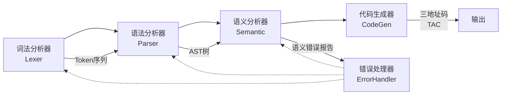
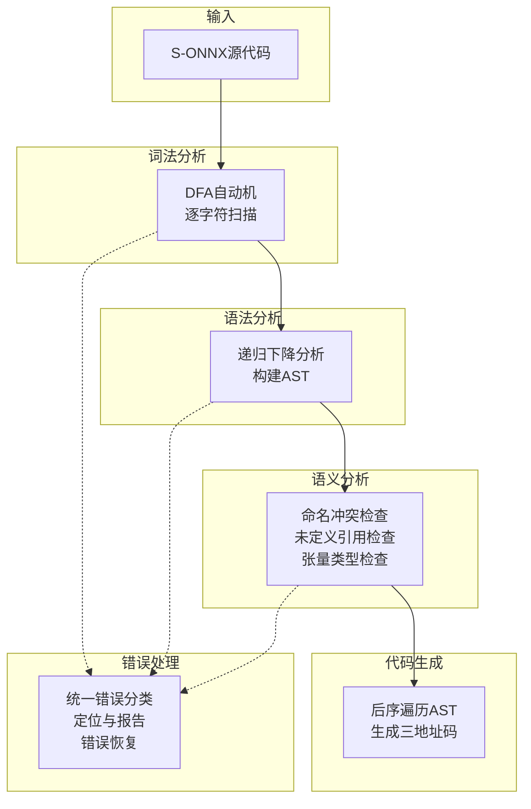
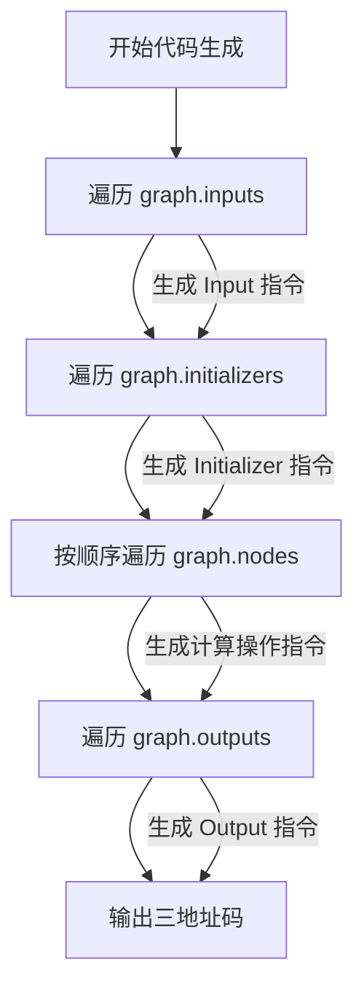

# 编译原理实验报告 —— S-ONNXCompiler 编译器的设计与实现

---

## 一、实验环境

| 项目       | 说明                                  |
|------------|---------------------------------------|
| 操作系统   | Windows 11                            |
| 编程语言   | Python 3.13.5                         |
| 开发工具   | VS Code / OpenCode                    |
| 虚拟环境   | Python venv（项目目录下本地虚拟环境） |
| 外部依赖   | 无（纯Python标准库实现）              |

---

## 二、实验内容

本次实验的任务是构建一个 S-ONNX（Simplified Open Neural Network Exchange）模型的编译器 S-ONNXCompiler，需要完成以下四个任务：

1. **任务一**：实现词法分析和语法分析程序
2. **任务二**：实现语义分析与中间代码生成程序
3. **任务三**：实现错误处理程序
4. **任务四**：对编译器进行测试

---

## 三、实验流程

### 3.1 总体架构

S-ONNXCompiler 采用经典的编译器前端架构，包含四个主要模块：



各模块职责：



### 3.2 词法分析模块（任务一）

#### 3.2.1 实现方法

词法分析器基于**确定性有穷自动机(DFA)**实现，主要流程如下：

1. 逐字符读取源代码
2. 根据当前字符跳转到不同的DFA状态
3. 在终止状态下输出对应的Token

#### 3.2.2 Token类型设计

定义了 `TokenType` 枚举类，包含：
- **32个关键字**（不区分大小写）：ModelProto, graph, name, node, input, output, op_type, attribute, initializer, doc_string, domain, model_version, producer_name, producer_version, type, tensor_type, ir_version, elem_type, shape, dim, dims, raw_data, opset_import, dim_value, dim_param, data_type, version, value, int, float, string, bool
- **6个专用符号**：`[` `]` `{` `}` `,` `=`
- **3种字面量**：INTEGER, STRING, BYTES
- **特殊Token**：EOF, ERROR

#### 3.2.3 关键实现细节

**BYTES与INTEGER的区分**：BYTES的正则为 `[0-9A-Fa-f]+b`，INTEGER的正则为 `(0|[1-9][0-9]*)(l|L)?`。由于两者都以数字开头，需要特别处理：在收集十六进制字符时，若遇到 `b`，需要向前看一个字符——若其后无更多十六进制字符，则 `b` 是BYTES终止符；否则 `b` 是十六进制内容的一部分。

**关键字识别**：维护一个不区分大小写的关键字查找表，标识符读取完成后查表判断是否为关键字。

#### 3.2.4 提供的接口

`getToken()` 接口：通过 `Lexer` 类的 `get_tokens()` 方法返回所有词法单元列表，每个Token包含类型(TokenType)和词值(value)两部分，以及行号和列号信息。

### 3.3 语法分析模块（任务一）

#### 3.3.1 实现方法

采用**递归下降分析法**（自上而下），文法的每个非终结符对应一个解析函数。选择递归下降的原因：

1. S-ONNX文法天然具有递归结构，适合递归下降
2. 实现直观，代码可读性高
3. 便于构造抽象语法树
4. 错误定位精确

#### 3.3.2 关键解析决策

1. **input_arr与input_list的区分**：在遇到 `input` 关键字时，向前看一个Token——若下一个Token是 `=` 则为数组形式，若是 `{` 则为列表形式
2. **可选字段容错**：将 `producer_version`、`domain`、`model_version`、`doc_string` 等字段设为可选解析，缺失时赋予默认值并记录语法错误，不中断整体解析
3. **非法关键字检测**：模型定义结束后检查是否还有未消费的IDENTIFIER Token

### 3.4 抽象语法树设计（任务一）

#### 3.4.1 节点类层次

设计了以下AST节点类（详见设计方案文档）：

| 节点类              | 说明           | 关键属性                     |
|---------------------|----------------|------------------------------|
| ModelProtoNode      | 模型根节点     | ir_version, graph, opset_import |
| GraphNode           | 计算图         | name, nodes, inputs, outputs, initializers |
| NodeDefNode         | 计算节点       | op_type, name, inputs, outputs, attributes |
| InputInfoNode       | 输入张量信息   | name, type_info              |
| OutputInfoNode      | 输出张量信息   | name, type_info              |
| TensorTypeNode      | 张量类型       | elem_type, shape             |
| ShapeNode           | 形状           | dims                         |
| DimNode             | 维度           | dim_value, dim_param         |
| AttributeNode       | 属性           | name, value                  |
| InitializerNode     | 初始化器       | name, data_type, dims, raw_data |
| OpsetImportNode     | 算子集导入     | domain, version              |

#### 3.4.2 AST格式化输出

实现了 `format_ast()` 函数，通过缩进表示父子级关系，输出易于阅读的树形结构。

### 3.5 语义分析模块（任务二）

#### 3.5.1 语义检查内容

实现了三类语义检查：

**1) 命名冲突**
- 节点名称不允许重复
- 输出张量名称不允许冲突
- 输入定义和初始化器名称不允许重复

**2) 未定义即使用**
- 建立所有已定义张量名称的集合（input定义 + initializer定义 + 节点输出）
- 检查每个节点的输入引用是否都在已定义集合中

**3) 张量类型检查**
- 同一操作符的所有输入张量类型必须一致
- 对于类型受限的操作符（Add, Sub, Mul, Conv, MatMul等），输出类型应与输入类型一致

#### 3.5.2 实现方法

遍历AST，使用字典(哈希表)收集名称和类型信息，进行一致性检查。发现错误时不中断，继续检查其他规则，尽可能多地收集错误。

### 3.6 中间代码生成模块（任务二）

#### 3.6.1 三地址码设计

采用三地址码(TAC)作为中间表示，每条指令格式为：

```
<result> = <operation> <operand1>, <operand2>, ..., <attributes>
```

具体规范：

| 操作类型     | 格式                                          | 示例                                                    |
|--------------|-----------------------------------------------|---------------------------------------------------------|
| 输入定义     | `T = Input(name, TYPE, [shape])`              | `T1 = Input("X", INT, [3, 2])`                        |
| 输出定义     | `Output(name, operand)`                       | `Output("Y", T5)`                                      |
| 计算操作     | `T = OpType(op1, op2, ..., attrs)`            | `T5 = Pad(T1, T2, T3, mode="33")`                     |
| 权重初始化   | `T = Initializer(name, TYPE, [shape], raw)`   | `T4 = Initializer("w", FLOAT, [64,3,3,3], raw_data=01)`|

#### 3.6.2 代码生成方法

采用**后序遍历**AST生成中间代码，流程如下：



1. 遍历 `graph.inputs`，为每个输入生成 `Input` 指令
2. 遍历 `graph.initializers`，为每个初始化器生成 `Initializer` 指令
3. 按顺序遍历 `graph.nodes`，为每个节点生成计算指令
4. 遍历 `graph.outputs`，为每个输出生成 `Output` 指令

维护一个 `var_map` 字典（张量名→临时变量名），确保中间代码中正确引用。

### 3.7 错误处理模块（任务三）

#### 3.7.1 错误分类

| 错误类型 | 产生阶段 | 典型示例                                 |
|----------|----------|------------------------------------------|
| 词法错误 | 词法分析 | 非法字符、字符串未闭合、非法转义序列     |
| 语法错误 | 语法分析 | 缺少必需字段、非法关键字、结构不匹配     |
| 语义错误 | 语义分析 | 命名冲突、未定义引用、类型不匹配         |

#### 3.7.2 错误报告机制

每条错误信息包含：
- **错误定位**：行号和列号
- **错误描述**：错误类型和具体原因

#### 3.7.3 错误恢复策略

- **词法错误**：跳过非法字符继续扫描
- **语法错误**：缺失可选字段时赋予默认值并记录错误
- **语义错误**：发现错误后不中断，继续检查其他规则

---

## 四、测试说明

### 4.1 测试方法

使用第5章给出的10个测试用例，通过命令行运行编译器：

```bash
python main.py tests/test01.txt
```

### 4.2 测试结果总结

| 测试用例 | 词法分析 | 语法分析 | 语义分析 | 中间代码 | 总错误数 | 说明                     |
|----------|----------|----------|----------|----------|----------|--------------------------|
| 1        | ✓        | ✓        | ✓        | ✓        | 0        | 含Pad节点和initializer   |
| 2        | ✓        | ✓        | ✓        | ✓        | 0        | 含MatMul和initializer    |
| 3        | ✓        | ✓        | ✓        | ✓        | 0        | 多输入节点               |
| 4        | ✓        | ✓        | ✓        | ✓        | 0        | Conv+复杂形状            |
| 5        | ✓        | ✓        | ✓        | ✓        | 0        | 含Attribute的CustomOp    |
| 6        | ✓        | ✓        | ✓        | ✓        | 0        | 多输出(Add)              |
| 7        | ✓        | ✗        | ✓        | ✓        | 1        | 非法关键字'keyword'      |
| 8        | ✓        | ✗        | ✓        | ✓        | 1        | 缺少opset_import         |
| 9        | ✓        | ✓        | ✗        | ✓        | 2        | 节点名重复+类型不匹配    |
| 10       | ✓        | ✓        | ✗        | ✓        | 2        | 输入张量未定义           |

### 4.3 错误检测验证

**测试用例7**（非法关键字）：
- 语法错误：`'keyword' 不是合法的S-ONNX关键字`
- 编译器正确检测到非法关键字并报告错误

**测试用例8**（缺少opset_import）：
- 语法错误：`缺少opset_import定义`
- 编译器正确检测到必需字段的缺失

**测试用例9**（命名冲突+类型不匹配）：
- 语义错误1：`节点名称重复——同一个模型中，不能有同名节点 'DuplicateNode'`
- 语义错误2：`模型整体输入输出不匹配——Add操作的输入为FLOAT类型，输出output1为INT类型`

**测试用例10**（未定义引用）：
- 语义错误1：`输入张量 'input1' 未定义即被引用——应先定义才能被引用`
- 语义错误2：`输入张量 'input2' 未定义即被引用——应先定义才能被引用`

---

## 五、实验总结

### 5.1 实验成果

本实验成功构建了完整的S-ONNXCompiler编译器，实现了以下功能：

1. **词法分析**：基于DFA的词法分析器，能正确识别32个关键字、6个专用符号和3种字面量
2. **语法分析**：基于递归下降的语法分析器，能构建正确的AST并格式化输出
3. **语义分析**：实现了命名冲突检查、未定义引用检查和张量类型检查
4. **中间代码生成**：后序遍历AST生成三地址码
5. **错误处理**：统一的错误报告机制，能准确定位和描述词法、语法、语义错误

### 5.2 关键技术难点

1. **BYTES与INTEGER的区分**：需要前瞻一个字符来判断 `b` 是BYTES终止符还是十六进制内容
2. **可选字段的容错解析**：需要在不违反文法的前提下处理缺失字段
3. **语义分析中类型信息的传播**：需要建立全局的类型映射表并正确检查一致性

### 5.3 改进方向

1. 可以增加更多的语义检查规则（如维度匹配检查）
2. 可以实现更精细的错误恢复策略
3. 可以将中间代码进一步优化（如常量折叠、死代码消除）
