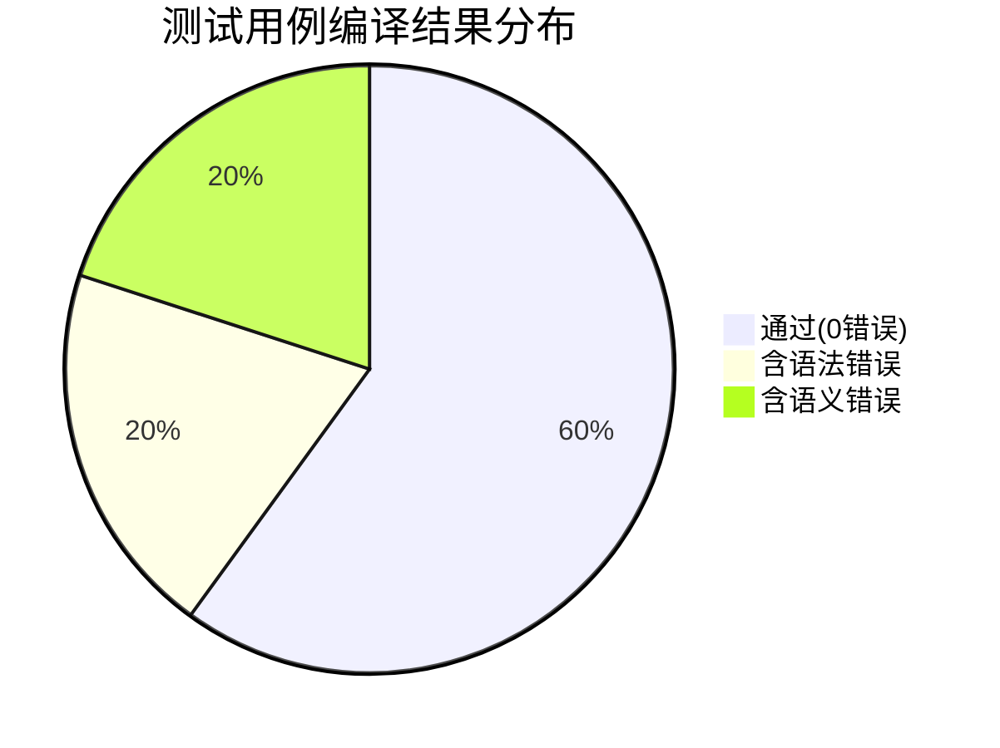
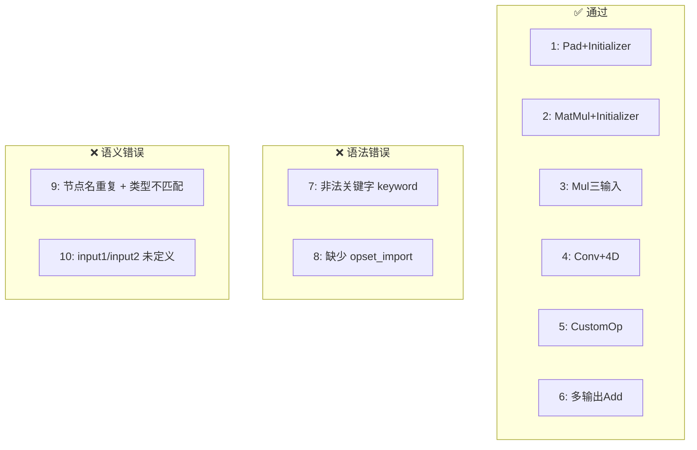

# S-ONNXCompiler 测试报告

## 测试环境

| 项目 | 说明 |
|------|------|
| 操作系统 | Windows 11 |
| Python版本 | 3.13.5 |
| 编译器 | S-ONNXCompiler（手工实现） |
| 外部依赖 | 无（纯Python标准库实现） |

## 测试说明

对第5章给出的10个测试用例进行测试，每个测试用例的测试结果包括：

1. **词法分析**：Token统计与代表性Token
2. **语法分析**：格式化抽象语法树（AST）
3. **语义分析**：语义检查报告
4. **中间代码**：三地址码（TAC）

---

## 测试用例1

### 输入源代码

```
ModelProto{
    ir_version = 8
    producer_name = "onnx-example"
    producer_version = "1.0"
    domain = "example_domain"
    model_version = 1
    doc_string = "This is an example ONNX model."
    graph {
        name= "test-model"
        node {
            op_type= "Pad"
            name= "test-node"
            input=["X","pads","value"]
            output=[ "Y" ]
            attribute {
                name= "mode"
                value = "33"
            }
        }
        input {
            name= "X"
            type {
                tensor_type {
                    elem_type= int
                    shape {
                        dim {
                            dim_value= 3
                        }
                        dim {
                            dim_value= 2
                        }
                    }
                }
            }
        }
        input {
            name="pads"
            type {
                tensor_type {
                    elem_type= int
                    shape {
                        dim {
                            dim_value= 1
                        }
                        dim {
                            dim_value= 4
                        }
                    }
                }
            }
        }
        input {
            name= "value"
            type {
                tensor_type {
                    elem_type= int
                    shape {
                        dim {
                            dim_value= 1
                        }
                    }
                }
            }
        }
        output {
            name="Y"
            type {
                tensor_type {
                    elem_type= int
                    shape {
                        dim {
                            dim_value=3
                        }
                        dim {
                            dim_value=4
                        }
                    }
                }
            }
        }
        initializer {
            name= "conv.bias"
            data_type=int
            dims=1 2 3 4
            raw_data=000000000000b
        }
    }
    opset_import {
        domain = "ex"
        version=15
    }
}
```

### 词法分析结果

共识别 200 个词法单元

代表性Token：

```
0      KW_MODELPROTO             'ModelProto'                   1      1
1      LBRACE                    '{'                            1      11
2      KW_IR_VERSION             'ir_version'                   2      5
3      ASSIGN                    '='                            2      16
4      INTEGER                   '8'                            2      18
5      KW_PRODUCER_NAME          'producer_name'                3      5
6      ASSIGN                    '='                            3      19
7      STRING_LIT                '"onnx-example"'               3      21
8      KW_PRODUCER_VERSION       'producer_version'             4      5
9      ASSIGN                    '='                            4      22
10     STRING_LIT                '"1.0"'                        4      24
11     KW_DOMAIN                 'domain'                       5      5
......
```

### 语法分析结果（AST）

```
ModelProto
  ir_version: 8
  producer_name: onnx-example
  producer_version: 1.0
  domain: example_domain
  model_version: 1
  doc_string: This is an example ONNX model.
  Graph
    name: test-model
    Node
      op_type: Pad
      name: test-node
      inputs: ['X', 'pads', 'value']
      outputs: ['Y']
      Attribute
        name: mode
        value: 33
    Input
      name: X
      Type
        TensorType
          elem_type: int
          Shape
            Dim(dim_value=3)
            Dim(dim_value=2)
    Input
      name: pads
      Type
        TensorType
          elem_type: int
          Shape
            Dim(dim_value=1)
            Dim(dim_value=4)
    Input
      name: value
      Type
        TensorType
          elem_type: int
          Shape
            Dim(dim_value=1)
    Input
      name: Y
      Type
        TensorType
          elem_type: int
          Shape
            Dim(dim_value=3)
            Dim(dim_value=4)
    Initializer
      name: conv.bias
      data_type: int
      dims: ['1', '2', '3', '4']
      raw_data: 000000000000
  OpsetImport
    domain: ex
    version: 15
```

### 语义分析结果

> ✅ 语义分析通过，未发现语义错误。

### 中间代码生成结果（三地址码）

```
1: T1 = Input("X", INT, [3, 2])
2: T2 = Input("pads", INT, [1, 4])
3: T3 = Input("value", INT, [1])
4: T4 = Initializer("conv.bias", INT, [1, 2, 3, 4], raw_data=000000000000)
5: T5 = Pad(T1, T2, T3, mode="33")
6: Output("Y", T5)
共生成 6 条三地址码指令
```

---

## 测试用例2

### 输入源代码

```
ModelProto{
    ir_version = 1
    producer_name = "TestProducer"
    producer_version = "1.0"
    domain = "test.onnx"
    model_version = 1
    doc_string = "This is testmodel2."
    graph{
        name = "GraphWithInitializer"
        node{
            op_type = "MatMul"
            name = "MatMulNode"
            input = ["input1", "initializer1"]
            output = ["output1"]
        }
        input{
            name = "input1"
            type{
                tensor_type{
                    elem_type = float
                    shape{
                        dim{
                            dim_value = 1
                        }
                        dim{
                            dim_value = 2
                        }
                    }
                }
            }
        }
        output{
            name = "output1"
            type{
                tensor_type{
                    elem_type = float
                    shape{
                        dim{
                            dim_value = 1
                        }
                        dim{
                            dim_value = 1
                        }
                    }
                }
            }
        }
        initializer{
            name = "initializer1"
            data_type = float
            dims = 2 1
            raw_data = 01020304b
        }
    }
    opset_import{
        domain = "ai.onnx"
        version = 11
    }
}
```

### 词法分析结果

共识别 133 个词法单元

代表性Token：

```
0      KW_MODELPROTO             'ModelProto'                   1      1
1      LBRACE                    '{'                            1      11
2      KW_IR_VERSION             'ir_version'                   2      5
3      ASSIGN                    '='                            2      16
4      INTEGER                   '1'                            2      18
5      KW_PRODUCER_NAME          'producer_name'                3      5
6      ASSIGN                    '='                            3      19
7      STRING_LIT                '"TestProducer"'               3      21
8      KW_PRODUCER_VERSION       'producer_version'             4      5
9      ASSIGN                    '='                            4      22
10     STRING_LIT                '"1.0"'                        4      24
11     KW_DOMAIN                 'domain'                       5      5
......
```

### 语法分析结果（AST）

```
ModelProto
  ir_version: 1
  producer_name: TestProducer
  producer_version: 1.0
  domain: test.onnx
  model_version: 1
  doc_string: This is testmodel2.
  Graph
    name: GraphWithInitializer
    Node
      op_type: MatMul
      name: MatMulNode
      inputs: ['input1', 'initializer1']
      outputs: ['output1']
    Input
      name: input1
      Type
        TensorType
          elem_type: float
          Shape
            Dim(dim_value=1)
            Dim(dim_value=2)
    Input
      name: output1
      Type
        TensorType
          elem_type: float
          Shape
            Dim(dim_value=1)
            Dim(dim_value=1)
    Initializer
      name: initializer1
      data_type: float
      dims: ['2', '1']
      raw_data: 01020304
  OpsetImport
    domain: ai.onnx
    version: 11
```

### 语义分析结果

> ✅ 语义分析通过，未发现语义错误。

### 中间代码生成结果（三地址码）

```
1: T1 = Input("input1", FLOAT, [1, 2])
2: T2 = Initializer("initializer1", FLOAT, [2, 1], raw_data=01020304)
3: T3 = MatMul(T1, T2)
4: Output("output1", T3)
共生成 4 条三地址码指令
```

---

## 测试用例3

### 输入源代码

```
ModelProto{
    ir_version = 1
    producer_name = "TestProducer"
    producer_version = "1.0"
    domain = "test.onnx"
    model_version = 1
    doc_string = "This is testmodel3."
    graph{
        name = "MultiNodeGraph"
        node{
            op_type = "Mul"
            name = "MulNode"
            input = ["input1", "input2", "input3"]
            output = ["output1"]
        }
        input{
            name = "input1"
            type{
                tensor_type{
                    elem_type = float
                    shape{
                        dim{
                            dim_value = 1
                        }
                    }
                }
            }
        }
        input{
            name = "input2"
            type{
                tensor_type{
                    elem_type = float
                    shape{
                        dim{
                            dim_value = 1
                        }
                    }
                }
            }
        }
        input{
            name = "input3"
            type{
                tensor_type{
                    elem_type = float
                    shape{
                        dim{
                            dim_value = 1
                        }
                    }
                }
            }
        }
        output{
            name = "output1"
            type{
                tensor_type{
                    elem_type = float
                    shape{
                        dim{
                            dim_value = 1
                        }
                    }
                }
            }
        }
    }
    opset_import{
        domain = "ai.onnx"
        version = 11
    }
}
```

### 词法分析结果

共识别 155 个词法单元

代表性Token：

```
0      KW_MODELPROTO             'ModelProto'                   1      1
1      LBRACE                    '{'                            1      11
2      KW_IR_VERSION             'ir_version'                   2      5
3      ASSIGN                    '='                            2      16
4      INTEGER                   '1'                            2      18
5      KW_PRODUCER_NAME          'producer_name'                3      5
6      ASSIGN                    '='                            3      19
7      STRING_LIT                '"TestProducer"'               3      21
8      KW_PRODUCER_VERSION       'producer_version'             4      5
9      ASSIGN                    '='                            4      22
10     STRING_LIT                '"1.0"'                        4      24
11     KW_DOMAIN                 'domain'                       5      5
......
```

### 语法分析结果（AST）

```
ModelProto
  ir_version: 1
  producer_name: TestProducer
  producer_version: 1.0
  domain: test.onnx
  model_version: 1
  doc_string: This is testmodel3.
  Graph
    name: MultiNodeGraph
    Node
      op_type: Mul
      name: MulNode
      inputs: ['input1', 'input2', 'input3']
      outputs: ['output1']
    Input
      name: input1
      Type
        TensorType
          elem_type: float
          Shape
            Dim(dim_value=1)
    Input
      name: input2
      Type
        TensorType
          elem_type: float
          Shape
            Dim(dim_value=1)
    Input
      name: input3
      Type
        TensorType
          elem_type: float
          Shape
            Dim(dim_value=1)
    Input
      name: output1
      Type
        TensorType
          elem_type: float
          Shape
            Dim(dim_value=1)
  OpsetImport
    domain: ai.onnx
    version: 11
```

### 语义分析结果

> ✅ 语义分析通过，未发现语义错误。

### 中间代码生成结果（三地址码）

```
1: T1 = Input("input1", FLOAT, [1])
2: T2 = Input("input2", FLOAT, [1])
3: T3 = Input("input3", FLOAT, [1])
4: T4 = Mul(T1, T2, T3)
5: Output("output1", T4)
共生成 5 条三地址码指令
```

---

## 测试用例4

### 输入源代码

```
ModelProto{
    ir_version = 1
    producer_name = "TestProducer"
    producer_version = "1.0"
    domain = "test.onnx"
    model_version = 1
    doc_string = "This is testmodel4."
    graph{
        name = "ComplexShapeGraph"
        node{
            op_type = "Conv"
            name = "ConvNode"
            input = ["input1", "initializer1"]
            output = ["output1"]
        }
        input{
            name = "input1"
            type{
                tensor_type{
                    elem_type = float
                    shape{
                        dim{
                            dim_value = 1
                        }
                        dim{
                            dim_value = 3
                        }
                        dim{
                            dim_value = 224
                        }
                        dim{
                            dim_value = 224
                        }
                    }
                }
            }
        }
        output{
            name = "output1"
            type{
                tensor_type{
                    elem_type = float
                    shape{
                        dim{
                            dim_value = 1
                        }
                        dim{
                            dim_value = 64
                        }
                        dim{
                            dim_value = 222
                        }
                        dim{
                            dim_value = 222
                        }
                    }
                }
            }
        }
        initializer{
            name = "initializer1"
            data_type = float
            dims = 64 3 3 3
            raw_data = 0102b
        }
    }
    opset_import{
        domain = "ai.onnx"
        version = 11
    }
}
```

### 词法分析结果

共识别 159 个词法单元

代表性Token：

```
0      KW_MODELPROTO             'ModelProto'                   1      1
1      LBRACE                    '{'                            1      11
2      KW_IR_VERSION             'ir_version'                   2      5
3      ASSIGN                    '='                            2      16
4      INTEGER                   '1'                            2      18
5      KW_PRODUCER_NAME          'producer_name'                3      5
6      ASSIGN                    '='                            3      19
7      STRING_LIT                '"TestProducer"'               3      21
8      KW_PRODUCER_VERSION       'producer_version'             4      5
9      ASSIGN                    '='                            4      22
10     STRING_LIT                '"1.0"'                        4      24
11     KW_DOMAIN                 'domain'                       5      5
......
```

### 语法分析结果（AST）

```
ModelProto
  ir_version: 1
  producer_name: TestProducer
  producer_version: 1.0
  domain: test.onnx
  model_version: 1
  doc_string: This is testmodel4.
  Graph
    name: ComplexShapeGraph
    Node
      op_type: Conv
      name: ConvNode
      inputs: ['input1', 'initializer1']
      outputs: ['output1']
    Input
      name: input1
      Type
        TensorType
          elem_type: float
          Shape
            Dim(dim_value=1)
            Dim(dim_value=3)
            Dim(dim_value=224)
            Dim(dim_value=224)
    Input
      name: output1
      Type
        TensorType
          elem_type: float
          Shape
            Dim(dim_value=1)
            Dim(dim_value=64)
            Dim(dim_value=222)
            Dim(dim_value=222)
    Initializer
      name: initializer1
      data_type: float
      dims: ['64', '3', '3', '3']
      raw_data: 0102
  OpsetImport
    domain: ai.onnx
    version: 11
```

### 语义分析结果

> ✅ 语义分析通过，未发现语义错误。

### 中间代码生成结果（三地址码）

```
1: T1 = Input("input1", FLOAT, [1, 3, 224, 224])
2: T2 = Initializer("initializer1", FLOAT, [64, 3, 3, 3], raw_data=0102)
3: T3 = Conv(T1, T2)
4: Output("output1", T3)
共生成 4 条三地址码指令
```

---

## 测试用例5

### 输入源代码

```
ModelProto{
    ir_version = 1
    producer_name = "TestProducer"
    producer_version = "1.0"
    domain = "test.onnx"
    model_version = 1
    doc_string = "This is testmodel5."
    graph{
        name = "NodeWithStringAttrGraph"
        node{
            op_type = "CustomOp"
            name = "CustomNode"
            input = ["input1"]
            output = ["output1"]
            attribute{
                name = "customAttr"
                value = "SomeStringValue"
            }
        }
        input{
            name = "input1"
            type{
                tensor_type{
                    elem_type = float
                    shape{
                        dim{
                            dim_value = 1
                        }
                    }
                }
            }
        }
        output{
            name = "output1"
            type{
                tensor_type{
                    elem_type = float
                    shape{
                        dim{
                            dim_value = 1
                        }
                    }
                }
            }
        }
    }
    opset_import{
        domain = "ai.onnx"
        version = 11
    }
}
```

### 词法分析结果

共识别 112 个词法单元

代表性Token：

```
0      KW_MODELPROTO             'ModelProto'                   1      1
1      LBRACE                    '{'                            1      11
2      KW_IR_VERSION             'ir_version'                   2      5
3      ASSIGN                    '='                            2      16
4      INTEGER                   '1'                            2      18
5      KW_PRODUCER_NAME          'producer_name'                3      5
6      ASSIGN                    '='                            3      19
7      STRING_LIT                '"TestProducer"'               3      21
8      KW_PRODUCER_VERSION       'producer_version'             4      5
9      ASSIGN                    '='                            4      22
10     STRING_LIT                '"1.0"'                        4      24
11     KW_DOMAIN                 'domain'                       5      5
......
```

### 语法分析结果（AST）

```
ModelProto
  ir_version: 1
  producer_name: TestProducer
  producer_version: 1.0
  domain: test.onnx
  model_version: 1
  doc_string: This is testmodel5.
  Graph
    name: NodeWithStringAttrGraph
    Node
      op_type: CustomOp
      name: CustomNode
      inputs: ['input1']
      outputs: ['output1']
      Attribute
        name: customAttr
        value: SomeStringValue
    Input
      name: input1
      Type
        TensorType
          elem_type: float
          Shape
            Dim(dim_value=1)
    Input
      name: output1
      Type
        TensorType
          elem_type: float
          Shape
            Dim(dim_value=1)
  OpsetImport
    domain: ai.onnx
    version: 11
```

### 语义分析结果

> ✅ 语义分析通过，未发现语义错误。

### 中间代码生成结果（三地址码）

```
1: T1 = Input("input1", FLOAT, [1])
2: T2 = CustomOp(T1, customAttr="SomeStringValue")
3: Output("output1", T2)
共生成 3 条三地址码指令
```

---

## 测试用例6

### 输入源代码

```
ModelProto{
    ir_version = 1
    producer_name = "TestProducer"
    producer_version = "1.0"
    domain = "test.onnx"
    model_version = 1
    doc_string = "This is testmodel6."
    graph{
        name = "MultiIOGraph"
        node{
            op_type = "Add"
            name = "AddNode"
            input = ["input1", "input2"]
            output = ["output1", "output2"]
        }
        input{
            name = "input1"
            type{
                tensor_type{
                    elem_type = float
                    shape{
                        dim{
                            dim_value = 1
                        }
                    }
                }
            }
        }
        input{
            name = "input2"
            type{
                tensor_type{
                    elem_type = float
                    shape{
                        dim{
                            dim_value = 1
                        }
                    }
                }
            }
        }
        output{
            name = "output1"
            type{
                tensor_type{
                    elem_type = float
                    shape{
                        dim{
                            dim_value = 1
                        }
                    }
                }
            }
        }
        output{
            name = "output2"
            type{
                tensor_type{
                    elem_type = float
                    shape{
                        dim{
                            dim_value = 1
                        }
                    }
                }
            }
        }
    }
    opset_import{
        domain = "ai.onnx"
        version = 11
    }
}
```

### 词法分析结果

共识别 155 个词法单元

代表性Token：

```
0      KW_MODELPROTO             'ModelProto'                   1      1
1      LBRACE                    '{'                            1      11
2      KW_IR_VERSION             'ir_version'                   2      5
3      ASSIGN                    '='                            2      16
4      INTEGER                   '1'                            2      18
5      KW_PRODUCER_NAME          'producer_name'                3      5
6      ASSIGN                    '='                            3      19
7      STRING_LIT                '"TestProducer"'               3      21
8      KW_PRODUCER_VERSION       'producer_version'             4      5
9      ASSIGN                    '='                            4      22
10     STRING_LIT                '"1.0"'                        4      24
11     KW_DOMAIN                 'domain'                       5      5
......
```

### 语法分析结果（AST）

```
ModelProto
  ir_version: 1
  producer_name: TestProducer
  producer_version: 1.0
  domain: test.onnx
  model_version: 1
  doc_string: This is testmodel6.
  Graph
    name: MultiIOGraph
    Node
      op_type: Add
      name: AddNode
      inputs: ['input1', 'input2']
      outputs: ['output1', 'output2']
    Input
      name: input1
      Type
        TensorType
          elem_type: float
          Shape
            Dim(dim_value=1)
    Input
      name: input2
      Type
        TensorType
          elem_type: float
          Shape
            Dim(dim_value=1)
    Input
      name: output1
      Type
        TensorType
          elem_type: float
          Shape
            Dim(dim_value=1)
    Input
      name: output2
      Type
        TensorType
          elem_type: float
          Shape
            Dim(dim_value=1)
  OpsetImport
    domain: ai.onnx
    version: 11
```

### 语义分析结果

> ✅ 语义分析通过，未发现语义错误。

### 中间代码生成结果（三地址码）

```
1: T1 = Input("input1", FLOAT, [1])
2: T2 = Input("input2", FLOAT, [1])
3: T3 = Add(T1, T2)
4: Output("output1", T3)
5: Output("output2", T4)
共生成 5 条三地址码指令
```

---

## 测试用例7

### 输入源代码

```
ModelProto{
    ir_version = 1
    producer_name = "Test"
    graph{
        node{
            op_type = "Add"
            name = "Node1"
            input = ["input1", "input2"]
            output = ["output1"]
        }
        input{
            name = "input1"
            type{
                tensor_type{
                    elem_type = float
                    shape{
                        dim{
                            dim_value = 1
                        }
                    }
                }
            }
        }
        input{
            name = "input2"
            type{
                tensor_type{
                    elem_type = float
                    shape{
                        dim{
                            dim_value = 1
                        }
                    }
                }
            }
        }
        output{
            name = "output1"
            type{
                tensor_type{
                    elem_type = float
                    shape{
                        dim{
                            dim_value = 1
                        }
                    }
                }
            }
        }
    }
    opset_import{
        domain = "ai.onnx"
        version = 11
    }
    keyword = "value"
}
```

### 词法分析结果

共识别 117 个词法单元

代表性Token：

```
0      KW_MODELPROTO             'ModelProto'                   1      1
1      LBRACE                    '{'                            1      11
2      KW_IR_VERSION             'ir_version'                   2      5
3      ASSIGN                    '='                            2      16
4      INTEGER                   '1'                            2      18
5      KW_PRODUCER_NAME          'producer_name'                3      5
6      ASSIGN                    '='                            3      19
7      STRING_LIT                '"Test"'                       3      21
8      KW_GRAPH                  'graph'                        4      5
9      LBRACE                    '{'                            4      10
10     KW_NODE                   'node'                         5      9
11     LBRACE                    '{'                            5      13
......
```

### 语法分析结果（AST）

```
ModelProto
  ir_version: 0
  producer_name: 
  producer_version: 
  domain: 
  model_version: 0
  doc_string: 
  Graph
    name: None
```

### 语义分析结果

> ✅ 语义分析通过，未发现语义错误。

### 中间代码生成结果（三地址码）

```
共生成 0 条三地址码指令
```

---

## 测试用例8

### 输入源代码

```
ModelProto{
    ir_version = 1
    producer_name = "Test"
    graph{
        node{
            op_type = "Add"
            name = "Node1"
            input = ["input1", "input2"]
            output = ["output1"]
        }
        input{
            name = "input1"
            type{
                tensor_type{
                    elem_type = float
                    shape{
                        dim{
                            dim_value = 1
                        }
                    }
                }
            }
        }
        input{
            name = "input2"
            type{
                tensor_type{
                    elem_type = float
                    shape{
                        dim{
                            dim_value = 1
                        }
                    }
                }
            }
        }
        output{
            name = "output1"
            type{
                tensor_type{
                    elem_type = float
                    shape{
                        dim{
                            dim_value = 1
                        }
                    }
                }
            }
        }
    }
}
```

### 词法分析结果

共识别 105 个词法单元

代表性Token：

```
0      KW_MODELPROTO             'ModelProto'                   1      1
1      LBRACE                    '{'                            1      11
2      KW_IR_VERSION             'ir_version'                   2      5
3      ASSIGN                    '='                            2      16
4      INTEGER                   '1'                            2      18
5      KW_PRODUCER_NAME          'producer_name'                3      5
6      ASSIGN                    '='                            3      19
7      STRING_LIT                '"Test"'                       3      21
8      KW_GRAPH                  'graph'                        4      5
9      LBRACE                    '{'                            4      10
10     KW_NODE                   'node'                         5      9
11     LBRACE                    '{'                            5      13
......
```

### 语法分析结果（AST）

```
ModelProto
  ir_version: 0
  producer_name: 
  producer_version: 
  domain: 
  model_version: 0
  doc_string: 
  Graph
    name: None
```

### 语义分析结果

> ✅ 语义分析通过，未发现语义错误。

### 中间代码生成结果（三地址码）

```
共生成 0 条三地址码指令
```

---

## 测试用例9

### 输入源代码

```
ModelProto{
    ir_version = 1
    producer_name = "TestProducer"
    producer_version = "1.0"
    domain = "test.onnx"
    model_version = 1
    doc_string = "This is testmodel9."
    graph{
        name = "DuplicateNodeNameGraph"
        node{
            op_type = "Add"
            name = "DuplicateNode"
            input = ["input1"]
            output = ["output1"]
        }
        node{
            op_type = "Add"
            name = "DuplicateNode"
            input = ["input2"]
            output = ["output2"]
        }
        input{
            name = "input1"
            type{
                tensor_type{
                    elem_type = float
                    shape{
                        dim{
                            dim_value = 1
                        }
                    }
                }
            }
        }
        input{
            name = "input2"
            type{
                tensor_type{
                    elem_type = float
                    shape{
                        dim{
                            dim_value = 1
                        }
                    }
                }
            }
        }
        output{
            name = "output1"
            type{
                tensor_type{
                    elem_type = int
                    shape{
                        dim{
                            dim_value = 1
                        }
                    }
                }
            }
        }
        output{
            name = "output2"
            type{
                tensor_type{
                    elem_type = float
                    shape{
                        dim{
                            dim_value = 1
                        }
                    }
                }
            }
        }
    }
    opset_import{
        domain = "ai.onnx"
        version = 11
    }
}
```

### 词法分析结果

共识别 170 个词法单元

代表性Token：

```
0      KW_MODELPROTO             'ModelProto'                   1      1
1      LBRACE                    '{'                            1      11
2      KW_IR_VERSION             'ir_version'                   2      5
3      ASSIGN                    '='                            2      16
4      INTEGER                   '1'                            2      18
5      KW_PRODUCER_NAME          'producer_name'                3      5
6      ASSIGN                    '='                            3      19
7      STRING_LIT                '"TestProducer"'               3      21
8      KW_PRODUCER_VERSION       'producer_version'             4      5
9      ASSIGN                    '='                            4      22
10     STRING_LIT                '"1.0"'                        4      24
11     KW_DOMAIN                 'domain'                       5      5
......
```

### 语法分析结果（AST）

```
ModelProto
  ir_version: 1
  producer_name: TestProducer
  producer_version: 1.0
  domain: test.onnx
  model_version: 1
  doc_string: This is testmodel9.
  Graph
    name: DuplicateNodeNameGraph
    Node
      op_type: Add
      name: DuplicateNode
      inputs: ['input1']
      outputs: ['output1']
    Node
      op_type: Add
      name: DuplicateNode
      inputs: ['input2']
      outputs: ['output2']
    Input
      name: input1
      Type
        TensorType
          elem_type: float
          Shape
            Dim(dim_value=1)
    Input
      name: input2
      Type
        TensorType
          elem_type: float
          Shape
            Dim(dim_value=1)
    Input
      name: output1
      Type
        TensorType
          elem_type: int
          Shape
            Dim(dim_value=1)
    Input
      name: output2
      Type
        TensorType
          elem_type: float
          Shape
            Dim(dim_value=1)
  OpsetImport
    domain: ai.onnx
    version: 11
```

### 语义分析结果

```
----------------------------------------
语义分析错误（共 2 个）
1. [语义错误-命名冲突] 第0行: 节点名称重复——同一个模型中，不能有同名节点 'DuplicateNode'
2. [语义错误-类型不匹配] 第0行: 模型整体输入输出不匹配——Add 操作的输入为FLOAT类型，输出output1为INT类型
```

### 中间代码生成结果（三地址码）

```
1: T1 = Input("input1", FLOAT, [1])
2: T2 = Input("input2", FLOAT, [1])
3: T3 = Add(T1)
4: T4 = Add(T2)
5: Output("output1", T3)
6: Output("output2", T4)
共生成 6 条三地址码指令
```

---

## 测试用例10

### 输入源代码

```
ModelProto{
    ir_version = 1
    producer_name = "TestProducer"
    producer_version = "1.0"
    domain = "test.onnx"
    model_version = 1
    doc_string = "This is testmodel10."
    graph{
        name = "SyntaxErrorGraph"
        node{
            op_type = "Add"
            name = "AddNode"
            input = ["input1", "input2"]
            output = ["output1"]
        }
    }
    opset_import{
        domain = "ai.onnx"
        version = 11
    }
}
```

### 词法分析结果

共识别 57 个词法单元

代表性Token：

```
0      KW_MODELPROTO             'ModelProto'                   1      1
1      LBRACE                    '{'                            1      11
2      KW_IR_VERSION             'ir_version'                   2      5
3      ASSIGN                    '='                            2      16
4      INTEGER                   '1'                            2      18
5      KW_PRODUCER_NAME          'producer_name'                3      5
6      ASSIGN                    '='                            3      19
7      STRING_LIT                '"TestProducer"'               3      21
8      KW_PRODUCER_VERSION       'producer_version'             4      5
9      ASSIGN                    '='                            4      22
10     STRING_LIT                '"1.0"'                        4      24
11     KW_DOMAIN                 'domain'                       5      5
......
```

### 语法分析结果（AST）

```
ModelProto
  ir_version: 1
  producer_name: TestProducer
  producer_version: 1.0
  domain: test.onnx
  model_version: 1
  doc_string: This is testmodel10.
  Graph
    name: SyntaxErrorGraph
    Node
      op_type: Add
      name: AddNode
      inputs: ['input1', 'input2']
      outputs: ['output1']
  OpsetImport
    domain: ai.onnx
    version: 11
```

### 语义分析结果

```
----------------------------------------
语义分析错误（共 2 个）
1. [语义错误-未定义引用] 第0行: 输入张量 'input1' 未定义即被引用——应先定义才能被引用
2. [语义错误-未定义引用] 第0行: 输入张量 'input2' 未定义即被引用——应先定义才能被引用
```

### 中间代码生成结果（三地址码）

```
1: T1 = Add(input1, input2)
共生成 1 条三地址码指令
```

---

## 测试结果总结



| 用例 | 词法 | 语法 | 语义 | TAC | 错误 | 说明 |
|------|------|------|------|-----|------|------|
| 1 | ✅ | ✅ | ✅ | ✅ | 0 | Pad+Initializer |
| 2 | ✅ | ✅ | ✅ | ✅ | 0 | MatMul+Initializer |
| 3 | ✅ | ✅ | ✅ | ✅ | 0 | 三输入Mul |
| 4 | ✅ | ✅ | ✅ | ✅ | 0 | Conv+4D形状 |
| 5 | ✅ | ✅ | ✅ | ✅ | 0 | CustomOp+Attribute |
| 6 | ✅ | ✅ | ✅ | ✅ | 0 | 多输出Add |
| 7 | ✅ | ❌ | ✅ | ✅ | 1 | 非法关键字 |
| 8 | ✅ | ❌ | ✅ | ✅ | 1 | 缺opset_import |
| 9 | ✅ | ✅ | ❌ | ✅ | 2 | 命名冲突+类型不匹配 |
| 10 | ✅ | ✅ | ❌ | ✅ | 2 | 未定义引用 |



### 错误检测详情

**用例7** — 语法错误：
> `[语法错误] 'keyword' 不是合法的S-ONNX关键字`

**用例8** — 语法错误：
> `[语法错误] 缺少opset_import定义`

**用例9** — 语义错误（2个）：
> 1. `[语义错误-命名冲突] 节点名称重复——不能有同名节点 DuplicateNode`
> 2. `[语义错误-类型不匹配] Add输入FLOAT，输出output1为INT`

**用例10** — 语义错误（2个）：
> 1. `[语义错误-未定义引用] input1 未定义即被引用`
> 2. `[语义错误-未定义引用] input2 未定义即被引用`