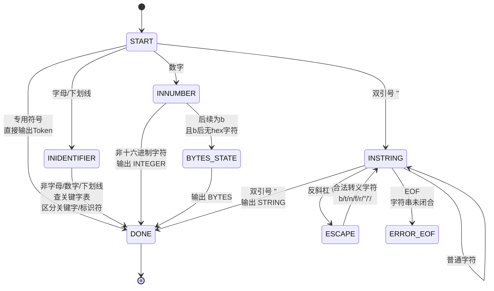
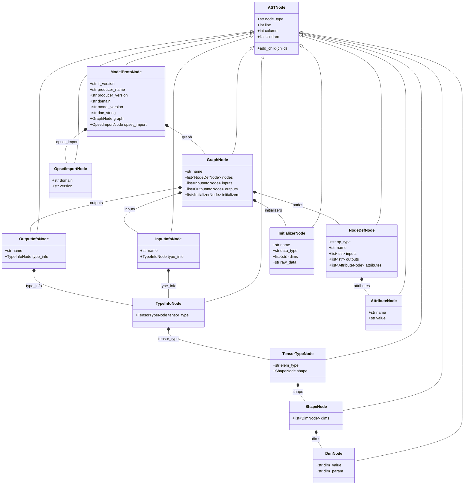

# S-ONNXCompiler 设计方案

## 一、词法分析模块设计方案

### 1.1 词法规则概述

S-ONNX语言的词法规则包含以下几类词法单元：

| 类别 | 数量 | 说明 |
|------|------|------|
| 关键字 | 32个 | 不区分大小写的保留字 |
| 专用符号 | 6个 | `[` `]` `{` `}` `,` `=` |
| 整数(INTEGER) | - | 正则: `(0 | [1-9][0-9]*) (l|L)?` |
| 字符串(STRING) | - | 正则: `"(转义序列|非引号反斜杠字符)*"` |
| 字节数据(BYTES) | - | 正则: `[0-9A-Fa-f]+b` |

### 1.2 自动机(DFA)设计

词法分析器基于确定性有穷自动机(DFA)实现，状态转换如下：



### 1.3 BYTES与INTEGER的区分

BYTES和INTEGER都以数字开头，区分规则为：
- 收集所有十六进制字符 `0-9 A-F a-f`
- 当遇到 `b` 或 `B` 时，检查后面是否还有十六进制字符
- 若 `b` 后无十六进制字符 → `b` 是BYTES终止符，输出BYTES Token
- 若 `b` 后还有十六进制字符 → `b` 是hex内容的一部分，继续收集
- 若无 `b` 结尾 → 输出INTEGER Token

### 1.4 错误处理

词法分析阶段可检测的错误：
1. **非法字符**：不在S-ONNX字符集中的字符
2. **字符串未闭合**：到达EOF时字符串字面量未以双引号结尾
3. **非法转义序列**：字符串中出现 `\x`（x不是合法转义字符）

---

## 二、语法分析模块设计方案

### 2.1 文法规则

S-ONNX的文法规则如下（EBNF表示法，红色`{ }`表示重复0~n次，红色`[ ]`表示可选）：

```
model → "ModelProto" "{" model_body_def "}"

model_body_def → ir_version_def producer_name_def [producer_version_def]
                 [domain_def] [model_version_def] [doc_string_def]
                 graph_def [opset_import_def]

ir_version_def   → "ir_version" "=" INTEGER
producer_name_def → "producer_name" "=" STRING
producer_version_def → "producer_version" "=" STRING
domain_def       → "domain" "=" STRING
model_version_def → "model_version" "=" INTEGER
doc_string_def   → "doc_string" "=" STRING

graph_def       → "graph" "{" graph_body_def "}"
graph_body_def  → name_def {node_def} {input_def} {output_def} [{initializer_def}]

name_def     → "name" "=" STRING
node_def     → "node" "{" op_type_def name_def (input_arr | input_list)
               (output_arr | output_list) [{attribute_def}] "}"

input_list   → {"input" "{" value_info_def "}"}
input_arr    → "input" "=" "[" STRING {"," STRING} "]"
output_list  → {"output" "{" value_info_def "}"}
output_arr   → "output" "=" "[" STRING {"," STRING} "]"

attribute_def → "attribute" "{" name_def value_def "}"
value_def     → "value" "=" STRING

value_info_def → name_def type_def
type_def       → "type" "{" tensor_type_def "}"
tensor_type_def → "tensor_type" "{" elem_type_def shape_def "}"
elem_type_def  → "elem_type" "=" ("int" | "float" | "string" | "bool")
shape_def      → "shape" "{" {dim_def} "}"
dim_def        → "dim" "{" ("dim_value" "=" INTEGER | "dim_param" "=" STRING) "}"

initializer_def → "initializer" "{" tensor_def "}"
tensor_def      → name_def data_type_def dims_def raw_data_def
data_type_def   → "data_type" "=" ("int" | "float" | "string" | "bool")
dims_def        → "dims" "=" INTEGER {INTEGER}
raw_data_def    → "raw_data" "=" BYTES

opset_import_def → "opset_import" "{" domain_def version_def "}"
version_def      → "version" "=" INTEGER
```

### 2.2 分析方法选择

采用**递归下降分析法**（自上而下），原因：
1. 文法规则自然适合递归结构
2. 实现直观，每个非终结符对应一个解析函数
3. 易于构造抽象语法树
4. 错误恢复简单，便于定位

### 2.3 关键设计决策

1. **input_list与input_arr的区分**：当遇到`input`关键字时，向前看一个Token——如果是`=`则是数组形式，如果是`{`则是列表形式
2. **可选字段容错**：`producer_version`、`domain`、`model_version`、`doc_string`等字段设为可选，缺失时赋予默认值并记录语法错误
3. **非法关键字检测**：模型定义结束后检查是否还有IDENTIFIER类型的Token，若有则报告非法关键字错误

---

## 三、抽象语法树设计方案

### 3.1 AST节点类层次



### 3.2 设计原则

1. **简洁性**：每个AST节点只包含语义上必要的字段，不冗余存储
2. **层次性**：节点按S-ONNX的层次结构组织，ModelProto为根
3. **可遍历性**：节点结构支持深度优先遍历，便于语义分析和代码生成
4. **格式化输出**：`format_ast()`函数通过缩进展示AST的树形结构

---

## 四、语义分析模块设计方案

### 4.1 语义检查内容

#### (1) 命名冲突检查

**原理**：遍历AST，使用字典(哈希表)收集所有名称，检测重复。

- **节点名称重复**：同一模型中不允许有两个同名的`node`
- **输出张量名称冲突**：输出张量的名称必须唯一
- **输入定义名称冲突**：`input`定义的名称不能重复
- **初始化器名称冲突**：`initializer`的名称不能重复

**检测方法**：遍历`graph.nodes`、`graph.outputs`、`graph.inputs`、`graph.initializers`，使用set检测重复。

#### (2) 未定义即使用检查

**原理**：建立所有已定义张量名称的集合，检查节点输入引用是否都在集合中。

- **已定义输入张量**：`graph.inputs`中的所有name
- **已定义初始化器**：`graph.initializers`中的所有name
- **已定义中间变量**：前序节点的`outputs`中的所有name
- **检查**：遍历每个`node`的`inputs`列表，若引用名不在已定义集合中则报错

#### (3) 张量类型检查

**原理**：建立张量名到类型的映射表，进行类型一致性检查。

- **同一操作符输入类型一致**：对于多输入节点，所有输入张量的`elem_type`必须相同
- **模型输入输出类型匹配**：对于类型受限的操作符(如Conv, Add, MatMul等)，输出张量的类型应与输入张量的类型一致

### 4.2 属性文法

以类型检查为例，为AST节点定义的属性文法：

```
节点.type_env: 从子节点继承的环境（张量名→类型映射）

node_def → op_type_def name_def input_list output_list [attribute_list]
  规则: ∀ input_i ∈ node.inputs, input_i ∈ type_env
        否则报错: "未定义引用"
  
  规则: ∀ input_i, input_j ∈ node.inputs,
        type_env[input_i] = type_env[input_j]
        否则报错: "输入类型不一致"

  规则: 对于类型受限操作符op,
        ∀ output_k ∈ node.outputs,
        type_env[output_k] = type_env[first_input]
        否则报错: "输入输出类型不匹配"
```

---

## 五、错误处理设计方案

### 5.1 错误分类

| 错误类型 | 产生阶段 | 典型示例 |
|----------|----------|----------|
| 词法错误 | 词法分析 | 非法字符、字符串未闭合、非法转义序列 |
| 语法错误 | 语法分析 | 缺少必要符号、缺少必需字段、非法关键字、结构不匹配 |
| 语义错误 | 语义分析 | 命名冲突、未定义引用、类型不匹配 |

### 5.2 错误报告机制

每条错误信息包含：
1. **错误定位**：文件名、行号、列号
2. **错误描述**：错误类型、具体原因
3. **代码片段**：出错位置的上下文（词法错误提供）

### 5.3 错误恢复策略

1. **词法分析**：遇到非法字符时，跳过该字符继续扫描；字符串未闭合时，构造不完整Token继续分析
2. **语法分析**：缺失可选字段时赋予默认值并记录错误，不中断解析；遇到非法关键字时跳过该定义继续解析
3. **语义分析**：发现错误后不中断，继续检查其他语义规则，尽可能多地收集错误

---

## 六、中间代码生成模块设计方案

### 6.1 三地址码(TAC)规范

| 操作类型 | 三地址码格式 | 示例 |
|----------|-------------|------|
| 输入张量定义 | `T = Input(name, TYPE, [shape])` | `T1 = Input("X", INT, [3, 2])` |
| 输出张量定义 | `Output(name, operand)` | `Output("Y", T5)` |
| 计算操作 | `T = OpType(operands, attrs)` | `T5 = Pad(T1, T2, T3, mode="33")` |
| 权重初始化 | `T = Initializer(name, TYPE, [shape], raw_data=...)` | `T4 = Initializer("conv.bias", INT, [1,2,3,4], raw_data=000000000000)` |

### 6.2 代码生成方法

采用**后序遍历**AST生成中间代码，具体流程：

1. **输入张量定义**：遍历`graph.inputs`，为每个输入生成`Input`指令
2. **初始化器**：遍历`graph.initializers`，为每个初始化器生成`Initializer`指令
3. **计算节点**：按顺序遍历`graph.nodes`，为每个节点生成计算指令
4. **输出张量定义**：遍历`graph.outputs`，为每个输出生成`Output`指令

### 6.3 临时变量映射

维护一个`var_map`字典（张量名 → 临时变量名），确保中间代码中正确引用：
- 输入张量 `X` → `T1`
- 初始化器 `initializer1` → `T2`
- 节点输出 `Y` → `T5`

通过递增计数器生成临时变量名 `T1, T2, T3, ...`

### 6.4 代码生成模式

```
gen(node):
    case InputInfoNode:
        temp = new_temp()
        emit(temp = Input(name, type, shape))
        var_map[name] = temp

    case InitializerNode:
        temp = new_temp()
        emit(temp = Initializer(name, type, shape, raw_data))
        var_map[name] = temp

    case NodeDefNode:
        // 为每个输出分配临时变量
        for output in outputs:
            temp = new_temp()
            var_map[output] = temp
        // 查找输入操作数对应的临时变量
        operands = [var_map.get(inp, inp) for inp in inputs]
        emit(result = op_type(operands, attributes))

    case OutputInfoNode:
        operand = var_map.get(name, name)
        emit(Output(name, operand))
```
