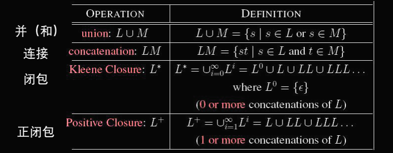
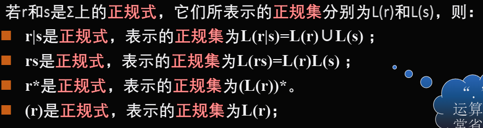
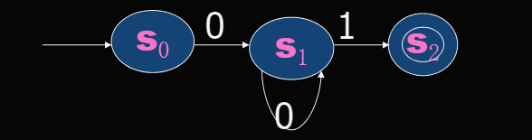

# 编译原理

## 第一章

### 一、编译器构造逻辑阶段划分

- 词法分析程序
  - 逐个读入源程序字符并按照**构词规则**切分成一系列**token**
- 语法分析程序（parser）
  - 以token序列为输入，分析源程序语法结构，判断是否为**合法程序**
- 语义分析程序
  - 语法分析程序确定出语法短语后，**审查是否有语义错误**，为代码生成阶段**收集符号属性信息**、
- 中间代码生成
  - 为了**方便代码优化**，生成介于代码和目 标代码二者之间的中间代码
- 代码优化程序
  - 优化中间代码
- 目标代码生成
  - 将中间代码**翻译成目标程序**

## 第二章

### 词法分析器的作用

#### token序列

token包括：**字符串（词义）**和**类型（词法）**

#### 词法分析器(词法分析程序或扫描器)的任务

从源代码中读取输入字符，按照构词规则切分成一系列单词(token)，提交给语法分析使用

### 正则表达式

#### 基本概念

- 字母表

  由若干元素组成的非空集合

- 符号串

  字母表中符号组成的有穷序列（有前后顺序，ab≠ba）

- 空符号串ε，不包含任何符号的符号串，其长度为0，即｜ε｜=0

- 符号串链接：

  xy连接即为：将y连接在x后

  - εx=xε=x

- 符号串方幂

  符号串自身连接n次得到的符号串xn 定义为 xx…xx； x^1=x, x²=xx，
  规定x^0=ε

- 符号串集合（或语言）：若集合A中所有元素都是某字母表∑上的符号串，则称A为字母表∑上的符号串集合

#### 基本操作

##### 符号串集合操作

#### 正则表达式定义

##### 定义

用特定的运算符及运算对象，用有限的表达式去解决无限个字符串匹配的问题

##### 正规集

每个正规表达式匹配（或代表、或表示）一个字符串的集合，(字符串的集合，也是正规表达式定义的语言)

##### 辅助字母表 Σ′

Σ′中的符号不是语言中的字符，而是用来书写正规表达式的符号

- ∣ 表示并
- $\cdot$ 表示连接（可以省略）
- **$*$ 表示闭包**
- $( )$ 表示优先级
- **$\varepsilon$ 表示空串**
- **$\phi$ 表示空集**

##### 结构：

- 设有字母表为Σ，辅助字母表Σ’={ф, ε, | , . , * , ( ) }，正规表达式和它所表示的正规集的递归定义如下：
  - 
  - ε和ф是Σ上的正规式，它们所表示的正规集分别为{ε} 和{ }；
  - 若a∈Σ，则a是Σ上的正规式，它所表示的正规集为{a}
- 
- 算符的优先级为先“ ( ) ”“ * ”，再“ . ”最后“ | ” ，它们满足左结合律
- 给定一个正规式，它**唯一确定一个正规集**；给定一个正规集，则可由多个不同的正规式表示

##### 正规表达式的扩展

- r*表示r被重复0次或更多次
- r+表示r被重复1次或更多次
- ? 表示正规表达式匹配的串是可选的

### 确定性有穷自动机（DFA）

#### 组成

确定性有穷自动机（DFA）是由五个要素组成的五元式M=(S，∑，T，s0，A)

- S：有限个状态的集合
- ∑：有限个输入符号组成的字母表
- T：转换函数
- s0：初始状态
- A：接受状态

#### 状态转换图

假定DFA M含有m个状态，那么状态图就含有m个结点（小圆圈表示圆圈中标入状态的名字或编号），用箭头指示初始状态，用双圆圈表示终止状态

#### DFA的接受集

L(M)，字符串c1 c2 ……cn若被DFA识别或接受，则在状态转换图中存在一条从初态到终态的有向路经，该路径所有矢线上方的字符连接在一起即是字符串c1 c2 ……cn

### 非确定性有穷自动机（NFA）

五元式和DFA一样，但转换函数**T**为进入{sk1,…, skm}中的任何一个状态 

### 用代码实现有穷自动机

## 第三章

第二章

词法分析两个概念：

正则表达式作用定义和内涵，理解，能用；

数学模型自动机（确定性有穷自动机），非确定到确定不应掌握，  

**上下文挖文法，如何使用和定义，必须掌握，单词序列怎么构成程序，什么样是合法的，重要！  
语法结构，最左推导**  

**第四章  
自上而下：递归下降，必须会写  
ll1分析算法的流程，构成表格，false表什么的  
自下而上的语法分析算法：自动机和具体算法细节不考，大概会即可，LR算法分析原理，画出自动机，能够手动分析符号串是否合法  
语义分析：会写属性文法  
中间代码生成的原理，课件上有的就行  
第七章的c的内存运行组织情况，画内存组织记录  
代码优化：dag必须会，有控制流图要会找循环，要知道原理**  