# 计算机图形学

## 一、绪论

计算机图形学是研究用计算机 **生成、处理和显示 图形**的一门学科

图的两中表示方法：

- 点阵法：像素图、位图或图像——图像
- 参数法：矢量图——图形

图像：二维，基本单位是 **像素**

图形：二维/三维，基本信息：**基本几何元素**，拓扑关系，颜色，材质，纹理

图形处理和输出技术：

- 计算单元三角形的法向矢量， **确定亮度，色彩**
- 基本图元扫描和填充
- 图形变换等操作，**确定显示范围**
- 最后生成的图像：
  - 线条
  - 明暗图

- 

|          | 图形                            | 图像                   |
| -------- | ------------------------------- | ---------------------- |
| 表示方法 | 参数法（矢量图）                | **点阵法**（位图）     |
| 基本单位 | **几何元素**（点、线、面、体）  | **像素（Pixel）**      |
| 维度     | 可二维或三维                    | 仅二维                 |
| 放大效果 | 无失真                          | **会失真**             |
| 文件格式 | OBJ、3DS 等                     | JPEG、BMP、PNG、GIF 等 |
| 存储内容 | 几何+非几何属性（颜色、材质等） | 颜色矩阵（像素值）     |
| 修改     | 较简单                          | 复杂                   |


## 二、图形系统与图像生成

图形系统的基本功能：**计算、存储、输入、对话、输出**

显示器分类：

- CRT
- LCD
- PDP

光栅扫描显示原理：

- 电子束从上到下，从左至右扫描，扫描一次成为 **一条扫描线**

画直线：

- DDA算法
- Bresenham算法（可以画圆）

填充光栅系统颜色：

- 扫描填充
- 种子填充——4连通/8连通
- 泛填充算法

三维模型：

- 线框模型
- 曲面模型
- 实体模型

世界坐标系：

- 三维笛卡尔坐标
- 三维柱坐标
- 三维球坐标

## 三、图形编程基础

#### 基本图形元素绘制：

1. 画直线：

   1. MoveTo
   2. LineTo

2. 矩形：Rectangle

3. 椭圆：Ellipse

4. 颜色填充：CBrush NewBrush,*pBrush

   ```
   NewBrush.CreateSolidBrush(color);
   NewBrush.DeleteObject();
   SelectBrush(Newbrush);//选用画刷
   ```

#### OpenGL应用

1. 初始化创建窗口——glutInit
2. 处理窗口和输入
   1. glutDisplayFunc：绘制当前窗口
   2. glut____________Func：指定上面窗口
3. 绘制三维物体：glut________Cube
4. 后台管理：glutIdleFunc
5. 运行程序：glutMainLoop

#### OpenGL编程：

1. 定义绘制有关属性
2. 初始化
3. 渲染屏幕图像

openGL函数命名：

 **库名** + **设定** + **参数个数和类型**

- 初始化打开窗口/变换窗口：glutReshapeFunc(void(*func)(width,height))
- 定义视区：glViewport(x,y,width,heigh)——x，y是左下角坐标
- 设置顶点：glVertex3f（）

**所有的几何图最终都是通过一组有序的顶点来描述的**

## 四、图形观察与变换

三种：**平移变换、旋转变换、比例变换**

变换通常使用矩阵来表示：

  [x']   [1  0  tx]   [x]
  [y'] = [0  1  ty] × [y]
  [1 ]   [0  0  1 ]   [1]

##### 旋转变换：

x2=x * cos-y * sin

y2=x * sin+y * cos

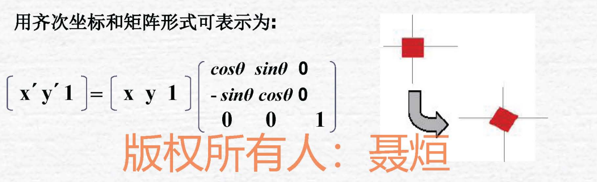

##### 比例变换：

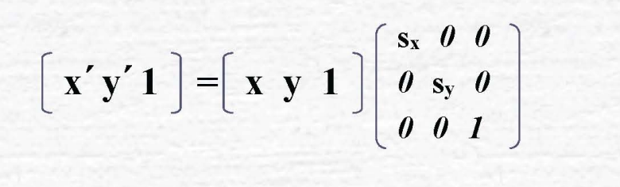

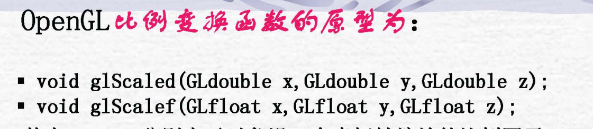

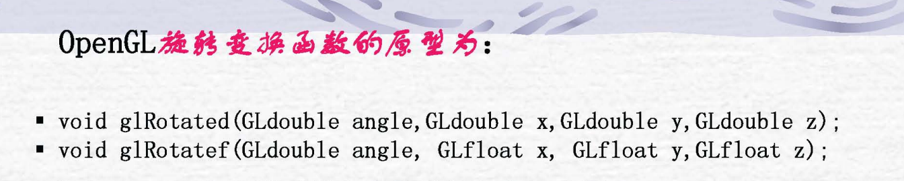

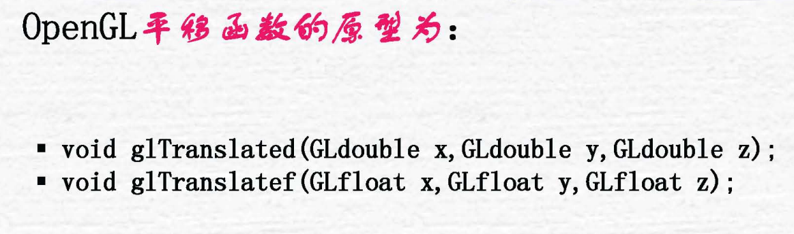

##### 错切变换：

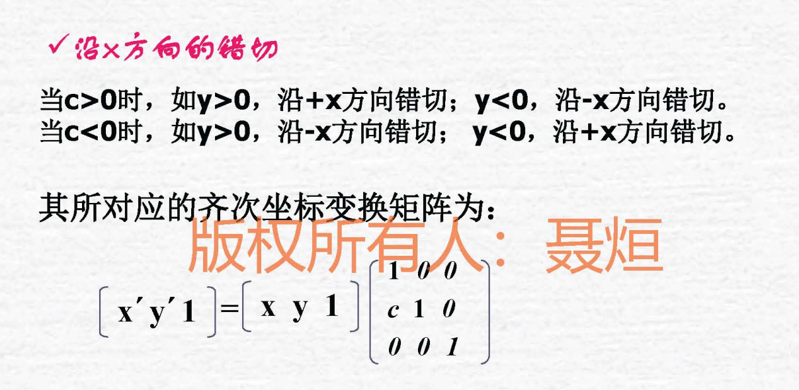

##### 观察变换：

### 三维几何变换：

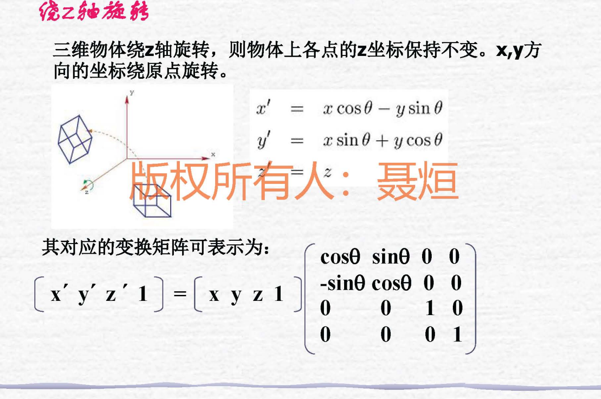

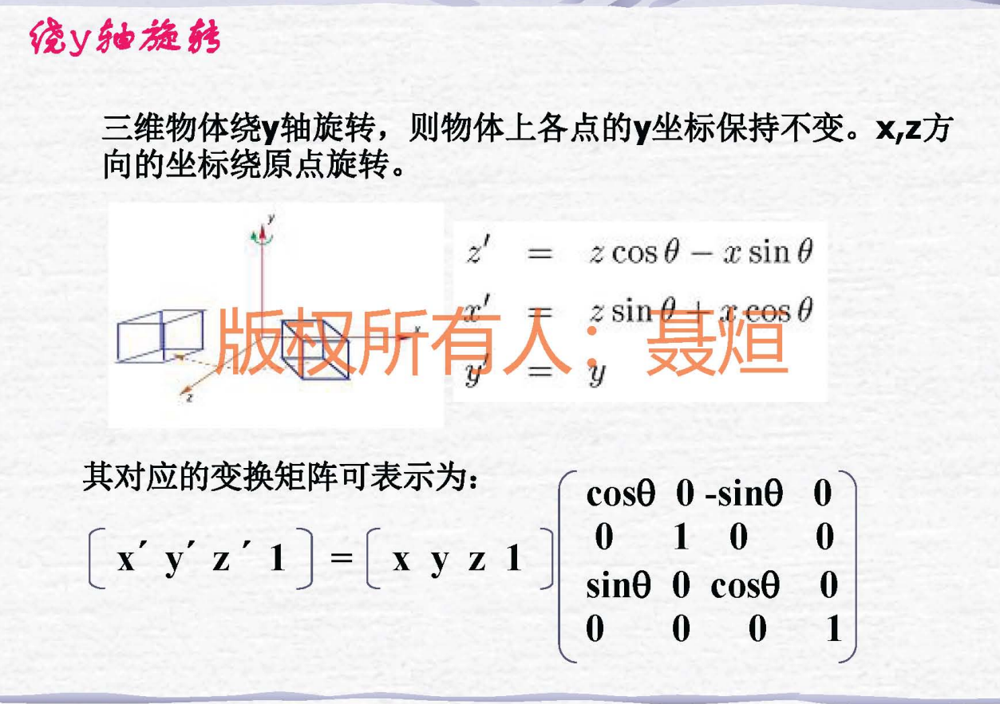

##### 投影变换：

- 平行投影
  - 正平行投影
  - 斜平行投影
- 透视投影

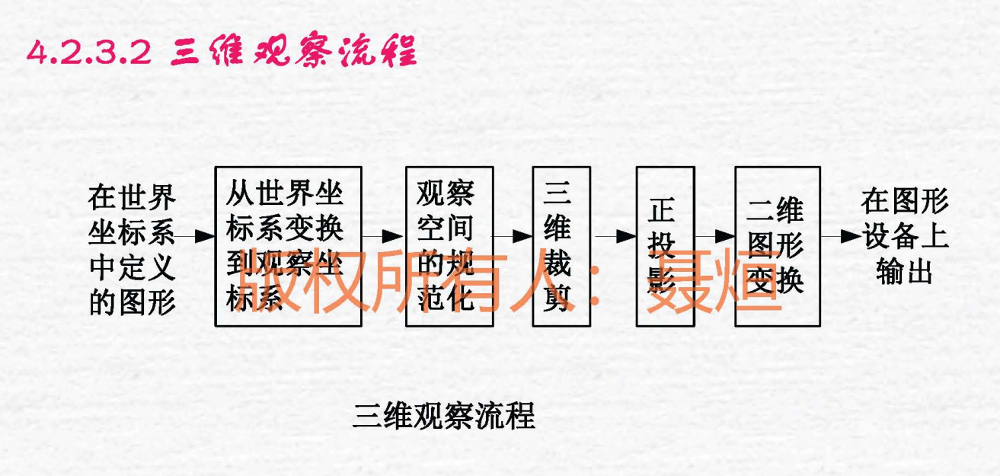

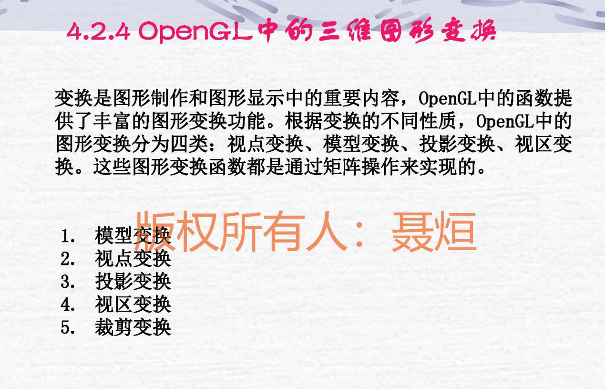

### 矩阵操作函数：

- **矩阵栈：**
  - dlMartixMode(mode)
  - glPushMartix(void)
  - glPopMartix
- **glTranslate()——平移**
- **glRotate()——旋转**
- **glScale()——缩放**
- gluLookAt()——设置视觉坐标系
- **投影：**
  - glOrtho()——正交投影
  - glFrustum()——透视投影
- **视区变换：**
  - glViewport()
- 裁剪变换
  - glClipPlane()

## 五、三维物体的表示

曲线曲面类型

- 规则曲线/曲面
- 自由曲线/曲面

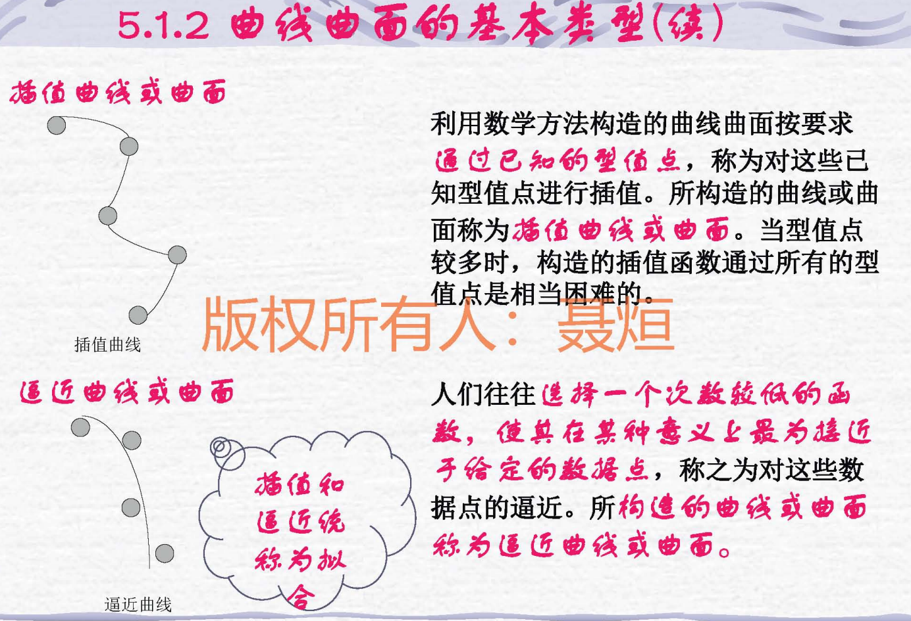

逼近曲线/曲面：拟合的一种，曲线接近数据点

### 三次样条：

**！！！！！！三次Hermite样条**

### 贝塞尔曲线：

## 六、计算机动画

- 动画制作软件系统：
  - 脚本系统
  - 程序动画
  - 表示动画
  - 随机动画
  - 行为动画

计算机动画类型：

- 实时动画
- 逐帧动画

关键帧技术：

- 关键帧插值法
- 运动轨迹法
- 运动动力学法

动画实现：

- 双缓冲技术

- 窗口定时刷新：

  ```
  glutTimerFunc
  ```


## 七、真实图像处理

生成过程：

1. 建模
2. 转化为二维平面透视层
3. 确定所有可见面
4. 计算场景颜色，生成图形

#### 消除二义性：

- 面消隐
- 线消隐

**可见面判别算法：**

- 物空间

- 像空间

- 算法类别：

  - 后向面消隐：外表面法向量与观察点的夹角在0-90°，就是可见面4

  - 画家算法：列表优先，将三维空间距离观察点远的的物体先投影到屏幕上，后投影的图像会覆盖前面的图像

    如果存在两个面互相遮盖，就将这两个图像分解再投影

  - 区域细分算法：递归分割，分情况求解

反射光：

- 镜面反射：高亮度反射——一个方向反射
- 漫反射：从各个点观察某个点的亮度是固定的——各个方向反射
- 环境光：环境中均匀的，有相同明暗度的
- 

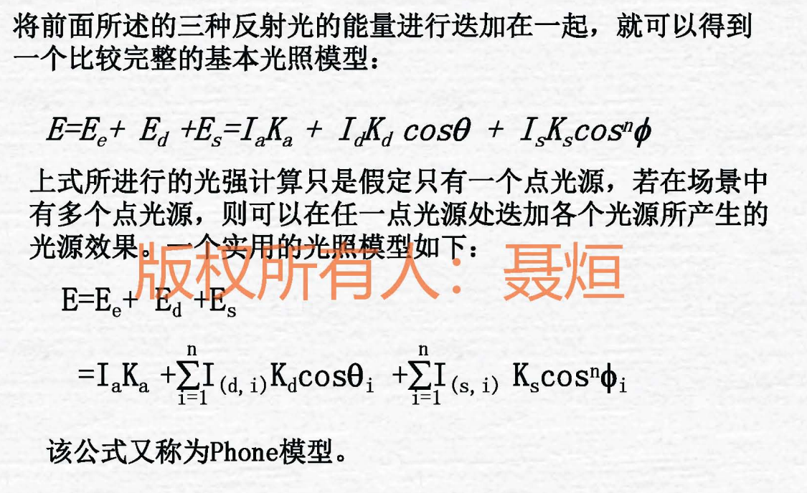

明暗处理法：

- Flat明暗处理法：恒定光强，将景物转化为多个面，每一个面分别计算反射

  1. 光源处于无穷远
  2. 观察点距离物体表面无穷远
  3. 景物精确表示为多边形

- Gouraud明暗处理：亮度插值明暗处理

  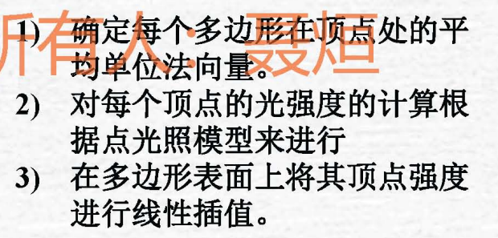

  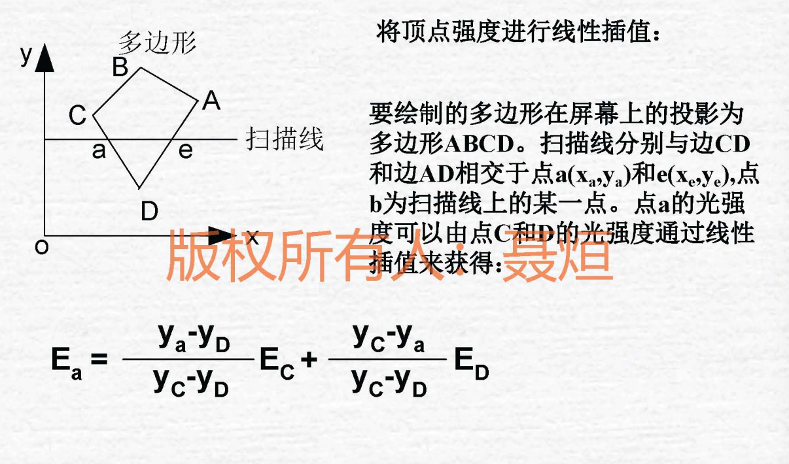

  插值即为按比例计算这个点的亮度

- phone法向插值法：沿着扫描线对各个点的法矢量进行插值

  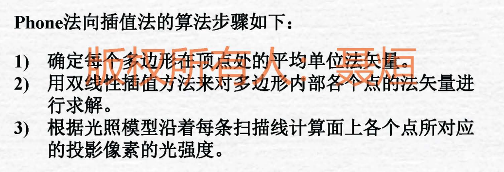

#### 透射光：

- 插值透明
- 过滤透明
- 处理透明的方法：
  1. 处理不透明的物体决定可见不透明表面的深度
  2. 判断透明物体是否可见，计算反射光强度并和在帧存储器中的不透明面光强度相加

阴影产生：

- 自身阴影
- 投射阴影

whitted光照模型：

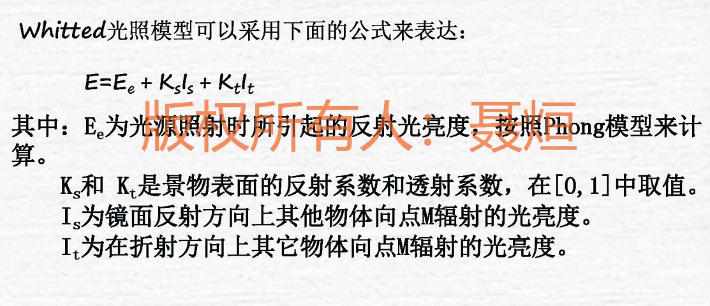

### 纹理处理：

纹理分类：

- 几何纹理——扰动映射

- 颜色纹理——纹理映射

  将任意的图形或者图像覆盖到物体表面形成真实的色彩花纹

  - 从纹素出发，映射到物体空间，再映射到屏幕空间
  - 从像素出发，映射到物体空间，再映射到纹理空间

颜色模型：

- RGB颜色模型
- CYM颜色模型 ：青-黄-品红
- HSV模型：颜色-饱和度-明暗值

### 材质：

材质相比于纹理，表述更偏向于光泽，和本身的属性

OpenGL纹理处理

openGL光照模型：

光线构成：

- 发射光
- 漫反射光
- 镜面反射光
- 泛光

光源：glLight()

- 颜色
- 位置
- 衰减
- 聚光
- 光照模式
  - 全局环境光
  - 观察点性质
  - 光照面
- 材质属性
  - 漫反射和泛射
  - 镜面反射
  - 发射光
- 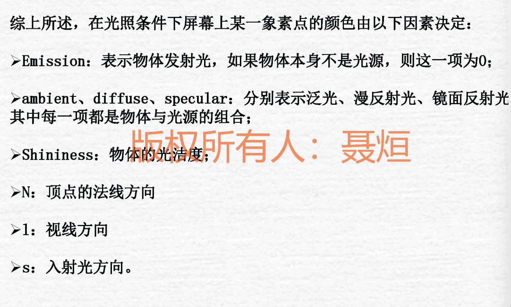

