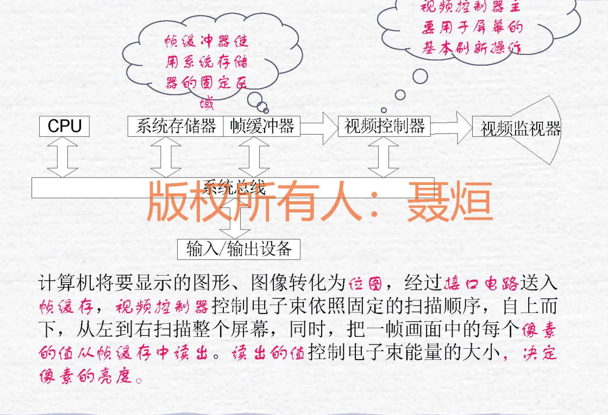
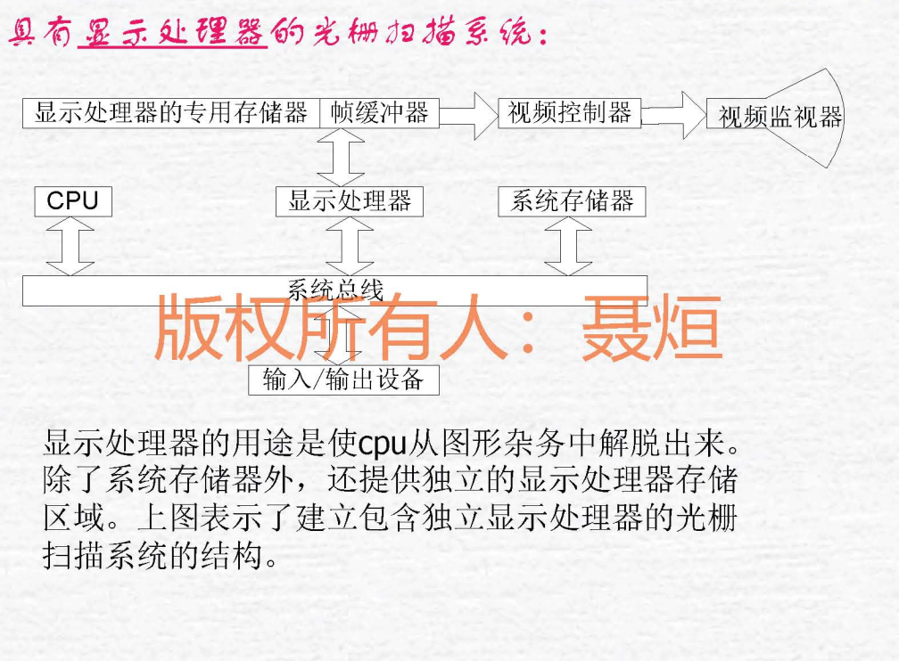
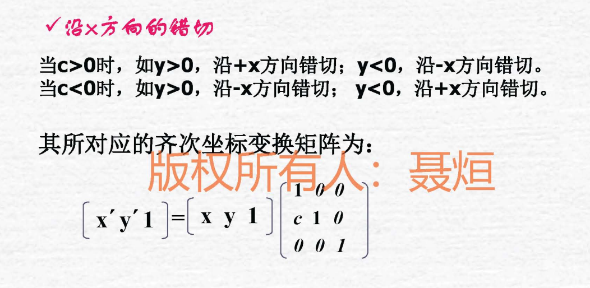

# 计算机图形学复习总结

> 本文档基于课程笔记整理，系统梳理计算机图形学核心知识点

---

## 📚 知识体系框架

```
计算机图形学
├── 基础概念（图形 vs 图像）
├── 图形系统与生成算法
├── 图形编程基础（OpenGL）
├── 几何变换与投影
├── 三维表示（曲线曲面）
├── 计算机动画
└── 真实感图形学
    ├── 消隐算法
    ├── 光照模型
    ├── 明暗处理
    └── 纹理与材质
```

---

## 第一章 绪论

### 1.1 核心定义

**计算机图形学**：研究用计算机 **生成、处理和显示图形** 的学科

构成图形的要素：**几何元素、非几何元素**

### 1.2 图形 vs 图像（重要对比）

| 对比项   | 图形（Graphics）                    | 图像（Image）          |
| -------- | ----------------------------------- | ---------------------- |
| 表示方法 | 参数法（矢量图）                    | 点阵法（位图）         |
| 基本单位 | 几何元素（点、线、面、体）          | 像素（Pixel）          |
| 维度     | 可二维或三维                        | 仅二维                 |
| 放大效果 | **无失真**                          | **会失真**             |
| 文件格式 | OBJ、3DS                            | JPEG、BMP、PNG、GIF    |
| 存储内容 | 几何+非几何属性（颜色、材质、纹理） | 颜色矩阵（像素值）     |
| 数据量   | 小                                  | 大                     |
| 应用场景 | CAD、动画、建模                     | 照片、扫描图、数字图像 |
| 编辑     | 较为简单                            | 困难                   |

**记忆要点**：

- 图形 = 参数描述，可缩放无损
- 图像 = 像素阵列，放大模糊

---

## 第二章 图形系统与图像生成

计算机图形系统是计算机图形硬件和图形软件的集合

### 2.1 图形系统基本功能（5大功能）

1. **计算** - 几何变换、光照计算
2. **存储** - 帧缓存、显存
3. **输入** - 鼠标、键盘、数位板
4. **对话** - 人机交互界面
5. **输出** - 显示器、打印机

### 2.2 显示器技术

#### 显示器分类

**CRT（阴极射线管显示器）**

CRT的图形完全由显示器上 **像素位置的亮度**决定

- **原理**：电子枪发射电子束，轰击荧光屏产生图像
- **组成**：电子枪，聚焦系统，偏转系统，荧光屏
- **色彩显示技术**：电子束穿透法和荫照法
- **特点**：
  - 图像刷新频率高（60-85Hz）
  - 视角广，色彩还原好
  - 体积大，功耗高，有辐射
- **应用**：传统台式机显示器（已被淘汰）

#### 显示器性能指标

| 指标         | 说明                               | 典型值          |
| ------------ | ---------------------------------- | --------------- |
| 分辨率       | 水平×垂直像素数                    | 1920×1080       |
| 刷新频率     | 每秒重绘屏幕次数                   | 60Hz, 120Hz     |
| 响应时间     | 像素颜色切换所需时间               | 1-5ms           |
| 色深         | 每像素颜色位数                     | 24位（真彩色）  |
| 亮度         | 屏幕发光强度                       | 250-400 cd/m²   |

### 2.3 光栅扫描显示原理（重点）

#### 扫描方式

**逐行扫描**：
- 电子束从 **左至右、从上到下** 逐行扫描
- 每一行形成一条 **扫描线（Scan Line）**
- 扫描完整个屏幕称为一帧

**扫描过程**：

```
┌─────────────────────────┐
│ →→→→→→→→→→→→→→→→→→ (行1) │  ← 水平扫描
│ →→→→→→→→→→→→→→→→→→ (行2) │
│ →→→→→→→→→→→→→→→→→→ (行3) │  ↓ 垂直回扫
│        ...              │
│ →→→→→→→→→→→→→→→→→→ (行n) │
└─────────────────────────┘
```

**光栅扫描显示器特点**：

- 画点设备
- 不能画出直线，只能用点近似直线
- 每秒都要刷新，否则会**闪烁**

**分辨率：**水平×竖直的像素数

### 2.4 帧缓冲器（重点）

#### 基本概念

**定义**：存储屏幕上每个像素强度值/颜色信息值的存储区域，**单元个数与像素总数相同，与像素一一对应**

**结构**：

```
帧缓冲器 = 二维像素阵列
每个像素占用 n 位（n = 色深）

示例：1920×1080分辨率，24位色深
存储容量 = 1920 × 1080 × 24 / 8 = 6,220,800 字节 ≈ 6MB
```

需要多少bit：寄存器位数×竖直像素数×水平像素数

**彩色查找表**：在帧缓冲器后增加，扩充颜色数目

#### 光栅扫描系统：

CPU、视频控制器（控制显示设备操作）、帧缓冲器（在系统存储器中，视频控制器范文后可以刷新屏幕）

结构：

- 
- 
- **扫描转换**是将应用程序给出的图形定义 数字化为一组像素强度值，存储到帧缓冲器

#### 双缓冲技术（重要）

**问题**：直接在显示的帧缓冲器上绘制会产生闪烁和撕裂

**解决方案**：使用两个帧缓冲器

- **前缓冲区（Front Buffer）**：供显示器读取显示
- **后缓冲区（Back Buffer）**：供渲染引擎绘制

**工作流程**：
```
1. 在后缓冲区绘制下一帧
2. 绘制完成后交换前后缓冲区指针
3. 显示新的一帧，同时在新的后缓冲区绘制
```

**优点**：
- 消除闪烁
- 避免画面撕裂
- 提升视觉体验

### 2.5 显示卡主要部件

#### 显卡（Graphics Card）结构

```
显卡
├── GPU（图形处理器）- 核心计算单元
├── 显存（Video RAM）- 存储图形数据u 
├── RAMDAC - 数模转换器
├── 总线接口 - 与主板通信（PCIe）
├── 显示器插座
└── 输入输出系统接口

```

#### 处理过程：

1. CPU传输到GPU
2. 数据处理，存储到RAM
3. 进行转换（视频控制器）
4. 输出到显示器

### 2.6 画直线算法（必考）

**扫描转换：**

1. 确定像素集合
2. 赋予属性

#### (1) DDA算法（数字差分分析仪）

**核心思想**：利用直线方程通过增量计算逐点绘制直线，避免每次重新计算完整方程。

**基本原理**：

1. **计算斜率k**：k = (y₁ - y₀) / (x₁ - x₀)

2. **根据斜率选择步进方向**：
   - 如果 |k| ≤ 1：沿x轴方向每次步进1，y按斜率递增
   - 如果 |k| > 1：沿y轴方向每次步进1，x按1/k递增

3. **增量迭代**：
   - 从起点开始，每次在主方向上步进1个像素
   - 另一个方向按斜率增量累加
   - 对浮点坐标进行**四舍五入**得到实际像素坐标

**算法步骤（以|k|≤1为例）**：
```
1. 初始化：x = x₀, y = y₀
2. 循环直到终点：
   - 绘制像素点 (round(x), round(y))
   - x = x + 1
   - y = y + k
```

**缺点**：
- 需要**浮点运算**（乘法和四舍五入）
- 效率相对较低
- 可能存在累积误差

#### (2) Bresenham算法（推荐）

```
方法：维护一个误差变量d

  - d < 0：理论直线偏下 → y不变
  - d > 0：理论直线偏上 → y+1，并修正误差

  步骤：
  1. 初始化：d = 2Δy - Δx
  2. 每步：
     - 画点(x, y)
     - 如果 d > 0：y+1，d减去2Δx
     - x总是+1，d总是加上2Δy

  本质：用误差累积代替斜率计算，把浮点问题变成整数问题。
  初始：d = 2Δy - Δx
  每步：d先判断，再加2Δy
  若d>0：y要+1，d还要减2Δx
```

**核心思想**：通过**误差累积判断法**来决定下一个像素应该选择哪个位置，完全避免浮点运算和除法。

**基本原理（以0 < k < 1为例）**：

假设当前像素在 (xₚ, yₚ)，下一个x坐标必定是 xₚ+1，但y坐标有两个候选：
- **yₚ**（保持不变）
- **yₚ+1**（向上走一步）

关键是：**判断理论直线与这两个候选点哪个更近**

**决策方法**：

1. **计算误差项d**：
   - 初始误差 d = 0
   - 每步进一个x，误差增加 Δy（分子）
   - 当累积误差 d ≥ Δx（分母）时，说明该向上走了

2. **判断规则**：
   - 如果 d < Δx/2：选 yₚ（不变）
   - 如果 d ≥ Δx/2：选 yₚ+1，同时 d = d - Δx

3. **整数化技巧**：
   - 把所有判断乘以2Δx，消除分数
   - 初始误差改为 d = 2Δy - Δx
   - 每次x增加：d = d + 2Δy
   - 当d > 0时：y增加，d = d - 2Δx

**算法步骤（0 < k < 1）**：

```
1. 计算：Δx = x₁ - x₀, Δy = y₁ - y₀
2. 初始化：x = x₀, y = y₀, d = 2Δy - Δx
3. 循环直到终点：
   - 绘制像素 (x, y)
   - if (d > 0):  // 误差偏大，需要向上
       y = y + 1
       d = d - 2Δx
   - x = x + 1
   - d = d + 2Δy
```

**优点**：

- **只用整数加减法**，无需浮点运算
- **无需乘除法**（只需预先计算2Δx和2Δy）
- 速度快、效率高
- 无累积误差
- 对称性好

**与DDA对比**：

| 特性       | DDA      | Bresenham  |
| ---------- | -------- | ---------- |
| 运算类型   | 浮点运算 | 整数运算   |
| 四舍五入   | 需要     | 不需要     |
| 速度       | 较慢     | 很快       |
| 精度       | 可能累积误差 | 无累积误差 |

**考点**：能手写Bresenham算法流程

### 2.7 区域填充算法

| 算法类型 | 原理                                   | 连通性       |
| -------- | -------------------------------------- | ------------ |
| 扫描填充 | 逐行扫描，计算交点区间填充             | -            |
| 种子填充 | 从种子点递归/栈扩展填充                | 4连通/8连通  |
| 泛填充   | 结合扫描线和种子填充，处理复杂边界填充 | 4连通/8连通  |

#### 扫描填充：

奇数填到偶数

**种子填充：**

- **边界填充算法（Boundary Fill）**：
  - 从种子点开始，填充到遇到指定边界颜色时停止
  - 填充条件：当前像素不是边界颜色且未被填充
  - 停止条件：遇到边界颜色就停止向该方向扩展
  - 实现方式：递归实现或迭代实现（使用栈/队列）
  - 适用场景：有明确边界线的封闭区域填充

- **泛填充算法（Flood Fill）**：
  - 从种子点开始，填充所有与种子点颜色相同或在指定容差范围内的连通区域
  - 参考标准：以种子点的原始颜色为基准
  - 填充范围：颜色连通区域
  - 容差支持：允许颜色有一定差异范围内也被填充
  - 实现方式：递归实现或扫描线实现
  - 适用场景：颜色相近区域的统一修改，无明确边界的区域填充

**两种算法主要区别**：
| 特征 | 边界填充算法 | 泛填充算法 |
|------|-------------|-----------|
| **停止条件** | 遇到边界颜色停止 | 遇到与种子点颜色不同时停止 |
| **参考标准** | 边界颜色 | 种子点颜色（及容差范围）|
| **应用** | 有明确边界的区域 | 颜色相近的连通区域 |
| **灵活性** | 固定边界，较严格 | 容差可调，更灵活 |

**扫描线边界填充算法实现过程**：

**1. 边界填充递归过程**：
- 检查是否为边界色或已填充 → 若否则填充 → 递归处理四个相邻点

**2. 扫描线边界填充过程**：
- **步骤1：初始化**
  - 输入：种子点坐标(startX, startY)，填充颜色，边界颜色
  - 数据结构：使用队列存储待处理的种子点

- **步骤2：向左扩展**
  - 从种子点向左扫描，直到遇到边界颜色或已填充区域
  - left = startX
  - while getPixel(left, y) != boundaryColor and getPixel(left, y) != fillColor:
    - left--
  - left++  // 回退到第一个有效像素

- **步骤3：向右扩展并填充**
  - 从种子点向右扫描，填充连续区域
  - right = startX
  - while getPixel(right, y) != boundaryColor and getPixel(right, y) != fillColor:
    - putPixel(right, y, fillColor)  // 填充当前像素
    - right++
  - right--  // 回退到最后一个有效像素

- **步骤4：检测相邻扫描线的种子点**
  - for i = left to right:
    - // 检查上方扫描线
    - if getPixel(i, y-1) != boundaryColor and getPixel(i, y-1) != fillColor:
      - queue.push((i, y-1))
    - // 检查下方扫描线
    - if getPixel(i, y+1) != boundaryColor and getPixel(i, y+1) != fillColor:
      - queue.push((i, y+1))

**3. 完整算法流程**：
- 1. 创建队列，将种子点(startX, startY)入队
- 2. 当队列不为空时循环：
  - a. 取出队首元素(x, y)
  - b. 沿当前扫描线y向左找到边界
  - c. 沿当前扫描线y向右找到边界并填充
  - d. 检查上下相邻扫描线，添加新的种子点
- 3. 队列为空时结束

**4. 泛填充扫描线过程**：
- 从种子点向左右扩展找到当前行填充范围
- 填充整行
- 检查上下行寻找新的种子点
- 与边界填充的主要区别：判断条件改为检查是否为原始颜色

### 2.8 三维模型表示

1. **线框模型** - 仅表示边，无表面信息
2. **曲面模型** - 包含表面，可计算法向量
3. **实体模型** - 包含体积、质量等物理属性

### 2.9 三维坐标系（世界坐标系）

- 笛卡尔坐标 `(x, y, z)`
- 柱坐标 `(ρ, θ, z)`
- 球坐标 `(r, θ, φ)`

---

## 第三章 图形编程基础

### 3.1 OpenGL编程流程

```
1. 定义绘制属性（颜色、材质等）
2. 初始化窗口和上下文
3. 渲染屏幕图像
```

#### 画直线：

- `MoveTo`
- `LineTo`

#### 矩形——`Rectangle`

#### 椭圆——`Ellipse`

#### 圆弧——`Arc`

#### 多边形——`Polygon`

### 3.2 核心函数（分类记忆）

#### 窗口管理

- `glutInit()` - 初始化GLUT
- `glutCreateWindow()` - 创建窗口
- `glutDisplayFunc()` - 注册绘制回调
- `glutMainLoop()` - 进入事件循环

#### 绘制函数

- `glBegin(mode) ... glEnd()` - 开始/结束绘制
- `glVertex3f(x, y, z)` - 设置顶点
- `glColor3f(r, g, b)` - 设置颜色

#### 线段绘制

**基本绘制模式**：
- `GL_LINES` - 独立线段，每两个顶点一条线
- `GL_LINE_STRIP` - 连续折线，顶点依次连接
- `GL_LINE_LOOP` - 闭合折线，首尾相连

**线段属性设置**：
- `glLineWidth(2.0f)` - 设置线宽（像素）
- `glEnable(GL_LINE_SMOOTH)` - 启用线段反走样
- `glLineStipple(1, 0x00FF)` - 设置虚线模式
- `glEnable(GL_LINE_STIPPLE)` - 启用虚线

#### 多边形绘制

**基本绘制模式**：
- `GL_TRIANGLES` - 独立三角形，每三个顶点
- `GL_TRIANGLE_STRIP` - 三角形条带，共享顶点
- `GL_TRIANGLE_FAN` - 三角形扇，以第一个点为中心
- `GL_QUADS` - 独立四边形，每四个顶点
- `GL_QUAD_STRIP` - 四边形条带
- `GL_POLYGON` - 任意多边形（凸多边形）

**多边形属性控制**：
- `glPolygonMode(GL_FRONT_AND_BACK, GL_FILL)` - 填充模式
- `glPolygonMode(GL_FRONT_AND_BACK, GL_LINE)` - 线框模式
- `glPolygonMode(GL_FRONT_AND_BACK, GL_POINT)` - 点模式
- `glEnable(GL_CULL_FACE)` - 启用面剔除
- `glCullFace(GL_BACK)` - 剔除背面
- `glFrontFace(GL_CCW)` - 顶点逆时针为正面

**绘制示例**：
```c
// 绘制三角形
glBegin(GL_TRIANGLES);
    glColor3f(1.0, 0.0, 0.0);
    glVertex3f(-1.0, -1.0, 0.0);
    glColor3f(0.0, 1.0, 0.0);
    glVertex3f(1.0, -1.0, 0.0);
    glColor3f(0.0, 0.0, 1.0);
    glVertex3f(0.0, 1.0, 0.0);
glEnd();
```

#### 几何体（记忆常用）
- `glutWireCube()` / `glutSolidCube()` - 立方体
- `glutWireSphere()` / `glutSolidSphere()` - 球体
- `glutWireTeapot()` / `glutSolidTeapot()` - 茶壶（经典测试模型）

### 3.3 OpenGL函数命名规则

**格式**：`库前缀` + `基本名` + `参数个数` + `参数类型`

**示例**：
- `glVertex3f` → gl库 + Vertex + 3个参数 + float类型
- `gluLookAt` → glu库 + LookAt
- `glutSolidSphere` → glut库 + SolidSphere

### 3.4 重要概念

**所有几何图元最终都通过一组有序顶点描述**

---

## 第四章 图形观察与变换

### 4.1 二维几何变换（三大基本变换）

#### (1) 平移变换

```
[x']   [1  0  tx]   [x]
[y'] = [0  1  ty] × [y]
[1 ]   [0  0  1 ]   [1]
```

#### (2) 旋转变换（绕原点逆时针旋转θ）

```
x' = x·cosθ - y·sinθ
y' = x·sinθ + y·cosθ

矩阵形式：
[cosθ  -sinθ  0]
[sinθ   cosθ  0]
[0      0     1]
```

#### (3) 比例变换

```
[x']   [sx  0   0]   [x]
[y'] = [0   sy  0] × [y]
[1 ]   [0   0   1]   [1]
```

**参数说明**：
- `sx`, `sy` > 1：放大
- `sx`, `sy` < 1：缩小
- `sx ≠ sy`：拉伸

#### (4) 错切变换

**X方向错切**：
```
x' = x + shx·y
y' = y
```

**Y方向错切**：
```
x' = x
y' = y + shy·x
```



**同正异负**

#### 二维观察变换

世界坐标系➡规格化设备坐标系➡设备坐标系

#### 窗口和视区

**窗口（Window）**

**定义**：世界坐标系中定义的矩形区域，是我们想要观察的场景部分

**特点**：
- 在世界坐标系中定义
- 可以是任意大小和位置
- 用于裁剪：只显示窗口内的图形
- 窗口外的图形会被裁剪掉

**OpenGL函数**：
```c
glOrtho(left, right, bottom, top, near, far);  // 定义正交投影窗口
glFrustum(left, right, bottom, top, near, far); // 定义透视投影窗口
```

**视区（Viewport）**

**定义**：屏幕坐标系中显示窗口内容的矩形区域

**特点**：
- 在屏幕坐标系中定义
- 通常是显示器的子区域
- 用于显示：将窗口内容映射到屏幕
- 单位是像素

**OpenGL函数**：
```c
glViewport(x, y, width, height);  // 设置视区位置和大小
```

**映射关系**

```
世界坐标系 → 窗口（裁剪） → 规范化设备坐标 → 视区（显示）→ 屏幕坐标
```

**变换过程**：
1. 窗口裁剪：去掉窗口外的图形
2. 规范化：映射到[-1,1]×[-1,1]范围
3. 视区变换：映射到屏幕像素坐标

**主要区别总结**

| 特征   | 窗口           | 视区           |
|--------|----------------|----------------|
| 坐标系 | 世界坐标系     | 屏幕坐标系     |
| 作用   | 定义观察区域   | 定义显示区域   |
| 单位   | 实际长度单位   | 像素           |
| 变换   | 裁剪操作       | 显示映射       |
| 灵活性 | 可任意缩放平移 | 受屏幕尺寸限制 |

### 4.2 齐次坐标

**为什么使用齐次坐标？**

- 统一平移、旋转、缩放为矩阵乘法
- 便于复合变换计算

**转换规则**：
- 2D点 `(x, y)` → `(x, y, 1)`
- 3D点 `(x, y, z)` → `(x, y, z, 1)`

### 4.3 三维几何变换

#### 旋转变换（绕坐标轴）

**绕Z轴旋转**：
```
[cosθ  -sinθ  0  0]
[sinθ   cosθ  0  0]
[0      0     1  0]
[0      0     0  1]
```

**绕X轴旋转**：y和z参与变换  
**绕Y轴旋转**：x和z参与变换

**记忆技巧**：哪个轴不动，哪一行/列为单位向量

### 4.4 投影变换（重点）

#### 投影分类

```
投影变换
├── 平行投影
│   ├── 正平行投影（正交投影）
│   └── 斜平行投影
└── 透视投影（透视效果）
```

#### (1) 正交投影
- 投影线垂直于投影平面
- **特点**：保持平行性和相对尺寸
- **OpenGL函数**：`glOrtho(left, right, bottom, top, near, far)`

#### (2) 透视投影
- 投影线汇聚于视点
- **特点**：近大远小，符合视觉规律
- **OpenGL函数**：`glFrustum()` 或 `gluPerspective()`

**对比记忆**：
- 正交 = 工程图纸（精确）
- 透视 = 人眼观察（真实）

### 4.5 OpenGL矩阵操作函数

#### 矩阵栈管理
- `glMatrixMode(mode)` - 选择矩阵模式
  - `GL_MODELVIEW` - 模型视图矩阵
  - `GL_PROJECTION` - 投影矩阵
- `glPushMatrix()` - 压栈（保存当前矩阵）
- `glPopMatrix()` - 出栈（恢复矩阵）

#### 几何变换
- `glTranslatef(x, y, z)` - 平移
- `glRotatef(angle, x, y, z)` - 绕向量(x,y,z)旋转
- `glScalef(sx, sy, sz)` - 缩放

#### 视图和投影
- `gluLookAt(eyeX, eyeY, eyeZ, centerX, centerY, centerZ, upX, upY, upZ)` - 设置观察点
- `glOrtho(left, right, bottom, top, near, far)` - 正交投影
- `glFrustum()` - 透视投影

#### 视区和裁剪
- `glViewport(x, y, width, height)` - 设置视口
- `glClipPlane()` - 用户自定义裁剪平面

---

## 第五章 三维物体的表示

### 5.1 曲线曲面分类

```
曲线/曲面
├── 规则曲线/曲面（圆、球、圆柱等）
└── 自由曲线/曲面
    ├── 插值型（通过所有控制点）
    └── 逼近型（接近但不通过控制点）
```

### 5.2 插值 vs 逼近

- **插值**：曲线/曲面通过所有数据点
- **逼近**：曲线/曲面接近数据点但不一定通过

### 5.3 三次Hermite样条

**特点**：
- 由起点、终点和两端切矢量定义
- 保证C¹连续性（位置和切线连续）

### 5.4 贝塞尔曲线（重点）

**定义**：由控制点定义的参数曲线

**性质**（必记）：
1. 端点插值：曲线通过首末控制点
2. 凸包性：曲线在控制多边形的凸包内
3. 对称性：控制点顺序反转，曲线形状不变但参数化反向
4. 几何不变性：曲线形状与坐标系无关

**Bernstein基函数**：
```
B(t) = Σ Pi · Bi,n(t),  t ∈ [0,1]
其中 Bi,n(t) = C(n,i) · t^i · (1-t)^(n-i)
```

---

## 第六章 计算机动画

### 6.1 动画制作系统

1. **脚本系统** - 脚本语言控制
2. **程序动画** - 代码生成
3. **关键帧动画** - 插值生成中间帧
4. **随机动画** - 粒子系统等
5. **行为动画** - AI驱动

### 6.2 动画类型

- **实时动画** - 即时渲染（游戏）
- **逐帧动画** - 预先渲染（电影）

### 6.3 关键帧技术

#### 三种方法
1. **关键帧插值法** - 在关键帧间插值
2. **运动轨迹法** - 定义路径
3. **运动动力学法** - 物理仿真

#### 常用插值算法
- 线性插值
- 样条插值
- 贝塞尔插值

### 6.4 动画实现技术

#### 双缓冲技术
- **前缓冲** - 当前显示
- **后缓冲** - 下一帧渲染
- **交换** - 渲染完成后交换缓冲区

**作用**：消除闪烁

#### OpenGL实现
```c
glutTimerFunc(msecs, func, value)  // 定时器回调
glutSwapBuffers()                  // 交换缓冲区
```

---

## 第七章 真实图像处理

### 7.1 真实感图形生成流程

```
1. 建模（创建三维模型）
   ↓
2. 转换为二维透视图（投影变换）
   ↓
3. 确定所有可见面（消隐算法）
   ↓
4. 计算场景颜色（光照+明暗处理）
   ↓
5. 生成最终图形
```

---

### 7.2 消隐算法（重要）

#### 消隐类型
- **面消隐** - 移除不可见表面
- **线消隐** - 移除被遮挡的线段

#### 算法空间分类
- **物空间算法** - 在三维空间中比较（精确但慢）
- **像空间算法** - 在屏幕空间中比较（快但可能不精确）

#### (1) 后向面消隐（Back-face Culling）

**原理**：面的法向量与视线夹角 < 90°则可见

**判断公式**：
```
N · V > 0  →  背面（剔除）
N · V ≤ 0  →  正面（保留）
```

**特点**：
- 简单高效
- 仅适用于凸多面体

#### (2) 画家算法（Painter's Algorithm）

**核心思想**：
- 按深度从远到近排序
- 先绘制远处物体，后绘制近处物体
- 后绘制的覆盖先绘制的

**处理环形遮挡**：
- 如果A遮挡B，B遮挡C，C遮挡A
- 需要分割多边形打破环路

**优缺点**：
- ✅ 简单易懂
- ❌ 难以处理相互穿插的多边形

#### (3) 区域细分算法（重点）

**调度思想**（详见前面解答）：
1. 将屏幕递归划分为小区域（四叉树）
2. 对每个区域分类处理：
   - **简单** - 只有一个多边形 → 直接绘制
   - **空白** - 无多边形 → 跳过
   - **包围** - 完全被某多边形覆盖 → 绘制该多边形
   - **复杂** - 多个多边形重叠 → 继续细分

**优势**：
- 自适应细分
- 避免全局排序
- 适合复杂场景

---

### 7.3 光照模型

#### 反射光类型

| 反射类型 | 特点                         | 计算依赖       |
| -------- | ---------------------------- | -------------- |
| 环境光   | 均匀分布，无方向性           | 环境光系数     |
| 漫反射   | 各方向亮度相同，体现物体颜色 | 法向量、光源   |
| 镜面反射 | 特定方向高亮，体现光泽       | 反射向量、视线 |

#### 简单光照模型（Phong模型）

```
I = Ia·Ka + Id·Kd·(N·L) + Is·Ks·(R·V)^n

Ia - 环境光强度
Id - 漫反射光强度
Is - 镜面反射光强度
Ka, Kd, Ks - 材质系数
N - 表面法向量
L - 光源方向
R - 反射方向
V - 视线方向
n - 高光指数（控制镜面反射范围）
```

**记忆要点**：
- 环境光 = 常数
- 漫反射 = cos(法向量, 光线)
- 镜面反射 = cos^n(反射光, 视线)

---

### 7.4 明暗处理算法（必考）

#### (1) Flat Shading（恒定光强明暗处理）

**原理**：
- 每个多边形使用一个颜色
- 用多边形中心或顶点的法向量计算光照

**适用条件**：
1. 光源在无穷远
2. 观察点在无穷远
3. 物体由平面多边形精确表示

**效果**：
- ✅ 速度快
- ❌ 边界明显，不平滑

#### (2) Gouraud Shading（亮度插值）

**步骤**：
1. 计算每个顶点的法向量（邻接面法向量的平均）
2. 用光照模型计算顶点亮度
3. 沿边线性插值得到边上点的亮度
4. 沿扫描线插值得到内部像素亮度

**双线性插值过程**：
```
1. 计算边上点P、Q的亮度（按边长比例插值）
2. 计算扫描线上点R的亮度（按P、Q间距比例插值）
```

**特点**：
- ✅ 平滑过渡，消除多边形边界
- ❌ 镜面高光可能失真（高光在多边形内部时）

#### (3) Phong Shading（法向量插值）

**步骤**：
1. 计算顶点法向量
2. 沿边插值得到边上点的法向量
3. 沿扫描线插值得到像素的法向量
4. **用插值后的法向量计算每个像素的光照**

**对比Gouraud**：
- Gouraud：插值亮度值
- Phong：插值法向量，再计算亮度

**特点**：
- ✅ 高质量，镜面高光准确
- ❌ 计算量大（每像素都计算光照）

---

### 7.5 透射光

#### 透明处理方法

**两种透明方式**：
1. **插值透明** - 直接混合颜色
2. **过滤透明** - 考虑光的衰减

**处理流程**：
1. 先处理不透明物体（Z-buffer）
2. 再处理透明物体：
   - 计算透明物体的反射光
   - 与帧缓存中的颜色混合

**Alpha混合公式**：
```
C_final = α·C_front + (1-α)·C_back
```

---

### 7.6 阴影生成

#### 阴影类型
1. **自身阴影** - 物体背光面
2. **投射阴影** - 物体在其他表面的阴影

#### Whitted光线追踪模型

**递归思想**：
```
从视点发射光线
  ↓
遇到物体表面
  ├→ 计算局部光照（环境光+漫反射+镜面反射）
  ├→ 发射反射光线（递归追踪）
  ├→ 发射折射光线（透明物体，递归追踪）
  └→ 向光源发射阴影光线（判断遮挡）
```

**特点**：
- ✅ 真实感极强（反射、折射、阴影）
- ❌ 计算量巨大

---

### 7.7 纹理处理

#### 纹理分类

1. **几何纹理（Bump Mapping）**
   - 扰动表面法向量
   - 产生凹凸感但不改变几何形状

2. **颜色纹理（Texture Mapping）**
   - 将图像映射到物体表面
   - 形成真实色彩花纹

#### 纹理映射流程

**两种映射方向**：

1. **正向映射**（纹素→屏幕）
   ```
   纹理空间 → 物体空间 → 屏幕空间
   问题：可能出现空洞
   ```

2. **反向映射**（像素→纹理）
   ```
   屏幕空间 → 物体空间 → 纹理空间
   优点：每个像素都有值，无空洞
   ```

**采样问题与解决**：
- **双线性插值**（前面已详解）- 处理非整数纹理坐标
- **Mipmap** - 多级渐远纹理，防止走样

---

### 7.8 颜色模型

#### (1) RGB模型
- **三原色**：红(R)、绿(G)、蓝(B)
- **加色模型**：光的混合
- **范围**：每个分量 [0, 255] 或 [0.0, 1.0]
- **应用**：显示器、计算机图形学

#### (2) CMY/CMYK模型
- **三原色**：青(C)、品红(M)、黄(Y)
- **减色模型**：颜料/墨水的混合
- **CMYK**：加入黑色(K)提高打印质量
- **应用**：打印机、印刷

**RGB与CMY转换**：
```
C = 1 - R
M = 1 - G
Y = 1 - B
```

#### (3) HSV模型
- **H (Hue)** - 色调 [0°, 360°]
- **S (Saturation)** - 饱和度 [0, 1]
- **V (Value)** - 明度 [0, 1]
- **优点**：符合人类对颜色的感知
- **应用**：颜色选择器

---

### 7.9 材质 vs 纹理

| 对比项 | 纹理                 | 材质                           |
| ------ | -------------------- | ------------------------------ |
| 侧重点 | 表面图案、颜色分布   | 光学属性（光泽、粗糙度、反射） |
| 表现   | "贴纸"效果           | 物体本质属性                   |
| 示例   | 木头纹理、砖墙图案   | 金属光泽、塑料哑光             |
| 参数   | 纹理坐标、纹理图像   | 漫反射系数、镜面系数、折射率   |

**记忆**：纹理是"贴图"，材质是"本质"

---

### 7.10 OpenGL光照与材质

#### 光源设置（glLight）

```c
// 设置光源位置
GLfloat light_position[] = {1.0, 1.0, 1.0, 0.0}; // 最后一位0=方向光, 1=点光源
glLightfv(GL_LIGHT0, GL_POSITION, light_position);

// 设置光源颜色
GLfloat light_ambient[] = {0.2, 0.2, 0.2, 1.0};   // 环境光
GLfloat light_diffuse[] = {1.0, 1.0, 1.0, 1.0};   // 漫反射
GLfloat light_specular[] = {1.0, 1.0, 1.0, 1.0};  // 镜面反射
glLightfv(GL_LIGHT0, GL_AMBIENT, light_ambient);
glLightfv(GL_LIGHT0, GL_DIFFUSE, light_diffuse);
glLightfv(GL_LIGHT0, GL_SPECULAR, light_specular);

// 启用光照
glEnable(GL_LIGHTING);
glEnable(GL_LIGHT0);
```

#### 材质设置（glMaterial）

```c
GLfloat mat_ambient[] = {0.2, 0.2, 0.2, 1.0};     // 环境光反射
GLfloat mat_diffuse[] = {0.8, 0.8, 0.8, 1.0};     // 漫反射系数
GLfloat mat_specular[] = {1.0, 1.0, 1.0, 1.0};    // 镜面反射系数
GLfloat mat_shininess[] = {50.0};                 // 高光指数

glMaterialfv(GL_FRONT, GL_AMBIENT, mat_ambient);
glMaterialfv(GL_FRONT, GL_DIFFUSE, mat_diffuse);
glMaterialfv(GL_FRONT, GL_SPECULAR, mat_specular);
glMaterialfv(GL_FRONT, GL_SHININESS, mat_shininess);
```

#### 光照模式

```c
// 设置全局环境光
GLfloat global_ambient[] = {0.2, 0.2, 0.2, 1.0};
glLightModelfv(GL_LIGHT_MODEL_AMBIENT, global_ambient);

// 双面光照
glLightModeli(GL_LIGHT_MODEL_TWO_SIDE, GL_TRUE);
```

---

## 八、VR

### 虚拟现实技术具有的主要性质：

- 实物虚化
- 虚物实化
- 高效的计算机信息处理

---

## 📝 重点知识总结

### 必记公式
1. ✅ 二维旋转矩阵
2. ✅ Phong光照模型
3. ✅ 双线性插值公式
4. ✅ RGB-CMY转换

### 必会算法
1. ✅ Bresenham画线/画圆
2. ✅ 区域细分消隐算法
3. ✅ Gouraud和Phong明暗处理

### 必懂概念
1. ✅ 图形 vs 图像
2. ✅ 齐次坐标作用
3. ✅ 正交投影 vs 透视投影
4. ✅ 纹理 vs 材质

### OpenGL核心函数（按功能分类）
| 功能       | 函数                                  |
| ---------- | ------------------------------------- |
| 几何变换   | glTranslatef, glRotatef, glScalef     |
| 投影设置   | glOrtho, glFrustum, gluPerspective    |
| 视图设置   | gluLookAt, glViewport                 |
| 矩阵操作   | glMatrixMode, glPushMatrix, glPopMatrix |
| 光照       | glEnable(GL_LIGHTING), glLightfv      |
| 材质       | glMaterialfv                          |

---

## 🎯 复习建议

### 理论复习重点
1. 第四章（变换）- 矩阵推导
2. 第七章（真实感）- 算法原理

### 编程复习重点
1. OpenGL基本绘制流程
2. 光照和材质设置
3. 投影矩阵切换

### 考前快速记忆
1. 对比表格（图形vs图像、投影类型、明暗处理）
2. 算法流程（区域细分、Gouraud插值）
3. 公式推导（旋转矩阵、光照模型）

---

**祝复习顺利！**

