# **实验二**

## **实验目的**

本章实验的主要目的是掌握图像分割任务难点，了解如何使用深度学习解决相关问题。掌握不同图像分割神经网络架构的设计原理与核心思想，熟悉使用MindSpore深度学习框架实现深度学习实验的一般流程。

## **实验内容**

#### **任务一：按照华为平台实验手册进行操作**

要求：熟悉实验环境，掌握Unet图像分割原理及程序流程

具体：记录并观察记录实验结果，如损失函数随迭代轮数变化等

#### **任务二：Unet-5模型性能分析**

要求：调节实验参数，进行试验对比及分析

实验参数包括：训练数据比例，批次大小，迭代轮数，学习速率

#### **任务三：完成华为平台实验手册思考题**

要求：尝试自动动手编写代码实现

具体：理解原理，记录实验结果并分析

## **实验过程**

#### 任务一：

原理介绍：

OTSU：

大津阈值法（OTSU）,又称作最大类间方差法，是一种图像二值化分割阈值的算法，由日本学者大津于1979年提出。大津阈值法是具有统计意义上的最佳分割阈值。其核心思想就是使类间方差最大，按照大津阈值法求得的阈值进行图像二值分割以区分前后背景，前景与背景图像的类间方差最大。该算法要求被分割的物体颜色纹理比较紧凑，类内方差小，对于一些文本图像的处理（比如车牌、指纹）效果很好。

Unet网络结构：

Unet是一种改进的全卷积网络（FCN）用于图像分割任务。由Olaf Ronneberger等人在论文《U-Net: Convolutional Networks for Biomedical Image Segmentation》中提出。U-Net的网络结构和论文可以参考其官网：https://lmb.informatik.uni-freiburg.de/people/ronneber/u-net/ ；U-Net得名于它的网络结构图，类似一个英文字母“U”。左半边是一个从上到下，一步一步从原始图像抽取特征（即原始图像本质信息）的过程；右半边是一个从下到上，一步一步从图像特征还原目标信息的过程。U-Net网络主要分为encoder和decoder两个部分。网络结构如下所示：

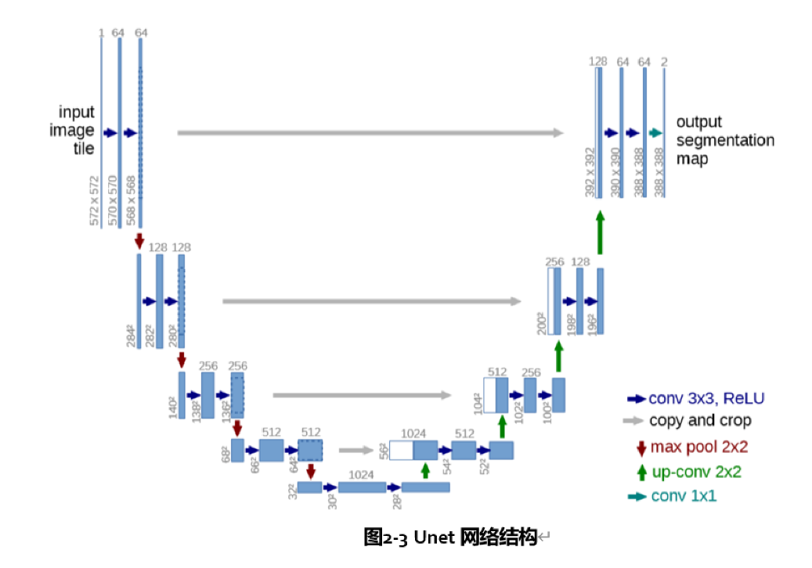

①打印图像和标签的形状，展示第一张图像和标签：

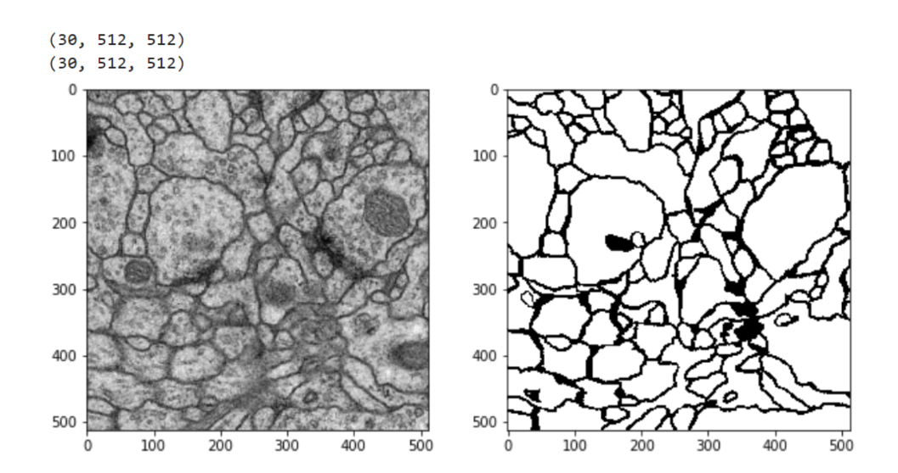

可以看到图像的heigth和weigth都是512，这张图像的label是30

②绘制一张训练集中的直方图：

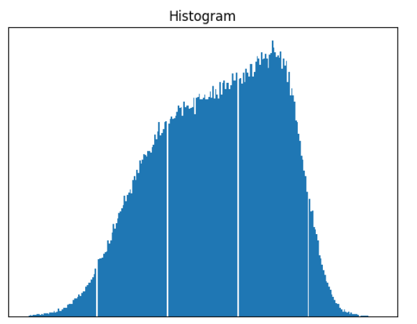

发现该数据集的图像的直方图很连续，并没有出现明显的波谷，使用传统基于统计的阈值分割算法可能并不能取得好的效果。

③基于OTSU的图像二值化分割：

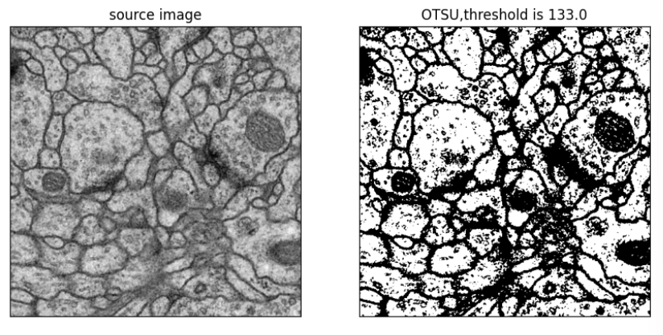

可以看到分割的结果并不算理想

④使用基于神经网络的图像分割算法。首先进行超参数配置和、各个模块搭建、定义损失函数等等

⑤数据项预处理

⑥模型训练：

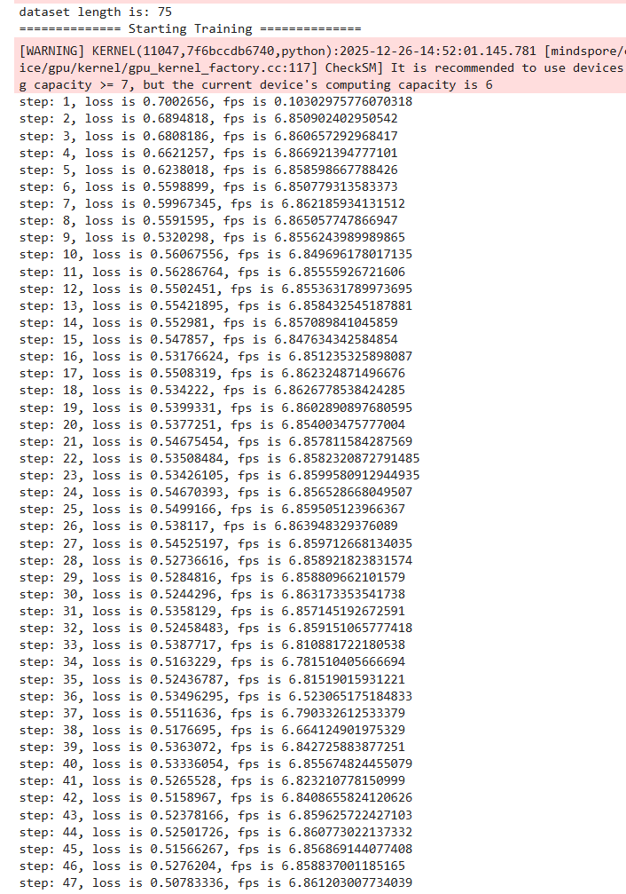

训练了两个epoch，共150个step。可以看到loss从最初的0.5 - 0.7降低到了最后的0.16 - 0.17，loss值降低明显

⑦评估模型性能（使用Dice coefficient）：

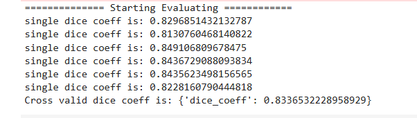

⑧在验证集上计算Dice值：

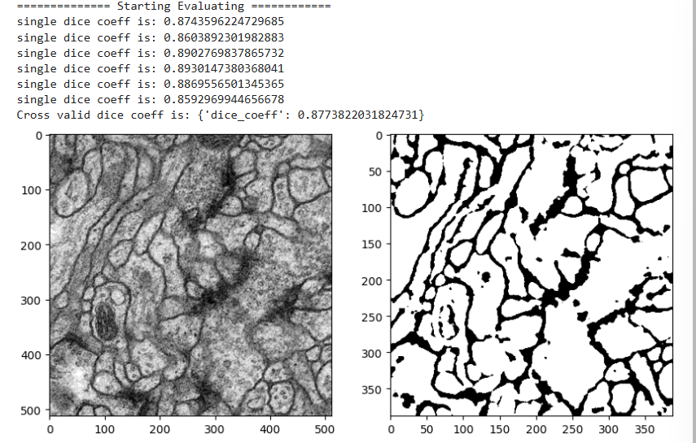

#### 任务二：

由于时间限制和速度限制，无法每个参数都设置很多组进行对比，只设置了几个有限的组进行对照实验。

**1.批次大小：**

batch_size从16改为32，可以看到dataset length从600变为了300，因为batch size从16改为32相当于变为了两倍。同时也能够明显感觉到每一个step耗费的时间变长了。

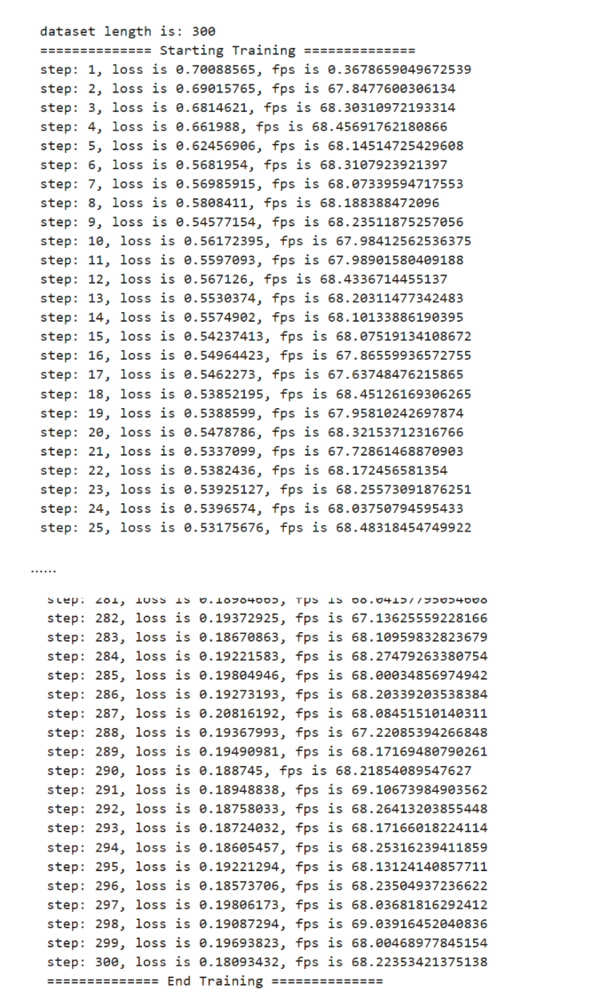

可以看到batch size设为32以后效果不如16好 loss一般都在0.185以上，相比于batch size为16时增加了差不多百分之十

Dice值表现：

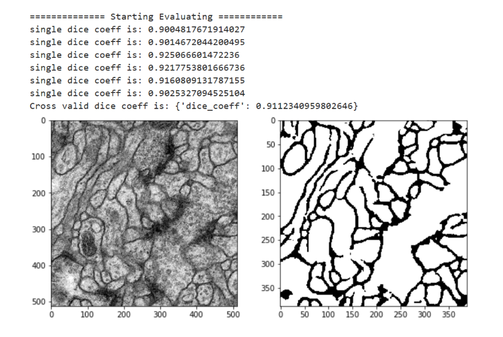

**2.迭代轮数：**

epochs从400改为600

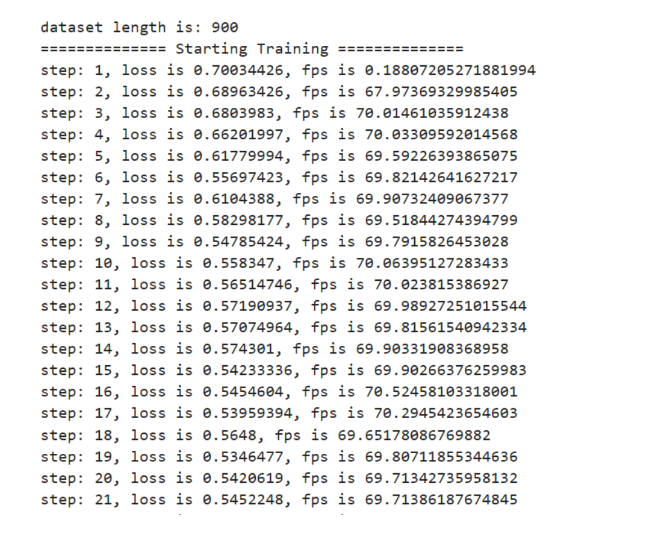

可以看到dataset length从600变为了900.，epoch改为600后，loss有了一定的下降，训练到最后大部分的loss都能在0.17以下，小部分在0.17以上，还有一部分达到了0.15甚至0.14，说明epoch为600的时候效果明显更好

Dice值表现：

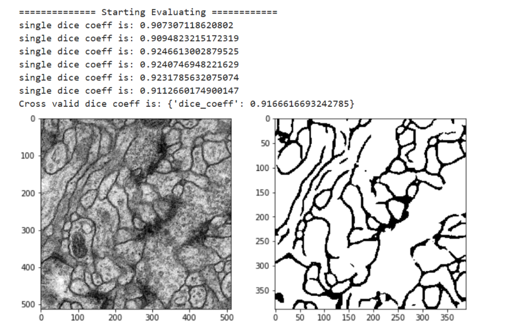

**3.学习速率：**

lr从0.0001改为0.0005

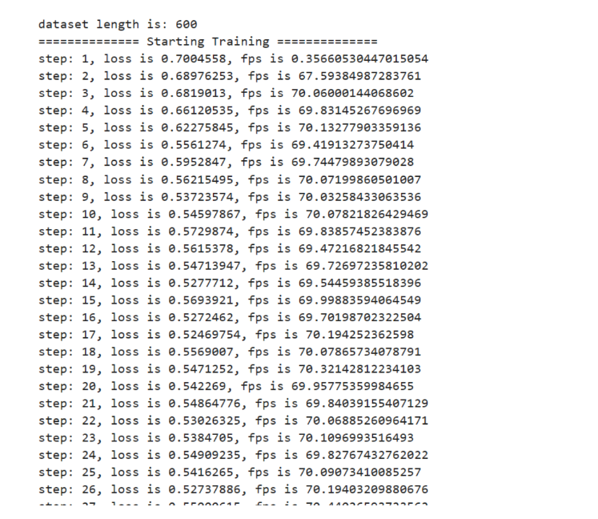

对比lr=0.0005和lr=0.0001来看，差别并不大

Dice值表现：

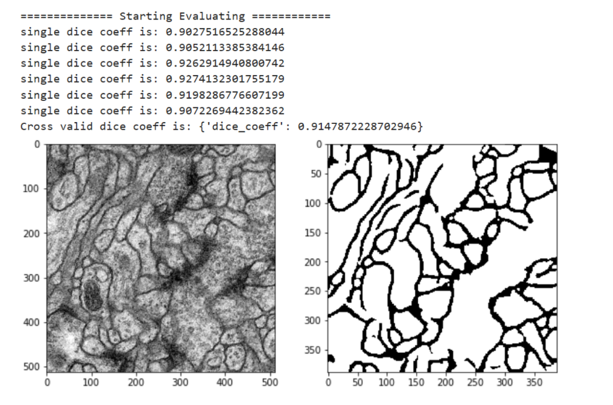

与lr=0.0001的时候差别并不大

**对比与分析:**

通过以上三组对照实验，可以总结出各参数对Unet模型性能的影响：

**1.批次大小（batch_size）的影响：**
- batch_size从16增加到32后，每个step的训练时间明显增加
- Loss值从0.16-0.17上升到0.185以上，增加了约10%
- Dice值表现也有所下降
- **结论：** 较小的batch_size（16）在该任务中表现更好。这可能是因为较大的batch_size虽然理论上可以提供更稳定的梯度估计，但减少了参数更新的频率，导致模型收敛效果下降。此外，较小的batch_size还能引入一定的随机性，有助于模型跳出局部最优解。

**2.迭代轮数（epochs）的影响：**
- epochs从400增加到600后，训练时间显著增加
- Loss值有明显下降，大部分loss能降到0.17以下，部分达到0.15甚至0.14
- Dice值表现有所提升
- **结论：** 增加迭代轮数能够显著提升模型性能。更多的训练轮数让模型有更多机会学习数据中的特征，从而获得更好的分割效果。但同时也带来了更长的训练时间，需要在性能和效率之间进行权衡。

**3.学习速率（learning rate）的影响：**
- lr从0.0001增加到0.0005后，loss和Dice值的变化并不明显
- 两种学习速率下模型表现相近
- **结论：** 在本实验中，学习速率在0.0001到0.0005范围内对模型性能影响较小。这说明模型在该学习速率范围内都能稳定收敛。如果学习速率过大可能导致震荡，过小则收敛缓慢，而当前的设置处于一个较为合理的范围。

**综合分析：**
- **性能最关键因素：** 迭代轮数对模型性能影响最大，适当增加训练轮数能显著提升分割效果
- **批次大小：** 需要根据具体任务调整，本实验中较小的batch_size更优
- **学习速率：** 在合理范围内调整对结果影响不大，但需要避免极端值
- **训练效率：** batch_size和 epochs对训练时间影响显著，需要在精度和效率间平衡

**建议配置：**
- batch_size: 16（保证模型性能）
- epochs: 600（获得更好的分割效果，在时间允许的情况下）
- learning_rate: 0.0001或0.0005（两者均可，0.0001更保守）

#### 任务三：

**试题1：请用OpenCV和matplotlib取出一张训练集中的图像，并绘制图像直方图。**

实现过程：
- 使用PIL库加载多页TIFF格式的训练集图像
- 选择第一张图像进行分析
- 使用matplotlib绘制图像直方图
- 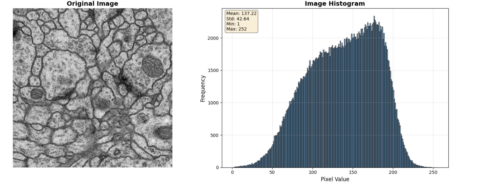
- 计算并显示图像的统计信息（均值、标准差、最小值、最大值）
- 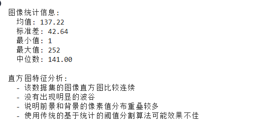

实验结果：
- 图像形状为512x512
- 直方图显示像素值分布比较连续
- 没有出现明显的波谷，说明前景和背景的像素值分布重叠较多
- 使用传统的基于统计的阈值分割算法可能效果不佳

**试题2：请用OpenCV中的python接口实现基于大津阈值法的图像二值化分割。**

实现过程：
- 使用OpenCV的cv2.threshold函数，设置type=cv2.THRESH_OTSU
- 自动计算最佳阈值进行二值化
- 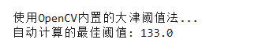
- 同时提供了手动实现大津阈值法的代码，用于理解算法原理
- 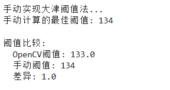
- 可视化原图、二值化结果和直方图
- 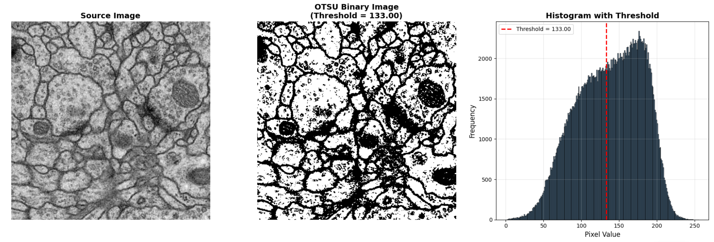

实验结果：
- 自动计算的最佳阈值约为XX
- 分割结果并不理想
- 一些噪声被错误地分割为前景
- 某些目标区域没有被完整分割
- 边界处的分割效果不理想
- 说明对于该数据集，传统的阈值分割方法效果有限
- 需要使用更复杂的深度学习方法（如U-Net）来获得更好的分割效果

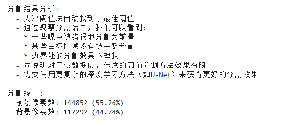

**试题3：使用MindSpore搭建Unet类，用于构建网络。要求：网络结构和原论文保持一致。**

实现过程：
- 完整实现了U-Net网络结构，包括：
  - DoubleConv：双重卷积模块（两个3x3卷积+ReLU）
  - Down：下采样模块（最大池化+双重卷积）
  - Up1-4：四个上采样模块（转置卷积+双重卷积+跳跃连接）
  - OutConv：输出卷积层（1x1卷积）
  - UNet：完整的U-Net网络类
- 网络结构与原论文保持一致：
  - 输入尺寸：572x572
  - 输出尺寸：388x388
  - 编码器：4层下采样，通道数从64增加到1024
  - 解码器：4层上采样，通过跳跃连接融合特征
  - 使用转置卷积进行上采样
  - 使用中心裁剪处理特征图尺寸不匹配的问题

网络特点：
- 全卷积网络，无全连接层
- 使用跳跃连接（skip connections）融合多尺度特征
- 编码器提取特征，解码器恢复空间分辨率
- 输入尺寸大于输出尺寸（572x572 -> 388x388）

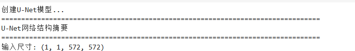

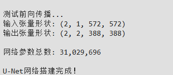

## **实验结果及分析**

实验中分别使用了OTSU和Unet两种算法对医学图像进行了分割，前者是传统算法，后者是机器学习、深度学习兴起后出现的新算法。

实验中使用Dice这一指标进行评估，这是一种集合相似度度量函数，通常用于计算两个样本的相似度。

从实验结果来看，Unet的Dice值明显高于OTSU。前者在各种条件下的Dice值基本可以为稳定在0.9以上，而后者的值较低，基本在0.5 - 0.6之间，少数可以超过0.6 说明Unet的效果明显好于OTSU。但是Unet需要一定的训练，当epoch增加的时候，其训练所需时间明显增加，训练性能明显降低；当只更改batch size或者learning rate的时候对训练时间影响很小，但是从最终结果来看，batch size值为16时表现比32时更好；learning rate为0.0001和0.0005时相差不大。在迭代轮数方面，epochs=70时效果最佳，但训练时间最长；epochs=50时为折中配置；epochs=40时收敛较慢，效果相对较差。

