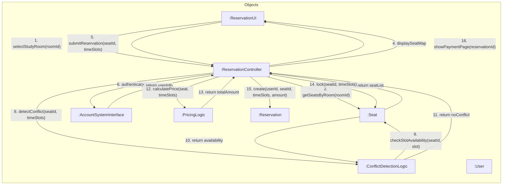
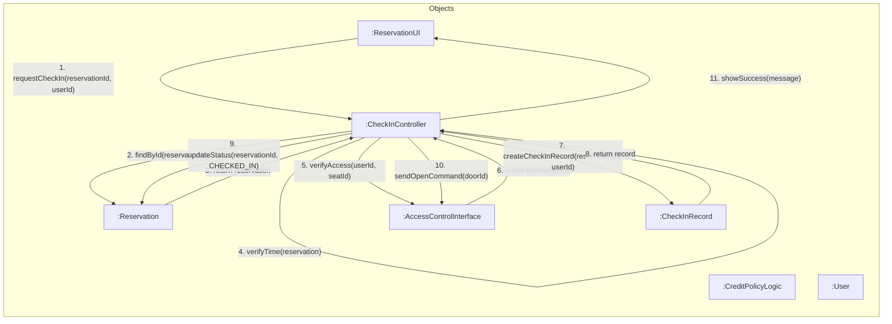
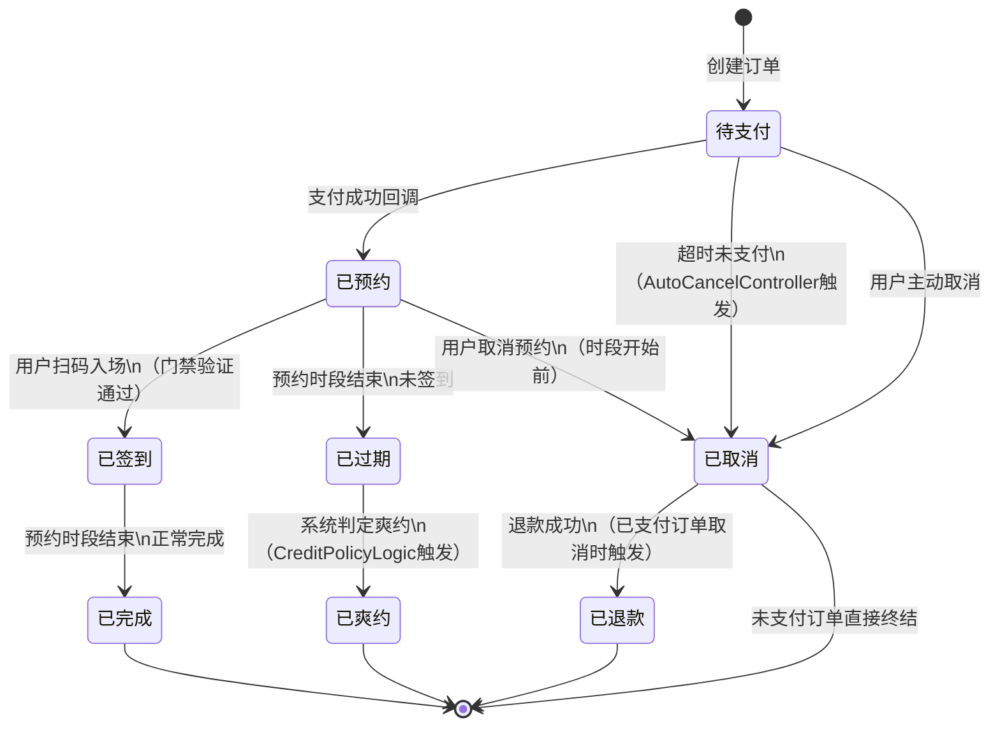
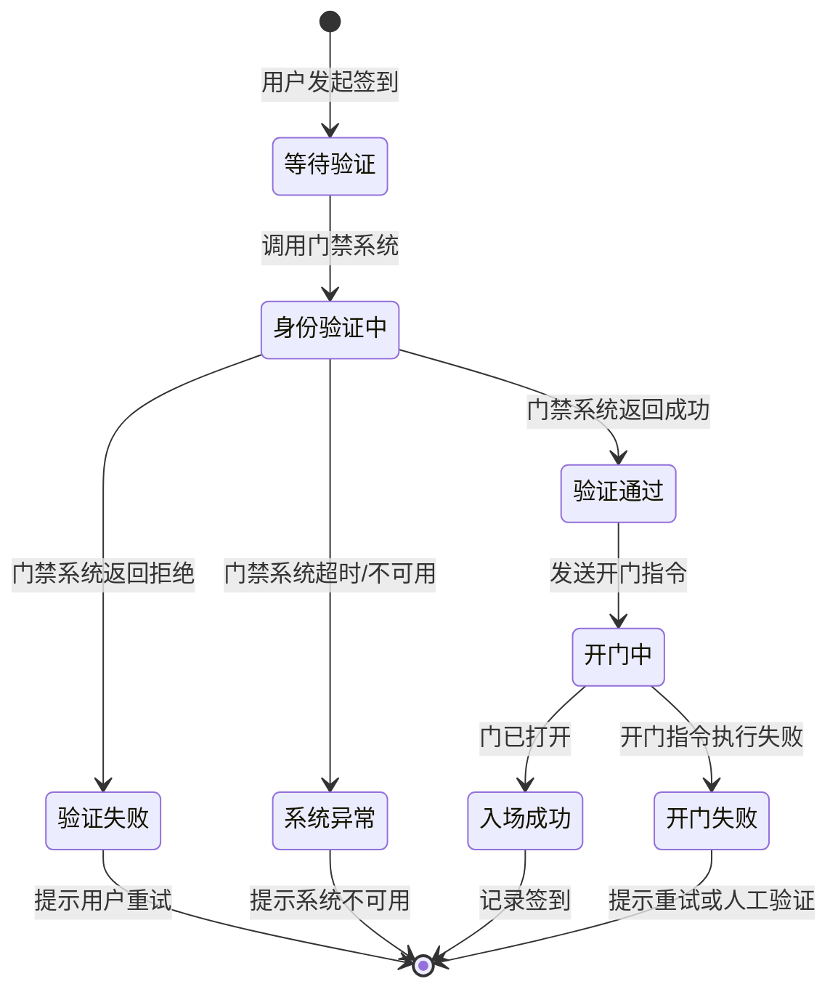

# 共享自习室预约管理系统 — 动态建模

**学号**：2023302855
**姓名**：梁景毓

---

## 1. 选定关键用例说明

动态建模选取两个核心用例进行通信图和状态图建模：

| 用例 | 选取理由 |
|------|----------|
| **UC-02 预约座位** | 系统核心业务流程，涉及多对象协作、冲突检测、外部系统调用，对象交互最丰富 |
| **UC-04 签到入场** | 涉及硬件外部系统交互、时间判断、信用策略，状态转换复杂 |

---

## 2. 通信图：预约座位（UC-02）

### 2.1 通信图



### 2.2 消息序列文字说明

| 步骤 | 发送方 | 接收方 | 消息 | 说明 |
|------|--------|--------|------|------|
| 1 | ReservationUI | ReservationController | selectStudyRoom(roomId) | 用户选择自习室，UI将选择传递给控制器 |
| 2 | ReservationController | Seat | getSeatsByRoom(roomId) | 控制器查询该自习室下所有座位 |
| 3 | Seat | ReservationController | return seatList | 座位对象返回座位列表 |
| 4 | ReservationController | ReservationUI | displaySeatMap | 控制器将座位信息返回UI展示 |
| 5 | ReservationUI | ReservationController | submitReservation(seatId, timeSlots) | 用户选择座位和时间段后提交预约 |
| 6 | ReservationController | AccountSystemInterface | authenticate(token) | 控制器调用账户系统验证用户身份 |
| 7 | AccountSystemInterface | ReservationController | return userInfo | 账户系统返回用户信息 |
| 8 | ReservationController | ConflictDetectionLogic | detectConflict(seatId, timeSlots) | 控制器调用冲突检测逻辑 |
| 9 | ConflictDetectionLogic | Seat | checkSlotAvailability(seatId, slot) | 冲突检测逻辑检查座位可用性 |
| 10 | Seat | ConflictDetectionLogic | return availability | 座位对象返回可用状态 |
| 11 | ConflictDetectionLogic | ReservationController | return noConflict | 冲突检测逻辑确认无冲突 |
| 12 | ReservationController | PricingLogic | calculatePrice(seat, timeSlots) | 控制器调用定价逻辑计算费用 |
| 13 | PricingLogic | ReservationController | return totalAmount | 定价逻辑返回总金额 |
| 14 | ReservationController | Seat | lock(seatId, timeSlots) | 控制器锁定座位时段 |
| 15 | ReservationController | Reservation | create(userId, seatId, timeSlots, amount) | 控制器创建预约订单（状态：待支付） |
| 16 | ReservationController | ReservationUI | showPaymentPage(reservationId) | 控制器通知UI跳转支付页面 |

### 2.3 条件判断

**条件1：身份验证失败（步骤6-7）**

```
若 authenticate(token) 返回验证失败：
    → 控制器通知UI显示"身份验证失败，请重新登录"
    → 流程终止，不进入后续步骤
```

**条件2：时间段冲突（步骤8-11）**

```
若 detectConflict 返回"有冲突"：
    → 控制器通知UI显示"该座位在所选时段已被预约，请重新选择"
    → 流程终止，返回步骤1重新选择座位或时段
```

**条件3：座位锁定失败（步骤14）**

```
若 lock() 返回失败（并发冲突）：
    → 控制器回滚已创建的订单
    → 控制器通知UI显示"座位刚被他人预约，请重新选择"
    → 流程终止
```

### 2.4 异常路径

**异常1：外部系统超时**

- 步骤6（身份验证）调用用户账户系统超时 → 控制器捕获超时异常，通知UI显示"系统繁忙，请稍后重试"，流程终止
- 步骤9（可用性查询）查询数据库超时 → 同上处理

**异常2：并发竞争条件**

- 步骤8-11冲突检测通过后、步骤14锁定前，座位被其他并发请求抢先预约
- 处理：步骤14锁定失败时，回滚订单创建，提示用户重新选择

**异常3：座位状态异常**

- 步骤2查询时发现座位状态为"维护中"或"已下架"
- 处理：控制器过滤掉不可用座位，仅向UI返回可预约座位列表

---

## 3. 通信图：签到入场（UC-04）

### 3.1 通信图



### 3.2 消息序列文字说明

| 步骤 | 发送方 | 接收方 | 消息 | 说明 |
|------|--------|--------|------|------|
| 1 | ReservationUI | CheckInController | requestCheckIn(reservationId, userId) | 用户点击签到，UI提交签到请求 |
| 2 | CheckInController | Reservation | findById(reservationId) | 控制器查询预约订单信息 |
| 3 | Reservation | CheckInController | return reservation | 返回预约订单对象 |
| 4 | CheckInController | CheckInController | verifyTime(reservation) | 控制器内部校验当前时间是否在预约时段内 |
| 5 | CheckInController | AccessControlInterface | verifyAccess(userId, seatId) | 控制器调用门禁系统验证用户身份 |
| 6 | AccessControlInterface | CheckInController | return accessResult | 门禁系统返回验证结果（通过/拒绝） |
| 7 | CheckInController | CheckInRecord | createCheckInRecord(reservationId, userId) | 控制器创建签到记录 |
| 8 | CheckInRecord | CheckInController | return record | 返回签到记录对象 |
| 9 | CheckInController | Reservation | updateStatus(reservationId, CHECKED_IN) | 控制器更新预约订单状态为"已签到" |
| 10 | CheckInController | AccessControlInterface | sendOpenCommand(doorId) | 控制器向门禁系统发送开门指令 |
| 11 | CheckInController | ReservationUI | showSuccess(message) | 控制器通知UI显示签到成功 |

### 3.3 条件判断

**条件1：预约订单不存在（步骤2-3）**

```
若 findById 返回 null（预约不存在）：
    → 控制器通知UI显示"预约订单不存在"
    → 流程终止
```

**条件2：当前时间不在预约时段内（步骤4）**

```
若 verifyTime 返回 false（未到预约时段或已过时段）：
    → 若未到时段：提示"还未到您的预约时间，请稍后再来"
    → 若已过时段：进入异常路径，标记为可能的爽约
    → 流程终止
```

**条件3：门禁验证失败（步骤5-6）**

```
若 accessResult 为拒绝：
    → 控制器通知UI显示"身份验证失败，请确认已预约该座位"
    → 流程终止，不创建签到记录
```

**条件4：信用分过低（扩展判断）**

```
若 CreditPolicyLogic.isUserBanned(userId) 返回 true：
    → 控制器通知UI显示"您的信用分过低，已被限制使用，请联系管理员"
    → 流程终止
```

### 3.4 异常路径

**异常1：门禁系统不可用**

- 步骤5调用门禁控制系统超时或连接失败
- 处理：控制器捕获异常，通知UI显示"门禁系统暂时不可用，请稍后重试"或转为人工验证模式

**异常2：重复签到**

- 用户在同一预约时段内重复发起签到请求
- 处理：控制器检查是否已存在该预约的签到记录，若已签到则提示"您已签到入场"，不重复创建记录

**异常3：签到后未实际入场**

- 用户签到成功但未通过物理门禁
- 处理：门禁系统记录实际出入日志，管理员可通过异常记录（UC-09）标记此情况

---

## 4. 状态图：预约订单（Reservation）

预约订单是系统中最核心的状态相关对象，贯穿多个用例：



### 4.1 状态说明

| 状态 | 说明 | 进入条件 |
|------|------|----------|
| 待支付 | 订单刚创建，等待用户支付；座位被锁定，有15分钟支付时限 | 用户提交预约且冲突检测通过 |
| 已预约 | 支付成功，座位预约正式生效；等待用户在预约时段内签到 | 支付系统回调确认支付成功 |
| 已签到 | 用户已通过门禁验证入场，座位正在使用中 | 用户在预约时段内扫码通过门禁 |
| 已完成 | 预约时段结束，用户正常使用完毕 | 预约时段自然结束 |
| 已取消 | 用户主动取消或超时未支付导致订单取消 | 用户取消 或 AutoCancelController检测到超时 |
| 已过期 | 预约时段结束但用户未签到入场 | 预约时段结束时仍为"已预约"状态 |
| 已爽约 | 系统根据信用策略判定过期未签到的行为为爽约，扣减信用分 | 从"已过期"状态由信用策略判定 |
| 已退款 | 已支付订单被取消后，退款处理完成 | 已支付的订单取消后退款成功 |

### 4.2 状态转换与控制类 / 应用逻辑类协作

| 状态转换 | 触发控制类 | 依赖应用逻辑类 | 说明 |
|----------|------------|----------------|------|
| 待支付 → 已预约 | PaymentController | PaymentTimeoutPolicy | 支付成功后确认，校验未超时 |
| 待支付 → 已取消 | AutoCancelController | PaymentTimeoutPolicy | 定时扫描，检测超时订单 |
| 已预约 → 已签到 | CheckInController | - | 调用门禁系统验证入场 |
| 已预约 → 已过期 | AutoCancelController | - | 预约时段结束自动检测 |
| 已过期 → 已爽约 | CheckInController | CreditPolicyLogic | 根据信用策略判定爽约并扣分 |
| 已预约 → 已取消 | ReservationController | PricingLogic | 取消预约，计算退款金额 |
| 已取消 → 已退款 | PaymentController | PricingLogic | 处理退款，金额由定价逻辑计算 |

---

## 5. 状态图：门禁验证流程

门禁验证是签到入场中的关键子流程，涉及外部硬件系统交互：



---

## 6. 消息传递与类图的对应关系

通信图中的对象与静态建模类图的对应关系：

| 通信图对象 | 类图中的类 | 类型 | 说明 |
|-----------|-----------|------|------|
| :ReservationUI | ReservationUI | 边界类 | 用户预约界面 |
| :ReservationController | ReservationController | 控制类 | 预约流程编排 |
| :CheckInController | CheckInController | 控制类 | 签到流程编排 |
| :ConflictDetectionLogic | ConflictDetectionLogic | 应用逻辑类 | 冲突检测规则 |
| :PricingLogic | PricingLogic | 应用逻辑类 | 价格计算规则 |
| :CreditPolicyLogic | CreditPolicyLogic | 应用逻辑类 | 信用策略规则 |
| :AccountSystemInterface | AccountSystemInterface | 边界类 | 用户账户系统接口 |
| :AccessControlInterface | AccessControlInterface | 边界类 | 门禁控制系统接口 |
| :Seat | Seat | 实体类 | 座位信息 |
| :Reservation | Reservation | 实体类 | 预约订单 |
| :CheckInRecord | CheckInRecord | 实体类 | 签到记录 |
| :User | User | 实体类 | 用户信息 |

---

## 7. 动态建模小结

### 7.1 两个用例的交互特征对比

| 特征 | UC-02 预约座位 | UC-04 签到入场 |
|------|---------------|---------------|
| 涉及对象数 | 8个 | 7个 |
| 消息步数 | 16步 | 11步 |
| 外部系统调用 | 用户账户系统（身份验证） | 门禁控制系统（身份验证+开门） |
| 应用逻辑类调用 | ConflictDetectionLogic, PricingLogic | CreditPolicyLogic |
| 核心状态转换 | 待支付 → 已预约 | 已预约 → 已签到 |
| 主要异常 | 并发冲突、外部超时 | 门禁不可用、重复签到 |

### 7.2 动态建模与静态建模的一致性

1. **对象来源一致**：通信图中所有对象均可在静态类图中找到对应类
2. **关系一致**：对象间的消息传递方向与类图中的依赖关系一致（如 ReservationUI → ReservationController 对应边界类到控制类的依赖）
3. **职责一致**：控制类仅做流程编排，业务规则委托给应用逻辑类，符合静态建模中的职责划分
4. **状态一致**：预约订单的状态图覆盖了所有用例中涉及的状态转换，与类图中 Reservation.status 属性对应
