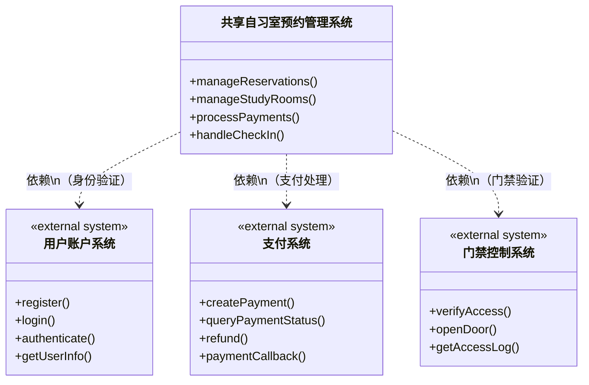
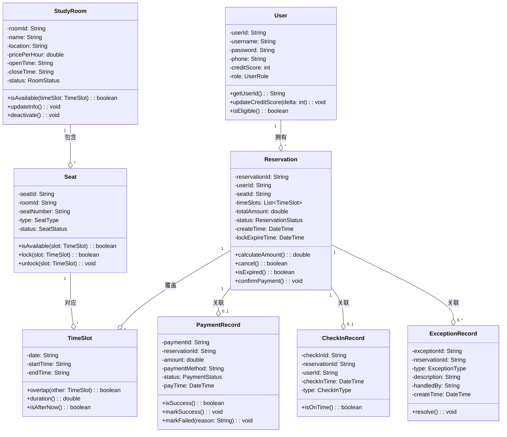
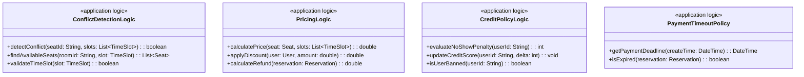
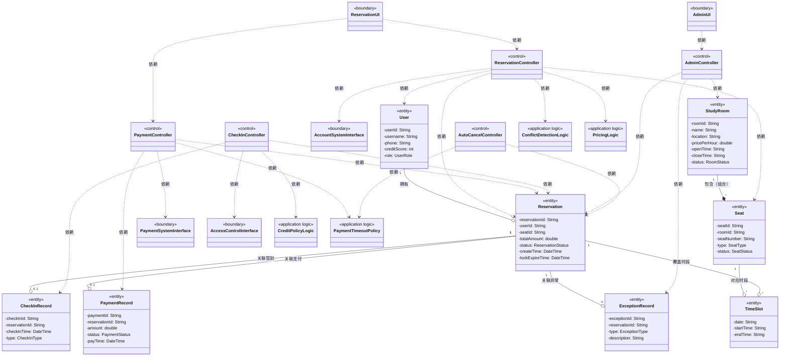

# 共享自习室预约管理系统 — 静态建模

**学号**：2023302855
**姓名**：梁景毓

---

## 1. 系统上下文类图

系统上下文类图展示本系统与外部系统之间的交互关系：

---

## 2. 实体类（Entity Classes）

实体类代表持久化数据，是系统的核心业务对象：

### 实体类说明

| 实体类 | 说明 | 关键属性 |
|--------|------|----------|
| User | 系统用户（自习者/管理员） | userId, username, phone, creditScore, role |
| StudyRoom | 自习室信息 | roomId, name, location, pricePerHour, openTime, closeTime, status |
| Seat | 自习室座位 | seatId, roomId, seatNumber, type, status |
| Reservation | 预约订单 | reservationId, userId, seatId, timeSlots, totalAmount, status, createTime |
| TimeSlot | 时间段 | date, startTime, endTime |
| PaymentRecord | 支付记录 | paymentId, reservationId, amount, status, payTime |
| CheckInRecord | 签到记录 | checkInId, reservationId, userId, checkInTime, type |
| ExceptionRecord | 异常记录 | exceptionId, reservationId, type, description, handledBy |

---

## 3. 边界类（Boundary Classes）

边界类负责与外部系统或用户的交互：

```mermaid
classDiagram
    class ReservationUI {
        <<boundary>>
        +displayStudyRooms(): void
        +displaySeatMap(roomId: String, date: String): void
        +selectSeat(seatId: String): void
        +selectTimeSlot(slot: TimeSlot): void
        +confirmReservation(): void
        +showPaymentPage(reservationId: String): void
    }

    class AdminUI {
        <<boundary>>
        +displayAllOrders(): void
        +editStudyRoom(roomId: String): void
        +addStudyRoom(): void
        +markException(reservationId: String): void
    }

    class AccountSystemInterface {
        <<boundary>>
        +authenticate(token: String): UserInfo
        +getUserInfo(userId: String): UserInfo
        +verifyIdentity(userId: String): boolean
    }

    class PaymentSystemInterface {
        <<boundary>>
        +initiatePayment(orderId: String, amount: double): PaymentResult
        +verifyCallback(callbackData: Map): boolean
        +queryPaymentStatus(paymentId: String): PaymentStatus
    }

    class AccessControlInterface {
        <<boundary>>
        +verifyAccess(reservationId: String): AccessResult
        +sendOpenCommand(doorId: String): void
        +getAccessLog(reservationId: String): AccessLog
    }
```

### 边界类说明

| 边界类 | 说明 | 对应外部系统/用户 |
|--------|------|-------------------|
| ReservationUI | 用户预约界面 | 自习者 |
| AdminUI | 管理员管理界面 | 管理员 |
| AccountSystemInterface | 用户账户系统接口 | 用户账户系统 |
| PaymentSystemInterface | 支付系统接口 | 支付系统 |
| AccessControlInterface | 门禁控制系统接口 | 门禁控制系统 |

---

## 4. 控制类（Control Classes）

控制类负责用例驱动的核心业务流程编排：

```mermaid
classDiagram
    class ReservationController {
        <<control>>
        +createReservation(userId: String, seatId: String, slots: List~TimeSlot~): Reservation
        +checkSeatAvailability(seatId: String, slot: TimeSlot): boolean
        +cancelReservation(reservationId: String, userId: String): boolean
        +getReservationsByUser(userId: String): List~Reservation~
    }

    class PaymentController {
        <<control>>
        +processPayment(reservationId: String): PaymentResult
        +handleCallback(callbackData: Map): void
        +verifyPayment(paymentId: String): boolean
    }

    class CheckInController {
        <<control>>
        +checkIn(reservationId: String, userId: String): CheckInResult
        +verifyTime(reservationId: String): boolean
        +recordNoShow(reservationId: String): void
    }

    class AdminController {
        <<control>>
        +addStudyRoom(roomInfo: Map): StudyRoom
        +updateStudyRoom(roomId: String, roomInfo: Map): boolean
        +deactivateStudyRoom(roomId: String): boolean
        +markException(reservationId: String, type: ExceptionType): void
    }

    class AutoCancelController {
        <<control>>
        +scanExpiredOrders(): List~String~
        +cancelExpiredOrder(reservationId: String): boolean
        +releaseSeatLock(reservationId: String): void
    }
```

### 控制类说明

| 控制类 | 对应用例 | 职责 |
|--------|----------|------|
| ReservationController | UC-01 浏览自习室与座位、UC-02 预约座位、UC-05 取消预约、UC-06 查看预约记录 | 预约相关流程编排 |
| PaymentController | UC-03 支付订单 | 支付流程编排 |
| CheckInController | UC-04 签到入场 | 签到流程编排 |
| AdminController | UC-07 管理自习室信息、UC-08 查看所有订单、UC-09 标记异常 | 管理员操作编排 |
| AutoCancelController | UC-10 自动取消未支付订单 | 定时任务流程编排 |

---

## 5. 应用逻辑类（Application Logic Classes）

应用逻辑类封装可复用的业务规则和策略，与控制类分离，关注"规则"而非"流程编排"：

### 应用逻辑类说明

| 应用逻辑类 | 封装的规则 | 不放在控制类的原因 |
|-----------|-----------|-------------------|
| ConflictDetectionLogic | 时间段冲突检测、座位可用性查询 | 冲突检测是多个用例的公共规则（预约、签到均需检查） |
| PricingLogic | 价格计算、折扣策略、退款金额计算 | 定价策略可能变化，需独立维护；多处使用 |
| CreditPolicyLogic | 爽约判定规则、信用分扣减策略 | 信用策略是业务规则而非流程，可能频繁调整 |
| PaymentTimeoutPolicy | 支付超时判定、时限配置 | 超时策略是规则配置，多处依赖（支付、自动取消） |

---

## 6. 完整类图（类间关系与用例映射）

---

## 7. 用例与类的映射关系

| 用例 | 边界类 | 控制类 | 应用逻辑类 | 实体类 |
|------|--------|--------|------------|--------|
| UC-01 浏览自习室与座位 | ReservationUI | ReservationController | ConflictDetectionLogic | StudyRoom, Seat, TimeSlot |
| UC-02 预约座位 | ReservationUI, AccountSystemInterface | ReservationController | ConflictDetectionLogic, PricingLogic | User, Seat, Reservation, TimeSlot |
| UC-03 支付订单 | ReservationUI, PaymentSystemInterface | PaymentController | PaymentTimeoutPolicy | Reservation, PaymentRecord |
| UC-04 签到入场 | ReservationUI, AccessControlInterface | CheckInController | CreditPolicyLogic | Reservation, CheckInRecord |
| UC-05 取消预约 | ReservationUI | ReservationController | PricingLogic | Reservation, PaymentRecord |
| UC-06 查看预约记录 | ReservationUI | ReservationController | - | Reservation, TimeSlot |
| UC-07 管理自习室信息 | AdminUI | AdminController | - | StudyRoom, Seat |
| UC-08 查看所有订单 | AdminUI | AdminController | - | Reservation |
| UC-09 标记异常 | AdminUI | AdminController | - | Reservation, ExceptionRecord |
| UC-10 自动取消未支付订单 | - | AutoCancelController | PaymentTimeoutPolicy | Reservation, TimeSlot |

---

## 8. 类关系说明

### 8.1 实体类关系

| 关系类型 | 源类 | 目标类 | 说明 |
|----------|------|--------|------|
| 关联 | User | Reservation | 一个用户拥有多个预约 |
| 组合 | StudyRoom | Seat | 自习室包含多个座位，座位依赖自习室存在 |
| 关联 | Seat | TimeSlot | 一个座位对应多个可用时段 |
| 关联 | Reservation | TimeSlot | 一个预约覆盖多个时段 |
| 关联 | Reservation | PaymentRecord | 一个预约对应一条支付记录 |
| 关联 | Reservation | CheckInRecord | 一个预约对应一条签到记录 |
| 关联 | Reservation | ExceptionRecord | 一个预约可关联多条异常记录 |

### 8.2 边界类与外部系统映射

| 边界类 | 对应外部系统 | 交互方式 |
|--------|--------------|----------|
| AccountSystemInterface | 用户账户系统 | API调用（身份验证） |
| PaymentSystemInterface | 支付系统 | API调用（支付处理） |
| AccessControlInterface | 门禁控制系统 | 硬件接口（门禁验证） |

### 8.3 控制类与应用逻辑类依赖

| 控制类 | 依赖的应用逻辑类 | 使用的规则 |
|--------|------------------|------------|
| ReservationController | ConflictDetectionLogic | 冲突检测 |
| ReservationController | PricingLogic | 价格计算 |
| PaymentController | PaymentTimeoutPolicy | 超时判定 |
| CheckInController | CreditPolicyLogic | 信用策略 |
| AutoCancelController | PaymentTimeoutPolicy | 超时判定 |
