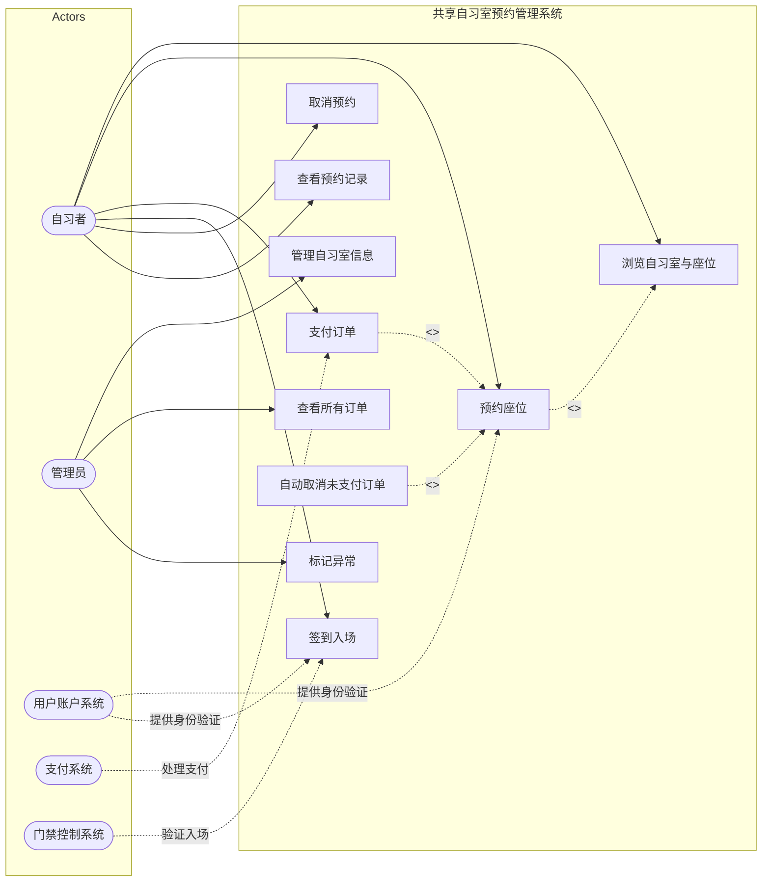
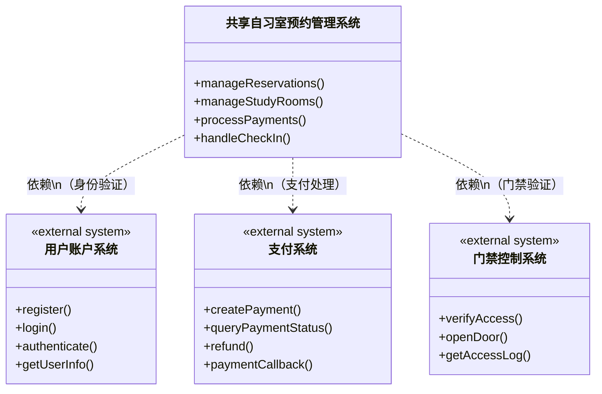
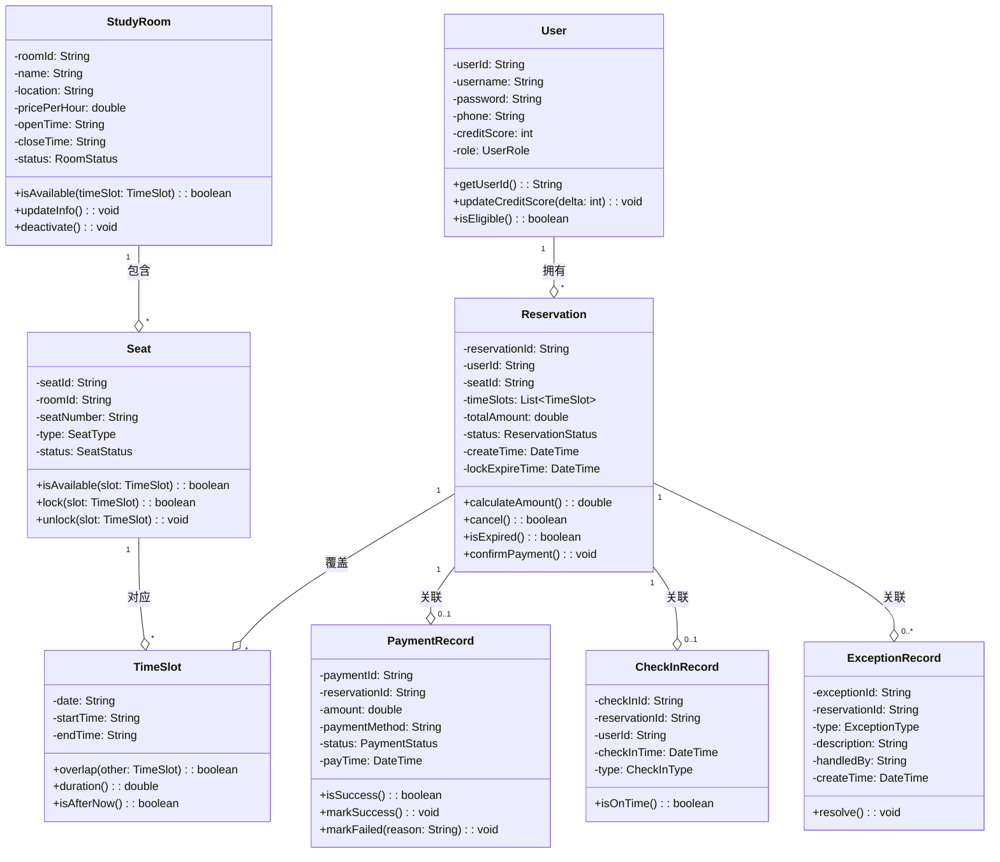
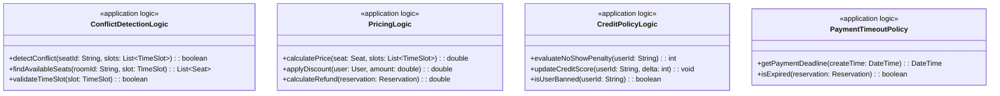
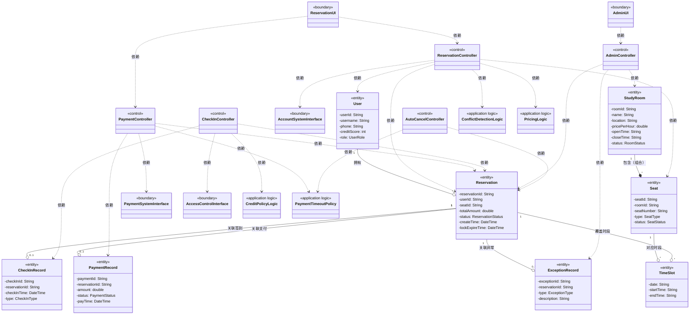
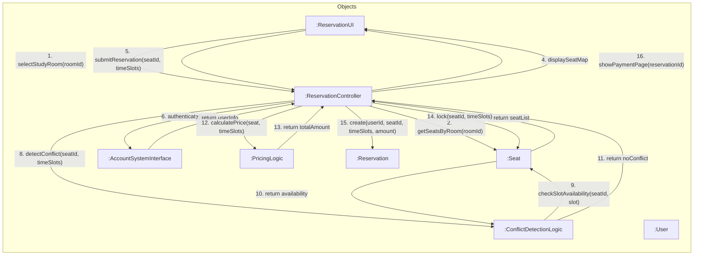
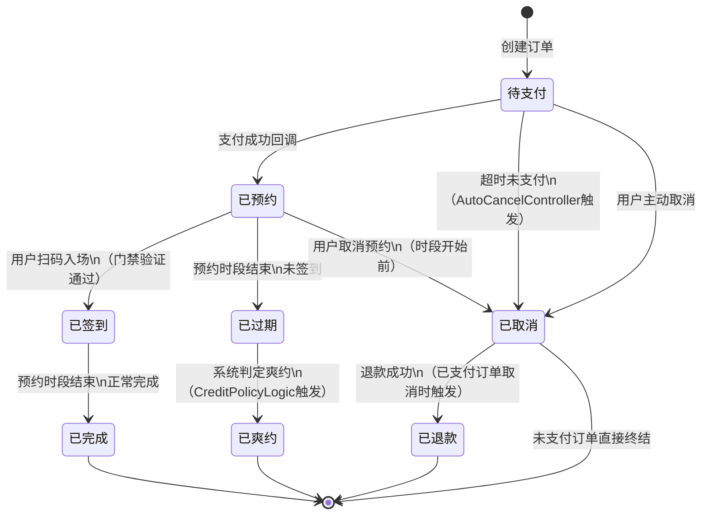

# 共享自习室预约管理系统 — 软件架构设计文档

---

## 1. 系统概述

### 1.1 背景

随着高校和城市学习空间需求增加，出现了大量"共享自习室"。用户可以在线预约座位、按时段使用，并通过系统进行管理。本系统用于支持一个共享自习室平台的日常运营。

### 1.2 系统参与者

| 参与者类型 | 名称 | 说明 |
|-----------|------|------|
| 用户 | 自习者 | 系统的普通用户，可浏览、预约、支付、签到、管理自己的预约 |
| 用户 | 管理员 | 自习室运营人员，管理自习室信息、查看订单、标记异常 |
| 外部系统 | 用户账户系统 | 提供注册、登录、身份验证功能 |
| 外部系统 | 支付系统 | 支持预约费用在线支付 |
| 外部系统 | 门禁控制系统 | 外部硬件系统，用户到达后扫码或验证进入自习室 |

### 1.3 功能需求概览

- **用户预约座位**：浏览自习室、查看座位时段占用情况、选择时间段+座位预约
- **预约确认与支付**：生成待支付订单，在线支付后转为已预约；超时未支付自动取消
- **使用与签到**：预约时段内到达，扫码/验证进入，系统记录签到；未签到可能判定爽约
- **预约管理**：查看预约记录（当前/历史），预约开始前取消预约
- **管理员管理**：管理自习室信息（新增/修改/下架）、查看所有订单、标记异常情况

---

## 2. 用例建模

### 2.1 系统用例图

### 2.2 用例列表

| 编号 | 用例名称 | 参与者 | 优先级 | 说明 |
|------|----------|--------|--------|------|
| UC-01 | 浏览自习室与座位 | 自习者 | 高 | 查看自习室信息、座位时段占用情况 |
| UC-02 | 预约座位 | 自习者 | 高 | 选择时间段+座位，检查冲突与库存 |
| UC-03 | 支付订单 | 自习者、支付系统 | 高 | 在线支付，状态转换 |
| UC-04 | 签到入场 | 自习者、门禁控制系统 | 高 | 扫码验证进入，记录签到时间 |
| UC-05 | 取消预约 | 自习者 | 中 | 预约开始前取消，涉及退款/状态变化 |
| UC-06 | 查看预约记录 | 自习者 | 中 | 查看当前和历史预约 |
| UC-07 | 管理自习室信息 | 管理员 | 中 | 新增/修改/下架自习室 |
| UC-08 | 查看所有订单 | 管理员 | 中 | 查看平台所有预约订单 |
| UC-09 | 标记异常 | 管理员 | 低 | 标记未使用、违规占座等异常 |
| UC-10 | 自动取消未支付订单 | 系统（定时任务） | 高 | 超时未支付自动取消 |

### 2.3 详细用例说明

#### 用例一：预约座位（UC-02）

| 项目 | 内容 |
|------|------|
| **用例名称** | 预约座位 |
| **参与者** | 自习者（主）、用户账户系统（辅） |
| **简要说明** | 用户登录后，浏览自习室和座位时段占用情况，选择合适的时间段和座位进行预约。系统检查时间段冲突和座位库存，生成待支付订单。 |
| **前置条件** | 1. 用户已登录系统；2. 用户账户系统验证通过；3. 目标自习室和座位处于可预约状态 |
| **后置条件** | 1. 若预约成功，生成待支付订单，座位在选定时段被锁定；2. 若预约失败，提示失败原因，不产生订单 |
| **基本事件流** | 1. 用户选择目标自习室，查看该自习室的开放时间、价格、座位布局 2. 用户选择预约日期和时间段 3. 系统查询该时间段内所有座位的占用状态（空闲/已预约/已占用） 4. 系统显示座位可用性视图 5. 用户选择一个或多个空闲座位（可连续或不连续时间段） 6. 系统检查所选座位在对应时间段是否冲突（同一时间同一座位只能被一个用户预约） 7. 系统计算预约费用 8. 系统生成预约订单，状态为"待支付" 9. 系统锁定所选座位在对应时间段的预约权（设置锁定过期时间） 10. 系统提示用户前往支付，并显示支付时限 |
| **备选事件流** | **A. 用户所选时间段无空闲座位（步骤4后）** &nbsp;&nbsp;A1. 系统提示该时间段座位已满 &nbsp;&nbsp;A2. 用户可重新选择其他时间段或自习室  **B. 座位冲突检测失败（步骤6）** &nbsp;&nbsp;B1. 系统在并发场景下检测到座位已被其他用户预约 &nbsp;&nbsp;B2. 系统提示座位已被占用，请重新选择  **C. 用户超时未支付（触发UC-10）** &nbsp;&nbsp;C1. 超过支付时限后，系统自动释放座位锁定 &nbsp;&nbsp;C2. 订单状态变更为"已取消" |
| **业务规则** | 1. 一个时间段内，一个座位只能被一个用户预约；2. 用户可预约多个时间段，可连续或不连续；3. 订单生成后需在限定时间内完成支付（如15分钟），否则自动取消；4. 座位锁定时间与支付时限一致 |
| **非功能需求** | 1. 座位状态查询响应时间 < 2秒；2. 并发预约时需保证数据一致性（乐观锁/悲观锁） |

#### 用例二：支付（UC-03）

| 项目 | 内容 |
|------|------|
| **用例名称** | 支付订单 |
| **参与者** | 自习者（主）、支付系统（辅） |
| **简要说明** | 用户对已生成的待支付订单进行在线支付。系统调用外部支付系统完成支付流程，支付成功后更新订单状态为"已预约"；若支付失败或超时，订单可能被自动取消。 |
| **前置条件** | 1. 用户已存在待支付状态的预约订单；2. 订单未超过支付时限；3. 外部支付系统可用 |
| **后置条件** | 1. 若支付成功，订单状态变为"已预约"，座位预约正式生效；2. 若支付失败，订单保持"待支付"状态，用户可重试；3. 若超时未支付，订单被自动取消，释放座位锁定 |
| **基本事件流** | 1. 用户查看待支付订单列表 2. 用户选择需要支付的订单 3. 系统检查订单状态是否仍为"待支付"且未超时 4. 系统调用支付系统，发起支付请求（传递订单号、金额等信息） 5. 支付系统返回支付页面/二维码供用户完成支付 6. 用户完成支付操作 7. 支付系统回调通知系统支付结果（成功） 8. 系统验证支付回调的合法性（签名校验、金额校验） 9. 系统更新订单状态为"已预约" 10. 系统确认座位预约正式生效 11. 系统向用户发送支付成功通知 |
| **备选事件流** | **A. 订单已超时（步骤3）** &nbsp;&nbsp;A1. 系统提示订单已超时被自动取消 &nbsp;&nbsp;A2. 用户需重新预约  **B. 支付系统返回支付失败（步骤7）** &nbsp;&nbsp;B1. 系统更新订单状态，记录失败原因 &nbsp;&nbsp;B2. 系统提示用户支付失败，可重新尝试支付  **C. 支付回调超时未收到（步骤7）** &nbsp;&nbsp;C1. 系统主动查询支付系统获取支付状态 &nbsp;&nbsp;C2. 若确认未支付，提示用户重新支付；若确认已支付，继续步骤9  **D. 支付金额校验不一致（步骤8）** &nbsp;&nbsp;D1. 系统标记该笔支付为异常 &nbsp;&nbsp;D2. 通知管理员人工处理 |
| **业务规则** | 1. 支付时限为订单生成后15分钟；2. 支付回调需校验签名和金额防止篡改；3. 同一订单不可重复支付；4. 支付失败后用户可在时限内重试 |
| **非功能需求** | 1. 支付回调需保证幂等性；2. 支付接口超时时间设为30秒；3. 支付敏感信息需加密传输 |

---

## 3. 静态建模

### 3.1 系统上下文类图

系统上下文类图展示本系统与外部系统之间的交互关系：

### 3.2 类设计

#### 3.2.1 实体类（Entity Classes）

实体类代表持久化数据，是系统的核心业务对象：

#### 3.2.2 边界类（Boundary Classes）

边界类负责与外部系统或用户的交互：

```mermaid
classDiagram
    class ReservationUI {
        <<boundary>>
        +displayStudyRooms(): void
        +displaySeatMap(roomId: String, date: String): void
        +selectSeat(seatId: String): void
        +selectTimeSlot(slot: TimeSlot): void
        +confirmReservation(): void
        +showPaymentPage(reservationId: String): void
    }

    class AdminUI {
        <<boundary>>
        +displayAllOrders(): void
        +editStudyRoom(roomId: String): void
        +addStudyRoom(): void
        +markException(reservationId: String): void
    }

    class AccountSystemInterface {
        <<boundary>>
        +authenticate(token: String): UserInfo
        +getUserInfo(userId: String): UserInfo
        +verifyIdentity(userId: String): boolean
    }

    class PaymentSystemInterface {
        <<boundary>>
        +initiatePayment(orderId: String, amount: double): PaymentResult
        +verifyCallback(callbackData: Map): boolean
        +queryPaymentStatus(paymentId: String): PaymentStatus
    }

    class AccessControlInterface {
        <<boundary>>
        +verifyAccess(reservationId: String): AccessResult
        +sendOpenCommand(doorId: String): void
        +getAccessLog(reservationId: String): AccessLog
    }
```

#### 3.2.3 控制类（Control Classes）

控制类负责用例驱动的核心业务流程编排：

```mermaid
classDiagram
    class ReservationController {
        <<control>>
        +createReservation(userId: String, seatId: String, slots: List~TimeSlot~): Reservation
        +checkSeatAvailability(seatId: String, slot: TimeSlot): boolean
        +cancelReservation(reservationId: String, userId: String): boolean
        +getReservationsByUser(userId: String): List~Reservation~
    }

    class PaymentController {
        <<control>>
        +processPayment(reservationId: String): PaymentResult
        +handleCallback(callbackData: Map): void
        +verifyPayment(paymentId: String): boolean
    }

    class CheckInController {
        <<control>>
        +checkIn(reservationId: String, userId: String): CheckInResult
        +verifyTime(reservationId: String): boolean
        +recordNoShow(reservationId: String): void
    }

    class AdminController {
        <<control>>
        +addStudyRoom(roomInfo: Map): StudyRoom
        +updateStudyRoom(roomId: String, roomInfo: Map): boolean
        +deactivateStudyRoom(roomId: String): boolean
        +markException(reservationId: String, type: ExceptionType): void
    }

    class AutoCancelController {
        <<control>>
        +scanExpiredOrders(): List~String~
        +cancelExpiredOrder(reservationId: String): boolean
        +releaseSeatLock(reservationId: String): void
    }
```

#### 3.2.4 应用逻辑类（Application Logic Classes）

应用逻辑类封装可复用的业务规则和策略，与控制类分离，关注"规则"而非"流程编排"：

### 3.3 完整类图（类间关系与用例映射）

### 3.4 用例与类的映射关系

| 用例 | 边界类 | 控制类 | 应用逻辑类 | 实体类 |
|------|--------|--------|------------|--------|
| UC-01 浏览自习室与座位 | ReservationUI | ReservationController | ConflictDetectionLogic | StudyRoom, Seat, TimeSlot |
| UC-02 预约座位 | ReservationUI, AccountSystemInterface | ReservationController | ConflictDetectionLogic, PricingLogic | User, Seat, Reservation, TimeSlot |
| UC-03 支付订单 | ReservationUI, PaymentSystemInterface | PaymentController | PaymentTimeoutPolicy | Reservation, PaymentRecord |
| UC-04 签到入场 | ReservationUI, AccessControlInterface | CheckInController | CreditPolicyLogic | Reservation, CheckInRecord |
| UC-05 取消预约 | ReservationUI | ReservationController | PricingLogic | Reservation, PaymentRecord |
| UC-06 查看预约记录 | ReservationUI | ReservationController | - | Reservation, TimeSlot |
| UC-07 管理自习室信息 | AdminUI | AdminController | - | StudyRoom, Seat |
| UC-08 查看所有订单 | AdminUI | AdminController | - | Reservation |
| UC-09 标记异常 | AdminUI | AdminController | - | Reservation, ExceptionRecord |
| UC-10 自动取消未支付订单 | - | AutoCancelController | PaymentTimeoutPolicy | Reservation, TimeSlot |

---

## 4. 动态建模

### 4.1 通信图：预约座位（UC-02）

选取**预约座位**用例，绘制通信图，展示对象间消息传递：

### 4.2 消息序列文字说明

**预约座位用例的交互步骤：**

| 步骤 | 发送方 | 接收方 | 消息 | 说明 |
|------|--------|--------|------|------|
| 1 | ReservationUI | ReservationController | selectStudyRoom(roomId) | 用户选择自习室，UI将选择传递给控制器 |
| 2 | ReservationController | Seat | getSeatsByRoom(roomId) | 控制器查询该自习室下所有座位 |
| 3 | Seat | ReservationController | return seatList | 座位对象返回座位列表 |
| 4 | ReservationController | ReservationUI | displaySeatMap | 控制器将座位信息返回UI展示 |
| 5 | ReservationUI | ReservationController | submitReservation(seatId, timeSlots) | 用户选择座位和时间段后提交预约 |
| 6 | ReservationController | AccountSystemInterface | authenticate(token) | 控制器调用账户系统验证用户身份 |
| 7 | AccountSystemInterface | ReservationController | return userInfo | 账户系统返回用户信息 |
| 8 | ReservationController | ConflictDetectionLogic | detectConflict(seatId, timeSlots) | 控制器调用冲突检测逻辑 |
| 9 | ConflictDetectionLogic | Seat | checkSlotAvailability(seatId, slot) | 冲突检测逻辑检查座位可用性 |
| 10 | Seat | ConflictDetectionLogic | return availability | 座位对象返回可用状态 |
| 11 | ConflictDetectionLogic | ReservationController | return noConflict | 冲突检测逻辑确认无冲突 |
| 12 | ReservationController | PricingLogic | calculatePrice(seat, timeSlots) | 控制器调用定价逻辑计算费用 |
| 13 | PricingLogic | ReservationController | return totalAmount | 定价逻辑返回总金额 |
| 14 | ReservationController | Seat | lock(seatId, timeSlots) | 控制器锁定座位时段 |
| 15 | ReservationController | Reservation | create(userId, seatId, timeSlots, amount) | 控制器创建预约订单（状态：待支付） |
| 16 | ReservationController | ReservationUI | showPaymentPage(reservationId) | 控制器通知UI跳转支付页面 |

**条件判断：**

- **步骤8-11（冲突检测）**：若detectConflict返回"有冲突"，则进入备选流程：
  - 控制器通知UI显示"座位已被占用，请重新选择"
  - 流程终止（返回步骤1重新选择）

- **步骤6-7（身份验证）**：若authenticate返回验证失败，则：
  - 控制器通知UI显示"身份验证失败，请重新登录"
  - 流程终止

**异常路径：**

- **并发冲突异常**：在步骤14（锁定座位）时，若座位已被其他并发请求锁定，锁定失败：
  - 控制器回滚操作，通知UI显示"座位刚被他人预约，请重新选择"
  - 流程终止

- **系统超时异常**：若步骤6（身份验证）或步骤9（查询可用性）调用外部系统超时：
  - 控制器捕获超时异常，通知UI显示"系统繁忙，请稍后重试"
  - 流程终止

### 4.3 状态图：预约订单（Reservation）

预约订单是系统中最核心的状态相关对象，其状态图如下：

**状态说明：**

| 状态 | 说明 |
|------|------|
| 待支付 | 订单刚创建，等待用户支付；座位被锁定，有15分钟支付时限 |
| 已预约 | 支付成功，座位预约正式生效；等待用户在预约时段内签到 |
| 已签到 | 用户已通过门禁验证入场，座位正在使用中 |
| 已完成 | 预约时段结束，用户正常使用完毕 |
| 已取消 | 用户主动取消或超时未支付导致订单取消 |
| 已过期 | 预约时段结束但用户未签到入场 |
| 已爽约 | 系统根据信用策略判定过期未签到的行为为爽约，扣减信用分 |
| 已退款 | 已支付订单被取消后，退款处理完成 |

### 4.4 补充：预约订单状态与控制类 / 应用逻辑类协作

| 状态转换 | 触发控制类 | 依赖应用逻辑类 | 说明 |
|----------|------------|----------------|------|
| 待支付 → 已预约 | PaymentController | PaymentTimeoutPolicy | 支付成功后确认，校验未超时 |
| 待支付 → 已取消 | AutoCancelController | PaymentTimeoutPolicy | 定时扫描，检测超时订单 |
| 已预约 → 已签到 | CheckInController | - | 调用门禁系统验证入场 |
| 已预约 → 已过期 | AutoCancelController | - | 预约时段结束自动检测 |
| 已过期 → 已爽约 | CheckInController | CreditPolicyLogic | 根据信用策略判定爽约并扣分 |
| 已预约 → 已取消 | ReservationController | PricingLogic | 取消预约，计算退款金额 |
| 已取消 → 已退款 | PaymentController | PricingLogic | 处理退款，金额由定价逻辑计算 |

---

## 5. 提示与思考的回答

### 5.1 如何处理"时间段冲突"？

时间段冲突通过 **ConflictDetectionLogic** 应用逻辑类处理：

1. **检测逻辑**：当用户提交预约请求时，系统查询目标座位在所选时间段内的所有已有预约记录，逐一检查时间区间是否重叠（使用TimeSlot.overlap()方法）
2. **并发控制**：采用**乐观锁**机制——在检测通过后锁定座位前，再次校验确认无冲突。若检测到冲突，拒绝预约并提示
3. **锁定机制**：预约通过冲突检测后，立即锁定座位对应时段（设置锁定过期时间与支付时限一致），防止其他用户在支付窗口期内抢占同一座位

### 5.2 预约与座位之间是什么关系？

预约（Reservation）与座位（Seat）之间是**关联关系**：

- 一个座位可以被多次预约（不同时间段），一个预约对应一个座位
- 两者之间不是简单的组合或聚合关系——座位不依赖于预约存在，预约也不"包含"座位
- 预约记录了"哪个用户在哪个时间段使用了哪个座位"这一事实
- 座位的可用性由其在特定时间段上的预约记录决定，而非预约本身

### 5.3 控制类如何划分粒度？

控制类按**用例**划分，一个用例对应一个主控制类：

- **ReservationController**：负责预约座位的完整流程编排
- **PaymentController**：负责支付流程编排
- **CheckInController**：负责签到入场流程编排
- **AdminController**：负责管理员相关操作
- **AutoCancelController**：负责定时自动取消任务

**划分原则**：

1. 每个控制类对应一个完整的用例场景，职责清晰
2. 控制类只做流程编排，不包含业务规则（规则下沉到应用逻辑类）
3. 当某个控制类过于复杂时（如预约涉及冲突检测、定价计算等多步逻辑），将规则提取为独立的应用逻辑类

### 5.4 哪些逻辑属于"应用逻辑类"而不是控制类？

**区分原则**：控制类关注"做什么"（流程步骤编排），应用逻辑类关注"怎么算"（可复用的业务规则）。

属于应用逻辑类的内容：

| 应用逻辑类 | 封装的规则 | 不放在控制类的原因 |
|-----------|-----------|-------------------|
| ConflictDetectionLogic | 时间段冲突检测、座位可用性查询 | 冲突检测是多个用例的公共规则（预约、签到均需检查） |
| PricingLogic | 价格计算、折扣策略、退款金额计算 | 定价策略可能变化，需独立维护；多处使用 |
| CreditPolicyLogic | 爽约判定规则、信用分扣减策略 | 信用策略是业务规则而非流程，可能频繁调整 |
| PaymentTimeoutPolicy | 支付超时判定、时限配置 | 超时策略是规则配置，多处依赖（支付、自动取消） |

**判断标准**：

1. **可复用性**：若一个规则可能被多个控制类使用，提取为应用逻辑类
2. **变化频率**：若规则可能独立变化（如调整定价策略），提取为应用逻辑类
3. **职责单一**：若控制类中某段逻辑占据了大量篇幅且与流程编排无关，提取为应用逻辑类
