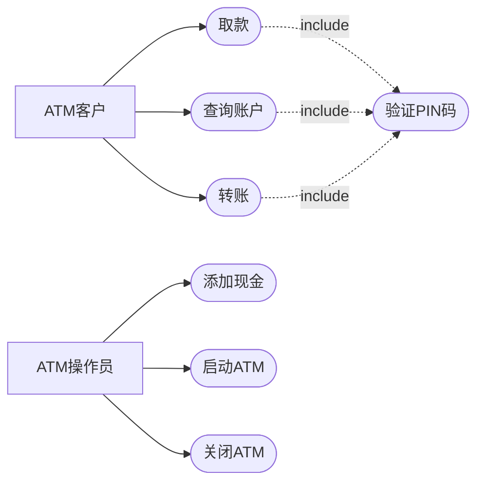
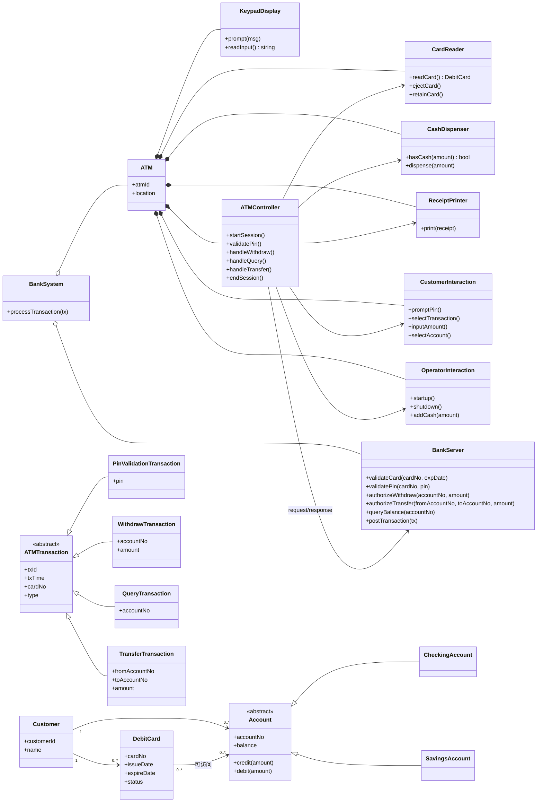
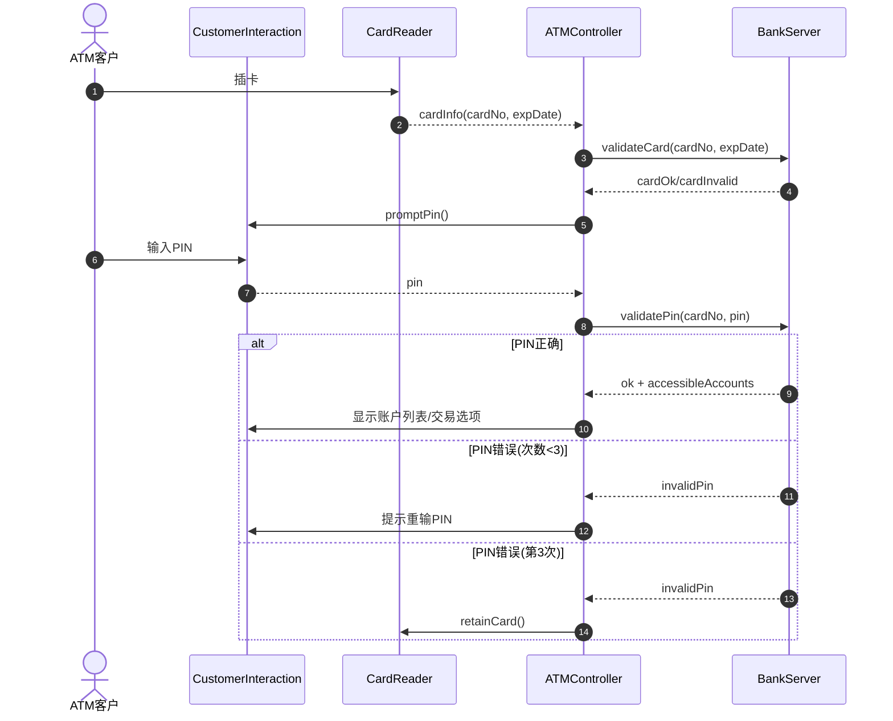
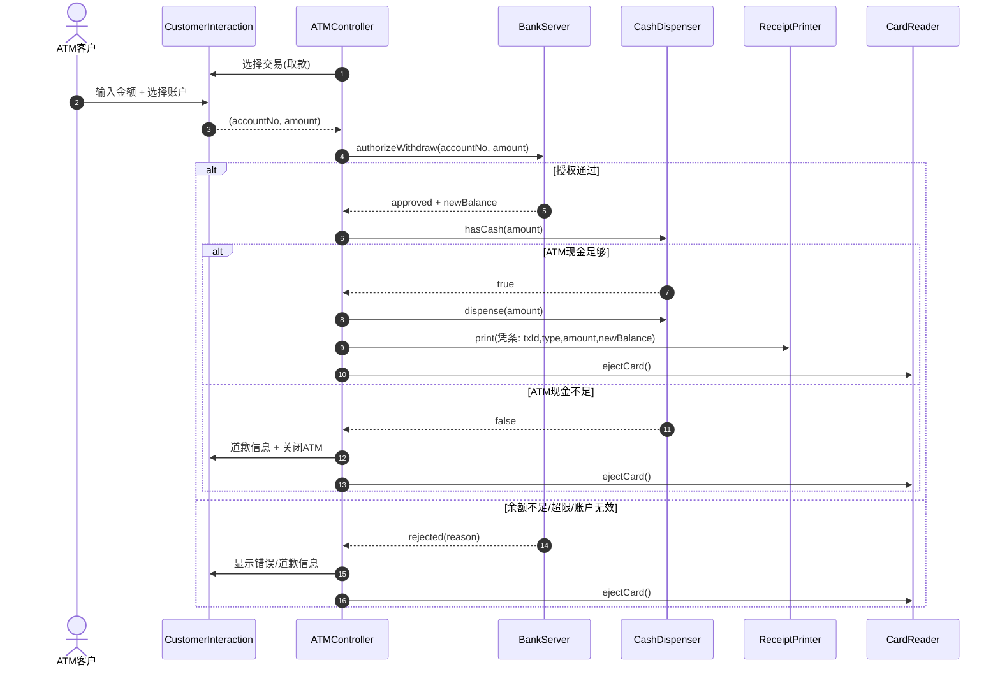
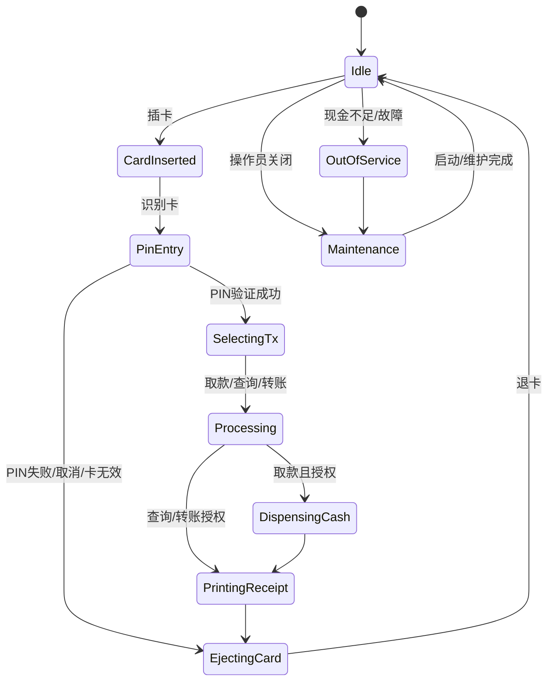
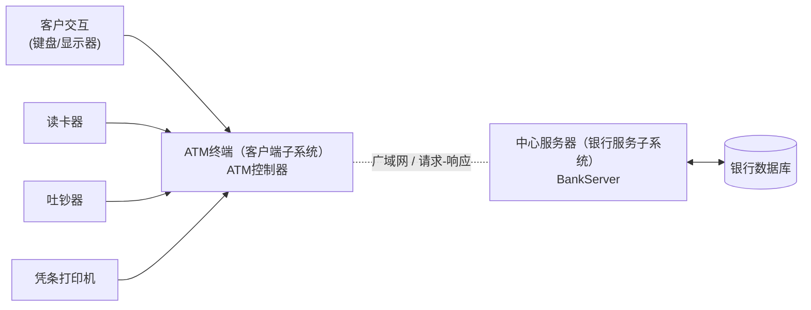

# 《软件架构设计》实验一：客户机/服务器软件架构设计——银行系统（实验报告）

学 院：软件学院  
学 号：2023302855  
姓 名：梁景毓  
专 业：软件工程  
实验时间：2026.5.12  
实验地点：启翔楼  
指导教师：李伟刚  

---

## 一、实验目的及要求

实验名称：客户机/服务器软件架构设计——银行系统

### 1. 实验目的
1. 学习客户机/服务器（C/S）架构的基本概念和设计方法；
2. 掌握使用UML语言进行软件架构建模的方法，包括用例模型、静态模型、动态模型、子系统划分和部署设计；
3. 理解银行系统中ATM与服务器的交互机制和通信模式。

### 2. 实验要求
1. 建立银行系统用例模型，识别参与者与用例，并描述用例之间的关系（include）；
2. 完成问题域静态建模，识别实体类、边界类、控制类及其关系；
3. 完成动态建模，至少包含”验证PIN”和”取款”等关键用例的时序图/通信图；
4. 进行子系统划分与设计，划分ATM客户端子系统与银行服务子系统；
5. 给出部署/通信视图，描述ATM客户端与银行服务端的通信模式（请求-响应）；
6. 实验报告按格式模板撰写，文件名按”学号+姓名+ex1.md”命名。

### 3. 实验结果要求
1. 保存实验工程文件；
2. 使用建模工具（Mermaid）绘制UML图；
3. 按要求撰写实验报告并提交。

## 二、实验设备（环境）及要求

### 1. 硬件环境
- 个人计算机（PC），操作系统：Windows

### 2. 软件环境
- 建模工具：Mermaid
- 文本编辑器：支持Markdown预览的编辑器
- 实验参考资料：《1.C-S软件架构设计案例：银行系统》

## 三、实验内容

### 1. 用例建模
识别系统参与者（ATM客户、ATM操作员）与用例，建立用例模型，描述用例之间的include关系。

### 2. 静态建模
识别问题域中的实体类（Customer、Account、DebitCard等）、边界类（CustomerInteraction、CardReader等）、控制类（ATMController），并建立类图描述其关系。

### 3. 动态建模
为关键用例（验证PIN、取款）建立时序图，描述对象间的消息交互顺序和异常处理分支。

### 4. 子系统划分
将系统划分为ATM客户端子系统和银行服务子系统，明确各子系统的职责边界。

### 5. 部署设计
设计系统部署架构，描述ATM终端通过广域网与中心服务器的通信模式（请求-响应）。

## 四、实验步骤与结果

### 1. 需求理解与参与者识别

#### 1.1 系统概述
银行系统采用C/S架构，ATM作为客户端终端，通过网络连接银行中心服务器。系统需支持客户交易（取款、查询、转账）和操作员维护（启动、关闭、补钞）两类功能。

#### 1.2 参与者识别
| 参与者 | 描述 |
|--------|------|
| ATM客户 | 使用ATM进行取款、查询余额、账户间转账的银行客户 |
| ATM操作员 | 对ATM进行启动、关闭、补钞等维护操作的银行工作人员 |

### 2. 用例模型（结果）

#### 2.1 参与者与用例识别
| 参与者 | 用例 | 描述 |
|--------|------|------|
| ATM客户 | 取款 | 客户从账户中提取现金 |
| ATM客户 | 查询账户 | 客户查询账户余额和交易记录 |
| ATM客户 | 转账 | 客户在账户间进行资金转移 |
| ATM客户 | 验证PIN | 客户输入PIN码进行身份验证 |
| ATM操作员 | 启动ATM | 操作员启动ATM系统 |
| ATM操作员 | 关闭ATM | 操作员关闭ATM系统 |
| ATM操作员 | 添加现金 | 操作员向ATM补充现金 |

#### 2.2 用例关系
- **include关系**：取款、查询、转账均包含（include）验证PIN用例，因为这些交易前必须先验证客户身份。
- **参与者关系**：ATM客户关联取款、查询、转账用例；ATM操作员关联启动、关闭、添加现金用例。




### 3. 静态模型（结果）

#### 3.1 类的分类与职责

**实体类（Entity）**：
| 类名 | 职责 |
|------|------|
| Customer | 表示银行客户，包含客户ID和姓名 |
| DebitCard | 表示借记卡，包含卡号、有效期、状态 |
| Account | 抽象账户类，包含账户号和余额 |
| CheckingAccount | 活期账户，继承Account |
| SavingsAccount | 储蓄账户，继承Account |

**边界类（Boundary）**：
| 类名 | 职责 |
|------|------|
| CustomerInteraction | 客户交互界面，处理客户输入输出 |
| OperatorInteraction | 操作员交互界面，处理维护操作 |
| CardReader | 读卡器，读取/弹出/保留银行卡 |
| CashDispenser | 吐钞器，检测和吐出现金 |
| ReceiptPrinter | 凭条打印机，打印交易凭条 |
| KeypadDisplay | 键盘显示器，输入输出设备 |

**控制类（Control）**：
| 类名 | 职责 |
|------|------|
| ATMController | ATM控制器，驱动会话流程与用例执行 |

**交易类（Transaction）**：
| 类名 | 职责 |
|------|------|
| ATMTransaction | 抽象交易类，包含交易ID、时间、卡号、类型 |
| PinValidationTransaction | PIN验证交易 |
| WithdrawTransaction | 取款交易，包含账户号和金额 |
| QueryTransaction | 查询交易，包含账户号 |
| TransferTransaction | 转账交易，包含转出/转入账户和金额 |

#### 3.2 类关系说明
- ATM组合了CardReader、KeypadDisplay、CashDispenser、ReceiptPrinter、CustomerInteraction、OperatorInteraction、ATMController
- ATMController与BankServer之间通过请求-响应方式通信
- Customer拥有多个Account和DebitCard
- DebitCard可以访问多个Account（关联关系）
- 各交易类继承自ATMTransaction



### 4. 动态建模（结果）

#### 4.0 交互流程概述
动态建模采用时序图描述对象间的消息交互，重点体现：
- 客户端（ATM终端）与服务端（银行服务器）的请求-响应机制
- 正常流程与异常处理分支
- 业务规则（如PIN验证次数限制、余额检查、ATM现金检查）

#### 4.1 验证 PIN 时序图

**交互说明**：
1. 客户插入银行卡，读卡器读取卡信息（卡号、有效期）
2. ATM控制器向服务器验证卡片有效性
3. 客户输入PIN码，服务器验证PIN
4. 根据验证结果分支处理：
   - PIN正确：显示账户列表和交易选项
   - PIN错误（次数<3）：提示重新输入
   - PIN错误（第3次）：吞卡处理



#### 4.2 取款时序图

**交互说明**：
1. 客户选择取款交易，输入金额并选择账户
2. ATM控制器向服务器请求取款授权
3. 服务器检查：账户余额、每日取款上限
4. 根据授权结果分支处理：
   - 授权通过：检查ATM现金是否足够
     - 现金足够：吐钞、打印凭条、退卡
     - 现金不足：提示道歉信息、关闭ATM、退卡
   - 授权拒绝：显示错误信息（余额不足/超限/账户无效）、退卡



#### 4.3 ATM 控制器状态图

**状态说明**：
| 状态 | 描述 |
|------|------|
| Idle | 空闲状态，等待客户插卡或操作员操作 |
| CardInserted | 已插卡，系统识别卡片 |
| PinEntry | PIN输入状态，等待客户输入PIN |
| SelectingTx | 选择交易状态，客户选择交易类型 |
| Processing | 处理中状态，执行交易逻辑 |
| DispensingCash | 吐钞状态，取款交易授权后吐出现金 |
| PrintingReceipt | 打印凭条状态，打印交易凭条 |
| EjectingCard | 退卡状态，将银行卡退还客户 |
| Maintenance | 维护状态，操作员进行维护操作 |
| OutOfService | 停机状态，现金不足或故障 |



### 5. 子系统划分与部署（结果）

#### 5.1 子系统划分

**ATM客户端子系统**：
- 运行位置：ATM终端设备
- 主要组件：ATMController、CustomerInteraction、OperatorInteraction、CardReader、CashDispenser、ReceiptPrinter、KeypadDisplay
- 职责：处理客户交互、读取银行卡、接收交易请求、与服务器通信

**银行服务子系统**：
- 运行位置：银行中心服务器
- 主要组件：BankServer、银行数据库
- 职责：验证卡片和PIN、授权交易、查询余额、记录交易、管理账户数据

#### 5.2 通信模式
- **通信协议**：请求-响应（Request/Response）模式
- **通信介质**：广域网（WAN）
- **数据流向**：客户端发送交易请求 → 服务器处理并返回结果
- **安全考虑**：PIN码加密传输，交易数据加密

#### 5.3 数据存储
- 客户信息表（Customer）
- 账户信息表（Account）
- 借记卡信息表（DebitCard）
- 交易记录表（Transaction）



## 五、分析与讨论

### 1）问题域静态建模的目的是什么？

**答**：问题域静态建模的目的是：
1. **识别核心概念**：识别系统中的关键实体（Customer、Account、DebitCard等）及其属性和操作
2. **建立关系模型**：描述实体之间的关系（关联、继承、组合等），如Customer拥有Account，DebitCard可访问Account
3. **形成领域词汇表**：为开发团队提供统一的术语和概念框架
4. **支撑后续设计**：为动态建模、子系统划分、数据库设计提供结构基础
5. **明确系统边界**：区分实体类、边界类、控制类，明确各层职责

### 2）怎样在通信图上描述通信序列分支（举一例）？

**答**：在通信图（或时序图）上描述分支的方法：
1. **使用守卫条件**：在消息上标注方括号内的条件，如 `[余额足够]`、`[余额不足]`
2. **使用alt片段**：在时序图中使用alt（alternatives）片段表示互斥分支
3. **使用opt片段**：表示可选的分支

**示例**（取款场景）：
```
alt [授权通过 && ATM现金足够]
    BankServer --> ATMController: approved
    ATMController -> CashDispenser: dispense(amount)
    ATMController -> ReceiptPrinter: printReceipt()
else [授权通过 && ATM现金不足]
    BankServer --> ATMController: approved
    ATMController -> CustomerInteraction: showInsufficientCash()
else [授权拒绝]
    BankServer --> ATMController: rejected(reason)
    ATMController -> CustomerInteraction: showError(reason)
end
```

### 3）状态相关的控制类的状态图与通信图有何关系？

**答**：状态图与时序图/通信图的关系：
1. **互补视角**：状态图描述对象的生命周期和状态变迁；时序图描述特定场景下的消息交互
2. **约束关系**：状态图决定了对象在特定状态下可以接收哪些消息，以及接收消息后的状态变迁
3. **事件驱动**：时序图中的消息事件会触发状态图中的状态迁移
4. **一致性验证**：需确保时序图中的交互序列与状态图定义的状态变迁一致

**示例**：ATMController在Idle状态时可以接收”插卡”事件，迁移到CardInserted状态；在PinEntry状态时只能接收”输入PIN”或”取消”事件。

### 4）ATM客户端与服务器通信模式是什么？给出相关设计图。

**答**：
1. **通信模式**：客户端/服务器请求-响应（Request/Response）模式
2. **通信特点**：
   - ATM客户端主动发起请求
   - 服务器被动接收并处理请求
   - 服务器返回处理结果
   - 同步通信，客户端等待服务器响应

3. **通信内容**：
   | 请求类型 | 请求内容 | 响应内容 |
   |----------|----------|----------|
   | 验证卡片 | 卡号、有效期 | 有效/无效 |
   | 验证PIN | 卡号、PIN码 | 有效/无效、可访问账户列表 |
   | 取款授权 | 账户号、金额 | 授权通过/拒绝、原因 |
   | 查询余额 | 账户号 | 余额信息 |
   | 转账授权 | 转出账户、转入账户、金额 | 授权通过/拒绝、原因 |

### 5）C/S架构在银行系统中的优势是什么？

**答**：
1. **集中管理**：银行数据集中存储在服务器，便于统一管理和维护
2. **安全性高**：客户端只处理交互逻辑，敏感数据和业务规则在服务器端执行
3. **可扩展性**：可灵活增加ATM终端数量，服务器端统一升级维护
4. **数据一致性**：所有交易通过服务器处理，确保数据的一致性和完整性
5. **故障隔离**：单个ATM故障不影响其他终端，服务器可统一监控和维护

### 6）本实验中如何保证系统的安全性？

**答**：
1. **PIN码验证**：客户必须输入正确的PIN码才能进行交易
2. **PIN码加密**：PIN码在传输过程中加密，防止窃听
3. **吞卡机制**：连续3次PIN错误自动吞卡，防止恶意尝试
4. **交易授权**：每笔交易需服务器授权，检查账户状态和余额
5. **访问控制**：区分客户和操作员权限，操作员需登录才能进行维护操作

## 六、教师评语

（此处留空）

成绩：______
