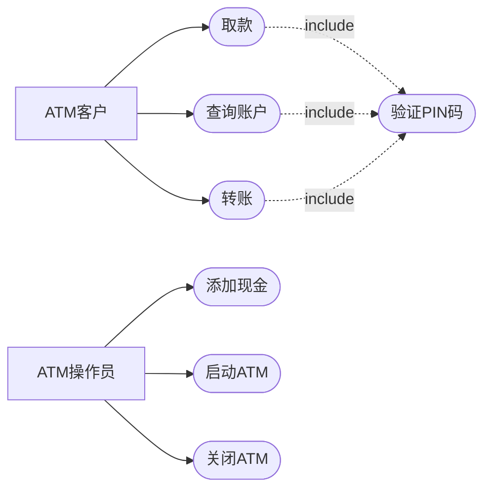
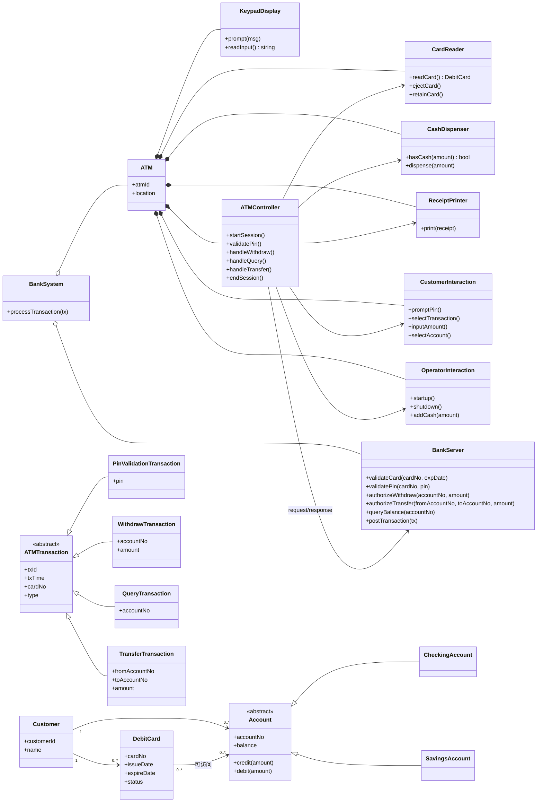
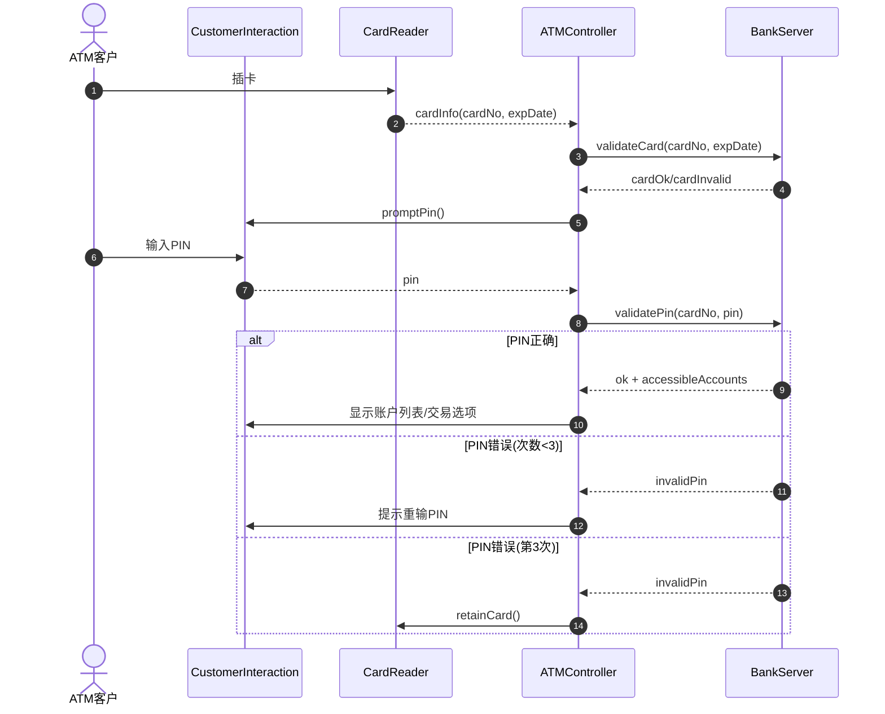
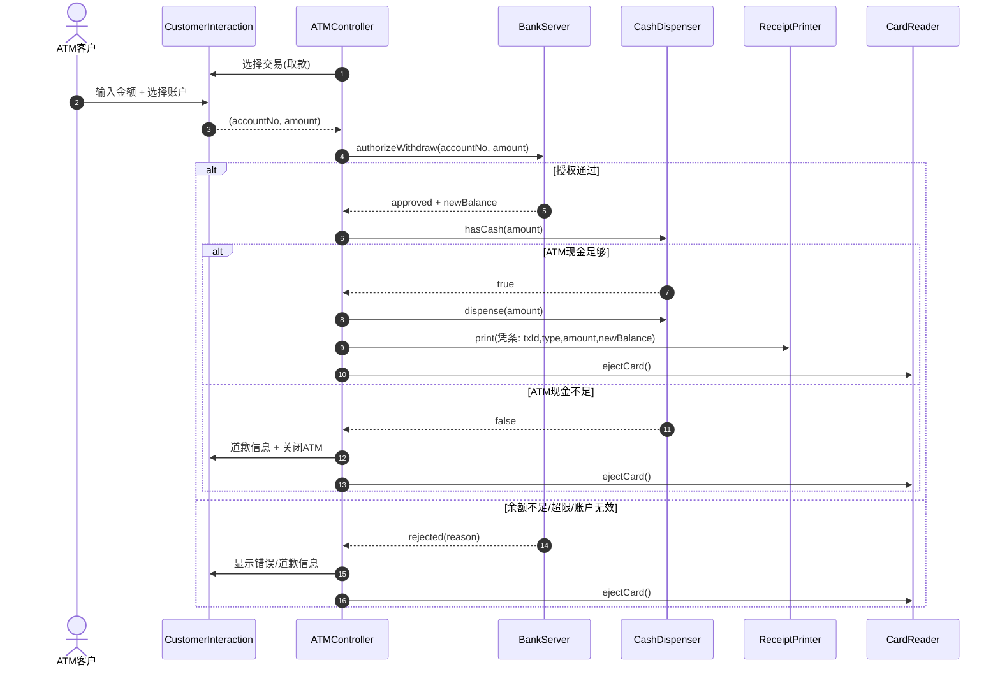
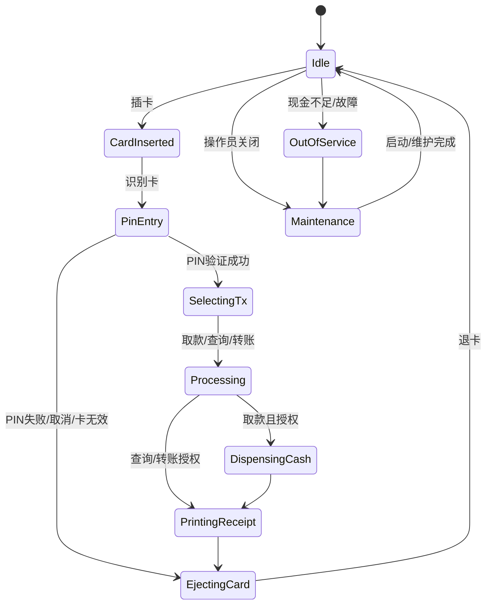
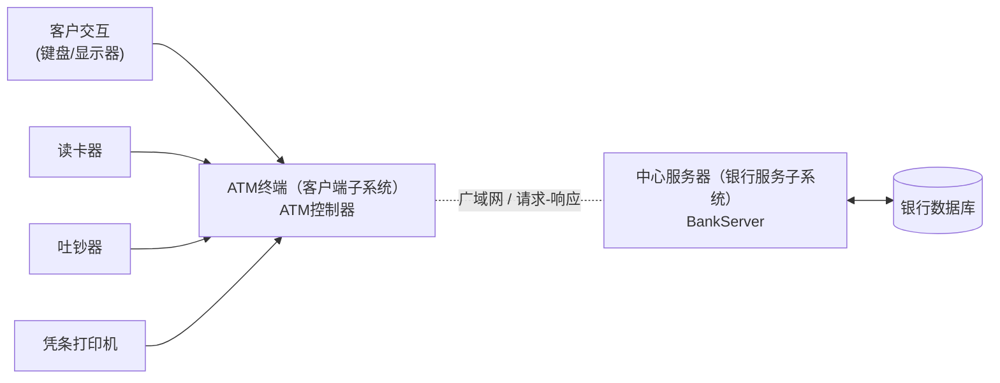

# 实验一（银行系统，C/S）UML模型（Mermaid）

本文件使用 Mermaid 进行 UML 文本化建模：可直接编辑，并在支持 Mermaid 的 Markdown 预览中渲染。

## 1. 用例图

## 2. 领域/设计类图（核心类）

## 3. 时序图：验证 PIN

## 4. 时序图：取款

## 5. 状态图：ATM 控制器（简化）

## 6. 部署/通信视图（用流程图表示）

