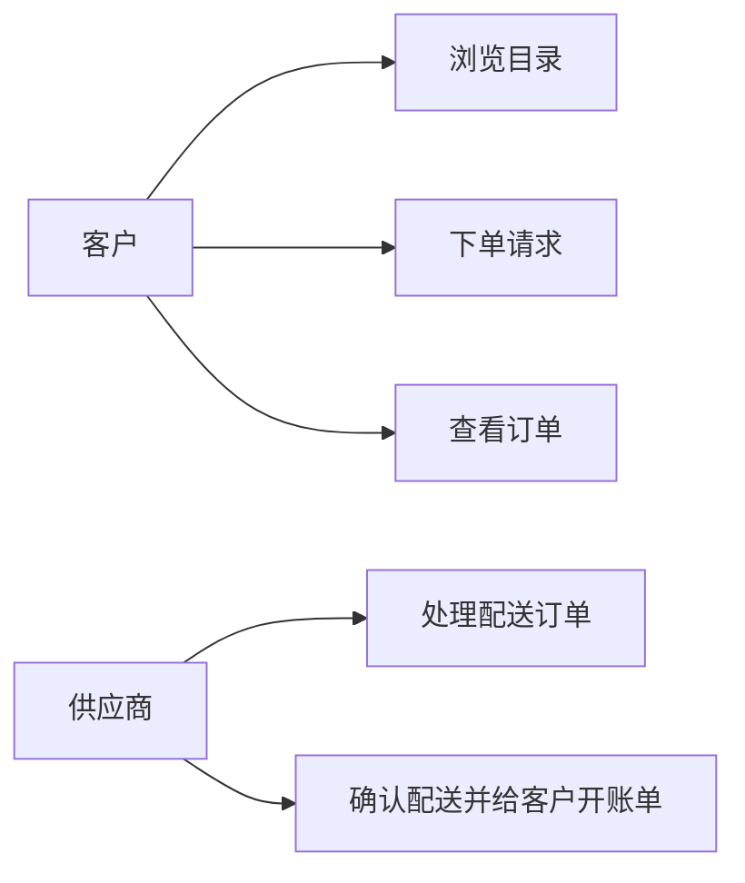
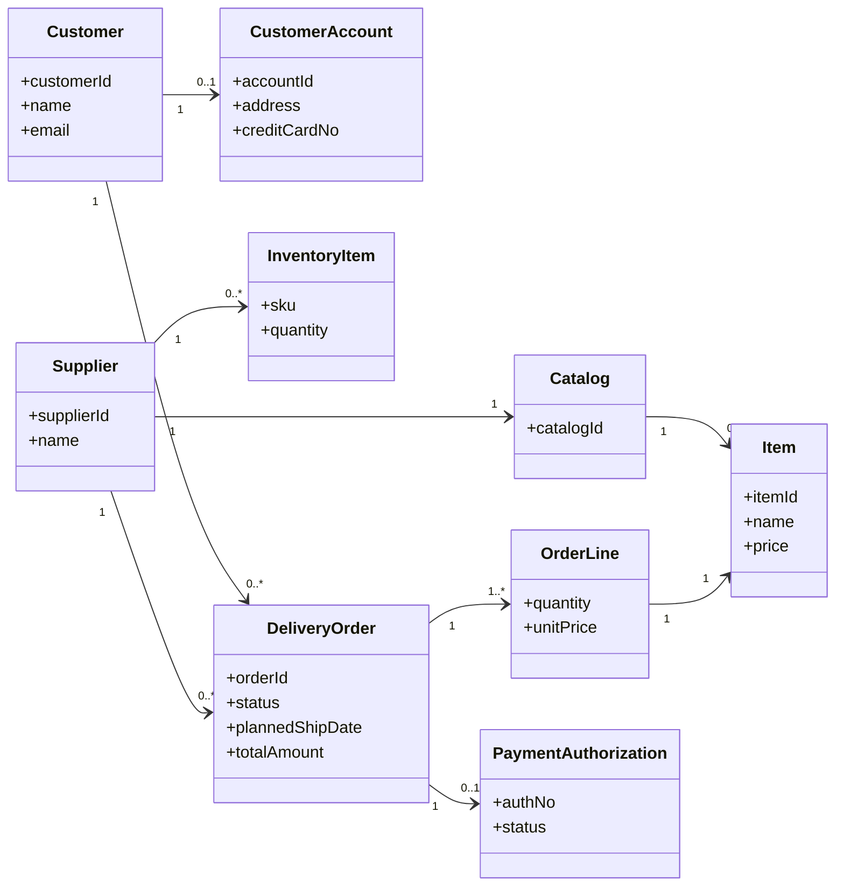
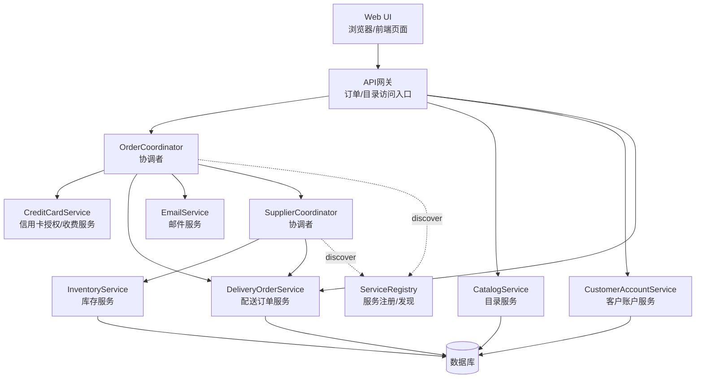
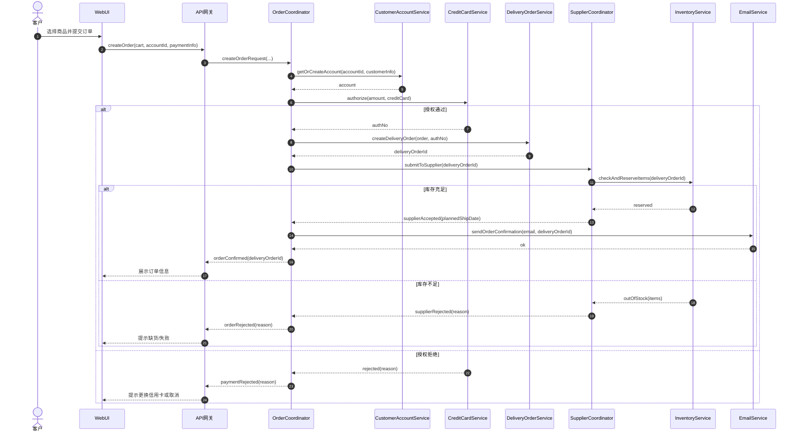
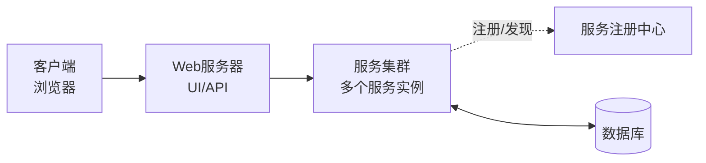

# 《软件架构设计》实验二：面向服务的软件架构设计——在线购物系统（实验报告）

学 院：软件学院  
学 号：2023302855  
姓 名：梁景毓  
专 业：软件工程  
实验时间：2026.5.12  
实验地点：启翔楼  
指导教师：李伟刚  

---

## 一、实验目的及要求

实验名称：面向服务的软件架构设计——在线购物系统

### 1. 实验目的
- 通过实践一个基于 Web 的在线购物系统的需求建模、需求分析、架构设计、详细设计的全过程，掌握面向服务的软件系统分析和设计方法。
- 熟练使用 UML 语言及其相关建模方法，能够建立用例模型、静态模型、动态模型，并完成面向服务的分层体系结构设计、服务通信及服务接口设计。

### 2. 实验要求
- 对"在线购物系统"开发用例模型，了解用例编档方法。
- 面向问题域进行静态建模，识别实体类与关键关系。
- 进行动态建模（交互图/通信图/时序图），覆盖关键用例的主流程与替代流程。
- 完成面向服务分层体系结构设计、服务通信与服务接口设计。
- 按实验报告模板撰写并按要求命名为：学号+姓名+ex2.md。

## 二、实验设备（环境）及要求

### 1. 硬件环境
- 个人计算机（PC），操作系统：Windows

### 2. 软件环境
- 建模工具：Mermaid
- 文本编辑器：支持Markdown预览的编辑器
- 实验参考资料：面向服务体系结构案例研究"在线购物系统"

## 三、实验内容

- 用例模型：客户/供应商参与者、用例与关系。
- 静态模型：客户、账户、供应商、目录/商品、库存、配送订单、支付授权等实体类与关系。
- 动态模型：下单请求、处理配送订单、确认配送并开账单等关键流程的交互。
- SOA 分层架构：UI/API、协调者（Coordinator）、服务层、数据层。
- 服务通信与接口：请求-响应为主，辅以通知类交互（如邮件）。

## 四、实验步骤与结果

### 1. 需求理解与参与者识别

#### 1.1 系统概述
在线购物系统采用面向服务架构（SOA），客户通过Web界面浏览商品目录、提交订单，供应商通过服务接口处理配送订单并确认发货。系统通过协调者（Coordinator）编排多个后端服务完成业务流程。

#### 1.2 参与者识别
| 参与者 | 描述 |
|--------|------|
| 客户（Customer） | 浏览目录、下单请求、查看订单 |
| 供应商（Supplier） | 处理配送订单、确认配送并给客户开账单 |

### 2. 用例模型（结果）

#### 2.1 参与者与用例识别
| 参与者 | 用例 | 描述 |
|--------|------|------|
| 客户 | 浏览目录 | 客户浏览商品目录 |
| 客户 | 下单请求 | 客户提交订单购买商品 |
| 客户 | 查看订单 | 客户查看订单状态 |
| 供应商 | 处理配送订单 | 供应商处理配送订单 |
| 供应商 | 确认配送并给客户开账单 | 供应商确认发货并通知客户 |

### 3. 静态模型（结果）

#### 3.1 核心实体类
| 类名 | 属性 |
|------|------|
| Customer | customerId, name, email |
| CustomerAccount | accountId, address, creditCardNo |
| Supplier | supplierId, name |
| Catalog | catalogId |
| Item | itemId, name, price |
| InventoryItem | sku, quantity |
| DeliveryOrder | orderId, status, plannedShipDate, totalAmount |
| OrderLine | quantity, unitPrice |
| PaymentAuthorization | authNo, status |

#### 3.2 类关系说明
- Customer拥有CustomerAccount（1对0..1）
- Supplier拥有Catalog（1对1），Catalog包含多个Item（1对多）
- Supplier拥有多个InventoryItem
- DeliveryOrder包含多个OrderLine，OrderLine关联Item
- DeliveryOrder关联PaymentAuthorization
- Customer和Supplier分别与DeliveryOrder关联

### 4. 面向服务分层体系结构（结果）

系统采用"分层抽象"思想组织：
- **表示/接入层**：Web UI、API 网关
- **协调层**：OrderCoordinator、SupplierCoordinator（用于跨服务流程整合）
- **服务层**：目录服务、库存服务、客户账户服务、配送订单服务、邮件服务、信用卡服务
- **数据层**：持久化实体数据（账户/订单/库存等）

### 5. 动态建模（结果）

以"下单请求（Make Order Request）"为代表：
- 协调者首先获取/创建客户账户并进行信用卡授权
- 授权通过后创建配送订单并提交给供应商侧协调者
- 供应商侧检查并预留库存，成功则确认并通知客户（邮件）
- 替代流程覆盖：信用卡授权失败、库存不足等

### 6. 服务通信与接口设计（结果）

- **同步请求-响应**：UI/API -> 协调者 -> 各业务服务（账户/支付/订单/库存）
- **通知类交互**：订单确认可通过邮件服务对客户进行通知
- **服务发现**：协调者通过服务注册中心进行服务注册/发现（代理/注册/发现模式）

## 五、分析与讨论

### 1）协调者类的主要作用是什么，它与服务类的区别有哪些？

**答**：
1. **协调者类（Coordinator）**主要负责跨多个服务的业务流程编排与一致性控制，把"一个用例/业务流程"拆分成多个服务调用并按顺序/条件组合起来。
2. **服务类（Service）**更关注单一业务能力的实现与对外接口（例如库存检查、创建订单、信用卡授权），强调高内聚、可复用与稳定契约。
3. **区别**：协调者偏"流程/编排"，服务偏"能力/原子操作"；协调者通常不直接承载核心数据持久化，而服务拥有领域边界与数据责任。

### 2）举例说明本次实验使用了哪些通信模式。

**答**：
1. **请求-响应（同步）**：创建订单、查询库存、信用卡授权等（典型 HTTP/SOAP/REST 风格）。
2. **通知（异步/弱同步）**：通过邮件服务向客户发送订单确认、配送状态更新（可实现为异步消息/任务队列）。
3. **注册/发现**：服务通过注册中心登记，调用方通过发现定位服务实例（服务治理/代理模式）。

### 3）本次实验中的供应商协调者类（SupplierCoordinator）使用了哪些请求接口，通过这些接口调用了哪些服务？

**答**：
SupplierCoordinator 面向"供应商处理订单"流程，典型会暴露/使用的请求接口包括：
1. `ReceiveDeliveryOrderRequest`：接收配送订单请求 -> 调用 DeliveryOrderService 检索订单详情
2. `CheckInventoryForOrderItems`：检查订单商品库存 -> 调用 InventoryService 进行库存校验
3. `ReserveOrderItems`：预留库存 -> 调用 InventoryService 预留/锁定库存
4. `ConfirmDeliveryReady`：确认配送就绪 -> 调用 DeliveryOrderService 更新状态；必要时触发 CreditCardService 进行扣款与 EmailService 通知客户

## 六、教师评语

（此处留空）

成绩：______
