# 《软件架构设计》实验二：面向服务的软件架构设计——在线购物系统（实验报告）

学 院：软件学院  
学 号：2023302855  
姓 名：梁景毓  
专 业：软件工程  
实验时间：2026.5.12  
实验地点：启翔楼  
指导教师：李伟刚  

---

## 一、实验目的及要求

实验名称：面向服务的软件架构设计——在线购物系统

### 1. 实验目的
- 通过实践一个基于 Web 的在线购物系统的需求建模、需求分析、架构设计、详细设计的全过程，掌握面向服务的软件系统分析和设计方法。
- 熟练使用 UML 语言及其相关建模方法，能够建立用例模型、静态模型、动态模型，并完成面向服务的分层体系结构设计、服务通信及服务接口设计。

### 2. 实验要求
- 对"在线购物系统"开发用例模型，了解用例编档方法。
- 面向问题域进行静态建模，识别实体类与关键关系。
- 进行动态建模（交互图/通信图/时序图），覆盖关键用例的主流程与替代流程。
- 完成面向服务分层体系结构设计、服务通信与服务接口设计。
- 按实验报告模板撰写并按要求命名为：学号+姓名+ex2.md。

## 二、实验设备（环境）及要求

### 1. 硬件环境
- 个人计算机（PC），操作系统：Windows

### 2. 软件环境
- 建模工具：Mermaid
- 文本编辑器：支持Markdown预览的编辑器
- 实验参考资料：面向服务体系结构案例研究"在线购物系统"

## 三、实验内容

- 用例模型：客户/供应商参与者、用例与关系。
- 静态模型：客户、账户、供应商、目录/商品、库存、配送订单、支付授权等实体类与关系。
- 动态模型：下单请求、处理配送订单、确认配送并开账单等关键流程的交互。
- SOA 分层架构：UI/API、协调者（Coordinator）、服务层、数据层。
- 服务通信与接口：请求-响应为主，辅以通知类交互（如邮件）。

## 四、实验步骤与结果

### 1. 需求理解与参与者识别

#### 1.1 系统概述
在线购物系统采用面向服务架构（SOA），客户通过Web界面浏览商品目录、提交订单，供应商通过服务接口处理配送订单并确认发货。系统通过协调者（Coordinator）编排多个后端服务完成业务流程。

#### 1.2 参与者识别
| 参与者 | 描述 |
|--------|------|
| 客户（Customer） | 浏览目录、下单请求、查看订单 |
| 供应商（Supplier） | 处理配送订单、确认配送并给客户开账单 |

### 2. 用例模型

#### 2.1 参与者与用例识别
| 参与者 | 用例 | 描述 |
|--------|------|------|
| 客户（Customer） | 浏览目录（Browse Catalogue） | 客户浏览在线商店中的商品目录，查看商品信息 |
| 客户（Customer） | 下单请求（Make Order Request） | 客户提交订单购买商品，系统完成支付授权并创建配送订单 |
| 客户（Customer） | 查看订单（View Order） | 客户查看自己的订单状态和详细信息 |
| 供应商（Supplier） | 处理配送订单（Process Delivery Order） | 供应商接收并处理配送订单，检查和预留库存 |
| 供应商（Supplier） | 确认配送并给客户开账单（Confirm Shipment and Bill Customer） | 供应商确认发货，通知客户并生成账单 |

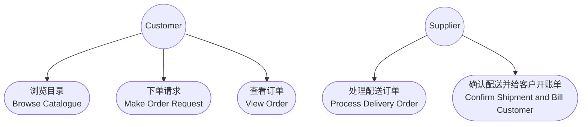

#### 2.2 用例编档

##### 2.2.1 "浏览目录"用例

| 项目 | 内容 |
|------|------|
| **用例名称** | 浏览目录（Browse Catalogue） |
| **简要描述** | 客户浏览在线商店中供应商提供的商品目录，查看各类商品的详细信息（名称、描述、价格等） |
| **参与者** | 客户（Customer） |
| **前置条件** | 客户已连接到在线购物系统 |
| **主成功场景** | 1. 客户请求浏览商品目录 2. 系统显示商品目录中各类商品的列表 3. 客户选择某一类商品 4. 系统显示该类商品的详细信息（名称、描述、价格等） |
| **替代流程** | 3a. 客户请求搜索特定商品：系统返回匹配的商品列表 4a. 商品信息不可用：系统提示错误信息 |

##### 2.2.2 "下单请求"用例

| 项目 | 内容 |
|------|------|
| **用例名称** | 下单请求（Make Order Request） |
| **简要描述** | 客户提交订单购买商品，系统获取或创建客户账户，进行信用卡授权，创建配送订单，并提交给供应商 |
| **参与者** | 客户（Customer） |
| **前置条件** | 客户已登录系统，购物车中有商品 |
| **主成功场景** | 1. 客户提交订单请求 2. 系统获取或创建客户账户信息 3. 系统请求信用卡授权 4. 信用卡授权通过，获得授权号 5. 系统创建配送订单 6. 系统将配送订单提交给供应商 7. 供应商确认接受订单 8. 系统发送订单确认邮件给客户 9. 系统向客户展示订单确认信息 |
| **替代流程** | 4a. 信用卡授权被拒绝：系统通知客户更换支付方式，流程终止 6a. 供应商拒绝订单（如库存不足）：系统通知客户并取消订单 |

##### 2.2.3 "处理配送订单"用例

| 项目 | 内容 |
|------|------|
| **用例名称** | 处理配送订单（Process Delivery Order） |
| **简要描述** | 供应商接收配送订单，检查相关商品的库存情况并预留库存 |
| **参与者** | 供应商（Supplier） |
| **前置条件** | 供应商已收到配送订单请求 |
| **主成功场景** | 1. 供应商接收到配送订单请求 2. 供应商检查配送订单中各商品的库存 3. 库存充足，供应商预留相关库存 4. 供应商接受该配送订单 5. 供应商确定发货日期 |
| **替代流程** | 2a. 某些商品库存不足：供应商拒绝该配送订单，通知客户协调者 |

##### 2.2.4 "确认配送并给客户开账单"用例

| 项目 | 内容 |
|------|------|
| **用例名称** | 确认配送并给客户开账单（Confirm Shipment and Bill Customer） |
| **简要描述** | 供应商确认商品已发货，对客户信用卡进行扣款，并发送发货通知邮件 |
| **参与者** | 供应商（Supplier） |
| **前置条件** | 供应商已接受配送订单并完成库存预留 |
| **主成功场景** | 1. 供应商确认商品已发出 2. 供应商向客户协调者发送配送更新 3. 客户协调者请求信用卡服务进行扣款 4. 扣款成功 5. 客户协调者请求邮件服务发送发货通知 6. 系统向客户发送发货确认邮件 |
| **替代流程** | 3a. 信用卡扣款失败：系统通知客户并记录异常 |

##### 2.2.5 "查看订单"用例

| 项目 | 内容 |
|------|------|
| **用例名称** | 查看订单（View Order） |
| **简要描述** | 客户查看自己的订单列表及某一订单的详细信息 |
| **参与者** | 客户（Customer） |
| **前置条件** | 客户已登录系统 |
| **主成功场景** | 1. 客户请求查看自己的订单列表 2. 系统显示客户的所有订单 3. 客户选择某一订单查看详情 4. 系统显示该订单的详细信息（商品、金额、状态等） |
| **替代流程** | 1a. 客户没有任何订单：系统提示暂无订单记录 |

#### 2.3 用例活动图

##### 2.3.1 "浏览目录"活动图

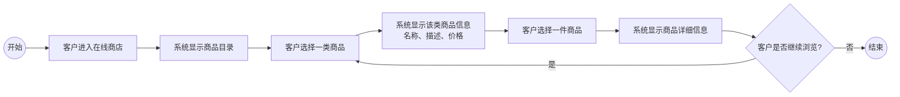

##### 2.3.2 "下单请求"活动图

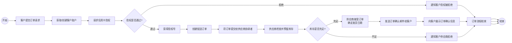

##### 2.3.3 "处理配送订单"活动图

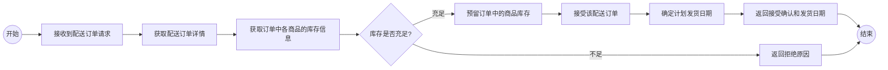

##### 2.3.4 "确认配送并给客户开账单"活动图

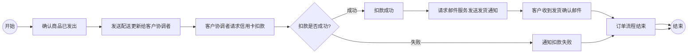

### 3. 静态模型

#### 3.1 核心实体类
| 类名 | 属性 | 方法 |
|------|------|------|
| Customer | customerId: int, name: String, email: String | placeOrder(), viewOrder() |
| CustomerAccount | accountId: int, address: String, creditCardNo: String | getAccountInfo(), createAccount() |
| Supplier | supplierId: int, name: String | processDeliveryOrder() |
| Catalog | catalogId: int | getCatalogue(), getItemInformation() |
| Item | itemId: int, name: String, price: double, description: String | getItemDetails() |
| InventoryItem | sku: String, quantity: int | checkAvailability(), reserveItem(), releaseItem() |
| DeliveryOrder | orderId: int, status: Enumeration{Created, Open, Completed}, plannedShipDate: Date, totalAmount: double | createDeliveryOrder(), updateDeliveryOrder(), getDeliveryOrderInfo() |
| OrderLine | quantity: int, unitPrice: double | getOrderLineInfo() |
| PaymentAuthorization | authNo: int, status: Enumeration{Authorized, Rejected} | authorize(), getAuthorizationStatus() |

#### 3.2 类关系说明
- Customer拥有CustomerAccount（1对0..1）
- Supplier拥有Catalog（1对1），Catalog包含多个Item（1对多）
- Supplier拥有多个InventoryItem
- DeliveryOrder包含多个OrderLine，OrderLine关联Item
- DeliveryOrder关联PaymentAuthorization
- Customer和Supplier分别与DeliveryOrder关联

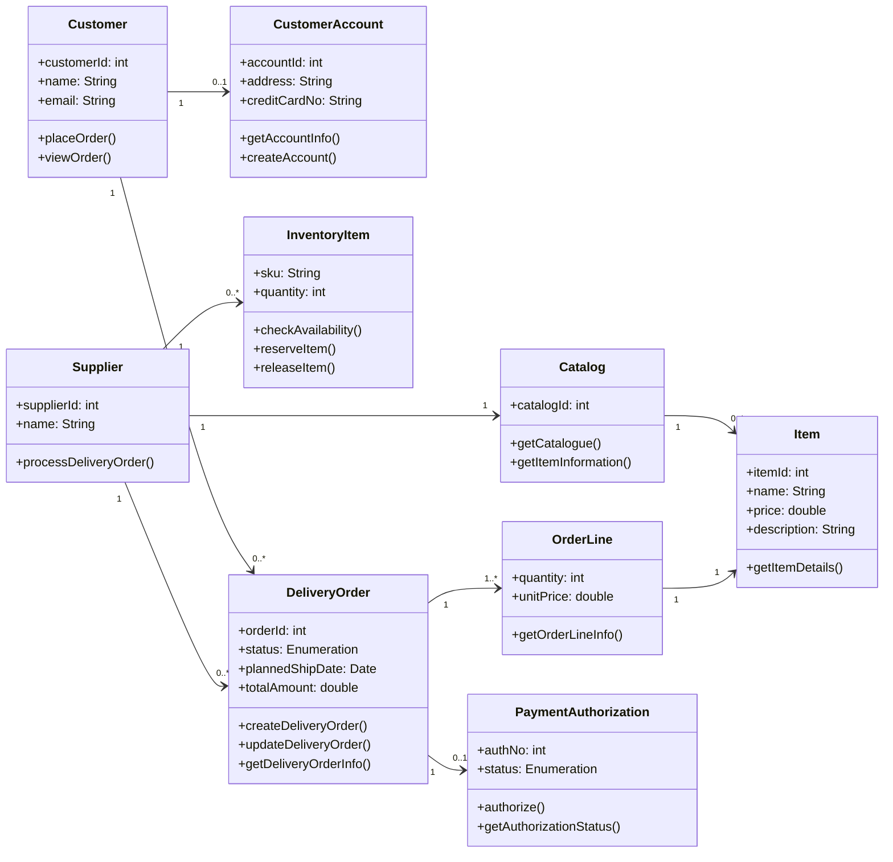

#### 3.3 服务层包图

系统中的实体类按照服务边界划分到不同的服务包中，每个包对应一个独立的微服务：

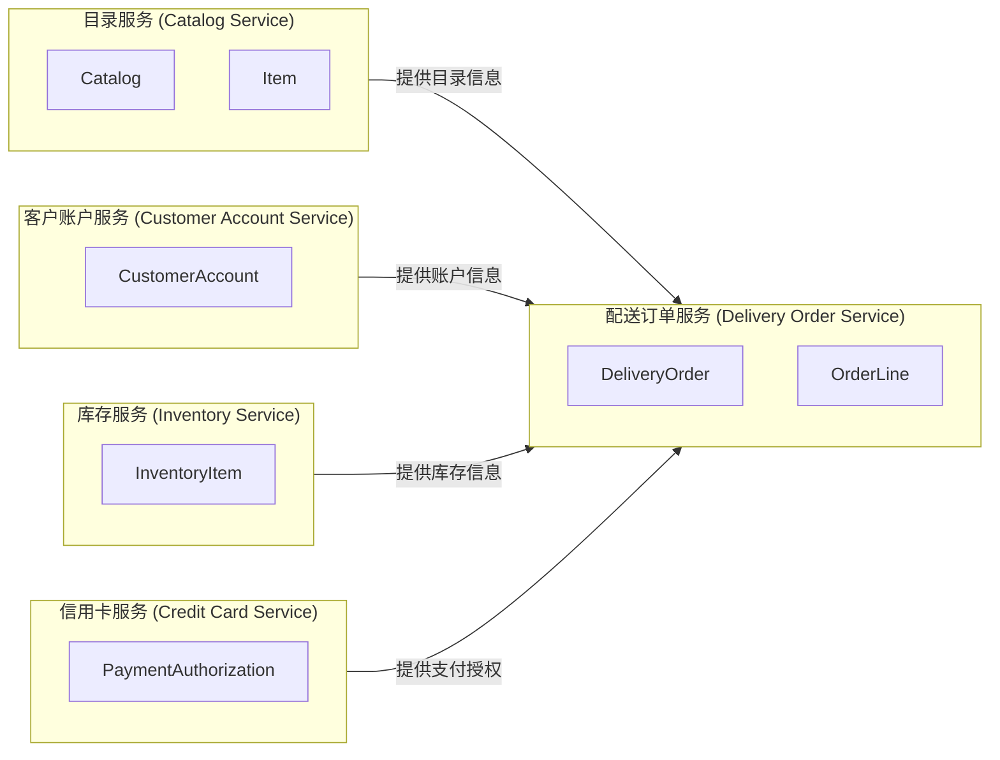

### 4. 面向服务分层体系结构

#### 4.1 分层说明

系统采用"分层抽象"思想组织，共分为四层：

| 层次 | 组件 | 职责 |
|------|------|------|
| **表示/接入层（Presentation/API Layer）** | Web UI、API 网关 | 提供用户界面和RESTful API入口 |
| **协调层（Coordination Layer）** | OrderCoordinator、CustomerCoordinator、SupplierCoordinator、BillingCoordinator | 编排跨服务业务流程，协调多个服务完成用例 |
| **服务层（Service Layer）** | CatalogService、CustomerAccountService、DeliveryOrderService、InventoryService、CreditCardService、EmailService、BankService、FulfillmentService | 提供单一业务能力，暴露标准服务接口 |
| **数据层（Data Layer）** | 各服务对应的持久化存储 | 存储实体数据（账户/订单/库存等） |

#### 4.2 分层体系结构图

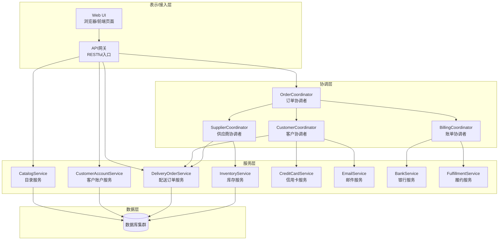

#### 4.3 面向服务的体系结构组件图

```mermaid
flowchart LR
    subgraph Client["客户端"]
        CU[客户界面\nCustomer Interface]
        SU[供应商界面\nSupplier Interface]
    end

    subgraph Coord["协调者层"]
        POC[PCustomerCoordinator]
        PSC[PSupplierCoordinator]
        PBC[PPaymentCoordinator]
        RSC[RSRequestCoordinator]
        RIC[RInventoryCoordinator]
        RPOC[RPOrderCoordinator]
        RDOC[RDDeliveryOrderCoordinator]
        RGC[RGCatalogCoordinator]
        RRC[RReorderCoordinator]
    end

    subgraph SvcInterface["服务接口层"]
        I1[<<interface>>\nR:CustomerInterface]
        I2[<<interface>>\nR:SupplierInterface]
        I3[<<interface>>\nR:PaymentInterface]
        I4[<<interface>>\nR:RequestInterface]
        I5[<<interface>>\nR:InventoryInterface]
        I6[<<interface>>\nR:OrderInterface]
        I7[<<interface>>\nR:DeliveryOrderInterface]
        I8[<<interface>>\nR:CatalogueInterface]
        I9[<<interface>>\nR:ReorderInterface]
    end

    subgraph Svc["服务层"]
        S1[service Customer Service]
        S2[service Supplier Service]
        S3[service Payment Service]
        S4[service Request Service]
        S5[service Inventory Service]
        S6[service Order Service]
        S7[service DeliveryOrder Service]
        S8[service Catalogue Service]
        S9[service Reorder Service]
    end

    Client --> Coord
    Coord --> SvcInterface
    SvcInterface --> Svc
```

### 5. 动态建模

#### 5.1 "浏览目录"时序图

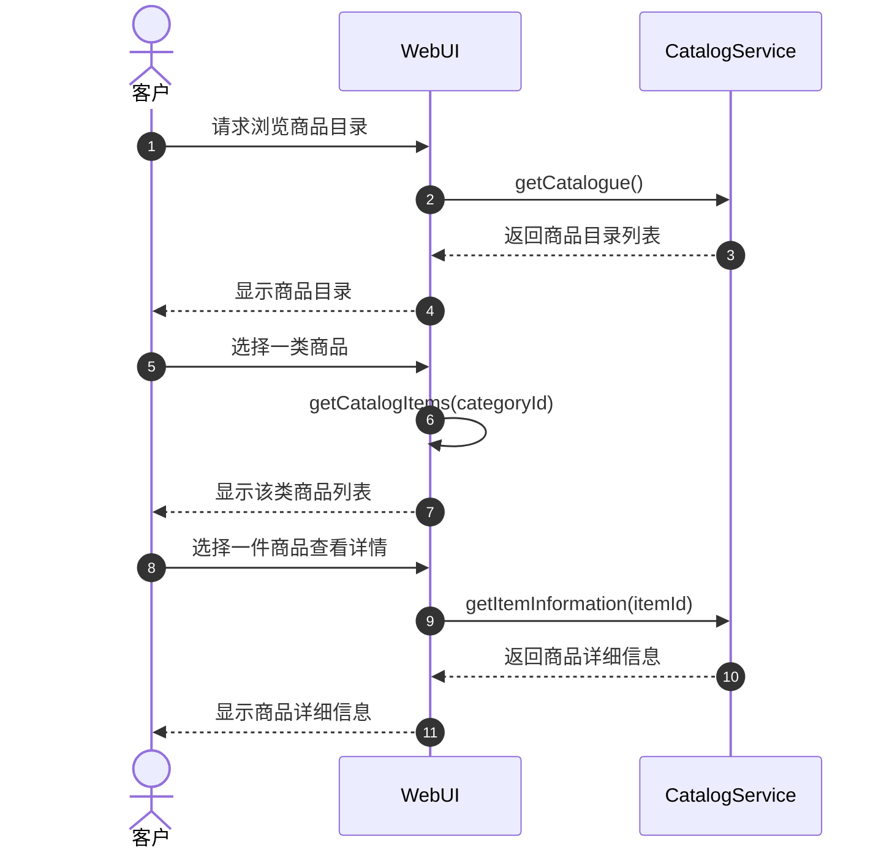

#### 5.2 "下单请求"时序图

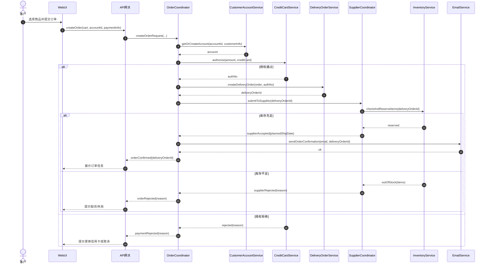

#### 5.3 "处理配送订单"时序图

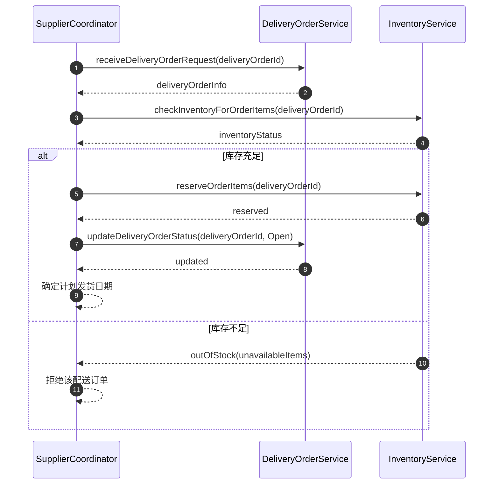

#### 5.4 "确认配送并给客户开账单"时序图

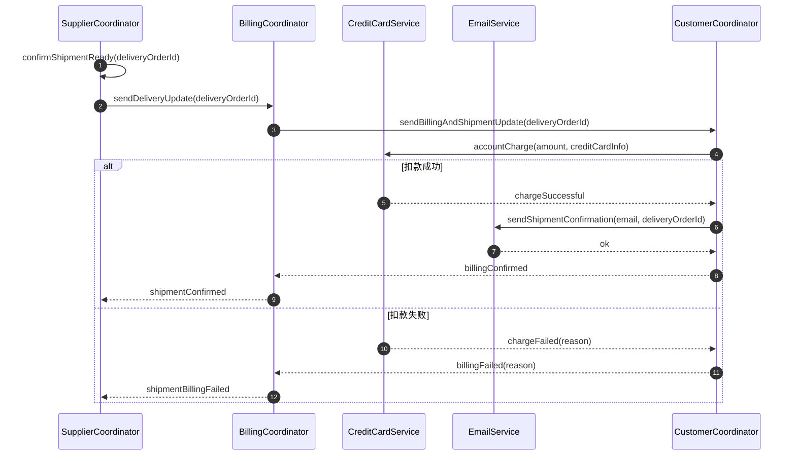

#### 5.5 "查看订单"时序图

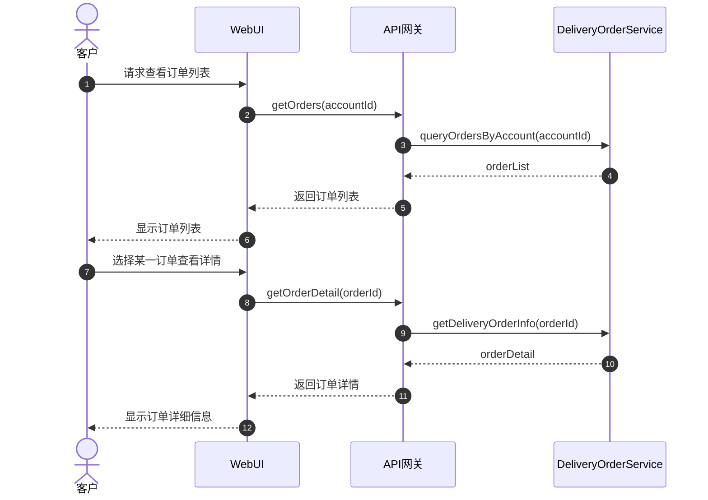

#### 5.6 通信图

##### 5.6.1 "浏览目录"通信图

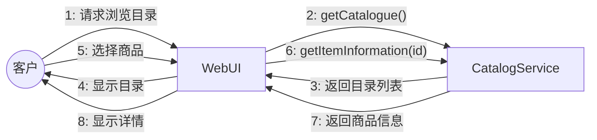

##### 5.6.2 "下单请求"通信图

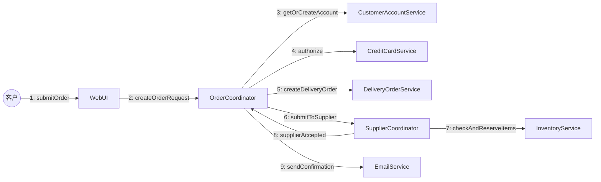

##### 5.6.3 "处理配送订单"通信图

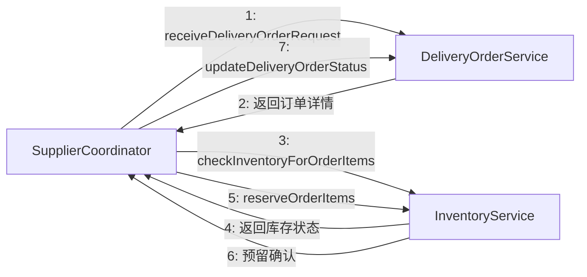

##### 5.6.4 "确认配送并给客户开账单"通信图

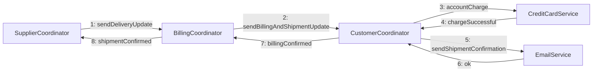

### 6. 服务通信与接口设计

#### 6.1 服务通信模式

系统中使用了以下几种服务通信模式：

| 通信模式 | 说明 | 应用场景 |
|----------|------|----------|
| **请求-响应（Request-Response）** | 客户端发送请求并等待服务返回结果，是最常见的同步通信模式 | 创建订单、查询库存、信用卡授权、浏览目录 |
| **通知（Notification）** | 服务向客户端发送单向通知，不期望返回响应 | 订单确认邮件、发货通知邮件 |
| **发布-订阅（Publish-Subscribe）** | 服务发布事件，多个订阅者接收并处理 | 库存变更通知、订单状态变更广播 |
| **消息/事件队列（Message/Event Queue）** | 通过消息队列异步传递事件，实现服务间解耦 | 邮件发送任务队列、库存预留异步处理 |
| **注册/发现（Registry/Discovery）** | 服务通过注册中心登记，调用方通过发现定位服务实例 | 协调者动态查找各服务端点 |

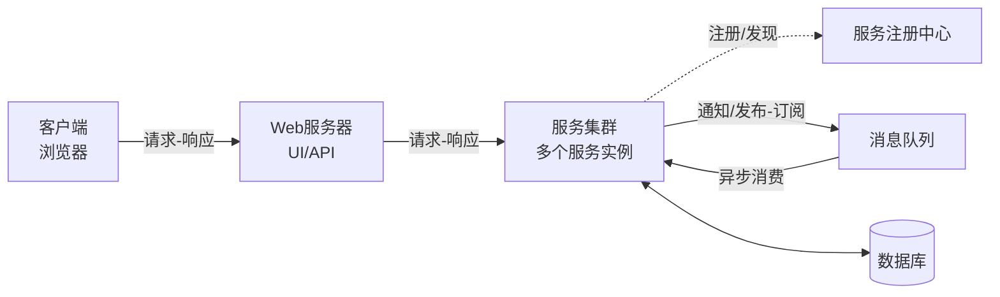

#### 6.2 服务接口设计（WSDL描述）

各服务通过 WSDL（Web Services Description Language）定义标准接口，以下以表格形式列出各服务的操作名称、输入/输出消息：

##### 6.2.1 目录服务（Catalogue Service）接口

| 操作名称 | 输入消息 | 输出消息 | 说明 |
|----------|----------|----------|------|
| `getCatalogue` | GetCatalogueRequest | GetCatalogueResponse | 获取完整商品目录 |
| `getItemInformation` | GetItemInfoRequest | GetItemInfoResponse | 获取单件商品详细信息 |

##### 6.2.2 客户账户服务（Customer Account Service）接口

| 操作名称 | 输入消息 | 输出消息 | 说明 |
|----------|----------|----------|------|
| `getAccountInformation` | GetAccountInfoRequest | GetAccountInfoResponse | 获取客户账户信息 |
| `createAccount` | CreateAccountRequest | CreateAccountResponse | 创建新客户账户 |

##### 6.2.3 配送订单服务（Delivery Order Service）接口

| 操作名称 | 输入消息 | 输出消息 | 说明 |
|----------|----------|----------|------|
| `createDeliveryOrder` | CreateDeliveryOrderRequest | CreateDeliveryOrderResponse | 创建配送订单 |
| `updateDeliveryOrder` | UpdateDeliveryOrderRequest | UpdateDeliveryOrderResponse | 更新配送订单状态 |
| `getDeliveryOrderInformation` | GetDeliveryOrderInfoRequest | GetDeliveryOrderInfoResponse | 查询配送订单详情 |

##### 6.2.4 库存服务（Inventory Service）接口

| 操作名称 | 输入消息 | 输出消息 | 说明 |
|----------|----------|----------|------|
| `checkInventory` | CheckInventoryRequest | CheckInventoryResponse | 查询商品库存 |
| `reserveItemInventory` | ReserveItemRequest | ReserveItemResponse | 预留商品库存 |
| `releaseItemInventory` | ReleaseItemRequest | ReleaseItemResponse | 释放已预留库存 |

##### 6.2.5 信用卡服务（Credit Card Service）接口

| 操作名称 | 输入消息 | 输出消息 | 说明 |
|----------|----------|----------|------|
| `authorize` | AuthorizeRequest | AuthorizeResponse | 信用卡授权验证 |
| `charge` | ChargeRequest | ChargeResponse | 信用卡扣款 |

##### 6.2.6 邮件服务（Email Service）接口

| 操作名称 | 输入消息 | 输出消息 | 说明 |
|----------|----------|----------|------|
| `sendEmail` | SendEmailRequest | SendEmailResponse | 发送邮件通知 |

## 五、分析与讨论

### 1）协调者类的主要作用是什么，它与服务类的区别有哪些？

**答**：
1. **协调者类（Coordinator）**主要负责跨多个服务的业务流程编排与一致性控制，把"一个用例/业务流程"拆分成多个服务调用并按顺序/条件组合起来。例如本实验中的 `OrderCoordinator` 负责编排"下单请求"用例的完整流程：先调用 `CustomerAccountService` 获取账户，再调用 `CreditCardService` 进行授权，然后调用 `DeliveryOrderService` 创建订单，最后调用 `SupplierCoordinator` 提交给供应商。
2. **服务类（Service）**更关注单一业务能力的实现与对外接口，强调高内聚、可复用与稳定契约。例如 `InventoryService` 只负责库存的检查与预留，`CreditCardService` 只负责信用卡授权与扣款。
3. **区别**：
   - 协调者偏"流程/编排"，服务偏"能力/原子操作"
   - 协调者通常不直接承载核心数据持久化，而服务拥有领域边界与数据责任
   - 协调者可以调用多个服务，而服务之间应尽量避免直接互相调用
   - 一个用例通常对应一个协调者，而一个服务可以被多个协调者复用

### 2）举例说明本次实验使用了哪些通信模式。

**答**：
1. **请求-响应（同步）**：这是最主要的通信模式。例如客户浏览目录时，`WebUI` 向 `CatalogService` 发送 `getCatalogue()` 请求并等待返回目录列表；信用卡授权时，`OrderCoordinator` 向 `CreditCardService` 发送 `authorize()` 请求并等待授权结果。
2. **通知（Notification）**：订单确认后，`OrderCoordinator` 通过 `EmailService` 向客户发送订单确认邮件，这是一个单向通知，不期望客户回复。类似地，供应商确认发货后也通过邮件通知客户。
3. **发布-订阅（Publish-Subscribe）**：库存变更时，`InventoryService` 可以发布库存变更事件，多个订阅者（如 `SupplierCoordinator`、`OrderCoordinator`）可以接收并处理。
4. **消息/事件队列**：邮件发送可以通过消息队列异步处理，`OrderCoordinator` 将邮件发送任务放入队列，`EmailService` 异步消费并发送，避免阻塞主流程。
5. **注册/发现**：协调者在启动时通过 `ServiceRegistry` 注册自己，调用方通过服务发现机制定位服务实例的地址，实现了服务间的动态绑定。

### 3）本次实验中的供应商协调者类（SupplierCoordinator）使用了哪些请求接口，通过这些接口调用了哪些服务？

**答**：
`SupplierCoordinator` 面向"供应商处理订单"流程，负责从接收配送订单到确认发货的完整编排。它使用了以下请求接口：

1. **`ReceiveDeliveryOrderRequest`**：接收来自客户协调者的配送订单请求 -> 调用 `DeliveryOrderService` 的 `getDeliveryOrderInformation()` 检索订单详情（包括客户信息、商品列表、金额等）
2. **`CheckInventoryForOrderItems`**：检查订单中各商品的库存 -> 调用 `InventoryService` 的 `checkInventory()` 校验库存是否充足
3. **`ReserveOrderItems`**：预留库存 -> 调用 `InventoryService` 的 `reserveItemInventory()` 锁定库存，防止被其他订单占用
4. **`UpdateDeliveryOrderStatus`**：更新配送订单状态 -> 调用 `DeliveryOrderService` 的 `updateDeliveryOrder()` 将订单状态从 Created 更新为 Open
5. **`ConfirmDeliveryReady`**：确认配送就绪 -> 触发 `BillingCoordinator` 进行后续的扣款与通知流程（调用 `CreditCardService` 扣款 + `EmailService` 发送发货通知）
