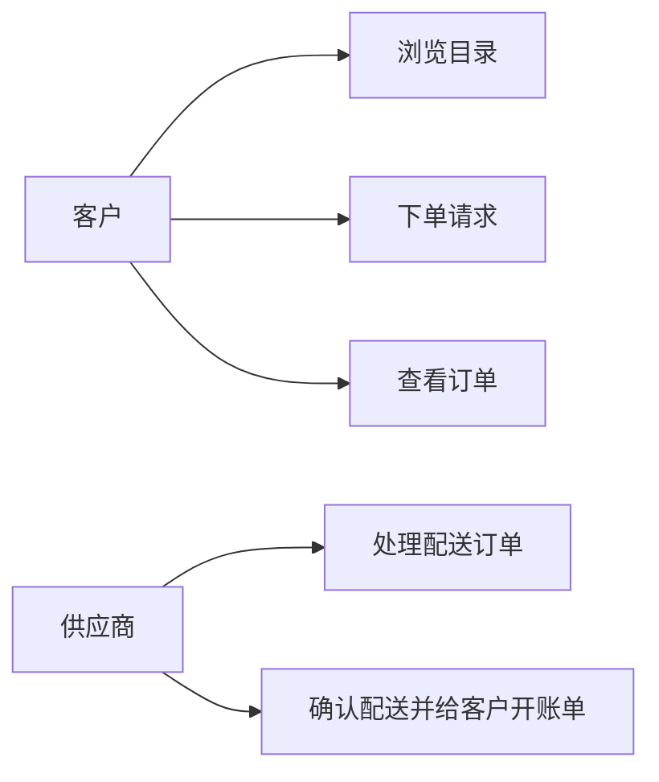
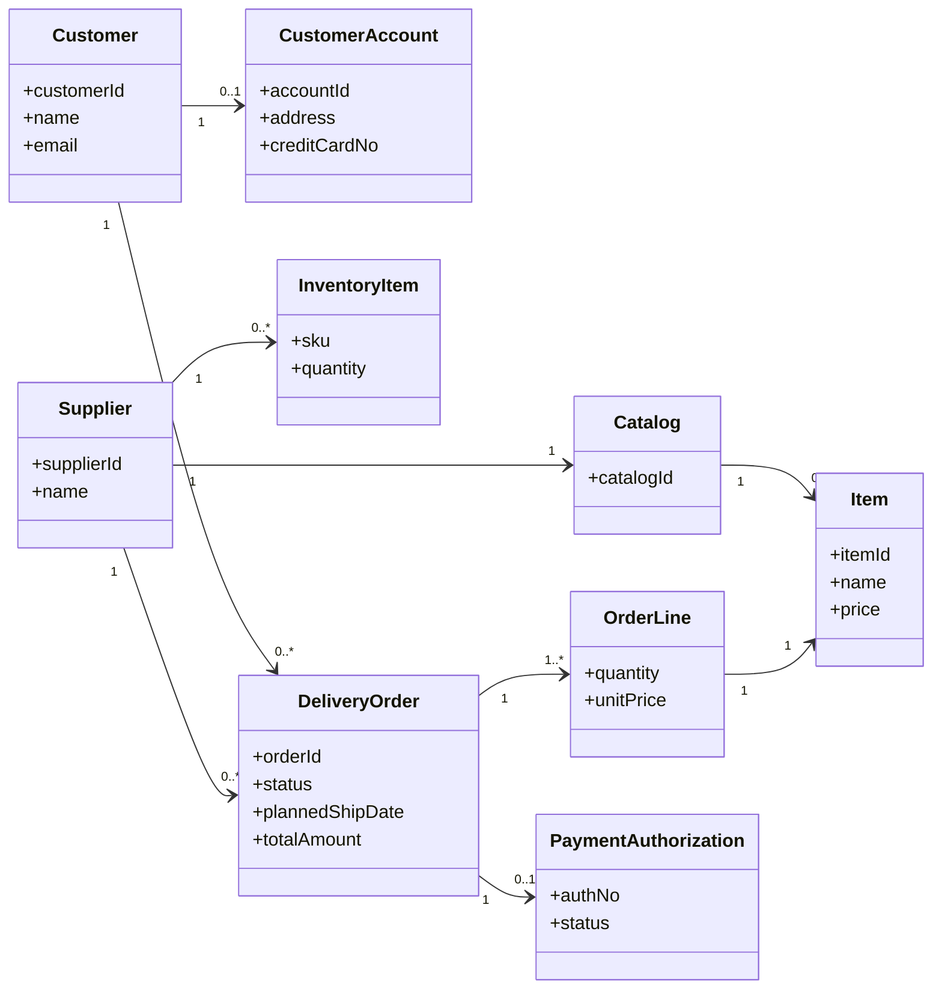
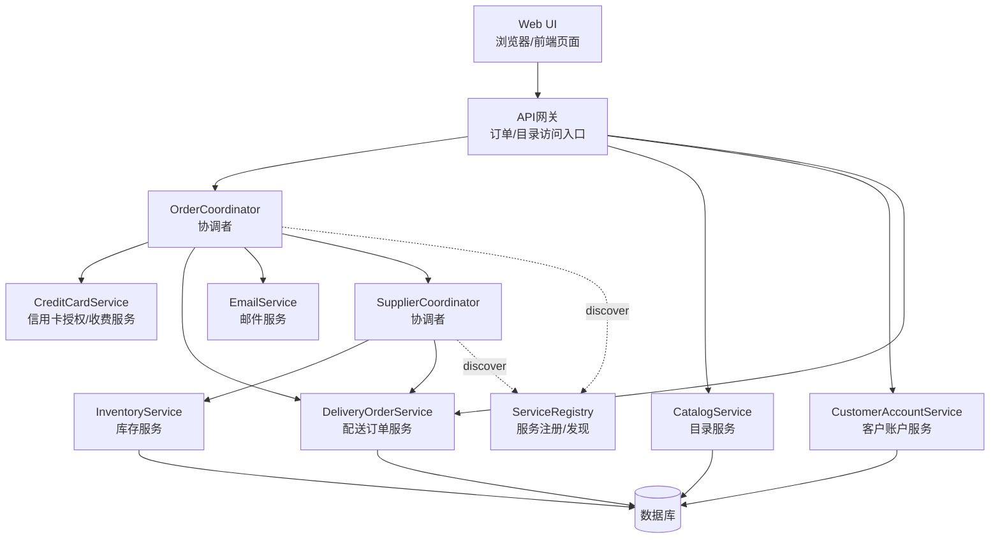
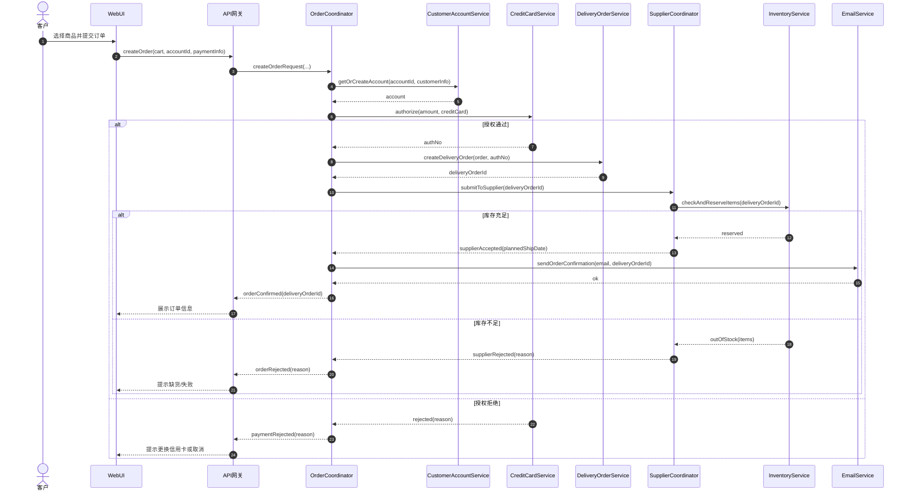
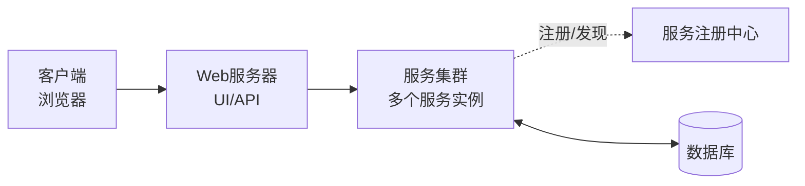

# 实验二（在线购物系统，面向服务）UML模型（Mermaid）

## 1. 用例图（flowchart 表示）

```mermaid
flowchart LR
Customer[客户]
Supplier[供应商]
UC_Browse[浏览目录]
UC_MakeOrder[下单请求]
UC_ViewOrder[查看订单]
UC_ProcessDelivery[处理配送订单]
UC_ConfirmShip[确认配送并给客户开账单]

Customer --> UC_Browse
Customer --> UC_MakeOrder
Customer --> UC_ViewOrder

Supplier --> UC_ProcessDelivery
Supplier --> UC_ConfirmShip
```

## 2. 领域静态模型（核心实体类）

```mermaid
classDiagram
direction LR

class Customer {
  +customerId
  +name
  +email
}

class CustomerAccount {
  +accountId
  +address
  +creditCardNo
}

class Supplier {
  +supplierId
  +name
}

class Catalog {
  +catalogId
}

class Item {
  +itemId
  +name
  +price
}

class InventoryItem {
  +sku
  +quantity
}

class DeliveryOrder {
  +orderId
  +status
  +plannedShipDate
  +totalAmount
}

class OrderLine {
  +quantity
  +unitPrice
}

class PaymentAuthorization {
  +authNo
  +status
}

Customer "1" --> "0..1" CustomerAccount
Supplier "1" --> "1" Catalog
Catalog "1" --> "0..*" Item
Supplier "1" --> "0..*" InventoryItem
DeliveryOrder "1" --> "1..*" OrderLine
OrderLine "1" --> "1" Item
DeliveryOrder "1" --> "0..1" PaymentAuthorization
Customer "1" --> "0..*" DeliveryOrder
Supplier "1" --> "0..*" DeliveryOrder
```

## 3. 服务分层/分解（架构视图）

```mermaid
flowchart TB
UI[Web UI\n浏览器/前端页面]
API[API网关\n订单/目录访问入口]

OC[OrderCoordinator\n协调者]
SC[SupplierCoordinator\n协调者]

CatalogSvc[CatalogService\n目录服务]
InvSvc[InventoryService\n库存服务]
AccountSvc[CustomerAccountService\n客户账户服务]
DelivSvc[DeliveryOrderService\n配送订单服务]
MailSvc[EmailService\n邮件服务]
CardSvc[CreditCardService\n信用卡授权/收费服务]
Registry[ServiceRegistry\n服务注册/发现]

DB[(数据库)]

UI --> API
API --> OC
API --> CatalogSvc
API --> AccountSvc
API --> DelivSvc

OC --> CardSvc
OC --> DelivSvc
OC --> MailSvc
OC --> SC

SC --> InvSvc
SC --> DelivSvc

CatalogSvc --> DB
InvSvc --> DB
AccountSvc --> DB
DelivSvc --> DB

OC -. discover .-> Registry
SC -. discover .-> Registry
```

## 4. 关键用例时序图：下单请求（Make Order Request）

```mermaid
sequenceDiagram
autonumber
actor C as 客户
participant UI as WebUI
participant API as API网关
participant OC as OrderCoordinator
participant AS as CustomerAccountService
participant CS as CreditCardService
participant DS as DeliveryOrderService
participant SC as SupplierCoordinator
participant IS as InventoryService
participant MS as EmailService

C->>UI: 选择商品并提交订单
UI->>API: createOrder(cart, accountId, paymentInfo)
API->>OC: createOrderRequest(...)

OC->>AS: getOrCreateAccount(accountId, customerInfo)
AS-->>OC: account

OC->>CS: authorize(amount, creditCard)
alt 授权通过
  CS-->>OC: authNo
  OC->>DS: createDeliveryOrder(order, authNo)
  DS-->>OC: deliveryOrderId
  OC->>SC: submitToSupplier(deliveryOrderId)
  SC->>IS: checkAndReserveItems(deliveryOrderId)
  alt 库存充足
    IS-->>SC: reserved
    SC-->>OC: supplierAccepted(plannedShipDate)
    OC->>MS: sendOrderConfirmation(email, deliveryOrderId)
    MS-->>OC: ok
    OC-->>API: orderConfirmed(deliveryOrderId)
    API-->>UI: 展示订单信息
  else 库存不足
    IS-->>SC: outOfStock(items)
    SC-->>OC: supplierRejected(reason)
    OC-->>API: orderRejected(reason)
    API-->>UI: 提示缺货/失败
  end
else 授权拒绝
  CS-->>OC: rejected(reason)
  OC-->>API: paymentRejected(reason)
  API-->>UI: 提示更换信用卡或取消
end
```

## 5. 部署/通信视图（最简兼容画法）

```mermaid
flowchart LR
Client[客户端\n浏览器]
Web[Web服务器\nUI/API]
Services[服务集群\n多个服务实例]
Registry[服务注册中心]
DB[(数据库)]

Client --> Web
Web --> Services
Services -. 注册/发现 .-> Registry
Services <--> DB
```
