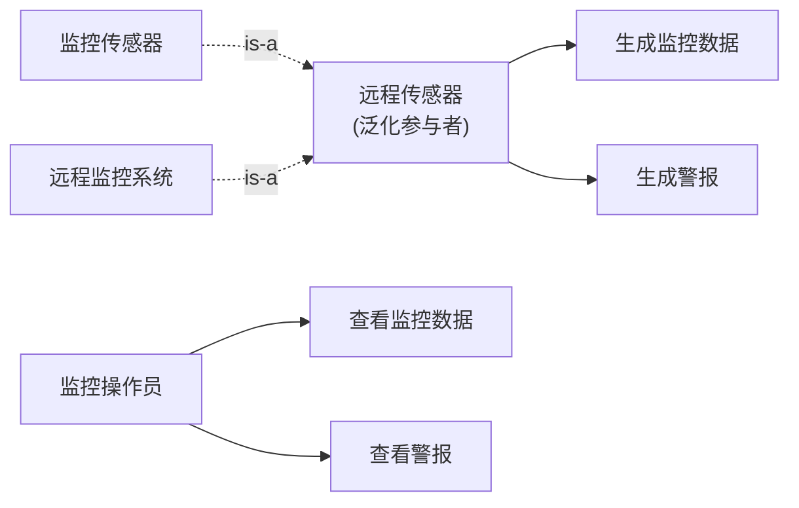
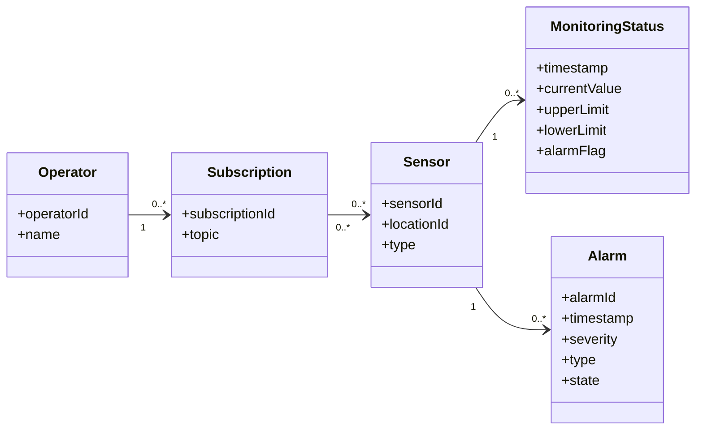
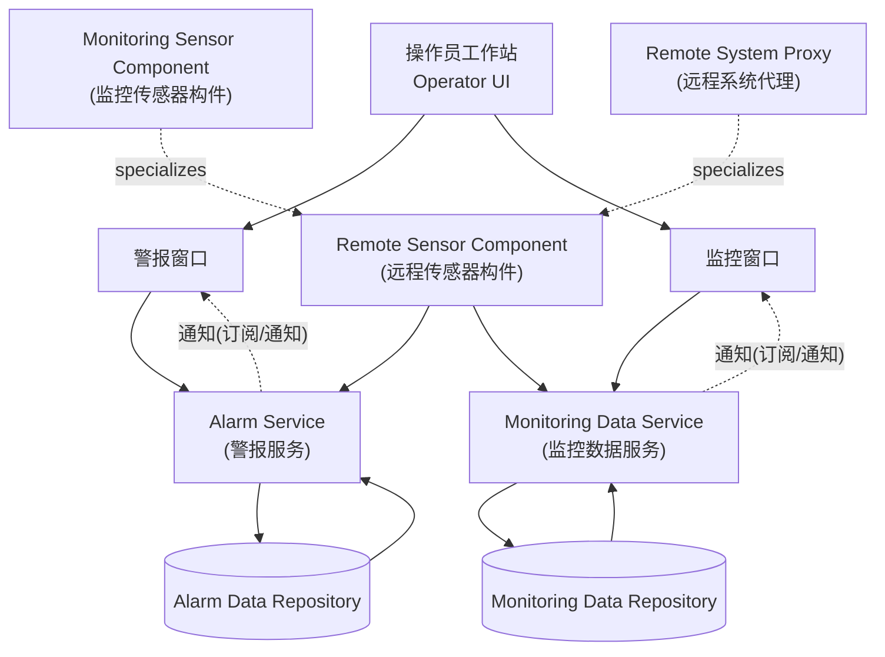
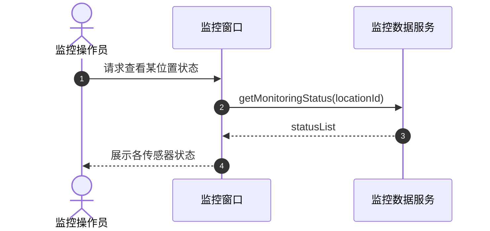
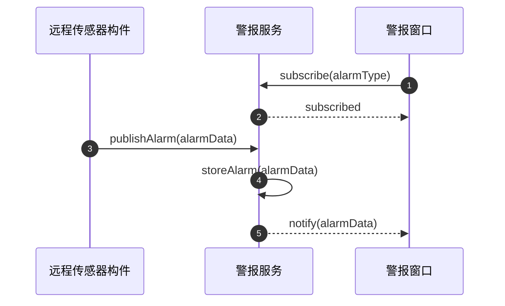
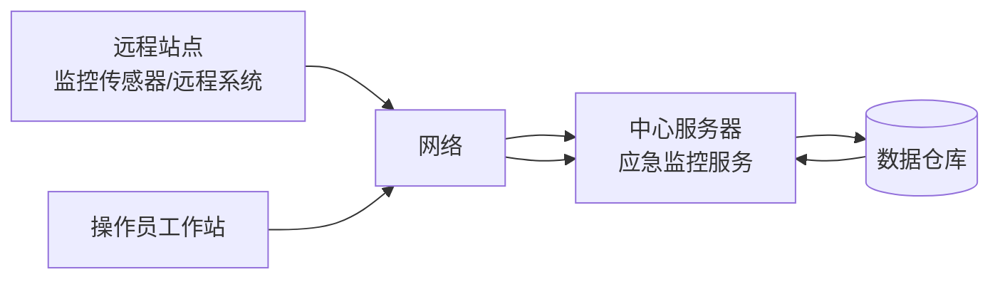

# 《软件架构设计》实验三：基于构件的软件架构设计——应急监控系统（实验报告）

学 院：软件学院  
学 号：2023302855  
姓 名：梁景毓  
专 业：软件工程  
实验时间：2026.5.12  
实验地点：启翔楼  
指导教师：李伟刚  

---

## 一、实验目的及要求

实验名称：基于构件的软件架构设计——应急监控系统

### 1. 实验目的
- 通过实践一个应急监控系统的需求建模、需求分析、架构设计、详细设计的全过程，掌握基于构件的软件架构分析和设计方法。
- 熟练使用 UML 语言及其相关建模方法，能够完成用例模型、静态模型、动态模型，并进行基于构件的分层体系结构设计、分布式构件通信模式与部署设计。

### 2. 实验要求
- 对"应急监控系统"开发用例模型并了解用例编档方法。
- 面向问题域完成静态建模与对象识别。
- 完成动态建模（通信图/时序图），体现构件交互与消息流。
- 完成基于构件的分层体系结构设计、分布式构件通信模式分析与部署设计。
- 按要求命名为：学号+姓名+ex3.md。

## 二、实验设备（环境）及要求

### 1. 硬件环境
- 个人计算机（PC），操作系统：Windows

### 2. 软件环境
- 建模工具：Mermaid
- 文本编辑器：支持Markdown预览的编辑器
- 实验参考资料：基于构件的软件体系结构案例研究"应急监控系统"

## 三、实验内容

- 用例模型：监控操作员与远程传感器（监控传感器/远程系统）相关用例。
- 静态模型：传感器、监控状态、警报、订阅关系等领域对象。
- 动态模型：查看监控数据、查看警报、生成监控数据、生成警报等用例的对象通信。
- 构件/服务化组织：客户端窗口、监控数据服务、警报服务、远程传感器构件。
- 分布式构件通信与部署：多客户端/单服务、订阅/通知等模式与节点部署。

## 四、实验步骤与结果

### 1. 需求理解与参与者识别

#### 1.1 系统概述
应急监控系统采用基于构件的架构，远程传感器持续产生监控数据和警报事件，监控操作员通过客户端窗口查看数据和处理警报。系统支持订阅/通知机制，实现多客户端/单服务的通信模式。

#### 1.2 参与者识别
| 参与者 | 描述 |
|--------|------|
| 监控操作员 | 按需查看监控数据、查看/处理警报，并可订阅/退订通知 |
| 远程传感器（泛化参与者） | 持续产生监控状态与警报事件，具体包括监控传感器与远程监控系统 |

### 2. 用例模型（结果）

#### 2.1 参与者与用例识别

| 参与者 | 用例 | 描述 |
|--------|------|------|
| 远程传感器 | 生成监控数据 | 远程传感器持续产生监控状态数据 |
| 远程传感器 | 生成警报 | 远程传感器产生警报事件 |
| 监控操作员 | 查看监控数据 | 操作员查看某位置传感器状态 |
| 监控操作员 | 查看警报 | 操作员查看和处理警报 |

### 3. 静态模型（结果）

#### 3.1 核心领域对象
| 类名 | 属性 |
|------|------|
| Sensor | sensorId, locationId, type |
| MonitoringStatus | timestamp, currentValue, upperLimit, lowerLimit, alarmFlag |
| Alarm | alarmId, timestamp, severity, type, state |
| Operator | operatorId, name |
| Subscription | subscriptionId, topic |

#### 3.2 类关系说明
- Sensor产生多个MonitoringStatus（1对多）
- Sensor产生多个Alarm（1对多）
- Operator拥有多个Subscription（1对多）
- Subscription关联多个Sensor（多对多）

### 4. 构件/分层架构（结果）

#### 4.1 构件划分
- **客户端侧**：操作员 UI（监控窗口、警报窗口）
- **服务侧**：监控数据服务、警报服务，封装对应数据仓库
- **边界构件**：远程传感器构件（包含监控传感器构件、远程系统代理两个子构件）

### 5. 动态建模（结果）

#### 5.1 查看监控数据（多客户端/单服务）

#### 5.2 生成警报（订阅/通知）

### 6. 部署与通信（结果）

- **远程站点**：监控传感器/远程系统通过网络向中心服务器发送监控数据与警报。
- **操作员工作站**：通过网络访问中心服务并接收通知。
- **中心服务器**：承载监控数据服务与警报服务，并与数据仓库交互。

## 五、分析与讨论

### 1）上下文类图在确定系统的内部类方面的作用是什么？

**答**：
上下文类图把系统视为一个整体，明确系统与外部参与者/外部设备/外部系统的交互边界。通过：
1. 列出外部类（参与者/设备/外部系统）与系统的交互点
2. 推导边界类（UI/适配器/代理）与输入输出通道

可以系统化地确定系统内部需要哪些边界类、控制类与服务类，从而减少遗漏并保证职责划分清晰。

### 2）应急监控系统构件间的消息通信涉及到哪些消息通信模式？举例说明。

**答**：
1. **多客户端/单服务**：多个操作员窗口实例请求同一个监控数据服务/警报服务（查看列表、查询状态）。
2. **订阅/通知**：操作员窗口订阅特定类型警报或状态变化，服务在新事件到达时主动通知订阅者。
3. **发布/接收**：远程传感器构件持续发布监控数据/警报，服务接收并持久化，再触发后续通知。

### 3）供给端口和请求端口有什么对应关系？在基于构件的软件架构设计中如何表示各构件的端口之间的关系？

**答**：
1. **供给端口（Provided Port）**提供服务接口；**请求端口（Required Port）**声明对外部服务的依赖接口。
2. 二者通过"接口契约"对应：请求端口所需接口应由某个供给端口提供（类型匹配/协议匹配）。
3. **表示方式**：在构件图中用端口/接口符号标注 provided/required，并用连接器（binding/connector）把 required 端口连接到提供该接口的 provided 端口，体现依赖与运行时连接关系。

## 六、教师评语

（此处留空）

成绩：______
