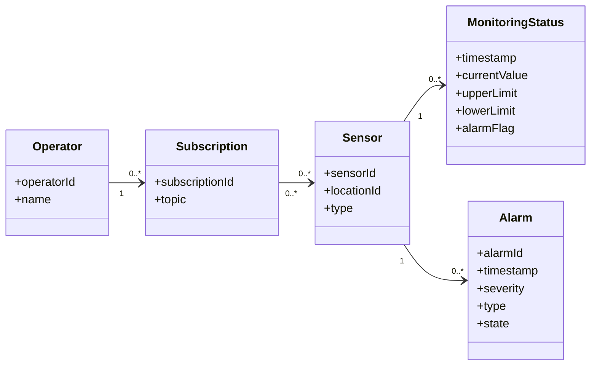
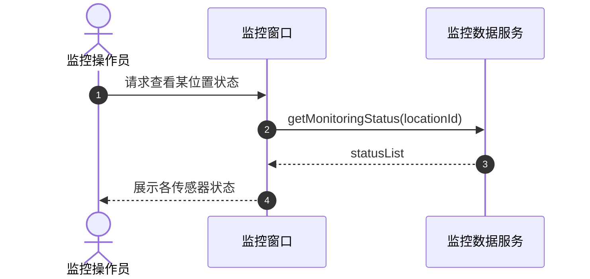
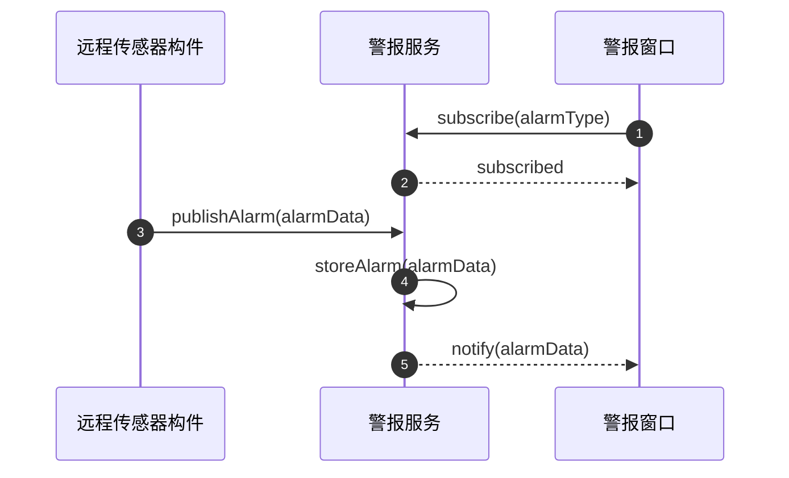
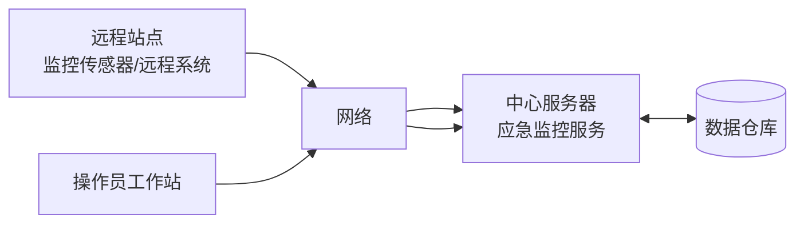

# 实验三（应急监控系统，基于构件）UML模型（Mermaid）

## 1. 用例图（flowchart 表示）
```mermaid
flowchart LR
Operator[监控操作员]
RemoteSensor[远程传感器\n(泛化参与者)]
MonitoringSensor[监控传感器]
RemoteSystem[远程监控系统]

RemoteSensor --> U1[生成监控数据]
RemoteSensor --> U2[生成警报]
Operator --> U3[查看监控数据]
Operator --> U4[查看警报]

MonitoringSensor -. is-a .-> RemoteSensor
RemoteSystem -. is-a .-> RemoteSensor
```

## 2. 领域静态模型（核心实体类）


## 3. 构件/分层架构视图（客户端/服务 + 通信模式）
```mermaid
flowchart TB
OpUI[操作员工作站\nOperator UI]
AlarmWin[警报窗口]
MonWin[监控窗口]

AlarmSvc[Alarm Service\n(警报服务)]
MonSvc[Monitoring Data Service\n(监控数据服务)]

SensorComp[Remote Sensor Component\n(远程传感器构件)]
MSensorComp[Monitoring Sensor Component\n(监控传感器构件)]
RemoteProxy[Remote System Proxy\n(远程系统代理)]

AlarmRepo[(Alarm Data Repository)]
MonRepo[(Monitoring Data Repository)]

OpUI --> AlarmWin
OpUI --> MonWin

AlarmWin --> AlarmSvc
MonWin --> MonSvc

SensorComp --> AlarmSvc
SensorComp --> MonSvc

MSensorComp -. specializes .-> SensorComp
RemoteProxy -. specializes .-> SensorComp

AlarmSvc <--> AlarmRepo
MonSvc <--> MonRepo

AlarmSvc -. 通知(订阅/通知) .-> AlarmWin
MonSvc -. 通知(订阅/通知) .-> MonWin
```

## 4. 通信/时序：查看监控数据（多客户端/单服务）


## 5. 通信/时序：生成警报（订阅/通知）


## 6. 部署/通信视图（最简兼容画法）


