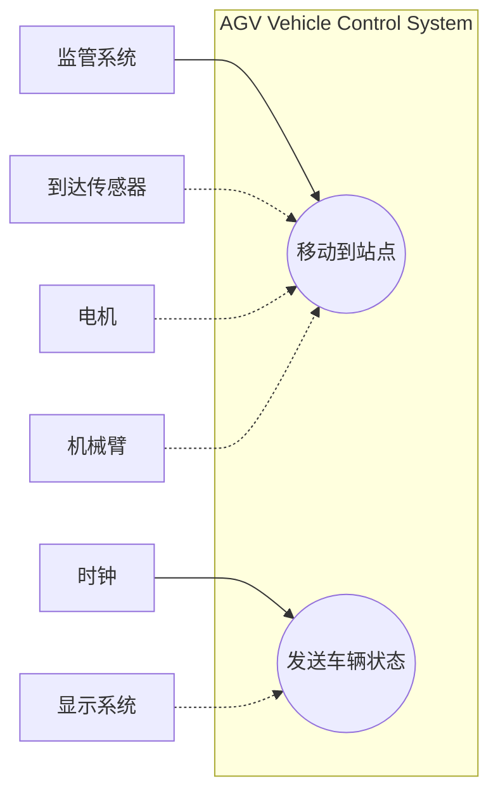
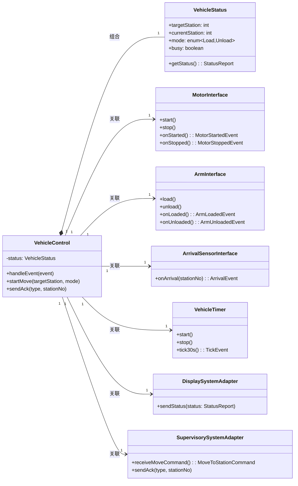
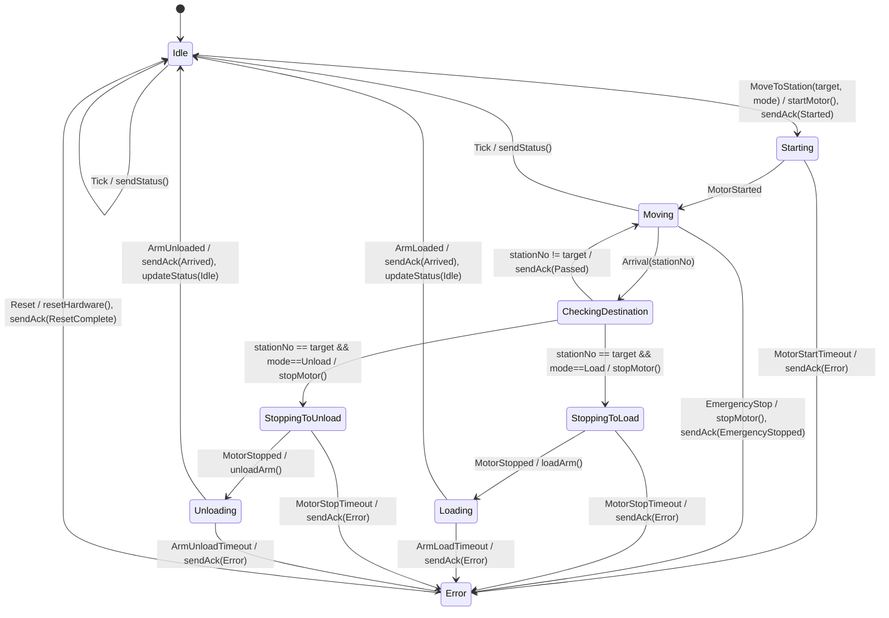
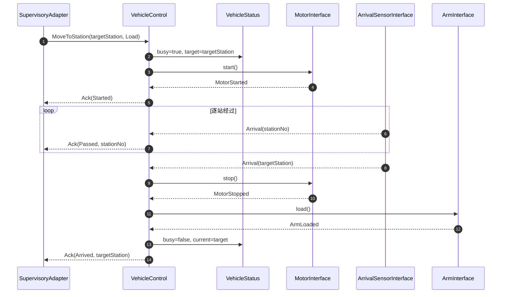
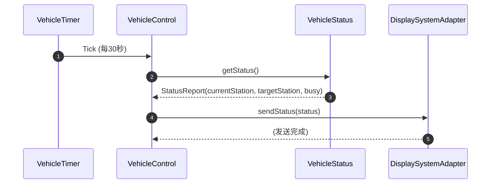
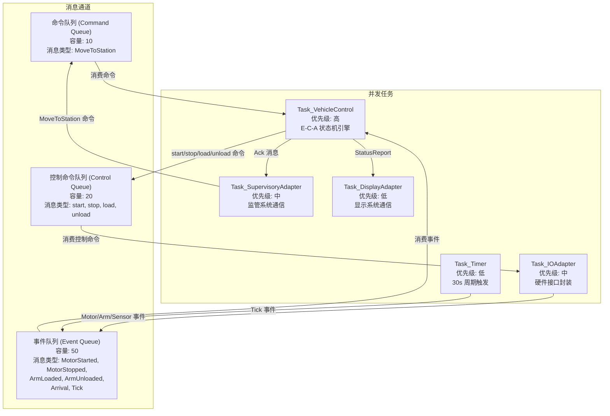
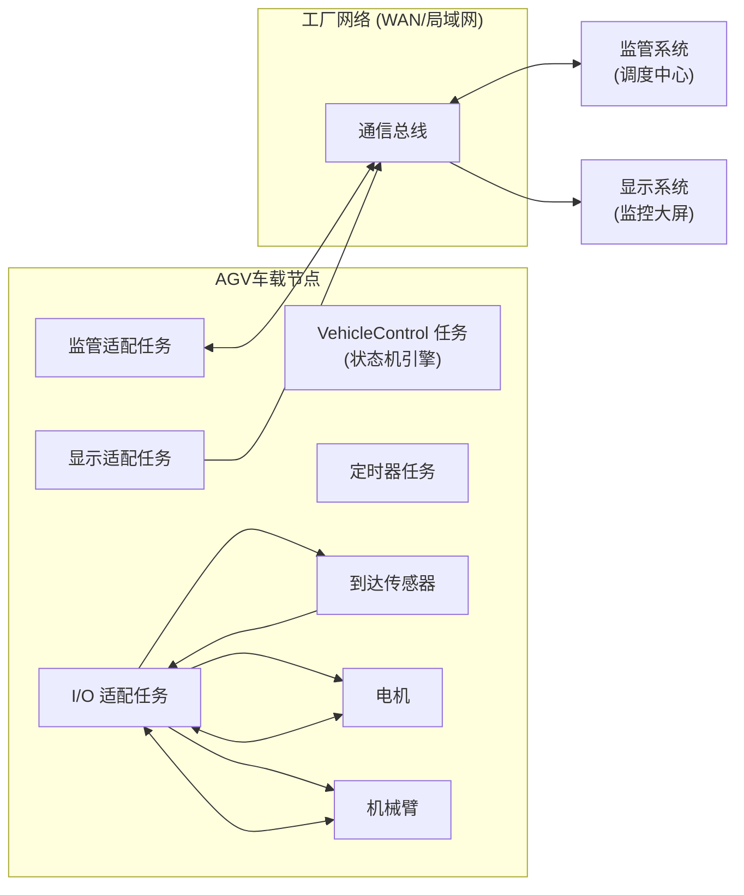
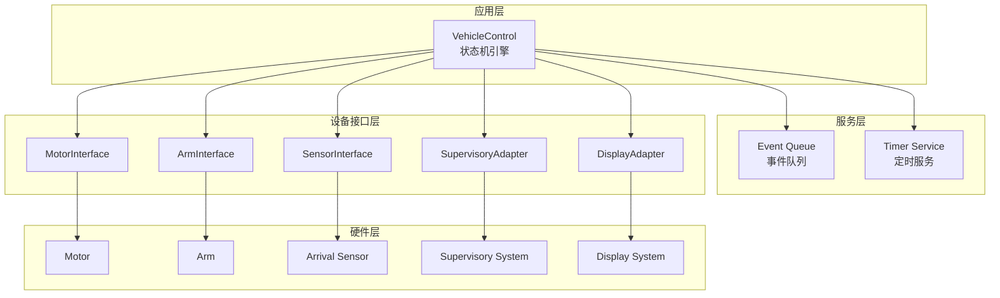

# 《软件架构设计》实验四：实时软件架构设计——自动引导车辆系统（实验报告）

学 院：软件学院  
学 号：2023302855  
姓 名：梁景毓  
专 业：软件工程  
实验时间：2026年5月12日  
实验地点：启翔楼  
指导教师：李伟刚  

---

## 一、实验目的及要求

实验名称：实时软件架构设计——自动引导车辆系统（AGV）

### 1. 实验目的
- 通过实践一个实时系统"自动引导车辆系统"的需求建模、需求分析、架构设计、详细设计的全过程，掌握并发与实时软件架构分析和设计方法。
- 熟练使用 UML 语言及其相关建模方法，重点掌握动态状态机建模方法，并能进行并发软件架构设计、并发通信模式理解以及并发任务与任务接口设计。

### 2. 实验要求
- 对"自动引导车辆系统"开发用例模型并详细了解用例编档方法。
- 面向问题域的静态建模，识别系统中的各类对象。
- 动态建模：重点为状态相关控制对象建立状态机模型，并用交互图说明协作。
- 并发架构设计：识别并发任务、任务接口与消息通道，说明通信模式。

## 二、实验设备（环境）及要求

### 1. 硬件环境
- 个人计算机（PC），操作系统：Windows

### 2. 软件环境
- 建模工具：Mermaid（Markdown 内嵌 UML 图语法，替代 StarUML 绘图）
- 文本编辑器：支持 Markdown 预览的编辑器
- 实验参考资料：实时软件体系结构案例研究"自动引导车辆系统（AGV）"（教材第24章）

## 三、实验内容

本实验围绕自动引导车辆系统（AGV）展开，按以下步骤逐步完成建模与设计：

1. **参与者与用例识别**：识别系统边界内外的参与者，建立用例模型并进行用例编档。
2. **静态建模与对象组织**：面向问题域识别关键抽象（控制对象、实体对象、接口对象、适配器对象等），建立类图。
3. **动态状态机建模**：为状态相关控制对象 VehicleControl 建立有限状态机，刻画状态、事件、守卫条件与动作。
4. **交互图建模**：用时序图展示关键用例中对象之间的消息交互顺序。
5. **并发架构设计**：将系统划分为并发任务，设计任务接口与消息队列。
6. **通信模式分析**：识别并说明系统中涉及的各类消息通信模式。
7. **部署视图**：描述系统在物理节点上的部署拓扑与通信链路。

### 实验原理

本实验的理论基础包括以下几个方面：

**（1）实时系统与并发架构。** 自动引导车辆系统（AGV）是典型的实时嵌入式系统，需同时处理多种异步事件（传感器信号、定时器中断、外部命令等）。实时软件架构设计的核心在于将系统分解为多个并发任务，通过任务优先级调度和消息队列解耦来满足时间约束。

**（2）E-C-A 模式。** E-C-A（Event-Condition-Action）是实时系统中状态相关控制对象的经典设计范式。事件（Event）由外部输入或内部定时器产生；条件（Condition）基于当前状态和事件参数进行守卫判定；动作（Action）执行状态转换并触发输出。该模式天然支持异步事件驱动，适合 AGV 控制器的状态机实现。

**（3）有限状态机（FSM）。** VehicleControl 作为核心控制对象，其行为由有限状态机建模。状态机覆盖空闲、启动、移动、到达判定、装载/卸载等完整生命周期，并包含超时处理路径以应对硬件故障。

**（4）并发任务通信模式。** 实时系统采用消息队列解耦生产者与消费者。本系统涉及四种通信模式：事件驱动/异步消息、生产者-消费者/消息队列、请求-响应、周期定时触发。各模式在时间耦合度和方向性上各有不同，适用于不同场景。

## 四、实验步骤与结果

### 1. 参与者与用例

#### 1.1 系统概述

自动引导车辆系统（AGV）是一个实时并发系统。车辆沿固定轨道在多个站点之间运行，可执行装载（Load）或卸载（Unload）任务。车辆控制器（VehicleControl）作为核心**状态相关控制对象**，通过 E-C-A（Event-Condition-Action）机制协调电机、机械臂、传感器等外设，并与监管系统和显示系统通信。

系统边界为 AGV 车载控制器软件。监管系统、显示系统属于系统外部；传感器、电机、机械臂属于受控硬件设备，通过接口对象与控制器交互。

#### 1.2 参与者识别

| 参与者 | 类型 | 描述 |
|--------|------|------|
| 监管系统（Supervisory System） | 外部系统 | 发起"移动到站点"命令，接收 Started / Passed / Arrived 确认信息 |
| 到达传感器（Arrival Sensor） | 硬件设备 | 事件驱动输入，车辆经过站点时触发 Arrival 事件 |
| 电机（Motor） | 硬件设备 | 提供启动/停止驱动，反馈 MotorStarted / MotorStopped 状态 |
| 机械臂（Arm） | 硬件设备 | 执行装载/卸载操作，反馈 ArmLoaded / ArmUnloaded 完成信号 |
| 时钟（Clock） | 内部定时器 | 周期触发（每30秒），驱动"发送车辆状态"用例 |
| 显示系统（Display System） | 外部系统 | 接收并显示车辆当前位置与忙闲状态 |



> **图例说明：** 实线箭头表示**主要参与者**，虚线箭头表示**次要参与者**。方框边界为系统边界（AGV 车载控制器软件），监管系统、显示系统位于系统外部；传感器、电机、机械臂为受控硬件设备。

#### 1.3 用例编档

##### 用例 UC1：移动到站点（MoveToStation）

| 项目 | 内容 |
|------|------|
| **用例名称** | 移动到站点 |
| **用例编号** | UC1 |
| **主要参与者** | 监管系统 |
| **次要参与者** | 到达传感器、电机、机械臂 |
| **前置条件** | 车辆处于 Idle 状态，监管系统已建立通信连接 |
| **后置条件** | 车辆到达目标站点并完成装载或卸载操作，向监管系统发送 Arrived 确认，车辆回到 Idle 状态 |
| **触发事件** | 监管系统发送 MoveToStation(targetStation, mode) 命令 |

**基本流（Basic Flow）：**
1. 监管系统向 AGV 控制器发送 MoveToStation(targetStation, mode) 命令。
2. VehicleControl 接收命令，调用 MotorInterface.start() 启动电机。
3. 电机返回 MotorStarted 确认。
4. VehicleControl 向监管系统发送 Ack(Started) 确认。
5. 车辆沿轨道运行，依次经过中间站点。
6. 每经过一个站点，到达传感器触发 Arrival(stationNo) 事件。
7. VehicleControl 判断当前站点是否为目标站点：
   - 若非目标站点：向监管系统发送 Ack(Passed, stationNo)，车辆继续前进。
   - 若是目标站点：执行步骤 8。
8. VehicleControl 调用 MotorInterface.stop() 停止电机。
9. 电机返回 MotorStopped 确认。
10. 根据 mode 参数执行操作：
    - mode=Load：调用 ArmInterface.load()，机械臂返回 ArmLoaded 确认。
    - mode=Unload：调用 ArmInterface.unload()，机械臂返回 ArmUnloaded 确认。
11. VehicleControl 向监管系统发送 Ack(Arrived, targetStation) 确认。
12. 车辆回到 Idle 状态。

**替代流（Alternative Flows）：**

- **A1 - 车辆忙（Busy）**：若车辆当前不在 Idle 状态，VehicleControl 返回拒绝消息，命令被忽略。
- **A2 - 电机启动失败**：若 MotorStarted 超时未返回，VehicleControl 进入 Error 状态，向监管系统发送 Ack(Error)。
- **A3 - 机械臂操作失败**：若 ArmLoaded/ArmUnloaded 超时未返回，进入 Error 状态并通知监管系统。
- **A4 - 紧急停止（Emergency Stop）**：若监管系统或车载安全开关触发 EmergencyStop 事件，VehicleControl 立即停止电机，进入 Error 状态，向监管系统发送 Ack(EmergencyStopped)。Error 状态下需监管系统发送 Reset 命令方可恢复至 Idle。

##### 用例 UC2：发送车辆状态（SendVehicleStatus）

| 项目 | 内容 |
|------|------|
| **用例名称** | 发送车辆状态 |
| **用例编号** | UC2 |
| **主要参与者** | 时钟（内部定时器） |
| **次要参与者** | 显示系统 |
| **前置条件** | 系统已初始化，定时器已启动 |
| **后置条件** | 显示系统收到最新的车辆状态信息 |
| **触发事件** | 定时器 Tick 事件（每30秒） |

**基本流：**
1. VehicleTimer 每30秒产生一个 Tick 事件。
2. VehicleControl 接收 Tick 事件，读取 VehicleStatus（当前站点、目标站点、忙闲状态）。
3. VehicleControl 通过 DisplaySystemAdapter.sendStatus(status) 向显示系统发送状态。
4. 显示系统接收并更新显示。

**替代流：**
- **A1 - 忙碌时延迟**：若车辆正处于移动或操作状态，仍可响应 Tick 事件发送当前状态（状态上报不阻塞控制流程）。

### 2. 静态模型与对象组织

#### 2.1 对象识别策略

面向问题域，按 GROOMS 方法将系统对象分为四类：

| 对象类别 | 对象 | 职责 |
|----------|------|------|
| **状态相关控制对象** | VehicleControl | 封装状态机，用 E-C-A 机制协调所有外设与外部系统交互 |
| **实体对象** | VehicleStatus | 保存目标站点、当前站点、运行模式、忙闲状态等持久数据 |
| **接口对象** | MotorInterface, ArmInterface, ArrivalSensorInterface, VehicleTimer | 封装硬件设备驱动和系统定时器接口，将异步信号转化为软件事件 |
| **适配器对象** | SupervisorySystemAdapter, DisplaySystemAdapter | 封装外部系统通信协议，进行消息格式转换 |

#### 2.2 类图



> **注：** VehicleControl 的核心公开接口仅展示 `handleEvent()`、`startMove()`、`sendAck()` 三个方法。`onArrival()`、`onMotorStarted()`、`onMotorStopped()`、`onArmLoaded()`、`onArmUnloaded()`、`onTick()`、`checkDestination()` 等内部事件处理方法详见 3.1 节状态机模型。

**关系说明：**
- VehicleControl 与 VehicleStatus 为**组合关系**：VehicleStatus 由 VehicleControl 创建和管理，生命周期一致。
- VehicleControl 与其他对象为**单向关联**：VehicleControl 持有所有接口和适配器的引用，负责统一调度。
- 每个接口/适配器对象的多重性为 **1**，因为 AGV 系统只有一个电机、一个机械臂等。VehicleTimer 也被设计为 **1**，因为 UC2（发送车辆状态）依赖其 Tick 事件驱动。

### 3. 动态状态机建模

#### 3.1 VehicleControl 状态机

VehicleControl 作为状态相关控制对象，其状态机覆盖以下状态和转换：

**状态定义：**

| 状态 | 含义 |
|------|------|
| **Idle** | 空闲，等待监管系统的 MoveToStation 命令 |
| **Starting** | 已发出电机启动命令，等待 MotorStarted 反馈 |
| **Moving** | 车辆运行中，等待到达传感器事件 |
| **CheckingDestination** | 收到 Arrival 事件，判断是否为目标站点 |
| **StoppingToLoad** | 目标站点到达（装载模式），等待电机停止 |
| **Loading** | 电机已停止，执行装载操作，等待 ArmLoaded |
| **StoppingToUnload** | 目标站点到达（卸载模式），等待电机停止 |
| **Unloading** | 电机已停止，执行卸载操作，等待 ArmUnloaded |
| **Error** | 异常状态，等待监管系统发送 Reset 命令恢复至 Idle |

> **注：** Tick（定时器）事件不触发状态转换——它在 Idle 和 Moving 状态中以**内部转换（Internal Transition）** 方式处理，不改变当前状态。这体现了实时系统中周期性任务与事件驱动任务的并行特性。EmergencyStop 可在 Moving 状态下触发，使车辆立即进入 Error 状态。



**说明：** Tick 事件在 Idle 和 Moving 状态下均可被处理（不中断主流程），体现了实时系统中周期性任务与事件驱动任务的并行特性。

#### 3.2 交互图：移动到站点（装载模式·正常流程）



> **注：** 此图仅展示正常流程。异常流程（电机启动超时、装载超时、紧急停止等）均在状态机模型（3.1节）中完整定义，由 VehicleControl 的 E-C-A 机制统一处理。

#### 3.3 交互图：周期状态上报



### 4. 并发架构与任务接口

#### 4.1 并发任务划分

根据实时系统设计方法，将系统划分为以下并发任务（每个任务是一个独立的执行线程/进程）：

| 任务名称 | 类型 | 优先级 | 触发方式 | 职责 |
|----------|------|--------|----------|------|
| **Task_VehicleControl** | 控制任务 | 高 | 事件驱动（事件队列） | 运行 VehicleControl 状态机，消费事件队列中的事件，执行 E-C-A 处理 |
| **Task_IOAdapter** | I/O 任务 | 中 | 硬件中断 / 异步回调 | 封装电机、机械臂、到达传感器的硬件交互，将硬件信号转化为事件消息 |
| **Task_Timer** | 计时器任务 | 低 | 周期定时（30秒） | 周期产生 Tick 事件，投递到事件队列 |
| **Task_SupervisoryAdapter** | 通信任务 | 中 | 消息到达 / 命令响应 | 接收监管系统命令投递到命令队列，转发 VehicleControl 的 Ack 消息 |
| **Task_DisplayAdapter** | 通信任务 | 低 | 被 VehicleControl 调用 | 将状态报告发送到显示系统 |

#### 4.2 消息通道与队列



> **队列容量设计依据：** 命令队列容量 10 满足监管系统批量下发指令的缓冲需求；事件队列容量 50 考虑传感器高频触发（每经一个站点触发一次 Arrival）与 Tick 事件的叠加；控制命令队列容量 20 考虑 VehicleControl 向 I/O 适配器发出的低频控制指令（start/stop/load/unload）的缓冲。

#### 4.3 任务接口设计

**命令队列接口：**
```
interface CommandQueue {
    enqueue(cmd: MoveToStationCommand): void
    dequeue(): MoveToStationCommand    // 阻塞等待
    tryDequeue(): MoveToStationCommand? // 非阻塞
}
```

**事件队列接口：**
```
interface EventQueue {
    enqueue(event: Event): void
    dequeue(): Event                   // 阻塞等待
    tryDequeue(): Event?               // 非阻塞
}

// Event 类型层次
Event
├── MotorStartedEvent
├── MotorStoppedEvent
├── ArmLoadedEvent
├── ArmUnloadedEvent
├── ArrivalEvent { stationNo: int }
└── TickEvent
```

**任务间同步机制：**
- 三类消息队列（命令队列、事件队列、控制命令队列）均采用**生产者-消费者模式**，使用互斥锁 + 条件变量保证线程安全。
- VehicleControl 作为命令和事件的消费者，阻塞等待外部命令和硬件事件到来（事件驱动）。
- Task_IOAdapter 同时作为事件队列的生产者（将硬件信号转化为事件投递）和控制命令队列的消费者（接收 VehicleControl 的 start/stop/load/unload 命令并执行）。统一使用消息队列解耦，避免直接函数调用引入的时序耦合。

### 5. 部署视图



**部署说明：**
- VehicleControl、I/O 适配器、定时器、通信适配器均部署在 AGV 车载控制器上（单节点部署）。
- 车载控制器通过工厂网络（以太网/WiFi）与监管系统和显示系统通信。
- 传感器、电机、机械臂通过本地 I/O 总线（CAN/RS-485）与车载控制器连接。

### 6. 系统分层架构

以下分层架构图展示 AGV 系统从应用层到硬件层的纵向结构，帮助理解各层之间的依赖关系与职责边界：



**分层说明：**

| 层级 | 职责 | 关键设计原则 |
|------|------|-------------|
| **应用层** | 运行 VehicleControl 状态机，实现 E-C-A 事件处理逻辑 | 唯一的状态相关控制对象，不直接访问硬件 |
| **服务层** | 提供事件队列和定时服务，解耦事件的生产与消费 | 生产者-消费者模式，互斥锁 + 条件变量保证线程安全 |
| **设备接口层** | 封装硬件驱动和外部系统通信协议，将物理信号转化为软件事件 | 接口对象与适配器对象隔离硬件细节 |
| **硬件层** | 物理设备（电机、机械臂、传感器）和外部系统 | 通过 I/O 总线或网络与设备接口层通信 |

> **设计优势：** 分层架构使得应用层（VehicleControl）完全不依赖硬件实现细节。更换电机型号或通信协议时，只需修改设备接口层，应用层逻辑无需变更。

### 7. 实验过程总结

本次实验按以下流程逐步完成建模与设计：

1. **需求分析**：阅读教材第24章 AGV 案例，理解系统需求，识别参与者和用例边界。
2. **用例建模**：识别 6 个参与者和 2 个用例，使用 Mermaid flowchart 绘制用例图，并按模板进行用例编档。
3. **静态建模**：按 GROOMS 方法将对象分为控制对象、实体对象、接口对象、适配器对象四类，使用 Mermaid classDiagram 绘制类图，标注关联关系和多重性。
4. **状态机建模**：分析 VehicleControl 的生命周期，识别 Idle、Starting、Moving、CheckingDestination、StoppingToLoad/Unload、Loading/Unloading 等状态，使用 Mermaid stateDiagram 绘制状态机，并补充超时处理路径。
5. **交互建模**：针对"移动到站点"和"周期状态上报"两个场景，使用 Mermaid sequenceDiagram 绘制时序图，展示对象间的消息交互序列。
6. **并发架构设计**：将系统划分为 5 个并发任务，设计命令队列和事件队列的消息通道，使用 Mermaid flowchart 绘制并发架构图。
7. **分层架构建模**：绘制系统分层架构图（应用层→服务层→设备接口层→硬件层），说明各层职责与设计原则。
8. **部署建模**：描述车载节点上的任务部署和外部通信链路。
9. **分析讨论**：针对思考题进行深入分析，总结通信模式与实时性保障机制。

#### 实验中遇到的问题与解决

- **Mermaid 用例图表达限制**：Mermaid 原生不支持 UML 用例图语法，采用 flowchart LR 模拟用例图关系，需注意在文字说明中补充系统边界和参与者类型的描述。
- **状态机设计取舍**：VehicleControl 的 8 个状态覆盖了正常运行路径和超时处理，但为简洁起见未将 SendingStatus（周期状态上报）设计为独立状态——Tick 事件在 Idle 和 Moving 状态内以内部转换方式处理，体现了实时系统中周期性任务与事件驱动任务的并行特性。
- **并发通信模式选择**：Task_IOAdapter 和 VehicleControl 之间的直接命令接口设计，在实际部署中可通过共享内存或消息队列实现，此处为简化架构图采用直接关联线表示。

## 五、分析与讨论

### （1）E-C-A 机制在集成通信图中的实现

**答**：

E-C-A（Event-Condition-Action）是实时系统中状态相关控制对象的核心执行机制，在本系统的集成通信图中具体实现如下：

**事件（Event）的产生与传递：**
- 外部输入统一封装为事件对象，通过消息队列异步传递给 VehicleControl。
- I/O 适配任务将硬件信号（传感器到达、电机反馈、机械臂反馈）转化为类型化事件，投递到事件队列。
- 定时器任务将 Tick 事件投递到同一事件队列。
- 监管适配任务将 MoveToStation 命令投递到命令队列。
- VehicleControl 通过阻塞式 dequeue() 统一消费所有事件和命令。

**条件（Condition）的判定：**
- VehicleControl 在接收到事件后，基于**当前状态**和**事件类型**进行守卫条件判定。
- 例如：收到 Arrival 事件时，检查 `stationNo == targetStation`，结合当前状态（Moving）决定进入哪个分支。
- 这种"状态 + 事件 + 守卫条件"的三元组判定是有限状态机的标准模式。

**动作（Action）的执行：**
- 判定完成后，VehicleControl 通过接口对象向外发出控制命令（start/stop/load/unload）。
- 同时向外部系统发送确认消息（Ack）或状态报告。
- 更新 VehicleStatus 实体对象的状态数据。

**集成通信的关键设计：**
- VehicleControl 作为**中心协调者**（Mediator），所有其他对象只与它通信，彼此之间无直接依赖。
- 这种星型拓扑简化了通信协议，但要求事件队列具有足够的吞吐量以避免瓶颈。
- E-C-A 机制天然支持并发：多个生产者可同时向队列投递事件，VehicleControl 串行消费保证状态一致性。

### （2）并发实时系统中的消息通信模式

**答**：

本系统涉及以下四种主要的消息通信模式：

**（1）事件驱动 / 异步消息（Event-Driven / Asynchronous Message）**

最基础的通信模式。发送方发出消息后不等待接收方处理，立即返回继续执行。

- **本系统实例**：到达传感器产生 Arrival(stationNo) 事件，通过 I/O 适配任务投递到事件队列后立即返回。传感器不关心 VehicleControl 何时处理该事件。
- **特点**：解耦发送方和接收方的时间依赖，适合实时系统中硬件信号的异步上报。

**（2）生产者-消费者 / 消息队列（Producer-Consumer / Message Queue）**

多个生产者向共享队列投递消息，一个或多个消费者从队列中取出处理。队列作为缓冲区解耦生产速率和消费速率。

- **本系统实例**：I/O 适配任务（生产者）和定时器任务（生产者）分别将事件投递到事件队列；VehicleControl（消费者）从队列中取出事件进行 E-C-A 处理。
- **特点**：支持多生产者单消费者的并发模型；队列容量可配置，支持流量控制。

**（3）请求-响应（Request-Response）**

发送方发出请求后等待接收方的响应消息，通常用于需要确认的交互。

- **本系统实例**：VehicleControl 向监管系统发送 Ack(Started) / Ack(Passed) / Ack(Arrived) 确认消息，作为对 MoveToStation 命令的响应。在任务层面，VehicleControl 向 I/O 适配任务发出 start() 命令，等待 MotorStarted 异步回调（注意：虽然物理上是异步的，但逻辑上构成了请求-响应语义）。
- **特点**：提供交互确认，适合需要可靠通信的场景。

**（4）周期定时触发（Periodic Timer / Cyclic Trigger）**

定时器按固定时间间隔产生事件，触发周期性操作。这是实时系统的典型特征。

- **本系统实例**：VehicleTimer 每 30 秒产生一个 Tick 事件，触发 VehicleControl 读取 VehicleStatus 并通过 DisplaySystemAdapter 向显示系统发送状态报告。
- **特点**：保证周期性任务的规律执行；在实时系统中，定时器的精度和抖动直接影响系统的时间确定性。

**通信模式对比总结：**

| 模式 | 时间耦合 | 方向 | 本系统中的应用场景 |
|------|----------|------|-------------------|
| 事件驱动/异步消息 | 完全解耦 | 单向 | 传感器→VehicleControl |
| 生产者-消费者 | 通过队列解耦 | 单向 | I/O/Timer→事件队列→VehicleControl |
| 请求-响应 | 紧耦合（等待响应） | 双向 | VehicleControl↔监管系统（Ack） |
| 周期定时触发 | 时间驱动 | 单向 | Timer→Tick→VehicleControl→Display |
