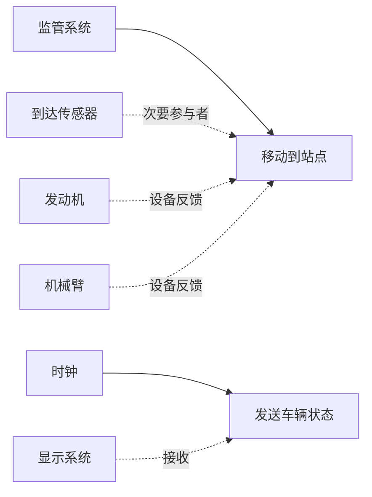
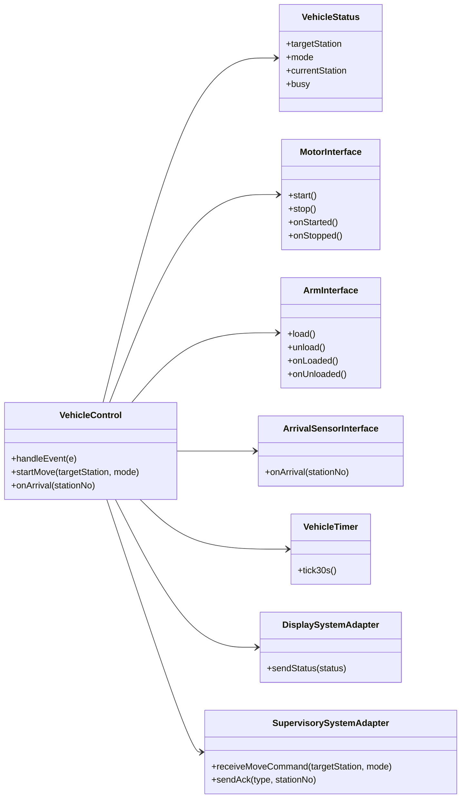
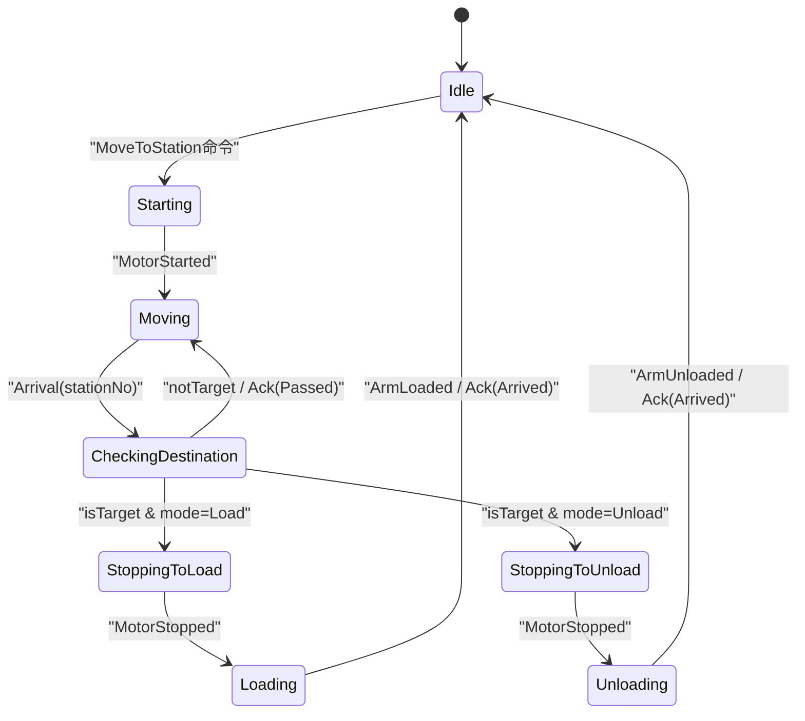
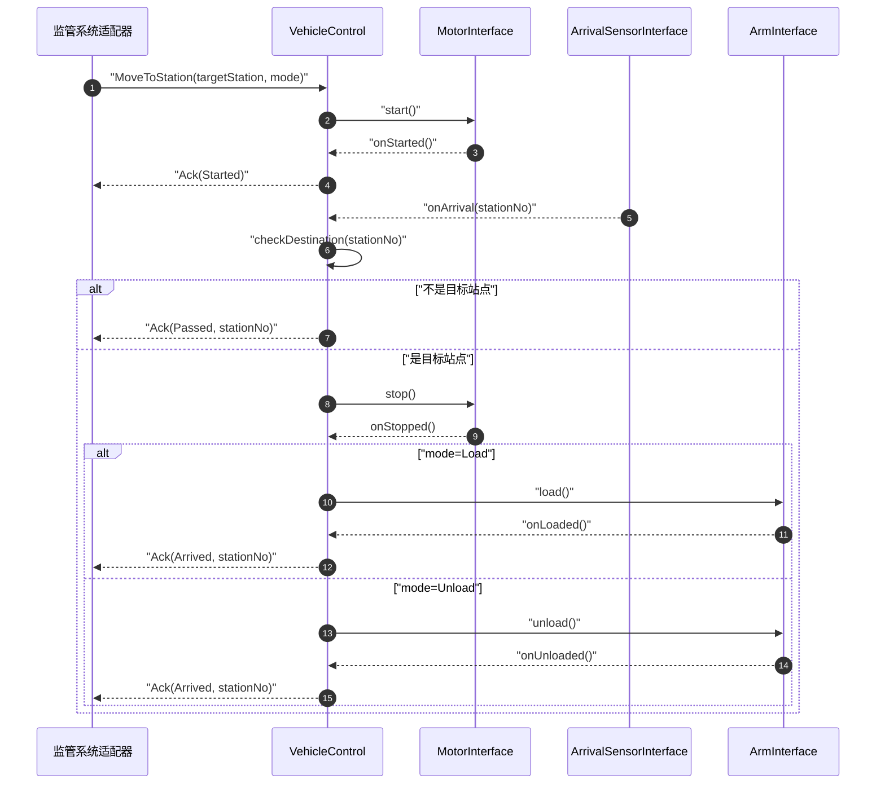
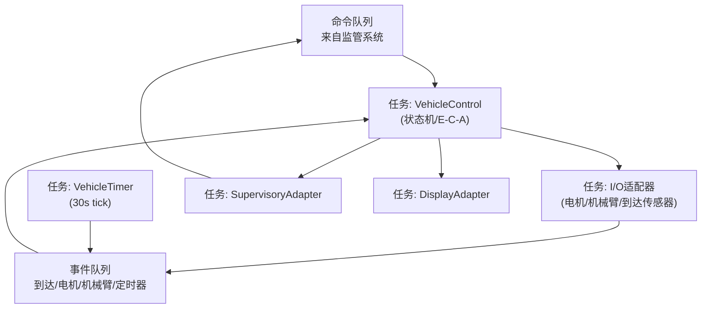
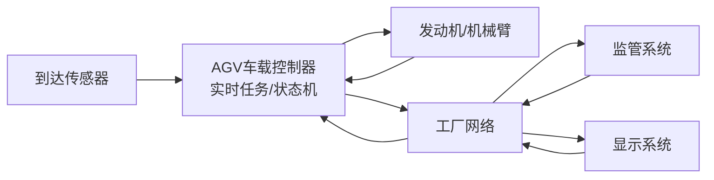

# 《软件架构设计》实验四：实时软件架构设计——自动引导车辆系统（实验报告）

学 院：软件学院  
学 号：2023302855  
姓 名：梁景毓  
专 业：软件工程  
实验时间：2026.5.12  
实验地点：启翔楼  
指导教师：李伟刚  

---

## 一、实验目的及要求

实验名称：实时软件架构设计——自动引导车辆系统（AGV）

### 1. 实验目的
- 通过实践一个实时系统"自动引导车辆系统"的需求建模、需求分析、架构设计、详细设计的全过程，掌握并发与实时软件架构分析和设计方法。
- 熟练使用 UML 语言及其相关建模方法，重点掌握动态状态机建模方法，并能进行并发软件架构设计、并发通信模式理解以及并发任务与任务接口设计。

### 2. 实验要求
- 对"自动引导车辆系统"开发用例模型并了解用例编档方法。
- 进行静态建模与对象组织。
- 动态建模：重点为状态相关控制对象建立状态机模型，并用交互图说明协作。
- 并发架构设计：识别并发任务、任务接口与消息通道，说明通信模式。
- 按要求命名为：学号+姓名+ex4.md。

## 二、实验设备（环境）及要求

### 1. 硬件环境
- 个人计算机（PC），操作系统：Windows

### 2. 软件环境
- 建模工具：Mermaid
- 文本编辑器：支持Markdown预览的编辑器
- 实验参考资料：实时软件体系结构案例研究"自动引导车辆系统（AGV）"

## 三、实验内容

- 用例模型：移动到站点、发送车辆状态。
- 静态模型：车辆控制、车辆状态、计时器、到达传感器接口、电机/机械臂接口、外部系统适配器等。
- 动态状态机建模：VehicleControl 状态机及其事件/动作。
- 并发架构：并发任务划分（控制任务、I/O 任务、计时器任务、外部系统适配器任务）、任务接口与消息队列。
- 通信模式：事件驱动、生产者-消费者、请求-响应、周期定时触发等。

## 四、实验步骤与结果

### 1. 参与者与用例

#### 1.1 系统概述
自动引导车辆系统（AGV）是一个实时并发系统，车辆控制器（VehicleControl）作为核心状态相关控制对象，通过事件驱动机制协调电机、机械臂、传感器等外设，并与监管系统和显示系统通信。

#### 1.2 参与者识别
| 参与者 | 描述 |
|--------|------|
| 监管系统 | 发起"移动到站点"命令并接收确认信息（Started/Passed/Arrived） |
| 到达传感器 | 事件驱动输入，车辆到站触发到达事件 |
| 发动机 | 被动 I/O 设备，提供启动/停止反馈 |
| 机械臂 | 被动 I/O 设备，提供装载/卸载反馈 |
| 时钟 | 周期触发"发送车辆状态"（例如每 30 秒） |
| 显示系统 | 接收车辆位置与忙闲状态 |

### 2. 静态模型与对象组织

#### 2.1 关键对象/类
| 类名 | 职责 |
|------|------|
| VehicleControl | 状态相关控制对象，执行车辆状态机并协调外设与外部系统交互 |
| VehicleStatus | 实体对象，保存目的地、当前站点、忙闲状态等数据 |
| VehicleTimer | 定时触发，用于周期上报状态 |
| ArrivalSensorInterface | 到达传感器接口适配层 |
| MotorInterface | 电机接口，提供启动/停止及反馈 |
| ArmInterface | 机械臂接口，提供装载/卸载及反馈 |
| SupervisorySystemAdapter | 与监管系统通信的适配层 |
| DisplaySystemAdapter | 与显示系统通信的适配层 |

### 3. 动态状态机建模

VehicleControl 的状态机覆盖：
- **Idle**（空闲等待命令）
- **Starting/Moving**（启动与移动）
- **CheckingDestination**（到站后判断是否目标站）
- **StoppingToLoad/Loading**（停止并装载）
- **StoppingToUnload/Unloading**（停止并卸载）

状态迁移由事件触发（命令、到达、发动机反馈、机械臂反馈），并伴随动作（启动/停止、装载/卸载、发送确认信息）。

#### 3.1 移动到站点时序图

### 4. 并发架构与任务接口

划分并发任务并用消息通道连接：
- **控制任务 VehicleControl**：消费"命令队列/事件队列"，运行状态机（E-C-A）。
- **I/O 任务**：将到达传感器、电机、机械臂的异步事件统一封装为事件消息投递到事件队列；并接收控制任务发出的控制命令。
- **计时器任务**：周期产生 tick 事件（30s）投递到事件队列，触发状态上报。
- **外部系统适配任务**：向监管系统发送 Ack；向显示系统发送车辆状态。

### 5. 部署/通信视图

## 五、分析与讨论

### 1）状态相关控制对象封装的状态机使用 E-C-A 机制来执行，在系统的集成通信图中怎样实现状态相关控制对象与其他对象之间的通信协作？

**答**：
E-C-A（Event-Condition-Action）可在集成通信层面这样落地：
1. **事件（E）**：来自外部系统与 I/O 的输入统一封装为事件消息（MoveToStation、Arrival、MotorStarted、MotorStopped、ArmLoaded、Tick 等），通过事件队列投递给 VehicleControl。
2. **条件（C）**：VehicleControl 在接收事件后基于当前状态与 VehicleStatus 进行判定（是否目标站、装载/卸载模式等）。
3. **动作（A）**：VehicleControl 根据判定结果向外发出命令或消息（start/stop motor、load/unload arm、发送 Ack、发送状态上报）。

因此，E-C-A 的"通信协作"表现为：其他对象只需发布事件或响应命令；VehicleControl 作为中心协调者消费事件并驱动状态迁移与动作执行。

### 2）并发实时系统中涉及到哪些消息通信模式？举例说明。

**答**：
1. **事件驱动/异步消息**：到达传感器产生 Arrival 事件；电机产生 Started/Stopped 事件，异步投递到事件队列。
2. **生产者-消费者（队列）**：I/O 任务与计时器任务生产事件；VehicleControl 消费事件并处理。
3. **请求-响应**：VehicleControl 向监管系统发送 Ack 并接收后续命令；向显示系统发送状态信息。
4. **周期触发（定时消息）**：计时器每 30 秒触发一次上报流程（Tick -> sendStatus）。

## 六、教师评语

（此处留空）

成绩：______
