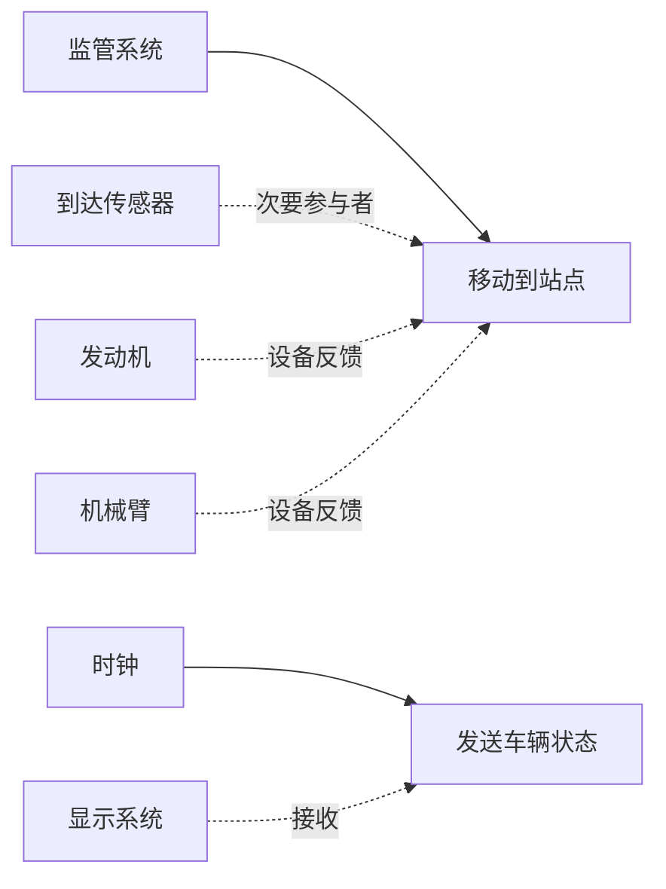
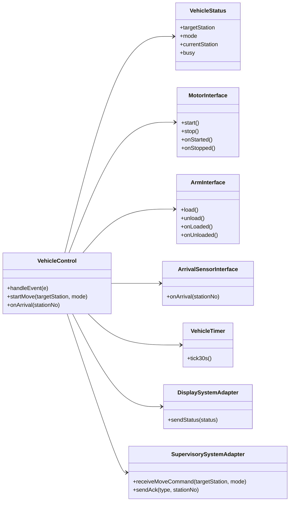
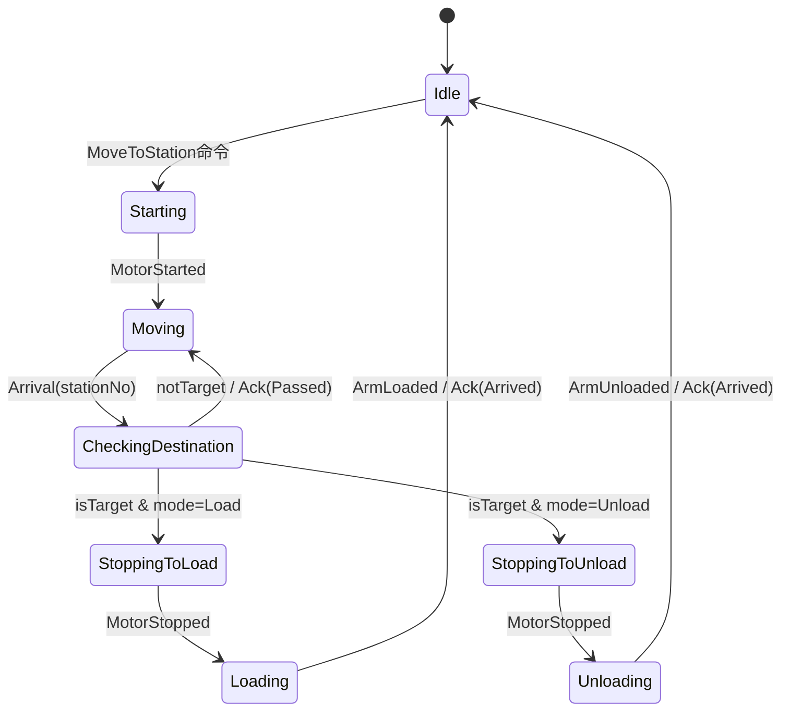
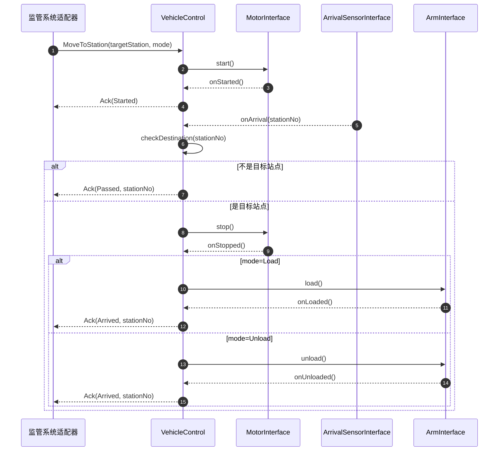
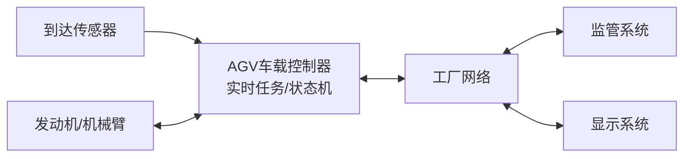

# 实验四（自动引导车辆系统，实时/并发）UML模型（Mermaid）

## 1. 用例图（flowchart 表示）


## 2. 静态模型（关键类与接口）


## 3. 状态图：VehicleControl（简化）


## 4. 时序图：移动到站点（典型场景）


## 5. 并发任务与通信（任务接口/消息通道）
```mermaid
flowchart TB
CmdQ[命令队列\n来自监管系统]
EvtQ[事件队列\n到达/电机/机械臂/定时器]

TaskVC[任务: VehicleControl\n(状态机/E-C-A)]
TaskIO[任务: I/O适配器\n(电机/机械臂/到达传感器)]
TaskTimer[任务: VehicleTimer\n(30s tick)]
TaskSS[任务: SupervisoryAdapter]
TaskDS[任务: DisplayAdapter]

TaskSS --> CmdQ --> TaskVC
TaskIO --> EvtQ --> TaskVC
TaskTimer --> EvtQ

TaskVC --> TaskIO
TaskVC --> TaskSS
TaskVC --> TaskDS
```

## 6. 部署/通信视图（最简兼容画法）


