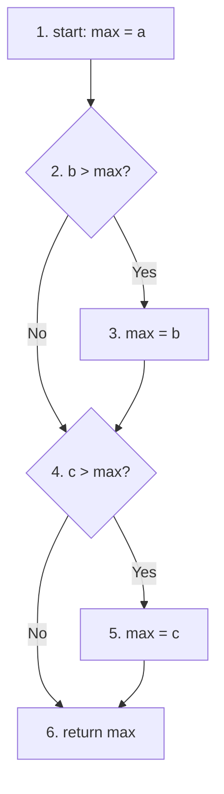

# 软件测试作业解答

## 课后作业一：基本路径测试方法

### 1. 控制流图 (Control Flow Graph)



### 2. 圈复杂度 (Cyclomatic Complexity)

$V(G) = P + 1$，其中 $P$ 是判定节点（谓词）的数量。
*   本题中有 2 个 `if` 语句（判定节点）。
*   $V(G) = 2 + 1 = 3$

**结果：圈复杂度为 3**

### 3. 独立路径 (Independent Paths)

*   **路径 1**: 1 -> 2 -> 4 -> 6 (a 是最大值)
    *   条件: `b > max` 为假, `c > max` 为假
*   **路径 2**: 1 -> 2 -> 3 -> 4 -> 6 (b 是最大值, 且 c 不大于 b)
    *   条件: `b > max` 为真, `c > max` (此时 max 为 b) 为假
*   **路径 3**: 1 -> 2 -> 4 -> 5 -> 6 (a 不是最大值, c 是最大值; 或者 a 原本最大但 c > a)
    *   这里选取: `b > max` 为假, `c > max` 为真 (即 c > a >= b)

### 4. 测试用例设计

| **用例ID** | **路径**  | **输入 (a, b, c)** | **预期输出 (max)** | **覆盖说明** |
| ---------- | --------- | ------------------ | ------------------ | ------------ |
| 1          | 1-2-4-6   | a=5, b=3, c=1      | 5                  | b<=a, c<=a   |
| 2          | 1-2-3-4-6 | a=3, b=5, c=1      | 5                  | b>a, c<=b    |
| 3          | 1-2-4-5-6 | a=5, b=3, c=8      | 8                  | b<=a, c>a    |

---

## 课后作业二：等价类划分方法

### 1. 等价类分析

输入要求：
1.  长度 6-20 字符
2.  必须以字母开头
3.  只能包含字母、数字、下划线
4.  不能包含特殊字符

| 输入条件 | 有效等价类 (Valid) | 无效等价类 (Invalid) |
| :--- | :--- | :--- |
| **长度** | E1: 6 到 20 个字符 | I1: 小于 6 个字符<br>I2: 大于 20 个字符 |
| **开头字符** | E2: 以字母开头 | I3: 以非字母开头 (如数字、下划线) |
| **字符集** | E3: 仅包含字母、数字、下划线 | I4: 包含特殊字符 (如 @, #, 空格等) |

### 2. 测试用例设计

| ID | 输入数据 (用户名) | 预期结果 | 覆盖等价类 | 说明 |
| :--- | :--- | :--- | :--- | :--- |
| **1** | `ValidUser1` | 有效 | E1, E2, E3 | 长度合法(10)，字母开头，字符合法 |
| **2** | `User` | 无效 | I1 | 长度过短 (4) |
| **3** | `ThisIsWayTooLongForAUsername` | 无效 | I2 | 长度过长 (28) |
| **4** | `1UserName` | 无效 | I3 | 以数字开头 |
| **5** | `_User_Name` | 无效 | I3 | 以下划线开头 |
| **6** | `User@Name` | 无效 | I4 | 包含非法字符 (@) |
| **7** | `User Name` | 无效 | I4 | 包含非法字符 (空格) |

---

## 课后作业三：条件覆盖和分支覆盖

### 1. 程序分析

```java
double calculateInsurance(int age, boolean isSmoker, boolean hasDisease) {
    double premium = 1000.0;
    // 分支 1
    if (age > 60 && isSmoker) {
        premium *= 2.0;
    } 
    // 分支 2
    else if (age > 30 && hasDisease) {
        premium *= 1.5;
    } 
    // 分支 3
    else if (age <= 30) {
        premium *= 0.8;
    }
    // (隐式分支 4: 上述条件均不满足)
    return premium;
}
```

**原子条件 (Conditions):**
*   C1: `age > 60`
*   C2: `isSmoker`
*   C3: `age > 30`
*   C4: `hasDisease`
*   C5: `age <= 30` (注: 若 age>60 为假，age>30 为假，则 age<=30 必然为真，这里作为逻辑条件列出)

### 2. 测试用例设计 (满足条件覆盖和分支覆盖)

**目标：**
*   **条件覆盖**: 每个原子条件 (C1-C5) 至少取一次真 (True) 和一次假 (False)。
*   **分支覆盖**: 每个 `if` 和 `else` (包括隐式 else) 路径至少执行一次。

| ID | 输入 (age, isSmoker, hasDisease) | 预期结果 | 覆盖分支 | 覆盖条件值 | 分析 |
| :--- | :--- | :--- | :--- | :--- | :--- |
| **TC1** | `65, true, false` | 2000.0 | 分支 1 | C1=T, C2=T | 满足 `age > 60 && isSmoker` |
| **TC2** | `45, false, true` | 1500.0 | 分支 2 | C1=F, C3=T, C4=T | 满足 `age > 30 && hasDisease` |
| **TC3** | `25, false, false` | 800.0 | 分支 3 | C1=F, C3=F, C5=T | 满足 `age <= 30` |
| **TC4** | `50, false, false` | 1000.0 | 分支 4 (Fall-through) | C1=F, C3=T, C4=F | 所有 if 均为假，执行默认路径 |

**覆盖率检查：**

*   **分支覆盖**:
    *   分支 1: TC1 (Yes)
    *   分支 2: TC2 (Yes)
    *   分支 3: TC3 (Yes)
    *   分支 4: TC4 (Yes)
    *   **结果**: 100% 分支覆盖

*   **条件覆盖**:
    *   C1 (`age > 60`): T(TC1), F(TC2/3/4) - **OK**
    *   C2 (`isSmoker`): T(TC1), F(TC2/3/4) - **OK**
    *   C3 (`age > 30`): T(TC2/4), F(TC3) - **OK**
    *   C4 (`hasDisease`): T(TC2), F(TC1/3/4) - **OK**
    *   C5 (`age <= 30`): T(TC3), F(TC1/2/4) - **OK**
    *   **结果**: 100% 条件覆盖
