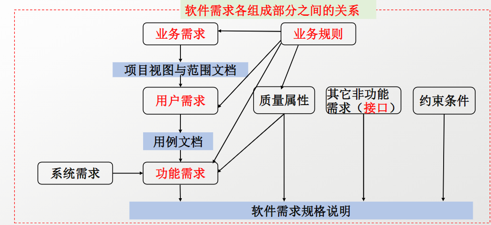
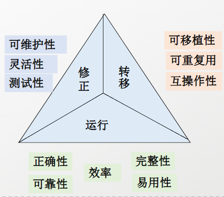
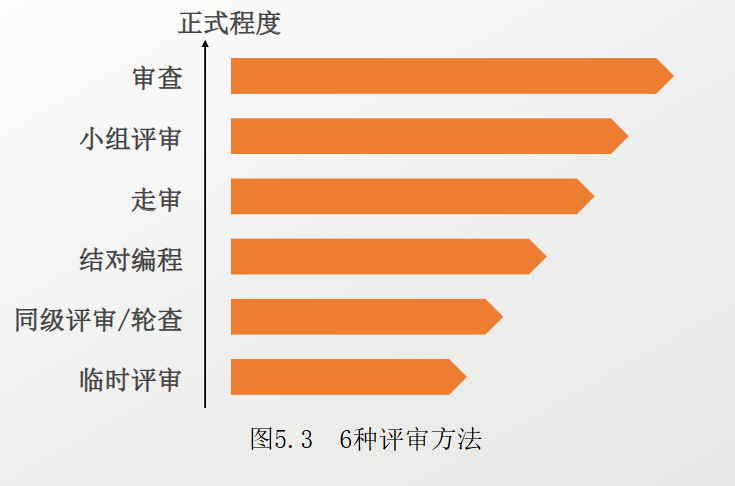
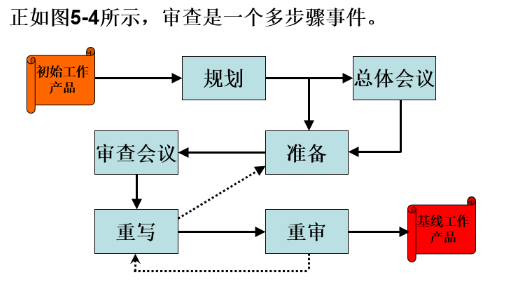
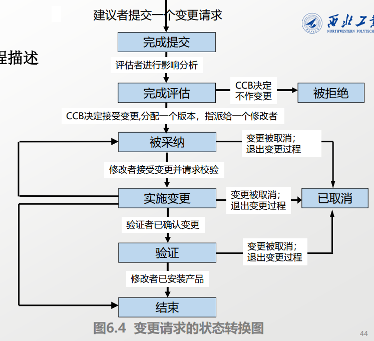

---

mindmap-plugin: markdown

---
# 软需重点内容总结

## 需求获取

### 本课程对软件需求的定义

软件需求是指用户对目标软件系统在**功能、行为、性能、设计约束**等方面的**期望**。通过对应问题及其环境的理解与分析，为问题涉及的信息、功能及系统行为建立模型，将用户需求精确化、完全化，最**终形成需求规格说明**，这一系列的活动即构成软件开发生命周期的需求分析阶段。

需求分析是介于**系统分析**和**软件设计**阶段之间的桥梁

#### 特点：

- 需求分析以系统规格说明和项目规划作为分析活动的基本出发点，并从软件角度对它们进行检查与调整
- 需求规格说明又是软件设计、实现、测试直至维护的主要基础
- 良好的分析活动有助于避免或尽早剔除早期错误，从而提高软件生产效率，降低开发成本，改进软件质量

#### 分类：

- 系统需求工程
- 软件需求工程

### 需求包括的3个层次

1. **业务需求**：反映了组织机构或客户对系统、产品**高层次的目标要求**，它们在项目视图与范围文档中予以说明。(如学生 （教师、实验室）管理、教学管理、成绩管理等业务）
2. **用户需求**：描述的是**用户的目标**，或**用户要求系统必须要完成的任务**。用例文档、场景描述和事件—响应表均用于表达用户需求
3. **功能需求**：定义了**开发人员必须实现的软件功能**，使得用户能利用这些功能完成他们的任务，从而满足了业务需求

### 软件需求的来源

软件需求主要来源于**用户访谈、文档资料、现有系统、市场调查、用户观察以及任务分析等多种渠道**

1. 与潜在用户进行交谈和讨论
2. 把对现有产品或竞争产品的描述写成文档
3. 系统需求规格说明
4. 现有系统的问题报告和改进要求
5. 市场调查和用户问卷调查
6. 观察用户如何工作
7. 用户工作的情景和内容分析
8. 事件和响应

### 项目视图的解决方案

项目视图的解决方案**为系统建立了一个长远的项目视图，它将指明业务目标**。

- **系统的总体解决思路，指明业务目标**（采用什么方式解决问题）
- **产品的主要功能或特性概述**
- **系统的边界和范围**（做什么、不做什么）
- **与假设和依赖环境**

**注意：**

1. 项目视图与范围用于**描述系统边界和目标**
2. 解决方案属于**高层描述（不是具体设计）**

### 需求分析员的主要工作

- 定义业务需求：确定项目涉众和用户类别
- 获取需求：交谈、讨论会、文档分析、调查、业务流程分析、工作流程分析
- 任务分析、事件列表、同类产品、根据现有系统推导需求、回顾以往项目
- 分析需求、编写需求规格说明书
- 为需求建模、主持对需求的验证、管理需求

### 需求获取的方法有哪些

- 讨论会议
- 观察工作过程
- 问答式对话
- 启发式诱导
- 用例方法
- 原型法
- 用户任务分析

### 需求获取中可能出现的问题

- 捕获范围不足
- 获取对象不明确
- 缺乏计划性
- 缺乏科学性

### 用例图

由**执行者（Actor）、用例（Use Case）以及它们之间的关系**构成的用于描述系统功能的**动态视图**（**组成：执行者，用例，系统边界，关系**）

即：谁（Actor）使用系统完成什么任务（Use Case）

#### 执行者：

是指一个人、或另一个软件应用、或一个硬件、或其它一些与系统交互以实现某些目标的实体。执行者可以映像到一个或多个可以操作的用户类的角色

#### 用例

一个用例描述了系统和一个外部“执行” (actor) 的**交互顺序**，这体现执行者完成一项任务并给某人带来益处

1. 一个单一的用例可能包括完成某项任务的许多逻辑相关任务和交互顺序
2. 一个用例是相关的用法说明的集合

#### 用例的特点

1. 描述用户需要使用**系统完成的所有任务**
2. 在理论上，用例的结果集将包括**所有合理的系统功能**
3. 应用基于用例的方法进行需求获取，可以为用户和开发者带来更好的效果

### 软件的质量属性有哪些？**（非功能需求）**

正确性、可靠性、效率、完整性、易用性、可维护性、测试性、灵活性、可移植性、可重用性、互操作性

**质量属性的定义：**用户对产品如何良好地运转抱有许多期望。包括：产品的易用程度如何，执行速度如何，可靠性如何，当发生异常情况时系统的处理能力。这些特性合起来被称为软件质量属性或质量因素。

### 什么是功能需求和非功能需求

功能需求是**系统必须实现的具体功能和服务**，描述**系统应完成什么任务**，来源于用户需求。
非功能需求是**对系统性能、可靠性、安全性等方面的要求**，用于**描述系统应达到的质量属性和约束条件**，包括质量属性、接口、约束等。

## 需求分析
### 什么是需求分析，它的任务有哪些

**需求分析:**对已经收集到的需求进行提炼、分析和仔细审查，以确保所有风险承担者都理解需求含义，并发现其中的错误、遗漏、歧义或其他不足，主要是通过需求建模来实现

**目的：**

- 开发出高质量、具体、清晰的需求；
- 为后续的软件设计、构造、测试和项目估算提供基础；
- 通过需求建模提高需求的准确性和完整性。

**主要任务：**

- 绘制系统关联图
- 建立用户界面（接口）原型
- 为需求建立模型
- 确定需求优先级
- 建立数据字典

### 什么是系统关联图

**定义：**用于定义系统与系统外部实体间的界限和接口的简单模型，它描述了系统与外部实体之间的信息流和物流，用于明确系统范围以及系统与外界的联系

**作用：**

- 划清系统范围和边界
  明确哪些属于系统内部，哪些属于系统外部。
- 确定外部实体
  找出与系统交互的人员、组织或其他系统。
- 描述数据流和物流
  明确系统与外界之间交换的信息和物品。
- 帮助理解系统整体结构
  便于需求分析和系统建模。

**主要元素：**

- 系统
- 外部实体（端点）：与系统发生交互的外部对象
- 数据流 / 物流：表示系统与外部实体之间传递的信息或物品

### 用户界面原型的优势

- 有助于明确和完善需求；
- 提高用户与开发者之间的沟通效果；
- 使系统功能更加直观具体；
- 有助于发现需求中的遗漏和错误；
- 降低用户对最终产品不满意的风险；
- 用户更容易参与评价并提出反馈意见。

### 原型最大的风险

- 如果正在演示或评价一个抛弃型原型，无论它与真正的产品是如何相像，它决不会达到产品的使用程度：它仅是一个模型，一种模拟或一次实验
- 处理风险承担者的期望是成功原型法的一个关键因素，因此要保证那些见到原型的人理解为什么要建立原型并且怎样建立原型
- 决不能把抛弃型原型当作可交付的产品，不具备正式产品的质量要求。
- **用户或风险承担者误把原型当作最终可交付的软件产品。**
- 用户误认为产品已经完成，产生不合理期望
- 原型代码质量较低
- 容易产生错误的性能期望
- 开发者不愿抛弃原型

### 数据流图包含哪些要素

1. 数据流：表示数据的流动方向；
2. 加工：表示对数据进行处理的过程；
3. 数据存储：表示数据保存的位置；
4. 外部实体：表示系统之外的数据来源或去向。

### 什么是实体关系图（ERD）

用于描述系统中实体、实体属性以及实体之间关系的数据模型图。（**描绘了系统的数据关系**）

**作用：**

- 描述系统中的数据结构；
- 表示各实体之间的联系；
- 为数据库设计提供依据；
- 帮助开发人员理解业务对象及其关系

**组成：**

1. 实体：物理数据项(包括人)或者数据项的集合
2. 属性：实体所具有的特征
3. 联系：实体之间的关系,菱形框，逻辑上和数量上的联系
   - 一对一
   - 一对多
   - 多对多

### 什么是状态转换图

状态转换图(State Transition Diagram，STD)为有限状态机提供了一个简洁、完整、无二义性的表示。

状态转换图并没有提供使开发者如何构造系统的详细细节

- 状态转换图有助于开发者理解系统的预期行为，它对于检查所要求的状态和转换是否已全部正确地写入功能需求中也是一种好方法
- 测试者可以从覆盖所有转换路径的状态转换图中获得测试用例。
- 状态转换图没有表示出系统所执行的处理细节，只表示了处理结果可能的状态转换。

**组成要素**

- 用矩形框表示可能的系统状态
- 用箭头连接一对矩形框表示允许的状态改变或转换
- 用每个转换箭头上的文本标签表示引起每个转换的事件或条件
- 标签可能既标识事件也标识相应的系统响应或输出

### 什么是数据字典

数据字典是一个对系统用到的所有数据项和结构定义的共享仓库，它可以确保开发人员使用统一的数据定义，该定义中包括所有数据元素和结构的含义、类型、数据大小、格式、度量单位、精度以及允许取值范围

## 软件需求规格说明（SRS）

### 软件需求规格说明的定义

需求工程开发阶段的最终成果，精确地阐述一个软件系统**必须提供的功能和性能**以及它所要**考虑的限制条件或约束**

是将“非形式化”的用户需求转化为“形式化或半形式化”的开发人员需求的过程产物。它是**用户**与**开发方**之间达成的技术协议或“合同”。

- 不仅是系统规划、设计和编码的基础
- 系统测试和用户文档的基础
- 所有子系统项目规划、设计和编码的基础
- 不应该包括设计、构造、测试或工程管理的细节

**作用：**

1. **作为沟通的媒介**：它是客户、业务分析师、设计人员、开发人员和测试人员之间的共同语言。
2. **作为设计与实现的依据**：开发人员根据 SRS 进行架构设计和代码编写。
3. **作为验收与测试的标准**：测试人员根据 SRS 编写测试用例，验证最终交付的软件是否“做对了”

#### 基线：

指正在开发的软件需求规格说明向已通过评审的软件需求规格说明的过渡过程，必须通过项目中所定义的变更控制过程来更改基线软件需求规格说明

### 什么是一个好的软件需求规格说明

| **特性**                   | **详细定义**                                                 | **考试典型例题/辨析**                                        |
| -------------------------- | ------------------------------------------------------------ | ------------------------------------------------------------ |
| **正确性 (Correct)**       | 每一项需求都必须真实反映用户的实际需要。                     | 如果用户想要 A，你写成了 B，就是不正确。                     |
| **无歧义性 (Unambiguous)** | 每一个需求描述只能有**唯一**的解释。                         | **反例：**“系统应当具有良好的用户界面。”（什么是良好？每个人理解不同） |
| **完整性 (Complete)**      | 包含了所有功能、性能、设计约束、质量属性和外部接口。         | 不能有“待定(TBD)”的内容。                                    |
| **一致性 (Consistent)**    | 文档内部需求互不矛盾。                                       | **反例：**第 2 页说只能用网页访问，第 10 页说要支持桌面客户端。 |
| **可验证性 (Verifiable)**  | 必须能通过客观的方法（测试、检查等）来证明软件是否满足该需求。 | **反例：**“系统响应要快。”（不可验证） **修正：**“系统在 95% 的情况下响应时间小于 2 秒。”（可验证） |
| **可修改性 (Modifiable)**  | 结构清晰，需求不冗余，修改一处时不会遗漏相关内容。           | 建议使用目录、索引和唯一标识符。                             |
| **可跟踪性 (Traceable)**   | 每一个需求都有唯一的编号，能追溯到源头（需求获取），也能导向后续（设计、代码）。 | 通过“需求跟踪矩阵 (RTM)”实现。                               |
| **优先级划分 (Ranked)**    | 明确哪些是核心需求（必须有），哪些是可选需求。               | 帮助在资源不足时进行取舍。                                   |

#### 通常遵循以下标准

1. **引言**：目的、范围、定义、参考文献。
2. **项目概述**
   - 产品视角（独立系统还是子系统）。
   - 产品功能简述（高层抽象）。
   - 用户特征（目标用户是谁）。
   - 约束条件（法规、硬件限制、技术栈）
3. **具体需求**（这是最核心的部分）：
   - **外部接口需求**（用户接口、硬件接口、软件接口、通信接口）。
   - **功能需求**（系统要做的每一件事，通常按功能块组织）。
   - **性能需求**（吞吐量、响应时间等）。
   - **设计约束**（使用的语言、数据库等）。
   - **质量属性**（可用性、安全性、可维护性等）

### 导致发生不合格需求规格说明的情况有哪些？

| 序号 |          情况          |                   简要说明                   |
| :--: | :--------------------: | :------------------------------------------: |
|  1   |   **无足够用户参与**   | 用户参与度不足，导致需求无法真实反映用户意图 |
|  2   | **用户需求的不断增加** |        需求持续蔓延，超出项目原定范围        |
|  3   |   **模棱两可的需求**   |   需求描述不清晰、存在二义性，难以准确理解   |
|  4   |    **不必要的特性**    |       添加了用户并不需要或非核心的功能       |
|  5   | **过于精简的规格说明** |        文档内容过于简略，遗漏关键细节        |
|  6   |   **忽略了用户分类**   |   未区分不同用户类的需求，导致需求覆盖不全   |
|  7   |    **不准确的计划**    |   项目计划与需求实际情况不符，影响需求管理   |

### 软件的非功能需求有哪些

非功能需求虽不直接描述"系统做什么"，但决定了"系统做得怎么样"

- **外部界面细节**
- **性能要求**
- **质量属性**（或称质量因素）
- **外部接口需求**
- **设计约束**
- **安全性**：身份认证、权限控制、数据加密、审计日志等
- **可用性**：系统正常运行时间比例（如99.9% SLA）
- **可访问性**：支持残障用户使用的无障碍设计
- **国际化/本地化**：多语言、多时区、多货币支持

### 标识需求的方法有哪几种？

1. 序列号
   - 这种简单的编号方法并不能提供任何相关需求在逻辑上或层次上的区别，而且需求的标识不能提供任何有关每个需求内容的信息
   - 由于序列号不能重用，所以把需求从数据库中删除时，并不释放其所占用的序列号， 而新的需求只能得到下一个可用的序列号
2. 层次型编码
   - 这种方法简单且紧凑，通常使用的文字处理程序可以自动编排序号
   - 不能产生永久性标识
   - 如果要插入一个新的需求，那么该需求所在部分其后所有需求的序号将要增加。删除或移动一个需求，那么该需求所在部分其后所有需求的序号将要减少。这些变化将破坏系统其它地方需求的引用
3. 层次化文本标签
   - 结构化的，具有语义上的含义，并且不受增加、删除或移动其它需求的影响

### 改进前后的需求示例

- 用量化指标替代主观描述（如"快"→"≤2秒"）
- 明确前置条件、业务规则、后置结果
- 区分功能需求与非功能需求（性能、安全等）
- 为需求分配唯一标识和优先级
- 避免将设计/实现细节混入需求描述
- 确保每条需求都可独立验证（有明确验收标准）

## 需求验证
### 什么是需求验证？

**需求验证**是指审查需求规格说明是否正确和完整地表达了用户对软件系统的需求。它是**需求开发的最后一个阶段**，相当于一个质量关，是相对于需求分析和质量控制的活动，确保需求文档的质量。

#### 需求验证的主要方法包括：

- **评审（审查）需求文档**
- **以需求为依据编写测试用例**
- **编写用户手册**
- **确定合格的标准**

### 常见的需求评审方法

**需求评审：**需求评审是高质量需求文档要求对其功能的正确性、完整性和清晰性，以及非功能需求给予评价。

| 类别           | 方法                         | 特点说明                                                     |
| -------------- | ---------------------------- | ------------------------------------------------------------ |
| **非正式评审** | 走查（Walk-through）         | 把工作产品分发给其他开发人员粗略查看，执行者描述产品并征求意见，不需记录在案 |
|                | 临时讨论                     | 针对特定问题进行快速交流，灵活但缺乏系统性                   |
| **正式评审**   | 审查（Inspection）⭐          | 遵循预先定义的步骤过程，需要记录在案，是最有效的技术评审方法 |
|                | 同行评审（Peer Review）      | 由同等技术水平的专业人员按规范流程进行评审                   |
|                | 技术评审（Technical Review） | 由技术专家对需求的技术可行性、一致性等进行评估               |

### 审查中的参与者会扮演哪些角色，每一个角色的作用是什么

1. **作者**
   - **身份**: 创建或维护正在被审查的产品（如需求文档）。
   - **作用**: 作者在审查中起着**被动**的作用，听取其他审查员的评论，思考回答他们的问题，但**不参与讨论**。文件明确指出，作者**不应该**充当调解者、读者或记录员。
2. **调解者**
   - **作用**: 与作者一起为审查制定计划，协调各种活动，并推进审查会的进行。负责督促作者对规格说明做出修改，以保证问题得到解决。
   - 保持中立，控制会议节奏，确保审查按流程高效进行
3. **读者（也担任审查员）**
   - **作用**: 在审查会进行期间，一次审查规格说明中的一块内容，并**做出解释**，允许其他审查员提出问题。通过用自己的话来陈述，读者可能做出与其他审查员不同的解释，这有利于**发现二义性**或可能的错误。
4. **记录员（或书记员）**
   - **作用**: 用标准化的形式记录在审查会中提出的**问题和缺陷**。必须仔细审查所写的材料以确保记录的正确性，其记录也能让作者清楚地认识到问题的所在和本质。

### 审查的过程阶段

1. **规划**
   - 作者和调解者协同对审查进行规划，**决定参与者**、**审查员应收到的材料以及需要召开审查会的次数**。
   - 审查速度对能发现多少错误影响甚大
2. **总体会议**
   - 为审查员提供了解会议的信息，包括审查材料的背景、作者所作的假设和特定的审查目标。
   - 如果所有审查员对要审查的项目都很熟悉，**可以省略此步骤**。
3. **准备**
   - 每个审查员以典型缺陷清单为指导，检查产品可能出现的错误，并提出问题。审查员所发现的错误中，有高达**75%** 的错误是在此阶段发现的，因此这一步骤**不能省略**。
4. **审查会议**
   - 读者通过软件需求规格说明指导审查小组，**一次解释一个需求**。当审查员提出可能的错误时，记录员**以标准化格式记录问题**，形成作者的工作项列表，目标是尽可能多地发现重大缺陷。会议的目的是尽可能多地发现需求规格说明中的**重大缺陷**。审查会**不应该超过两个小时**，如果需要更多时间，应另外再安排会议。
5. **重写**
   - 作者在审查会之后必须安排一段时间用于重写文档，**解决需求中的二义性、消除模糊性及其他缺陷**。
6. **重审**
   - 这是审查工作的最后一步。调解者或指定人员**单独重审**由作者重写的需求规格说明，确保所有提出的问题都能得到解决，并正确修改了需求的错误。
   - 用于判断是否满足**退出审查标准**，正式结束审查流程

### 需求评审的困难有哪些

1. **大型的需求文档**
   - 文档篇幅过长，审查员难以全面阅读和理解；审查过程耗时，容易导致审查小组疲劳或失去耐心
   - **应对方法**：
     - **采用渐增式审查**：在开发软件需求规格说明时，采用非正式的、渐增式的审查方式，逐步发现问题
     - **基线时正式审查**：只在把软件需求规格说明作为基线时才进行完整的正式审查，避免过早投入过多资源
2. **庞大的审查小组**
   - 参与审查的人员过多，导致会议效率低下、意见分散、难以达成共识
   - **应对方法**：
     - 分组并行审查：把审查组分成若干小组并行地审查软件需求规格说明，再把各组发现的错误集中起来，剔除重复部分
     - 利用叠加效应：研究表明，多个审查小组比单一的大组能发现更多错误，因为各小组发现的错误子集不同，结果是追加的而非冗余的
3. **审查员在地域上的分散**
   - **应对方法**：
     - **远程协作工具**：使用视频会议、在线文档协作、即时通讯等工具进行远程审查，确保审查流程不受地域限制

## 需求管理
### 需求管理的主要活动有哪些

必须使用版本控制技术和配置管理技术来管理需求文档，以达到有效的变更管理

1. **变更控制**：对已基线化的需求变更进行规范化管理，避免"需求蔓延"
2. **版本控制**
3. **需求跟踪**：建立需求与其他系统元素之间的联系链，支持影响分析和变更传播
4. **需求状态跟踪**

### 什么是需求基线

**基线(baseline)**是指正在开发的软件需求规格说明向已通过评审的软件需求规格说明的过渡过程。

**需求基线（Requirement Baseline)**是团队成员已经**承诺将在某一特定产品版本中实现的功能性和非功能性需求的一组集合**。

**核心特征：**

| 特征           | 说明                                                   |
| -------------- | ------------------------------------------------------ |
| **已评审通过** | 需求基线必须经过正式评审和批准，确保需求质量           |
| **团队承诺**   | 所有项目成员（开发、测试、管理等）对该版本需求达成一致 |
| **版本绑定**   | 基线与特定产品版本关联，如 v1.0、v1.1 等               |
| **变更受控**   | 基线确立后，任何变更必须通过正式的变更控制流程         |

### 需求版本控制

是对需求规格说明及其他项目文档**进行版本标识、存储、追踪和管理的活动**，确保团队在不同开发阶段使用正确版本的需求文档

| 目的             | 说明                                           |
| ---------------- | ---------------------------------------------- |
| **追踪演化历史** | 记录需求文档的变更历程，支持回溯与对比         |
| **保证一致性**   | 确保开发、测试、管理等各方基于同一版本开展工作 |
| **支持变更管理** | 为变更影响分析提供版本依据                     |
| **降低协作风险** | 避免因版本混乱导致的返工和误解                 |

- 版本控制是管理需求规格说明和其他项目文档必不可少的一个方面。
- 需求文档的每一个版本都必须**唯一地地标识出来**，并**提供给团队每个成员**。
- 对所做的**变更**也必须**清楚地写入文档**，并及时**通知到项目开发所涉及的人员**。
- 为了尽量减少混乱、冲突、误传，应仅允许指定的专人来更新需求，并确保只要需求有变更就相应地改变版本标识号
- 每一个公布的需求文档的版本应该包括一个修正版本的历史情况，即已做变更 的内容、变更日期、变更人的姓名以及变更的原因

版本控制的最简单方法是**根据标准约定手工标记软件需求规格说明的每一次修改**。不推荐根据修改日期或印刷日期区别文档的不同版本，它容易产生错误。更高级别的版本控制包括用**版本控制工具来存储需求文档**，例如用登 录(check-in)和检出(check-out)程序来管理源代码。

#### 常用的版本控制软件

1. **Visual SourceSafe（VSS）**
   - 微软产品，常用版本约为 6.0。
   - 属于入门级配置/版本管理工具，**易用**但**功能与安全性相对较弱**。
2. **Gitee**
   - 国内推出的代码托管与版本控制平台。
   - 提供**代码托管、项目管理、持续集成**等能力，支持多种语言与开源协作。
3. **StarTeam**
   - Borland 的配置管理工具，定位偏**高端**。
   - 在**易用性、功能、安全性**方面表现较好。
4. **ClearCase**
   - Rational 的产品，也是使用较多的配置管理/版本控制工具之一。
5. **Subversion（SVN）**
   - 版本控制系统，跨平台，支持大多数常见操作系统。
   - 与 CVS 类似（图中提到对比），在很多团队中曾广泛使用。
6. **SourceAnywhere 系列**
   - 由 Dynamsoft 开发，有多个产品形态：
   - 例如 **SourceAnywhere for VSS、Standalone、Hosted** 等，面向不同部署/使用场景。
7. **Git**
   - 开源的**分布式**版本控制系统。
   - 适用于从小到超大型项目；由 Linus Torvalds 为 Linux 内核开发管理而设计，强调**高效与快速处理**。

### 需求变更

#### 什么是需求蔓延

**需求蔓延**是指在**软件需求基线已经确定后**又要**增添新的功能或进行较大改动**。问题的关键不仅仅是需求变更本身，而是迟到的需求变更会对已经进行的工作产生较大的影响

**管理与控制需求蔓延的关键方法：**

- **第一步**：将新系统的视图、范围和限制条件进行文档化，并纳入业务需求的一部分，以明确管理边界。
- **有效技术**：采用**原型法**（Prototyping），通过提供所有可能实现的预览，帮助用户与开发人员充分沟通，从而准确把握用户的真实需求。
- **最有效的方法**：**敢于说“不”**，坚决控制超出既定范围的变更。

#### 需求变更活动中的项目角色

- **CCB主席**：变更控制委员会的主席，在CCB意见不一致情况下可以独自做出决定。选定评估者和修改者。
- **CCB**：决定采纳或拒绝针对某项目所建议的变更请求的团体。
- **评估者**：应CCB主席的要求分析所建议的变更带来影响的人员。
- **修改者**：负责实现已经被认可的请求变更，按时更新变更状态的人员。
- **提议者**：提交新变更请求的人。
- **请求接受者**：接受提交的变更请求的人。
- **验证者**：负责决定变更是否已正确执行的人。

#### 变更控制委员会的构成及职责

#### **1. 构成**

**变更控制委员会**是**由人组成的团体**，可以由一个小组担任，也可由多个不同的小组担任。其成员应能代表**变更所涉及的团体**，可能包括以下方面的代表：

- 产品或计划管理部门
- 市场部或客户代表
- 项目管理部门
- 开发部门
- 测试或质量保证部门
- 技术支持部门
- 帮助桌面或用户支持热线部门
- 制作用户文档的部门
- 配置管理部门

1. **规模**：对于小项目，只需少数人担任其中一些角色即可。应力求精简，确保权威性的同时避免冗余。
2. **灵活性**：**一个人可以担任多个角色**（例如，项目管理者也可能接收变更请求）。在小项目中，所有角色可能由一人担任。

#### **2. 职责**

- **制定决策**：负责做出决定究竟将哪些已建议的需求变更或新产品特性付诸应用，并决定在哪一些版本中、什么时候纠正哪些错误。决策时应权衡利弊。
- **交流情况（交流状态）**：一旦做出决策，应及时更新数据库中请求的状态，并通知所有涉及的小组成员。
- **重新协商约定**：**变更总是有代价的**。当接受了重要的需求变更时，为了适应变更情况，需要与管理部门和客户重新协商约定（如推迟交付时间、增加人手或调整质量等）。

#### 控制变更活动有什么好处

1. **提供正式的变更机制**：为项目风险承担者（Stakeholders）提供一个正式的、渠道化的建议需求变更的途径，确保变更请求被有序地提出、评估和处理，而不是随意进行。
2. **减少项目混乱**：通过严格的变更控制策略和流程，可以减少因不受控的变更（如需求蔓延）而导致的项目混乱、进度延误或软件质量低劣等问题。
3. **增强按时交付能力**：高效的需求获取和管理策略，特别是有效的变更管理，能够减少不必要的变更，从而增强项目按时交付的能力。
4. **促进信息充分的决策**：通过影响分析等环节，为变更控制委员会（CCB）提供关于变更成本、风险、收益和影响的准确信息，帮助做出是否采纳变更的明智决策。
5. **明确责任与沟通**：明确了变更过程中的角色和职责（如CCB的职责），并建立了沟通决策结果的机制（交流情况），确保所有相关人员都了解变更的状态和影响。
6. **管理项目约定**：认识到变更总是有代价的，当采纳重要变更时，会触发与管理层和客户的重新协商，调整进度、资源、预算或质量目标等项目约定，以应对变更带来的影响。
7. **提高项目透明度与可追溯性**：通过跟踪变更请求的状态、记录决策理由和变更历史，提高了项目过程的透明度和可追溯性。

#### 变更请求的状态转换图

一个变更请要求有一个生存期，相应地有不同的状态。可以使用状态转换图来表示这些状态的变化

### 需求跟踪

#### 什么是需求跟踪

1. **核心定义**：指编制**每个需求同系统其他元素之间的联系文档**的过程。这些系统元素包括但不限于其他需求、软件架构、设计部件、源代码模块、测试用例、帮助文件、用户文档等。跟踪能力信息使变更影响分析十分便利，有利于确认和评估实现某个建议的需求变 更所必须的工作。
2. **跟踪能力链**（Traceability Link）
   - 这是需求跟踪的核心概念，指的是**连接单个需求与其生命周期中相关实体（如来源、设计、代码、测试等）的联系链**。这些联系链记录了需求之间的父子关系、相互连接和依赖关系，使得我们可以追踪一个需求从其来源（如业务需求、用户需求）到其实现（如设计、代码、测试）的全过程（即“跟踪能力链使我们能跟踪一个需求使用期限的全过程，即从需求源到实现的前后生存期”）。
   - **通过定义单个需求和特定的产品元素之间的(联系)链可从需求向前追溯**
   - **如果不能把设计元素、代码段或测试回溯到一个需求，就可能有一个“画蛇添足的程序”**。然而， 若这些孤立的元素表明了一个正当的功能，**则说明需求规格说明书漏掉了一项需求**
   - 一个项目**不必拥有所有种类的跟踪联系链**，要根据具体的情况调整。
   - **组成部分**：跟踪联系链记录了单个需求之间的父层、互连、依赖等关系。
   - **作用**（在项目中使用需求跟踪能力的好处）：
     - **审核**：确保所有需求都被应用。
     - **影响分析**：在增、删、改需求时，确保不忽略每个受影响的系统元素。
     - **维护**：在维护时能正确、完整地实施变更，从而提高生产率。
   - **常见方式**：表示需求和别的系统元素之间联系的最普遍方式是使用**需求跟踪矩阵**。

#### 需求跟踪矩阵在项目管理中的作用

- **审核**：跟踪能力信息可以帮助审核，确保所有需求都被应用。
- **影响分析**：在增加、删除或修改需求时，跟踪能力可以确保不忽略每个受到影响的系统元素。
- **维护**：可靠的跟踪能力信息使得在维护时能正确、完整地实施变更，从而提高生产率。
- **项目跟踪**：在项目跟踪中提供支持。
- **再设计**：为再设计提供支持。
- **重用**：支持需求或组件的重用。
- **减小风险**：有助于减小项目风险。
- **测试**：为测试工作提供支持

#### 需求管理工具有哪些，使用益处，功能，如何选择一个合适的需求管理工具

##### **需求管理工具有哪些**

- **CaliberRM** (Borland Software Corporation)
- **DOORS** (Telelogic)
- **PingCode** (Worktile Software Corporation)
- **RequisitePro** (Rational Software Corporation)
- **RTM Workshop** (Integrated Chipware, Inc.)
- **oKit** (Qinglflow)
- **RMTrak** (RBC Inc.)
- **Vital Link** (Compliance Automation, Inc.)
- **Ones** (Ones Software Corporation)

1. **以数据库为中心**：将需求、属性和跟踪信息存储在数据库中（如 CaliberRM, DOORS, PingCode, RTM Workshop, oKit, RMTrak, Ones）。
2. **以文档为中心**：主要使用字处理程序（如 Word）制作和存储文档，但通常也结合数据库功能（如 RequisitePro, Vital Link）。

对于小型项目，也可以使用电子表格或简单的数据库来管理需求。

### **使用需求管理工具的益处**

1. **管理版本和变更**：工具可以自动维护需求的变动历史，支持基线设置，内置变更建议系统，将变更请求与受影响的需求关联起来。
2. **存储需求属性**：可以为每个需求定义和存储多种属性（如创建日期、版本号、优先级、状态等），并支持对这些属性进行排序、过滤和查询。
3. **进行影响分析**：通过定义需求与其他系统元素（设计、代码、测试等）之间的跟踪链，工具可以辅助进行高效的需求变更影响分析。
4. **跟踪需求状态**：可以方便地跟踪每个需求的实现状态（如已设计、已编码、已测试等），支持项目全程跟踪和进度监控。
5. **访问控制**：可以为不同的个人或用户组设置访问权限，支持异地团队协作。
6. **与涉众进行沟通**：工具通常支持评论、通知等功能，促进团队成员和利益相关者之间的沟通。
7. **重用需求**：存储在数据库中的需求可以在其他项目或子项目中被查找和重用。

### **需求管理工具的功能**

1. **灵活的设定基线功能**：可以自动维护每个需求的变动历史，并能将变更请求与受影响的需求联系起来。
2. **定义不同种类的数据库元素**：例如可以定义业务需求、用例、功能性需求、硬件需求等，并可为每类需求定义强大的属性。
3. **与Word集成**：绝大多数工具可以在Word上添加工具条。一些工具可以将文档中特定文本选为离散需求存入数据库。
4. **标识和层次化编码**：提供统一的内部标识符，并支持层次编码的数字标签，以层次结构的方式显示需求。
5. **输出和文档生成**：能够以用户定义的格式或报告格式生成需求文档，例如Document Factory功能能根据模板和数据库信息生成定制文档。
6. **健壮的跟踪能力**：通过在需求与其他系统元素（如设计、代码、测试）间定义联系链，实现需求跟踪，并在需求变更时将受影响的相关需求标记为“可疑的”。

### **如何选择一个合适的需求管理工具**

1. **定义组织需求**：明确项目或组织对需求管理工具的核心功能要求，例如是否需要强大的跟踪能力、与其他工具的集成、Web访问支持等。
2. **确定选择标准**：列出影响决策的关键因素，可以包括功能裁剪能力、易用性（GUI效率）、集成性、价格、平台支持、访问模式（数据库/文档中心）、供应商支持等。为主观和客观因素设定权重。
3. **市场调研与评估**：
   - 获取候选工具的最新信息，根据设定的标准和权重对候选工具进行初步排序。
   - 从其他用户处获取使用体验，参考在线论坛等。
   - 获得候选工具（通常是排名靠前的）的评估版本进行实际试用。
4. **实际项目评估**：最好使用一个真实的（即使是小规模的）项目来评估工具的实际效果，而不仅仅依赖示例项目。
5. **综合评分与决策**：根据试用体验、评估结果、价格、支持服务等因素，对候选工具进行最终评分和比较，做出选择决定。
6. **考虑实施成本**：不仅要考虑购买许可证的费用，还要考虑硬件、维护升级、安装、管理、培训以及潜在的定制开发成本。进行总体拥有成本（TCO）分析。
